# AI 助手模块 Chat 模式移除前全面排查报告

> 排查性质：仅分析，未执行任何代码修改
> 排查时间：2026-07（基于当前工作区代码快照）
> 结论先行：**Chat 模式（问答模式）与 Agent 模式高度共享同一套会话/消息/配置/渲染基础设施，移除 Chat 模式属于"局部功能裁剪"，但存在 8 处必须保留的共享耦合点**；只要按本报告"保留清单"执行，移除后 Agent 模式可完整保留本地卡片召回、优化表达、MCP 工具调用与其余全部设置项。
> 决策更新（2026-07）：**内置联网搜索（Tavily/知乎）后续整体移除，搜索能力改由 MCP 服务器提供**——设置页内置搜索专属设置项一并移除，agent 内置 `web_search`/`refine_search_query` 工具及搜索服务随之删除（详见 §4.1.1 与 §8 阶段 6）。

---

## 1. Chat 模式边界定义

AI 助手视图存在两种对话模式，由工具栏分段控件切换（`#aiChatModeSwitch`，HTML 中标注 `data-mode="qa"` / `data-mode="agent"`）：

| 维度 | Chat 模式（问答模式） | Agent 模式 |
|---|---|---|
| 前端入口 | `#aiChatModeQa` 按钮 | `#aiChatModeAgent` 按钮 |
| 前端状态 | `agentEnabled = false` | `agentEnabled = true` |
| 流式绑定 | `CallAIStream` / `CallAIStreamRegenerate` | `CallAIAgentStream` |
| 联网搜索 | 前端开关选择来源（Tavily/知乎/全网），后端统一编排 | Agent 自主调用 `web_search` 工具 |
| 卡片召回 | 前端开关 + 笔记本选择，后端 `VectorRecall` 统一注入 | Agent 自主调用 `recall_notes` 工具 |
| 技能/引用/上传/角色扮演/深度思考 | 支持 | 支持（同一套工具栏与后端上下文注入） |
| 会话/消息持久化 | 共用 `AISession` / `AIMessage` 表 | 共用同一套表 |
| 模式持久化 | 会话配置 `agent_enabled=false`（`AISessionConfig`） | 会话配置 `agent_enabled=true` |

> 即：**Chat 模式 = 除 Agent 之外的问答流（`CallAIStream` 全链路）及其专属工具栏 UI（联网搜索来源选择、卡片召回开关）**。

---

## 2. 后端代码分布（Go）

### 2.1 Chat 模式专属（移除候选）

| 文件 | 位置 | 内容 |
|---|---|---|
| `app.go` | L1975-2441 | **`CallAIStream`**：Chat 模式流式入口。含基础提示词注入（L1998-2027）、角色扮演/引用/追问/文件上下文注入（L2029-2079）、搜索词精炼（L2081-2108）、三源并行搜索状态机（L2110-2236）、卡片召回（L2239-2300）、LLM 流式调用与事件发射（L2346-2438） |
| `app.go` | L2825-2841 | **`CallAIStreamRegenerate`**：Chat 模式"重新生成"（委托 `CallAIStream`） |
| `app.go` | L1277-1309 | `GetAISearchResultLimit` / `SetAISearchResultLimit`：仅 `GetAISearchResultLimit` 被 `CallAIStream` L2131 内部使用；前端未直接调用（设置项本身由 agent 工具直接读 DB，见 §4） |
| `app.go` | L1312-1344 | `GetAICardRecallLimit` / `SetAICardRecallLimit`：前端未直接调用（仅生成绑定中存在）；`ai_card_recall_limit` 设置由 agent `recall_notes` 工具直接读取 |

**Chat 模式专属 Wails 事件（仅 `CallAIStream` 发射，agent 不发射）**：
`ai:search-status`（L1989/2106/2236）、`ai:refined-keywords`（L2102）、`ai:search-source-status`（L2128/2192/2215）、`ai:search-error`（L2180）、`ai:search-sources`（L2228）、`ai:recall-status`（L2277/2283/2287）、`ai:recall-cards`（L2299）、`ai:stream-thinking-done`（L2413，**前端未监听，属死事件**）。

### 2.2 共享基础设施（必须保留）

| 文件 | 位置 | 内容 | 保留原因 |
|---|---|---|---|
| `app.go` | L1956-1971 | `CallAI`（非流式） | **优化表达按钮**（ai-chat.js L559）+ agent `summarize_text` 工具共用 |
| `app.go` | L2963-3015 | `AITextOperationStream` + `CancelAIEditorOperation` L3018 | 编辑器 AI 写作（润色/续写等，`editor-actions.js`），独立事件通道 `ai:aiop-*`，**与 chat 模式无关** |
| `app.go` | L2447-2737 | `CallAIAgentStream` | Agent 模式本体 |
| `app.go` | L2926-2932 | `CancelAIStream` | 两模式共用同一取消源 `a.aiStreamCancel` |
| `app.go` | L3027-3266 | 会话/消息 CRUD：`GetAISessions`/`CreateAISession`/`DeleteAISession`/`LoadAISessionMessages`/`LoadAISessionMessagesPaginated`/`TruncateAISessionAtMessage`/`TruncateAISessionAfterMessage`/`GetSessionContextTokens`/`ReplaceAISessionMessages`/`SaveAIMessages`/`ClearAISessionMessages`/`SaveAIMessage`/`DeleteAIMessage`/`DeleteAIMessagesAfter`/`UpdateAIMessageContent`/`UpdateAIMessageMeta` | 两模式共用 |
| `app.go` | L3157-3161 | `AnswerAskUser` | Agent ask_user 同轮续答 |
| `app.go` | L3268-3279 | `SaveSessionConfig` / `LoadSessionConfig` | 会话配置（含 `agent_enabled` 与搜索源/召回字段） |
| `app.go` | L3308 / L3433 | `SaveAIMessageAsNote` / `ExportAISessionAsMarkdown` | 消息右键"保存为笔记"、会话导出，两模式共用 |
| `app.go` | L1568 / L1586 / L1820 / L1838 / L552 | `GetEmbedConfig` / `ValidateCardRecall` / `SelectAIChatFiles` / `ReadAIChatFiles` / `GetNoteRefContext` | 向量召回校验、文件上传、笔记引用，两模式共用 |
| `app.go` | L2741-2821 | `GetAgentTools` + MCP 四方法 | Agent 工具开关 / MCP 服务器管理 |
| `app.go` | L197-209 / L4152-4190 | `AgentSvc` 装配 / `rebuildServices` | Agent 服务依赖注入与重建 |
| `app.go` | L2854-2923 | `estimateTokens`/`estimateUserTokens`/`appendToSystemMessage`/`truncateAIMessages` | 两模式共用工具函数 |
| `internal/services/ai_service.go` | 全文件 | `CallAI` L202、**`CallAIStream`（服务层）L234**、会话/消息/配置/token/技能查询 | **服务层 `CallAIStream` 被 app.go `CallAIStream`(chat) L2353 与 `AITextOperationStream` L2994 共用 → 移除 chat 模式后必须保留** |
| `internal/services/search_service.go` | L31 | `SearchWeb`（Tavily） | chat 搜索状态机 + agent `web_search` 工具（web_search.go L163）共用 |
| `internal/services/zhihu_search_service.go` | L16 / L71 | `SearchZhihuContent` / `SearchGlobalContent` | 同上（web_search.go L165/167） |
| `internal/services/query_refiner.go` | L35 | `RefineSearchQuery` | chat `CallAIStream` L2084 + agent `refine_search_query` 工具（refine_query.go L71）共用 |
| `internal/services/vector_service.go` | `VectorRecall` | sqlite-vec 向量召回 | chat 卡片召回 + agent `recall_notes` 工具（recall_notes.go L104）共用 |
| `internal/services/recall_service.go` | 全文件 | `RecallCard`/`CardRecallResult`/`MergeRecallCards`/`Truncate*Preview` | 两模式共用类型与截断工具 |
| `internal/services/chunk.go` | 全文件 | 文档切块（向量索引） | 向量召回前置依赖 |
| `internal/services/types.go` | L75-125, L225-237 | `SettingsConfig` 全部 AI 设置键 | 见 §4 设置键清单 |
| `internal/services/mcp_server_service.go` | 全文件 | MCP 服务 | Agent 工具 |
| `internal/models/` | `ai_session.go` / `ai_message.go` / `ai_session_config.go` / `ai_prompt.go` / `note_vector.go` / `mcp_server.go` | 全部 AI 相关模型 | 两模式共用；**`AIMessage.SearchSources/RecallCards/ToolCalls` 与 `AISessionConfig` 搜索源/召回字段必须保留**（agent 落库/恢复共用） |
| `internal/agent/` | 全目录 | `agent.go`/`intent.go`/`registry.go`/`tools/*` | Agent 模式本体，全部保留 |
| `internal/database/db.go` | L574-592 | AI 设置种子 + AutoMigrate | 见 §4 |
| `internal/einocli/` / `internal/aierrors/` | 全目录 | LLM 客户端 / 错误分类 | 两模式共用 |

---

## 3. 前端代码分布（HTML / JS / CSS）

### 3.1 Chat 模式专属（移除候选）

| 文件 | 位置 | 内容 |
|---|---|---|
| `frontend/index.html` | L1268-1272 | 模式切换控件 `#aiChatModeSwitch` / `#aiChatModeQa`（Chat 按钮）/ `#aiChatModeAgent`（Agent 按钮）——Chat 按钮即模式入口 |
| `frontend/index.html` | L1291-1312 | **联网搜索来源区** `.ai-chat-sources-wrap`：`#aiChatSearchSourcesBtn` + `#aiChatSearchSourcesDropdown`（zhihu_search / zhihu_global / tavily 三源复选框） |
| `frontend/index.html` | L1314-1323 | **卡片召回区** `.ai-chat-recall-wrap`：`#aiChatCardRecallToggle` + `#aiChatRecallDropdown`（笔记本选择） |
| `frontend/src/js/ai-chat.js` | L62-64 | 模块状态 `searchSourcesBtn`/`searchSourcesDropdown`/`searchSources`（Set） |
| `frontend/src/js/ai-chat.js` | L67-68 | 模块状态 `cardRecallToggle`/`enableCardRecall` |
| `frontend/src/js/ai-chat.js` | L814-916 | bindEvents：多源搜索按钮（批量开关/菜单/复选框 change） |
| `frontend/src/js/ai-chat.js` | L918-1010 | bindEvents：卡片召回按钮（批量开关/笔记本菜单/`ValidateCardRecall` 校验） |
| `frontend/src/js/ai-chat.js` | L2544-2640 | startStreaming 中搜索/精炼/召回事件监听（`ai:search-status`/`ai:search-source-status`/`ai:search-error`/`ai:refined-keywords`/`ai:search-sources`/`ai:recall-status`/`ai:recall-cards`） |
| `frontend/src/js/ai-chat.js` | L3075-3078 | startStreaming Chat 分支：`CallAIStreamRegenerate` / `CallAIStream` 调用 |
| `frontend/src/js/ai-chat.js` | L3498 / L3479 | `createSearchIndicator` / `createRecallIndicator`（Chat 专属状态动画；注意 L2566 `finishRecallIndicator` 被 thinking 打断共用，需甄别） |
| `frontend/src/js/ai-chat.js` | L3663-3700 | `syncToolbarState` 中搜索源/召回状态同步（L3664-3699） |
| `frontend/src/js/ai-chat.js` | L1590-1623 | `switchSession` 中恢复搜索源/卡片召回会话配置 |
| `frontend/src/js/ai-chat.js` | L6057-6060, L6064 | `saveCurrentSessionConfig` 中搜索源/召回字段写入 |
| `frontend/src/css/components/ai-chat.css` | L1418-1490 | 模式切换控件样式 + `.ai-chat-mode-hidden`（L1488，Agent 模式隐藏问答专属开关） |
| `frontend/src/css/components/ai-chat.css` | 搜索源/召回下拉与指示器相关段 | `.ai-chat-search-sources-dropdown` / `.ai-chat-recall-dropdown` / 搜索·召回指示器动画 |
| `frontend/src/main.js` | L2483-2486 / L2761-2768 | 设置页 ↔ 聊天栏工具栏开关联动（引用 `#aiChatSearchToggle` / `#aiChatCardRecallToggle`；`#aiChatSearchToggle` 深度思考是共享的，**L2761-2768 引用的是卡片召回开关，属 chat 专属，需甄别处理**） |
| `frontend/src/main.js` | L2524-2619 | Tavily/知乎 Key 变更时联动 `#aiChatZhihuSearch`/`#aiChatZhihuGlobalSearch`/`#aiChatTavilySearch` 复选框禁用态（引用已删 DOM 时需清理） |

### 3.2 共享前端（必须保留）

| 文件 | 位置 | 内容 | 保留原因 |
|---|---|---|---|
| `frontend/index.html` | L1246-1248 | **优化表达按钮 `#aiChatPolishBtn`**（输入区内嵌） | 用户明确要求保留 |
| `frontend/index.html` | L1175-1188 / L1189-1217 / L1219-1245 / L1253-1266 / L1273-1289 / L1325-1382 / L1384-1388 | 会话侧栏 / 消息列表 / 输入区 / 添加菜单（引用·上传）/ 模型选择器 / 深度思考开关 / 更多技能 / 发送·停止 | 两模式共用 |
| `frontend/src/js/ai-chat.js` | L20-22, L144, L523-635 | 优化表达逻辑：`polishBtn`/`polishOriginalText`/`isPolishOptimizing`、`OPTIMIZE_EXPRESSION_PROMPT`、按钮 handler（调 `App.CallAI`） | 用户明确要求保留 |
| `frontend/src/js/ai-chat.js` | L235-350 | `initAIChat`（注意 L258-261 模式按钮引用，L268-276 搜索/召回元素引用需裁剪） | 主初始化 |
| `frontend/src/js/ai-chat.js` | L1346-1368 | `switchAgentMode` / `updateAgentModeUI`（模式切换后 Agent 模式固定为唯一模式时，此函数可简化为恒 agent） | Agent 模式 UI 状态 |
| `frontend/src/js/ai-chat.js` | L1375-1750 | `loadSessionList`/`renderSessionList`/`switchSession`（会话恢复含 `agent_enabled` L1586） | 会话管理 |
| `frontend/src/js/ai-chat.js` | L2229-2416 | `onSend`/`sendUserText`（L2254-2260 重置优化表达状态） | 发送链路 |
| `frontend/src/js/ai-chat.js` | L2423-3100 | `startStreaming` 主体：`isAgentFlow` 快照 L2434、`handleStreamChunk` L2642、工具状态/ask_user L2685-2862、`ai:agent-result` L2864-2885、`stream-done` L2887-3013（**L2955 chatHistory.push 含 search_sources/recall_cards/tool_calls；L2968-2988 渲染搜索来源与召回卡片面板——agent 模式共用展示**）、`stream-error` L3015-3058、分支 L3070-3079 | 流式核心（agent 分支保留，chat 分支移除） |
| `frontend/src/js/ai-chat.js` | L3599-3700 | `resetAIChatState`/`onAIChatViewActivated`/`syncToolbarState`（后者裁剪搜索源部分） | 视图生命周期 |
| `frontend/src/js/ai-chat.js` | L4222 / L4230 / L4364 | `renderSearchSources` / `renderMultiSourcesPanel` / `renderRecallCards` | **agent-result 通道共用（agent 搜索来源/召回卡片展示）** |
| `frontend/src/js/ai-chat.js` | L4437-4620 | `showAskPanel`/`hideAskPanel`/`setAskInputWaiting`/`renderToolCalls` | Agent 专属（保留） |
| `frontend/src/js/ai-chat.js` | L4768-5151 | 消息编辑/删除/重发/再生（`applyEdit`/`handleDeleteMsg`/`handleRegenerate`/`handleResend`） | 两模式共用（agent 模式再生走 `CallAIAgentStream` userMsgID=0） |
| `frontend/src/js/ai-chat.js` | L5161-6043 | 笔记引用浮层 / 文件拖拽上传 / 语言选择 | 两模式共用 |
| `frontend/src/js/ai-chat.js` | L6047-6169 | `saveCurrentSessionConfig`（保留 `agent_enabled` 与召回笔记本字段，裁剪搜索源字段视需求）/ `loadRecallNotebookMenu` / `window.__syncRecallNotebooks` | **`recallNotebookIds` 仍传给 `CallAIAgentStream`（L3074），agent 的 `recall_notes` 按它过滤笔记本** |
| `frontend/src/js/ai-chat.js` | L6174-6275 | 翻译语言选择浮层 | 技能共用 |
| `frontend/src/css/components/ai-chat.css` | 优化表达段 L2304-2416 | `.ai-chat-polish-btn` / `.is-loading` / `.is-typing` / `.is-revert` | 优化表达 |
| `frontend/src/css/components/ai-chat.css` | 消息气泡/thinking/工具条/反问面板/Markdown 等 | 共享样式 | 两模式共用 |
| `frontend/src/main.js` | L34, L42-44, L403, L639, L709-711, L8555, L8789-8868, L6757 | import/暴露/视图切换/初始化/拖拽排除/Ctrl+J | 视图框架 |
| `frontend/src/main.js` | L2475-2488, L2500-2788, L2962-3022, L9371, L10130-10208, L10258-10309 | **设置页全部 AI 设置**（搜索开关/Key/截断/召回/Agent 工具/运行上限 等） | 用户明确要求保留 |
| `frontend/src/js/data-management.js` | L54, L173-190, L283-286, L404, L497-500 | AI 会话统计/清空/重置后恢复 | 数据管理 |
| `frontend/src/js/launcher.js` | L46-47, L187-188 | "AI 助手"启动项 | 入口 |
| `frontend/src/js/editor-actions.js` | L278-379 | `runAIStreamAction`（`AITextOperationStream` + `ai:aiop-*`） | 编辑器 AI 写作，独立于 chat 模式 |
| `frontend/src/js/editor-actions/ai-writing.js` | 全文件 | AI 写作操作项（润色/续写/扩写/缩写/校对/改写/翻译） | 独立于 chat 模式 |

---

## 4. 需保留内容专项分析（用户三项硬性要求）

### 4.1 设置页「对话与搜索」面板逐项处置

> 决策更新（2026-07）：原"保留全部联网搜索设置项"的要求已被新决策覆盖——**内置联网搜索（Tavily/知乎）后续整体移除，搜索能力改由 MCP 服务器提供**。因此设置页中**内置搜索专属的设置项一并移除**；仅保留 Agent 模式仍在消费的设置。

| 设置项（前端 DOM id） | 设置键（DB） | 消费方 | 处置 |
|---|---|---|---|
| `#aiSettingSearchToggle`（深度思考） | `ai_thinking_enabled` | 两模式 | ✅ 保留 |
| `#aiWebSearchMaxChars`（搜索结果截断） | `ai_web_search_max_chars` | 仅内置搜索（chat `CallAIStream` L2134 + agent `web_search` 工具 web_search.go L142） | 🗑 移除 |
| `#aiSearchResultLimit`（搜索结果数） | `ai_search_result_limit` | 仅内置搜索（chat L2131 + agent web_search.go L141） | 🗑 移除 |
| `#aiZhihuAccessSecret`（知乎Token） | `zhihu_access_secret` | 仅内置搜索（chat + agent web_search.go L120） | 🗑 移除 |
| `#aiTavilyApiKey`（Tavily Token） | `tavily_api_key` | 仅内置搜索（chat + agent web_search.go L114） | 🗑 移除 |
| `#aiSettingZhihuSearchToggle`（知乎搜索开关） | `zhihu_search_enabled` | chat 专属（会话配置/工具栏），agent 从不读 | 🗑 移除 |
| `#aiSettingZhihuGlobalSearchToggle`（全网搜索开关） | `zhihu_global_search_enabled` | chat 专属 | 🗑 移除 |
| `#aiSettingTavilySearchToggle`（Tavily搜索开关） | `tavily_search_enabled` | chat 专属 | 🗑 移除 |
| `#aiSettingCardRecallToggle`（卡片召回） | `ai_card_recall_enabled` | chat + agent（`recall_notes` 语义；`window.__syncRecallNotebooks` 是 agent 笔记本过滤的唯一设置入口） | ✅ 保留 |
| `#aiSettingCardRecallLimit`（卡片召回数） | `ai_card_recall_limit` | chat + **agent `recall_notes` 工具**（recall_notes.go L82） | ✅ 保留 |
| `#maxFileSize`（上传导入限制） | `max_file_size` | 文件上传两模式共用 | ✅ 保留 |
| `#aiAgentToolsBtn` / `#aiAgentToolsPopover` | `ai_agent_tools_disabled` | agent | ✅ 保留 |
| `#aiAgentMaxIterations` | `ai_agent_max_iterations` | agent（`agent.MaxIterations`） | ✅ 保留 |

#### 4.1.1 内置搜索设置项移除的后端连带清单

| 层 | 内容 |
|---|---|
| DB 种子 | `internal/database/db.go` L574-592 删除 7 键：`tavily_api_key` / `zhihu_access_secret` / `zhihu_search_enabled` / `zhihu_global_search_enabled` / `tavily_search_enabled` / `ai_web_search_max_chars` / `ai_search_result_limit` |
| SettingsConfig | `internal/services/types.go` 对应 7 字段 + SaveAllSettings/GetAllSettings 映射（L75-125 / L225-237 裁剪） |
| AIConfig | `internal/services/ai_service.go` L41-42 的 `TavilyAPIKey`/`ZhihuAccessSecret`（删 `web_search` 工具后无消费方；`GetConfig`/`SaveAIConfig` 同步裁剪） |
| 绑定 | `app.go` `TestTavilyConnection` L1757、`TestZhihuConnection` L1781、`Get/SetAISearchResultLimit` L1277-1309（`Get/SetAICardRecallLimit` L1312-1344 前端未用也可删，**但设置键 `ai_card_recall_limit` 保留**） |
| 会话配置 | `AISessionConfig` 三搜索字段（models/ai_session_config.go L9-11）+ `services.SessionConfig` 三字段 + SaveSessionConfig/LoadSessionConfig 映射 + ai-chat.js `saveCurrentSessionConfig`（L6057-6059）/`switchSession`（L1597-1601） |
| 前端联动 | main.js L2500-2707（Key 显示/自动保存/测试/三开关）、L10130-10174（loadSettings 恢复与按 Key 禁用）、L10287-10291（saveSettings）；ai-chat.js `syncToolbarState` L3664-3695 中读 Key 与搜索源复选框部分（随聊天栏搜索源 UI 一并删） |

> 注意点：① 凭据入口转移——移除后应用内不再有搜索凭据配置入口，Tavily/知乎 Key 需写入 MCP 服务器配置（stdin/env/args），MCP 配置说明需明确"服务器自带搜索凭据"；② 存量数据——`AISessionConfig` 三搜索字段建议沿用 chat 移除策略（字段保留、仅停用 UI，零迁移成本）；`AIMessage.search_sources` 建议保留（历史 chat 消息展示，只读）。

### 4.2 优化表达按钮（保留，可手动调用）

- 前端按钮：`index.html` L1246-1248（`#aiChatPolishBtn`，输入区内嵌）；样式 `ai-chat.css` L2304-2416
- 前端逻辑：`ai-chat.js` L20-22（状态）、L144（`OPTIMIZE_EXPRESSION_PROMPT`）、L523-635（handler：`App.CallAI` 非流式调用 → 打字机输出 → 还原模式）、L2254-2260（发送时重置）、L502-516 / L2445 / L2898 / L3025 / L3087（各路径恢复按钮态）
- 后端支撑：`app.go` `CallAI` L1956-1971（非流式）→ `ai_service.go` `CallAI` L202
- **耦合点**：`App.CallAI` 同时被 agent `summarize_text` 工具（summarize_text.go）使用 → 后端 `CallAI` 绑定无论如何保留
- 移除 chat 模式后：按钮位于输入区（共享 UI），保留即可；若连输入区一并简化，按钮需另寻挂载点（例如编辑器操作菜单"AI 写作"已有润色，但用户要求保留的是**输入框内嵌优化表达按钮**，建议原地保留）

### 4.3 搜索源/卡片召回相关字段（保留，供 agent 工具与展示）

| 字段/数据 | 位置 | Agent 模式消费点 |
|---|---|---|
| `AIMessage.SearchSources` | `models/ai_message.go` L17 | agent 结果经 `ai:agent-result` 回传后写入（app.go L2712） |
| `AIMessage.RecallCards` | `models/ai_message.go` L18 | 同上（L2713） |
| `AIMessage.ToolCalls` | `models/ai_message.go` L19 | agent 工具调用链（L2714） |
| `AISessionConfig.ZhihuSearchEnabled/ZhihuGlobalSearchEnabled/TavilySearchEnabled/EnableCardRecall/RecallNotebookIDs` | `models/ai_session_config.go` L9-16 | 会话配置持久化共用；`RecallNotebookIDs` 经 `CallAIAgentStream` → `agent.Request.RecallNotebookIDs` → `recall_notes` 工具构造（registry.go L31） |
| `services.Message.SearchSources/RecallCards/ToolCalls` | `services/ai_service.go` L30-32 | 落库/加载共用 |
| `recall_notes` 工具 | `internal/agent/tools/recall_notes.go` | 调 `vectorService.VectorRecall`（L104），卡片收集至 `ctx.Collector`（L112-114） |
| `web_search` 工具 | `internal/agent/tools/web_search.go` | 复用 `services.SearchWeb/SearchZhihuContent/SearchGlobalContent`（L163-167），结果聚合为来源（**将随内置搜索移除，见 §4.1.1**） |
| 前端展示 `renderSearchSources`/`renderMultiSourcesPanel`/`renderRecallCards` | `ai-chat.js` L4222/4230/4364 | `ai:agent-result` 填充 `streamSearchSources`/`recallCards` 后，`stream-done` L2968-2988 渲染 |
| 会话恢复渲染 | `ai-chat.js` L1642, L1675, L1726 | 历史消息按 `search_sources`/`recall_cards`/`tool_calls` 渲染 |
| 设置 `ai_card_recall_limit` | db.go L580 / recall_notes.go L82 | agent 召回条数 |

> 结论：**搜索源/卡片召回字段属于数据层 + 工具层 + 展示层，全部被 agent 模式复用，移除 chat 模式时一个都不能删**。可删的仅是 chat 模式的"前端开关交互"（来源选择复选框、召回开关按钮）与 `CallAIStream` 中的编排代码。

---

## 5. 依赖关系图（Mermaid）

```mermaid
graph TD
    subgraph FE[前端]
        AI[ai-chat.js 6275行] --> APP[window.go.main.App.*]
        MAIN[main.js] --> AI
        MAIN --> SETTINGS[设置页 对话与搜索]
        HTML[index.html AI视图] --> AI
        CSS[ai-chat.css] --> AI
        DM[data-management.js] --> AI
        LAUNCH[launcher.js] --> MAIN
        EA[editor-actions.js runAIStreamAction] --> APP
    end

    subgraph BE[后端 app.go]
        CS[CallAIStream ★Chat专属] --> AIS[AIService.CallAIStream ★共享]
        CSR[CallAIStreamRegenerate ★Chat专属] --> CS
        CAS[CallAIAgentStream ★Agent] --> AG[internal/agent AgentService]
        CAS --> AIS
        CAS --> RQ[RefineSearchQuery ★共享]
        CA[CallAI ★共享-优化表达] --> AIS
        ATOS[AITextOperationStream ★编辑器] --> AIS
    end

    subgraph SRV[services 层 ★全部共享保留]
        AIS
        SW[SearchWeb ★] --> TAV[Tavily]
        ZS[SearchZhihuContent ★] --> ZH[知乎]
        ZG[SearchGlobalContent ★] --> ZH
        RQ
        VR[VectorService.VectorRecall ★] --> VEC[sqlite-vec]
        REC[recall_service ★类型工具]
        CH[chunk.go ★切块]
    end

    subgraph AGT[internal/agent ★全部保留]
        AG --> WS[web_search 工具] --> SW & ZS & ZG
        AG --> RN[recall_notes 工具] --> VR
        AG --> RF[refine_search_query 工具] --> RQ
        AG --> SUM[summarize_text 工具] --> CA
    end

    subgraph DB[数据层 ★字段保留]
        MSG[(AIMessage<br/>search_sources/recall_cards/tool_calls)]
        SESS[(AISessionConfig<br/>搜索源/召回/agent_enabled)]
        SET[(Settings ★搜索/召回/agent 键)]
    end

    CS -.->|ai:search-* / ai:recall-* / ai:refined-*| AI
    CAS -.->|ai:stream-* / ai:tool-status / ai:ask-user / ai:agent-result| AI
    AIS --> MSG & SESS & SET
    AG --> MSG & SESS
    SW & ZS & ZG & VR --> DB

    style CS fill:#ffe0e0
    style CSR fill:#ffe0e0
    style CAS fill:#e0ffe0
    style CA fill:#ffffe0
    style AIS fill:#ffffe0
    style SW fill:#ffffe0
    style ZS fill:#ffffe0
    style ZG fill:#ffffe0
    style RQ fill:#ffffe0
    style VR fill:#ffffe0
```

图例：★Chat 专属（红）｜Agent 专属（绿）｜共享-保留（黄）。

---

## 6. 耦合点与移除影响分析

### 6.1 必须保留的 8 个共享耦合点（移除 Chat 模式的硬约束）

> 注：以下第 2、3 条（搜索精炼与搜索服务）在"移除 chat 但保留内置搜索"语境下是保留项；在**"内置搜索整体移除（MCP 迁移）"的新决策下，它们改为"随 `web_search` 工具一并删除"**（见 §8 阶段 6），此处保留其耦合说明是为了防止在 chat 移除阶段（内置搜索尚在）误删。

1. **`AIService.CallAIStream`（服务层，ai_service.go L234）**：同时被 chat 流与编辑器 AI 写作（`AITextOperationStream`）调用。删 chat 模式后此方法仍需保留。
2. **`services.RefineSearchQuery`**：被 chat `CallAIStream` 与 agent `refine_search_query` 工具共用（内置搜索移除时一并删除）。
3. **`services.SearchWeb` / `SearchZhihuContent` / `SearchGlobalContent`**：被 chat 三源搜索与 agent `web_search` 工具共用（内置搜索移除时一并删除）。
4. **`VectorService.VectorRecall` + `chunk.go` + `note_vector` + sqlite-vec**：被 chat 卡片召回与 agent `recall_notes` 工具共用。
5. **召回设置键**（`ai_card_recall_limit` / `ai_card_recall_enabled`）：agent `recall_notes` 工具直接读取，设置种子与 `SettingsConfig` 保留。~~搜索设置键~~（`ai_search_result_limit` / `ai_web_search_max_chars` / `tavily_api_key` / `zhihu_access_secret` / 三个搜索开关）**已决策随内置搜索整体移除（MCP 迁移）**，不再属于保留项。
6. **消息/会话数据字段**（`AIMessage.SearchSources/RecallCards/ToolCalls`、`AISessionConfig` 全字段）：agent 落库、恢复、展示共用（`SearchSources` 在 MCP 迁移后仅剩历史展示用途，见 §4.1.1 注意点）。
7. **前端展示渲染**（`renderSearchSources` / `renderMultiSourcesPanel` / `renderRecallCards` / `renderToolCalls` / 消息右键菜单 / chatHistory 渲染）：agent-result 与历史消息共用（`renderSearchSources`/`renderMultiSourcesPanel` 在 MCP 迁移后仅剩历史 chat 消息展示用途）。
8. **`App.CallAI`（非流式）**：优化表达按钮与 agent `summarize_text` 工具共用。

### 6.2 前端联动链（移除时最易出错）

- **设置页 ↔ 聊天栏双向联动**：
  - 深度思考：`aiSettingSearchToggle` ↔ `#aiChatSearchToggle`（main.js L2483-2486）→ 工具栏开关共享，保留。
  - 搜索源：`aiSettingZhihuSearchToggle` 等 ↔ `#aiChatZhihuSearch` 复选框（main.js L2524-2619）→ 移除聊天栏复选框后，这段代码的 `getElementById` 将返回 null（多数已有 `if (cb)` 保护，但逻辑需清理）。
  - 卡片召回：`aiSettingCardRecallToggle` ↔ `#aiChatCardRecallToggle` + `window.__syncRecallNotebooks`（main.js L2761-2768；ai-chat.js L6147-6169）→ **`__syncRecallNotebooks` 维护的 `recallNotebookIds` 仍被 agent 使用**，不能整体删除；若移除工具栏开关，需把"全选/全取消笔记本"行为改为仅维护数据、不再操作已删 DOM。
- **会话配置恢复**（ai-chat.js `switchSession` L1590-1623）：若删除 `AISessionConfig` 搜索源字段，此处恢复逻辑与存量数据需一并处理（建议保留字段，仅停用 UI）。
- **startStreaming 事件监听**：Chat 专属 7 个事件监听（L2544-2640）与共享的 `stream-done`（L2887-3013）耦合在同一函数内；`stream-done` 中 `search_sources`/`recall_cards` 的落库与渲染（L2955/2968-2988）对 agent 同样生效，**裁剪时只能删监听注册与 chat 分支调用，不能删渲染与落库**。
- **wailsjs 生成绑定**：`frontend/wailsjs/go/main/App.js` / `App.d.ts` / `models.ts` 中 `CallAIStream`、`CallAIStreamRegenerate`、`SetAISearchResultLimit`、`SetAICardRecallLimit` 等函数需在 app.go 改动后执行 `wails generate module` 重新生成，否则类型不一致。
- **main.js 工具栏同步引用**（L2483-2486 深度思考保留；L2761-2768 卡片召回需甄别）。

### 6.3 无外部依赖项（可放心移除）

- `ai:stream-thinking-done` 事件（前端无监听，死事件）。
- `GetAISearchResultLimit` / `SetAISearchResultLimit` / `GetAICardRecallLimit` / `SetAICardRecallLimit` 四个绑定：前端源码无直接调用（仅生成绑定中存在），`GetAISearchResultLimit` 仅被 `CallAIStream` 内部使用。
- Chat 模式专属指示器 `createSearchIndicator` / `createRecallIndicator`（agent 不发射对应事件；但 `finishRecallIndicator` L2566 与 thinking 打断共用，需确认无 agent 路径触发）。

---

## 7. 风险评估

| 等级 | 风险 | 说明 | 缓解 |
|---|---|---|---|
| 🔴 高 | 误删共享渲染/服务 → Agent 模式功能缺失 | `renderSearchSources`/`renderRecallCards`、`VectorRecall`、搜索三服务、`RefineSearchQuery` 等被 agent 复用 | 严格按 §6.1 保留清单执行，逐项核对 |
| 🔴 高 | 误删优化表达链路 → 用户要求不满足 | 按钮/状态/`OPTIMIZE_EXPRESSION_PROMPT`/`App.CallAI` 分处 4 个位置 | 按 §4.2 清单逐项保留 |
| 🔴 高 | wailsjs 绑定与 app.go 不一致 | 删绑定后未重新生成 → 前端调用报错/类型漂移 | 改动后立即 `wails generate module` |
| 🟠 中 | 设置页联动代码残留引用已删 DOM | `#aiChatZhihuSearch` 等复选框被移除后，main.js 联动逻辑空转 | 逐一清理 main.js L2524-2619 / L2761-2768 引用 |
| 🟠 中 | `AISessionConfig`/`AIMessage` 字段删除引发的存量数据问题 | 存量会话含搜索源/召回字段；删除字段需 DB 迁移 | 建议保留字段（仅停用 UI），不做破坏性迁移 |
| 🟠 中 | `recallNotebookIds` 维护链断裂 | 移除工具栏召回菜单后，agent 的笔记本过滤失去设置入口 | 保留 `__syncRecallNotebooks` 数据逻辑（设置页卡片召回开关仍可全选/全取消） |
| 🟡 低 | 死代码/死事件残留 | `ai:stream-thinking-done`、未用绑定 | 随 chat 移除一并清理 |
| 🟡 低 | CSS 残留 | chat 专属下拉/指示器样式冗余 | 清理时保留 `.ai-chat-polish-*` 与共享气泡样式 |

---

## 8. 移除计划建议（供后续执行阶段参考）

**阶段 0 — 基线**：建立 Agent 模式功能验证清单（web_search / recall_notes / refine_search_query / summarize_text / ask_user / 优化表达 / MCP 工具调用 / 历史消息搜索源·召回·工具链展示），先跑通基线。

**阶段 0.5 — MCP 搜索前置（先于内置搜索删除）**：接入并提供搜索工具的 MCP 服务器（服务器自带 Tavily/知乎凭据），验证 agent 经 `mcp_{服务器}_{工具}` 完成联网搜索与结果展示（`ai:tool-status` 通道现成，前端零改动）。**内置 `web_search` 工具必须在 MCP 搜索验证通过后才能删除**，否则 agent 短暂失去联网能力。

**阶段 1 — 后端（chat 移除）**：
1. 删除 `app.go` `CallAIStream` L1975-2441、`CallAIStreamRegenerate` L2825-2841。
2. 删除 `GetAISearchResultLimit`/`SetAISearchResultLimit`/`GetAICardRecallLimit`/`SetAICardRecallLimit`（L1277-1344）及 `ai:search-*`/`ai:recall-*`/`ai:refined-*` 事件发射。
3. 保留：`CallAI`、`AITextOperationStream`、`CancelAIStream`、`CallAIAgentStream`、全部会话/消息/配置绑定、`services` 层（ai_service/vector/recall/chunk）、`internal/agent/` 全目录。
4. `wails generate module` 重新生成 `frontend/wailsjs/`。

**阶段 2 — 前端数据与渲染裁剪**：
1. `ai-chat.js`：删除 `searchSources` 状态、`CallAIStream`/`CallAIStreamRegenerate` 分支（L3075-3078）、chat 专属事件监听（L2544-2640）、搜索/召回指示器；`agentEnabled` 恒为 true，简化 `switchAgentMode`/`updateAgentModeUI`。
2. 保留：`renderSearchSources`/`renderRecallCards`/`renderMultiSourcesPanel`/`renderToolCalls`、`recallNotebookIds` 数据、`__syncRecallNotebooks` 数据逻辑、优化表达全链路。

**阶段 3 — 前端 UI**：
1. `index.html`：删除模式切换控件（L1268-1272，Chat 按钮）、联网搜索来源区（L1291-1312）、卡片召回区（L1314-1323）。
2. `main.js`：清理设置页对已删 DOM 的联动引用（L2524-2619、L2761-2768）；保留 `aiSettingSearchToggle` 深度思考、`aiSettingCardRecallToggle`/`aiSettingCardRecallLimit` 卡片召回联动与 Agent 工具/运行上限设置。

**阶段 4 — CSS**：`ai-chat.css` 删除模式切换控件样式（L1418-1490）与搜索源/召回下拉、指示器样式；保留 `.ai-chat-polish-*`、共享消息气泡/Markdown/工具条/反问面板样式。

**阶段 5 — 数据层决策**：建议保留 `AIMessage.search_sources/recall_cards/tool_calls` 与 `AISessionConfig` 召回/`agent_enabled` 字段（历史数据与 agent 兼容），`AISessionConfig` 三搜索字段保守保留（仅停用 UI，零迁移成本）。

**阶段 6 — 内置搜索移除（MCP 迁移）**：
1. 删除 agent 内置工具：`web_search`（registry.go L29）、`refine_search_query`（L27，若保留则须改 refine_query.go L39 描述中硬编码的 "web_search" 引导文案）；`tools/meta.go` 同步删条目（前端"Agent 工具"开关自动少两项）。
2. 删除搜索服务：`services/search_service.go`、`zhihu_search_service.go`、`query_refiner.go`（web_search/refine 删除后无消费方）。
3. 删除设置：`tavily_api_key`/`zhihu_access_secret`/`zhihu_search_enabled`/`zhihu_global_search_enabled`/`tavily_search_enabled`/`ai_web_search_max_chars`/`ai_search_result_limit` 的种子（db.go L574-592）+ `SettingsConfig` 字段 + `AIConfig.TavilyAPIKey/ZhihuAccessSecret`（ai_service.go L41-42）。
4. 删除绑定：`TestTavilyConnection` L1757、`TestZhihuConnection` L1781（连带 `ai-chat.js` 的 `renderSearchSources`/`renderMultiSourcesPanel` 及 `AIMessage.search_sources` 展示是否保留，见阶段 5 决策）。
5. 前端设置页：删除 `#aiWebSearchMaxChars`/`#aiSearchResultLimit`/`#aiZhihuAccessSecret`(+测试)/`#aiTavilyApiKey`(+测试)/三个搜索开关 DOM（index.html L596-707）与 main.js L2500-2707、L10130-10174、L10287-10291 对应联动；`ai-chat.js` `syncToolbarState` L3664-3695 搜索源部分。
6. `wails generate module` 重新生成绑定。

**阶段 7 — 回归验证**：按阶段 0 清单全量回归（重点：agent 经 MCP 联网搜索、recall_notes 本地召回、优化表达、历史消息展示）+ 编译（`go build ./...` + `wails build`）+ 手动冒烟。

**阶段 6 — 回归验证**：按阶段 0 清单全量回归 + 编译（`go build ./...` + `wails build`）+ 手动冒烟。

---

## 9. 附录：关键索引速查

**Chat 模式专属后端入口**：`app.go` L1975（CallAIStream）、L2825（CallAIStreamRegenerate）
**Agent 模式后端入口**：`app.go` L2447（CallAIAgentStream）
**优化表达**：`index.html` L1246-1248 ｜ `ai-chat.js` L20-22/144/523-635/2254-2260 ｜ `app.go` L1956（CallAI）
**编辑器 AI 写作（独立）**：`editor-actions.js` L278-379 ｜ `app.go` L2963（AITextOperationStream）｜ 事件 `ai:aiop-*`
**模式切换**：`index.html` L1268-1272 ｜ `ai-chat.js` L1346-1368 ｜ `ai-chat.css` L1418-1490
**设置页「对话与搜索」**：`index.html` L578-732 ｜ `main.js` L2475-2788 / L10130-10309 ｜ `db.go` L574-592 ｜ `types.go` L75-125
**会话配置模型**：`models/ai_session_config.go`（agent_enabled L18）
**消息模型**：`models/ai_message.go`（search_sources L17 / recall_cards L18 / tool_calls L19）
**agent 工具注册**：`internal/agent/registry.go`（16 个内置工具，L26-43）
**事件通道汇总**：
- Chat 专属：`ai:search-status` / `ai:refined-keywords` / `ai:search-source-status` / `ai:search-error` / `ai:search-sources` / `ai:recall-status` / `ai:recall-cards` / `ai:stream-thinking-done`（死）
- Agent 专属：`ai:tool-status` / `ai:ask-user` / `ai:agent-result`
- 共用：`ai:stream-chunk` / `ai:stream-thinking` / `ai:stream-done` / `ai:stream-error`
- 编辑器独立：`ai:aiop-chunk` / `ai:aiop-done` / `ai:aiop-error`
