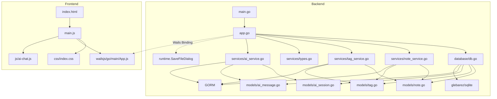

# Jot 项目分析报告

> 生成日期: 2026-07-04（更新 84）
> 项目类型: 桌面端卡片式笔记应用（类小米笔记）
> 技术栈: Wails v2 + Go + GORM + SQLite + 原生 HTML/CSS/JS + CodeMirror 6（编辑器）+ go-openai + ollama/ollama/api（AI 对话适配层）

---

## 一、目录结构梳理

```
jot/                                    # 项目根目录
├── main.go                             # 【入口文件】Wails 应用启动入口，配置窗口/资源/绑定
├── app.go                              # 【核心文件】Wails 绑定层，暴露 73 个 Go API 给前端
├── go.mod                              # Go 模块定义，声明依赖版本
├── go.sum                              # Go 依赖锁文件
├── wails.json                          # Wails 项目配置（名称/构建脚本/作者）
├── AGENTS.md                           # 本报告文件
│
├── internal/                           # 【内部包】Go 子包统一目录
│   ├── database/
│   │   └── db.go                       # SQLite 初始化（glebarez/sqlite 纯 Go 驱动）+ DefaultDBPath() 路径函数
│   ├── fontutil/
│   │   └── fonts_windows.go           # EnumFontFamiliesW API 封装
│   ├── models/
│   │   ├── note.go                     # Note 实体（笔记）
│   │   ├── tag.go                      # Tag 实体（标签）
│   │   ├── setting.go                  # Setting 实体（KV 配置）
│   │   ├── ai_session.go              # AI 会话实体（标题/置顶/时间戳）
│   │   └── ai_message.go              # AI 消息实体（角色/内容/思维链，外键关联 SessionID）
│   └── services/
│       ├── note_service.go             # 笔记 CRUD + 搜索 + 置顶 + 回收站 + 统计 + 导入导出 + VACUUM 瘦身 + GetAllIDs
│       ├── tag_service.go              # 标签管理 + 笔记标签关联 + 标签计数
│       ├── setting_service.go          # 配置读写
│       ├── ai_service.go               # AI 对话（自研 aicli 客户端，OpenAI 兼容/Ollama 双 Provider + 流式输出 + 深度思考 + 会话持久化 CRUD + 消息管理 + Token 后端计算 + 会话 Token 持久化）
│       └── types.go                    # 通用类型（PaginatedResult, DataStats, ImportResult 等）
│
├── frontend/                           # 【前端目录】Wails 前端（Vanilla + Vite）
│   ├── index.html                      # 入口 HTML，7 个视图
│   ├── package.json                    # 前端依赖（Vite 3.x + CM6 ~16 包 + marked + highlight.js + @codemirror/lang-* 6 包 + @codemirror/legacy-modes）
│   ├── src/
│   │   ├── main.js                     # 【核心文件】前端逻辑 ~6744 行（CM6 集成 + 搜索弹窗 + MD 语法页面 + AI 对话 + TOC + 回到顶部 + 批量管理；数据管理页/回收站页/常量工具函数/通知类/模拟数据已拆分为独立模块）
│   │   ├── js/                         # 【JS 模块目录】
│   │   │   ├── cm6-syntax-highlight.js # CM6 通用语法高亮模块（11 套配色 + 46+ 语言解析器映射）
│   │   │   ├── data-management.js      # 数据管理页面模块（10 个函数 + reloadSettings，从 main.js 提取）
│   │   │   ├── trash-page.js           # 回收站页面模块（6 个函数，从 main.js 提取）
│   │   │   ├── ai-chat.js              # AI 对话模块（自实现聊天引擎 + 流式输出 + Markdown 渲染 + 多会话管理 + 侧栏折叠 + 用户/助手消息操作按钮 + 消息右键上下文菜单 + 清空按钮常显 + 模型/深度思考切换 + 会话置顶 + 更多按钮下拉菜单 + 消息 Token 显示 + 思维链安全保存）
│   │   │   ├── constants.js            # 图标常量 SVGS + 工具函数（formatTime/highlightText/getSummary/debounce，从 main.js 提取）
│   │   │   ├── notification.js         # NotificationManager 通知类 + window.showNotification 全局函数 + 模拟数据（getMockNotes/getMockTags，从 main.js 提取）
│   │   │   └── preview-worker.js       # Web Worker 离线程 Markdown 渲染（从 src/ 移入）
│   │   └── css/                        # 【CSS 模块化目录】原 style.css (~4990 行) + app.css (~697 行) 拆分
│   │       ├── index.css               # 入口文件，@import 引入所有子文件（设计系统 → 组件）
│   │       ├── variables.css           # 12 主题 CSS 变量：`--bg`/`--accent`/`--text-primary` 等
│   │       ├── reset.css               # 全局 reset（box-sizing/body 边距/overscroll-behavior）
│   │       ├── scrollbar.css           # 统一滚动条 6px 细条 + 自动隐藏 + 透明轨道 + 主题变量联动（含主内容区/搜索/AI 对话消息列表）
│   │       ├── animations.css          # 13 个 keyframes + 通用工具类 `.anim-*` + stagger 延迟
│   │       └── components/
│   │           ├── topbar.css          # 顶栏（品牌/搜索框/窗口控制按钮/更多菜单含图标）
│   │           ├── main-content.css    # 主内容区布局（卡片网格/视图容器/滚动）
│   │           ├── sidebar.css         # 笔记本侧边栏三段式设计 + 折叠按钮
│   │           ├── editor.css          # 编辑器面板/CM6 主题/全屏/预览/代码块复制按钮
│   │           ├── dropdowns.css       # 右键菜单/更多菜单/下拉选择器
│   │           ├── modals.css          # 通用模态框/确认弹窗/覆盖层/快捷键页面样式（shortcut-row flex 水平布局）
│   │           ├── settings-panel.css  # 设置页分段控件/开关/按钮
│   │           ├── search-modal.css    # 搜索弹窗/结果列表/高亮
│   │           ├── data-view.css       # 数据管理信笺风格统计 + 操作卡片
│   │           ├── md-reference.css    # MD 语法手册卡片源码/预览双栏对照
│   │           └── ai-chat.css         # AI 对话页面（气泡/输入区/Markdown 渲染/代码高亮/打字指示器/会话侧栏/折叠按钮/滚动条自动隐藏/消息居中响应式宽度 clamp(800px,92vw,1600px)/32px 间距）
│   ├── wailsjs/                        # Wails 自动生成的 JS 绑定
│   │   └── go/main/
│   │       ├── App.js                  # 后端 API 的 JS 封装
│   │       ├── App.d.ts               # TypeScript 类型定义
│   │       └── models.ts              # Go 模型的 TS 类型
│   └── dist/                           # Vite 构建产物（前端编译输出）
│
└── .trae/specs/                        # 项目 Spec 文档目录
    ├── add-about-page/               # 关于页面规格
    ├── add-batch-tagging/            # 批量标签操作
    ├── add-calendar-date-picker/     # 日历日期选择器
    ├── add-card-note-app/            # 初始需求规格
    ├── add-code-lang-badge/          # 代码块语言标签
    ├── add-data-management/          # 数据管理功能规格
    ├── add-draft-auto-save/          # 草稿自动保存
    ├── add-draft-cleanup-on-exit/    # 退出清理草稿
    ├── add-drag-drop-import/         # 拖拽导入文件
    ├── add-editor-and-undo-features/ # 编辑器和撤销功能
    ├── add-editor-tweaks/            # 编辑器微调
    ├── add-find-replace/             # 查找替换功能
    ├── add-font-settings/            # 字体设置功能规格
    ├── add-frameless-window/         # 无边框窗口
    ├── add-md-editor/                # MD 编辑功能
    ├── add-md-formatting-toolbar/    # MD 格式化工具栏
    ├── add-md-ref-try-button/        # MD 语法打开编辑器试试按钮（已完成）
    ├── add-md-reference-page/        # MD 语法手册页面（已完成）
    ├── add-md-rendering/             # Markdown 渲染查看规格
    ├── add-misc-improvements/        # 杂项优化规格
    ├── add-note-file-ext/            # 笔记文件后缀字段（.txt/.md）
    ├── add-note-type/                # 笔记类型（纯文本/Markdown）
    ├── add-notebook-system/          # 笔记本系统
    ├── add-notes-move-notebook/      # 笔记迁移笔记本
    ├── add-one-click-backup-restore/ # 一键备份还原规格
    ├── add-quick-note-mode/          # 快速笔记模式规格
    ├── add-save-success-notification/ # 保存成功通知
    ├── add-search-filters/           # 搜索筛选器
    ├── add-search-modal-sort-dropdown/ # 搜索弹窗排序下拉菜单（已完成）
    ├── add-sort-pagination/          # 排序分页设置
    ├── add-table-copy-button/        # 表格复制按钮
    ├── add-theme-system/             # 主题系统
    ├── add-toolbar-toggle-setting/   # MD 工具栏开关设置（已完成）
    ├── add-view-mode-toggle-from-edit/ # 查看/编辑模式返回按钮
    ├── add-web-worker-rendering/     # Web Worker 离线程渲染
    ├── db-backup-restore/            # 数据库备份还原
    ├── editor-header-compact/        # 编辑器头部紧凑化
    ├── elevate-visual-refinement/    # UI 视觉品质升级
    ├── enhance-interaction-animation/ # 交互体验与动画增强
    ├── fix-cm6-horizontal-scrollbar-gutter/ # CM6 水平滚动条遮挡行号修复（已完成）
    ├── fix-date-picker-auto-close/   # 日期选择器自动关闭修复
    ├── fix-drag-drop-notebook-scope/ # 拖拽导入笔记本作用域修正（已完成）
    ├── fix-fullscreen-cover-custom-titlebar/ # 全屏模式遮挡标题栏修复（已完成）
    ├── fix-preview-scrollbar/        # 预览模式滚动条修复（已完成）
    ├── fix-viewmode-fullscreen-halfheight/ # 查看模式全屏半高修复（已完成）
    ├── integrate-codemirror-6/       # CodeMirror 6 编辑器集成（已完成）
    └── lazy-content-loading/         # 懒加载 Content 优化（已完成）
    ├── move-menu-to-left/            # 更多菜单移至左上角
    ├── move-search-to-modal/         # 搜索移至弹窗
    ├── polish-search-modal-animation/ # 搜索弹窗动画优化
    ├── redesign-data-management/     # 数据管理页面 UI 重构与动画增强
    ├── redesign-ui/                  # UI 重新设计
    ├── redesign-ai-session-sidebar/  # AI 会话侧边栏重新设计（已完成）
    ├── refine-search-modal-ui/       # 搜索弹窗 UI 优化
    ├── remove-auto-save-draft/       # 移除草稿自动保存
    ├── remove-edit-mode-auto-save/   # 移除编辑模式自动保存
    ├── replace-quikchat-with-custom-ai-chat/ # 自实现 AI 对话组件 + 流式输出（已完成）
    ├── fix-ai-sessions-and-collapsible-sidebar/ # AI 会话持久化 + 多会话 + 侧栏折叠（已完成）
    ├── add-ai-session-pin/           # AI 会话侧栏置顶功能
    ├── fix-data-page-scrollbar/          # 数据管理页面全屏滚动条修复（已完成）
    ├── restructure-internal-packages/ # 内部包重构
    ├── simplicity-date-filter/         # 时间筛选简化（日历→下拉菜单）
    ├── skip-quicknote-animation-on-start/ # 快速笔记启动跳过动画
    ├── unify-app-scrollbars/           # 统一应用滚动条样式（已完成）
    └── unify-notification-system/    # 统一通知系统
```

### 目录规范评价

| 维度 | 评价 |
|------|------|
| **分层清晰度** | 优秀。严格按 `models → services → database → app` 分层，前端后端隔离清晰 |
| **命名规范** | 良好。目录名使用复数形式（models/services），符合 Go 社区惯例 |
| **冗余目录** | 无。每个目录职责单一，无多余层级 |
| **待改进** | frontend/dist 为构建产物，应加入 .gitignore |

---

## 二、核心功能模块识别

### 2.1 基础支撑模块

| 模块名称 | 核心功能 | 对应文件 | 核心依赖 |
|----------|----------|----------|----------|
| **数据库初始化模块** | SQLite 连接建立、连接池配置、AutoMigrate | `database/db.go` | glebarez/sqlite, GORM |
| **数据模型层** | Note/Tag/Setting/ AISession/AIMessage 实体定义、GORM tag 映射 | `models/note.go`, `models/tag.go`, `models/setting.go`, `models/ai_session.go`, `models/ai_message.go` | GORM |
| **通用类型** | 分页返回格式、统计数据、导入导出结构 | `services/types.go` | 无外部依赖 |
| **Wails 绑定层** | Go API → JS Bridge，含 runtime.SaveFileDialog | `app.go` | Wails v2 binding + runtime |
| **前端构建** | Vite 打包、Wails dev 热重载 | `frontend/package.json`, `wails.json` | Vite 3.x（保留，未移除）|
| **前端构建流程** | `wails build` 自动执行 `npm run build`（Vite）→ `frontend/dist/`，再嵌入 Go 二进制 | `go:embed all:frontend/dist` | 前端构建和后端编译都由 `wails build` 一条命令完成 |
| **字体枚举** | Windows GDI EnumFontFamiliesW 系统字体枚举 | `fontutil/fonts_windows.go` | gdi32.dll / user32.dll (syscall) |
| **配置存储** | KV 结构配置读写（字体偏好等） | `services/setting_service.go` | GORM |
| **路径工具** | 数据库默认路径 `~/.jot/data/jot.db` | `database/db.go:DefaultDBPath()` | `os.UserHomeDir()` |

### 2.2 业务核心模块

| 模块名称 | 核心功能 | 对应代码 | 核心输入 | 核心输出 |
|----------|----------|----------|----------|----------|
| **笔记 CRUD** | 创建/更新/查询/删除笔记 | `services/note_service.go` | 标题/内容/颜色/ID | Note 对象/错误 |
| **笔记搜索** | 标题+内容 LIKE 模糊搜索，支持 3 种排序（updated_at/created_at/title，均 pinned DESC 优先）| `note_service.go:Search()` | 关键词/分页/sortBy 参数 | 笔记列表+总数 |
| **笔记置顶** | 切换置顶状态 | `note_service.go:TogglePin()` | 笔记 ID | 更新后的笔记 |
| **回收站** | 软删除/查看/恢复/永久删除 | `note_service.go:Delete/GetTrash/Restore/PermanentDelete` | 笔记 ID | 操作结果 |
| **批量回收站操作** | 全部恢复/全部清空 | `note_service.go:RestoreAll/EmptyTrash` | — | 操作结果 |
| **标签管理** | 标签 CRUD | `services/tag_service.go` | 名称/颜色/ID | Tag 对象 |
| **笔记标签关联** | 为笔记添加/移除标签 | `tag_service.go:AddTagToNote/RemoveTagFromNote` | 笔记ID+标签ID | 操作结果 |
| **按标签筛选** | 通过标签 ID 查询笔记 | `note_service.go:GetByTag()` | 标签ID/分页参数 | 笔记列表+总数 |
| **数据统计** | 统计笔记总数/回收站数/标签数 | `note_service.go:GetStats()` + `tag_service.go:Count()` | — | DataStats 对象 |
| **数据导出为 .db** | 导出为 SQLite 数据库文件（VACUUM INTO + fs.CopyEx）| `app.go:ExportDataWithDialog()` | — | "导出成功" 提示 |
| **数据导入** | 从 JSON 文件导入笔记（跳过同名） | `note_service.go:ImportFromJSON()` | JSON 字节数组 | ImportResult 对象 |
| **前端卡片渲染** | 卡片网格展示 | `frontend/src/main.js` | 笔记数据数组 | DOM 渲染 |
| **前端编辑器** | 笔记编辑模态框（CM6 编辑器，支持行号/撤销重做/查找替换/Tab缩进/自动补全/自动闭合括号/Markdown 语法高亮） | `frontend/src/main.js` | 笔记数据/用户输入 | 保存/取消 |
| **前端查找替换** | CM6 search panel，Ctrl+F 查找 / Ctrl+H 查找替换，选中内容自动填充搜索框，预览模式自动切回编辑模式搜索 | `frontend/src/main.js:handleKeyboardNavigation()` | 搜索关键词 | 搜索面板匹配导航 |
| **前端搜索交互** | 搜索弹窗 200ms 防抖自动搜索，支持标题/内容/标签（多标签 AND 语义过滤）、笔记本/日期/排序筛选器（排序 3 选项：更新时间/创建时间/名称，均 pinned 优先） | `frontend/src/main.js` | 关键词 + 过滤条件 + sortBy | 搜索弹窗结果列表 |
| **前端导航切换** | 网格/搜索/设置/数据管理/回收站/AI 助手视图切换 | `frontend/src/main.js:switchView()` | 视图名称 | 视图 DOM 切换 |
| **前端右键菜单** | 右键弹出菜单（查看/编辑/置顶/删除） | `frontend/src/main.js` | 鼠标事件+笔记ID | 菜单显示/操作 |
| **前端只读查看** | 左击笔记打开只读查看器 | `frontend/src/main.js:openEditor()` | 笔记 ID | 只读查看模态框 |
| **标签搜索** | 点击标签 chip 打开搜索弹窗并预选该标签筛选器 | `frontend/src/main.js:searchByTag()` | 标签 ID | 搜索弹窗结果列表 |
| **键盘快捷键** | Ctrl+F 编辑器搜索 / Ctrl+H 编辑器查找替换 / Ctrl+N 新建 / Ctrl+L 编辑器切换模式 / PgUp/PgDn 滚动 / Ctrl+Home/End / Ctrl+数字键 1-9 导航（Ctrl+7 切换快捷键页开关） | `frontend/src/main.js:handleKeyboardNavigation()` | 键盘事件 | 对应操作 |
| **版本号信息** | 返回 verman.V.GitVersion 纯版本号 | `app.go:GetVersion()` | — | 版本字符串 |
| **打开外链** | 调用 runtime.BrowserOpenURL 在默认浏览器打开链接 | `app.go:OpenProjectURL()` | URL 字符串 | — |
| **打开数据目录** | 在文件管理器中打开 `~/.jot/data/` | `app.go:OpenDataDir()` | — | explorer 文件管理器 |
| **一键备份** | 备份当前库到 `~/.jot/backup/jot-backup.db`（覆盖）| `app.go:BackupToDir()` | — | 备份成功提示 |
| **一键还原** | 从 `jot-backup.db` 还原并刷新笔记/标签/统计 | `app.go:RestoreFromDir()` | — | Toast 提示结果 |
| **外观设置** | 字体族下拉选择（搜索+键盘导航）+ 字体大小预设/自定义 + 主题选择（12 种）+ 主题预览迷你 UI 卡片 | `frontend/src/main.js:loadFontSettings/applyFontFamily/applyFontSize` + `loadThemeSetting` | 字体名称/大小/主题名称 | 更新 CSS 变量 |
| **AI 对话** | 自研 aicli 客户端，支持 OpenAI 兼容 + Ollama 双 Provider 流式对话（自实现聊天引擎 + Markdown/代码高亮渲染 + 多会话管理 + 会话置顶 + 更多按钮下拉菜单） | `services/ai_service.go` + `aicli/` + `frontend/src/js/ai-chat.js` + `frontend/src/css/components/ai-chat.css` | 用户消息 | AI 流式回复 |
| **AI 配置管理** | Base URL/API Key/Model 的读写 + 连通性测试 + 模型列表获取 | `app.go:GetAIConfig/SaveAIConfig/TestBaseURL/FetchAIModels` | 配置项 | 配置/测试结果 |
| **统一通知系统** | NotificationManager 单例类，右上角浮动通知，4 种类型 + undo 撤销 | `frontend/src/js/notification.js` | 消息/类型/回调 | 通知 DOM 创建与自动销毁 |

### 2.3 模块分层图

```
┌─────────────────────────────────────────────────────┐
│                    Frontend                          │
│  (main.js / css/index.css / index.html)               │
│   ├─ 视图渲染 (卡片/搜索/设置/数据管理/回收站/AI)     │
│   ├─ 交互逻辑 (事件绑定/状态管理)                      │
│   └─ Wails Bridge (window.go.main.App.*)              │
└────────────────────────┬────────────────────────────┘
                         │ Wails Binding (JSON 序列化)
┌────────────────────────▼────────────────────────────┐
│              App 层 (app.go)                         │
│  38+ 个绑定方法（CRUD/搜索/置顶/回收站/统计/导入导出/路径/│
│   AI 配置/会话管理/消息管理)                          │
│  (含 runtime.SaveFileDialog 原生对话框调用)            │
└────────────────────────┬────────────────────────────┘
                         │
              ┌──────────┼──────────┐
              ▼          ▼          ▼
    ┌─────────────┐ ┌──────────┐ ┌──────────────┐
    │ NoteService │ │TagService│ │  AI Service  │
    │ (CRUD/搜索/ │ │(CRUD/关联)│ │ (AI 流式对话 │
    │  置顶/回收站 │ │          │ │  会话管理    │
    │  统计/导入   │ │          │ │  消息持久化) │
    │  导出)      │ │          │ │              │
    └──────┬──────┘ └─────┬────┘ └──────┬───────┘
           │              │             │
           └──────┬───────┴──────┬──────┘
                  ▼              ▼
        ┌─────────────────┐ ┌─────────────────┐
        │    GORM ORM     │ │   GORM ORM     │
        │ (数据访问层)      │ │ (AI 模型层)     │
        └────────┬────────┘ └────────┬───────┘
                 ▼                   ▼
        ┌──────────────────────────────┐
        │          SQLite              │
        │   (glebarez/sqlite 纯 Go 驱动)│
        └──────────────────────────────┘
```

---

## 三、模块间依赖关系分析

### 3.1 依赖关系详表

| 依赖方 | 被依赖方 | 依赖类型 | 依赖详情 |
|--------|----------|----------|----------|
| `app.go` | `database` | 编译依赖 | 调用 `database.InitDB()` 获取 `*gorm.DB` 实例 |
| `app.go` | `services` | 编译依赖 | 创建 `NoteService` / `TagService` / `SettingService` 实例 |
| `app.go` | `models` | 编译依赖 | 返回 `*models.Note` / `*models.Tag` / `*models.Setting` 类型 |
| `app.go` | `runtime` | 编译依赖 | `runtime.SaveFileDialog` 原生保存对话框 |
| `app.go` | `fontutil` | 编译依赖 | `fontutil.GetFonts()` 枚举系统字体 |
| `services` | `models` | 编译依赖 | 操作 Note/Tag/Setting/AISession/AIMessage 结构体 |
| `services` | GORM | 编译依赖 | `*gorm.DB` 数据库操作 |
| `database` | `models` | 编译依赖 | `AutoMigrate(&models.Note{}, &models.Tag{}, &models.Setting{}, &models.AISession{}, &models.AIMessage{})` |
| `database` | glebarez/sqlite | 编译依赖 | 纯 Go SQLite 驱动 |
| `fontutil` | gdi32/user32 | 运行时依赖 | syscall 调用 Windows GDI API |
| `frontend/main.js` | `wailsjs/go/main/App.js` | 运行时调用 | `window.go.main.App.*` 调用后端 API |
| `frontend/wailsjs` | `app.go` | 构建时生成 | `wails generate module` 自动生成 |

### 3.2 依赖关系图（Mermaid）



### 3.3 依赖问题分析

| 问题类型 | 描述 | 严重程度 |
|----------|------|----------|
| **循环依赖** | 无。所有依赖为单向 `main → app → services → models`，无循环 | ✅ 无问题 |
| **过度依赖** | 无。每个 Service 仅依赖 `*gorm.DB` 和自身模型 | ✅ 无问题 |
| **依赖缺失** | 无。`go.sum` 中所有传递依赖完整 | ✅ 无问题 |
| **隐式依赖** | 前端 `window.go` 对象依赖 Wails 运行时注入，本地开发/独立预览时不可用 | ⚠️ 有降级处理（Mock 数据） |
| **编译期依赖 vs 运行时依赖** | `wailsjs/` 目录需在修改 `app.go` 后重新生成 | ⚠️ 需手动执行 `wails generate module` |

---

## 四、设计模式与实现逻辑

### 4.1 设计模式识别

| 模式名称 | 应用位置 | 说明 | 代码示例 |
|----------|----------|------|----------|
| **Service Layer 模式** | `services/` 包 | 将业务逻辑从 controller（app.go）中抽离，封装为独立 Service 结构体 | `NoteService` / `TagService` |
| **依赖注入 (DI)** | `app.go` | Service 依赖的 `*gorm.DB` 通过构造函数注入 | `NewNoteService(db)` / `NewTagService(db)` |
| **Repository 模式** | `services/` 包内嵌 GORM | Service 内部直接使用 GORM 作为数据访问层 | `s.db.Create()` / `s.db.Where()` |
| **单例模式 (应用级)** | App 结构体 | Wails 运行时保证 App 实例唯一 | `NewApp()` 在 `main()` 中仅调用一次 |
| **MVC 变体** | 整体架构 | Model(models) - View(frontend) - Controller(app.go + services) 分层 | 见分层图 |
| **降级策略 (Fallback)** | `frontend/main.js` | 后端未绑定时自动使用 Mock 数据 | `if (!window.go.main.App.GetNotes) { state.notes = getMockNotes(); }` |
| **Wails Runtime 集成** | `app.go` | 通过 runtime 包调用原生桌面功能 | `runtime.SaveFileDialog()` 弹出系统保存对话框 |

### 4.2 核心业务逻辑流程

#### 4.2.1 笔记创建流程

```
用户点击 "+" 按钮 / Ctrl+N
  → openEditor(null)          // 打开空编辑器模态框
    → 用户填写标题/内容/选择颜色/选择标签
    → 点击"保存"按钮
      → createNote()
        → 前端校验（标题不为空）
        → window.go.main.App.CreateNote(title, content, color)
          → app.go:CreateNote()
            → noteService.Create()          // GORM db.Create(&note)
            → 返回 *models.Note（含 id）
          → 遍历 selectedTags
            → window.go.main.App.AddTagToNote(note.id, tagId)
              → tagService.AddTagToNote()   // GORM Association("Tags").Append
        → closeEditor()                     // 关闭模态框
        → loadNotes()                       // 重新加载笔记列表
          → GetNotes(1, 100)                // 分页查询
          → renderCardGrid()                // 渲染右侧卡片网格
```

#### 4.2.2 笔记搜索流程

```
Ctrl+F / Ctrl+K → 打开搜索弹窗
  → els.searchModalInput 自动聚焦
  → 用户输入文字 → 200ms 防抖
    → searchModalLoadPage(1, false)
```

...（中间流程不变）

---

## 五、技术栈评估

### 5.1 技术栈清单

| 层级 | 技术 | 版本 | 用途 |
|------|------|------|------|
| **桌面框架** | Wails v2 | v2.9.2 | 桌面窗口 + Go ↔ JS Bridge |
| **后端语言** | Go | go1.22+ | 后端业务逻辑 |
| **数据库** | SQLite | — | 本地数据存储 |
| **数据库驱动** | glebarez/sqlite | v1.11 | 纯 Go SQLite 驱动（无 CGO） |
| **ORM** | GORM | v1.25 | 对象关系映射 |
| **前端构建** | Vite | v3.2.11 | 前端打包工具 |
| **前端技术** | 原生 HTML/CSS/JS | — | UI 渲染 |
| **编辑器** | CodeMirror 6 | @codemirror/view v6.26 | 笔记编辑器 |
| **Markdown 解析** | marked | v12.0 | Markdown → HTML 渲染 |
| **代码高亮** | highlight.js | v11.10 | 代码块语法高亮 |
| **AI 对话** | LangChainGo | github.com/tmc/langchaingo v0.1.14 | 统一 LLM 接口，支持 OpenAI 兼容 + Ollama 双 Provider |
| **本地存储** | localStorage | — | UI 状态持久化（主题/侧栏状态等） |

### 5.2 技术栈选型评价

| 评价维度 | 说明 |
|----------|------|
| **合理性** | Wails v2 适合桌面端 Go 应用，原生 HTML/CSS/JS 避免前端框架学习成本 |
| **性能** | SQLite + GORM 组合满足本地笔记应用性能需求，流式输出不阻塞 UI |
| **维护性** | 前后端分层清晰，CSS 模块化拆分降低维护成本 |
| **可扩展性** | 新增功能只需添加 binding 方法和前端模块，架构本身无限制 |
| **风险** | Wails v2 社区较小，Wails v3 路线图不明确，长期维护可能受限 |

### 5.3 版本兼容性问题

| 问题 | 说明 |
|------|------|
| **Wails 版本锁定** | `go.mod` 中 `wails.io v2.9.2` 已固定，`wails/v2` 包需与 Wails CLI 版本匹配。升级需同步更新 CLI, go.mod, wails.json 三方 |
| **GORM AutoMigrate** | 新增模型（如 AISession/AIMessage）后需在 `database/db.go` 的 `AutoMigrate` 中注册，否则表不会自动创建 |

---

## 六、补充分析

### 6.1 扩展性评估

| 扩展方向 | 可行性 | 建议 |
|----------|--------|------|
| **多用户/云端同步** | 低 | 如需云端同步，建议引入 WebDAV/第三方同步库 |
| **AI 功能扩展** | 高 | 当前 AI 会话架构（Session + Message 模型）天然支持多会话切换和上下文管理，易于扩展。新增方法直接注册 binding 到 app.go 即可 |
| **国际化 (i18n)** | 中 | 所有 UI 文本硬编码在 HTML/JS 中，需统一抽离 |
| **插件系统** | 低 | 原生 HTML 架构不适合动态加载插件 |

### 6.2 性能关键点

| 关键点 | 现状 | 评估 |
|--------|------|------|
| **数据库查询** | GORM + SQLite，分页查询 | ✅ 满足笔记本规模 |
| **前端渲染** | 卡片网格渲染 | ✅ 性能良好 |
| **AI 流式输出** | 基于 Wails Events 逐块推送，不阻塞 UI | ✅ 体验优秀 |
| **CM6 编辑器** | 仅初始化当前编辑的笔记 | ✅ 性能良好 |
| **多会话切换** | 切换时从后端加载对应会话的消息，每次只渲染当前会话 | ✅ 符合预期 |

### 6.3 异常处理分析

| 异常场景 | 处理方式 |
|----------|----------|
| **后端 API 不可用** | 前端 Mock 数据降级 |
| **AI API 调用失败** | 错误消息以 AI 消息气泡展示在对话中 |
| **数据库损坏** | 备份还原机制 |
| **流式连接中断** | 前端监听 `ai:stream-error` 事件，显示错误提示 |
| **会话/消息查询失败** | 返回空列表 + 控制台错误日志，不阻断 UI |

### 6.4 安全分析

| 风险点 | 评估 |
|--------|------|
| **本地数据库** | SQLite 文件本地存储，无远程访问风险 |
| **API Key 存储** | 明文存储在 Setting KV 表中，未加密 |
| **XSS 风险** | AI 回复经 `marked.parse()` 渲染，`marked` 默认 Sanitize |

---

## 七、项目核心特点

### 核心设计理念

1. **Wails v2 跨平台桌面应用**：Go + 原生前端（HTML/CSS/JS）架构，兼顾后端性能和前端灵活性

2. **CodeMirror 6 编辑器集成**：主流 Markdown 编辑器引擎，支持行号/撤销重做/查找替换/Tab缩进/自动补全/语法高亮（11 套配色 + 46+ 语言）

3. **CSS 变量主题系统（12 主题）**：全局 CSS 变量联动（`--bg`/`--accent`/`--border` 等），一键切换 12 套系统主题 + 11 套代码高亮主题，所有组件自动适配

4. **三步交互范式**：笔记本（容器）→ 笔记卡片（列表）→ 编辑器（操作），符合直觉的文件夹-文件-编辑结构

5. **自实现 AI 对话引擎（LangChainGo 驱动）**：基于 LangChainGo 统一 LLM 接口，支持 OpenAI 兼容（DeepSeek、通义千问等）和 Ollama 本地模型双 Provider。流式输出 + Markdown 渲染 + 代码高亮 + 思维链折叠 + 多会话管理 + 侧栏折叠。Provider 通过前端设置页下拉切换，配置自动持久化。

6. **统一的通知系统**：NotificationManager 单例，右上角浮动通知，支持 success/error/warning/info 四种类型 + undo 撤销

7. **过度动画与交互反馈**：13 个 keyframes、stagger 延迟、hover 分层反馈、spring 弹性缓动、骨架屏 shimmer

8. **无 UI 框架依赖**：无 Vue/React/Svelte，纯手写 DOM 操作，极致轻量

### 设计系统

- **尺寸**：`--radius-md`(8px) / `--radius-sm`(6px)，全局统一
- **间距**：4px 基线网格，组件内部 8-16px，布局 16-24px
- **阴影**：4 层 Token — `elevated`(卡片) / `dropdown`(下拉菜单) / `modal`(模态框) / `toast`(通知)
- **语义色**：`--success`(绿) / `--warning`(黄) / `--error`(红) / `--info`(蓝)
- **字体**：全局统一 `var(--font-family)`，编辑器和代码块跟随系统设置
- **滚动条**：6px 细条，`--scrollbar-thumb` / `--scrollbar-thumb-hover` 联动 12 主题
- **圆角一致性**：所有交互元素（按钮/卡片/输入框/下拉菜单/模态框）均使用 `var(--radius-sm)` 或 `var(--radius-md)`，无硬编码

### 关键文件统计

| 文件 | 行数（约） | 说明 |
|------|-----------|------|
| `frontend/src/main.js` | 6744 | 前端核心逻辑（含批量管理 + TOC + 回到顶部） |
| `frontend/src/css/components/ai-chat.css` | 2459 | AI 对话全部样式（含引用笔记浮层/chip/骨架屏动画/标签筛选/条目标签 badge/下拉菜单/置顶状态） |
| `frontend/src/js/ai-chat.js` | 3328 | AI 对话 JS 逻辑（含引用笔记选择器/上下文注入/标签筛选/更多按钮下拉菜单/会话置顶） |
| `app.go` | 1356 | Wails 绑定层（73+ API） |
| `frontend/src/css/components/modals.css` | 746 | 弹窗样式（批量标签/确认框/关于/快捷键/通知） |
| `services/ai_service.go` | ~360 | AI 对话服务层（自研 aicli 客户端接入） |
| `internal/aicli/client.go` | ~130 | AI 客户端统一入口 |
| `internal/aicli/openai.go` | ~130 | OpenAI 兼容 API 客户端 |
| `internal/aicli/ollama.go` | ~110 | Ollama 原生 API 客户端 |
| `internal/aicli/extract.go` | ~80 | gjson 流式字段提取工具 |
| `internal/aicli/types.go` | ~90 | 客户端类型定义 |
| `services/note_service.go` | 568 | 笔记 CRUD 服务 + 引用上下文构建 |
| `services/types.go` | ~30 | 通用类型（含 NoteRefInfo/NoteRefContext） |
| `frontend/src/css/variables.css` | 210 | 12 主题 CSS 变量 |

---

## 八、待优化点

### 中期优化

- **虚拟列表支持**：AI 对话消息较多时，使用 IntersectionObserver 虚拟化

### 架构层面

- **代码分割**：main.js 可继续拆分为独立视图模块
- **CSS 变量颜色 Token**：AI 对话页面的配色确认已全部纳入主题系统

### 已实现

- [x] **CSS 模块化拆分**（variables, reset, scrollbar, animations + 6 组件模块）
- [x] **AI 对话自实现**（流式输出 + Markdown 渲染 + 思维链 + 代码高亮 + 多会话 + 侧栏折叠）
- [x] **笔记软删除与回收站**（Trash/Restore/PermanentDelete/RestoreAll/EmptyTrash）
- [x] **Markdown 语法手册页面**（10 张语法卡片 + 双栏源码/预览 + 打开编辑器试试）
- [x] **12 系统主题 + 11 代码高亮主题**（统一 CSS 变量体系）
- [x] **搜索弹窗**（200ms 防抖 + 笔记本/日期/排序/标签筛选器）
- [x] **一键备份/还原**（BackupToDir/RestoreFromDir + VACUUM）
- [x] **返回查看/保存脏检测**（无变更不触发保存 + 不弹出通知）
- [x] **数据库瘦身 VACUUM**（数据管理页面按钮触发）
- [x] **字体设置**（族+大小，联动 CSS 变量）
- [x] **通知系统**（右上角 NotificationManager，4 种类型 + undo 撤销）
- [x] **更多菜单**（7 个选项，`min-width: 120px`）
- [x] **数字键导航**（Ctrl+数字键 1-9）
- [x] **快捷键说明页**（Ctrl+7 打开，可滚动列表）
- [x] **拖拽导入闪烁动画**（3 次红色慢闪）

---

## 九、关键记忆点

1. **Wails v2 事件驱动流式输出**：AI 回复流式数据传输使用 `runtime.EventsEmit`（Go 端）+ `EventsOn`（前端），Go 端 `bufio.Reader` 逐行解析 SSE `data: {...}` 流，通过回调（`onChunk`/`onThinking`/`onDone`/`onError`）逐块推送。前端在 `onSend()` 中动态注册一次性事件回调（`Array.from` 包裹闭包捕获局部变量），每个请求各自独立的 `streamingContent`/`streamingEl`/`lastReasoningEl` 局部变量隔离，防止多消息冲突

2. **思维链折叠**：深度思考模型返回 `delta.reasoning_content`，Go 端在 `streamChoice.Delta` 中解析此字段，通过 `onThinking` 回调和 `ai:stream-thinking` 事件推送。前端创建 `<details class="ai-thinking">` 可折叠区域（summary + 内容），首次 thinking chunk 懒创建，后续流式追加，`addMessage()` 也接受 `reasoningContent` 参数用于显式渲染

3. **AI 会话持久化**：`AISession` + `AIMessage` 两个 GORM 模型（`ai_session.go`/`ai_message.go`），`SaveAIMessages()` 保存一轮对话并自动生成标题（取首条用户消息前 30 字），`LoadAISessionMessages()` 按 `CreatedAt` 升序返回历史消息，`ClearAISessionMessages()` 删除指定会话全部消息

4. **AI 对话侧栏 + 折叠机制**：左右分栏布局（`.ai-chat-layout`），左侧 `.ai-session-sidebar`（220px），右侧 `.ai-chat-content` flex:1。折叠按钮（`.ai-sidebar-toggle`）为 14×44px 纤细条状，置于侧栏外作为兄弟元素，通过兄弟选择器 `~` 控制 `left` 定位（展开时 220px、折叠时 0）。展开时按钮左侧加 `border-left: 1px solid var(--border)` 延续分割感。折叠状态 `localStorage` 持久化，CSS `transition: width 0.25s ease` 动画。SVG Chevron 图标（Lucide 风格）替代 Unicode 字符

5. **`onAIChatViewActivated` 惰性加载**：仅在 `activeSessionId === null`（无活跃会话）时自动加载第一个会话，视图切换不重置当前会话状态，避免切换回来后消息错乱。`switchSession()` 按 `msg.role` 遍历渲染，`Message` 结构体含 `ReasoningContent` 字段

6. **CSS 变量系统**：全局使用 `var(--xxx)` 定义主题变量，AI 对话页面全组件（气泡/侧栏/输入区/按钮）联动 12 套主题

7. **LangChainGo 统一 AI 接口**：`CallAIStream` 使用 `llms.GenerateContent` + `WithStreamingFunc`/`WithStreamingReasoningFunc` 统一流式输出。`createLLM()` 工厂函数根据 `provider` 字段创建对应 LLM 实例：`openai.New()`（OpenAI 兼容，含 BaseURL/Token/Model 配置）或 `ollama.New()`（Ollama 本地，含 ServerURL/Model 配置）。前端设置页新增「服务商」下拉选择器，切换时自动填充默认 URL、清空模型、保存配置。

8. **消息渲染与气泡**：`addMessage()` 创建消息气泡 DOM，AI 侧使用 `marked.parse()` 渲染 Markdown（含 `hljs.highlightElement()` 代码高亮），用户侧以 `<pre class="ai-user-msg">` 转义纯文本。打字指示器内嵌到 `msg-content` 内部（不独立建气泡）

---

## 十、新增记忆点（CodeMirror 6 集成）

| 记忆点 | 内容 |
|--------|------|
| **CM6 初始化流程** | `initCodeMirror()` 在 `openEditor()` 中调用：`new EditorView()` → `updateListener` 更新字数 → 自定义 Tab（2 空格）→ 快捷键 Ctrl+B/I/U/Shift+Enter（软换行）。`setEditorContent()` 设置内容，`getEditorContent()` 获取内容 |
| **Markdown 语法高亮** | 使用 `@codemirror/lang-markdown` 包，通过 `markdown()` 扩展启用。`initCodeMirror()` 中引入 `syntaxHighlights` 主题映射和 `languagePluginMap` 语言解析器映射 |
| **CM6 重初始化模式** | 在 `applyCodeHighlightTheme()` 或更新语言解析器时，执行：`cmEditor.destroy()` → `cmEditor = null` → `container.innerHTML = ''` → 重新 `initCodeMirror()` |
| **通用高亮模块（cm6-syntax-highlight.js）** | 11 套代码高亮配色通过 `HighlightStyle.define()` + `syntaxHighlights` 映射注册。`languagePluginMap` 覆盖 46+ 语言解析器。`cm6-syntax-highlight.js` 暴露 `applyCodeHighlightTheme()` 和 `cm6InitCodeMirror()`（供 main.js 中 `initCodeMirror()` 调用）|
| **编辑器/预览切换** | `toggleEditorMode()` 切换 CM6 编辑 / Markdown 渲染预览，`els.editorOverlay.dataset.mode = 'edit'|'preview'|'view'` 模式标识 |
| **CM6 只读查看模式** | `openEditor(noteId, readonly=true)` 设置 `cmEditor.dom.contentEditable = false`，禁用编辑但保持语法高亮 |
| **代码块复制按钮** | 预览模式/查看模式中，hover `pre code` 时右上角显示复制按钮（`.copy-code-btn`），点击复制内容到剪贴板 |

---

## 十一、新增记忆点（搜索弹窗系统）

| 记忆点 | 内容 |
|--------|------|
| **初始化** | `initSearchModal()` 绑定事件，排序下拉 `change`、筛选器 `change`、关闭按钮、覆盖层关闭、键盘 Esc 关闭 |
| **安全更新** | `safeUpdateSearchResults()` 用 `DocumentFragment` 一次插入、`scrollTo(0,0)` 重置滚动、`innerHTML = ''` 清楚旧结果 |
| **筛选器功能** | `initFilterDropdowns()` 统一处理笔记本/日期范围/排序三选下拉（toggle/dropdown/items）。笔记本/标签筛选器选中后点击同一项取消选中。笔记本筛选器默认"全部笔记本"。日期默认为"全部时间"。标签筛选器在 `searchModalLoadPage()` 加载结果时同步加载 |

---

## 十二、设置页开发规范

### 新增设置项 Checklist

#### Step 1: HTML — 在 `index.html` 中添加 toggle/控件
```html
<div class="setting-item">
    <div class="setting-item-left">
        <div class="setting-item-label">设置名称</div>
        <div class="setting-item-desc">设置描述</div>
    </div>
    <div class="setting-item-right">
        <label class="toggle-switch">
            <input type="checkbox" id="xxxToggle">
            <span class="toggle-slider"></span>
        </label>
    </div>
</div>
```

#### Step 2: DOM 引用 — 在 `els` 对象中添加引用
在 `main.js` 中找到 `const els = { ... }` 对象，在适当位置（按字母或功能分组）添加：
```js
xxxToggle: document.getElementById('xxxToggle'),
```

#### Step 3: 持久化 — 保存走后端优先 + localStorage fallback
```js
async function saveXxxSetting() {
    const enabled = els.xxxToggle.checked;
    try {
        if (window.go && window.go.main && window.go.main.App && window.go.main.App.SaveSetting) {
            await window.go.main.App.SaveSetting('setting_key', String(enabled));
        } else {
            localStorage.setItem('setting_key', String(enabled));
        }
        // [可选] 设置变更的即时生效逻辑
    } catch (err) {
        console.error('保存 XXX 设置失败:', err);
    }
}
```

#### Step 4: 初始化 — 创建 `loadXxxSetting()` 函数并在 `init()` 中调用
在 main.js 底部（`loadMdHighlightSetting()` 附近）添加加载函数：

```js
async function loadXxxSetting() {
    try {
        let enabled = true; // 默认值
        if (window.go && window.go.main && window.go.main.App && window.go.main.App.GetSetting) {
            const val = await window.go.main.App.GetSetting('setting_key');
            enabled = val !== 'false';
        } else {
            const local = localStorage.getItem('setting_key');
            enabled = local !== 'false';
        }
        els.xxxToggle.checked = enabled;
    } catch (err) {
        console.error('加载 XXX 设置失败:', err);
    }
}
```

在 `init()` 函数中（`loadMdHighlightSetting()` 之后）添加调用：
```js
await loadXxxSetting();
```

#### Step 5: 重置一致性 — 确保 `ResetDatabase` 后能回退到默认值
- 使用上述模板后自动满足：`ResetDatabase` 调用后端 `DeleteAll()` 清空 settings 表 → 前端 `loadXxxSetting()` 读不到值 → 按默认值恢复
- **不要**只使用 localStorage 存储，否则重置数据库后该设置值会残留，与其他设置行为不一致

---

## 十三、新增记忆点（MD 语法手册页面）

| 记忆点 | 内容 |
|--------|------|
| **MD 语法页面视图** | 更多菜单新增「MD 语法」页面（`#viewMdRef`），通过 `switchView('md-ref')` 访问。Ctrl+8 快捷打开。`renderMdRefCards()` 在首次显示时同步渲染 10 张语法卡片（复用 `marked.parse()` + `highlight.js` 高亮），卡片数据存储在 10 个 `<script type="text/plain" class="md-ref-source">` 标签中 |
| **MD 语法卡片布局** | 每张卡片分三部分：顶部 `.md-ref-badge` 分类标签（如「H 标题」「B 文本样式」「📋 列表」），中部 `.md-ref-panel` 双栏面板（左 `.md-ref-source-panel` 源码区 + 右 `.md-ref-preview-panel` 预览区），底部 `.md-ref-card-footnote` 脚注说明。10 张卡片覆盖：标题/文本样式/链接与图片/列表/引用与代码块/表格/任务列表/分割线/转义字符 |
| **源码/预览双栏渲染** | 源码区使用 `<pre><code>` 展示（复制按钮在 hover 时显示），预览区通过 `marked.parse()` 渲染。`E$()` 函数在 `renderMdRefCards()` 末尾遍历 10 对 `.md-ref-source`/`.md-ref-preview`，源码取 `textContent.trim()` 后 `marked.parse()` 写入预览容器，然后 `hljs.highlightElement()` 高亮代码块。`b$()` 为源码面板的每个 `<pre>` 添加复制按钮 |
| **「打开编辑器试试」按钮** | 每张卡片底部 `.md-ref-try-btn` 按钮，点击后 `openMdRefTryEditor(source, badgeText)`：解码 HTML 实体 → `switchView('grid')` → `await openEditor(null)` 等待 cmEditor 就绪 → 设置标题 `[MD 语法] xxx` → `setEditorContent(decoded)` 写入源码 → `els.editorFileExt.textContent = '.md'` → 更新 UI（类型切换按钮/编辑预览切换/工具栏显隐）→ `cmEditor.focus()`。`setupMdRefTryButtons()` 在 `renderMdRefCards()` 末尾调用，防重复绑定（`_mdRefTryBound` 标志）|
| **HTML 实体解码** | 源码可能含 HTML 实体（`&gt;`/`&lt;`/`&amp;`/`&quot;`/`&#39;`），`openMdRefTryEditor()` 中先 `.replace(/&gt;/g, '>')` 等 5 步解码再写入编辑器，确保 `>`（引用块）、`<` 等特殊字符正确显示 |
| **MD 语法页面全主题适配** | 所有 `.md-ref-*` CSS 从硬编码颜色改为 `var(--xxx)` 主题变量：源码面板背景 `var(--bg-secondary)`、预览面板 `var(--card-bg)`、代码块字体 `var(--font-family)`、复制按钮背景 `var(--card-bg)`/边框 `var(--border)`/文字 `var(--text-muted)`、hover 背景 `var(--hover-bg)`、引用块底色 `var(--hover-bg)`、表格边框 `var(--border)`、标签 `.md-ref-badge` 继承 `var(--accent)` 配色、`<kbd>` 元素 `var(--bg-secondary)` 底色 + `var(--border)` 边框。6 套主题（default/nord/monokai-pro/light/tokyo-night/dark）均自动适配 |
| **代码块字体跟随全局** | 源码面板 `<pre><code>` 和预览区 `<pre><code>` 的 `font-family` 从硬编码 `'SF Mono', SFMono-Regular, Consolas, ...` 改为 `var(--font-family)`，联动全局字体设置，切换字体后 MD 语法页面代码块同步更新 |
| **「打开编辑器试试」async 时序修复** | 修复前：`openMdRefTryEditor()` 非 async，`openEditor(null)` 无 await 返回 Promise，`setEditorContent()` 在 `cmEditor===null` 时静默失败。修复后：函数改为 `async` + `await openEditor(null)`，cmEditor 就绪后再写入内容和设置 `.md` 后缀 |
| **Seed 工具增强** | `tools/seed/main.go` 从原来的 5 笔记本/5 标签/22 笔记增强为 6 笔记本（新增「随笔」）/7 标签（新增「技术」「随笔」）/38 条笔记。每条笔记含完整 Markdown 正文（标题/引用/代码块/表格/列表等混合内容），时间跨度覆盖 30 天（自动生成 `updated_at`）。`FileExt` 字段按内容分配 `.md`/`.txt` |

---

## 十四、新增记忆点（搜索弹窗 UI 修复与菜单调整）

| 记忆点 | 内容 |
|--------|------|
| **搜索弹窗圆角调整** | `.search-modal-content` 的 `border-radius` 从 20px 减小到 12px。原圆角过大导致滚动条箭头在视觉上"戳出去"（圆角弧度过大使滚动条靠近边缘时箭头部分超出圆角视觉边界），减小到 12px 后滚动条箭头被正确包含在容器内 |
| **搜索结果底部内边距** | `.search-modal-results` 的 `padding` 从 `8px 12px` 改为 `8px 12px 20px`，底部增加 20px 空间，防止滚动条箭头紧贴容器底部圆角 |
| **搜索结果水平滚动隐藏** | `.search-modal-results` 新增 `overflow-x: hidden`，防止意外出现水平滚动条干扰显示 |
| **菜单项文案修改** | 更多菜单中「帮助」改为「快捷键说明」，与实际功能（快捷键说明弹窗）更匹配 |

---

## 十五、新增记忆点（拖拽闪烁 + 卡片布局 + 侧栏键盘导航）

| 记忆点 | 内容 |
|--------|------|
| **拖拽导入红色闪烁动画** | 拖拽文件导入后不再打开编辑器，改为成功导入的卡片以 `@keyframes cardFlash` 红色边框缓慢闪烁 3 次（3s），闪烁后 `opacity: 1` 保持可见。卡片模板添加 `data-id="${note.id}"`，通过 `flashNoteCards()` 在 `loadNotes()` 后根据 ID 查询卡片元素并设置动画。详见 `.trae/documents/plan-drag-drop-flash-animation.md` |
| **卡片 footer 固定底部** | `.note-card` 改为 `display: flex; flex-direction: column`，`.card-body` 加 `flex: 1`。配合 CSS Grid `align-items: stretch` 默认行为，同行卡片等高，footer（含更新时间）始终贴在卡片底部，内容多少不影响 footer 位置 |
| **笔记本侧栏键盘导航** | `#notebookList` 加 `tabindex="0"`、`outline: none`。`ArrowDown`/`ArrowUp` 移动 `.keyboard-focus` 高亮（accent 背景 + 轮廓），`Enter` 切换笔记本。`.sidebar-notebook-list:focus` 无默认轮廓框。`blur` 时自动 `clearNotebookKeyboardFocus()` 避免与 hover 冲突。列表重渲染时自动清除聚焦。无新增绑定方法 |
|
## 十六、新增记忆点（移除 MD 工具栏 + 编辑器闪烁修复）
|
| 记忆点 | 内容 |
|--------|------|
| **移除 MD 格式化工具栏** | 移除 `index.html` 中 `#editorToolbar` 整个块（10 个按钮 + 标题下拉面板）、`editor.css` 中全部工具栏样式（~130 行，含 `.editor-toolbar`/`.heading-dropdown-*`/`.hd-*` 及预览模式隐藏规则）、`main.js` 中 10 个 `format*()` 函数/`initEditorToolbar()`/CM6 keymap Ctrl+B/I/U/12 个 els DOM 引用/`loadToolbarSetting()`/工具栏显隐控制 3 处/~230 行。资源减少：HTML 67.81→60.83 KiB，CSS 91.24→89.46 KiB，JS 1798.83→1793.20 KiB。`prefers-reduced-motion` 降级媒体查询中 2 条孤立 CSS 规则（`.editor-toolbar-btn`/`.heading-dropdown-panel`）一并清除。详见 `.trae/specs/remove-md-toolbar/` |
| **编辑器面板闪烁修复** | `openEditor()` 中 `.editor-body`（含标题/标签/内容区）入场动画原被 `requestAnimationFrame` + 50ms delay 包裹，比面板动画晚启动 ~66ms，造成标题和标签栏区域「闪烁」。移除 rAF 和 delay 后 body 与面板同步淡入。同时在视图可见前内联设置 `opacity: 0` + 强制回流，防止 `initCodeMirror()` 期间 `::before` 伪元素动画意外渲染。详见 `.trae/documents/fix-editor-panel-flash.md` |
|
## 十七、新增记忆点（编辑模式切换虚假通知修复）
|
| 记忆点 | 内容 |
|--------|------|
| **「返回查看模式」虚假通知** | 查看模式进入编辑 → 不做任何修改 → 点击"返回查看模式"时，原逻辑无条件调用 `App.UpdateNote()` + 弹出"笔记已更新"。修复后：在 `editorViewBtn` click handler 中新增 `state._editSnapshot` 比对（title/content/tags），无变更时跳过保存+通知，仅 `openEditor(noteId, true)` 静默切回。与 `closeEditorSafe()` 使用完全一致的比对逻辑（`.trim()` + `JSON.stringify` 排序标签数组）。详见 `.trae/documents/fix-editor-mode-switch-false-notification.md` |
|
| ## 十八、新增记忆点（MD 语法 TOC 两行网格 + 回到顶部按钮）
| |
| | 记忆点 | 内容 |
| |--------|------|
| | **TOC 两行网格布局（方案 C）** | MD 语法页面目录从 `flex-wrap` 水平排列改为 CSS Grid `grid-template-columns: repeat(5, auto)`，10 个 TOC 项按两行五列排布，`justify-content: center` + `justify-items: center` 居中对齐。窄屏（<768px）降为 3 列。每项加 `white-space: nowrap` 禁止换行。详见 `md-reference.css` `.md-ref-toc` |
| | **TOC 选中态滚动自动清除** | 点击 TOC 项后通过 `window._tocScrolling` 标志 + 800ms `setTimeout` 保护平滑滚动期间不误清除 `.active`。用户手动滚动时（`_tocScrolling = false`），scroll handler 立即清除所有 TOC 项的 `.active` 类，避免过期高亮残留。详见 `main.js` `renderMdRefCards()` |
| | **MD 语法页面回到顶部按钮** | 在 `#viewMdRef` 内添加 `#mdRefTopBtn` 固定定位按钮（样式同笔记首页 FAB）。滚动超过 300px 时淡入显示（`opacity` + `translateY` 过渡），点击 `els.mainContent.scrollTo({ top: 0, behavior: 'smooth' })` 平滑回到顶部。仅在 MD 语法视图可见时生效，不影响其他页面。详见 `md-reference.css` `.md-ref-top-btn` |
|
|## 十六、新增记忆点（移除 NoteType + 字数统计/状态栏变更）
|
|| 记忆点 | 内容 |
||--------|------|
|| **移除 NoteType 体系** | `NoteType` 字段从 Note 模型彻底移除，后端所有 API 签名从 `noteType` 改为 `fileExt`。前端 `state.noteType`/`noteTypeFromFileExt()`/`switchNoteType()`/T 按钮点击事件全部删除。编辑器模式判断统一使用 `els.editorFileExt.textContent === '.md'` |
|| **FileExt 为单一数据源** | `.md` → Markdown 模式（显示编辑/预览切换按钮），其他任意后缀（`.txt`/`.py`/`.js` 等）→ 纯文本模式（隐藏编辑/预览切换按钮）。纯文本模式也显示编辑器（非 `<pre>`），CM6 始终负责文本展示和编辑 |
|| **后缀修改两种方式** | ① 点击底部状态栏文件后缀 → 弹出对话框手动输入任意后缀（如 `.py`/`.js`/`.md`）→ 点击保存更新后端 ② 点击 header 工具栏左侧 T/M 快捷按钮 → 在 `.md` 和 `.txt` 之间一键切换，自动保存到后端 |
|| **字数统计仅统计正文** | 状态栏 `updateWordCount()` 只统计 CM6 编辑器正文内容（`getEditorContent()`），不包含标题。新建笔记自动填充的日期时间标题不计入 |
|| **字数统计格式** | 统一格式：`2 个字数 | 3 个字符 | .txt`，文件后缀内嵌在字数统计字符串中。后缀通过 `saveFileExt()` 或 `toggleFileExt()` 变更后自动刷新显示 |
|
|## 十九、新增记忆点（后缀变更保存提示 + 查看模式后缀同步 + 预览模式间距压缩）
|
|| 记忆点 | 内容 |
||--------|------|
|| **后缀变更纳入脏检测** | `saveFileExt()` 和 `toggleFileExt()` 移除立即调用 `UpdateNoteFileExt` 后端的逻辑，后缀变更不再即时持久化，改为随主保存（`updateNote()`/`saveEditorContent()`）一起提交。`_editSnapshot` 新增 `fileExt` 字段记录初始后缀。`closeEditorSafe()`、返回查看按钮、`handleAppExit()` 三个入口均增加 `extChanged` 检测，后缀有变更时弹出保存确认对话框 |
|| **返回查看后缀不同步修复** | 查看模式按钮保存后更新本地缓存 `state.notes` 时遗漏 `file_ext`，导致 `openEditor(noteId, true)` 从本地缓存读到旧后缀（如 `.md`），预期走纯文本却走 Markdown 预览分支。修复：在 `if (cached) { ... }` 块中增加 `cached.file_ext = els.editorFileExt.textContent` |
|| **预览模式标签与正文间距压缩** | 查看模式预览、编辑模式预览中标签区域与渲染内容之间留白过大。在 `editor.css` 中新增两条 `.editor-overlay[data-mode="preview"]` 专用规则：`.editor-section { margin-bottom: 2px }`、`.md-rendered { padding-top: 0.1em }`，合计间隙从 ~20px 缩减至 ~3-4px，仅预览模式生效 |
|| **标题标签左间距增大** | `.editor-body` 的 `padding` 从 `0 8px 8px` 改为 `0 20px 10px`，左右内边距从 8px 扩至 20px，标题和标签不再紧贴左边缘。所有模式（查看/编辑/新建）同步生效 |
|
|## 二十、新增记忆点（数据库瘦身 VACUUM）
|
|| 记忆点 | 内容 |
||--------|------|
|| **数据库瘦身按钮** | 数据管理页面新增"数据库瘦身"按钮（`#vacuumDbBtn`），点击后后端执行 SQLite `VACUUM` 命令重建数据库文件，回收已删除数据占用的磁盘空间。瘦身前/后分别读取文件大小，计算释放空间并通过通知提示用户。完成后自动刷新统计卡片。详见 `.trae/specs/add-db-vacuum/` |
|| **后端 Vacuum() 方法** | `note_service.go` 新增 `Vacuum()` 方法，调用 `s.db.Exec("VACUUM")`。`app.go` 新增 `VacuumDatabase()` 绑定方法，读取执行前后文件大小并格式化为可读的释放空间提示（B/KB/MB） |
|
|## 二十一、新增记忆点（数据管理页面 UI v2 重新设计）
|
|| 记忆点 | 内容 |
||--------|------|
|| **按钮样式彻底改造** | 从全宽 `.data-action-btn` 卡片（`padding: 18px 20px`、`40×40px` 大图标盒）改为紧凑的 `.data-action-row` 设置列表行样式：20×20px 小图标（无背景盒）+ `.dar-body`（`.dar-label` 标签 + `.dar-desc` 描述）+ `.dar-chevron` 右箭头 `›`。行高 48px，hover 整行变色 |
|| **功能分组** | 三个分组扁平排列：数据迁移（导出/导入）、数据库维护（瘦身/打开目录）、快速备份（备份状态 + 一键备份 + 一键还原）。每组一个 `.data-action-list` 容器（圆角边框+分隔线） |
|| **危险操作独立** | 恢复出厂设置移至底部 `.data-danger-zone` 区域，红色文本 + 红色箭头 + hover 浅红背景 |
|| **统计卡片精简** | padding 从 24px 16px 缩至 16px 12px，数值从 1.5rem 缩至 1.25rem，标签从 0.75rem 缩至 0.688rem。移除 hover 位移（translateY），仅保留边框变色 + 阴影 |
|| **main.js 适配** | 新增 `backupStatusText` 元素注册；备份/还原按钮加载态从 `innerHTML` 替换改为 `dar-label` 文本变更；`backupInfo.innerHTML` 重写为 `backupStatusText.textContent` 设置 |
|| **旧类清理** | `.data-action-btn`、`.dab-icon`、`.dab-text`、`.dab-desc`、`.data-actions-row`、`.data-section-card`、`.backup-section` 等旧类全部删除。详见 `.trae/specs/redesign-data-management-v2/` |
|
|## 二十二、新增记忆点（导出笔记 Filter 动态匹配扩展名）
|
|| 记忆点 | 内容 |
||--------|------|
|| **导出 Filter 固定 *.md 问题** | `ExportNoteAsMarkdown()` 中 `runtime.SaveFileDialog` 的 Filters 固定为 `{DisplayName: "Markdown (*.md)", Pattern: "*.md"}`，即使笔记实际扩展名为 `.txt`/`.py`/`.js`，保存类型下拉框也只显示 `*.md`，与默认文件名中的实际后缀不匹配 |
|| **修复方式** | 将 Filter 改为动态拼接 `note.FileExt`：`{DisplayName: "笔记文件 (*" + note.FileExt + ")", Pattern: "*" + note.FileExt}`，并添加 `{DisplayName: "所有文件 (*.*)", Pattern: "*.*"}` 兜底。文件名依然是 `sanitizeFilename(note.Title) + note.FileExt` |
|
|## 二十三、新增记忆点（后缀点击修复 + 语法高亮刷新 + 状态栏紧凑布局）
|
|| 记忆点 | 内容 |
||--------|------|
|| **后缀点击不可用修复** | `#editorFileExt` 元素在重构中被误加 `style="display:none"` 隐藏，点击事件无法触发。修复：移除 `display:none` 让后缀元素可见；从 `updateWordCount()` 中移除后缀拼接逻辑（原格式 `2 个字数 | 3 个字符 | .txt`），后缀由独立的 `.file-ext` 元素展示。详见 `frontend/index.html` 和 `frontend/src/main.js` |
| **后缀变更刷新语法高亮** | `saveFileExt()` 和 `toggleFileExt()` 保存后缀后均为 UI 更新，未重新初始化 CM6，语法高亮不刷新。修复：在两个函数末尾均增加 CM6 重初始化逻辑（销毁旧实例 → 用新后缀重建），语法高亮立即根据新后缀切换（`.md`→Markdown、`.py`→Python、`.txt`→无高亮）。参见 `applyCodeHighlightTheme()` 的重初始化模式 |
| **T/M 切换按钮同步** | `saveFileExt()` 底部自定义后缀后未同步更新顶部 `els.editorTypeToggle` 按钮的文本和 title。修复：在 `saveFileExt()` 中增加与 `toggleFileExt()` 相同的 `editorTypeToggle.textContent` 和 `editorTypeToggle.title` 更新逻辑 |
| **后缀对话框按钮改名** | "保存"改为"应用"，因后缀变更不再立即持久化到后端，而是随笔记主保存一起提交，"应用"更准确 |
| **状态栏紧凑布局** | `.editor-footer-left` 的 `gap` 从 `12px` 改为 `4px`，字数/字符/后缀名之间的间距收紧。`white-space: nowrap` 保证内容增长时不换行，`flex: 1` 保证左右空间平衡。详见 `frontend/src/css/components/editor.css` |
|
|## 二十四、新增记忆点（保存前脏检测）
|
|| 记忆点 | 内容 |
||--------|------|
|| **保存前脏检测** | 点击"保存"按钮调用 `updateNote()` 时，先比对 `_editSnapshot` 中的 title/content/tags/fileExt 是否有实际变更。全部无变化时跳过 IPC 调用（`App.UpdateNote`）和标签同步，直接 `closeEditor()` 关闭编辑器。与 `closeEditorSafe()`、`handleAppExit()` 使用完全一致的脏检测逻辑 |
|
|## 二十五、新增记忆点（导出内容简化 + 文件名白名单清洗）
|
|| 记忆点 | 内容 |
||--------|------|
|| **导出内容不再拼接标题** | `ExportNoteAsMarkdown()` 原逻辑 `fmt.Sprintf("# %%s\n\n%%s", note.Title, note.Content)` 对所有后缀统一拼接 `# 标题`。改为所有后缀统一仅写入 `note.Content` 正文。标题仅作为默认文件名来源。弹窗标题同步从「导出笔记为 Markdown」改为「导出笔记」。详见 [app.go#L551](file:///d:/资源池/下水道/Dev/本地项目/jot/app.go) |
|| **sanitizeFilename 白名单重构** | 从黑名单替换（`[\\/:*?"<>\|\s]+` → `_`）改为白名单保留策略。使用 `strings.Builder` 逐字符过滤：仅保留 a-z/A-Z/0-9/中文(CJK 统一表意文字 U+4E00-9FFF)/中文标点(U+3000-303F)/安全符号(`-_.()[]{};,;!?+=~@#& `)。emoji、©™®、数学符号、零宽字符、控制字符等全部移除。原有清洗流程（TrimSpace、Win非法字符→`_`、合并`_`、trim首尾`_`、空值回退"untitled"）保持不变。详见 [app.go#L558-L580](file:///d:/资源池/下水道/Dev/本地项目/jot/app.go) |
|| **白名单方案动机** | 枚举 emoji Unicode 范围在黑名单模式下非常麻烦（Go `regexp` 不支持 `\uXXXX` 语法，需用原生 rune 判断），且易遗漏新 emoji。白名单一行 `switch` 覆盖所有场景，未来新增任何奇怪字符自然被过滤，且编译期零依赖 |
|
|## 二十六、新增记忆点（主题收藏集扩展 + 下拉菜单选择器 + 主题预览 UI）
|
|| 记忆点 | 内容 |
||--------|------|
|| **系统主题从 6 个扩展到 12 个** | 新增 Catppuccin Latte（暖咖）、Catppuccin Mocha（暖夜）、Gruvbox Light（旧纸）、Gruvbox Dark（陈酿）、Ayu Mirage（暮光）、Dracula（德古拉）。配色均参考 VS Code Marketplace 流行主题官方色板（Catppuccin 官方色板、Gruvbox 官方规范、Dracula 官方 spec、Ayu 官方色板）。详见 [variables.css](file:///d:/资源池/下水道/Dev/本地项目/jot/frontend/src/css/variables.css) 末尾 6 个 `[data-theme]` 块 |
|| **代码高亮主题从 5 个扩展到 11 个** | 新增 Catppuccin、Gruvbox Dark、Dracula、Ayu Mirage、Material Palenight、GitHub Light（浅色）。所有主题已注册到 `codeHighlightThemes` / `codeHighlightThemeNames` / `codeHighlightThemeLabels` 三个映射表中。详见 [cm6-syntax-highlight.js](file:///d:/资源池/下水道/Dev/本地项目/jot/frontend/src/js/cm6-syntax-highlight.js) 末尾 6 个 `HighlightStyle.define([...])` |
|| **系统主题选择器改为下拉菜单** | 移除 `.segmented-control theme-segmented`（12 按钮 grid 布局），替换为与代码高亮主题同款的 `.theme-select` 下拉菜单结构（trigger + dropdown + items）。`main.js` 中 `initThemeSettings()` 从分段点击事件重写为下拉事件模式：点击触发器切换、选项选择更新、外部点击关闭。新增 `_themeInited` 标志防止重复初始化。详见 [index.html](file:///d:/资源池/下水道/Dev/本地项目/jot/frontend/index.html) 设置页和 [main.js](file:///d:/资源池/下水道/Dev/本地项目/jot/frontend/src/main.js) `initThemeSettings()` |
|| **主题配对体验增强** | 新增 `codeHighlightThemePairing` 映射表（系统主题 → 推荐代码高亮主题），在下拉菜单中用 `✦` 标记推荐配对的代码高亮主题，用户选择系统主题后自动高亮推荐配对项。详见 [main.js](file:///d:/资源池/下水道/Dev/本地项目/jot/frontend/src/main.js) |
|| **设置页主题预览 UI 重新设计** | 系统主题预览从 10 个抽象色块（`.theme-palette` + `.palette-swatch`）改为迷你 UI 卡片（`.theme-preview-card`）：展示伪工具栏（`tp-toolbar`，含圆点 + 标题）、伪卡片（`tp-card`，含标题线 + 正文线 + 短线）、伪操作按钮（`tp-btn-primary` + `tp-btn-secondary`）、语义色指示器（`tp-semantic-row`，展示 `--success`/`--warning`/`--error`/`--accent` 四色圆点）。所有颜色通过 CSS `var()` 引用当前主题变量，切换主题时自动刷新。详见 [settings-panel.css](file:///d:/资源池/下水道/Dev/本地项目/jot/frontend/src/css/components/settings-panel.css) 中的 `theme-preview-card` 样式块 |
|| **代码高亮预览支持滚动** | 代码预览从 6 行 fibonacci 示例改为 16 行 React 示例（展示 import/function/hook/条件/console/JSX 等丰富语法节点），CM6 `maxHeight` 从 `120px` 改为 `200px`，`overflow` 从 `hidden` 改为 `auto`，新增 6px 自定义滚动条样式（`--border`/`--text-muted` 颜色联动）。详见 [main.js](file:///d:/资源池/下水道/Dev/本地项目/jot/frontend/src/main.js) `buildCodePreview()` 和 [settings-panel.css](file:///d:/资源池/下水道/Dev/本地项目/jot/frontend/src/css/components/settings-panel.css) 中 `.code-preview` 的滚动条样式 |
|
|## 二十七、新增记忆点（AI 会话持久化 + 多会话管理 + 侧栏折叠）
|
|| 记忆点 | 内容 |
||--------|------|
|| **AISession + AIMessage GORM 模型** | 新建 `internal/models/ai_session.go`（ID/Title/CreatedAt/UpdatedAt/DeletedAt）和 `internal/models/ai_message.go`（ID/SessionID/Role/Content text/ReasoningContent text/CreatedAt）。`database/db.go` 的 AutoMigrate 新增注册这两个模型 |
|| **7 个会话管理绑定方法** | `ai_service.go` 新增 `GetAISessions()`/`CreateAISession()`/`DeleteAISession()`/`RenameAISession()`/`LoadAISessionMessages()`/`SaveAIMessages()`/`ClearAISessionMessages()`。`app.go` 对应注册 7 个 binding 方法，总数从 59 增至 71 |
|| **AI 对话页面左右分栏布局** | `index.html` 中 AI 助手视图改为 `.ai-chat-layout`（`display: flex`），左侧 `.ai-session-sidebar`（220px 会话列表）+ 右侧 `.ai-chat-content`（flex:1 对话区）。侧栏三段式：header（标题 + 新建按钮）、list（会话列表）、footer（清空按钮）|
|| **ai-chat.js 会话管理重写** | 新增 `activeSessionId`/`chatHistory`/`sessions`/`isStreaming` 四个状态变量。`loadSessionList()` 加载会话列表渲染侧栏，`switchSession(id)` 加载指定会话消息，`createSession()` 新建会话并发消息，`onSend()` 根据 `activeSessionId` 创建或追加会话，`saveSessionMessages()` 保存一轮对话并自动生成标题 |
|| **侧栏折叠/展开机制** | 默认折叠进入 AI 对话页面。折叠按钮（`.ai-sidebar-toggle`）14×44px 纤细条状，绝对定位在 `.ai-chat-layout` 中作为兄弟元素，通过 `~` 兄弟选择器按 collapsed 状态控制 `left` 值（展开 220px / 折叠 0）。展开时按钮左侧 `border-left: 1px solid var(--border)` 延续侧栏分割线。折叠状态通过 `localStorage('ai_sidebar_collapsed')` 持久化。CSS `transition: width 0.25s ease` 动画 |
|| **SVG 图标替代 Unicode** | 切换按钮使用 Lucide 风格 SVG Chevron（`stroke-width="1.5"`），与项目其他图标保持一致。折叠时宽箭头 `▶` → SVG Chevron Left，展开时 `◀` → Chevron Right。JS 中通过 `innerHTML` 动态切换 SVG 字符串 |
|| **会话切换消息错乱修复** | `onAIChatViewActivated` 仅在 `activeSessionId === null` 时自动加载第一个会话，避免视图切换时覆盖当前会话。`switchSession()` 按 `msg.role` 遍历渲染，`Message` 结构体含 `ReasoningContent` 字段，思维链正确显示 |
|
## 二十八、新增记忆点（思维链入库 + 滚动条统一 + 侧栏折叠按钮 + AI 对话居中）

| 记忆点 | 内容 |
|--------|------|
| **思维链入库修复** | `SaveAIMessages()` 中创建 `AIMessage` 时未赋值 `ReasoningContent`字段（`ai_service.go`）。同时前端 JS 用 `reasoningContent`（camelCase）但 Go JSON tag 是 `reasoning_content`（snake_case），前后端序列化不匹配。修复：后端 `AIMessage` 赋值补上 `ReasoningContent`；前端发送/读取全改为 `reasoning_content`（snake_case）。详见 [ai_service.go#L383-L387](file:///d:/资源池/下水道/Dev/本地项目/jot/internal/services/ai_service.go) 和 [ai-chat.js#L424](file:///d:/资源池/下水道/Dev/本地项目/jot/frontend/src/js/ai-chat.js) |
| **AI 对话滚动条自动隐藏** | 移除 `ai-chat.css` 中独立的 `.ai-chat-messages` 滚动条样式（一直显示灰色块），将 `.ai-chat-messages` 接入 `scrollbar.css` 的自动隐藏系统（静止 1 秒淡出）。轨道底色改为 `transparent` 融进背景。`main.js` 的 `initScrollbarAutoHide()` 容器列表新增 `.ai-chat-messages`。详见 [scrollbar.css](file:///d:/资源池/下水道/Dev/本地项目/jot/frontend/src/css/scrollbar.css) 和 [main.js#L4016](file:///d:/资源池/下水道/Dev/本地项目/jot/frontend/src/main.js) |
| **笔记本侧栏折叠按钮** | 在 `<aside#notebookSidebar>` 和 `.main-content-area` 之间插入兄弟按钮（`.notebook-sidebar-toggle`），14×44px 纤细条状同款。`:not(.collapsed) ~ .notebook-sidebar-toggle { left: 176px }`，展开时左边框延续分割线，折叠时 `left: 0`。只在 `grid` 视图显示。JS 新增 `updateNotebookSidebarToggleBtn()` 切换 SVG 箭头方向，`toggleSidebar()` 和 `restoreSidebarState()` 联动更新。详见 [sidebar.css](file:///d:/资源池/下水道/Dev/本地项目/jot/frontend/src/css/components/sidebar.css)、[main.js](file:///d:/资源池/下水道/Dev/本地项目/jot/frontend/src/main.js)、[index.html](file:///d:/资源池/下水道/Dev/本地项目/jot/frontend/index.html) |
| **AI 对话侧栏贴左** | 去掉 `#viewAiChat.view` 的全局 padding（`padding: 0`），侧栏直接顶到视图左边缘。标题栏和对话区各自加回 padding（标题 `24px 32px 0`，对话区 `0 16px 16px`）。`.ai-chat-content` 增加 `align-items: center` 使消息列表居中，`.ai-chat-messages` 和 `.ai-chat-input-area` 加 `max-width: clamp(800px, min(92vw, 100%), 1600px); margin: 0 auto`（后改为响应式宽度，见九十八节）。详见 [ai-chat.css](file:///d:/资源池/下水道/Dev/本地项目/jot/frontend/src/css/components/ai-chat.css) |
| **消息间距 32px + 用户消息复制按钮** | `.ai-chat-messages` 的 `gap` 从 12px → 24px → 32px 防止 hover 操作按钮被下一条消息遮挡。`createMsgActions()` 在 user 消息上也调用（加载历史消息和实时发送两处），用户消息只显示复制按钮（assistant 消息显示复制+重新生成）。详见 [ai-chat.js](file:///d:/资源池/下水道/Dev/本地项目/jot/frontend/src/js/ai-chat.js) |

## 二十九、新增记忆点（会话排序 + 标题编辑）

| 记忆点 | 内容 |
|--------|------|
| **会话列表按最新排序** | `GetAISessions()` 按 `Order("updated_at DESC")` 查询。`SaveAIMessages()` 中更新 `updated_at` 改为先查记录 `a.db.First(&s, sessionID)` 再用 `Model(&s).Update("updated_at", time.Now())`，确保 GORM 正确处理时间戳。最新/最活跃的会话显示在列表顶部。详见 [ai_service.go](file:///d:/资源池/下水道/Dev/本地项目/jot/internal/services/ai_service.go) |
| **会话标题双击编辑** | 已存在于 `renderSessionList()` 中每个 `.ai-session-item-title` 绑定 `dblclick` 事件，`contentEditable` 内联编辑。Enter 确认/blur 自动保存/Escape 取消。调用 `window.go.main.App.RenameAISession(s.id, newTitle)` 持久化。详见 [ai-chat.js#L169-L208](file:///d:/资源池/下水道/Dev/本地项目/jot/frontend/src/js/ai-chat.js) |

## 三十、新增记忆点（联网搜索 Tavily 集成）

| 记忆点 | 内容 |
|--------|------|
| **联网搜索功能** | 在 AI 聊天中新增「联网搜索」开关，开启后在发送消息时自动用 Tavily 搜索互联网，结果注入 system message。无需额外 Toggle 或者复杂设置。详见 [search_service.go](file:///d:/资源池/下水道/Dev/本地项目/jot/internal/services/search_service.go) |
| **SearchWeb 函数** | `internal/services/search_service.go` 中的 `SearchWeb(query, apiKey string) string` 函数，调用 Tavily API（advanced depth, 5 条结果），提取标题+URL+正文摘要，格式化为纯文本。Key 为空或 API 报错时静默返回空字符串，不阻塞对话流程。超时 5 秒。 |
| **AIConfig 加 TavilyAPIKey** | `AIConfig` 结构体新增 `TavilyAPIKey string` 字段，通过 SettingService 的 `tavily_api_key` 键存储。`GetConfig()`/`SaveConfig()` 同步读写。详见 [ai_service.go](file:///d:/资源池/下水道/Dev/本地项目/jot/internal/services/ai_service.go) |
| **CallAIStream 加 searchEnabled** | `App.CallAIStream(streamGen, messages, thinkingEnabled, searchEnabled)` 新增第 4 个 bool 参数。searchEnabled=true 时，从 chatHistory 提取最后一条 user 消息作 query，调用 `SearchWeb`，搜索结果追加到 system message（优先找现有 system，没有则新建）。详见 [app.go](file:///d:/资源池/下水道/Dev/本地项目/jot/app.go) |
| **设置页配置** | 设置→AI 设置新增「联网搜索」区域：Tavily API Key 输入框（type=password，change 事件自动保存）、测试连接按钮、默认开启开关。详见 [main.js](file:///d:/资源池/下水道/Dev/本地项目/jot/frontend/src/main.js) |
| **前端联网搜索开关** | AI 聊天头部「深度思考」旁边新增「联网搜索」开关（id=aiChatWebSearchToggle），状态持久化到 localStorage(`ai_web_search_enabled`)。发送消息时 `enableWebSearch` 传给 `CallAIStream`。两个开关（设置页 + 工具栏）双向同步。详见 [ai-chat.js](file:///d:/资源池/下水道/Dev/本地项目/jot/frontend/src/js/ai-chat.js) |

---

## 三十、新增记忆点（清空按钮常显 + 重置导入还原刷新设置 + 通知全局函数 + AI 设置加载）

| 记忆点 | 内容 |
|--------|------|
| **清空按钮常显** | 底部「清空当前对话」按钮不再根据 `messagesEl.children.length === 0` 隐藏/显示，改为一直显示。无对话时点击弹出通知提示「当前没有对话可以清空」，而非静默返回。删除了 `updateClearBtn()` 函数及全部 7 处调用。详见 [ai-chat.js](file:///d:/资源池/下水道/Dev/本地项目/jot/frontend/src/js/ai-chat.js) |
| **恢复出厂重置设置** | `resetDatabase()` 清空数据库后调用 `window.loadThemeSetting?.(` / `loadFontSettings/loadSortSettings/loadPageSizeSetting/loadQuickNoteSetting/loadSyntaxHighlightSetting/loadCodeHighlightThemeSetting` 全部 7 个设置函数恢复默认。详见 [data-management.js](file:///d:/资源池/下水道/Dev/本地项目/jot/frontend/src/js/data-management.js) |
| **AI 设置默认恢复** | 从 `initAISettings()` 中提取 `loadAISettings()` 函数（只做值加载不做事件绑定），暴露到 `window.loadAISettings`。恢复出厂/导入备份/一键还原后调用，清空或恢复 AI Base URL/API Key/Model 配置。详见 [main.js#L1549-L1561](file:///d:/资源池/下水道/Dev/本地项目/jot/frontend/src/main.js) |
| **导入/还原刷新设置** | `importData()` 和 `restoreFromDir()` 成功后调用 `reloadSettings()` 刷新所有 8 项设置（主题/字体/排序/分页/快速笔记/语法高亮/代码主题/AI 配置）。统一抽取 `reloadSettings()` 辅助函数替代 `resetDatabase()` 中 8 行内联调用。详见 [data-management.js](file:///d:/资源池/下水道/Dev/本地项目/jot/frontend/src/js/data-management.js) |
| **全局通知函数** | `NotificationManager` 类基础上新增 `window.showNotification(msg, type, duration)` 全局便利函数，单行调用即可弹出通知。详见 [notification.js#L102-L106](file:///d:/资源池/下水道/Dev/本地项目/jot/frontend/src/js/notification.js) |

---

## 三十一、新增记忆点（快捷键页面对齐 + Ctrl+7 切换开关）

| 记忆点 | 内容 |
|--------|------|
| **快捷键行 flex 水平布局** | `renderShortcutsPage()` 生成的每行 `.shortcut-row` 原无 `display: flex`，div 块级元素导致快捷键和说明垂直堆叠（"说明比快捷键低一层"）。修复：`.shortcut-row` 增加 `display: flex; align-items: center; justify-content: space-between`，`padding: 8px 0`。删除未使用的 `.shortcuts-section` 样式。`.shortcut-desc` 移除无效的 `margin-left: 24px`。详见 [modals.css#L456-L466](file:///d:/资源池/下水道/Dev/本地项目/jot/frontend/src/css/components/modals.css) |
| **Ctrl+7 切换开关** | 原 `case '7'` 始终调用 `openShortcuts()`，无法通过键盘关闭。改为检测 `els.shortcutsView.style.display !== 'none'`，已打开则调用 `closeShortcuts()` 关闭，未打开则调用 `openShortcuts()` 打开。详见 [main.js#L3937-L3944](file:///d:/资源池/下水道/Dev/本地项目/jot/frontend/src/main.js) |

---

## 三十二、新增记忆点（联网搜索 → 深度思考）

| 记忆点 | 内容 |
|--------|------|
| **后端结构体替换** | `chatRequest` 中 `SearchEnabled bool \`json:"search_enabled,omitempty"\`` 删除，新增 `Thinking *thinkingParam \`json:"thinking,omitempty"\``，其中 `thinkingParam` 为 `type Type string \`json:"type"\``。`CallAIStream` 函数签名 `enableSearch bool` → `thinkingEnabled bool`。构建请求 body 时根据 `thinkingEnabled` 设置 `body.Thinking = &thinkingParam{Type: "enabled/disabled"}`，始终显式发送 `thinking` 参数。详见 [ai_service.go#L63-L84](file:///d:/资源池/下水道/Dev/本地项目/jot/internal/services/ai_service.go) |
| **绑定层签名同步** | `app.go` 中 `CallAIStream` 方法签名同步更改为 `thinkingEnabled bool`，透传给 `aiService.CallAIStream`。详见 [app.go#L513](file:///d:/资源池/下水道/Dev/本地项目/jot/app.go) |
| **前端文本与图标** | 工具栏 toggle：文本由「联网搜索」改为「深度思考」，放大镜 SVG 改为灯泡 SVG（lightbulb 图标，表示思考）。设置页同理：标签和描述均改为「深度思考」和「发送消息时启用深度思考」。详见 [index.html](file:///d:/资源池/下水道/Dev/本地项目/jot/frontend/index.html) |
| **前端变量与 localStorage** | `ai-chat.js`：`enableSearch` → `enableThinking`，localStorage key `ai_search_enabled` → `ai_thinking_enabled`，`CallAIStream(chatHistory, enableSearch)` → `CallAIStream(chatHistory, enableThinking)`。`main.js` 设置页同步同理。详见 [ai-chat.js](file:///d:/资源池/下水道/Dev/本地项目/jot/frontend/src/js/ai-chat.js) 和 [main.js](file:///d:/资源池/下水道/Dev/本地项目/jot/frontend/src/main.js) |
| **CSS 不动** | 所有 CSS class 名（`.ai-chat-search-toggle`、`.ai-chat-toggle-switch`、`.ai-chat-toggle-knob` 等）保持不变，只改 HTML 文本内容和 JS 逻辑语义 |

---

## 三十三、新增记忆点（更多菜单重新设计 + 侧栏状态指示）

| 记忆点 | 内容 |
|--------|------|
| **分隔线从 6 条减至 3 条** | 顶栏「更多」下拉菜单原 9 个菜单项被 6 条分隔线切成 6 组（几乎每项一组），视觉碎片化严重。重新分组为 4 组：①笔记首页/展开侧栏/批量管理（导航）②数据管理/回收站（管理）③设置/快捷键说明/MD 语法（配置与参考）④AI 助手（独立功能）。分隔线仅在组间出现，组内无分隔。详见 [index.html#L44-L59](file:///d:/资源池/下水道/Dev/本地项目/jot/frontend/index.html) |
| **每项加入 SVG 图标** | 9 个菜单项各配 14×14 SVG 图标（stroke-width="1.5"，与项目其余图标风格一致）：🏠 首页、📐 侧栏、▦ 批量、💾 数据、🗑 回收站、⚙ 设置、⌨ 快捷键、📄 MD 语法、🤖 AI 助手。CSS 中 `.dropdown-item svg { opacity: 0.5 }` 比文字浅一层，hover 时 `opacity: 0.8`。详见 [topbar.css#L179-L184](file:///d:/资源池/下水道/Dev/本地项目/jot/frontend/src/css/components/topbar.css) |
| **菜单宽度加大** | `.dropdown-menu` 的 `min-width: 120px` → **150px**，容纳图标+文字不拥挤。详见 [topbar.css#L144](file:///d:/资源池/下水道/Dev/本地项目/jot/frontend/src/css/components/topbar.css) |
| **分隔线视觉优化** | `.dropdown-divider` 新增 `opacity: 0.6` 更克制，淡出背景。详见 [topbar.css#L192](file:///d:/资源池/下水道/Dev/本地项目/jot/frontend/src/css/components/topbar.css) |
| **展开侧栏状态指示** | `updateSidebarMenuItem()` 原用 `textContent` 赋值，抹掉 HTML 中的 SVG 图标。改为 `innerHTML` 动态切换：侧栏折叠时显示「展开侧栏」+ 竖线在左的 panel 图标（面板打开），展开时显示「折叠侧栏」+ 竖线在右的 panel 图标（面板收起）。图标随侧栏状态实时更新。详见 [main.js#L4783-L4790](file:///d:/资源池/下水道/Dev/本地项目/jot/frontend/src/main.js) |

---

## 三十四、新增记忆点（AI 设置保存守卫条件修复）

| 记忆点 | 内容 |
|--------|------|
| **首次输入不触发"已保存"的根因** | `saveAIConfig()` 有两个守卫条件阻断首次输入保存：① `if (!url || !key) return;`（URL 和 Key 必须同时非空）② `if (!hasItems || model === '-- 请先获取模型列表 --' || !model) return;`（必须已获取模型并选中）。首次填 URL 时 Key 为空（守卫 1 拦截），填 Key 时模型未获取（守卫 2 拦截），一直无法触发保存提示。详见 [main.js#L1672-L1687](file:///d:/峡谷/Dev/本地项目/jot/frontend/src/main.js) |
| **修复方案** | 将 URL 和 Key 的 `change` 事件改为独立保存各自字段：读取后端当前配置 → 只更新当前字段 → 写回后端 → 弹"已保存"。不再依赖 `saveAIConfig()` 的全局守卫条件。模型选择仍复用原有 `saveAIConfig()`（此时 URL/Key/模型都已就绪，条件自然通过）。详见 [main.js#L1689-L1712](file:///d:/峡谷/Dev/本地项目/jot/frontend/src/main.js) |

---

## 三十五、新增记忆点（AI 消息重复修复 — 流 Generation 隔离 + EventsOff 清理 + Regenerate 修复）

| 记忆点 | 内容 |
|--------|------|
| **根因** | Wails 事件按**事件名**分发，不区分流来源。当一轮流完成事件还在 IPC 传递中、用户快速发送下一条时，旧流的事件可能被**新流的监听器**接收，导致 `saveSessionMessages` 对同一轮消息执行两次，产生重复记录。详见 [plan](file:///d:/峡谷/Dev/本地项目/jot/.trae/documents/fix-ai-regenerate-duplicate-messages.md) |
| **修复：后端 streamGen 透传** | `app.go:CallAIStream(streamGen int, ...)` 新增 `streamGen` 参数，所有 `EventsEmit` 将 `streamGen` 作为首个参数透传。前端监听器通过 `(streamGen, ...data)` 接收并检查 `streamGen !== myGen`，不匹配则丢弃。详见 [app.go#L514](file:///d:/峡谷/Dev/本地项目/jot/app.go) |
| **修复：EventsOff 主动清理** | `startStreaming()` 开头调用 `window.runtime.EventsOff('ai:stream-done', 'ai:stream-error', 'ai:stream-chunk', 'ai:stream-thinking')` 清除该事件名下所有旧监听器，防止残留。详见 [ai-chat.js#L502-L504](file:///d:/峡谷/Dev/本地项目/jot/frontend/src/js/ai-chat.js) |
| **修复：Regenerate 避免 user 重复** | `handleRegenerate()` 改为 `async`：先 `ClearAISessionMessages` 清库 → `SaveAIMessages` 重保存截断后的 chatHistory → `startStreaming(true)` 标记再生模式 → `unsubDone` 中只保存 assistant，不再重复保存 user。详见 [ai-chat.js#L836-L853](file:///d:/峡谷/Dev/本地项目/jot/frontend/src/js/ai-chat.js) |

## 三十六、新增记忆点（AI 助手页面闪烁修复）

| 记忆点 | 内容 |
|--------|------|
| **根因** | `#aiChatEmpty` 空状态元素在 HTML 中默认可见（无 `display:none`），但正确的显示状态需要等 `onAIChatViewActivated()` 异步加载后端配置后才能确定。每次打开 AI 助手时，"尚未配置 AI 服务"会短暂闪现约 50ms + Wails IPC 延迟后被 `hideEmptyState()` 隐藏。详见 [plan](file:///d:/峡谷/Dev/本地项目/jot/.trae/documents/fix-ai-chat-init-flash.md) |
| **修复** | `index.html#L647` 中 `#aiChatEmpty` 添加 `style="display:none"`，与 `#aiChatMessages`、`#aiChatInputArea` 保持一致三者初始都隐藏。由 `onAIChatViewActivated()` 异步完成后通过 `showEmptyState()` / `hideEmptyState()` 决定正确显示哪个。详见 [index.html#L647](file:///d:/峡谷/Dev/本地项目/jot/frontend/index.html) |

## 三十七、新增记忆点（AI 消息保存为笔记）

| 记忆点 | 内容 |
|--------|------|
| **后端绑定** | `app.go:SaveAIMessageAsNote(content)` 校验非空 → `generateNoteTitle` 自动生成标题（取第一行，截断 50 字符）→ `noteService.CreateWithNotebook(title, content, ".md", 1)` 归入默认笔记本。详见 [app.go#L582](file:///d:/峡谷/Dev/本地项目/jot/app.go) |
| **前端按钮** | `ai-chat.js:createMsgActions` assistant 分支中插入"保存为笔记"（软盘 SVG 图标），位于复制和重新生成之间。点击调用 `SaveAIMessageAsNote`，成功显示通知。详见 [ai-chat.js#L899](file:///d:/峡谷/Dev/本地项目/jot/frontend/src/js/ai-chat.js) |

## 三十八、新增记忆点（通知系统增强 — showAction）

| 记忆点 | 内容 |
|--------|------|
| **showAction 方法** | `notification.js:NotificationManager` 新增 `showAction(message, type, actions, duration)` 方法，支持传入动作按钮数组 `[{text, callback}]`，按钮随通知类型变色（success 绿色/error 红色等）。详见 [notification.js#L85](file:///d:/峡谷/Dev/本地项目/jot/frontend/src/js/notification.js) |
| **全局函数** | `window.showActionNotification = (msg, type, actions, duration)` 快捷入口。详见 [notification.js#L161](file:///d:/峡谷/Dev/本地项目/jot/frontend/src/js/notification.js) |
| **"查看"按钮回调** | 保存笔记通知带"查看"按钮：`async () => { switchView('grid'); await loadNotes(); openEditor(note.id, true) }`。需先 `loadNotes` 刷新 `state.notes`，否则 `openEditor` 内部 `state.notes.find()` 找不到新创建的笔记。详见 [ai-chat.js#L908](file:///d:/峡谷/Dev/本地项目/jot/frontend/src/js/ai-chat.js) |
| **window.openEditor** | `main.js` 将 `openEditor` 函数暴露到 `window` 供外部调用。详见 [main.js#L6038](file:///d:/峡谷/Dev/本地项目/jot/frontend/src/main.js) |

## 三十九、新增记忆点（AI 会话侧栏默认展开 + localStorage 读写修正）

| 记忆点 | 内容 |
|--------|------|
| **HTML 初始状态** | `index.html` 中 `ai-session-sidebar` 去掉 `collapsed` 类，默认展开。详见 [index.html#L625](file:///d:/峡谷/Dev/本地项目/jot/frontend/index.html) |
| **JS 恢复逻辑** | `ai-chat.js` 侧栏状态恢复改为：`saved === 'false'`（折叠）→ `collapsed` 类；`null`（首次）或 `'true'`（展开）→ 移除 `collapsed` 类。同时修正了原有读写逻辑反转的 bug（写入 `'true'` 表示展开但读取时 `'true'` 进折叠分支）。详见 [ai-chat.js#L192](file:///d:/峡谷/Dev/本地项目/jot/frontend/src/js/ai-chat.js) |
| | | |
|## 四十、新增记忆点（AI 引用笔记 — 前后端完整架构）
| |
| | 记忆点 | 内容 |
| |--------|------|
| | **引用笔记功能概述** | AI 输入框上方新增"引用笔记"按钮（📎），点击弹出笔记选择浮层，支持搜索/按笔记本筛选/多选。选中笔记以 chip 形式展示在输入框上方，发送时作为 `role:system` 上下文注入 AI API 请求，不污染对话历史。详见 [ai-chat.js](file:///d:/峡谷/Dev/本地项目/jot/frontend/src/js/ai-chat.js) `showNoteRefModal()` / `loadNoteList()` / `toggleNoteSelection()` / `confirmNoteSelection()` / `getNoteContext()` |
| | **后端新类型** | `services/types.go` 新增 `NoteRefInfo`（ID uint, Title string, Truncated bool, NotebookName string）和 `NoteRefContext`（Notes []NoteRefInfo, Context string）。详见 [types.go](file:///d:/峡谷/Dev/本地项目/jot/internal/services/types.go) |
| | **后端 BuildNoteRefContext** | `note_service.go` 新增 `BuildNoteRefContext(ids []uint) (*NoteRefContext, error)` 方法。核心逻辑：`LEFT JOIN notebooks ON notes.notebook_id = notebooks.id` 联表一次查出全部笔记的标题/内容/笔记本名 → 后端逐条截断（单条截断字数从设置 `ai_ref_max_chars` 读取，默认 1000 字，可配 1-50000；超出则标记 `Truncated=true` + 末尾追加 `...(内容已截断)`）→ 拼接 10MB 总上限 → 返回拼装好的 context 字符串 + 每条笔记的元信息。详见 [note_service.go](file:///d:/峡谷/Dev/本地项目/jot/internal/services/note_service.go) |
| | **后端 GetNoteRefContext binding** | `app.go` 新增 `GetNoteRefContext(ids []uint) (*services.NoteRefContext, error)` binding，透传给 `noteService.BuildNoteRefContext(ids)`。详见 [app.go](file:///d:/峡谷/Dev/本地项目/jot/app.go) |
| | **前端 confirmNoteSelection** | 用户点击浮层"确认引用"后，调用 `window.go.main.App.GetNoteRefContext(ids)` → 收到 `refContext`：`refContext.notes`（NoteRefInfo 数组）替换 `referencedNotes`（含 `NotebookName` 用于 chip 次级标签），`refContext.context` 缓存到 `cachedRefContext` → `updateRefChips()` 渲染 chip。**不再逐个调用 `GetNoteContent(id)`**，单次 IPC 完成所有截断和拼装。详见 [ai-chat.js](file:///d:/峡谷/Dev/本地项目/jot/frontend/src/js/ai-chat.js) `confirmNoteSelection()` |
| | **前端 getNoteContext 缓存** | `onSend()` 调用 `getNoteContext()`：优先使用 `cachedRefContext`（已缓存，不重复请求后端），不存在则调用 `GetNoteRefContext(ids)` 实时获取。返回的 context 字符串直接 `unshift` 到 `chatHistory` 作为 `role:system` 消息。详见 [ai-chat.js](file:///d:/峡谷/Dev/本地项目/jot/frontend/src/js/ai-chat.js) |
| | **前后端架构变化** | 初始实现截断逻辑全在前端（`buildNoteContext()` + `refreshRefTruncStatus()` 分别调用 `GetNoteContent(id)` 逐个获取全文）。重构后：后端 `BuildNoteRefContext` 一次性完成联表查询 + 截断 + 拼装。前端删除 `refreshRefTruncStatus()` 和 `buildNoteContext()`，改为 `confirmNoteSelection()` 一次调后端拿到全部结果 + `cachedRefContext` 缓存。避免大笔记（284KB）通过 IPC 传输导致偶发失败的问题 |
| | **Go JSON tag vs JS 属性名** | Go 的 `json:"notes"` 和 `json:"context"` 在 JS 中必须用小写属性名访问：`refContext.notes`（不是 `refContext.Notes`）、`refContext.context`（不是 `refContext.Context`）。详见 `types.go` 中 `NoteRefContext` 的 JSON tag |
| | **笔记选择浮层交互** | 点击"引用笔记"按钮 → 弹出 `.ai-note-ref-overlay` 浮层 → 显示搜索框+笔记本下拉筛选+笔记列表（带复选框多选）→ 底部"确认引用"按钮关闭浮层。搜索框 200ms debounce 调 `SearchNotes()`，搜索/筛选/初始加载均读取 `GetPageSize()` 设置的分页条数。详见 [ai-chat.js](file:///d:/峡谷/Dev/本地项目/jot/frontend/src/js/ai-chat.js) `showNoteRefModal()` |
| | **加载动画与骨架屏** | 初始加载显示 5 条骨架屏（`shimmer` 脉动动画），二次加载（切换笔记本/搜索）保留旧列表 + 半透明 overlay + 旋转环。条目渲染使用 stagger 动画（`--i` 索引 + `animation-delay: calc(var(--i) * 30ms)` 依次淡入上移）。详见 [ai-chat.css](file:///d:/峡谷/Dev/本地项目/jot/frontend/src/css/components/ai-chat.css) `.ai-note-ref-skeleton` / `.ai-note-ref-loading-overlay` |
| | **分页加载** | 首次加载/搜索/筛选最多 `pageSize` 条（从设置读取），底部"加载更多"按钮显示剩余条数，点击追加下一页。`_refCurrentPage`/`_refTotalItems` 跟踪分页状态。`appendToList()` 追加条目并保留 stagger 动画。非追加模式下 `_refCurrentPage` 重置为 1。详见 [ai-chat.js](file:///d:/峡谷/Dev/本地项目/jot/frontend/src/js/ai-chat.js) `loadNoteList()` |
| | **Chip 展示（updateRefChips）** | 确认引用后，已选笔记在输入框上方以 `.ai-chat-ref-chip` 形式展示。chip 结构：📄 图标 + `.ai-chat-ref-chip-title`（标题，溢出省略号）+ `.ai-chat-ref-chip-trunc`（截断提示，独立 flex 子项，不包在 title 内）+ × 移除按钮。多条 chip 横向排列，换行显示，`gap: 6px`。详见 [ai-chat.js](file:///d:/峡谷/Dev/本地项目/jot/frontend/src/js/ai-chat.js) `updateRefChips()` |
| | **截断提示位置修复** | `<span class="ai-chat-ref-chip-title">` 有 `overflow: hidden + text-overflow: ellipsis`，如果把截断提示 `(内容已截断...)` 包在 title 内部，会被 CSS 裁剪隐藏。修复：将截断提示 `.ai-chat-ref-chip-trunc` 移到 title 外面，作为独立的 flex 子项，不受 ellipsis 影响。详见 [ai-chat.css](file:///d:/峡谷/Dev/本地项目/jot/frontend/src/css/components/ai-chat.css) `.ai-chat-ref-chip-trunc` |
| | **上下文注入方式** | `onSend()` → `getNoteContext()` 获取 `cachedRefContext`（system 消息格式 `以下是用户引用的笔记，请作为回答的参考上下文：\n\n--- 📄 《标题》---\n内容...`）→ `chatHistory.unshift({role:"system", content})` → 发往 API。**system message 不存库**（不调 `SaveAIMessages()`），仅拼在本次请求中。多条笔记合并到一条 system message。详见 [ai-chat.js](file:///d:/峡谷/Dev/本地项目/jot/frontend/src/js/ai-chat.js) `getNoteContext()` |
| | **截断保护（后端）** | `BuildNoteRefContext` 后端处理：单条笔记内容超过设置 `ai_ref_max_chars`（默认 1000 字，可配 1-50000）则截断并添加 `...(内容已截断)`，`Truncated=true`。总 context 超过 10MB 则按顺序截断后续笔记并添加 `...(内容已截断，超出上下文长度限制)`。详见 [note_service.go](file:///d:/峡谷/Dev/本地项目/jot/internal/services/note_service.go) `BuildNoteRefContext()` |
| | **chip 生命周期** | 引用列表跨轮保留（多轮对话持续存在），切换会话/新建会话时自动清空 `referencedNotes = []` + `cachedRefContext = ''`。用户可随时点击 × 移除单条 chip（`removeNoteRef(id)` 同时清空缓存 `cachedRefContext = ''` 触发下次 onSend 重建）。详见 [ai-chat.js](file:///d:/峡谷/Dev/本地项目/jot/frontend/src/js/ai-chat.js) `switchSession()` / `createSession()` |
| | **事件委托** | 加载更多按钮点击通过 `refList` 的事件委托（`e.target.closest('.ai-note-ref-load-more')`）处理，避免内联 `onclick` 跨作用域失效。笔记本筛选 `change` 事件显式传 `() => loadNoteList(false)`，防止 Event 对象被误当 `append=true` 参数。详见 [ai-chat.js](file:///d:/峡谷/Dev/本地项目/jot/frontend/src/js/ai-chat.js) `showNoteRefModal()` |
| | **CSS 修复集锦** | ①滚动条不显示：flex 子项 `min-height` 默认 `auto`，在 wrap 层和 list 层加 `min-height: 0` 或显式 `max-height: 360px` + `overflow-y: auto`。②选中项互相挤压：`border` + `margin: -1px` 补偿导致相邻选中项叠加，改为 `box-shadow: inset 0 0 0 1px` 模拟边框 + `display: flex; gap: 3px`。③复选框不居中：`align-items: flex-start` 改为 `align-items: center`。④清除按钮跑出搜索框：`right: 134px` 硬编码改为包进 `.ai-note-ref-search-field` 相对定位容器 + `right: 4px; top: 50%; transform: translateY(-50%)`。详见 [ai-chat.css](file:///d:/峡谷/Dev/本地项目/jot/frontend/src/css/components/ai-chat.css) |
| | | |
|## 四十一、新增记忆点（笔记全屏打开设置）
| | |
| | 记忆点 | 内容 |
| |--------|------|
| | **"全屏打开"设置** | 设置页编辑器选项新增"全屏打开"开关（`#noteOpenFullscreenToggle`），控制笔记在查看/编辑/新建时是否默认以全屏模式打开。默认关闭。使用现有的 `toggle-switch` 组件。详见 [index.html](file:///d:/峡谷/Dev/本地项目/jot/frontend/index.html) |
| | **持久化机制** | 设置键 `note_open_fullscreen`，值 `'true'`/`'false'`。复用 `SetSetting`/`GetSetting` 后端绑定，降级 localStorage。详见 [main.js](file:///d:/峡谷/Dev/本地项目/jot/frontend/src/main.js) `loadNoteOpenFullscreenSetting()` |
| | **辅助函数** | `getNoteOpenFullscreen()` 读取开关状态返回布尔值。详见 [main.js](file:///d:/峡谷/Dev/本地项目/jot/frontend/src/main.js) |
| | **生效入口** | 5 处笔记打开入口均传入 `getNoteOpenFullscreen()` 作为 `openEditor` 的第三个参数 `startFullscreen`：`window.viewNote()`（卡片点击、右键查看）、`window.openNote()`（右键编辑）、FAB 新建按钮、Ctrl+N 快捷键、搜索弹窗 `_openNoteFromSearch()`。快速笔记模式（`openEditor(null, false, true)`）不受影响。详见 [main.js](file:///d:/峡谷/Dev/本地项目/jot/frontend/src/main.js) |
| | |
|## 四十二、新增记忆点（查看/编辑模式内联切换 — 闪烁修复）
| | |
| | 记忆点 | 内容 |
| |--------|------|
| | **闪烁根因** | 点击"编辑笔记"按钮时旧代码调用 `openEditor(noteId, false)`，导致：① `cmEditor.destroy()` 销毁旧 CM6 实例 ② 重新 `GetNoteContent()` 从后端拉取内容 ③ 重新播放 `modalEnter` 淡入动画（~0.3s）→ 面板像"重新打开"一样闪烁。同时未传 `startFullscreen` 参数，导致全屏状态下点击编辑会丢失全屏状态，面板尺寸突变 |
| | **CM6 Compartment 动态只读** | `initCodeMirror()` 新增 `cmReadOnlyCompartment = new Compartment()` 包裹 `EditorState.readOnly.of(readOnly)`。详见 [main.js](file:///d:/峡谷/Dev/本地项目/jot/frontend/src/main.js#L59) `initCodeMirror()` |
| | **setCMReadOnly** | 通过 `cmReadOnlyCompartment.reconfigure(EditorState.readOnly.of(readOnly))` 动态切换 CM6 只读状态，无需 destroy 重建。详见 [main.js](file:///d:/峡谷/Dev/本地项目/jot/frontend/src/main.js) `setCMReadOnly()` |
| | **switchEditorReadOnly** | 新增函数内联切换查看/编辑模式：切换标题 readonly、按钮显隐、panel class、文件后缀 readonly、标签选择器只读、CM6 只读。Markdown 笔记自动切换预览/编辑模式（`marked.parse()` 重新渲染预览）。编辑模式记录快照，查看模式清除快照。**不重放任何动画，全屏状态保持**。详见 [main.js](file:///d:/峡谷/Dev/本地项目/jot/frontend/src/main.js) `switchEditorReadOnly()` |
| | **修改入口** | 编辑按钮 → `switchEditorReadOnly(false)`，查看按钮（无变更）→ `switchEditorReadOnly(true)`，查看按钮（有变更→保存后）→ `switchEditorReadOnly(true)`。均替代原先的 `openEditor(noteId, false/true)`。详见 [main.js](file:///d:/峡谷/Dev/本地项目/jot/frontend/src/main.js#L3564) |
| | | |
|## 四十三、新增记忆点（后端标签搜索 — 标签 AND 过滤移至 SQL）
| | |
| | 记忆点 | 内容 |
| |--------|------|
| | **问题背景** | 搜索弹窗中的标签过滤原在前端客户端做（`Array.filter` AND 语义），导致分页失效（`hasMore` 被设为 `false`），无法滚动加载更多 |
| | **后端子查询** | `note_service.go` 中 `Search()` 和 `SearchByNotebook()` 增加 `tagIDs []uint` 参数。使用子查询实现 AND 语义：`SELECT note_id FROM note_tags WHERE tag_id IN (?) GROUP BY note_id HAVING COUNT(DISTINCT tag_id) = ?`，不影响 `Preload("Tags")`。详见 [note_service.go](file:///d:/峡谷/Dev/本地项目/jot/internal/services/note_service.go#L269-L278) |
| | **app.go 绑定** | `SearchNotes` 增加第 8 个参数 `tagIDs []uint`，透传给 service 层。详见 [app.go](file:///d:/峡谷/Dev/本地项目/jot/app.go#L138) |
| | **前端改动** | `searchModalLoadPage()` 中：①移除两段客户端过滤代码（`Array.filter` + `hasMore=false`）；②传递 `Array.from(state.searchModalTagIds)` 作为第 8 个参数给后端。详见 [main.js](file:///d:/峡谷/Dev/本地项目/jot/frontend/src/main.js#L5079) |
| | | |

## 四十四、新增记忆点（AI 引用笔记选择器无限滚动 + 加载体验修复）

| 记忆点 | 内容 |
|--------|------|
| **从按钮加载改为无限滚动** | 移除底部"加载更多"按钮和 `loadMoreBtn`/`loadMoreText` DOM 引用。在 `.ai-note-ref-list-wrap` 上监听 `scroll` 事件（阈值到 400px 触发），替代原按钮点击。注意 scroll 事件要绑在 **有 `overflow-y: auto` 的实际滚动容器** 上，而非内层静态高度的 `#aiNoteRefList`。详见 [ai-chat.js](file:///d:/峡谷/Dev/本地项目/jot/frontend/src/js/ai-chat.js) `showNoteRefModal` 中的滚动事件绑定 |
| **固定加载器元素** | 将加载指示器从 `appendToList()` 动态创建的临时 DOM 改为 `index.html` 中静态的 `.ai-note-ref-list-loader`（`#aiNoteRefListLoader`），用 `classList.visible` 控制显隐，设为 `refListWrap` 的直接子元素（与 `refList` 同级，放在 `refList` 后面）。避免 flex 布局下加载器不恰当出现在列表项之间 |
| **追加条目禁用动画** | 追加页的条目 `inline style` 中明确设置 `animation:none;opacity:1;transform:translateY(0)` 覆盖 CSS 的 stagger 动画（`--i` 索引 + 30ms/项 × 20 条 = 600ms 不可见期），消除白屏闪烁 |
| **加载器增大 padding** | `.ai-note-ref-list-loader.visible` 时 `padding` 从 16px 翻倍到 32px，增加视觉占位高度，防止快速滚动到底部时加载器太小拦不住白屏 |
| **搜索防抖 300ms→200ms** | 加快响应速度 |
| **CSS 移除 max-height** | `.ai-note-ref-list-wrap` 移除 `max-height: 360px`，改为父容器 `calc(100vh - 80px)` 自然约束，充分利用弹窗高度，容纳更多条目 |
| **笔记本切换不生效修复** | 根因有两处：① `loadNoteList()` 中 `SearchNotes` 调用只传了 7 个参数（少传 `tagIDs`），Wails v2 严格校验参数个数直接抛错，catch 块因 `_refListLoaded=true` 静默保留旧列表。② `_refLoading` 守卫可能在切换时阻塞请求。修复：补上第 8 个参数 `[]`，新增 `_refPendingRefresh` 标志在 finally 块中自动重试。详见 [ai-chat.js](file:///d:/峡谷/Dev/本地项目/jot/frontend/src/js/ai-chat.js) `loadNoteList()` |
| **查询慢缓存优化** | `_refPageSize` 和 `_notebooksCache` 分别缓存从后端 `GetPageSize()` 和 `GetAllNotebooks()` 的结果，避免每次打开弹窗都重复 IPC 调用（从 3 次 RPC 降至 1 次）。详见 [ai-chat.js](file:///d:/峡谷/Dev/本地项目/jot/frontend/src/js/ai-chat.js) `loadAllNotebooks()` / `getRefPageSize()` |

## 四十五、新增记忆点（AI 引用笔记选择器标签筛选）

| 记忆点 | 内容 |
|--------|------|
| **标签筛选下拉菜单** | 在 AI 引用笔记选择器的 `.ai-note-ref-search-row` 中笔记本下拉框右侧新增标签筛选按钮（`.ai-note-ref-filter-btn`）+ 下拉菜单（`.ai-note-ref-filter-dropdown`）。按钮显示当前选中状态：无选中→"标签"，选中 1 个→`#标签名`，选中多个→`N 个标签`。选中时按钮加 `.active` 类。详见 [ai-chat.css](file:///d:/峡谷/Dev/本地项目/jot/frontend/src/css/components/ai-chat.css) 中的 `.ai-note-ref-filter-*` 样式块和 [ai-chat.js](file:///d:/峡谷/Dev/本地项目/jot/frontend/src/js/ai-chat.js) 中的 `renderRefTagDropdown()` / `updateRefTagFilterBtn()` |
| **loadAllRefTags 缓存** | 与 `loadAllNotebooks` 同模式，带 `_tagsCache` 缓存，只在首次打开弹窗时调用 `GetAllTags()` IPC 一次。详见 [ai-chat.js](file:///d:/峡谷/Dev/本地项目/jot/frontend/src/js/ai-chat.js) `loadAllRefTags()` |
| **标签选项点击 → 刷新列表** | 下拉选项点击后关闭下拉、更新按钮状态、调用 `loadNoteList()` 刷新。选"全部"清除 `_refTagIds`，选标签 toggle 加入/移除 Set。详见 [ai-chat.js](file:///d:/峡谷/Dev/本地项目/jot/frontend/src/js/ai-chat.js) `renderRefTagDropdown()` |
| **openNoteRefModal 重置** | 每次弹窗打开时清除 `_refTagIds`，重置按钮文本为"标签"。`Promise.all` 中并行 `loadAllRefTags()` |
| **标签条件缺失修复** | `loadNoteList()` 中判断走 `SearchNotes` 的条件从 `if (query \|\| notebookId > 0)` 改为 `if (query \|\| notebookId > 0 \|\| _refTagIds.size > 0)`，否则用户仅选了标签但无搜索词/无笔记本筛选时，代码走 `GetNotes` 分支（不支持 tagIDs），标签过滤完全被绕过。详见 [ai-chat.js](file:///d:/峡谷/Dev/本地项目/jot/frontend/src/js/ai-chat.js) `loadNoteList()` |
| **Wails 参数校验** | Wails v2 严格校验 Go 绑定方法的参数个数。`SearchNotes(keyword, page, pageSize, notebookID, sortBy, startDate, endDate, tagIDs)` 需传 8 个参数。实际 `tagIDs` 传 `[]`（JavaScript 空数组）→ Go 侧 `[]uint{}`（空切片），`len(tagIDs) > 0` 为 false，不触发子查询。 |

## 四十六、新增记忆点（AI 引用笔记选择器条目标签展示）

| 记忆点 | 内容 |
|--------|------|
| **笔记条目标签 badge** | 在 `renderNoteList()` 和 `appendToList()` 中每条笔记的 `.ai-note-ref-item-meta` 区域增加标签 badge（`#标签名` 样式），最多显示 3 个。标签数据来自 API 结果中 `note.tags`（`Preload("Tags")` 预加载）。详见 [ai-chat.js](file:///d:/峡谷/Dev/本地项目/jot/frontend/src/js/ai-chat.js) `renderNoteList()` / `appendToList()` |
| **filter-active 高亮** | 若标签 ID 在 `_refTagIds`（当前标签筛选器的选中集合）中，该 badge 添加 `.filter-active` 类（红色危险色背景 + 边框），提示用户"这条笔记包含了这个筛选中的标签"。详见 [ai-chat.css](file:///d:/峡谷/Dev/本地项目/jot/frontend/src/css/components/ai-chat.css) `.ai-note-ref-item-tag.filter-active` |
|
|## 四十七、新增记忆点（AI 消息耗时记录 + 代码块复制按钮 + 语法高亮）
||
|| 记忆点 | 内容 |
||--------|------|
|| **AI 消息耗时字段入库** | `internal/models/ai_message.go` 的 `AIMessage` 结构体新增 `ThinkingElapsed float64`（思维链耗时，秒）和 `TotalElapsed float64`（总耗时，秒），GORM 自动迁移。详见 [ai_message.go](file:///d:/峡谷/Dev/本地项目/jot/internal/models/ai_message.go) |
|| **后端耗时计算** | `ai_service.go:CallAIStream()` 在流开始前记录 `streamStart := time.Now()`，首个 thinking chunk 到达时记录 `thinkingStart`。首个正文 chunk 到达时计算 `thinkingElapsed = time.Since(thinkingStart).Seconds()`。流结束时计算 `totalElapsed = time.Since(streamStart).Seconds()`。通过回调 `onThinkingDone`/`onDone` 将耗时传回。详见 [ai_service.go](file:///d:/峡谷/Dev/本地项目/jot/internal/services/ai_service.go) |
|| **前端实时计时器** | `ai-chat.js:startThinkingTimer()` 用 `setInterval` 每 200ms 更新思维链显示文本 `思考中 X.X 秒`，`clearInterval()` 在首个正文 chunk 时停止。进入内容生成阶段后更新为 `已思考 X.X 秒`。消息底部 `createTimeElapsed()` 显示 `⚡ 总耗时 X.X 秒`。详见 [ai-chat.js](file:///d:/峡谷/Dev/本地项目/jot/frontend/src/js/ai-chat.js) |
|| **前后端耗时一致性** | 后端 `thinkingElapsed` 和 `totalElapsed` 通过 `ai:stream-done` 事件传回前端，写入 `onDone` 回调的 JS 对象 `{ thinkingElapsed, totalElapsed }`，由 `saveSessionMessages()` 一并存入数据库。前端计时器仅做展示，最终以后端数据为准。详见 [ai-chat.js](file:///d:/峡谷/Dev/本地项目/jot/frontend/src/js/ai-chat.js) |
|| **AI 回复代码块复制按钮** | `renderMarkdown()` 中遍历 `.ai-msg-assistant` 内所有 `<pre>`，为每个 `pre code` 创建复制按钮 `.code-copy-btn`。通过 `code.textContent.trim().includes('\n')` 判断单行/多行，单行添加 `.code-copy-btn--single` 类。点击后 `navigator.clipboard.writeText(code.textContent)` 复制，按钮文本改为"已复制" + 绿色边框（`.copied` 类），1.5 秒复原。详见 [ai-chat.js](file:///d:/峡谷/Dev/本地项目/jot/frontend/src/js/ai-chat.js) `addCopyButtons()` |
|| **复制按钮 CSS 定位** | 多行代码块按钮 `.code-copy-btn`：`position: absolute; top: 4px; right: 8px`，pre hover 时 `opacity: 0→1` 渐显。单行按钮 `.code-copy-btn--single`：`top: 50%; transform: translateY(-50%)` 垂直居中。success 状态 `.copied`：`color: #16a34a; border-color: #16a34a`。hover 放大效果：`.code-copy-btn:hover { transform: scale(1.08) }`。详见 [ai-chat.css](file:///d:/峡谷/Dev/本地项目/jot/frontend/src/css/components/ai-chat.css) |
|| **复制按钮 hover 不显现修复** | 根因：CSS 选择器路径问题。复制按钮在 `.pre-wrapper` 内（与 `<pre>` 同级），`pre:hover .code-copy-btn` 选择器无法跨级命中。修复：将复制按钮移回 `<pre>` 内部（作为 `pre` 的直接子元素），同时添加 `.code-copy-btn:hover` 作为兜底选择器确保按钮本身 hover 也保持可见。详见 [ai-chat.css](file:///d:/峡谷/Dev/本地项目/jot/frontend/src/css/components/ai-chat.css) |
|| **AI 回复代码块语法高亮** | `renderMarkdown()` 中在 `marked.parse()` 生成 HTML 后，遍历 `.ai-msg-assistant pre code[class*="language-"]`，调用 `hljs.highlightElement(block)` 应用 highlight.js 语法高亮。仅在最终渲染时执行（非流式期间），避免流式输出中重复高亮引发闪烁。详见 [ai-chat.js](file:///d:/峡谷/Dev/本地项目/jot/frontend/src/js/ai-chat.js) |

## 四十八、新增记忆点（AI 对话代码块滚动条消失修复）

| 记忆点 | 内容 |
|--------|------|
| **问题根因** | AI 对话代码块（`.ai-msg-assistant pre`）的水平滚动条在拖动后约 1 秒消失，无法交互。排查发现 3 个 CSS 问题叠加导致 Chromium WebView2 无法正确渲染滚动条 |
| **修复 1：`scrollbar-color` 缺失** | 父容器 `.ai-chat-messages` 设有 `scrollbar-color: transparent transparent`（auto-hide 透明），虽然此属性不继承，但 Chromium 中父容器的透明色会通过 `::-webkit-scrollbar` 系统影响子元素滚动条渲染。修复：给 pre 显式设置 `scrollbar-color: var(--scrollbar-thumb) transparent; scrollbar-width: thin`，与编辑器 `.md-rendered` 完全一致，确保独立控制滚动条颜色。详见 [ai-chat.css#L182-L183](file:///d:/资源池/下水道/Dev/本地项目/jot/frontend/src/css/components/ai-chat.css) |
| **修复 2：`height: auto` 无效值** | `.ai-msg-assistant pre::-webkit-scrollbar { height: auto }` 对水平滚动条是非法值，Chromium 默认回退为 0，导致水平滚动条不可见。修复：改为 `height: 6px`（正确水平滚动条高度值），与全局 `::-webkit-scrollbar` 一致。详见 [ai-chat.css#L188](file:///d:/资源池/下水道/Dev/本地项目/jot/frontend/src/css/components/ai-chat.css) |
| **修复 3：`display: block` 按钮冲突** | 全局规则 `::-webkit-scrollbar-button { display: none !important }` 隐藏滚动条按钮，pre 却 override 为 `display: block !important` + 零尺寸。Chromium 分配按钮空间但无内容渲染，干扰滚动条绘制。修复：`display: none !important`，与全局规则一致。详见 [ai-chat.css#L203-L206](file:///d:/资源池/下水道/Dev/本地项目/jot/frontend/src/css/components/ai-chat.css) |

## 四十九、新增记忆点（LangChainGo 迁移 + 多 Provider 支持）

| 记忆点 | 内容 |
|--------|------|
| **后端 AI 库替换** | 从手写 `net/http` + `bufio.Reader` 手动解析 SSE 流替换为 `github.com/tmc/langchaingo v0.1.14`。`CallAIStream` 使用 `llms.GenerateContent` + `WithStreamingFunc` 统一流式接口，`WithStreamingReasoningFunc` + `WithThinking` 处理深度思考。`chatRequest` 结构体/`bufio.Scanner` SSE 解析/`[DONE]` 终止判断全部删除。详见 [ai_service.go](file:///d:/资源池/下水道/Dev/本地项目/jot/internal/services/ai_service.go) |
| **AIConfig 新增 Provider 字段** | `AIConfig` 结构体新增 `Provider string \`json:"provider"\``，默认值 `"openai"`。`GetConfig()` 中如果库中无记录，返回含默认 Provider 的配置。详见 [ai_service.go](file:///d:/资源池/下水道/Dev/本地项目/jot/internal/services/ai_service.go) |
| **createLLM 工厂函数** | `createLLM(ctx, cfg)` 根据 `cfg.Provider` 创建对应 LLM 实例：`"openai"` → `openai.New(opts...)`（WithBaseURL/WithToken/WithModel），`"ollama"` → `ollama.New(opts...)`（WithServerURL/WithModel）。异常 Provider 返回 `fmt.Errorf`。详见 [ai_service.go#L81-L107](file:///d:/资源池/下水道/Dev/本地项目/jot/internal/services/ai_service.go) |
| **后端测试/模型获取适配** | `TestConnection()` 按 provider 分支：openai → `GET /v1/models`，ollama → `GET /api/tags`。`FetchModels()`：openai → 调 `/v1/models` 接口，ollama → 调 `/api/tags`。详见 [ai_service.go](file:///d:/资源池/下水道/Dev/本地项目/jot/internal/services/ai_service.go) |
| **前端设置页服务商选择器** | AI 设置区新增「服务商」自定义下拉选择器（`.theme-select` 样式），选项：OpenAI 兼容 / Ollama。切换时自动填入默认 URL（`https://api.openai.com/v1` / `http://localhost:11434`）、清空模型下拉、自动保存配置到后端。Base URL 输入框在 Ollama 时必填，OpenAI 时 URL+Key 联合校验。详见 [index.html](file:///d:/资源池/下水道/Dev/本地项目/jot/frontend/index.html) 和 [main.js](file:///d:/资源池/下水道/Dev/本地项目/jot/frontend/src/main.js) |
| **前端加载/保存适配 Provider** | `loadAISettings()` 读取 `cfg.provider` 设置下拉活跃项。`saveAIConfig()` 读取下拉值作为 `provider` 字段。URL/Key change 事件独立保存时同步携带 `provider`。详见 [main.js](file:///d:/资源池/下水道/Dev/本地项目/jot/frontend/src/main.js) |
|
|## 五十、新增记忆点（AI 设置页模型/URL/服务商加载修复）
|
|| 记忆点 | 内容 |
||--------|------|
|| **AI 回复结巴问题根因** | LangChainGo v0.1.14 的 OpenAI provider 在 `chat.go#L652-L663` 中对每个 SSE chunk **依次调用** `StreamingFunc` 和 `StreamingReasoningFunc`。当 `thinkingEnabled=true` 时两个回调都被设置，content 被重复处理一次 → 字符翻倍（如"哈哈喽喽！！我是我是通通义义千千问问"）。详见 [ai_service.go](file:///d:/资源池/下水道/Dev/本地项目/jot/internal/services/ai_service.go) `CallAIStream` |
|| **结巴修复：回调二选一** | 修改 opts 构造逻辑：思考模式仅用 `WithStreamingReasoningFunc` + `WithThinking`，非思考模式仅用 `WithStreamingFunc`。不再同时设置两个回调，避免 content 重复处理。详见 [ai_service.go](file:///d:/资源池/下水道/Dev/本地项目/jot/internal/services/ai_service.go) |
|| **AI 助手返回按钮位置统一** | 3 次迭代最终定位：`#viewAiChat .view-header { padding: 24px 0 0; margin-bottom: 24px; margin-left: 16px }`。上下左右与标准页面一致（padding-top 替代 view 的 padding，margin-left 16px 匹配标准页面 `32-16=16px`）。详见 [ai-chat.css](file:///d:/资源池/下水道/Dev/本地项目/jot/frontend/src/css/components/ai-chat.css) |
|| **loadAISettings 模型不显示根因** | `loadAISettings()` 中 `updateProviderUI()` 抛出 `ReferenceError`（该函数定义在 `initAISettings` 局部作用域中，但 `loadAISettings` 是全局函数），异常导致整个 try-catch 块被静默跳过，模型加载代码（`if (cfg.model) { els.aiModelLabel.textContent = cfg.model }`）永远不执行。详见 [main.js](file:///d:/资源池/下水道/Dev/本地项目/jot/frontend/src/main.js) `loadAISettings()` |
|| **loadAISettings 修复措施一** | 将单一 try-catch 拆分为两个独立块：第一个块处理 URL/API Key/服务商/`updateProviderUI`，异常仅 console.warn；第二个块独立调用 `GetAIConfig()` 加载模型。catch 从静默 `(_) { /* 静默失败 */ }` 改为 `(e) { console.warn('...', e) }`，不再吞错误。详见 [main.js](file:///d:/资源池/下水道/Dev/本地项目/jot/frontend/src/main.js#L1627-L1657) |
|| **loadAISettings 修复措施二** | `updateProviderUI()`、`getActiveProvider()`、`setActiveProvider()` 三个函数从 `initAISettings()` 局部作用域提升到全局作用域。局部变量引用 `provDropdown` 改为全局 `els.aiProviderDropdown`。详见 [main.js](file:///d:/资源池/下水道/Dev/本地项目/jot/frontend/src/main.js#L1677-L1707) |
|| **URL 被默认值覆盖修复** | `loadAISettings()` 中调用 `updateProviderUI()` 会用默认 URL（`https://api.openai.com/v1` / `http://localhost:11434`）覆盖已保存的 `cfg.base_url`。修复：在 `loadAISettings` 中去掉 `updateProviderUI()` 调用，改为仅内联更新"获取列表"按钮的可用状态。`updateProviderUI()` 仅在切换服务商时由 `initAISettings` 的事件处理器调用。详见 [main.js#L1642-L1648](file:///d:/资源池/下水道/Dev/本地项目/jot/frontend/src/main.js) |
|| **获取模型自动填充并保存** | 点击"获取列表"后，将第一个模型设为标签文本（`els.aiModelLabel.textContent = models[0]`）并立即调用 `saveAIConfig()` 持久化到数据库，避免标签显示但库里未设置的不一致问题。详见 [main.js#L1855-L1856](file:///d:/峡谷/Dev/本地项目/jot/frontend/src/main.js) |
|
|## 五十一、新增记忆点（数据管理页面全屏滚动条修复）
|
|| 记忆点 | 内容 |
||--------|------|
|| **问题背景** | 数据管理页面右侧滚动条不是全屏的（只出现在内容区域内部），而回收站、笔记、设置页面的滚动条都是从页面顶部到底部的全屏滚动条，滚动体验不一致 |
|| **根因** | `data-view.css` 中 `.data-content` 有 `overflow-y: auto` 和 `scrollbar-gutter: stable`，创建了内部滚动容器，而其他页面（`.trash-list`/`.settings-content`）无此属性，依赖 `#mainContent` 的全屏滚动 |
|| **修复方案** | ① 移除 `.data-content` 的 `overflow-y: auto` 和 `scrollbar-gutter: stable`，保持 `flex: 1` 让内容自然流入 `#mainContent`。② 从 `scrollbar.css` 中移除所有 `.data-content` 引用。③ `main.js` 中 `getScrollContainer()` 的 data 视图从返回 `els.dataContent` 改为 `els.mainContent`。④ `initScrollbarAutoHide()` 容器列表移除 `els.dataContent`。⑤ 移除 `#viewData.view` 的 `padding-right: 0` 特殊规则，与其他视图保持一致的 `32px` 右内边距。详见 `.trae/specs/fix-data-page-scrollbar/` |
1029→
1030→|## 五十二、新增记忆点（AI 会话侧边栏重新设计）
1031→|
1032→|| 记忆点 | 内容 |
1033→||--------|------|
1034→|| **侧边栏宽度微调** | `.ai-session-sidebar` 宽度从 220px 增加至 230px，折叠按钮位置同步从 left: 220px 调整为 left: 230px，提升条目文字可读性 |
1035→|| **间距体系全面压缩** | header 区域 padding 从 10px 12px 压缩为 8px 10px，搜索框区域 padding 从 8px 10px 8px 压缩为 6px 10px 4px，footer 区域 padding 从 8px 10px 压缩为 6px 10px，整体布局更紧凑 |
1036→|| **搜索框紧凑化** | 搜索输入框 padding 从 5px 8px 压缩至 4px 8px，整体高度缩小与新的间距体系匹配 |
1037→|| **活跃条目左侧 accent 竖条指示器** | `.ai-session-item.active` 新增 `::before` 伪元素：左侧 2px 宽 `var(--accent)` 竖条（left: 0, top: 2px, bottom: 2px, border-radius: 0 1px 1px 0），与背景色 `color-mix(in srgb, var(--accent) 12%, transparent)` 共同标识当前选中会话 |
1038→|| **条目间高度一致性修复** | 默认条目增加 `border: 1px solid transparent` 预占位，活跃条目的 border 改为只改 `border-color`（不复写整个 border），从根本上消除了活跃/非活跃间的高度差跳动（~2px） |
1039→|| **删除按钮 hover 挤压感消除** | 删除按钮尺寸从 20px 调整为 18px，与标题行高（`0.82rem × 1.4 ≈ 18.4px`）基本一致，hover 出现时 `align-items: center` 不再重新计算垂直居中位置 |
1040→|| **右侧空白极致压缩** | 列表容器 padding-right 和条目 padding-right 从 4px 逐步减至 1px，活跃条目右侧边框到侧边栏边缘的距离仅 2px（1px border + 1px 容器 padding） |
1041→|| **空状态样式** | 新增 `.ai-session-empty` 规则：居中、`color: var(--text-muted)`、字号 0.82rem、上边距 24px |
1042→|| **核心文件** | `frontend/src/css/components/ai-chat.css` — 纯 CSS 改动，无 JS/HTML 变更。详见 `.trae/specs/redesign-ai-session-sidebar/` |

## 五十三、新增记忆点（顶栏与侧栏按钮布局调整）

| 记忆点 | 内容 |
|--------|------|
| **窗口控制按钮贴右** | `#topbar` padding 从 `0 24px` 改为 `0 0 0 24px`，移除右侧 24px 内边距，最小化/最大化/关闭按钮紧贴窗口右边缘。详见 [topbar.css#L15](file:///d:/资源池/下水道/Dev/本地项目/jot/frontend/src/css/components/topbar.css) |
| **窗口控制按钮尺寸** | `.topbar-actions .topbar-btn` 宽度从 `34px` 增至 `44px`，高度设为 `36px`（填满顶栏），`border-radius: 0` 直角风格。详见 [topbar.css#L137-L141](file:///d:/资源池/下水道/Dev/本地项目/jot/frontend/src/css/components/topbar.css) |
| **更多菜单按钮贴左** | `.topbar-left .topbar-dropdown` 的 `margin-left` 从 `-12px` 改为 `-24px`，抵消 `#topbar` 的 `padding-left: 24px`，按钮紧贴窗口左边缘。`#moreMenuBtn` 宽度 `44px`、高度 `36px`、`border-radius: 0`。详见 [topbar.css#L33-L39](file:///d:/资源池/下水道/Dev/本地项目/jot/frontend/src/css/components/topbar.css) |
| **更多菜单左间距** | `.dropdown-menu` 的 `left` 从 `0` 改为 `8px`，使下拉菜单与左边框保持间距，不贴边。详见 [topbar.css#L151](file:///d:/资源池/下水道/Dev/本地项目/jot/frontend/src/css/components/topbar.css) |
| **新建笔记本按钮贴右** | `.sidebar-header-add-btn` 宽度/高度从 `28px` 增至 `44px`，`border-radius: 0` 直角。`.sidebar-header` 右 padding 从 `10px` 改为 `0`，按钮紧贴侧栏右边缘。详见 [sidebar.css#L218-L219](file:///d:/资源池/下水道/Dev/本地项目/jot/frontend/src/css/components/sidebar.css) |
| **顶栏按钮风格统一** | 左侧更多按钮、右侧窗口控制按钮均为 44px 宽、36px 高、直角边框，与 Frameless 窗口的 Windows 原生标题栏风格一致。所有改动均为纯 CSS，不涉及 HTML/JS 修改 |

## 五十四、新增记忆点（AI 对话交互增强与欢迎语打字机）

| 记忆点 | 内容 |
|--------|------|
| **侧栏滚动条修复** | `.ai-session-list` 添加 `scrollbar-width: thin`、`::-webkit-scrollbar: 6px`，解决滚动条闪烁消失问题。详见 [ai-chat.css](file:///d:/资源池/下水道/Dev/本地项目/jot/frontend/src/css/components/ai-chat.css) |
| **新建会话按钮尺寸** | `.ai-session-new-btn` 从 26×26px 增大到 36×36px，保持圆角边框和背景。详见 [ai-chat.css#L808-L828](file:///d:/资源池/下水道/Dev/本地项目/jot/frontend/src/css/components/ai-chat.css) |
| **双击标题新建会话** | "会话"标题 (#aiSessionTitle) 和 "AI 助手"标题 (#aiChatTitle) 添加 `dblclick` 事件监听 → `createSession()`。详见 [ai-chat.js](file:///d:/资源池/下水道/Dev/本地项目/jot/frontend/src/js/ai-chat.js) |
| **会话标题字体放大** | `.ai-session-sidebar-title` 字号从 `0.82rem` 增大到 `0.9rem`。详见 [ai-chat.css#L800](file:///d:/资源池/下水道/Dev/本地项目/jot/frontend/src/css/components/ai-chat.css) |
| **交互反馈动画** | ① `+` 按钮 `:active` 缩放 0.92；② 标题双击施加 `pulseClick` 脉冲动画（1→1.12→0.95→1，弹簧缓动）；③ 新会话条目 `slideInNew` 入场动画（translateY(-12px) + scale(0.95)）。详见 [animations.css](file:///d:/资源池/下水道/Dev/本地项目/jot/frontend/src/css/animations.css) [ai-chat.css](file:///d:/资源池/下水道/Dev/本地项目/jot/frontend/src/css/components/ai-chat.css) |
| **空会话保护** | `createSession()` 开头新增检查：`activeSessionId !== null && chatHistory.length === 0` 时 return，防止空会话堆积。详见 [ai-chat.js#L688](file:///d:/资源池/下水道/Dev/本地项目/jot/frontend/src/js/ai-chat.js) |
| **空对话欢迎语** | 对话区无消息时居中显示随机欢迎语，打字机效果循环（逐字 90ms → 停留 2.5s → 逐字擦除 40ms → 等待 1.5s → 重选重打）。6 条随机文案，`font-size: 1.35rem; font-weight: 700`，右侧有 `var(--accent)` 色闪烁游标。详见 [ai-chat.css#L655-L669](file:///d:/资源池/下水道/Dev/本地项目/jot/frontend/src/css/components/ai-chat.css) [ai-chat.js#L1250-L1288](file:///d:/资源池/下水道/Dev/本地项目/jot/frontend/src/js/ai-chat.js) |

## 五十五、新增记忆点（更多技能 — 翻译功能）

| 记忆点 | 内容 |
|--------|------|
| **更多技能下拉菜单** | AI 助手输入框工具栏末尾新增"更多技能"按钮（`#aiChatMoreSkillsBtn`），点击弹出底部下拉菜单（`.ai-skill-dropdown`），内含技能选项（如翻译）。详见 [index.html#L740](file:///d:/峡谷/Dev/本地项目/jot/frontend/index.html) |
| **翻译技能** | 首个内置技能。菜单项为"翻译"，hover 展开方向选择区（radio 样式）："翻译为中文"（默认）、"翻译为英文"。选中文后弹出 `setTimeout` 带动画 + 技能激活。详见 [ai-chat.js](file:///d:/峡谷/Dev/本地项目/jot/frontend/src/js/ai-chat.js) `renderSkillMenu()` |
| **技能 chip 指示器** | 输入框上方显示激活的技能 chip（`.ai-skill-chip`），格式 `翻译 → 中文`，右上角 × 按钮取消。`activeSkills` 数组管理状态。详见 [ai-chat.js](file:///d:/峡谷/Dev/本地项目/jot/frontend/src/js/ai-chat.js) `renderSkillChips()` |
| **翻译 system prompt** | `SKILL_PROMPTS` 常量存储翻译提示词：中文版"请将用户输入的内容翻译成中文，只返回翻译结果，不要添加任何额外内容"；英文版类似。详见 [ai-chat.js](file:///d:/峡谷/Dev/本地项目/jot/frontend/src/js/ai-chat.js) |
| **系统提示词注入** | `startStreaming()` 中构建 messages 时，调用 `getSkillSystemPrompts()` 将激活技能的 prompt 以 `role:system` 插入到消息数组头部（在笔记引用提示之后）。详见 [ai-chat.js](file:///d:/峡谷/Dev/本地项目/jot/frontend/src/js/ai-chat.js) `startStreaming()` |
| **会话切换/新建重置技能** | `switchSession()` 和 `createSession()` 中重置 `activeSkills = []`、关闭下拉菜单、清空 chip。详见 [ai-chat.js](file:///d:/峡谷/Dev/本地项目/jot/frontend/src/js/ai-chat.js) |
| **技能菜单 CSS** | 下拉菜单从底部弹出（`bottom: 100%; margin-bottom: 8px`），带阴影 + 圆角 + scaleY 动画。方向选择区用 `gap: 2px` 分隔，radio 圆点指示。chip 带 accent 色边框和 × 按钮。详见 [ai-chat.css](file:///d:/峡谷/Dev/本地项目/jot/frontend/src/css/components/ai-chat.css) `.ai-skill-*` 样式块 |

## 五十六、新增记忆点（自动聚焦 — AI 输入框）

| 记忆点 | 内容 |
|--------|------|
| **AI 输入框自动聚焦** | `onAIChatViewActivated()` 末尾用 `setTimeout(() => inputEl?.focus(), 100)` 在视图入场动画完成后聚焦输入框。`switchSession()` 末尾用 `inputEl?.focus()` 在切换会话后立即聚焦。详见 [ai-chat.js#L1331](file:///d:/峡谷/Dev/本地项目/jot/frontend/src/js/ai-chat.js) |
| **笔记首页启动聚焦（已放弃）** | 尝试过在 `renderCardGrid()`、`init()`、`EventsOn('wails:window:focus')`、`setTimeout(2000)` 等多处聚焦 `#viewGrid`，均因 Wails/WebView2 启动时 `document.hasFocus() === false`（WebView 控件无 OS 级键盘焦点）而失败。最终放弃首页聚焦，仅保留 AI 聊天输入框聚焦。详见 [main.js](file:///d:/峡谷/Dev/本地项目/jot/frontend/src/main.js) 无相关代码残留 |

## 五十七、新增记忆点（更多技能批量扩展 — 4 项四字技能 + 互斥机制）

| 记忆点 | 内容 |
|--------|------|
| **批量新增 4 项四字技能** | 在"翻译、编程、写作、解题答疑、需求规格"基础上，新增"文本润色"（`polish`）、"内容摘要"（`summary`）、"文案生成"（`copywriting`）、"工作总结"（`report`）。每项从 4 个维度添加：HTML 菜单项、SKILL_PROMPTS、菜单点击分支、chip 渲染分支。详见 [index.html](file:///d:/峡谷/Dev/本地项目/jot/frontend/index.html) 和 [ai-chat.js](file:///d:/峡谷/Dev/本地项目/jot/frontend/src/js/ai-chat.js) |
| **技能互斥机制** | 所有技能同一时间只能激活一个。选择新技能时先清空 `activeSkills = {}` 再赋值。翻译方向选择（中文/英文）也遵循互斥。详见 [ai-chat.js](file:///d:/峡谷/Dev/本地项目/jot/frontend/src/js/ai-chat.js) `skillClick` 处理 |
| **答疑 → 解题答疑** | 原"答疑"技能（`tutor`）菜单名和 chip 标签从二字改为四字"解题答疑"，内部 ID 不变。详见 [index.html](file:///d:/峡谷/Dev/本地项目/jot/frontend/index.html) 和 [ai-chat.js](file:///d:/峡谷/Dev/本地项目/jot/frontend/src/js/ai-chat.js) chip 渲染分支 |
| **技能完整列表** | 更多技能目前共 9 项：翻译、编程、写作、解题答疑、需求规格、文本润色、内容摘要、文案生成、工作总结。全部互斥激活，切换/新建会话自动重置 |

## 五十八、新增记忆点（上下文大小显示组件）

| 记忆点 | 内容 |
|--------|------|
| **功能** | AI 助手头部标题栏右侧显示当前对话的 token 估算值（如 `12.4K tokens`），空对话时自动隐藏 |
| **放置位置** | `#viewAiChat .view-header .view-controls`（原为空容器，零布局影响） |
| **估算方案** | 纯前端字符估算，中文字符按 1.5 字/token、其他字符按 4 字/token 粗略计算，无 npm 依赖 |
| **更新时机** | 共 7 个触发点：`onSend()` 用户消息推送后、`startStreaming` stream-done 回调中 assistant 消息推送后、`switchSession()` 切换会话（含空/非空）、`createSession()` 新建会话、clearBtn 清空对话、`handleRegenerate()` 重新生成截断 |
| **涉及文件** | [index.html](file:///d:/峡谷/Dev/本地项目/jot/frontend/index.html) 添加 `<span id="aiChatContextSize" class="ai-context-size">`；[ai-chat.css](file:///d:/峡谷/Dev/本地项目/jot/frontend/src/css/components/ai-chat.css) 新增 `.ai-context-size` 样式；[ai-chat.js](file:///d:/峡谷/Dev/本地项目/jot/frontend/src/js/ai-chat.js) 新增 `estimateTokens()`、`formatTokens()`、`updateContextSize()` 三个函数 + DOM 引用 |
| **性能** | 每次计算耗时 < 1ms（仅正则匹配 + 乘除法），无需 Web Worker |

## 五十九、新增记忆点（提示词生成技能）

| 记忆点 | 内容 |
|--------|------|
| **功能** | 在"更多技能"菜单中新增第 10 项技能"提示词生成"（`promptgen`），激活后 AI 变为提示词工程专家，根据用户的一句话描述生成结构完整、开箱即用的 prompt |
| **涉及文件** | [index.html](file:///d:/峡谷/Dev/本地项目/jot/frontend/index.html) 新增 `.ai-chat-skills-item[data-skill="promptgen"]` 菜单项；[ai-chat.js](file:///d:/峡谷/Dev/本地项目/jot/frontend/src/js/ai-chat.js) SKILL_PROMPTS 新增 `promptgen` 定义 + bindEvents click 分支 + renderSkillChips 分支 |
| **实现模式** | 完全遵循现有非翻译技能（如编程、写作）的纯前端模式：HTML 菜单项 → SKILL_PROMPTS 定义 → click 设置 `activeSkills` → chip 渲染显示 |
| **prompt 设计** | 角色为"提示词工程专家"，生成含 Role/Core Task/Guidelines/Output Format 标准结构的 prompt，提供两个示例（翻译助手、周报助手），要求只输出 prompt 本身 |
| **状态管理** | 技能互斥（激活时清空 `activeSkills = {}`），切换会话自动重置，纯前端注入 system message |

## 六十、新增记忆点（联网搜索静默化 + 搜索动画重构）

| 记忆点 | 内容 |
|--------|------|
| **搜索静默化** | 移除所有 `runtime.EventsEmit("ai:search-status")` 搜索状态事件（searching/done/empty），搜索结果不再在前端展示。搜索仅在后端静默执行，结果注入 system message 后直接走 LLM 流式调用。详见 [app.go](file:///d:/峡谷/Dev/本地项目/jot/app.go) `CallAIStream()` |
| **搜索动画重构** | 重新引入 `ai:search-status` 事件，但只用于播放搜索动画，不展示具体状态文本。`"searching"` 在主 goroutine（`go func()` 之前）发射，确保不被阻塞；`"done"` 在 goroutine 内搜索完成后发射。前端监听事件切换：`"searching"` → 旋转地球 SVG + 「正在联网搜索...」文字；`"done"` → 切回打字点（等待 LLM 流式）。详见 [app.go](file:///d:/峡谷/Dev/本地项目/jot/app.go) 和 [ai-chat.js](file:///d:/峡谷/Dev/本地项目/jot/frontend/src/js/ai-chat.js) |
| **取消时清理** | 用户点击停止按钮时，如果正处于搜索阶段，`ctx.Err() != nil` 提前 return 前发射 `ai:stream-done` 事件，确保前端恢复发送按钮/隐藏停止按钮，不留残影。详见 [app.go](file:///d:/峡谷/Dev/本地项目/jot/app.go) `CallAIStream()` |
| **搜索取消链** | 停止按钮 → `CancelAIStream()` → 取消根 context → `SearchWeb` 中派生 `searchCtx` 立即取消 → Tavily HTTP 请求中止。`ctx.Err()` 检查在搜索完成后进行，避免白调 LLM。详见 [app.go](file:///d:/峡谷/Dev/本地项目/jot/app.go) 和 [search_service.go](file:///d:/峡谷/Dev/本地项目/jot/internal/services/search_service.go) |
| **CSS 新增** | `.ai-search-indicator` flex 行，accent 色文字，内联 SVG 带 `ai-search-spin` 0.8s 线性旋转动画。移除旧的 `.ai-search-status`（脉冲动画）和 `.ai-search-sources`（来源折叠面板）。详见 [ai-chat.css](file:///d:/峡谷/Dev/本地项目/jot/frontend/src/css/components/ai-chat.css) |
| **涉及文件** | [app.go](file:///d:/峡谷/Dev/本地项目/jot/app.go)、[ai_service.go](file:///d:/峡谷/Dev/本地项目/jot/internal/services/ai_service.go)、[search_service.go](file:///d:/峡谷/Dev/本地项目/jot/internal/services/search_service.go)、[ai-chat.js](file:///d:/峡谷/Dev/本地项目/jot/frontend/src/js/ai-chat.js)、[ai-chat.css](file:///d:/峡谷/Dev/本地项目/jot/frontend/src/css/components/ai-chat.css) |

## 六十一、新增记忆点（联网搜索来源展示 + 切换键统一）

| 记忆点 | 内容 |
|--------|------|
| **SearchWeb 返回结构化数据** | `SearchWeb()` 返回类型从 `string` 改为 `*SearchWebResult`，包含 `FormattedText`（注入 system message）和 `Sources []SearchSource`（Title/URL/Content，用于前端展示）。失败返回 `nil`。新增 `SearchSource` 和 `SearchWebResult` 结构体。详见 [search_service.go](file:///d:/峡谷/Dev/本地项目/jot/internal/services/search_service.go) |
| **搜索来源事件** | 后端搜索成功后发射新事件 `ai:search-sources`，携带 `json.Marshal` 序列化的 `[]SearchSource`。前端 `startStreaming()` 中监听该事件，`JSON.parse` 存入 `searchSources` 变量。详见 [app.go](file:///d:/峡谷/Dev/本地项目/jot/app.go) `CallAIStream()` 和 [ai-chat.js](file:///d:/峡谷/Dev/本地项目/jot/frontend/src/js/ai-chat.js) |
| **来源折叠面板** | `unsubDone` 回调中，如果 `searchSources` 有数据，在消息气泡底部（操作按钮前）插入 `<details class="search-sources">` 折叠面板。列表展示序号、标题链接（`<a>`）、内容摘要（3 行截断）。默认收起。详见 [ai-chat.js](file:///d:/峡谷/Dev/本地项目/jot/frontend/src/js/ai-chat.js) |
| **浏览器打开链接** | 搜索来源链接点击时，通过 `window.runtime.BrowserOpenURL(url)` 在系统默认浏览器打开，而非 WebView2 内。拦截 `<a>` 默认事件实现。详见 [ai-chat.js](file:///d:/峡谷/Dev/本地项目/jot/frontend/src/js/ai-chat.js) `unsubDone` 回调 |
| **CSS 来源面板** | `.search-sources` 带边框圆角、二级背景色。`summary` accent 色，hover 高亮。`.search-sources-snippet` 3 行 `-webkit-line-clamp` 截断。详见 [ai-chat.css](file:///d:/峡谷/Dev/本地项目/jot/frontend/src/css/components/ai-chat.css) |
| **Tavily Key 显示/隐藏** | 设置页联网搜索 Key 输入框新增眼睛切换按钮（`#aiTavilyToggleBtn`），与上方 AI API Key 的切换按钮样式统一：`btn btn-sm btn-save`，`👁`/`🙈` emoji 切换。固定 `width:32px; text-align:center` 防止 emoji 宽度不同导致布局抖动。详见 [index.html](file:///d:/峡谷/Dev/本地项目/jot/frontend/index.html) 和 [main.js](file:///d:/峡谷/Dev/本地项目/jot/frontend/src/main.js) |
| **涉及文件** | [search_service.go](file:///d:/峡谷/Dev/本地项目/jot/internal/services/search_service.go)、[app.go](file:///d:/峡谷/Dev/本地项目/jot/app.go)、[ai-chat.js](file:///d:/峡谷/Dev/本地项目/jot/frontend/src/js/ai-chat.js)、[ai-chat.css](file:///d:/峡谷/Dev/本地项目/jot/frontend/src/css/components/ai-chat.css)、[index.html](file:///d:/峡谷/Dev/本地项目/jot/frontend/index.html)、[main.js](file:///d:/峡谷/Dev/本地项目/jot/frontend/src/main.js) |

## 六十二、新增记忆点（追问引用栏重构）

| 记忆点 | 内容 |
|--------|------|
| **追问引用栏** | 追问按钮点击后不再在输入框内注入引用文本，改为在输入区域顶部（toolbar 上方）显示浮动引用栏 `#aiChatFollowUpBar`。栏内左侧显示缩略文本（80 字符截断 + accent 色竖线装饰），右侧 `&times;` 按钮可取消。`followUpRef` 变量存储完整引用内容。详见 [index.html](file:///d:/峡谷/Dev/本地项目/jot/frontend/index.html) 和 [ai-chat.css](file:///d:/峡谷/Dev/本地项目/jot/frontend/src/css/components/ai-chat.css) |
| **引用注入 system message** | `onSend()` 中，笔记引用上下文之后插入追问引用：`用户正在追问以下内容：\n` + `followUpRef.slice(0, 500)`。追问引用和笔记引用可共存，在 `systemContext` 中 `\n\n` 拼接。详见 [ai-chat.js](file:///d:/峡谷/Dev/本地项目/jot/frontend/src/js/ai-chat.js) `onSend()` |
| **发送后自动清理** | 流式输出完成（`unsubDone`）或出错（`unsubError`）时自动清空 `followUpRef` 并隐藏引用栏，无需用户手动关闭。详见 [ai-chat.js](file:///d:/峡谷/Dev/本地项目/jot/frontend/src/js/ai-chat.js) |
| **CSS 样式** | `.ai-chat-followup-bar`：flex 行，底部 border 分隔线，`gap: 8px`。`.ai-chat-followup-text`：`text-overflow: ellipsis` 单行截断，`border-left: 3px solid var(--accent)` 竖线装饰。`.ai-chat-followup-close`：20px 圆形按钮，hover 变红色背景和文字。详见 [ai-chat.css](file:///d:/峡谷/Dev/本地项目/jot/frontend/src/css/components/ai-chat.css) |
| **涉及文件** | [index.html](file:///d:/峡谷/Dev/本地项目/jot/frontend/index.html)、[ai-chat.css](file:///d:/峡谷/Dev/本地项目/jot/frontend/src/css/components/ai-chat.css)、[ai-chat.js](file:///d:/峡谷/Dev/本地项目/jot/frontend/src/js/ai-chat.js) |

## 六十三、卡片召回（Card Recall）

| 记忆点 | 内容 |
|--------|------|
| **2-gram 分词** | 在 `recall_service.go` 实现 `tokenize2Gram(text string) []string`：中文 CJK 字符做 2-gram（每个连续 2 字为一个 gram），单个中文字也保留；英文/数字按空格/标点切分成单词。去重后用于多关键词 OR 搜索。详见 [recall_service.go](file:///d:/峡谷/Dev/本地项目/jot/internal/services/recall_service.go) |
| **SearchFull 方法** | `note_service.go` 新增 `SearchFull(keywords []string, limit int) ([]models.Note, error)` — 多关键词 OR LIKE 搜索 title+content，返回完整 Content（不截断 200 字），按 `updated_at DESC` 排序，Limit 控制条数。详见 [note_service.go](file:///d:/峡谷/Dev/本地项目/jot/internal/services/note_service.go) |
| **后端集成 CallAIStream** | `app.go` 的 `CallAIStream` 签名新增 `cardRecallEnabled bool` 参数。在 goroutine 内联网搜索之后执行卡片召回：提取最后一条 user message → 2-gram 分词 → 调 `CardRecallSearch` → 非空时注入 system message + 通过 `runtime.EventsEmit("ai:recall-cards", cardsJSON)` 发射结构化数据。召回条数从 `ai_card_recall_limit` 设置读取（默认 3，范围 1-10）。详见 [app.go](file:///d:/峡谷/Dev/本地项目/jot/app.go) `CallAIStream()` |
| **前端设置页** | 在 Tavily 联网搜索设置后添加「卡片召回」配置区：`#aiSettingCardRecallToggle`（复用 `.ai-setting-search-line` + `.ai-chat-toggle-switch`）+ `#aiSettingCardRecallLimit`（数字输入框，默认 3，范围 1-10）。开关状态存 localStorage `ai_card_recall_enabled`，条数修改时同步写入数据库（`SetSetting('ai_card_recall_limit')`）+ localStorage + 通知提示。详见 [index.html](file:///d:/峡谷/Dev/本地项目/jot/frontend/index.html) 和 [main.js](file:///d:/峡谷/Dev/本地项目/jot/frontend/src/main.js) |
| **前端工具栏** | 在「联网搜索」开关后新增「卡片召回」开关 `#aiChatCardRecallToggle`，复用 `.ai-chat-search-toggle` + `.ai-chat-toggle-switch` 样式。图标使用分层卡片（layers）SVG 以区别于「引用笔记」的文档图标。点击切换 active class + 保存 localStorage + 同步设置页。`startStreaming()` 调用 `CallAIStream` 新增 `enableCardRecall` 参数。详见 [ai-chat.js](file:///d:/峡谷/Dev/本地项目/jot/frontend/src/js/ai-chat.js) |
| **召回卡片展示** | AI 回复完成后（`ai:stream-done`），`recallCards` 非空时在消息气泡底部插入 `<details class="recall-cards">` 折叠面板。卡片项使用卡片式设计：圆角 + hover 背景变色 + 左侧 layers 小图标，点击整个卡片区域触发预览，而非仅标题。样式复用 `.search-sources` 体系 + 独特增强。详见 [ai-chat.js](file:///d:/峡谷/Dev/本地项目/jot/frontend/src/js/ai-chat.js) 和 [ai-chat.css](file:///d:/峡谷/Dev/本地项目/jot/frontend/src/css/components/ai-chat.css) |
| **卡片预览浮层** | 点击召回卡片打开浮层 `#aiCardPreviewModal`。根据 `file_ext` 字段分流：`.md`/`.markdown` 文件使用 Web Worker（`preview-worker.js`）离线程渲染 Markdown（复用编辑器 `.md-rendered` 样式体系），渲染期间显示旋转加载动画，支持连续快速点击（前一次 Worker 自动 terminate）；其他格式直接显示纯文本。预览面板添加入场动画（fade-in + 缩放滑入）。详见 [index.html](file:///d:/峡谷/Dev/本地项目/jot/frontend/index.html) 和 [ai-chat.css](file:///d:/峡谷/Dev/本地项目/jot/frontend/src/css/components/ai-chat.css) |
| **涉及文件** | [recall_service.go](file:///d:/峡谷/Dev/本地项目/jot/internal/services/recall_service.go)、[note_service.go](file:///d:/峡谷/Dev/本地项目/jot/internal/services/note_service.go)、[app.go](file:///d:/峡谷/Dev/本地项目/jot/app.go)、[index.html](file:///d:/峡谷/Dev/本地项目/jot/frontend/index.html)、[main.js](file:///d:/峡谷/Dev/本地项目/jot/frontend/src/main.js)、[ai-chat.js](file:///d:/峡谷/Dev/本地项目/jot/frontend/src/js/ai-chat.js)、[ai-chat.css](file:///d:/峡谷/Dev/本地项目/jot/frontend/src/css/components/ai-chat.css)、[preview-worker.js](file:///d:/峡谷/Dev/本地项目/jot/frontend/src/js/preview-worker.js) |

## 六十四、AI 设置模块 UI 重构

| 记忆点 | 内容 |
|--------|------|
| **独立卡片布局** | AI 设置从单一外层卡片（`#ai-settings-section`）拆分为 3 个独立 `settings-section` 卡片：API 连接、对话增强、联网搜索。每个卡片带有 SVG 图标标题头，与其他设置项（标签管理、排序等）层级平齐。**后经卡片重组**：联网搜索合并到对话增强（卡片标题改为"对话与搜索"），快速笔记合并到编辑器（标题改为"编辑器"），字体设置与主题设置合并为"外观"，排序和分页合并为"笔记列表"。最终 6 卡：外观、编辑器、API 连接、对话与搜索、标签管理、笔记列表。所有卡片统一使用 `.ai-group-header` + SVG 图标 + `.ai-group-title` 风格。详见 [index.html](file:///d:/峡谷/Dev/本地项目/jot/frontend/index.html) |
| **设置项扁平化** | 移除 `.ai-setting-stack` 和 `.ai-setting-sub-item` 中间嵌套层。「卡片召回」拆分为两个独立设置项：卡片召回（label + toggle 开关）和卡片召回数（label + 数字输入），分别复用「深度思考」和「引用截断」的布局模式。详见 [index.html](file:///d:/峡谷/Dev/本地项目/jot/frontend/index.html) |
| **数据库优先加载** | 修复 `loadAISettings()` 中 4 个设置项仅从 `localStorage` 读取的问题，改为优先调用 `GetSetting()` 从后端数据库加载，回退到 localStorage，最后使用 HTML 默认值。受影响的设置项：卡片召回数、深度思考、联网搜索、卡片召回启用。详见 [main.js](file:///d:/峡谷/Dev/本地项目/jot/frontend/src/main.js) `loadAISettings()` |
| **数据库同步写入** | 深度思考、联网搜索、卡片召回启用 3 个开关从仅 localStorage 读写改为同时写入数据库（`SetSetting()`）+ localStorage。设置页和 AI 工具栏的 toggle 均同步。详见 [main.js](file:///d:/峡谷/Dev/本地项目/jot/frontend/src/main.js) 和 [ai-chat.js](file:///d:/峡谷/Dev/本地项目/jot/frontend/src/js/ai-chat.js) |
| **Tavily 提示文字** | Tavily API Key 输入框下方添加提示「前往 [tavily.com](https://tavily.com) 注册获取 API Key，用于联网搜索能力」。链接通过 `window.runtime.BrowserOpenURL()` 在系统默认浏览器打开。详见 [index.html](file:///d:/峡谷/Dev/本地项目/jot/frontend/index.html) |
| **SVG 图标切换按钮** | 两个 API Key 的显示/隐藏按钮从 `👁`/`🙈` emoji 改为双 SVG 图标：`<svg class="toggle-eye">`（睁眼）和 `<svg class="toggle-eye-off">`（闭眼+斜线）。按钮使用 `display:flex;align-items:center;justify-content:center` 确保图标始终居中，`width:40px;height:36px` 与输入框对齐。详见 [index.html](file:///d:/峡谷/Dev/本地项目/jot/frontend/index.html) 和 [main.js](file:///d:/峡谷/Dev/本地项目/jot/frontend/src/main.js) |
| **按钮高度统一** | 新增 CSS 规则 `.ai-setting-control .btn-sm, .tag-add-form .btn-sm { height: 36px; display: inline-flex; align-items: center }`，使设置页所有输入框旁边的按钮高度与 `.settings-input` 一致。详见 [settings-panel.css](file:///d:/峡谷/Dev/本地项目/jot/frontend/src/css/components/settings-panel.css) |
| **清理废弃 CSS** | 移除不再使用的 `.ai-setting-sub-item`（padding-left + margin-top）和 `.ai-setting-stack`（flex column + gap）CSS 类。详见 [settings-panel.css](file:///d:/峡谷/Dev/本地项目/jot/frontend/src/css/components/settings-panel.css) |
| **涉及文件** | [index.html](file:///d:/峡谷/Dev/本地项目/jot/frontend/index.html)、[settings-panel.css](file:///d:/峡谷/Dev/本地项目/jot/frontend/src/css/components/settings-panel.css)、[main.js](file:///d:/峡谷/Dev/本地项目/jot/frontend/src/main.js)、[ai-chat.js](file:///d:/峡谷/Dev/本地项目/jot/frontend/src/js/ai-chat.js) |

## 六十五、AI 会话 Token 数持久化

| 记忆点 | 内容 |
|--------|------|
| **会话模型加字段** | `AISession` 新增 `ContextTokens int` 字段（GORM `default:0`），AutoMigrate 自动建列。详见 [ai_session.go](file:///d:/峡谷/Dev/本地项目/jot/internal/models/ai_session.go) |
| **新增后端 API** | `AIService.UpdateSessionContextTokens(sessionID, tokens)` 更新 `ais_sessions` 表的 `context_tokens` 字段；`App.UpdateSessionContextTokens()` 绑定暴露给前端。详见 [ai_service.go](file:///d:/峡谷/Dev/本地项目/jot/internal/services/ai_service.go)、[app.go](file:///d:/峡谷/Dev/本地项目/jot/app.go) |
| **AISessionSummary 携带 Token** | `AISessionSummary` 新增 `ContextTokens int` 字段，`GetAISessions()` 构造 summary 时填入 `session.ContextTokens`，前端加载会话列表时一并获取。详见 [ai_service.go](file:///d:/峡谷/Dev/本地项目/jot/internal/services/ai_service.go) |
| **切换会话从库加载 Token** | `loadSessionList()` 构建 `window._sessionTokens` 查找表（key 为 session ID）；`switchSession()` 直接从查找表读取 DB 保存的 token 值显示，不再调用 `updateContextSize()` 重算。详见 [ai-chat.js](file:///d:/峡谷/Dev/本地项目/jot/frontend/src/js/ai-chat.js) |
| **消息变更时写入数据库** | `updateContextSize()` 改为 `async`，每轮计算完 token 数后自动调用 `UpdateSessionContextTokens` 写入数据库。调用时机：发送消息、接收回复、清空对话、再生、新建会话。详见 [ai-chat.js](file:///d:/峡谷/Dev/本地项目/jot/frontend/src/js/ai-chat.js) |
| **决策记录：不存搜索来源和召回卡片** | 联网搜索的来源（Tavily 返回的 URL/标题/摘要）和召回的笔记（`referencedNotes` + `cachedRefContext`）属于瞬时上下文，数据量大且无对应 UI 消费场景，不推荐持久化到数据库。详见六十四节分析。 |

## 六十六、AI 输入框内嵌优化表达按钮

| 记忆点 | 内容 |
|--------|------|
| **HTML 结构变更** | textarea 外层包裹 `.ai-chat-input-wrap`（`position:relative; flex:1`），内嵌 `#aiChatPolishBtn` 按钮（SVG 编辑图标 + `<span>` 文字）。发送/停止按钮仍在 wrap 外部。详见 [index.html](file:///d:/峡谷/Dev/本地项目/jot/frontend/index.html) |
| **CSS 定位与显现** | 按钮 `position:absolute; right:6px; top:6px` 默认右上角；`opacity:0` hover/focus 时显现；`disabled` 时 `opacity:0 !important` 完全隐藏。详见 [ai-chat.css](file:///d:/峡谷/Dev/本地项目/jot/frontend/src/css/components/ai-chat.css) |
| **单行/多行位置切换** | `.ai-chat-input-wrap.is-single-line .ai-chat-polish-btn` 使用 `top:50%; transform:translateY(-50%)` 实现右侧垂直居中；`transition: top 0.15s, transform 0.15s` 平滑过渡。`autoResizeInput` 函数检测输入框高度（`<=45` 为单行）动态切换类。详见 [ai-chat.css](file:///d:/峡谷/Dev/本地项目/jot/frontend/src/css/components/ai-chat.css)、[ai-chat.js](file:///d:/峡谷/Dev/本地项目/jot/frontend/src/js/ai-chat.js) |
| **独立系统提示词** | `OPTIMIZE_EXPRESSION_PROMPT` 与「更多技能 → 文本润色」完全独立，聚焦于"表达优化"而非"文本润色"，输出更简洁。详见 [ai-chat.js](file:///d:/峡谷/Dev/本地项目/jot/frontend/src/js/ai-chat.js) |
| **交互流程** | 点击「优化」→ 保存原文快照 → 加载态遮罩（`is-loading`）禁用输入 + 按钮旋转动画（`aiPolishSpin`）→ 调用 `CallAI` → 打字机效果逐字输出（`typewriterText`，1~3 字/步，最长 6 秒兜底）→ 按钮变为橙色「还原」。详见 [ai-chat.js](file:///d:/峡谷/Dev/本地项目/jot/frontend/src/js/ai-chat.js) |
| **还原功能** | 点击「还原」恢复 `polishOriginalText`，重置按钮为「优化」状态。详见 [ai-chat.js](file:///d:/峡谷/Dev/本地项目/jot/frontend/src/js/ai-chat.js) |
| **边界状态管理** | 输入框为空 → 按钮 `disabled` 隐藏；流式输出开始 → `polishBtn.disabled = true`；发送消息后 → 重置按钮为「优化」+ `disabled`；打字机完成后 → 触发 `input` 事件重新检测单行/多行。详见 [ai-chat.js](file:///d:/峡谷/Dev/本地项目/jot/frontend/src/js/ai-chat.js) |
| **涉及文件** | [index.html](file:///d:/峡谷/Dev/本地项目/jot/frontend/index.html)、[ai-chat.css](file:///d:/峡谷/Dev/本地项目/jot/frontend/src/css/components/ai-chat.css)、[ai-chat.js](file:///d:/峡谷/Dev/本地项目/jot/frontend/src/js/ai-chat.js) |

## 六十七、数据管理页统计卡片增强

| 记忆点 | 内容 |
|--------|------|
| **新增 AI 会话/消息统计** | `DataStats` 新增 `AISessions` 和 `AIMessages` 字段；`AIService` 新增 `CountSessions()`（不含软删除）和 `CountMessages()` 方法；`GetDataStats()` 接入计数；前端新增 2 张 stat-card（AI 会话、AI 消息）；grid 从 `repeat(5, 1fr)` 改为 `repeat(7, 1fr)`。详见 [types.go](file:///d:/峡谷/Dev/本地项目/jot/internal/services/types.go)、[ai_service.go](file:///d:/峡谷/Dev/本地项目/jot/internal/services/ai_service.go)、[app.go](file:///d:/峡谷/Dev/本地项目/jot/app.go)、[index.html](file:///d:/峡谷/Dev/本地项目/jot/frontend/index.html)、[data-view.css](file:///d:/峡谷/Dev/本地项目/jot/frontend/src/css/components/data-view.css) |
| **卡片顺序调整** | 数据库大小移至最右侧（第 7 列），顺序为：笔记总数 → 标签总数 → 回收站 → 笔记本数 → AI 会话 → AI 消息 → 数据库大小。详见 [index.html](file:///d:/峡谷/Dev/本地项目/jot/frontend/index.html) |
| **Hover 浮动效果** | `.stat-card:hover` 添加 `transform: translateY(-4px)` 上浮 + 增强阴影（`0 4px 12px rgba(0,0,0,0.06)`），`.stat-card` 基类增加 `cursor: pointer` 和 `transition: transform 0.25s ease`。详见 [data-view.css](file:///d:/峡谷/Dev/本地项目/jot/frontend/src/css/components/data-view.css) |
| **点击抖动效果** | 新增 `@keyframes statCardShake`（±3px 左右交替抖动，0.45s）；`.data-stats` 事件委托绑定 click 事件，直接用 `card.style.animation` 内联覆盖入口动画，`animationend` 后清除恢复常显。`_statShakeInited` 守卫防重复绑定。详见 [data-view.css](file:///d:/峡谷/Dev/本地项目/jot/frontend/src/css/components/data-view.css)、[data-management.js](file:///d:/峡谷/Dev/本地项目/jot/frontend/src/js/data-management.js) |
| **重设计入口动画** | `cardEnter` 从简单 `from/to` 改为 4 帧弹性弹入（0% 缩放+下移 → 60% 过冲 → 80% 微回弹 → 100% 到位）；时长 0.25s→0.4s，配合 `cubic-bezier(0.34, 1.56, 0.64, 1)` 弹簧缓动；`lastDelay` 同步 250→400。详见 [animations.css](file:///d:/峡谷/Dev/本地项目/jot/frontend/src/css/animations.css)、[data-management.js](file:///d:/峡谷/Dev/本地项目/jot/frontend/src/js/data-management.js) |
| **关键 CSS 技巧** | 去掉 `.stat-card` 基类的 `opacity:0; transform:translateY(8px)`，入口动画由 `cardEnter` 的 `@keyframes` 独立控制；动画结束后清除内联 `animation` 恢复常显，class 动画（hover/抖动）不受内联 animation 干扰。详见 [data-view.css](file:///d:/峡谷/Dev/本地项目/jot/frontend/src/css/components/data-view.css) |
| **涉及文件** | [types.go](file:///d:/峡谷/Dev/本地项目/jot/internal/services/types.go)、[ai_service.go](file:///d:/峡谷/Dev/本地项目/jot/internal/services/ai_service.go)、[app.go](file:///d:/峡谷/Dev/本地项目/jot/app.go)、[index.html](file:///d:/峡谷/Dev/本地项目/jot/frontend/index.html)、[data-view.css](file:///d:/峡谷/Dev/本地项目/jot/frontend/src/css/components/data-view.css)、[data-management.js](file:///d:/峡谷/Dev/本地项目/jot/frontend/src/js/data-management.js)、[animations.css](file:///d:/峡谷/Dev/本地项目/jot/frontend/src/css/animations.css) |

## 六十八、回收站支持笔记本条目

| 记忆点 | 内容 |
|--------|------|
| **笔记本删除时笔记进回收站** | `NotebookService.DeleteWithNotes()` 从 `Unscoped().Delete()` 硬删除改为 `Delete()` 软删除（笔记进入回收站），不再永久丢失。详见 [notebook_service.go](file:///d:/峡谷/Dev/本地项目/jot/internal/services/notebook_service.go) |
| **后端回收站笔记本 CRUD** | `NotebookService` 新增 5 个方法：`GetTrash()` 分页获取、`RestoreFromTrash()` 恢复、`PermanentDeleteFromTrash()` 永久删除（先迁移旗下笔记到默认笔记本）、`RestoreAllFromTrash()` 全部恢复、`EmptyTrash()` 全部清空（先迁移笔记）。详见 [notebook_service.go](file:///d:/峡谷/Dev/本地项目/jot/internal/services/notebook_service.go) |
| **Wails 绑定** | `app.go` 新增 5 个绑定：`GetTrashNotebooks`、`RestoreTrashNotebook`、`PermanentDeleteTrashNotebook`、`RestoreAllTrashNotebooks`、`EmptyTrashNotebooks`。详见 [app.go](file:///d:/峡谷/Dev/本地项目/jot/app.go) |
| **前端混合渲染** | `trash-page.js` 同时加载回收站笔记和回收站笔记本，按 deleted_at 倒序混合排列；用 SVG 图标区分类型（文件图标→笔记、书本图标→笔记本）；每种条目各有恢复和永久删除按钮；「全部恢复」/「全部清空」同时作用于笔记和笔记本。详见 [trash-page.js](file:///d:/峡谷/Dev/本地项目/jot/frontend/src/js/trash-page.js) |
| **对话框文案更新** | 删除笔记本时「同时永久删除该笔记本中的 N 条笔记（**不进回收站**）」改为「同时将该笔记本中的 N 条笔记**移入回收站**」。详见 [main.js](file:///d:/峡谷/Dev/本地项目/jot/frontend/src/main.js) |
| **涉及文件** | [notebook_service.go](file:///d:/峡谷/Dev/本地项目/jot/internal/services/notebook_service.go)、[app.go](file:///d:/峡谷/Dev/本地项目/jot/app.go)、[trash-page.js](file:///d:/峡谷/Dev/本地项目/jot/frontend/src/js/trash-page.js)、[main-content.css](file:///d:/峡谷/Dev/本地项目/jot/frontend/src/css/components/main-content.css) |

## 六十九、回收站操作动画增强

| 记忆点 | 内容 |
|--------|------|
| **新增关键帧动画** | `restoreOut`（先微缩放大→向右滑出+渐隐，0.3s）、`deleteOut`（抖动+红闪→缩小→消失，0.45s）、`trashEnter`（弹性弹入带 overshoot，0.35s，cubic-bezier 弹簧缓动）。详见 [animations.css](file:///d:/峡谷/Dev/本地项目/jot/frontend/src/css/animations.css) |
| **恢复/删除条目动画** | 单个恢复使用 `restoreOut 0.3s`、永久删除使用 `deleteOut 0.45s`；全部恢复交错 40ms 步进 `restoreOut`、全部清空交错 50ms 步进 `deleteOut`。详见 [trash-page.js](file:///d:/峡谷/Dev/本地项目/jot/frontend/src/js/trash-page.js) |
| **列表入场动画** | 改用 `trashEnter` 弹性弹入，交错 40ms 步进，取代原来简单的 `viewEnter`。详见 [trash-page.js](file:///d:/峡谷/Dev/本地项目/jot/frontend/src/js/trash-page.js) |
| **按钮 hover/active 增强** | `.btn-restore` 和 `.btn-perm-delete` 添加 `translateY(-1px)` 上浮 + 增强投影（hover）；`scale(0.93)` 缩小反馈（active）；transition 使用弹簧曲线。详见 [main-content.css](file:///d:/峡谷/Dev/本地项目/jot/frontend/src/css/components/main-content.css) |
| **按钮点击脉冲反馈** | 点击恢复/删除按钮时触发 `pulseClick` 脉冲动画（缩放到 1.12→回弹到 1），通过事件委托绑定。详见 [trash-page.js](file:///d:/峡谷/Dev/本地项目/jot/frontend/src/js/trash-page.js) |
| **涉及文件** | [animations.css](file:///d:/峡谷/Dev/本地项目/jot/frontend/src/css/animations.css)、[main-content.css](file:///d:/峡谷/Dev/本地项目/jot/frontend/src/css/components/main-content.css)、[trash-page.js](file:///d:/峡谷/Dev/本地项目/jot/frontend/src/js/trash-page.js) |

## 七十、修复项

| 记忆点 | 内容 |
|--------|------|
| **笔记本删除通知名称为空** | 通知信息中笔记本名称本应从 DOM 获取，但 `loadNotebooks()` 重新渲染后已无对应元素。修复：在 `loadNotebooks()` 之前从 DOM 捕获名称到变量。详见 [main.js](file:///d:/峡谷/Dev/本地项目/jot/frontend/src/main.js) |
| **删除笔记本确认弹窗笔记数错误** | `showDeleteNotebookDialog` 使用 `state.notes.length`（当前激活笔记本的笔记数）而非被删除笔记本的真实笔记数。修复：从侧栏 `.notebook-badge` DOM 元素读取真实笔记数。详见 [main.js](file:///d:/峡谷/Dev/本地项目/jot/frontend/src/main.js) |
|
|## 七十一、新增记忆点（CM6 编辑器 `---` 分割线渲染修复）
||
|| 记忆点 | 内容 |
||--------|------|
||**CM6 `---` 渲染成分割线导致错行** | `@codemirror/lang-markdown` 的 Lezer 解析器将 `---` 解析为 thematic break（`tags.contentSeparator`）。`mdHighlightStyle` 中为 `contentSeparator` 设置了 `display: block`、`borderTop: 1px solid var(--border)`、`margin: 0.5em 0`（[cm6-syntax-highlight.js#L147](file:///d:/资源池/下水道/Dev/本地项目/jot/frontend/src/js/cm6-syntax-highlight.js#L147)），把 `---` 渲染成实体分割线，导致该行垂直空间远超一行文本，进而引发 CM6 行号与内容行对应关系错乱。行号点击跳行、跳转到底部错位等问题的根因均在此——独立于之前分析的行高不匹配问题。修复方式：移除块级盒子模型样式，改为仅高亮（`color: 'var(--text-muted)'`），编辑器内 `---` 保持与普通文本一致的行高。**原则：编辑器内不应渲染影响布局的视觉元素，分割线等应是预览模式的职责**。详见 [cm6-syntax-highlight.js#L147](file:///d:/资源池/下水道/Dev/本地项目/jot/frontend/src/js/cm6-syntax-highlight.js#L147) |
||
|## 七十二、新增记忆点（CM6 选中背景色可见性修复）
||
| 记忆点 | 内容 |
|--------|------|
| **问题** | CM6 选中文字背景色使用 `--accent-light` 变量，在多个主题中与 `--card-bg` 过于接近，选中文字几乎看不出变化（tokyo-night/catppuccin-latte/ayu-mirage/dracula 等 7 个主题尤其严重） |
| **方案** | 新增 `--selection-bg` CSS 变量，利用各主题已有的 `--accent-rgb` 用 `rgba()` 生成半透明强调色覆盖层。亮色主题（白底）使用 30% 透明度，暗色主题使用 45% 透明度，确保选中背景清晰可见。详见 [variables.css](file:///d:/资源池/下水道/Dev/本地项目/jot/frontend/src/css/variables.css) |
| **CM6 引用** | `jotTheme` 中 `.cm-selectionBackground` 从 `var(--accent-light)` 改为 `var(--selection-bg, var(--accent-light))`，回退兼容。同时新增 `.cm-selectionMatch` 共享同一规则。详见 [cm6-syntax-highlight.js#L89](file:///d:/资源池/下水道/Dev/本地项目/jot/frontend/src/js/cm6-syntax-highlight.js#L89) |
| **透明色调色逻辑** | 亮色主题（:root/default/light/nord/catppuccin-latte/gruvbox-light）→ `rgba(var(--accent-rgb), 0.30)`；暗色主题（dark/monokai-pro/tokyo-night/catppuccin-mocha/gruvbox-dark/ayu-mirage/dracula）→ `rgba(var(--accent-rgb), 0.45)`。利用 `--accent-rgb` 自动适配各主题强调色，无需逐个调色。详见 [variables.css](file:///d:/资源池/下水道/Dev/本地项目/jot/frontend/src/css/variables.css) |
| **涉及文件** | [variables.css](file:///d:/资源池/下水道/Dev/本地项目/jot/frontend/src/css/variables.css)、[cm6-syntax-highlight.js](file:///d:/资源池/下水道/Dev/本地项目/jot/frontend/src/js/cm6-syntax-highlight.js) |

|## 七十三、新增记忆点（模型搜索框条件显示 + 关键字高亮）
||
| 记忆点 | 内容 |
|--------|------|
| **搜索框条件可见** | AI 助手和设置页的模型选择下拉菜单中，仅当模型列表 ≥2 个时才显示搜索框。≤1 个时隐藏，避免单个模型时冗余 UI。AI 聊天用 `modelList.length` 判断，设置页用 `.theme-select-item` 元素数量或 `models.length` 判断。聚焦搜索前通过 `offsetParent !== null` 检查可见性。详见 [ai-chat.js#L419](file:///d:/资源池/下水道/Dev/本地项目/jot/frontend/src/js/ai-chat.js#L419)、[main.js#L1672](file:///d:/资源池/下水道/Dev/本地项目/jot/frontend/src/main.js#L1672) |
| **搜索关键字高亮** | 输入搜索关键词后，匹配的模型名称中用 `<mark class="ai-search-highlight">` 包裹匹配文字（accent 背景 + 白色文字），复用会话搜索已有的 `.ai-search-highlight` 样式。清空搜索/关闭下拉时恢复 `textContent` 清除高亮。详见 [ai-chat.js#L847](file:///d:/资源池/下水道/Dev/本地项目/jot/frontend/src/js/ai-chat.js#L847)、[main.js#L1834](file:///d:/资源池/下水道/Dev/本地项目/jot/frontend/src/main.js#L1834) |
| **设置页搜索框在底部** | 设置页模型下拉向下展开，搜索框用 `position: sticky; bottom: 0` 固定在底部，模型项通过 `insertBefore` 插入到搜索框前面（DMO 中搜索在末尾），滚动到底部时搜索框始终可见。AI 聊天工具栏下拉向上展开，搜索框保持 `sticky; top: 0` 在顶部。详见 [ai-chat.css#L1031](file:///d:/资源池/下水道/Dev/本地项目/jot/frontend/src/css/components/ai-chat.css#L1031)、[main.js#L2194](file:///d:/资源池/下水道/Dev/本地项目/jot/frontend/src/main.js#L2194) |
| **搜索框被 innerHTML 清空的修复** | 设置页 `loadAISettings()`、切换服务商、获取列表三处原用 `els.aiModelDropdown.innerHTML = ''` 清空下拉，同时删除了搜索框。改为 `querySelectorAll('.theme-select-item').forEach(el => el.remove())`，仅移除列表项保留搜索框。详见 [main.js#L1663](file:///d:/资源池/下水道/Dev/本地项目/jot/frontend/src/main.js#L1663) |
| **clearSettingModelSearch 适配 innerHTML** | 使用高亮后 item 可能被 `innerHTML` 修改过内容，清除搜索时需要从 `dataset.modelValue` 恢复 `textContent`，不再依赖 `dispatchEvent(new Event('input'))` 触发 handler。详见 [main.js#L1868](file:///d:/资源池/下水道/Dev/本地项目/jot/frontend/src/main.js#L1868) |
| **涉及 CSS** | [ai-chat.css](file:///d:/资源池/下水道/Dev/本地项目/jot/frontend/src/css/components/ai-chat.css) `.ai-model-search-wrap` / `.ai-model-search` / `.ai-search-highlight`（复用） |
| **涉及 JS** | [ai-chat.js](file:///d:/资源池/下水道/Dev/本地项目/jot/frontend/src/js/ai-chat.js)、[main.js](file:///d:/资源池/下水道/Dev/本地项目/jot/frontend/src/main.js) |

## 七十四、新增记忆点（API 配置预设 — 多 API 配置管理）

| 记忆点 | 内容 |
|--------|------|
| **新增数据表 api_profiles** | `APIProfile` 结构体（ID/Name/Provider/BaseURL/APIKey/IsDefault/IsActive/CreatedAt），GORM AutoMigrate 自动建表。详见 [api_profile.go](file:///d:/资源池/下水道/Dev/本地项目/jot/internal/models/api_profile.go) |
| **后端 Service 层** | `ProfileService` 提供 5 个方法：`ListProfiles()`、`CreateProfile()`、`UpdateProfile()`、`DeleteProfile()`（默认配置不可删除）、`SwitchProfile(id)`（写入 settings + 标记激活）。新增 `SetActive(id)`（仅改标记不碰 model）。详见 [profile_service.go](file:///d:/资源池/下水道/Dev/本地项目/jot/internal/services/profile_service.go) |
| **后端启动迁移** | 启动时检测 `api_profiles` 表有无记录且 settings 表有 `ai_base_url` 配置，零配置时自动从旧 settings 创建"默认配置"（`IsDefault: true`）并激活。详见 [app.go](file:///d:/资源池/下水道/Dev/本地项目/jot/app.go#L60-L98) |
| **SaveAIConfig 兜底** | 保存设置时检测无任何预设配置，自动创建"默认配置"并激活，确保首次配置的用户也能开箱即用。详见 [app.go](file:///d:/资源池/下水道/Dev/本地项目/jot/app.go#L609-L619) |
| **Wails 绑定** | `app.go` 新增 5 个绑定：`GetProfiles`、`CreateProfile`、`UpdateProfile`、`DeleteProfile`、`SwitchProfile`。详见 [app.go](file:///d:/资源池/下水道/Dev/本地项目/jot/app.go#L537-L560) |
| **前端预设下拉** | 设置页 API 连接区顶部新增预设选择行：`<select>` 风格下拉（`.preset-selector`）+「新增」「管理」按钮。切换时调用 `SwitchProfile(id)` → 自动填充 URL/Key/服务商 → 重置模型下拉。详见 [main.js](file:///d:/资源池/下水道/Dev/本地项目/jot/frontend/src/main.js) `switchProfile()` / `loadProfiles()` |
| **前端预设管理** | 点击「管理」展开折叠面板 `#presetMgrBody`，列表展示各预设（服务商标签 + 名称 + URL），每行有编辑/删除按钮。「默认配置」永久不可删除（`$p.is_default` 隐藏删除按钮 + 后端保护）。详见 [main.js](file:///d:/资源池/下水道/Dev/本地项目/jot/frontend/src/main.js) `renderPresetMgrList()` |
| **新增/编辑弹窗** | 通过 `#presetModal` 弹窗新增或编辑预设。表单含：名称、服务商下拉（OpenAI/Ollama）、API URL、API Key（密文输入，集成眼睛切换）。编辑时自动回填。打开编辑时自动回填。详见 [index.html](file:///d:/资源池/下水道/Dev/本地项目/jot/frontend/index.html)、[main.js](file:///d:/资源池/下水道/Dev/本地项目/jot/frontend/src/main.js) `savePresetModal()` / `openPresetEditModal()` |
| **切换预设联动** | 切换预设后：后端清空 `ai_model` → setting 页下拉重置为 "-- 请先获取模型列表" → AI 聊天标签重置为 "--" → 模型列表缓存清空。通过 `profile-switched` 自定义事件同步到 AI 聊天视图。详见 [main.js](file:///d:/资源池/下水道/Dev/本地项目/jot/frontend/src/main.js)、[ai-chat.js](file:///d:/资源池/下水道/Dev/本地项目/jot/frontend/src/js/ai-chat.js) |
| **`is_active` 字段** | 数据库 `is_active` 标记当前激活的预设，切换时先清除所有再设当前为 true。下拉菜单根据 `is_active` 判定选中项，不依赖 URL/Key 值匹配（解决多预设同 URL+Key 时的选中问题）。详见 [profile_service.go](file:///d:/资源池/下水道/Dev/本地项目/jot/internal/services/profile_service.go) `SwitchProfile()` |
| **No 双向同步** | 用户手动修改设置页 URL/Key 保存时不同步回当前预设。编辑预设不自动写入当前设置。仅切换预设时单向写入 settings，避免用户临时测试被覆盖 |
| **UI 细节** | 预设下拉、管理列表、弹窗服务商标签均有 `margin-right` 间隙；预设管理列表底部有 16px 间距不挤占后续配置；删除用 `showConfirmDialog()` 自定义弹窗（非 `confirm()`）；新增预设不自动切换；无模型时设置页模型下拉禁用并显示 "-- 请先获取模型列表"；AI 聊天无模型时点击自动获取。详见 [settings-panel.css](file:///d:/资源池/下水道/Dev/本地项目/jot/frontend/src/css/components/settings-panel.css)、[main.js](file:///d:/资源池/下水道/Dev/本地项目/jot/frontend/src/main.js) |
| **涉及文件** | [api_profile.go](file:///d:/资源池/下水道/Dev/本地项目/jot/internal/models/api_profile.go)（新建）、[profile_service.go](file:///d:/资源池/下水道/Dev/本地项目/jot/internal/services/profile_service.go)（新建）、[app.go](file:///d:/资源池/下水道/Dev/本地项目/jot/app.go)、[db.go](file:///d:/资源池/下水道/Dev/本地项目/jot/internal/database/db.go)、[index.html](file:///d:/资源池/下水道/Dev/本地项目/jot/frontend/index.html)、[settings-panel.css](file:///d:/资源池/下水道/Dev/本地项目/jot/frontend/src/css/components/settings-panel.css)、[main.js](file:///d:/资源池/下水道/Dev/本地项目/jot/frontend/src/main.js)、[ai-chat.js](file:///d:/资源池/下水道/Dev/本地项目/jot/frontend/src/js/ai-chat.js) |

## 七十五、新增记忆点（设置页按钮 Loading 动画）

| 记忆点 | 内容 |
|--------|------|
| **按钮加载态辅助函数** | `main.js` 新增 `setBtnLoading(btn, loading, label)`：加载时保存原文字、加 `.btn-loading` 类、`disabled`、注入 SVG 双层圆环旋转图标（轨迹环 opacity=0.3 + 指针环 opacity=0.85，0.8s 匀速转）；完成后恢复文字和状态。详见 [main.js](file:///d:/资源池/下水道/Dev/本地项目/jot/frontend/src/main.js) `setBtnLoading()` |
| **CSS 按钮加载样式** | 新增 `.btn-loading`：`inline-flex` + `gap:6px` + `pointer-events:none` + `btnPulse` 脉冲呼吸动画（1.2s 循环 `brightness(1)→1.2→1`）。`.btn-spinner`：14px SVG 旋转动画 `btnSpin`（0.8s linear infinite）。详见 [settings-panel.css](file:///d:/资源池/下水道/Dev/本地项目/jot/frontend/src/css/components/settings-panel.css) |
| **三处按钮应用** | "测试 URL" → `测试中…`、"获取列表" → `获取中…"、"Tavily 测试连接" → `测试中…"（原手动设 `disabled` + `textContent` 已替换为统一 `setBtnLoading`）。均使用 `finally` 确保成功/失败都恢复。详见 [main.js](file:///d:/资源池/下水道/Dev/本地项目/jot/frontend/src/main.js) 三个 click handler |
| **预设弹窗 Key 默认隐藏** | `openAddProfileModal()` 和 `openEditProfileModal()` 每次打开时强制重置 API Key 输入框为 `type="password"` + 睁眼图标显示、闭眼图标隐藏，不记忆上次切换状态。详见 [main.js](file:///d:/资源池/下水道/Dev/本地项目/jot/frontend/src/main.js) |
| **golangci-lint errcheck 修复** | `app.go` 中 3 处未检查的错误返回值（`SwitchProfile` ×2、`SetActive` ×1）添加 `if err :=` 检查和 `fmt.Printf` 日志输出。详见 [app.go](file:///d:/资源池/下水道/Dev/本地项目/jot/app.go#L80-L82) |
| **涉及文件** | [main.js](file:///d:/资源池/下水道/Dev/本地项目/jot/frontend/src/main.js)、[settings-panel.css](file:///d:/资源池/下水道/Dev/本地项目/jot/frontend/src/css/components/settings-panel.css)、[app.go](file:///d:/资源池/下水道/Dev/本地项目/jot/app.go) |

## 七十六、新增记忆点（隐藏原生密码显示按钮）

| 记忆点 | 内容 |
|--------|------|
| **问题** | 预设弹窗和设置页的密码输入框在隐藏状态下，输入框右侧除了自定义眼睛按钮外，WebView2 原生也显示了一个内置密码显示眼睛，导致双眼睛图标重叠 |
| **修复** | CSS 中通过 `::-ms-reveal` / `::-ms-clear`（`display:none`）隐藏 Edge/Chromium 原生密码显示按钮；`::-webkit-credentials-auto-fill-button`（`display:none`）隐藏自动填充按钮。覆盖 3 个输入框：`#presetModalKey`、`#aiAPIKey`、`#aiTavilyApiKey`。详见 [settings-panel.css](file:///d:/资源池/下水道/Dev/本地项目/jot/frontend/src/css/components/settings-panel.css) |
| **涉及文件** | [settings-panel.css](file:///d:/资源池/下水道/Dev/本地项目/jot/frontend/src/css/components/settings-panel.css) |

## 八十、新增记忆点（AI 消息右键上下文菜单）

| 记忆点 | 内容 |
|--------|------|
| **HTML 元素** | `index.html` 中 `#aiSessionContextMenu` 之后新增 `#aiMsgContextMenu` 元素，复用 `.context-menu` 样式。菜单项通过 JS 动态生成。详见 [index.html#L1508](file:///d:/峡谷/Dev/本地项目/jot/frontend/index.html) |
| **上下文变量** | `ai-chat.js` 新增 4 个状态变量：`aiMsgContextMenu`（菜单元素）、`_contextMsgContent`（右键消息内容）、`_contextMsgRole`（右键消息角色）、`_contextMsgEl`（右键消息元素）。详见 [ai-chat.js](file:///d:/峡谷/Dev/本地项目/jot/frontend/src/js/ai-chat.js) |
| **showAiMsgContextMenu()** | 根据角色动态生成菜单项：用户消息→「复制」；AI 回复→「复制」「保存为笔记」「重新生成」「追问此条回复」。菜单位置跟随鼠标坐标，自动防止溢出视口。`event.preventDefault()` 阻止浏览器默认菜单。详见 [ai-chat.js](file:///d:/峡谷/Dev/本地项目/jot/frontend/src/js/ai-chat.js) |
| **closeAiMsgContextMenu()** | 移除 `active` 类、清空 innerHTML、重置上下文变量。点击菜单外部、Escape 键、点击菜单项均触发关闭。详见 [ai-chat.js](file:///d:/峡谷/Dev/本地项目/jot/frontend/src/js/ai-chat.js) |
| **bindMsgContextMenu()** | 为消息气泡绑定 `contextmenu` 事件 → 调用 `showAiMsgContextMenu`。在 3 处消息创建点调用：历史会话加载、用户消息发送、流式输出完成。详见 [ai-chat.js](file:///d:/峡谷/Dev/本地项目/jot/frontend/src/js/ai-chat.js) |
| **事件集成** | 在 `initAIChat()` 的全局 `click` 监听器中新增 `aiMsgContextMenu` 外部点击关闭、`Escape` 键关闭。新增 `aiMsgContextMenu` 的 `click` 事件委托处理菜单项点击（`copy`/`save`/`regen`/`followUp`），各操作逻辑与 `createMsgActions()` 中悬浮按钮完全一致。详见 [ai-chat.js](file:///d:/峡谷/Dev/本地项目/jot/frontend/src/js/ai-chat.js) |
| **涉及文件** | [index.html](file:///d:/峡谷/Dev/本地项目/jot/frontend/index.html)、[ai-chat.js](file:///d:/峡谷/Dev/本地项目/jot/frontend/src/js/ai-chat.js)

## 七十七、新增记忆点（全屏宽度适配）

| 记忆点 | 内容 |
|--------|------|
| **AI 聊天输入区域全屏宽度适配** | 输入工具栏和输入框在全屏时未跟随父容器铺满，因 `.ai-input-area` 设置了 `max-width: 900px; margin: 0 auto` 限制了宽度。修复：移除 `max-width` 和 `margin`，左右 `padding` 从 `20px` 增大到 `32px`（配合 `.ai-chat-content` 的 `16px padding`，全屏时边缘留白舒适）。**后续九十八节中重新引入了响应式宽度约束**，消息列表和输入区统一使用 `clamp(800px, min(92vw, 100%), 1600px)`。详见 [ai-chat.css](file:///d:/资源池/下水道/Dev/本地项目/jot/frontend/src/css/components/ai-chat.css) |
| **MD 参考页 TOC 跨列居中 + 宽屏双列** | `.md-ref-toc`（目录区域）新增 `grid-column: 1 / -1` 始终跨所有列，水平居中不受宽窄屏影响。分割线以下的卡片保持 `auto-fill` grid，宽屏时自动溢出到多列。详见 [md-reference.css#L423](file:///d:/资源池/下水道/Dev/本地项目/jot/frontend/src/css/components/md-reference.css#L423) |
| **涉及文件** | [ai-chat.css](file:///d:/资源池/下水道/Dev/本地项目/jot/frontend/src/css/components/ai-chat.css)、[md-reference.css](file:///d:/资源池/下水道/Dev/本地项目/jot/frontend/src/css/components/md-reference.css) |

## 七十八、新增记忆点（AI 聊天工具栏模型名溢出修复）

| 记忆点 | 内容 |
|--------|------|
| **问题** | AI 聊天输入框上方工具栏中，模型下拉触发器 `.ai-chat-model-trigger` 无宽度限制，当模型名称过长（如 `gpt-4-turbo-preview`）时，将右侧开关按钮（深度思考/联网搜索/卡片召回）挤到下一行，工具栏垂直错乱 |
| **修复1：模型名文本截断** | 将 `text-overflow: ellipsis` 直接加到 `<span id="aiChatModelLabel">`（文本所在元素），配合 `overflow: hidden` + `white-space: nowrap` + `min-width: 0`（允许 flex 子项收缩）。父级 trigger 设置 `max-width: 140px` + `overflow: hidden` 约束整体宽度。详见 [ai-chat.css](file:///d:/资源池/下水道/Dev/本地项目/jot/frontend/src/css/components/ai-chat.css) |
| **修复2：开关按钮禁止收缩** | `.ai-chat-search-toggle` 添加 `flex-shrink: 0`，确保空间不足时开关按钮不被压缩。详见 [ai-chat.css](file:///d:/资源池/下水道/Dev/本地项目/jot/frontend/src/css/components/ai-chat.css) |
| **修复3：工具栏折行兜底** | `.ai-chat-toolbar` 添加 `flex-wrap: wrap` + `row-gap: 6px`，极端窄窗口时自然换行。`.ai-chat-model-select` 添加 `min-width: 0` + `flex-shrink: 1` 支持收缩。详见 [ai-chat.css](file:///d:/资源池/下水道/Dev/本地项目/jot/frontend/src/css/components/ai-chat.css) |
| **关键经验** | `text-overflow: ellipsis` 必须和文本在同一元素上。flex 容器（`display: flex`）的 `text-overflow` 对子元素的文本无效，因为 flex 子项是块级元素而非内联文本内容 |
| **涉及文件** | [ai-chat.css](file:///d:/资源池/下水道/Dev/本地项目/jot/frontend/src/css/components/ai-chat.css) |

---

## 八十六、新增记忆点（AI 助手欢迎语打字动画未触发修复）

| 记忆点 | 内容 |
|--------|------|
| **问题根因** | `onAIChatViewActivated()` 只在 `activeSessionId === null` 时调用 `switchSession`/`createSession`（其中含 `showWelcome()`）。当用户从笔记页再次回到 AI 助手时，`activeSessionId` 不为 null 且 `chatHistory` 为空，但没有分支调用 `showWelcome()`，导致空会话看不到欢迎语打字动画 |
| **修复方案** | 在 `onAIChatViewActivated()` 的 `if (activeSessionId === null)` 块后加 `else if (chatHistory.length === 0) { showWelcome(); }`，确保回到 AI 助手时空会话能触发欢迎语 |
| **涉及文件** | [ai-chat.js](file:///d:/资源池/下水道/Dev/本地项目/jot/frontend/src/js/ai-chat.js) |

## 七十九、新增记忆点（预设管理面板和弹窗动画）

| 记忆点 | 内容 |
|--------|------|
| **问题** | 设置页「配置预设」区域的「管理」按钮展开/收起预设列表面板、以及预设弹窗（新增/编辑）的打开/关闭，均无任何过渡动画，交互生硬 |
| **改动1：管理列表展开/收起动画** | 展开时使用 `@keyframes mgrSlideDown`（250ms ease-out，opacity + translateY + max-height）；收起时添加 `.closing` class 触发 `@keyframes mgrSlideUp`（200ms ease-in），`animationend` 事件后移除 DOM 防止冲突。详见 [settings-panel.css](file:///d:/资源池/下水道/Dev/本地项目/jot/frontend/src/css/components/settings-panel.css) |
| **改动2：弹窗遮罩/内容打开动画** | 遮罩使用 `opacity` + `visibility` 过渡（200ms ease-out），弹窗内容使用 `transform: scale(0.92) translateY(-12px)` → `scale(1) translateY(0)`（250ms cubic-bezier 弹性曲线）。通过 `.visible` class 控制。详见 [settings-panel.css](file:///d:/资源池/下水道/Dev/本地项目/jot/frontend/src/css/components/settings-panel.css) |
| **改动3：样式 display 切换改为 class 切换** | 弹窗打开/关闭从 `style.display = 'flex'/'none'` 改为 `classList.add/remove('visible')`；管理列表收起改为添加 `closing` class + `animationend` 后移除。详见 [main.js](file:///d:/资源池/下水道/Dev/本地项目/jot/frontend/src/main.js) |
| **关键经验** | 动态创建/销毁的 DOM 元素做收起动画时，不能立即 `removeChild`，需要先添加动画 class，监听 `animationend` 事件后再移除 DOM。`display: none/flex` 切换无法做过渡动画，需改用 `opacity` + `visibility` + class 控制 |
| **涉及文件** | [settings-panel.css](file:///d:/资源池/下水道/Dev/本地项目/jot/frontend/src/css/components/settings-panel.css)、[index.html](file:///d:/资源池/下水道/Dev/本地项目/jot/frontend/index.html)、[main.js](file:///d:/资源池/下水道/Dev/本地项目/jot/frontend/src/main.js) |

---

## 八十一、新增记忆点（AI 回复 UI 改善）

| 记忆点 | 内容 |
|--------|------|
| **耗时标签移入操作栏** | AI 回复的耗时显示（`⏱ 3.2 秒`）从独立行移入 `.ai-msg-actions` 操作栏左侧，永久可见；操作按钮（复制/保存/再生/追问）设在操作栏右侧，仅鼠标悬停 `.ai-msg` 时显示。`.ai-msg-actions` 使用 `display: flex; justify-content: space-between` 布局，`.action-buttons` 用 `margin-left: auto` 推到右侧，`opacity: 0` 默认隐藏、`.ai-msg:hover` 时 `opacity: 1` |
| **消息间距加大** | `.ai-msg` 的 `margin-bottom` 从 32px 改为 40px，`.ai-chat-messages` 底部 `padding-bottom` 从 16px 改为 72px，增大最后一条消息与输入区之间的视觉距离 |
| **AI 助手标题居中** | `.view-header[data-view="ai-chat"] h2` 使用 `position: absolute; left: 50%; transform: translateX(-50%)` 固定在 `.view-header` 正中央，右侧内容（清空按钮）不影响标题位置 |
| **空回复兼容处理** | 新增 `AIMessage.IsEmptyResponse bool` 数据库字段（GORM `default:false`），标识该消息是否为空回复。流式完成检测到空内容时（`!finalContent.trim()`）输出占位文字「AI 未返回内容，请尝试重新生成」，同时 `isEmptyMsg` 在替换前捕获。前端 `addMessage` 新增第 6 参数 `isEmptyResponse`，为 `true` 时渲染 `.ai-msg-empty`（琥珀色警示图标 `△` + 灰色文字 `.ai-msg-empty-text`），不走 Markdown 渲染。历史消息加载时通过 `msg.is_empty_response` 保持一致样式 |
| **加载气泡宽度优化** | `.ai-msg-assistant` 移除全局 `min-width: 200px`，改为仅当包含 `.ai-msg-empty` 时通过 `:has(.ai-msg-empty)` 条件生效，加载中的三点动画气泡自然收缩到内容宽度 |
| **Ollama 深度思考兼容** | Ollama 不支持 LangChainGo 的 `WithThinking`/`WithStreamingReasoningFunc`（OpenAI 专属），改为在 `WithStreamingFunc` 中实现 `<think>`/`</think>` 标签实时解析状态机。状态机使用累计缓冲区 `thinkAcc` + 游标 `thinkCursor` + 状态 `thinkInTag`，在 to 循环中检测标签边界并分流至 `onThinking`/`onChunk`。安全策略使用 `tagPrefixLen()` 仅保留匹配标签前缀的 ASCII 字节、不截断多字节字符，流结束时刷出剩余内容。`thinkingEnabled=false` 时静默丢弃标签内容（不调用 `onThinking`、不写入 `fullThinking`、不记录 `hasThinking`），使回复内容干净。详见 [ai_service.go](file:///d:/资源池/下水道/Dev/本地项目/jot/internal/services/ai_service.go) `CallAIStream`
| **涉及文件** | [ai-chat.js](file:///d:/资源池/下水道/Dev/本地项目/jot/frontend/src/js/ai-chat.js)、[ai-chat.css](file:///d:/资源池/下水道/Dev/本地项目/jot/frontend/src/css/components/ai-chat.css)、[ai_message.go](file:///d:/资源池/下水道/Dev/本地项目/jot/internal/models/ai_message.go)、[ai_service.go](file:///d:/资源池/下水道/Dev/本地项目/jot/internal/services/ai_service.go) |

---

## 八十二、新增记忆点（自研 aicli 适配层，底层改用 go-openai + ollama/ollama/api）

| 记忆点 | 内容 |
|--------|------|
| **移除 LangChainGo** | 删除全部 `github.com/tmc/langchaingo` 依赖（`llms` / `ollama` / `openai`），改为 `internal/aicli/` 适配层 |
| **新增依赖** | `github.com/sashabaranov/go-openai`（OpenAI 兼容）+ `github.com/ollama/ollama/api`（Ollama 原生）|
| **移除依赖** | `github.com/tidwall/gjson`（不再需要自研 JSON 解析）|
| **aicli 适配层文件** | 精简为 4 个文件：`types.go`（仅 `Message` / `StreamCallbacks` / `Config` 对外类型）、`client.go`（统一分派 `Stream()` / `Chat()`）、`openai.go`（调 go-openai 的 `CreateChatCompletionStream`）、`ollama.go`（调 ollama/api 的 `Client.Chat` + `Message.Thinking`）|
| **OpenAI 兼容后端** | 使用 go-openai 库的 `CreateChatCompletionStream`（流式）和 `CreateChatCompletion`（非流式），从 `Delta.ReasoningContent` 提取思维链 |
| **Ollama 原生后端** | 使用 ollama/api 库的 `Client.Chat(ctx, req, fn)` 流式回调，从 `Message.Thinking` 提取思维链，通过 `req.Think = &ThinkValue{Value: true}` 控制深度思考开关 |
| **思维链字段** | go-openai 取 `Delta.ReasoningContent` / `Message.ReasoningContent`，ollama/api 取 `Message.Thinking`，均为编译期类型安全 |
| **删除文件** | 删除 `extract.go`（gjson 字段提取不再需要）、删除 `types.go` 中自研的 HTTP 请求结构体 |
| **ai_service.go** | 零改动，适配层接口 `aicli.NewClient().Stream()/.Chat()` 签名不变 |
| **涉及文件** | `internal/aicli/`（4 个文件重写）、[ai_service.go](file:///d:/资源池/下水道/Dev/本地项目/jot/internal/services/ai_service.go)、[go.mod](file:///d:/资源池/下水道/Dev/本地项目/jot/go.mod) |

---

## 八十三、新增记忆点（深度思考 Toggle 根源控制 + 400 错误修复）

| 记忆点 | 内容 |
|--------|------|
| **400 错误修复** | go-openai v1.41.2 的 `ChatCompletionMessage.Content` 标签为 `json:"content,omitempty"`，空内容消息会导致 JSON 缺少 `content` 字段，DeepSeek 等 API 返回 `400: The content field is a required field`。修复：`openaiChatStream` 发送请求前过滤掉 Content 为空的 messages |
| **Ollama Think 显式控制** | `req.Think = &api.ThinkValue{Value: thinkingEnabled}` — toggle 关闭时也显式设为 `false`（原为 nil），从根源控制是否输出 thinking |
| **OpenAI enable_thinking 显式控制** | `req.ChatTemplateKwargs = map[string]any{"enable_thinking": thinkingEnabled}` — toggle 关闭时设为 `false`，支持 Qwen3/Ollama OpenAI 兼容接口 |
| **前端兜底防护** | `ai:stream-thinking` 事件处理加 `if (!enableThinking) return;`，即使后端意外返回思维链也不展示 |
| **历史消息不动** | `addMessage()` 不做任何修改，已保存的思维链内容在历史加载时正常展示，不受 toggle 状态影响 |
| **涉及文件** | [openai.go](file:///d:/资源池/下水道/Dev/本地项目/jot/internal/aicli/openai.go)、[ollama.go](file:///d:/资源池/下水道/Dev/本地项目/jot/internal/aicli/ollama.go)、[client.go](file:///d:/资源池/下水道/Dev/本地项目/jot/internal/aicli/client.go)、[ai-chat.js](file:///d:/资源池/下水道/Dev/本地项目/jot/frontend/src/js/ai-chat.js) |

---

## 八十四、新增记忆点（前端模型选择校验 + 优化表达提示词加强）

| 记忆点 | 内容 |
|--------|------|
| **发送前校验模型** | `onSend()` 开头检查 `modelLabel.textContent` 是否为 `'--'`，未选模型时用 `showNotification` 提示用户先选模型，不发起后端请求 |
| **优化表达按钮同样校验** | `polishBtn` 点击事件也加同样检查，未选模型时提示"请先选模型，再优化表达" |
| **优化表达提示词加强** | 原提示词 AI 会把用户输入当成请求去执行（如"帮我写一个 prompt"会真的写出来）。改用更强制约束：去掉了 Markdown 格式避免"助手模式"，加入具体反例（"帮我写…"只润色不写、"什么是…"只润色不回答），输出格式限定为纯文本 |
| **通知方式** | 所有用户提示统一使用项目自带的 `window.showNotification()`（右上角浮窗），不用浏览器 `alert()` |
| **涉及文件** | [ai-chat.js](file:///d:/资源池/下水道/Dev/本地项目/jot/frontend/src/js/ai-chat.js) |

---

## 八十五、新增记忆点（AI 助手标题偶发错位修复）

| 记忆点 | 内容 |
|--------|------|
| **问题根因** | `.view-title` 用 `position: absolute; left: 50%; transform: translateX(-50%)` 居中，脱离 flex 流。基础 `.view-header` 的 `margin-left: -16px` 未被 AI chat 覆盖，配合 `#viewAiChat.view { padding: 0 }` 导致渲染时序差异时偶发标题左偏 |
| **修复方案** | 将 view-header 从 `display: flex; justify-content: space-between` 改为 CSS Grid 三列布局 `grid-template-columns: 1fr auto 1fr`，标题回归正常文档流，由 grid 保证居中 |
| **附带修复** | `margin-left: 0` 显式取消基础负 margin；`.view-controls` 加 `justify-self: end` 保证 Token 数右对齐；`.back-btn` 加 `justify-self: start` 防止按钮拉伸填满整列（hover 高亮区域过大） |
| **涉及文件** | [ai-chat.css](file:///d:/资源池/下水道/Dev/本地项目/jot/frontend/src/css/components/ai-chat.css) |

---

## 八十六、新增记忆点（联网搜索结果数可配置）

| 记忆点 | 内容 |
|--------|------|
| **设置项：搜索结果数** | 设置页「对话与搜索」卡片中新增"搜索结果数"数字输入框（`id=aiSearchResultLimit`，默认 5，范围 1-20），位置在 Tavily API Key 输入框下方、"默认开启"开关上方。修改后自动保存到数据库 `ai_search_result_limit` 键。详见 [index.html](file:///d:/资源池/下水道/Dev/本地项目/jot/frontend/index.html) 和 [main.js](file:///d:/资源池/下水道/Dev/本地项目/jot/frontend/src/main.js) |
| **后端绑定 GetAISearchResultLimit** | `app.go` 新增 `GetAISearchResultLimit() int` 绑定方法，读取 `ai_search_result_limit` 设置，空值/无效时返回默认 5，超过 20 截断为 20。详见 [app.go](file:///d:/资源池/下水道/Dev/本地项目/jot/app.go) |
| **后端绑定 SetAISearchResultLimit** | `app.go` 新增 `SetAISearchResultLimit(limit int) error` 绑定方法，含范围校验（< 1 返回"搜索结果数必须大于 0"，> 20 返回"搜索结果数不能超过 20"）。详见 [app.go](file:///d:/资源池/下水道/Dev/本地项目/jot/app.go) |
| **SearchWeb 签名变更** | `search_service.go` 中 `SearchWeb` 函数签名从 `(ctx, query, apiKey)` 改为 `(ctx, query, apiKey, maxResults int)`，用 `maxResults` 参数替代硬编码的 `MaxResults: 5`。Tavily 查询和所有结果（格式化文本 + 来源列表）均使用该值。详见 [search_service.go](file:///d:/资源池/下水道/Dev/本地项目/jot/internal/services/search_service.go) |
| **CallAIStream 传参** | `CallAIStream` 中调用 `SearchWeb` 前，先调用 `GetAISearchResultLimit()` 获取用户配置值并传入。`TestTavilyConnection` 中传 `1`（测试连接只需一条结果）。详见 [app.go](file:///d:/资源池/下水道/Dev/本地项目/jot/app.go) |
| **行为说明** | 该限制作用于 Tavily API 查询层面：Tavily 最多返回 `maxResults` 条结果，所有返回结果全部用于 AI system message 注入和前端来源卡片展示。设置多少就用多少，不存在查多条但只用一部分的情况。 |

---

## 八十七、新增记忆点（召回卡片预览升级为完整笔记查看）

| 记忆点 | 内容 |
|--------|------|
| **改造概要** | 点击 AI 消息中的召回卡片，原使用独立简陋浮层（`aiCardPreviewModal`），现改为调用 `window.openEditor(card.id, true, false, true)` 打开完整的 `viewEditor` 只读视图，零新增组件获得完整笔记查看体验。详见 [ai-chat.js](file:///d:/资源池/下水道/Dev/本地项目/jot/frontend/src/js/ai-chat.js) |
| **openEditor 新增 hideEditBtn 参数** | `openEditor(noteId, readOnly, startFullscreen, hideEditBtn)` 新增第 4 个参数，`hideEditBtn=true` 时隐藏编辑按钮（`els.editorEditBtn.style.display = 'none'`），防止从召回卡片进入查看模式后误入编辑。详见 [main.js](file:///d:/资源池/下水道/Dev/本地项目/jot/frontend/src/main.js) |
| **noteId 不在 state.notes 时的处理** | 原代码中 `state.notes.find()` 未找到笔记时走 else 分支设置不存在的 `colorPicker` 元素导致崩溃。修复：改为调用 `window.go.main.App.GetNote(noteId)` 从后端加载笔记数据（标题、内容、标签），与「在列表中找到笔记」的分支走相同流程。详见 [main.js](file:///d:/资源池/下水道/Dev/本地项目/jot/frontend/src/main.js) `openEditor()` |
| **移除废弃代码** | 删除 `openCardPreview` 函数（~80 行）、`_cardPreviewWorker` 变量、`aiCardPreviewModal` HTML 结构、`.ai-card-preview-*` CSS 样式（~128 行）、预览浮层事件绑定。`preview-worker.js` 保留不动（仍被 `main.js` 编辑器预览使用）。 |

---

## 八十八、新增记忆点（README.md 全面更新）

| 记忆点 | 内容 |
|--------|------|
| **更新动机** | 原 README.md 内容陈旧（仅含安装/开发/贡献），缺少项目全部功能描述和技术栈信息。新 README 覆盖 30+ 功能点，与项目实际状态同步。详见 [README.md](file:///d:/资源池/下水道/Dev/本地项目/jot/README.md) |
| **新增章节** | 核心特性（笔记管理 / AI 助手 / 数据管理 / 设计系统 / 其他 5 分类）、快捷键表格（Ctrl+1~9 等 12 组）、技术栈（含版本号 + 前后端文件结构表）、FAQ 问答 |
| **保留内容** | 安装指南、开发说明、贡献指南、许可证、相关链接 |
| **移除内容** | 过时的 `Platform-Windows` 单行徽章和简单的单行描述 |

---

## 八十九、新增记忆点（更多技能菜单动画优化）

| 记忆点 | 内容 |
|--------|------|
| **技能下拉菜单弹出动画** | 从 `0.15s ease-out`（仅 `translateY(4px)` 淡入）改为 `0.25s cubic-bezier(0.34, 1.56, 0.64, 1)` spring 弹性缓动 + `scale(0.96→1)` 缩放，展开时有轻微过冲回弹感。关闭时使用 `0.2s cubic-bezier(0.22, 1, 0.36, 1)` 平滑淡出。详见 [ai-chat.css](file:///d:/资源池/下水道/Dev/本地项目/jot/frontend/src/css/components/ai-chat.css) |
| **菜单项交错滑入** | 每个 `.ai-chat-skills-item` 初始 `opacity: 0; transform: translateX(-8px)`（从右滑入距离翻倍），`.open` 后逐个变为可见。使用 `transition-delay` 从 0.06s 到 0.46s（每个 +0.04s），所有 10 个技能项按视觉顺序从顶部到底部依次入场。详见 [ai-chat.css](file:///d:/资源池/下水道/Dev/本地项目/jot/frontend/src/css/components/ai-chat.css) |
| **翻译选项子菜单动画** | 将 `display: none` 瞬间切换改为 `max-height: 0→100px` + `opacity` + `padding` 三属性组合过渡（0.28s cubic-bezier），实现滑动展开/折叠效果。每个方向选项从 `translateY(-4px)` 淡入，交错延迟 0.05s/项。详见 [ai-chat.css](file:///d:/资源池/下水道/Dev/本地项目/jot/frontend/src/css/components/ai-chat.css) |
| **JS 控制方式变更** | 将 4 处 `style.display = 'none'` / `style.display = ''` 切换统一改为 `classList.remove('open')` / `classList.toggle('open')`，配合 CSS class 控制动画。详见 [ai-chat.js](file:///d:/资源池/下水道/Dev/本地项目/jot/frontend/src/js/ai-chat.js) |
| **Bug 修复 1：内联样式覆盖** | HTML 中翻译选项 `style="display:none"` 优先级高于 CSS class，`.open` 类无法覆盖。删除内联样式，由 CSS 默认状态（`max-height: 0; opacity: 0`）负责隐藏。 |
| **Bug 修复 2：nth-child 偏移** | `.ai-chat-skills-options` div 是 dropdown 的子节点（child 2），导致 `nth-child` 计数偏移。原只有 9 条规则，第 10（工作总结）和第 11（提示词生成）无 `transition-delay`（默认 0s），与带延迟的顶部项抢跑。补上 nth-child(10) 和 (11) 规则后，所有 10 个技能项按正确时序入场。 |

---

## 九十、新增记忆点（用户消息编辑功能）

| 记忆点 | 内容 |
|--------|------|
| **功能概述** | 已发送的用户消息支持编辑修改。用户消息气泡悬停或右键菜单中可点击编辑按钮，进入内联编辑模式。编辑确认后：前端更新消息显示 → 清除后续所有消息（DOM + chatHistory） → 同步 DB（ClearAISessionMessages + SaveAIMessages） → 自动重新流式回复。详见 [spec.md](file:///d:/资源池/下水道/Dev/本地项目/jot/.trae/specs/edit-ai-user-message/spec.md) |
| **前端变更** | [ai-chat.js](file:///d:/资源池/下水道/Dev/本地项目/jot/frontend/src/js/ai-chat.js)：`addMessage` 新增第 7 参数 `msgId` 绑定到 DOM 属性；`switchSession` 加载历史消息时传入 `msg.id`；`createMsgActions` 中为 user 消息新增编辑按钮（铅笔图标）；4 个新函数 `enterEditMode` / `cancelEdit` / `confirmEdit` / `applyEdit`。详见 [ai-chat.js](file:///d:/资源池/下水道/Dev/本地项目/jot/frontend/src/js/ai-chat.js) |
| **CSS 变更** | [ai-chat.css](file:///d:/资源池/下水道/Dev/本地项目/jot/frontend/src/css/components/ai-chat.css)：编辑模式全套样式 textarea 样式、确认/取消按钮（绿底/红底半透明背景，hover scale 1.1 放大）、错误抖动动画、暗色主题适配 |
| **后端变更** | [ai_service.go](file:///d:/资源池/下水道/Dev/本地项目/jot/internal/services/ai_service.go)：新增 `UpdateAIMessageContent(id, content)` 和 `DeleteAIMessagesAfter(sessionID, messageID)`；[app.go](file:///d:/资源池/下水道/Dev/本地项目/jot/app.go)：对应 Wails 绑定 |
| **交互行为** | 点击编辑 → textarea 自动聚焦全选 → 编辑后 Ctrl+Enter 或点击 ✓ 确认 → 内容不变退出、内容不同则更新+重发。Escape 或点击 ✕ 恢复原文。空内容红色抖动提示不退出编辑模式。 |
| **Fix: ESC 退出编辑器** | textarea Escape 事件冒泡触发父级编辑器关闭逻辑。`e.preventDefault()` 后加 `e.stopPropagation()` 阻止冒泡。 |
| **Fix: DB 不同步（msgId 不存在）** | 当前会话新建消息没有 `msgId`，`DeleteAIMessagesAfter` 被跳过。改用 `ClearAISessionMessages + SaveAIMessages` 模式，与 regenerate 一致。 |
| **Fix: 编辑后内容回退** | `contentDiv.textContent = newContent` 后未更新 `dataset.originalContent`，`cancelEdit` 读旧数据覆盖回退。在 applyEdit 中同步更新 dataset。 |
| **Fix: 模型未选** | applyEdit 调用 `startStreaming` 前添加与 `onSend` 一致的模型选择校验。 |
| **Fix: DOM 删除索引偏移** | `children.indexOf(msgEl)` 因 `<details>` 等非消息元素导致删错位。改用 `nextElementSibling` 循环移除后续元素。splice 保留编辑消息之前的 chatHistory，再 push 编辑后的内容。 |

---

## 九十一、新增记忆点（AI 消息删除功能）

| 记忆点 | 内容 |
|--------|------|
| **功能概述** | AI 消息和用户消息均支持单条删除。在消息操作栏新增删除按钮（🗑 图标）以及右键菜单的「删除」选项。删除该条消息时，其所有后续消息一并删除（DOM + chatHistory + DB），空对话时自动显示欢迎语。 |
| **前端变更** | [ai-chat.js](file:///d:/资源池/下水道/Dev/本地项目/jot/frontend/src/js/ai-chat.js)：`createMsgActions` 在所有消息操作栏尾部添加删除按钮，流式生成中禁用；`handleDeleteMsg` 新函数处理确认对话框 → DOM 清除 → chatHistory 截断 → DB 同步 → 空对话欢迎语；右键菜单 user/assistant 均添加「删除」选项。|
| **CSS 变更** | [ai-chat.css](file:///d:/资源池/下水道/Dev/本地项目/jot/frontend/src/css/components/ai-chat.css)：删除按钮 hover 红色警告色 |
| **后端变更** | [ai_service.go](file:///d:/资源池/下水道/Dev/本地项目/jot/internal/services/ai_service.go)：新增 `DeleteAIMessage(id uint) error` 按 ID 删除单条消息；[app.go](file:///d:/资源池/下水道/Dev/本地项目/jot/app.go)：对应 Wails 绑定 |
| **Fix: DB 不同步** | 与编辑问题相同，当前会话新建消息无 `msgId` 导致 DB 操作被跳过。改用 `ClearAISessionMessages + SaveAIMessages` 模式确保始终同步。 |

---

## 九十二、新增记忆点（AI 请求状态码封装层）

| 记忆点 | 内容 |
|--------|------|
| **功能概述** | 后端对 AI 请求返回的各种 HTTP 状态码进行分类，映射为中文友好提示，在前端通过通知展示。避免原生错误信息直接暴露给用户。 |
| **核心文件** | [internal/aicli/errors.go](file:///d:/峡谷/Dev/本地项目/jot/internal/aicli/errors.go)（新增） |
| **错误分类** | 11 种类型：`auth_error`（401）、`rate_limit`（429/409/529）、`insufficient_quota`（402/403 配额）、`server_error`（500/502/503）、`timeout`（context deadline）、`model_not_found`（404）、`invalid_request`（400 参数错误）、`connection_error`（网络连接失败）、`context_length`（400 context_length_exceeded）、`provider_error`（Ollama 服务错误）、`unknown`（其他） |
| **分类函数** | `ClassifyError()` 检测 OpenAI APIError/RequestError、context 超时、网络错误，fallback 文本匹配 |
| **包装类型** | `AIErrorWrapper` 包装原始错误，传递 JSON 字符串给前端 `OnError` |
| **前端集成** | ai-chat.js 中 `ai:stream-error` 处理器解析 error JSON → 提取 `friendly_message` → `showNotification()` 展示中文友好提示 |
| **测试** | [internal/aicli/errors_test.go](file:///d:/峡谷/Dev/本地项目/jot/internal/aicli/errors_test.go) 17 个单元测试覆盖所有分类场景 |

## 九十三、新增记忆点（错误时用户消息入库）

| 记忆点 | 内容 |
|--------|------|
| **功能概述** | AI 流式请求出错时，用户已发送的消息仍保存到数据库。原本错误发生时仅在前端通知，用户消息未被持久化，切换会话后用户消息丢失。 |
| **变更** | [ai-chat.js](file:///d:/峡谷/Dev/本地项目/jot/frontend/src/js/ai-chat.js)：`ai:stream-error` 处理器末尾新增 `saveSessionMessages` 调用，将用户消息单独入库（不存错误消息） |

## 九十四、新增记忆点（用户消息重新发送）

| 记忆点 | 内容 |
|--------|------|
| **功能概述** | 用户消息支持重新发送。消息操作栏和右键菜单新增「重新发送」按钮，点击后移除该用户消息及后续所有消息，重新将用户消息加入 chatHistory 并触发流式请求。 |
| **前端变更** | [ai-chat.js](file:///d:/峡谷/Dev/本地项目/jot/frontend/src/js/ai-chat.js)：新增 `RESEND_ICON` 图标常量、`handleResend()` 函数（参考 `handleRegenerate` 但截断范围包含用户消息自身）；`createMsgActions()` 为用户消息新增重新发送按钮；右键菜单新增 `resend` 操作项 |
| **CSS 变更** | [ai-chat.css](file:///d:/峡谷/Dev/本地项目/jot/frontend/src/css/components/ai-chat.css)：重新发送按钮 hover 色 |

## 九十五、新增记忆点（操作按钮折叠 — 更多菜单）

| 记忆点 | 内容 |
|--------|------|
| **功能概述** | 窄消息气泡时，操作按钮（复制/重新生成/重新发送/编辑/删除等）自动折叠到 ⋮ 更多按钮中，点击弹出水平菜单。避免小宽度气泡中按钮互相挤压。 |
| **前端变更** | [ai-chat.js](file:///d:/峡谷/Dev/本地项目/jot/frontend/src/js/ai-chat.js)：新增 `MORE_ICON` 图标、`collapseActionsIfNeeded()`（测量气泡宽度判断是否需要折叠）、`toggleActionPopup()`（创建/切换弹出菜单）；`createMsgActions()` 末尾追加 `.more-btn`；5 处调用点追加 `collapseActionsIfNeeded()` |
| **CSS 变更** | [ai-chat.css](file:///d:/峡谷/Dev/本地项目/jot/frontend/src/css/components/ai-chat.css)：`.more-btn` 默认 `display:none`，`.action-buttons.collapsed .more-btn` 显示/其他按钮隐藏；`.action-popup` 弹出菜单 `position:fixed` 追加到 `document.body`，`z-index:2147483647` 始终最顶层 |
| **弹出方向** | 用户消息向左水平弹出，AI 消息向右水平弹出。使用 `getBoundingClientRect()` 视口坐标 + `position:fixed` 定位 |

## 九十六、新增记忆点（移除 IsEmptyResponse 字段 + 空回复处理优化）

| 记忆点 | 内容 |
|--------|------|
| **功能概述** | 移除之前错误设计的 `IsEmptyResponse` 数据库字段。AI 空回复不再作为占位消息入库，仅在前端通过通知提醒用户并移除 DOM 气泡。 |
| **后端变更** | [models/ai_message.go](file:///d:/峡谷/Dev/本地项目/jot/internal/models/ai_message.go)：移除 `IsEmptyResponse bool` 字段；[services/ai_service.go](file:///d:/峡谷/Dev/本地项目/jot/internal/services/ai_service.go)：DTO 和所有引用移除；[database/db.go](file:///d:/峡谷/Dev/本地项目/jot/internal/database/db.go)：AutoMigrate 后增加 `DropColumn` 迁移代码 |
| **前端变更** | [models.ts](file:///d:/峡谷/Dev/本地项目/jot/frontend/wailsjs/go/models.ts)：移除 `is_empty_response` 属性；[ai-chat.js](file:///d:/峡谷/Dev/本地项目/jot/frontend/src/js/ai-chat.js)：`addMessage()` 移除 `isEmptyResponse` 参数、空回复时 `showNotification()` 通知 + `chatHistory.pop()` + 移除 DOM `streamingEl`；[ai-chat.css](file:///d:/峡谷/Dev/本地项目/jot/frontend/src/css/components/ai-chat.css)：移除 `.ai-msg-empty` 相关样式 |

## 九十七、新增记忆点（启动时顶栏主题色闪烁修复）

| 记忆点 | 内容 |
|--------|------|
| **问题根因** | WebView2 控件在加载 HTML 前使用原生默认背景（白色），而主题色（CSS `--bg`/`--topbar-bg`）存储在 `variables.css` 中异步加载，导致窗口出现约 50-200ms 的白色闪烁后才切换为用户保存的主题色 |
| **修复方案** | 三层防护：① **Go 原生层** — `main.go` 新增 `themeBG()` 函数映射 12 主题 `--bg` 色值，`NewApp()` 后读取 SQLite 的 `theme` 设置，通过 `BackgroundColour: &options.RGBA` 设置 WebView2 控件初始背景色；② **HTML 内联脚本层** — `index.html` `<head>` 中同步从 `localStorage` 读取主题，设置 `data-theme` 并注入 `<style>:root{--bg:...;--topbar-bg:...}` 提前定义关键色值；③ **localStorage 持久化层** — `loadThemeSetting()` 后端获取后同步写入 localStorage，`saveThemeSetting()` 始终先写 localStorage 再写后端 |
| **themeBG 函数** | 12 主题映射（default→#F7F5F0、dark→#0D0D0D、tokyo-night→#1A1B26 等），空值/未知主题回退 default。详见 [main.go](file:///d:/峡谷/Dev/本地项目/jot/main.go#L18-L41) |
| **BackgroundColour** | `wails.Run()` 配置中新增 `BackgroundColour: &options.RGBA{R: r, G: g, B: b, A: 255}`，在窗口创建前设置 WebView2 原生背景色。详见 [main.go](file:///d:/峡谷/Dev/本地项目/jot/main.go#L60) |
| **内联脚本色值映射** | 与 Go 端 `themeBG` 函数保持一致的 12 主题 `--bg`/`--topbar-bg` 硬编码映射，通过注入 `<style>` 在 CSS 加载前生效，完整 CSS 加载后自动覆盖。详见 [index.html](file:///d:/峡谷/Dev/本地项目/jot/frontend/index.html#L7-L36) |
| **localStorage 同步** | `loadThemeSetting()` 从后端读取后 `localStorage.setItem('jot_theme', theme)` 确保下次启动同步恢复；`saveThemeSetting()` 先从 localStorage 再写后端，保证切换主题后立即持久化。详见 [main.js](file:///d:/峡谷/Dev/本地项目/jot/frontend/src/main.js#L1361-L1387) |
| **关键经验** | Wails 的 `BackgroundColour` 是解决原生层白色闪烁的唯一手段，前端 CSS/JS 优化无法覆盖 WebView2 初始化阶段。三层防护（原生背景 → 内联样式 → 完整 CSS）分别覆盖启动的三个阶段，确保从窗口出现第一帧到内容渲染完成全程无色差。 |

## 九十八、新增记忆点（AI 对话区响应式宽度适配）

| 记忆点 | 内容 |
|--------|------|
| **动机** | AI 助手消息列表固定在 `max-width: 900px`，宽屏桌面窗口下利用率不足 50%，且输入区已撑满全宽造成视觉不一致。详见 `.trae/specs/ai-chat-responsive-width/` |
| **消息列表宽度** | `.ai-chat-messages` 的 `max-width` 从 `900px` 改为 `clamp(800px, min(92vw, 100%), 1600px)`。窄屏（<900px）下跟随窗口缩小保留边距，宽屏（1920px+）时达 1600px 上限不无限拉伸。详见 [ai-chat.css#L25](file:///d:/资源池/下水道/Dev/本地项目/jot/frontend/src/css/components/ai-chat.css) |
| **输入区宽度对齐** | `.ai-chat-input-area` 增加与消息列表一致的 `max-width: clamp(800px, min(92vw, 100%), 1600px)`，父容器 `.ai-chat-content` 的 `align-items: center` 自动居中，消息列表与输入区左右边距完全对齐。详见 [ai-chat.css#L576](file:///d:/资源池/下水道/Dev/本地项目/jot/frontend/src/css/components/ai-chat.css) |
| **气泡宽度不受影响** | 消息气泡的 `max-width: 75%`（用户）/ `82%`（AI）相对容器的百分比约束保持不变，容器变宽后气泡不会无限制拉伸，保持可读性 |
| **效果对比** | 1200px 窗口+侧栏开 → 消息区 ~970px（撑满）；1440px 窗口+侧栏开 → ~1210px（撑满）；1920px 窗口 → 1600px（上限）。详见 [spec.md](file:///d:/资源池/下水道/Dev/本地项目/jot/.trae/specs/ai-chat-responsive-width/spec.md) |


## 九十九、新增记忆点（首页 FAB 区新增 AI 按钮与滚动交互）

| 记忆点 | 内容 |
|--------|------|
| **功能概述** | 笔记首页右下角 FAB 组中，在新建(+)按钮下方新增 AI 助手按钮，点击一键跳转 AI 对话页。滚动时（>300px）FAB 组整体上移，回到顶部按钮在下方淡入；回到顶部后主按钮归位、回到顶部按钮隐藏。详见 `.trae/specs/add-fab-ai-button/` |
| **HTML 变更** | [index.html](file:///d:/资源池/下水道/Dev/本地项目/jot/frontend/index.html#L1446-L1451)：FAB 组 DOM 顺序从 `backToTopBtn → fabNewNote`（column-reverse 逆序）改为 `fabNewNote → fabAI → backToTopBtn`（column 正序）。新增 `#fabAI` 按钮，使用项目 AI 菜单同款微笑表情 SVG 图标 |
| **CSS 变更** | [main-content.css](file:///d:/资源池/下水道/Dev/本地项目/jot/frontend/src/css/components/main-content.css#L806-L894)：`.fab-group` 从 `column-reverse` → `column`，新增 `transition: bottom 0.25s ease`；新增 `.fab-group.scrolled` 将 `bottom` 从 `12px` 提升至 `64px`；新增 `.fab-ai` 紫色按钮（`#8b5cf6`/`#7c3aed`）区别于 accent 蓝；`.fab-top` 移除冗余 `transform: translateY(10px)` |
| **前端 JS 变更** | [main.js](file:///d:/资源池/下水道/Dev/本地项目/jot/frontend/src/main.js)：`els` 新增 `fabAI: $('fabAI')`；`initEventListeners` 中 `fabAI` 点击 → `switchView('ai-chat')`；`initScrollbarAutoHide` 滚动监听同时控制 `fabGroup.classList.toggle('scrolled')` + `backToTopBtn.classList.toggle('visible')`，阈值统一 300px |

## 一百、新增记忆点（编辑器 Markdown 预览目录（TOC）侧栏）

| 记忆点 | 内容 |
|--------|------|
| **功能概述** | 在编辑器查看/编辑模式的 Markdown 预览区域添加大纲（Table of Contents）侧栏，从 Markdown 源文档中提取标题层级，展示可点击导航的目录树。当前选中的标题高亮，跟随滚动自动切换。详见 [editor.css](file:///d:/资源池/下水道/Dev/本地项目/jot/frontend/src/css/components/editor.css) `.toc-sidebar` / `.toc-body` |
| **标题提取** | `preview-worker.js` 中 `extractHeadings()` 使用 `marked.Lexer.lex()` 解析 Markdown 源文件，提取标题文本 + 锚点 ID + 层级。不依赖 `marked.parse()` 渲染结果，适用于所有预览场景（查看/编辑/新建）。详见 [preview-worker.js](file:///d:/资源池/下水道/Dev/本地项目/jot/frontend/src/js/preview-worker.js) |
| **统一离线渲染路径** | 所有 Markdown 渲染（查看模式、编辑模式预览、新建模式预览）统一走 Web Worker 离线程 `preview-worker.js`，不阻塞主线程。渲染期间显示 spinner 加载动画，完成后 crossfade 淡入内容。详见 [main.js](file:///d:/资源池/下水道/Dev/本地项目/jot/frontend/src/main.js) |
| **跨模式 TOC 恢复** | `openEditor()` 中 TOC 不可见时跳过 `_renderToc`。每次预览渲染后在 worker 回调中调用 `_ensureTocReady()`（非 `_showToc()`），只在 TOC 已展开时才重新填充内容。`updatePreview()` 中 content hash 匹配时恢复 TOC 布局 + `_ensureTocReady()`，解决 view→edit→view 切换后 TOC 不显示的问题。详见 [main.js](file:///d:/资源池/下水道/Dev/本地项目/jot/frontend/src/main.js) `updatePreview()` |
| **展开/折叠动画** | 侧栏从 `display: none` 改为 `width` + `opacity` 弹簧动画（`cubic-bezier(0.16, 1, 0.3, 1)`）：折叠态 `width: 0; opacity: 0; pointer-events: none`，展开态 `width: 220px; opacity: 1`。`overflow: hidden` 防止文字溢出。`transition-delay: 70ms` 让内容稍晚于侧栏滑入。详见 [editor.css](file:///d:/资源池/下水道/Dev/本地项目/jot/frontend/src/css/components/editor.css) `.toc-sidebar` |
| **编辑/预览模式隔离** | 侧栏仅在 `data-mode="preview"` 时参与 flex 布局并播放动画；`data-mode="edit"` 时 `display: none` 完全脱离布局流，避免压缩 CM6 编辑器高度。浮动展开按钮在编辑模式下也隐藏。详见 [editor.css](file:///d:/资源池/下水道/Dev/本地项目/jot/frontend/src/css/components/editor.css) |
| **顶部按钮集成** | 大纲按钮 `#tocToggleBtn` 位于编辑器顶部操作栏（进入编辑模式/全屏按钮的同一行）最左侧。仅 `.md` 后缀笔记 + 预览模式时显示（`show-in-preview` 类 + CSS `[data-mode="preview"]` 双重控制）。打开时按钮高亮（`.active` 类 accent 色）。详见 [index.html](file:///d:/资源池/下水道/Dev/本地项目/jot/frontend/index.html) 和 [main.js](file:///d:/资源池/下水道/Dev/本地项目/jot/frontend/src/main.js) `_initTocToggle()` |
| **空内容/无标题保护** | 点击大纲按钮时检查 `els.mdRendered.textContent` 是否为空（→「正文暂无内容，无法生成目录」）、是否有 `h1-h6` 标题元素（→「当前文档未提取到标题」）。不符合时通过 `nm.show(msg, 'info')` 通知提示，不展开侧栏。详见 [main.js](file:///d:/资源池/下水道/Dev/本地项目/jot/frontend/src/main.js) `_initTocToggle` |
| **类型切换同步** | `saveFileExt()`（底部自定义后缀）和 `toggleFileExt()`（顶部 M/T 切换）均同步 `tocToggleBtn` 的 `show-in-preview` 类。切换为 `.md` 时显示按钮，非 `.md` 时隐藏。详见 [main.js](file:///d:/资源池/下水道/Dev/本地项目/jot/frontend/src/main.js) `saveFileExt()` |
| **localStorage 持久化** | TOC 展开/折叠状态通过 localStorage key `tocSidebarOpen` 持久化，跨会话保持。详见 [main.js](file:///d:/资源池/下水道/Dev/本地项目/jot/frontend/src/main.js) `_initTocToggle()` |
| **无头部设计** | 侧栏内部无标题/图标头部，列表直接顶到侧栏顶部，视觉简洁。去掉了移除的 `.toc-header` HTML 结构及其 CSS（~35 行）。详见 [editor.css](file:///d:/资源池/下水道/Dev/本地项目/jot/frontend/src/css/components/editor.css) |
| **涉及文件** | [editor.css](file:///d:/资源池/下水道/Dev/本地项目/jot/frontend/src/css/components/editor.css)（侧栏布局/动画/模式隔离/按钮高亮）、[main.js](file:///d:/资源池/下水道/Dev/本地项目/jot/frontend/src/main.js)（TOC 渲染/切换/状态恢复/按钮逻辑）、[preview-worker.js](file:///d:/资源池/下水道/Dev/本地项目/jot/frontend/src/js/preview-worker.js)（标题提取）、[index.html](file:///d:/资源池/下水道/Dev/本地项目/jot/frontend/index.html)（TOC 侧栏/按钮 DOM 结构） |

## 一百零一、新增记忆点（AI 会话侧栏置顶功能）

| 记忆点 | 内容 |
|--------|------|
| **会话表新增 IsPinned 字段** | `internal/models/ai_session.go` 的 `AISession` 结构体新增 `IsPinned bool gorm:"default:false" json:"is_pinned"` 字段。`internal/services/ai_service.go` 的 `AISessionSummary` 同步新增 `IsPinned bool` 字段并在 `GetAISessions()` 中填充。详见 [ai_session.go](file:///d:/资源池/下水道/Dev/本地项目/jot/internal/models/ai_session.go) 和 [ai_service.go](file:///d:/资源池/下水道/Dev/本地项目/jot/internal/services/ai_service.go) |
| **排序逻辑变更** | `GetAISessions()` 排序从 `Order("updated_at DESC")` 改为 `Order("CASE WHEN is_pinned = 1 THEN 0 ELSE 1 END, title ASC, updated_at DESC")`：置顶会话优先显示并按标题升序排列，其余按更新时间降序。详见 [ai_service.go#L340](file:///d:/资源池/下水道/Dev/本地项目/jot/internal/services/ai_service.go) |
| **TogglePinAISession API** | `ai_service.go` 新增 `TogglePinAISession(id uint) error` 方法，使用 `gorm.Expr("NOT is_pinned")` 切换置顶状态。`app.go` 新增同名 binding 方法。详见 [ai_service.go#L394-L401](file:///d:/资源池/下水道/Dev/本地项目/jot/internal/services/ai_service.go) 和 [app.go#L864-L867](file:///d:/资源池/下水道/Dev/本地项目/jot/app.go) |
| **删除按钮→更多按钮+下拉菜单** | `renderSessionList()` 中将原来的 ✕ 删除按钮替换为 ⋯ 更多按钮（`.ai-session-item-more`）。点击弹出下拉菜单（`.ai-session-more-menu`），包含"置顶/取消置顶"、"重命名"和"删除会话"三个菜单项，菜单项间有分隔线。菜单动态构建，使用 `getBoundingClientRect()` + `position: fixed` 定位，自动检测窗口边界防止溢出。详见 [ai-chat.js](file:///d:/资源池/下水道/Dev/本地项目/jot/frontend/src/js/ai-chat.js) `renderSessionList()` |
| **菜单交互** | 点击更多按钮切换菜单显隐，点击菜单项执行对应操作后关闭，点击菜单外部区域关闭。流式输出（`isStreaming`）时禁用更多按钮。删除操作逻辑保持不变（确认对话框、删除后自动切换/新建）。详见 [ai-chat.js](file:///d:/资源池/下水道/Dev/本地项目/jot/frontend/src/js/ai-chat.js) |
| **高度一致性修复** | 更多按钮从 `display: none` → `display: flex`（hover 时）改为 `visibility: hidden` → `visibility: visible` + 常驻 `display: flex`，避免 hover 时按钮出现/消失改变条目高度。详见 [ai-chat.css](file:///d:/资源池/下水道/Dev/本地项目/jot/frontend/src/css/components/ai-chat.css) `.ai-session-item-more` |
| **置顶状态视觉区分** | 置顶会话（`s.is_pinned === true`）添加 `pinned` CSS 类名（浅 accent 背景）、标题前插入 pin SVG 图标（`.ai-session-item-pin-icon`）。置顶与普通会话之间自动插入分隔线（`.ai-session-pin-divider`）。详见 [ai-chat.js](file:///d:/资源池/下水道/Dev/本地项目/jot/frontend/src/js/ai-chat.js) `renderSessionList()` 和 [ai-chat.css](file:///d:/资源池/下水道/Dev/本地项目/jot/frontend/src/css/components/ai-chat.css) |
| **CSS 样式** | 新增 `.ai-session-item-more`（hover 显示的更多按钮）、`.ai-session-more-menu`（下拉菜单容器，带 `menuFadeIn` 缩放入场动画）、`.ai-session-more-menu-item`（普通/危险菜单项）、`.ai-session-more-menu-divider`（菜单分隔线，注意使用 `var(--border)` 而非未定义的 `var(--border-color)`）、`.ai-session-item.pinned`（置顶背景色）、`.ai-session-item-pin-icon`（pin 图标）、`.ai-session-pin-divider`（列表分隔线）。详见 [ai-chat.css](file:///d:/资源池/下水道/Dev/本地项目/jot/frontend/src/css/components/ai-chat.css) |
| **涉及文件** | [ai_session.go](file:///d:/资源池/下水道/Dev/本地项目/jot/internal/models/ai_session.go)、[ai_service.go](file:///d:/资源池/下水道/Dev/本地项目/jot/internal/services/ai_service.go)、[app.go](file:///d:/资源池/下水道/Dev/本地项目/jot/app.go)、[ai-chat.js](file:///d:/资源池/下水道/Dev/本地项目/jot/frontend/src/js/ai-chat.js)、[ai-chat.css](file:///d:/资源池/下水道/Dev/本地项目/jot/frontend/src/css/components/ai-chat.css) |

## 一百零二、新增记忆点（AI 消息 Token 后端统一计算与用户消息 Token 显示）

| 记忆点 | 内容 |
|--------|------|
| **功能概述** | Token 计算从前端迁移到后端统一处理。后端在流完成回调中统一计算 userTokens、assistantTokens 和 totalTokens，通过 `stream-done` 事件返回给前端。每个消息新增 `tokens` 字段，前端显示每条消息的 Token 消耗。用户消息也显示 Token 数（默认显示，悬停时隐藏让给操作按钮）。 |
| **后端计算** | [app.go](file:///d:/资源池/下水道/Dev/本地项目/jot/app.go#L840-L856)：`estimateTokens()` 函数根据中文字符/1.5 + 非中文字符/4 估算 Token 数。`userTokens` 仅统计本轮 system 上下文 + 最后一条用户消息（不累加历史），`assistantTokens` 统计 AI 回复内容，`totalTokens = userTokens + assistantTokens`。详见 [app.go#L903-L913](file:///d:/资源池/下水道/Dev/本地项目/jot/app.go) |
| **数据库持久化** | [app.go](file:///d:/资源池/下水道/Dev/本地项目/jot/app.go#L859-L893)：后端直接通过 `SaveAIMessages()` 将带 tokens 的消息写入数据库。用户消息的 `tokens` 在编辑/重新发送场景下通过 `UpdateLastUserMessageTokens()` 单独更新。详见 [ai_service.go#L478-L487](file:///d:/资源池/下水道/Dev/本地项目/jot/internal/services/ai_service.go) |
| **用户消息 Token 显示** | [ai-chat.js](file:///d:/资源池/下水道/Dev/本地项目/jot/frontend/src/js/ai-chat.js#L2741-L2745)：`createMsgActions()` 中 `role === 'user'` 时创建 `span.user-tokens`，默认 `opacity: 0.75`，悬停时 `opacity: 0` 让位给操作按钮。详见 [ai-chat.css#L1269-L1281](file:///d:/资源池/下水道/Dev/本地项目/jot/frontend/src/css/components/ai-chat.css) |
| **Selector 修复** | [ai-chat.js#L2052-L2053](file:///d:/资源池/下水道/Dev/本地项目/jot/frontend/src/js/ai-chat.js)：`stream-done` 中更新用户 Token 时，改用 `querySelectorAll('.ai-msg-user')` 取最后一个元素，修复原 `:last-of-type` 伪类选择器因用户/AI 消息同为 div 标签而匹配到 AI 消息的问题。 |
| **编辑/重新发送兼容** | [ai-chat.js](file:///d:/资源池/下水道/Dev/本地项目/jot/frontend/src/js/ai-chat.js)：编辑(`applyEdit`)和重新发送(`handleResend`)场景下，用户消息入 `chatHistory` 时 `tokens: 0`，流完成后通过 `_pendingTokenSync` 标志触发后端 `UpdateLastUserMessageTokens` 更新 DB。 |
| **前端加载历史消息** | [ai-chat.js#L1609](file:///d:/资源池/下水道/Dev/本地项目/jot/frontend/src/js/ai-chat.js)：`loadHistoryMessages()` 中加载消息时传入 `msg.tokens`，`addMessage()` 根据 `totalElapsed > 0` 显示 AI 消息 Token、根据 `tokens > 0` 显示用户消息 Token。 |

## 一百零三、新增记忆点（AI 助手启动时始终创建新对话）

| 记忆点 | 内容 |
|--------|------|
| **问题** | 重启程序后打开 AI 助手，`onAIChatViewActivated()` 自动加载 `sessions[0]`（排序后的第一个会话）。由于置顶会话优先，`sessions[0]` 是第一个置顶会话，用户每次打开都会自动跳转到旧的置顶会话，不符合预期。 |
| **修复** | [ai-chat.js#L2479-L2481](file:///d:/资源池/下水道/Dev/本地项目/jot/frontend/src/js/ai-chat.js)：`onAIChatViewActivated()` 中 `activeSessionId === null` 时不再判断 `sessions.length` 和加载第一个会话，而是无条件调用 `createSession()` 创建新的"新对话"。用户如需继续历史会话，自行从侧栏点击。 |
| **影响** | 仅修改前端 [ai-chat.js](file:///d:/资源池/下水道/Dev/本地项目/jot/frontend/src/js/ai-chat.js) 一处，无后端变更。 |

## 一百零四、新增记忆点（修复深度思考关闭时思维链被错误保存到数据库）

| 记忆点 | 内容 |
|--------|------|
| **问题** | 关闭"深度思考"后进行对话，AI 回复正常（没有显示思维链）。但重启程序后，那些本应没有思维链的消息却显示了思维链内容，`reasoning_content` 字段非空。 |
| **根因** | 部分推理模型（如 DeepSeek-R1、QwQ-32B）可能忽略 `enable_thinking: false` 参数，仍然返回 `reasoning_content`。`client.go` 无条件累积 `fullThinking.WriteString(text)`，`app.go` 的 done 回调无条件执行 `ReasoningContent: fullThinking.String()`，未检查 `thinkingEnabled` 标志。数据写入 DB 后重启加载，前端 `addMessage()` 检测到非空 `reasoningContent` 即渲染思维链。 |
| **修复 1 — ReasoningContent** | [app.go#L863-L868](file:///d:/资源池/下水道/Dev/本地项目/jot/app.go)：构建 `assistantMsg` 时，`ReasoningContent` 使用闭包判断 `thinkingEnabled`，关闭时返回空字符串。 |
| **修复 2 — ThinkingElapsed** | [app.go#L869-L874](file:///d:/资源池/下水道/Dev/本地项目/jot/app.go)：`ThinkingElapsed` 同步根据 `thinkingEnabled` 判断，关闭时返回 0。 |
| **修复 3 — stream-thinking-done 事件** | [app.go#L901](file:///d:/资源池/下水道/Dev/本地项目/jot/app.go)：`stream-thinking-done` 事件发射追加 `thinkingEnabled &&` 判断，保持一致性。 |
| **影响范围** | 仅修改 [app.go](file:///d:/资源池/下水道/Dev/本地项目/jot/app.go) 一个文件 3 处，仅影响新发消息的保存逻辑，不影响已有消息。前端无需修改。 |

## 一百零五、新增记忆点（用户消息操作按钮闪烁修复 + 宽度自适应 absolute 定位）

| 记忆点 | 内容 |
|--------|------|
| **问题** | 用户消息悬停时操作按钮（重新发送/编辑/删除/更多）出现闪烁，鼠标靠近按钮右侧区域时触发疯狂的测量循环。根因是悬停时触发布局变化（`.user-tokens` 宽度/overflow 变化 + `.action-buttons` margin-left 变化），导致浏览器反复 reflow。 |
| **修复方案** | 将 `.user-tokens` 和 `.action-buttons` 改为 `position: absolute` 叠加布局（不占文档流空间），悬停时仅切换 `opacity`，完全不触发布局 reflow。详见 [ai-chat.css#L1268-L1292](file:///d:/资源池/下水道/Dev/本地项目/jot/frontend/src/css/components/ai-chat.css) |
| **narrow-mode / wide-mode** | 根据 `collapseActionsIfNeeded()` 测量的可用宽度动态决定：窄模式（宽度不足）→ `left: 32px`，宽模式（宽度足够）→ `right: 0`。通过 `msgEl.classList.add('wide-mode'/'narrow-mode')` 切换两种定位方式。详见 [ai-chat.js#L2867-L2899](file:///d:/资源池/下水道/Dev/本地项目/jot/frontend/src/js/ai-chat.js) `collapseActionsIfNeeded()` |
| **测量条件** | `tokensWidth + buttonsWidth + 32 <= availableWidth` → 宽模式（tokens 可见 + 按钮在右侧）。否则 → 窄模式（tokens 悬停时 `opacity: 0` + 按钮 `left: 32px`）。详见 [ai-chat.js#L2882-L2892](file:///d:/资源池/下水道/Dev/本地项目/jot/frontend/src/js/ai-chat.js) |
| **user-tokens 宽模式保留** | 宽模式下悬停时 `.user-tokens` 保持 `opacity: 0.75` 半透明可见，而非完全隐藏。详见 [ai-chat.css#L1282-L1285](file:///d:/资源池/下水道/Dev/本地项目/jot/frontend/src/css/components/ai-chat.css) |
| **过渡动画** | 所有 opacity 变化使用 `transition: opacity 0.12s` 平滑显隐，无延迟。详见 [ai-chat.css](file:///d:/资源池/下水道/Dev/本地项目/jot/frontend/src/css/components/ai-chat.css) |

## 一百零六、新增记忆点（编辑模式用户消息 token 阻挡修复）

| 记忆点 | 内容 |
|--------|------|
| **问题** | 点击用户消息的编辑按钮后，编辑态下的确定/取消按钮显示在用户消息左边缘。而 `.user-tokens` 使用 `position: absolute; left: 0; top: 0` 叠加在消息左上角，导致确定/取消按钮被 `.user-tokens` 覆盖挡住无法点击。 |
| **修复** | `enterEditMode()` 中新增 `tokensEl.style.display = 'none'` 隐藏用户消息 token；`cancelEdit()` 中对应恢复 `tokensEl.style.display = ''`。详见 [ai-chat.js#L3015-L3017](file:///d:/资源池/下水道/Dev/本地项目/jot/frontend/src/js/ai-chat.js) `enterEditMode()` 和 [ai-chat.js#L3051-L3053](file:///d:/资源池/下水道/Dev/本地项目/jot/frontend/src/js/ai-chat.js) `cancelEdit()` |
| **影响** | 仅修改前端 [ai-chat.js](file:///d:/峡谷/Dev/本地项目/jot/frontend/src/js/ai-chat.js) 两处，无 CSS/后端变更。 |

## 一百零七、新增记忆点（多批次修复集 — 引用截断/Ctrl+Enter/AI 图标/重置删表重建/设置页修复/清空 AI 会话/确认弹窗修复）

| 记忆点 | 内容 |
|--------|------|
| **引用笔记截断默认值 1000→5000** | `index.html` 输入框默认值、`app.go` 空值兜底/非法值重置、`main.js` 前端校验重置兜底、`note_service.go` 后端截断逻辑，4 处同步从 1000 改为 5000。详见 [index.html#L525](file:///d:/峡谷/Dev/本地项目/jot/frontend/index.html)、[app.go#L581-L595](file:///d:/峡谷/Dev/本地项目/jot/app.go)、[main.js#L2255](file:///d:/峡谷/Dev/本地项目/jot/frontend/src/main.js)、[note_service.go#L134](file:///d:/峡谷/Dev/本地项目/jot/internal/services/note_service.go) |
| **AI 输入框 Ctrl+Enter 换行** | `ai-chat.js` `onInputKeydown()` 新增 `Ctrl+Enter` 分支：Enter→发送，Shift+Enter→换行，Ctrl+Enter→换行。详见 [ai-chat.js#L1681-L1698](file:///d:/峡谷/Dev/本地项目/jot/frontend/src/js/ai-chat.js) |
| **首页 AI 图标迭代** | 经过 4 轮迭代（笑脸→星星火花→机器人→护目镜→Neo Minimal 机器人→Sci-Fi Visor 护目镜），最终使用 Sci-Fi Visor 护目镜 SVG。按钮背景色从硬编码 `#8b5cf6` 改为 `var(--accent)/var(--accent-dark)` 跟随主题。详见 [index.html#L1456](file:///d:/峡谷/Dev/本地项目/jot/frontend/index.html) |
| **恢复出厂设置删表重建** | `app.go` `ResetDatabase()` 从增量清理 7 张表的 DeleteAll 改为 DropTable + AutoMigrate。以后新增表只需在 `InitDB` 的 AutoMigrate 注册即可自动处理，无需修改重置逻辑。详见 [app.go#L1437-L1472](file:///d:/峡谷/Dev/本地项目/jot/app.go) |
| **Tavily Key 重置残留修复** | `loadAISettings()` 中 `if (tavilyKey && cfg.tavily_api_key)` 条件赋值不执行时旧值残留。改为 `tavilyKey.value = cfg.tavily_api_key \|\| ''` 始终赋值，重置后输入框被显式清空。详见 [main.js#L1696-L1699](file:///d:/峡谷/Dev/本地项目/jot/frontend/src/main.js) |
| **设置页移除 4 处 localStorage 回退** | `loadAISettings()` 中深度思考、联网搜索、卡片召回启用、卡片召回数量 4 处移除 `localStorage` 回退读取，改为纯后端 `GetSetting()` 读取。详见 [main.js#L1686-L1738](file:///d:/峡谷/Dev/本地项目/jot/frontend/src/main.js) |
| **URL/Key 保存后刷新预设下拉** | URL 和 Key 的 `change` 事件末尾追加 `await loadProfiles()`，确保从 URL 自动创建的"默认配置"立即出现在预设下拉中。详见 [main.js#L2085-L2105](file:///d:/峡谷/Dev/本地项目/jot/frontend/src/main.js) |
| **无预设时禁用下拉** | `presetTrigger` 点击时先 `GetProfiles()` 检查，无预设直接 `return` 不展开。详见 [main.js#L2296](file:///d:/峡谷/Dev/本地项目/jot/frontend/src/main.js) |
| **数据管理页清空 AI 会话** | 后端：`AIService.ClearAllAISessions()` 先删消息再删会话，`App` 绑定。前端：`index.html` 新"AI 数据"组，`data-management.js` `clearAISessions()` 带确认弹窗。详见 [ai_service.go#L505-L512](file:///d:/峡谷/Dev/本地项目/jot/internal/services/ai_service.go)、[app.go#L993-L997](file:///d:/峡谷/Dev/本地项目/jot/app.go)、[index.html#L740-L752](file:///d:/峡谷/Dev/本地项目/jot/frontend/index.html)、[data-management.js#L124-L146](file:///d:/峡谷/Dev/本地项目/jot/frontend/src/js/data-management.js) |
| **确认弹窗"不保存"按钮修复** | `showConfirmDialog()` 和 `showDeleteNotebookDialog()` 的 cleanup 中 `confirmThirdBtn` 从 `style.display = ''`（恢复可见）改为 `style.display = 'none'`（保持隐藏），修复关闭对话框中"不保存"按钮露出。详见 [main.js#L983](file:///d:/峡谷/Dev/本地项目/jot/frontend/src/main.js) |
| **update 计数** | `AGENTS.md` 从更新 76 → 更新 77 |

## 一百零八、新增记忆点（AI 引用笔记选择器全选功能）

| 记忆点 | 内容 |
|--------|------|
| **全选按钮** | 引用笔记选择浮层底部 footer（`已选 N 篇` 左侧）新增全选按钮 `#aiNoteRefSelectAll`，inline-flex 布局，带复选框 SVG 图标（方框↔对勾），`.checked` 类控制选中态 accent 色。详见 [index.html#L1038-L1044](file:///d:/峡谷/Dev/本地项目/jot/frontend/index.html)、[ai-chat.css#L2832-L2878](file:///d:/峡谷/Dev/本地项目/jot/frontend/src/css/components/ai-chat.css) |
| **后端 SearchNoteIDs API** | `note_service.go` 新增 `SearchNoteIDs(keyword, tagIDs)`（跨笔记本）和 `SearchNoteIDsByNotebook(keyword, notebookID, tagIDs)`（限定笔记本），均返回 `[]uint` 类型全部匹配 ID（不分页、无 Limit）。`app.go` 新增 `SearchNoteIDs` Wails 绑定，notebookID > 0 走限定分支否则走跨笔记本分支。详见 [note_service.go#L337-L386](file:///d:/峡谷/Dev/本地项目/jot/internal/services/note_service.go)、[app.go#L207-L212](file:///d:/峡谷/Dev/本地项目/jot/app.go) |
| **toggleRefSelectAll()** | 无筛选→`GetAllNoteIDs()`，有筛选（关键词/笔记本/标签任意组合）→`SearchNoteIDs()`。全选后 `_refSelectAll=true`，所有 ID 写入 `_refTempSelected`。取消全选→清空 `_refTempSelected`。详见 [ai-chat.js#L3710-L3762](file:///d:/峡谷/Dev/本地项目/jot/frontend/src/js/ai-chat.js) |
| **全选态与列表联动** | `renderNoteList()`/`appendToList()` 中 `_refSelectAll=true` 时自动将当前/追加笔记 ID 写入 `_refTempSelected` 并更新选中态。`loadNoteList()` 非追加刷新时重置 `_refSelectAll=false` 但不清除 `_refTempSelected`（增量筛选友好）。详见 [ai-chat.js](file:///d:/峡谷/Dev/本地项目/jot/frontend/src/js/ai-chat.js) |
| **updateRefCount 自动勾选/取消** | `updateRefCount()` 中判断 `count >= _refTotalItems` → 自动设 `_refSelectAll=true`（手动逐条选完自动勾选）；`count < _refTotalItems` → 自动设 `_refSelectAll=false`（取消勾选）。`toggleNoteSelection()` 中手动取消某条时同步退出全选模式。详见 [ai-chat.js#L3704-L3709](file:///d:/峡谷/Dev/本地项目/jot/frontend/src/js/ai-chat.js)、[ai-chat.js#L3675-L3678](file:///d:/峡谷/Dev/本地项目/jot/frontend/src/js/ai-chat.js) |

## 一百零九、新增记忆点（引用笔记选择器下拉样式统一 + 滚动条修复）

| 记忆点 | 内容 |
|--------|------|
| **笔记本下拉改为自定义 dropdown** | 引用笔记选择器搜索行中原生 `<select id="aiNoteRefNotebook">` 替换为自定义 `div#aiNoteRefNotebookFilter.ai-note-ref-filter` + `button#aiNoteRefNotebookBtn.ai-note-ref-filter-btn` + `div#aiNoteRefNotebookDropdown.ai-note-ref-filter-dropdown`，与标签下拉共用 CSS 类名，视觉完全一致。详见 [index.html#L1006-L1012](file:///d:/峡谷/Dev/本地项目/jot/frontend/index.html) |
| **笔记本下拉 JS 重构** | `_currentNotebookId` 状态变量替代 `refNotebook.value`；`rebuildRefNotebookOptions()` 替代 `rebuildNotebookOptions()` 渲染自定义选项 + 点击事件绑定；`openNoteRefModal()` 中重置 `_currentNotebookId=0` 并更新按钮文字/active 态。详见 [ai-chat.js](file:///d:/峡谷/Dev/本地项目/jot/frontend/src/js/ai-chat.js) |
| **标签/笔记本下拉滚动条修复** | `.ai-note-ref-filter-dropdown` 添加 `scrollbar-width: thin` + `scrollbar-color` + `::-webkit-scrollbar` 系列样式（宽 6px、透明 track、var(--scrollbar-thumb) thumb、hover 加深），与侧边栏 `.ai-session-list` 风格一致。详见 [ai-chat.css#L2334-L2367](file:///d:/峡谷/Dev/本地项目/jot/frontend/src/css/components/ai-chat.css) |
| **互斥展开** | 点击标签下拉时关闭笔记本下拉（反之亦然），`e.stopPropagation()` 防止冒泡。详见 [ai-chat.js](file:///d:/峡谷/Dev/本地项目/jot/frontend/src/js/ai-chat.js) |

## 一百一十、新增记忆点（引用笔记选择器 ESC/Enter 键盘支持 + 笔记页面屏蔽 Ctrl+数字快捷键）

| 记忆点 | 内容 |
|--------|------|
| **Enter 确认引用** | `refModal` 添加 `keydown` 监听，Enter 键触发 `refConfirm.click()`，排除焦点在搜索输入框 `#aiNoteRefSearch` 中的场景（保留输入搜索功能）。详见 [ai-chat.js#L1055-L1065](file:///d:/峡谷/Dev/本地项目/jot/frontend/src/js/ai-chat.js) |
| **ESC 返回 AI 聊天** | `main.js` `handleKeyboardNavigation` ESC 分支头部检测 `#aiNoteRefModal` 的 `display !== 'none'` 时直接 `return`，跳过全局 ESC 导航（不切换到 grid 视图），由 `ai-chat.js` 的 ESC 监听器关闭浮层。详见 [main.js#L5138-L5142](file:///d:/峡谷/Dev/本地项目/jot/frontend/src/main.js) |
| **笔记页面屏蔽 Ctrl+数字** | `main.js` `handleKeyboardNavigation` Ctrl+数字分支入口添加检测：`#viewEditor.active` 或 `#viewPreview.active` 时 `return`，屏蔽 Ctrl+1~9 全局导航快捷键。CodeMirror 6 内容区域不匹配 `closest('input, textarea, [contenteditable]')` 选择器，现通过 editor active 类额外防御。详见 [main.js#L5200-L5206](file:///d:/峡谷/Dev/本地项目/jot/frontend/src/main.js) |

## 一百一十一、新增记忆点（引用笔记批量移除标签）

| 记忆点 | 内容 |
|--------|------|
| **批量移除标签** | `updateRefChips()` 中当 `referencedNotes.length >= 3` 时，在 chips 末尾追加 `.ai-chat-ref-chip-remove-all` 标签（废纸篓图标 + `移除全部 N 篇`），点击清空 `referencedNotes` 和 `cachedRefContext` 并重渲染。详见 [ai-chat.js#L3908-L3918](file:///d:/峡谷/Dev/本地项目/jot/frontend/src/js/ai-chat.js) |
| **批量移除标签样式** | `.ai-chat-ref-chip-remove-all`：红色虚线边框、hover 变红色实底白字、gap/圆角/字号与普通 chip 一致、复用 `chip-enter` 入场动画。详见 [ai-chat.css#L2112-L2133](file:///d:/峡谷/Dev/本地项目/jot/frontend/src/css/components/ai-chat.css) |
| **交互规则** | ≥3 篇显示、≤2 篇隐藏；点击一键清空全部引用；手动移除部分后剩余 < 3 篇时自动消失。 |

---

## 一百一十二、新增记忆点（技能提示词迁移至后端数据库）

| 记忆点 | 内容 |
|--------|------|
| **背景** | 原先 10 项技能的 system prompt 全部硬编码在前端 `ai-chat.js` 的 `SKILL_PROMPTS` 常量中，调整需要改 JS 源码 + 重新编译 |
| **AIPrompt 模型** | 新增 `internal/models/ai_prompt.go`，定义 `AIPrompt` 结构体（ID/Key/Name/Category/Content/IsBuiltin/UpdatedAt），`TableName()` 返回 `"ai_prompts"`（避免 GORM 默认命名为 `a_i_prompts`）。详见 [ai_prompt.go](file:///d:/峡谷/Dev/本地项目/jot/internal/models/ai_prompt.go) |
| **initBuiltinPrompts** | `db.go` 中 AutoMigrate 后调用 `initBuiltinPrompts()`，通过 `Pluck("key")` 查询已存在的 key，仅插入缺失的提示词（增量插入，非首次运行全量跳过）。详见 [db.go](file:///d:/峡谷/Dev/本地项目/jot/internal/database/db.go) |
| **GetSkillPrompts 方法** | `AIService` 新增 `GetSkillPrompts(skillIds []string) (string, error)`，按 `WHERE key IN (?)` 查表，`strings.Join` 拼接返回。详见 [ai_service.go](file:///d:/峡谷/Dev/本地项目/jot/internal/services/ai_service.go) |
| **CallAIStream 注入** | `app.go` 中 `CallAIStream` 签名追加 `skillIds []string` 参数，在搜索和卡片召回之后、调用 LLM 之前，调用 `GetSkillPrompts` 将技能提示词注入到 system message（追加到已有 system 或新建）。详见 [app.go](file:///d:/峡谷/Dev/本地项目/jot/app.go) |
| **前端删除 SKILL_PROMPTS** | 删除 `SKILL_PROMPTS` 常量（原 114-370 行）和 `getSkillSystemPrompts()` 函数。`startStreaming()` 中改为 `Object.entries(activeSkills).map()` 将技能 ID 映射为 DB key（如 `translate`+`to_chinese` → `skill_translate_cn`）传给后端。`OPTIMIZE_EXPRESSION_PROMPT` 保留前端不动。详见 [ai-chat.js](file:///d:/峡谷/Dev/本地项目/jot/frontend/src/js/ai-chat.js) |
| **数据流变化** | 旧：前端拼 skillPrompts → 后端透传 → AI；新：前端传 skillIds → 后端查 ai_prompts 表 → 后端注入 system message → AI |

## 一百一十三、新增记忆点（新增"人物档案"技能）

| 记忆点 | 内容 |
|--------|------|
| **技能 ID** | `character`，DB key `skill_character`，无方向/无子选项模式（与编程/写作一致） |
| **提示词设计** | 角色为"角色档案设计师"，输出结构化 Markdown 档案：基础信息 → 背景故事 → 性格分析 → 人际关系 → 能力与技能 → 经典语录。详见 [db.go](file:///d:/峡谷/Dev/本地项目/jot/internal/database/db.go) `initBuiltinPrompts()` |
| **修改文件** | `db.go` 新增提示词记录；`index.html` 新增菜单项（用户图标 + `data-skill="character"`）；`ai-chat.js` 新增 click 分支和 chip 渲染分支；`ai-chat.css` 新增 `nth-child(12)` 动画延迟 0.50s。详见 [tasks.md](file:///d:/峡谷/Dev/本地项目/jot/.trae/documents/add-character-profile-skill-plan.md) |
| **无需修改** | `startStreaming()` 的 skill ID 映射自动将 `character` → `skill_character`，后端 `GetSkillPrompts` 通用查表 |

## 一百一十四、新增记忆点（initBuiltinPrompts 增量插入逻辑）

| 记忆点 | 内容 |
|--------|------|
| **问题** | 原逻辑 `count > 0` 时直接 `return nil`，已有任何内置提示词就跳过全部插入，新增技能时已有用户不会获得新提示词 |
| **修复** | 改为 `Pluck("key", &existingKeys)` 查询已有 key 集合 → 遍历 `allPrompts` 仅插入 `!existing[p.Key]` 的条目。详见 [db.go](file:///d:/峡谷/Dev/本地项目/jot/internal/database/db.go) `initBuiltinPrompts()` |
| **效果** | 后续新增技能时，已有用户数据库会自动补上缺失的提示词，无需重建数据库或手动迁移 |

## 一百一十五、新增记忆点（后端基础身份提示词注入）

| 记忆点 | 内容 |
|--------|------|
| **场景** | 无引用笔记、无开启技能时，system message 为空，AI 没有身份认知，回复较生硬 |
| **实现** | `CallAIStream` 的 goroutine 中，在搜索注入之前检查：`len(skillIds) == 0` 且 `messages` 无 system 消息时，注入身份提示词 `"你是 Jot 智能助手，一款轻量级本地笔记应用的内置 AI..."`。详见 [app.go#L747-L761](file:///d:/峡谷/Dev/本地项目/jot/app.go) |
| **注入顺序** | 身份提示词 → 搜索结果 → 卡片召回 → 技能提示词，后续内容追加到身份提示词后面 |
| **不注入场景** | 有笔记引用（已有 system 消息）、有技能开启（skillIds 非空）、或两者都有 |

| **update 计数** | `AGENTS.md` 从更新 78 → 更新 82 |

## 一百一十六、新增记忆点（数据管理页重构为信笺风格 + AI 统计扩展 + 入场动画重设计）

| 记忆点 | 内容 |
|--------|------|
| **背景** | 原数据统计页使用 7 张小卡片（stat-card）展示笔记/AI 统计数据，卡片数量多、视觉零散，后续新增 Token/响应时间等指标后更显拥挤。重构为书信体（信笺风格）叙事式布局 |
| **实现** | 移除 7 张 `.stat-card`，替换为 `.data-letter` 组件：`.letter-header`（日期 + 问候语）→ `.letter-body`（自然语言段落 + `<strong>` 强调数字 + `<hr>` 分隔线 + `.letter-stars` 星级评价）→ `.letter-footer`（落款签名）。宽度 580px 居中。详见 [index.html#L647-L660](file:///d:/峡谷/Dev/本地项目/jot/frontend/index.html)、[data-view.css#L42-L77](file:///d:/峡谷/Dev/本地项目/jot/frontend/src/css/components/data-view.css)、[data-management.js#L44-L144](file:///d:/峡谷/Dev/本地项目/jot/frontend/src/js/data-management.js) |
| **新 AI 统计字段** | `DataStats` 结构体新增 `TotalTokens`、`AvgResponseTime`、`AvgThinkingTime`、`MaxResponseTime`。后端聚合方法：`SumTokens()`、`AvgResponseTime()`、`AvgThinkingTime()`、`MaxResponseTime()`（均为 `AIService` 方法），全部在 `GetDataStats()` 中接入。详见 [types.go](file:///d:/峡谷/Dev/本地项目/jot/internal/services/types.go)、[ai_service.go](file:///d:/峡谷/Dev/本地项目/jot/internal/services/ai_service.go)、[app.go](file:///d:/峡谷/Dev/本地项目/jot/app.go) |
| **星级评价** | 响应时间使用星级评分：平均等待(avgResponseTime)阈值 [3,6,10,20]s→5~1星；思考耗时(avgThinkingTime)阈值 [1,3,6,10]s；最长等待(maxResponseTime)阈值 [10,20,30,60]s。星级用 `<span class="star-icon">` 渲染 ★/☆。详见 [data-management.js#L102-L110](file:///d:/峡谷/Dev/本地项目/jot/frontend/src/js/data-management.js) |
| **入场动画重设计** | 从弹性缩放（scaleY 0.3→1.025 橡胶弹跳）改为 clip-path 幕帘式展开：`clip-path: inset(0 0 100% 0)` → `inset(0 0 0 0)`（从上往下遮罩展开），配合 translateY(24px) + scale(0.97) → overshoot(-4px, 1.005) → settle。时长 0.9s，缓动 `cubic-bezier(0.22, 1, 0.36, 1)`（优雅 ease-out，无橡胶感）。通过 JS 类 `reveal` 的 remove/offsetWidth/add 触发。详见 [data-view.css#L56-L81](file:///d:/峡谷/Dev/本地项目/jot/frontend/src/css/components/data-view.css) |
| **操作区适配** | `.data-action-list` 和 `.data-danger-zone` 宽度从 760px 收窄至 580px（与信纸对齐）。"数据操作"标题移除（`data-action-heading` 类及 HTML 一并删除）。危险操作区重构为 `.data-action-list-danger`（红色边框卡片）+ 按钮保留 `.data-action-row-danger` 红色文字，hover 背景 `#fee2e2`。无分隔线标题。详见 [data-view.css#L179-L320](file:///d:/峡谷/Dev/本地项目/jot/frontend/src/css/components/data-view.css)、[index.html#L747-L760](file:///d:/峡谷/Dev/本地项目/jot/frontend/index.html) |
| **删除的旧样式** | `.stat-card`、`.stat-card-icon`、`.stat-card-value`、`.stat-card-label`、`.data-divider`、`.data-danger-divider`、`.data-action-heading` 及所有 7 张 stat-card 的 inline `--i` 延迟动画、.data-section-card 卡片网格布局 |

| **update 计数** | `AGENTS.md` 从更新 82 → 更新 83 |

## 一百一十七、新增记忆点（批量标签弹窗样式修复 + 间距优化）

| 记忆点 | 内容 |
|--------|------|
| **问题** | 批量管理弹窗（"增加标签"/"减少标签"）中标签以纯文本显示，缺少样式（背景色、圆角、悬停效果、选中态等） |
| **根因** | [modals.css](file:///d:/%E5%B3%A1%E8%B0%B7/Dev/%E6%9C%AC%E5%9C%B0%E9%A1%B9%E7%9B%AE/jot/frontend/src/css/components/modals.css#L77) 第 77 行孤立 `.batch-tag-empty` 导致 `.batch-tag-chip` 被解析为后代选择器 `.batch-tag-empty .batch-tag-chip`，选择器不匹配任何元素，所有样式失效。详见 [modals.css#L77-L112](file:///d:/%E5%B3%A1%E8%B0%B7/Dev/%E6%9C%AC%E5%9C%B0%E9%A1%B9%E7%9B%AE/jot/frontend/src/css/components/modals.css) |
| **修复** | 删除第 77 行孤立的 `.batch-tag-empty`，使 `.batch-tag-chip` 恢复为独立顶级选择器。详见 [modals.css#L77](file:///d:/%E5%B3%A1%E8%B0%B7/Dev/%E6%9C%AC%E5%9C%B0%E9%A1%B9%E7%9B%AE/jot/frontend/src/css/components/modals.css) |
| **间距优化** | chip 间 `gap` 从 8px 增至 12px，chip 内 `padding` 从 `6px 14px` 增至 `8px 18px`，为选中态 box-shadow 外扩环留出呼吸空间。详见 [modals.css#L63](file:///d:/%E5%B3%A1%E8%B0%B7/Dev/%E6%9C%AC%E5%9C%B0%E9%A1%B9%E7%9B%AE/jot/frontend/src/css/components/modals.css)、[modals.css#L80](file:///d:/%E5%B3%A1%E8%B0%B7/Dev/%E6%9C%AC%E5%9C%B0%E9%A1%B9%E7%9B%AE/jot/frontend/src/css/components/modals.css) |

| **update 计数** | `AGENTS.md` 从更新 83 → 更新 84 |
