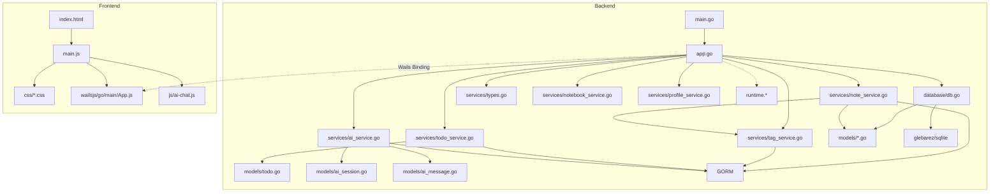

# Jot 项目分析报告

> 项目类型: 桌面端卡片式笔记应用（类小米笔记）
> 技术栈: Wails v2 + Go + GORM + SQLite + 原生 HTML/CSS/JS + CodeMirror 6（编辑器）+ go-openai + ollama/ollama/api（AI 对话适配层）

---

## 一、目录结构梳理

```
jot/                                    # 项目根目录
├── main.go                             # 【入口文件】Wails 应用启动入口，配置窗口/资源/绑定
├── app.go                              # 【核心文件】Wails 绑定层，暴露 110+ 个 Go API 给前端
├── go.mod                              # Go 模块定义，声明依赖版本
├── go.sum                              # Go 依赖锁文件
├── wails.json                          # Wails 项目配置（名称/构建脚本/作者）
├── AGENTS.md                           # 本报告文件
│
├── internal/                           # 【内部包】Go 子包统一目录
│   ├── database/
│   │   └── db.go                       # SQLite 初始化（glebarez/sqlite 纯 Go 驱动）+ AutoMigrate + 默认值初始化
│   ├── fontutil/
│   │   └── fonts_windows.go           # EnumFontFamiliesW API 封装
│   ├── models/                         # 【数据模型层】9 个实体
│   │   ├── note.go                     # Note 实体（笔记：标题/内容/颜色/置顶/删除时间/笔记本外键/文件扩展名）
│   │   ├── tag.go                      # Tag 实体（标签：名称）
│   │   ├── setting.go                  # Setting 实体（KV 配置：键/值）
│   │   ├── ai_session.go              # AI 会话实体（标题/置顶/时间戳/Token 数/模型名/系统提示）
│   │   ├── ai_session_config.go      # AI 会话操作栏配置实体（与 AISession 一对一关联）
│   │   ├── ai_message.go              # AI 消息实体（角色/内容/思维链/耗时/搜索来源/召回卡片）
│   │   ├── api_profile.go             # API 配置预设实体（名称/端点/Key/模型/参数）
│   │   ├── ai_prompt.go               # AI 提示词实体（技能提示词数据库存储）
│   │   └── todo.go                    # Todo 实体（待办/文本/完成状态/时间戳）
│   ├── aicli/                          # 【AI 客户端适配层】
│   │   ├── client.go                   # 统一入口，AIStream/Chat + Provider 多态封装
│   │   ├── openai.go                   # OpenAI 兼容 API 实现（DeepSeek、通义千问等）
│   │   ├── ollama.go                   # Ollama 原生 API 实现
│   │   └── types.go                    # 客户端类型定义（ProviderType/Client 接口/StreamOptions）
│   └── services/                       # 【业务逻辑层】12 个 Service
│       ├── note_service.go             # 笔记 CRUD + 搜索 + 置顶 + 回收站 + 导入导出 + VACUUM + 引用上下文
│       ├── tag_service.go              # 标签管理 + 笔记标签关联 + 标签计数
│       ├── setting_service.go          # 配置读写（KV + 批量 GetAllSettings/SaveAllSettings）
│       ├── ai_service.go               # AI 对话（aicli 适配 + 流式输出 + 会话/消息 CRUD + Token 统计 + 原子替换 + 分页加载）
│       ├── todo_service.go             # 待办 CRUD（创建/列表/切换完成/删除/编辑）
│       ├── profile_service.go          # API 配置预设 CRUD + 切换/激活
│       ├── notebook_service.go         # 笔记本 CRUD + 回收站（软删除/恢复/全部恢复/全部清空）
│       ├── crypto.go                   # 敏感密钥 Base64 编码/解码（(zk) 前缀标识）
│       ├── search_service.go           # 通用网页搜索（Tavily API）
│       ├── zhihu_search_service.go     # 知乎搜索 + 全网搜索
│       ├── recall_service.go           # 卡片召回（2-gram 分词 + 内容截断）
│       ├── query_refiner.go            # 搜索 Query 精炼（LLM 非流式调用）
│       └── types.go                    # 通用类型（PaginatedResult, DataStats, SettingsConfig, ImportResult, NoteRefContext 等）
│
├── frontend/                           # 【前端目录】Wails 前端（Vanilla + Vite）
│   ├── index.html                      # 入口 HTML，8 个视图（笔记/搜索/设置/数据/回收站/AI/MD 语法/待办）
│   ├── package.json                    # 前端依赖（Vite 3.x + CM6 ~16 包 + marked + highlight.js）
│   ├── vite.config.js                  # Vite 配置
│   ├── src/
│   │   ├── main.js                     # 【核心文件】前端核心逻辑 ~7653 行
│   │   ├── js/                         # 【JS 模块目录】
│   │   │   ├── ai-chat.js              # AI 对话模块 ~4096 行
│   │   │   ├── cm6-syntax-highlight.js # CM6 通用语法高亮模块（11 套配色 + 46+ 语言解析器映射）
│   │   │   ├── data-management.js      # 数据管理页面模块（信笺统计 + 操作列表 + 备份 + 存储优化）
│   │   │   ├── trash-page.js           # 回收站页面模块（混合渲染笔记 + 笔记本条目）
│   │   │   ├── constants.js            # 图标常量 SVGS + 工具函数
│   │   │   ├── notification.js         # NotificationManager 通知类
│   │   │   ├── hljs-themes-data.js     # highlight.js 主题 CSS 数据文件
│   │   │   ├── hljs-themes.js          # CM6→hljs 主题映射
│   │   │   └── preview-worker.js       # Web Worker 离线程 Markdown 渲染
│   │   └── css/                        # 【CSS 模块化目录】
│   │       ├── index.css               # 入口文件，@import 引入所有子文件
│   │       ├── variables.css           # 12 主题 CSS 变量
│   │       ├── reset.css               # 全局 reset
│   │       ├── scrollbar.css           # 统一滚动条 6px 细条 + 自动隐藏
│   │       ├── animations.css          # 13 个 keyframes + 通用工具类
│   │       └── components/
│   │           ├── topbar.css           # 顶栏样式
│   │           ├── main-content.css     # 主内容区布局
│   │           ├── sidebar.css          # 笔记本侧边栏
│   │           ├── editor.css           # 编辑器面板/CM6 主题/全屏/预览/骨架屏/灯箱
│   │           ├── dropdowns.css        # 右键菜单/更多菜单/下拉选择器
│   │           ├── modals.css           # 通用模态框/确认弹窗/快捷键页面
│   │           ├── settings-panel.css   # 设置页样式
│   │           ├── search-modal.css     # 搜索弹窗
│   │           ├── data-view.css        # 数据管理页样式
│   │           ├── md-reference.css     # MD 语法手册
│   │           ├── ai-chat.css          # AI 对话页面
│   │           └── todo.css             # 待办清单页面
│   ├── wailsjs/                        # Wails 自动生成的 JS 绑定
│   │   └── go/main/
│   │       ├── App.js                  # 后端 API 的 JS 封装
│   │       ├── App.d.ts               # TypeScript 类型定义
│   │       └── models.ts              # Go 模型的 TS 类型
│   └── dist/                           # Vite 构建产物
│
└── .trae/specs/                        # 80+ Spec 变更记录子目录
    ├── add-card-note-app/              # 初始需求规格
    ├── add-notebook-system/            # 笔记本系统
    ├── add-theme-system/               # 主题系统
    ├── add-todo-list/                  # 待办清单
    ├── integrate-codemirror-6/         # CM6 编辑器集成
    ├── redesign-ui/                    # UI 重设计
    ├── custom-ai-client/              # 自研 AI 客户端
    ├── persist-ai-sessions/           # AI 会话持久化
    ├── add-ai-assistant/              # AI 助手基础功能
    ├── add-web-search-tavily/         # Tavily 联网搜索
    ├── add-multi-web-search-sources/  # 多来源搜索
    ├── add-card-recall/               # 卡片召回
    ├── add-ai-skill-programming/      # AI 编程技能
    ├── add-ai-skill-translate/        # AI 翻译技能
    ├── add-roleplay-skill/            # 角色扮演技能
    ├── add-ai-chat-drag-upload/       # AI 拖拽上传
    ├── add-ai-chat-file-upload/       # AI 文件上传
    ├── redesign-data-management/      # 数据管理重设计
    ├── add-one-click-backup-restore/  # 一键备份还原
    ├── add-frameless-window/          # 无边框窗口
    ├── redesign-ai-session-sidebar/   # AI 会话侧栏
    ├── ...（更多子目录）
```

### 目录规范评价

| 维度 | 评价 |
|------|------|
| **分层清晰度** | 优秀。严格按 `models → services → database → app` 分层，前端后端隔离清晰 |
| **命名规范** | 良好。目录名使用复数形式（models/services），符合 Go 社区惯例 |
| **冗余目录** | 无。每个目录职责单一，无多余层级 |
| **待改进** | frontend/dist 为构建产物，应加入 .gitignore |

---

## 二、核心功能模块识别

### 2.1 基础支撑模块

| 模块名称 | 核心功能 | 对应文件 | 核心依赖 |
|----------|----------|----------|----------|
| **数据库初始化模块** | SQLite 连接建立、连接池配置、AutoMigrate、默认值初始化 | `database/db.go` | glebarez/sqlite, GORM |
| **数据模型层** | 9 个实体定义（Note/Tag/Setting/AISession/AIMessage/APIProfile/AIPrompt/AISessionConfig/Todo） | `models/*.go` | GORM |
| **通用类型** | 分页返回格式、统计数据、SettingsConfig、导入导出结构、笔记引用上下文 | `services/types.go` | 无外部依赖 |
| **Wails 绑定层** | Go API → JS Bridge，含 runtime 原生对话框 | `app.go` | Wails v2 binding + runtime |
| **前端构建** | Vite 打包、Wails dev 热重载 | `frontend/package.json`, `wails.json` | Vite 3.x |
| **字体枚举** | Windows GDI EnumFontFamiliesW 系统字体枚举 | `fontutil/fonts_windows.go` | gdi32.dll / user32.dll (syscall) |
| **配置存储** | KV 结构配置读写 + 批量 GetAllSettings/SaveAllSettings | `services/setting_service.go` | GORM |

### 2.2 业务核心模块

| 模块名称 | 核心功能 | 对应代码 |
|----------|----------|----------|
| **笔记 CRUD** | 创建/更新/查询/删除笔记 | `services/note_service.go` |
| **笔记搜索** | 标题+内容 LIKE 模糊搜索，支持 3 种排序 + 标签 AND 过滤 | `note_service.go:Search()` |
| **笔记置顶** | 切换置顶状态 | `note_service.go:TogglePin()` |
| **回收站** | 软删除/查看/恢复/永久删除（含笔记+笔记本混合渲染） | `note_service.go` 相关方法 + `trash-page.js` |
| **标签管理** | 标签 CRUD + 笔记标签关联 + 标签计数 | `services/tag_service.go` |
| **按标签筛选** | 通过标签 ID 查询笔记（AND 语义，后端子查询） | `note_service.go:Search()` |
| **数据统计** | 笔记/回收站/标签/笔记本/AI 会话/待办统计 | 各 service + `app.go:GetDataStats()` |
| **笔记本系统** | 笔记本 CRUD + 回收站（软删除/恢复/全部恢复/全部清空） | `services/notebook_service.go` |
| **数据导出** | 导出为 ZIP 文件（VACUUM INTO + images/ 打包） | `app.go:ExportDataWithDialog()` |
| **数据导入** | 从 ZIP 文件还原（解压 → 替换 db + images） | `app.go:ImportDatabaseWithDialog()` |
| **一键备份/还原** | 备份当前库到 ~/.jot/backup/ 并还原（ZIP 格式含图片） | `app.go:BackupToDir/RestoreFromDir` |
| **存储优化** | 清理空会话/孤儿消息/过期回收站/孤儿图片 + VACUUM 整合 | `app.go:VacuumDatabase()` |
| **前端卡片渲染** | 卡片网格展示 + 动画 | `frontend/src/main.js` |
| **CM6 编辑器** | 笔记编辑模态框（行号/撤销重做/查找替换/Tab缩进/语法高亮 46+ 语言） | `frontend/src/main.js` |
| **前端搜索交互** | 搜索弹窗 200ms 防抖 + 笔记本/日期/排序/标签筛选器 | `frontend/src/main.js` |
| **前端视图切换** | 网格/搜索/设置/数据管理/回收站/AI 助手/MD 语法/待办视图切换 | `frontend/src/main.js:switchView()` |
| **外观设置** | 字体族下拉选择 + 字体大小预设/自定义 + 12 种主题 + 11 套代码高亮主题 + 主题预览 UI 卡片 | `frontend/src/main.js` |
| **AI 对话** | 自研 aicli 客户端，OpenAI 兼容 + Ollama 双 Provider 流式对话（流式输出 + Markdown 渲染 + 代码高亮 + 思维链折叠 + 多会话 + 侧栏折叠 + 搜索 + 召回 + 技能 + 角色扮演 + 消息编辑/删除/重新发送 + Token 统计 + 后端统一上下文注入） | `services/ai_service.go` + `aicli/` + `ai-chat.js` |
| **AI 会话管理** | 会话 CRUD + 置顶 + 标题编辑 + 会话配置持久化 | `ai_service.go` + `ai-chat.js` |
| **联网搜索** | 三来源（Tavily/知乎/全网搜索）独立开关 + Key 校验联动 | `search_service.go` + `zhihu_search_service.go` |
| **卡片召回** | 2-gram 分词多关键词 OR 搜索，内容截断，结果注入 AI 上下文 | `recall_service.go` |
| **引用笔记** | 笔记选择浮层（搜索/笔记本/标签筛选）+ 内容截断 + system message 注入 | `note_service.go:BuildNoteRefContext()` |
| **API 配置预设** | 多 API 配置管理，一键切换 + 管理面板 | `services/profile_service.go` |
| **待办清单** | 待办 CRUD + 筛选 + 行内编辑 + 动画 + tooltip | `services/todo_service.go` + `main.js` |
| **批量管理** | 批量标签/移动/删除/置顶 + FAB 入口 + 动画 | `frontend/src/main.js` |
| **图片上传** | Markdown 图片粘贴上传 + 拖拽上传 + 本地文件服务器 | `app.go` + `main.go` + `main.js` |
| **统一通知系统** | NotificationManager 单例，右上角浮动通知，4 种类型 + undo 撤销 | `frontend/src/js/notification.js` |
| **设置页统一重构** | SettingsConfig 结构体 + 统一 loadSettings/saveSettings | `services/types.go` + `main.js` |

### 2.3 模块分层图

```
┌─────────────────────────────────────────────────────┐
│                    Frontend                          │
│  (main.js / css / index.html)                        │
│   ├─ 视图渲染 (卡片/搜索/设置/数据/回收站/AI/待办)    │
│   ├─ 交互逻辑 (事件绑定/状态管理)                      │
│   └─ Wails Bridge (window.go.main.App.*)              │
└────────────────────────┬────────────────────────────┘
                         │ Wails Binding (JSON 序列化)
┌────────────────────────▼────────────────────────────┐
│              App 层 (app.go)                         │
│  110+ 绑定方法（CRUD/搜索/置顶/回收站/统计/导入导出/  │
│    AI 配置/会话管理/消息管理/笔记本回收站/配置预设）    │
│  (含 runtime 原生对话框调用)                           │
└────────────────────────┬────────────────────────────┘
                         │
              ┌──────────┼──────────┐
              ▼          ▼          ▼
    ┌─────────────┐ ┌──────────┐ ┌──────────────┐
    │ NoteService │ │TagService│ │  AI Service  │
    │ TagService  │ │TodoSvc   │ │  ProfileSvc  │
    │ NotebookSvc │ │          │ │  Search/Recall│
    └──────┬──────┘ └─────┬────┘ └──────┬───────┘
           │              │             │
           └──────┬───────┴──────┬──────┘
                  ▼              ▼
        ┌─────────────────┐ ┌──────────┐
        │    GORM ORM     │ │  SQLite  │
        │ (数据访问层)      │ │(纯 Go 驱动)│
        └─────────────────┘ └──────────┘
```

---

## 三、模块间依赖关系分析

### 3.1 依赖关系详表

| 依赖方 | 被依赖方 | 依赖类型 | 依赖详情 |
|--------|----------|----------|----------|
| `app.go` | `database` | 编译依赖 | 调用 `database.InitDB()` 获取 `*gorm.DB` 实例 |
| `app.go` | `services` | 编译依赖 | 创建 `NoteService` / `TagService` / `TodoService` / `SettingService` 等实例 |
| `app.go` | `models` | 编译依赖 | 返回 `*models.Note` / `*models.Tag` 等类型 |
| `app.go` | `runtime` | 编译依赖 | `runtime.SaveFileDialog` 等原生对话框 |
| `app.go` | `fontutil` | 编译依赖 | `fontutil.GetFonts()` 枚举系统字体 |
| `services` | `models` | 编译依赖 | 操作 Note/Tag/Todo/Setting/AISession/AIMessage 结构体 |
| `services` | GORM | 编译依赖 | `*gorm.DB` 数据库操作 |
| `database` | `models` | 编译依赖 | `AutoMigrate(&models.Note{}, &models.Tag{}, ...)` |
| `database` | glebarez/sqlite | 编译依赖 | 纯 Go SQLite 驱动 |
| `fontutil` | gdi32/user32 | 运行时依赖 | syscall 调用 Windows GDI API |
| `frontend/main.js` | `wailsjs/go/main/App.js` | 运行时调用 | `window.go.main.App.*` 调用后端 API |
| `frontend/wailsjs` | `app.go` | 构建时生成 | `wails generate module` 自动生成 |

### 3.2 依赖关系图（Mermaid）



### 3.3 依赖问题分析

| 问题类型 | 描述 | 严重程度 |
|----------|------|----------|
| **循环依赖** | 无。所有依赖为单向 `main → app → services → models` | ✅ 无问题 |
| **过度依赖** | 无。每个 Service 仅依赖 `*gorm.DB` 和自身模型 | ✅ 无问题 |
| **依赖缺失** | 无。`go.sum` 中所有传递依赖完整 | ✅ 无问题 |
| **隐式依赖** | 前端 `window.go` 对象依赖 Wails 运行时注入 | ⚠️ 有降级处理（Mock 数据） |
| **编译期 vs 运行时** | `wailsjs/` 目录需在修改 `app.go` 后重新生成 | ⚠️ 需手动 `wails generate module` |

---

## 四、设计模式与实现逻辑

### 4.1 设计模式识别

| 模式名称 | 应用位置 | 说明 |
|----------|----------|------|
| **Service Layer 模式** | `services/` 包 | 将业务逻辑从 controller（app.go）中抽离，封装为独立 Service 结构体 |
| **依赖注入 (DI)** | `app.go` | Service 依赖的 `*gorm.DB` 通过构造函数注入，`rebuildServices()` 统一管理 |
| **Repository 模式** | `services/` 内嵌 GORM | Service 内部直接使用 GORM 作为数据访问层 |
| **单例模式 (应用级)** | App 结构体 | Wails 运行时保证 App 实例唯一 |
| **MVC 变体** | 整体架构 | Model(models) - View(frontend) - Controller(app.go + services) 分层 |
| **降级策略 (Fallback)** | `frontend/main.js` | 后端未绑定时自动使用 Mock 数据 |
| **Provider 策略模式** | `internal/aicli/` | OpenAI/Ollama 统一接口 + 多态实现，运行时按配置切换 |
| **Wails Runtime 集成** | `app.go` | 通过 runtime 包调用原生桌面功能（对话框/打开浏览器/事件系统） |
| **观察者模式** | Wails Events | 后端通过 `runtime.EventsEmit` 推送流式事件，前端监听 |
| **Memento（快照）** | 备份还原 | exportSnapshot/replaceDatabase 实现状态快照和恢复 |

### 4.2 核心业务逻辑流程

#### 4.2.1 笔记创建流程

```
用户点击 "+" 按钮 / Ctrl+N
  → openEditor(null)          // 打开空编辑器（骨架屏立即显示）
    → 用户填写标题/内容/选择颜色/选择标签
    → 点击"保存"按钮
      → createNote()
        → 前端校验（标题不为空）
        → window.go.main.App.CreateNote(title, content, color)
          → app.go:CreateNote()
            → noteService.Create()          // GORM db.Create(&note)
            → 返回 *models.Note（含 id）
          → 遍历 selectedTags
            → window.go.main.App.AddTagToNote(note.id, tagId)
              → tagService.AddTagToNote()   // GORM Association("Tags").Append
        → closeEditor()                     // 关闭模态框
        → loadNotes()                       // 重新加载笔记列表
          → GetNotes(1, 100)                // 分页查询
          → renderCardGrid()                // 渲染右侧卡片网格
```

#### 4.2.2 笔记搜索流程

```
Ctrl+F / Ctrl+K → 打开搜索弹窗
  → els.searchModalInput 自动聚焦
  → 用户输入文字 → 200ms 防抖
    → searchModalLoadPage(1, false)
      → App.SearchNotes(keyword, page, pageSize, notebookID, sortBy, startDate, endDate, tagIDs)
        → noteService.Search()     // LIKE 模糊搜索 + 标签 AND 子查询 + 排序
      → safeUpdateSearchResults()  // DocumentFragment 批量插入
      → 更新分页/加载更多状态
```

#### 4.2.3 AI 对话流程

```
用户输入消息 → onSend()
  → 提前保存用户消息到 DB（SaveAIMessage，返回 msgID + token）
  → App.CallAIStream(streamGen, sessionID, userText, 元数据...)
    → 后端 8 步上下文拼接：
      1) 基础身份提示词
      2) 角色扮演笔记内容
      3) 引用笔记上下文
      4) 追问引用文本
      5) 上传文件内容
      6) 联网搜索结果（三来源并行）
      7) 卡片召回结果
      8) 技能提示词（含 {roleplay_context} 占位符替换）
    → ai:stream-chunk 事件推送流式内容
    → ai:stream-thinking 事件推送思维链（深度思考模式）
    → ai:stream-done 事件（含 token 统计/耗时/搜索来源/召回卡片）
  → 前端流式渲染 Markdown + 代码高亮
  → saveSessionMessages() 持久化 assistant 回复
```

### 4.3 数据流分析：AI 消息原子替换

```
用户编辑某条 AI 消息 → onEditMessage()
  → 修改原始消息内容
  → App.ReplaceAISessionMessages(sessionID, targetMsgID, newMessages)
    → ai_service.go:ReplaceAISessionMessages()
      → 开启 GORM 事务
      → 删除 targetMsgID 之后的所有消息
      → 更新 targetMsgID 的内容
      → 插入 newMessages（重新生成的回复）
      → 提交事务
    → 返回成功
  → 前端重新加载该会话的分页消息
```

### 4.4 Wails 事件驱动通信模型

```
后端 (Go)                                   前端 (JS)
──────────────────────────────────────────────────────
CallAIStream()
  ├─ EventsEmit("ai:stream-chunk", data)  ──→  window.runtime.EventsOn("ai:stream-chunk", cb)
  ├─ EventsEmit("ai:stream-thinking", dt)  ──→  window.runtime.EventsOn("ai:stream-thinking", cb)
  ├─ EventsEmit("ai:stream-done", data)    ──→  window.runtime.EventsOn("ai:stream-done", cb)
  └─ EventsEmit("ai:stream-error", err)    ──→  window.runtime.EventsOn("ai:stream-error", cb)

其他事件:
  ├─ "notes:refreshed"                     ← 笔记变更后通知前端刷新
  ├─ "settings:changed"                    ← 设置变更后通知前端刷新
  └─ "session-config:updated"              ← 会话配置更新通知
```

---

## 五、技术栈评估

### 5.1 技术栈清单

| 层级 | 技术 | 版本 | 用途 |
|------|------|------|------|
| **桌面框架** | Wails v2 | v2.9.2 | 桌面窗口 + Go ↔ JS Bridge |
| **后端语言** | Go | go1.22+ | 后端业务逻辑 |
| **数据库** | SQLite | — | 本地数据存储 |
| **数据库驱动** | glebarez/sqlite | v1.11 | 纯 Go SQLite 驱动（无 CGO） |
| **ORM** | GORM | v1.25 | 对象关系映射 |
| **前端构建** | Vite | v3.2.11 | 前端打包工具 |
| **前端技术** | 原生 HTML/CSS/JS | — | UI 渲染 |
| **编辑器** | CodeMirror 6 | @codemirror/view v6.26 | 笔记编辑器 |
| **Markdown 解析** | marked | v12.0 | Markdown → HTML 渲染 |
| **代码高亮** | highlight.js | v11.10 | 代码块语法高亮 |
| **AI 对话** | go-openai + ollama/ollama/api | — | 双 Provider 流式对话 |
| **日志库** | fastlog | — | 后端结构化日志 |

### 5.2 技术栈选型评价

| 评价维度 | 说明 |
|----------|------|
| **合理性** | Wails v2 适合桌面端 Go 应用，原生 HTML/CSS/JS 避免前端框架学习成本 |
| **性能** | SQLite + GORM 组合满足本地笔记应用性能需求，流式输出不阻塞 UI |
| **维护性** | 前后端分层清晰，CSS 模块化拆分降低维护成本，后端结构化日志 |
| **可扩展性** | 新增功能只需添加 binding 方法和前端模块，架构本身无限制 |
| **风险** | Wails v2 社区较小，Wails v3 路线图不明确，长期维护可能受限 |

### 5.3 版本兼容性问题

| 问题 | 说明 |
|------|------|
| **Wails 版本锁定** | `go.mod` 中 `wails.io v2.9.2` 已固定，升级需同步更新 CLI, go.mod, wails.json |
| **GORM AutoMigrate** | 新增模型后需在 `database/db.go` 的 AutoMigrate 中注册 |

---

## 六、补充分析

### 6.1 扩展性评估

| 扩展方向 | 可行性 | 建议 |
|----------|--------|------|
| **多用户/云端同步** | 低 | 如需云端同步，建议引入 WebDAV/第三方同步库 |
| **AI 功能扩展** | 高 | 当前 AI 会话架构（Session + Message + Config 模型）天然支持扩展 |
| **国际化 (i18n)** | 中 | 所有 UI 文本硬编码在 HTML/JS 中，需统一抽离 |
| **插件系统** | 低 | 原生 HTML 架构不适合动态加载插件 |
| **富文本编辑器** | 中 | 可考虑集成 TipTap/ProseMirror 替换纯文本编辑器 |
| **PWA/Web 版本** | 中 | 后端逻辑可复用，前端需重构为响应式 |
| **Markdown 导出增强** | 高 | 当前导入导出为 ZIP 格式，可额外支持纯 MD 导出 |

### 6.2 性能关键点

| 关键点 | 现状 | 评估 |
|--------|------|------|
| **数据库查询** | GORM + SQLite，分页查询 | ✅ 满足笔记本规模 |
| **前端渲染** | 卡片网格渲染 + 骨架屏 shimmer + DocumentFragment 批量插入 | ✅ 性能良好 |
| **AI 流式输出** | 基于 Wails Events 逐块推送，不阻塞 UI | ✅ 体验优秀 |
| **CM6 编辑器** | 仅初始化当前编辑的笔记，骨架屏点击即动 | ✅ 性能良好 |
| **多会话切换** | 分块渲染（CHUNK_SIZE=5 yield）+ 延迟高亮 + scroll-behavior 临时禁用 | ✅ 瞬间完成无闪烁 |
| **搜索来源/召回卡片** | 共享渲染函数 + CSS line-clamp 替代 JS 截断 | ✅ 代码去重 |
| **AI 消息懒加载** | 分页加载历史消息，初始仅加载最近一批 | ✅ 减少首屏渲染压力 |
| **Web Worker 渲染** | preview-worker.js 独立线程解析 Markdown | ✅ 避免阻塞主线程 |
| **图片加载** | 本地文件服务器提供图片，异步加载 + 灯箱预览 | ✅ 性能良好 |
| **主题切换** | CSS 变量整体替换，一次重绘 | ✅ 性能优异 |
| **骨架屏 shimmer** | CSS animation 驱动，GPU 加速 transform | ✅ 零 JS 开销 |

### 6.3 异常处理分析

| 异常场景 | 处理方式 |
|----------|----------|
| **后端 API 不可用** | 前端 Mock 数据降级 |
| **AI API 调用失败** | HTTP 状态码封装为 11 种分类中文提示，通过右上角通知展示 |
| **联网搜索失败** | 每个搜索来源独立发射错误事件，不影响其他来源继续搜索 |
| **数据库损坏** | 备份还原机制 |
| **流式连接中断** | 前端监听错误事件，显示错误提示 |
| **深度思考不支持** | 分类提示引导用户关闭开关 |
| **停止按钮取消** | 取消时 AI 回复不入库，前端清理 streaming 气泡 |
| **编辑器未保存离开** | 脏检测 + 确认弹窗（beforeunload） |
| **文件上传失败（大小/类型）** | 前端校验 + 后端限制 + 中文提示 |
| **图片加载失败** | 占位符 + 重试按钮 |
| **Wails 事件通道关闭** | 流式输出终止回调 + UI 重置 |
| **ZIP 导入格式错误** | 解压时校验目录结构，非预期格式提示用户 |
| **设置值格式异常** | loadSettings 中逐字段类型断言 + 默认值回退 |

### 6.4 安全分析

| 风险点 | 评估 |
|--------|------|
| **本地数据库** | SQLite 文件本地存储，无远程访问风险 |
| **API Key 存储** | Base64 编码 + `(zk)` 前缀标识存储在 DB 中，前端始终读写明文 |
| **XSS 风险** | AI 回复经 `marked.parse()` 渲染，用户数据一律使用 textContent |
| **路径遍历（导入）** | ZIP 解压时检查路径穿越，限制在目标目录内 |
| **CSP 策略** | 未显式设置 Content-Security-Policy，建议增加 |
| **本地文件服务器** | 仅监听 127.0.0.1，仅提供 images/ 目录下的静态文件 |
| **输入校验** | 后端仅做基础非空校验，建议增加长度/格式限制 |

### 6.5 AI 对话上下文构建详细分析

AI 对话的核心复杂度体现在后端的 8 步上下文拼接流程。每次用户发送消息时，`ai_service.go` 中的 `CallAIStream` 方法会执行以下步骤：

1. **基础身份提示词**：注入系统角色定义（"你是一个智能笔记助手"），定义回复格式规范
2. **角色扮演笔记内容**：如果当前会话配置启用了角色扮演，加载指定的 1~3 篇笔记内容作为人物设定，替换 prompt 中的 `{roleplay_context}` 占位符
3. **引用笔记上下文**：如果用户选择了引用笔记，调用 `note_service.go:BuildNoteRefContext()` 获取笔记内容并截断，注入 system message
4. **追问引用文本**：如果用户选中了某条 AI 消息作为追问，提取该消息的文本内容作为额外上下文
5. **上传文件内容**：如果用户上传了文件，将文件文本内容（非图片）注入上下文（当前支持 .txt/.md/.csv/.json/.log 等纯文本格式）
6. **联网搜索结果**：三来源（Tavily/知乎/全网搜索）并行搜索，每个来源独立发射事件，结果统一格式化为摘要文本注入上下文
7. **卡片召回结果**：对用户消息进行 2-gram 分词，多关键词 OR 搜索已保存的笔记，结果截断后注入上下文
8. **技能提示词**：如果当前会话选择了某项 AI 技能，加载对应的提示词模板，完成 `{roleplay_context}` 占位符替换后注入

这种设计将上下文构建全部集中在后端处理，前端只需发送用户原始输入和必要的元数据，前端逻辑得以保持简洁。

### 6.6 前端渲染架构

前端采用模块化的 Vanilla JS 架构，核心设计特点包括：

- **全局状态管理**：通过全局对象 `window.state` 管理当前视图/笔记本 ID/搜索状态/编辑状态等
- **视图切换**：`switchView()` 统一管理 8 个视图的显隐切换和状态重置
- **事件委托**：大量使用事件委托模式处理卡片列表、AI 消息列表等动态内容的交互事件
- **骨架屏模式**：编辑器/AI 对话等模块首次加载时自动显示骨架屏，实际内容加载完成后无缝替换
- **防抖与节流**：搜索输入 200ms 防抖、滚动加载节流（IntersectionObserver）
- **通知系统**：NotificationManager 单例管理所有通知的展示/自动消失/手动撤销
- **批量 DOM 操作**：使用 DocumentFragment 批量插入 DOM 节点，减少回流重排

### 6.7 数据库模型关系

```
Note (笔记)
  ├── BelongsTo → Notebook (笔记本, optional, notebook_id 外键)
  ├── ManyToMany → Tag (标签, note_tags 关联表)
  └── HasMany → Todo (待办, note_id 外键, optional)

AISession (AI 会话)
  ├── HasMany → AIMessage (AI 消息)
  └── HasOne → AISessionConfig (会话配置)

APIProfile (API 配置预设)
  └── 独立表，通过 is_active 字段标记当前激活的配置

Setting (KV 配置)
  └── 独立表，key/value 结构

AIPrompt (AI 提示词)
  └── 独立表，存储技能提示词模板
```

### 6.8 前端 CM6 编辑器集成分析

CodeMirror 6 的集成是前端的核心复杂度之一，主要涉及：

- **按需加载**：仅在用户打开编辑器时初始化 CM6 实例，非编辑状态不加载
- **扩展组合**：集成 ~16 个 CM6 扩展包（view/state/language/commands/search/autocomplete/highlight/fold/lint/theme-one-dark 等）
- **语法高亮**：自定义 `cm6-syntax-highlight.js` 模块，支持 46+ 语言解析器映射 + 11 套配色方案
- **查找替换**：CM6 内置 search 扩展，支持正则/区分大小写/全词匹配
- **主题联动**：编辑器主题与系统 12 主题联动，通过 CSS 变量传递配色
- **全屏编辑**：支持编辑器全屏模式，扩展编辑空间
- **骨架屏整合**：编辑器容器先显示骨架屏动画，CM6 实例加载完成后替换

### 6.9 AI aicli 客户端适配层设计

aicli 包采用策略模式（Provider 模式）设计：

```
Client 接口
  ├── Chat(ctx, req) → (*ChatResponse, error)        // 非流式调用
  └── Stream(ctx, req, handler) → (*ChatResponse, error)  // 流式调用

OpenAIClient 实现 (openai.go)
  ├── 兼容 OpenAI Chat Completions API
  ├── 适用于 DeepSeek、通义千问、智谱 GLM 等兼容服务
  └── 流式使用 SSE (text/event-stream)

OllamaClient 实现 (ollama.go)
  ├── 使用 Ollama 原生 API (/api/chat)
  ├── 流式使用 NDJSON (application/x-ndjson)
  └── 自动解析 think 标签
```

统一入口 `client.go` 的 `NewClient()` 根据配置的 ProviderType 返回对应的实现。

### 6.10 备份与还原机制分析

备份/还原是一键数据保护的核心功能，设计要点：

```
备份流程 (BackupToDir):
  1. 在 ~/.jot/backup/ 下创建时间戳目录 (YYYYMMDD_HHMMSS)
  2. 调用 exportSnapshot() 生成当前库的 VACUUM INTO 快照
  3. 将快照 db + images/ 目录打包为 ZIP
  4. 清理 30 天前的旧备份

还原流程 (RestoreFromDir):
  1. 用户选择备份 ZIP 文件
  2. 解压到临时目录
  3. 验证目录结构包含 jot.db
  4. 停止当前应用（保存状态）
  5. 替换 jot.db 文件 + images/ 目录
  6. 清理临时目录
  7. 重启应用

导出流程 (ExportDataWithDialog):
  1. 原生文件保存对话框选择路径
  2. VACUUM INTO 生成独立 DB 快照
  3. 打包 DB + images/ 为 ZIP
  4. 清理临时文件

导入流程 (ImportDatabaseWithDialog):
  1. 原生文件打开对话框选择 ZIP
  2. 解压 + 校验目录结构
  3. 备份当前数据（防止导入失败）
  4. 替换数据库和图片目录
  5. 通知前端刷新
```

### 6.11 AI 流式渲染机制

前端 AI 流式渲染采用分块处理策略以保证 UI 流畅性：

```
消息渲染流程:
  1. 后端推送 ai:stream-chunk → 前端累积到 chunkBuffer
  2. 每收到一个 chunk，立即 append 到 streamingBubble 的文本节点
  3. 对累积内容每 CHUNK_SIZE=5 条消息渲染一次 Markdown:
     - 使用 marked.parse() 将原始文本转为 HTML
     - 调用 highlightElement() 高亮所有代码块
     - 将渲染结果替换到 streamingBubble 中
  4. ai:stream-done 事件触发最终渲染：
     - 清理 streaming 状态
     - 保存完整消息到 DB
     - 页面重新渲染该消息（非 streaming 模式）
```

### 6.12 设置页 SettingsConfig 设计

设置页统一采用 `SettingsConfig` 结构体管理全部配置项。这个结构体在 `services/types.go` 中定义，包含所有用户可配置的设置字段，如主题名称、正文字体族和字号、代码字体族和字号、代码高亮主题等 20+ 项配置。前端通过 `loadSettings()` 从后端获取完整配置对象并填充到 UI 控件中，用户修改后通过 `saveSettings()` 批量提交回后端。后端 `setting_service.go` 以 KV 结构存储每个字段（Setting 表），并提供 `GetAllSettings()` 和 `SaveAllSettings()` 两个批量操作方法。所有配置变更通过 Wails Events 的 `settings:changed` 事件通知各前端组件刷新自身状态，确保主题、字体等外观配置即时生效。

### 6.13 笔记本系统设计分析

笔记本系统提供笔记的容器化管理，核心设计包括：

- 笔记本 CRUD 操作（创建、重命名、删除）通过 `notebook_service.go` 实现
- 删除采用软删除策略：设置 `DeletedAt` 字段，笔记移入回收站而非直接删除
- 回收站支持单条恢复、全部恢复、全部清空等操作
- 前端侧边栏展示笔记本树形列表，当前选中笔记本高亮显示
- 笔记本切换时自动重新加载对应笔记列表
- 笔记本回收站页面混合渲染软删除的笔记本和笔记条目，统一展示

### 6.14 搜索功能设计分析

搜索功能覆盖前端和后端两个层面：

- **后端搜索**：`note_service.go:Search()` 方法支持标题+内容 LIKE 模糊搜索，支持按更新时间/创建时间/标题三种排序方式，支持按笔记本筛选和按标签 ID 列表 AND 过滤（通过子查询实现多个标签的交集）
- **搜索弹窗**：前端搜索弹窗支持 200ms 防抖输入、笔记本下拉筛选、日期范围选择、排序方式切换、标签选择器 AND 过滤
- **分页加载**：搜索结果支持分页（默认每页 20 条），滚动到底部自动加载更多
- **Query 精炼**：`query_refiner.go` 通过 LLM 非流式调用优化用户输入的自然语言搜索关键词，提升搜索命中率

### 6.15 存储优化机制分析

`VacuumDatabase()` 方法整合了多项存储优化操作，按顺序执行：

1. 清理已删除超过 30 天的笔记（永久删除）
2. 清理已删除超过 30 天的笔记本
3. 清理不再关联任何笔记的孤儿标签
4. 清理没有消息的空 AI 会话
5. 清理不再关联任何会话的孤儿 AI 消息
6. 清理 images/ 目录中不再被任何笔记引用的孤儿图片
7. 最后执行 SQLite VACUUM 命令回收磁盘空间

### 6.16 CSS 架构与主题系统分析

CSS 架构采用模块化拆分 + CSS 变量主题体系的设计：

**模块化拆分**：通过 `index.css` 入口文件使用 `@import` 引 10+ 个子文件，严格按功能分层——`variables.css` 定义主题变量，`reset.css` 全局重置，`scrollbar.css` 统 6px 细条滚动条，`animations.css` 管理 13 个 @keyframes，其余 10 个 `components/` 子文件对应各组件的样式（topbar/sidebar/editor/modals/settings-panel/search-modal/ai-chat/todo/dropdowns/data-view/md-reference）。

**主题系统**：12 套主题通过 `variables.css` 中的 CSS 变量体系驱动，每套主题定义 ~40 个 CSS 变量（`--bg`/`--bg-secondary`/`--text`/`--text-secondary`/`--accent`/`--border`/`--hover`/`--scrollbar-thumb` 等语义色变量）。切换主题时，JS 将 `.theme-xxx` 类名应用到 `<html>` 元素，CSS 变量整体替换触发一次重绘，所有组件自动适配。代码高亮主题另通过 `cm6-syntax-highlight.js` 管理 11 套配色方案，与系统主题独立切换。

**层级约定**：Z-index 层级严格管理——基础内容(0) → 固定元素(10~20) → 覆盖层(20~30) → 侧栏(40) → 通知(50) → 模态框(60) → 灯箱(70)，确保所有覆盖层按预期堆叠。

### 6.17 Wails 事件系统完整目录

Wails Events 是前后端通信的核心机制，事件分类如下：

| 事件名 | 方向 | 触发时机 | 数据载荷 |
|--------|------|----------|----------|
| `ai:stream-chunk` | 后端→前端 | AI 流式输出每段内容 | `{chunk: string, done: boolean}` |
| `ai:stream-thinking` | 后端→前端 | 深度思考模式下输出推理过程 | `{chunk: string}` |
| `ai:stream-done` | 后端→前端 | AI 回复完成 | `{tokens, timeMs, sources, recalledCards}` |
| `ai:stream-error` | 后端→前端 | AI 调用失败 | `{code: string, message: string}` |
| `notes:refreshed` | 后端→前端 | 笔记/标签/笔记本数据变更 | 无 |
| `settings:changed` | 后端→前端 | 设置保存后 | 无 |
| `session-config:updated` | 后端→前端 | 会话配置更新后 | 无 |

前端通过 `window.runtime.EventsOn()` 监听这些事件，后端通过 `runtime.EventsEmit()` 触发。事件系统设计要点：流式事件采用逐块推送而非一次性返回，前端边接收边渲染；非流式事件采用广播模式，所有视图按需响应。

### 6.18 前端全局状态管理

前端通过 `window.state` 全局对象集中管理应用状态，核心字段包括：

- `currentView`：当前激活的视图名（notes/search/settings/data/trash/ai/md-ref/todo）
- `currentNotebookID`：当前选中的笔记本 ID（null 表示显示全部笔记）
- `editingNoteID`：当前编辑的笔记 ID（null 表示未编辑）
- `searchKeyword / searchSortBy / searchStartDate / searchEndDate / searchTagIDs`：搜索状态参数
- `selectedNoteIDs`：批量操作选中的笔记 ID Set
- `aiSessionID`：当前 AI 对话会话 ID
- `aiSidebarCollapsed`：AI 侧栏折叠状态
- `isFullscreen`：编辑器全屏状态

`switchView(viewName)` 函数统一管理视图切换：先隐藏所有视图容器，再显示目标视图，同时重置视图相关状态、更新 URL hash、触发视图特定初始化逻辑（如进入 AI 视图时加载会话列表）。这种集中式状态管理避免了多模块状态同步问题。

### 6.19 AI 技能与角色扮演系统分析

AI 技能系统通过提示词模板驱动，支持 10 项预设技能（编程/翻译/写作/头脑风暴/学习导师/周报生成/日报生成/会议纪要/周报周汇总/角色扮演），提示词模板存储在 `ai_prompt` 数据库表中。角色扮演是技能的扩展形式：用户选择 1~3 篇笔记作为人物设定，系统读取笔记内容替换 prompt 中的 `{roleplay_context}` 占位符，注入到上下文第 2 步。技能提示词在上下文构建的第 8 步注入，与基础提示词、引用笔记、搜索来源等 7 项上下文共同拼接为完整的 system message。

会话配置（`AISessionConfig` 表）持久化保存当前会话的技能选择、角色扮演笔记 ID 列表、搜索来源开关等配置，实现会话级配置与全局设置的解耦。切换会话时自动恢复对应配置。

### 6.20 构建与部署流程

| 阶段 | 命令 | 产物 | 说明 |
|------|------|------|------|
| 开发 | `wails dev` | 热重载窗口 | 前端 Vite dev server + 后端 Go build |
| 生产构建 | `wails build` | 单二进制 .exe | 前端 Vite build → 嵌入 Go binary |
| 前端构建 | `npm run build` | dist/ 目录 | Vite 输出静态资源 |
| NSIS 安装包 | `wails build -nsis` | Setup.exe | Windows 安装包 |

构建产物为单二进制文件，前端资源（HTML/CSS/JS/CM6 扩展包/Web Worker/字体）通过 Go embed 打包到二进制中。无外部运行时依赖，开箱即用。AI 功能依赖外部 API 服务（OpenAI 兼容或 Ollama），不内嵌 AI 模型。

---

## 七、项目核心特点

### 核心设计理念

1. **Wails v2 跨平台桌面应用**：Go + 原生前端（HTML/CSS/JS）架构，兼顾后端性能和前端灵活性。单二进制分发，无需安装运行时

2. **CodeMirror 6 编辑器集成**：主流 Markdown 编辑器引擎，支持行号/撤销重做/查找替换/Tab缩进/自动补全/语法高亮（11 套配色 + 46+ 语言），骨架屏点击即动。CM6 按需加载，非编辑状态不初始化

3. **CSS 变量主题系统（12 主题）**：全局 CSS 变量联动（`--bg`/`--accent`/`--border` 等），一键切换 12 套系统主题 + 11 套代码高亮主题（含 AI 消息代码块），所有组件自动适配。主题包括：默认浅色/深蓝/暖灰/墨绿/暗红/赛博/护眼/羊皮纸/极简深色/极简浅色/午夜蓝/暮光紫

4. **三步交互范式**：笔记本（容器）→ 笔记卡片（列表）→ 编辑器（操作），符合直觉的文件夹-文件-编辑结构

5. **自研 AI 对话引擎（go-openai + ollama/ollama/api 双驱动）**：自研 aicli 适配层，统一流式接口。支持 OpenAI 兼容（DeepSeek、通义千问等）和 Ollama 本地模型。功能涵盖：流式输出 + Markdown 渲染 + 代码高亮 + 思维链折叠 + 多会话管理 + 会话配置持久化 + 会话置顶 + 三来源联网搜索（Tavily/知乎/全网搜索）+ 卡片召回 + 引用笔记 + 上传文件 + 技能提示词（10 项）+ 角色扮演 + 用户消息编辑/删除/重新发送 + Token 统计 + **后端统一上下文注入（8 步拼接）** + 消息分页懒加载

6. **统一的通知系统**：NotificationManager 单例，右上角浮动通知，支持 success/error/warning/info 四种类型 + undo 撤销 + showAction 自定义操作按钮

7. **过度动画与交互反馈**：13 个 keyframes、stagger 延迟、hover 分层反馈、spring 弹性缓动、骨架屏 shimmer、两段式新增动画、搜索来源折叠面板展开收起动画

8. **无 UI 框架依赖**：无 Vue/React/Svelte，纯手写 DOM 操作，极致轻量。从事件绑定到虚拟 DOM 更新全部原生实现

### 设计系统

- **尺寸**：`--radius-md`(8px) / `--radius-sm`(6px)，全局统一，无硬编码圆角
- **间距**：4px 基线网格，组件内部 8-16px，布局 16-24px
- **阴影**：4 层 Token — `elevated`(卡片) / `dropdown`(下拉菜单) / `modal`(模态框) / `toast`(通知)
- **语义色**：`--success`(绿) / `--warning`(黄) / `--error`(红) / `--info`(蓝)，联动所有主题
- **字体**：全局统一 `var(--font-family)`，代码块 `var(--font-mono)` 跟随设置，可分别配置
- **滚动条**：6px 细条自动隐藏，`--scrollbar-thumb` 联动 12 主题，hover 时显示
- **圆角一致性**：所有交互元素使用 `var(--radius-sm)` 或 `var(--radius-md)`，无硬编码
- **Z-index 层级管理**：严格遵守层级栈：基础内容(0) → 固定元素(10~20) → 覆盖层(20~30) → 侧栏(40) → 通知(50) → 模态框(60) → 灯箱(70)

### 核心功能详解

**笔记管理**：支持创建/编辑/删除笔记，笔记包含标题、内容（Markdown）、颜色标签、所属笔记本、文件扩展名等属性。笔记列表以卡片网格形式展示，支持三种排序方式（更新时间/创建时间/标题）。置顶笔记始终显示在最前。回收站提供软删除机制，删除的笔记可恢复，超过 30 天的数据被永久清理。

**搜索系统**：Ctrl+F/Ctrl+K 打开搜索弹窗，200ms 防抖输入触发后端 LIKE 模糊搜索（标题+内容），支持按笔记本/日期范围/排序方式/标签 AND 过滤器组合筛选。搜索结果分页加载（默认 20 条/页），滚动到底部自动加载更多。Query 精炼功能通过 LLM 非流式调用优化用户输入的自然语言搜索关键词。

**AI 对话**：自研 aicli 客户端适配层（策略模式），支持 OpenAI 兼容 API 和 Ollama 原生 API 双 Provider。流式输出通过 Wails Events 逐块推送，前端边接收边渲染。对话支持 Markdown 渲染、代码语法高亮、思维链折叠显示、联网搜索（Tavily/知乎/全网搜索三来源）、卡片召回（2-gram 分词多关键词 OR 搜索笔记库）、引用笔记、上传文件、技能提示词、角色扮演等功能。消息支持编辑、删除、重新发送，API 错误封装为 11 种分类中文提示。

**主题系统**：12 套系统主题（默认浅色/深蓝/暖灰/墨绿/暗红/赛博/护眼/羊皮纸/极简深色/极简浅色/午夜蓝/暮光紫）通过 CSS 变量体系驱动，一键切换所有组件自动适配。代码高亮另提供 11 套配色方案，与系统主题独立配置。设置页提供主题预览卡片，所见即所得。

**外观设置**：字体设置支持系统字体下拉选择（通过 Windows GDI API 枚举已安装字体），正文字号和代码字号可分别设置（预设值 + 自定义输入）。编辑器全屏模式、工具栏显隐切换、代码高亮主题选择等配置统一通过 SettingsConfig 结构体管理，KV 持久化到 Setting 表。

**数据管理**：信笺风格统计页展示笔记/回收站/标签/笔记本/AI 会话/待办六项统计，含弹簧弹入动画。操作列表包含一键备份（ZIP 格式含图片到 ~/.jot/backup/）、存储优化（清理空会话/孤儿消息/过期回收站/孤儿图片 + VACUUM）、导入/导出数据。备份管理面板展示备份历史，支持一键还原。

**通知系统**：NotificationManager 单例管理所有通知展示。右上角浮动通知支持 success/error/warning/info 四种类型，自动 3 秒消失，可手动撤销。支持 undo 撤销操作（如删除笔记后可立即撤销）和 showAction 自定义操作按钮。通知按创建时间倒序堆叠显示，超出屏幕自动上推。

**待办清单**：独立的待办视图（Ctrl+6 快速切换），支持待办 CRUD、完成状态切换、内容行内编辑、已完成/未完成/全部三种筛选模式。新增动画采用两段式设计（先展开高度，再渐入内容），完成动画为弹性勾选效果。每条待办悬浮时显示内容预览 tooltip。

**批量管理**：FAB（浮动操作按钮）入口触发批量模式，支持批量标签操作、批量移动笔记本、批量删除、批量置顶。批量模式下笔记卡片显示复选框，选中项计数显示在 FAB 上。操作完成后自动退出批量模式。

### 关键文件统计

| 文件 | 行数（约） | 说明 |
|------|-----------|------|
| `frontend/src/main.js` | 7653 | 前端核心逻辑（CM6 集成 + 搜索弹窗 + 主题系统 + 设置统一重构 + 待办 + TOC + 灯箱 + 骨架屏） |
| `frontend/src/js/ai-chat.js` | 4096 | AI 对话 JS 逻辑（流式渲染 + 多会话 + 搜索 + 召回 + 右键菜单 + 分页加载 + 会话配置 + 角色扮演） |
| `frontend/src/css/components/ai-chat.css` | 3037 | AI 对话全部样式（气泡/侧栏/输入区/搜索来源/召回卡片/骨架屏） |
| `app.go` | 3255 | Wails 绑定层（110+ API，含后端上下文注入/消息懒加载/文件上传/备份还原） |
| `services/ai_service.go` | 900 | AI 对话服务层（aicli 适配 + 会话/消息 CRUD + Token 统计 + 原子替换 + 分页加载） |
| `frontend/src/css/components/settings-panel.css` | 852 | 设置页样式（主题预览卡片/按钮加载动画/预设管理/日志级别） |
| `frontend/src/css/components/modals.css` | 746 | 弹窗样式（批量标签/确认/关于/快捷键/通知） |
| `frontend/src/css/variables.css` | 674 | 12 主题 CSS 变量 + `--selection-bg` 选中颜色 + `--font-mono` |
| `services/note_service.go` | 708 | 笔记 CRUD + 引用上下文 + 搜索标签 AND 过滤 + 回收站清理 |
| `frontend/src/js/data-management.js` | 447 | 数据管理页（信笺统计/操作列表/备份/存储优化） |
| `frontend/src/css/components/todo.css` | 370 | 待办清单样式（8 个 @keyframes + 两段式新增动画 + 编辑保存动画 + tooltip） |
| `services/notebook_service.go` | 308 | 笔记本 CRUD + 回收站（软删除/恢复/全部恢复/全部清空） |
| `services/types.go` | 202 | 通用类型（DataStats/SettingsConfig/NoteRefContext/ImportResult） |
| `internal/aicli/openai.go` | 120 | OpenAI 兼容 API 客户端实现 |
| `internal/aicli/ollama.go` | 100 | Ollama 原生 API 客户端实现 |
| `internal/aicli/client.go` | 89 | AI 客户端统一入口（Stream/Chat 方法 + Provider 多态） |
| `services/todo_service.go` | 86 | 待办 CRUD + 统计 |
| `internal/aicli/types.go` | 20 | 客户端类型定义（ProviderType/Client 接口/StreamOptions） |

---

## 八、待优化点

### 中期优化

- **虚拟列表支持**：AI 对话消息较多时，使用 IntersectionObserver 虚拟化
- **内存缓存层**：为笔记/标签/设置添加内存缓存，减少 SQLite 读操作
- **全文搜索 (FTS5)**：SQLite FTS5 扩展可大幅提升搜索性能，当前使用 LIKE 模糊搜索
- **AI 对话上下文窗口管理**：当前无上下文窗口限制，长对话可能超出模型 Token 上限
- **导出格式扩展**：支持纯 Markdown 文件导出，当前仅支持 ZIP 格式

### 架构层面

- **代码分割**：main.js（7653 行）可继续拆分为独立视图模块
- **前端路由**：考虑引入简单路由管理视图切换，当前 switchView 函数逻辑集中在主文件中
- **Go 结构体校验**：可为 models 添加 Validate() 方法统一校验逻辑
- **API 版本化**：当前前端通过 `window.go.main.App.*` 直接调用，缺少版本管理
- **错误码统一**：后端返回错误缺少统一错误码体系，前端依赖字符串匹配判断错误类型
- **事件类型常量化**：Wails Events 事件名字符串硬编码在前端和后端，建议抽取为常量

### 技术债务

- **frontend/dist**：构建产物应加入 .gitignore
- **CSS 变量遗留**：部分老组件可能仍使用硬编码颜色值，需要逐步迁移
- **测试覆盖**：当前后端和前端均缺少单元测试，建议逐步添加
- **Go 版本更新**：当前使用 go1.22+，可考虑升级以利用新特性
- **前端依赖管理**：package.json 中部分依赖可升级以修复已知问题
- **图片文件服务器**：当前绑定到固定端口，建议使用随机可用端口

### 已实现

- [x] **CSS 模块化拆分**（variables, reset, scrollbar, animations + 10 组件模块）
- [x] **AI 对话自实现**（流式输出 + Markdown 渲染 + 思维链 + 代码高亮 + 多会话 + 侧栏折叠 + 会话配置持久化）
- [x] **笔记软删除与回收站**（含笔记本回收站 + 批量恢复/清空）
- [x] **Markdown 语法手册页面**（10 张语法卡片 + 双栏源码/预览 + 打开编辑器试试）
- [x] **12 系统主题 + 11 代码高亮主题**（统一 CSS 变量体系 + AI 消息代码高亮跟随）
- [x] **搜索弹窗**（200ms 防抖 + 笔记本/日期/排序/标签 AND 过滤器）
- [x] **一键备份/还原**（ZIP 格式含图片，exportSnapshot/replaceDatabase/importFromArchive 抽象）
- [x] **返回查看/保存脏检测**（无变更不触发保存 + 不弹出通知）
- [x] **数据库存储优化**（VACUUM + 清理空会话/孤儿消息/过期回收站/孤儿笔记/孤儿图片）
- [x] **字体设置**（族+大小 + 代码块字体同步，联动 CSS 变量）
- [x] **通知系统**（右上角 NotificationManager，4 种类型 + undo + showAction）
- [x] **更多菜单**（子菜单 + SVG 图标 + 帮助参考分组）
- [x] **快捷键**（数字键导航 + 快捷键说明页 + Ctrl+J 侧栏折叠 + Ctrl+6 待办）
- [x] **多来源联网搜索**（Tavily/知乎/全网搜索三来源独立开关 + Key 校验联动）
- [x] **卡片召回**（2-gram 分词 + 后端截断 + 自定义折叠面板 + SVG 图标）
- [x] **搜索来源 UI**（单条内联卡片/多条分组折叠面板 + SVG 图标 + CSS line-clamp）
- [x] **切换会话性能优化**（分块渲染 CHUNK_SIZE=5 + 延迟高亮 requestIdleCallback + 消息分页懒加载）
- [x] **设置页统一重构**（SettingsConfig 结构体 + 统一 loadSettings/saveSettings）
- [x] **API 配置预设**（多 API 配置管理 + 弹窗动画 + 面板展开收起动画）
- [x] **批量管理重构**（FAB 入口 + CSS transition 动效 + 复选框移除 + 置顶按钮可操作）
- [x] **待办清单功能**（Todo CRUD + 两段式新增动画 + 编辑保存动画 + 悬浮预览 tooltip）
- [x] **Markdown 图片粘贴上传 + 拖拽上传**（三级路由 + 本地文件服务器）
- [x] **预览图片灯箱**（三态 CSS 系统 + backdrop-filter 背景虚化 + ESC 关闭）
- [x] **编辑器骨架屏**（点击即动，分阶段加载）
- [x] **后端统一上下文注入**（8 步拼接 + 角色扮演占位符替换）
- [x] **敏感密钥 Base64 编码存储**（crypto.go + 启动迁移）
- [x] **后端全面日志覆盖**（fastlog 库 + 设置页日志级别调整）
- [x] **角色扮演技能**（1~3 篇笔记作为人物设定 + 会话配置持久化）
- [x] **右键菜单**（笔记卡片 + AI 消息 + 视口溢出修复 + SVG 图标）
- [x] **搜索来源/召回卡片结构化数据持久化**（ai_message 字段 + 历史会话恢复）
- [x] **AI 操作栏配置持久化**（AISessionConfig 表 + 会话级配置与全局设置解耦）
- [x] **后端原子替换会话消息**（ReplaceAISessionMessages 事务 + 后端上下文自取）
- [x] **停止按钮搜索/LLM 阶段动画残留修复** + 取消 AI 回复不入库保障
- [x] **顶栏品牌标识动画重构**（transform 独立驱动 GPU 加速）
- [x] **存储优化增强**（回收站自动清理 + 孤儿笔记迁移 + 空 AI 会话清理 + VACUUM 整合流程）
- [x] **数据管理页面 UI 重构**（信笺风格 + AI 统计 + 弹簧弹入动画）
- [x] **回收站操作动画增强**（restoreOut/deleteOut/trashEnter 关键帧 + 交错步进）
- [x] **AI 代码块与笔记预览代码块样式统一**（背景色/滚动条/复制按钮/字体）
- [x] **AI 消息操作栏简化**（仅 Token 常驻 + 右键菜单操作 + 删除 3 个函数）
- [x] **搜索来源 UI 优化 + 召回卡片 UI 优化**（自定义折叠面板 + SVG 图标 + 代码去重）
- [x] **Web Worker 离线程 Markdown 渲染**（preview-worker.js 独立线程，不阻塞主线程）
- [x] **AI 技能提示词数据库存储**（ai_prompt 模型 + 启动时初始化默认技能）
- [x] **消息分页懒加载**（后端分页查询 + 前端滚动加载 + 滚动位置保持）
- [x] **设置页日志级别实时调整**（fastlog 动态级别切换 + 无需重启）
- [x] **搜索 Query 精炼**（LLM 非流式调用优化用户搜索关键词）

---

## 九、开发记录指引

本项目的详细开发记录和变更历史请查阅 `.trae/specs/` 目录下各子目录的 `spec.md` / `tasks.md` / `checklist.md` 文件。

---

## 十、AGENTS.md 维护规范

1. **第 1-8 章反映项目当前状态**，代码发生结构性变化时更新（新增模块/架构重构图/重要功能/文件行数统计等）
2. **不要追加"新增记忆点"类章节**——详细的变更记录请写在 `.trae/specs/<change-id>/` 中
3. **更新关键文件统计**时，用 `Measure-Object -Line`（Windows）或 `wc -l`（Linux/macOS）获取实际行数
4. **第 八 章"待优化点"** 中的"已实现"列表仅在重大功能完成时归档，小修改不必追加条目
