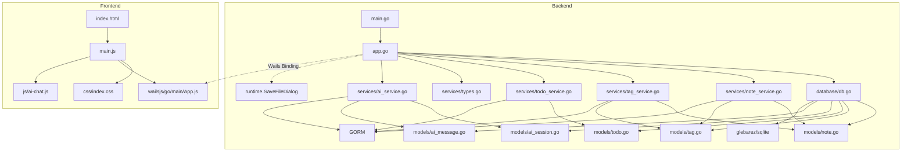

# Jot 项目分析报告

> 项目类型: 桌面端卡片式笔记应用（类小米笔记）
> 技术栈: Wails v2 + Go + GORM + SQLite + 原生 HTML/CSS/JS + CodeMirror 6（编辑器）+ aicli 自研 AI 客户端（go-openai/Ollama 双驱动）

---

## 一、目录结构梳理

```
jot/                                    # 项目根目录
├── main.go                             # 【入口文件】Wails 应用启动入口，配置窗口/资源/绑定
├── app.go                              # 【核心文件】Wails 绑定层，暴露 110+ 个 Go API 给前端
├── go.mod                              # Go 模块定义，声明依赖版本
├── go.sum                              # Go 依赖锁文件
├── wails.json                          # Wails 项目配置（名称/构建脚本/作者）
├── AGENTS.md                           # 本报告文件
│
├── internal/                           # 【内部包】Go 子包统一目录
│   ├── database/
│   │   └── db.go                       # SQLite 初始化（glebarez/sqlite 纯 Go 驱动）+ DefaultDBPath() 路径函数
│   ├── fontutil/
│   │   └── fonts_windows.go           # EnumFontFamiliesW API 封装
│   ├── models/
│   │   ├── note.go                     # Note 实体（笔记）
│   │   ├── tag.go                      # Tag 实体（标签）
│   │   ├── setting.go                  # Setting 实体（KV 配置）
│   │   ├── ai_session.go              # AI 会话实体（标题/置顶/时间戳）
│   │   ├── ai_session_config.go      # AI 会话操作栏配置实体（模型/深度思考/搜索源/卡片召回/笔记引用/技能，与 AISession 一对一关联）
│   │   ├── ai_message.go              # AI 消息实体（角色/内容/思维链，外键关联 SessionID）
│   │   ├── api_profile.go             # API 配置预设实体（名称/服务商/URL/Key）
│   │   ├── ai_prompt.go               # AI 提示词实体（技能提示词数据库存储）
│   │   └── todo.go                    # Todo 实体（待办/文本/完成状态/时间戳）
│   └── services/
│       ├── note_service.go             # 笔记 CRUD + 搜索 + 置顶 + 回收站 + 统计 + 导入导出 + VACUUM 瘦身 + GetAllIDs
│       ├── tag_service.go              # 标签管理 + 笔记标签关联 + 标签计数
│       ├── setting_service.go          # 配置读写
│       ├── ai_service.go               # AI 对话（自研 aicli 客户端，OpenAI 兼容/Ollama 双 Provider + 流式输出 + 深度思考 + 会话持久化 CRUD + 会话配置持久化 + 消息管理 + Token 后端计算 + 会话 Token 持久化 + 技能提示词查询）
│       ├── todo_service.go             # 待办 CRUD（创建/列表/切换完成/删除/编辑）
│       ├── profile_service.go          # API 配置预设 CRUD + 切换/激活
│       ├── crypto.go                   # 敏感密钥 Base64 编码/解码工具（(zk) 前缀标识）
│       ├── search_service.go           # 通用网页搜索（Tavily API）
│       ├── zhihu_search_service.go     # 知乎搜索 + 全网搜索
│       ├── recall_service.go           # 卡片召回（AI 引用笔记）
│       ├── query_refiner.go            # 搜索 Query 精炼
│       ├── notebook_service.go         # 笔记本 CRUD
│       └── types.go                    # 通用类型（PaginatedResult, DataStats, ImportResult, SettingsConfig 等）
│
├── frontend/                           # 【前端目录】Wails 前端（Vanilla + Vite）
│   ├── index.html                      # 入口 HTML，7 个视图
│   ├── package.json                    # 前端依赖（Vite 3.x + CM6 ~16 包 + marked + highlight.js + @codemirror/lang-* 6 包 + @codemirror/legacy-modes）
│   ├── src/
│   │   ├── main.js                     # 【核心文件】前端逻辑（CM6 集成 + 搜索弹窗 + MD 语法页面 + AI 对话 + TOC + 回到顶部 + 批量管理 + 设置统一重构 + 骨架屏；数据管理页/回收站页/常量工具函数/通知类/模拟数据已拆分为独立模块）
│   │   ├── js/                         # 【JS 模块目录】
│   │   │   ├── cm6-syntax-highlight.js # CM6 通用语法高亮模块（11 套配色 + 46+ 语言解析器映射）
│   │   │   ├── data-management.js      # 数据管理页面模块（10 个函数 + reloadSettings，从 main.js 提取）
│   │   │   ├── trash-page.js           # 回收站页面模块（6 个函数，从 main.js 提取）
│   │   │   ├── ai-chat.js              # AI 对话模块（自实现聊天引擎 + 流式输出 + Markdown 渲染 + 多会话管理 + 侧栏折叠 + 多来源搜索 + 卡片召回 + 引用笔记 + 上传文件 + 拖拽上传 + 更多技能 + 用户消息编辑/删除/重新发送 + 右键菜单（含 SVG 图标）+ 分块渲染 + Token 显示 + 提示词迁移 + 会话切换一次性渲染+同步滚动消除跳跃 + 会话配置持久化同步 + 替换消息操作统一后端原子方法）
│   │   │   ├── constants.js            # 图标常量 SVGS + 工具函数（formatTime/highlightText/getSummary/debounce，从 main.js 提取）
│   │   │   ├── notification.js         # NotificationManager 通知类 + window.showNotification 全局函数 + 模拟数据（getMockNotes/getMockTags，从 main.js 提取）
│   │   │   └── preview-worker.js       # Web Worker 离线程 Markdown 渲染（从 src/ 移入）
│   │   └── css/                        # 【CSS 模块化目录】原 style.css + app.css 拆分
│   │       ├── index.css               # 入口文件，@import 引入所有子文件（设计系统 → 组件）
│   │       ├── variables.css           # 12 主题 CSS 变量：`--bg`/`--accent`/`--text-primary` 等
│   │       ├── reset.css               # 全局 reset（box-sizing/body 边距/overscroll-behavior）
│   │       ├── scrollbar.css           # 统一滚动条 6px 细条 + 自动隐藏 + 透明轨道 + 主题变量联动（含主内容区/搜索/AI 对话消息列表）
│   │       ├── animations.css          # 13 个 keyframes + 通用工具类 `.anim-*` + stagger 延迟
│   │       └── components/
│   │           ├── topbar.css          # 顶栏（品牌/搜索框/窗口控制按钮/更多菜单含图标）
│   │           ├── main-content.css    # 主内容区布局（卡片网格/视图容器/滚动）
│   │           ├── sidebar.css         # 笔记本侧边栏三段式设计 + 折叠按钮
│   │           ├── editor.css          # 编辑器面板/CM6 主题/全屏/预览/代码块复制按钮
│   │           ├── dropdowns.css       # 右键菜单/更多菜单/下拉选择器
│   │           ├── modals.css          # 通用模态框/确认弹窗/覆盖层/快捷键页面样式（shortcut-row flex 水平布局）
│   │           ├── settings-panel.css  # 设置页分段控件/开关/按钮
│   │           ├── search-modal.css    # 搜索弹窗/结果列表/高亮
│   │           ├── data-view.css       # 数据管理信笺风格统计 + 操作卡片
│   │           ├── md-reference.css    # MD 语法手册卡片源码/预览双栏对照
│   │           ├── ai-chat.css         # AI 对话页面（气泡/输入区/Markdown 渲染/代码高亮/打字指示器/会话侧栏/折叠按钮/滚动条自动隐藏/消息居中响应式宽度 clamp(800px,92vw,1600px)/32px 间距）
│   │           └── todo.css            # 待办清单页面（输入+筛选一体化工具栏/8 个 @keyframes 动画 + 两段式新增 + 编辑保存动画 + 悬浮预览 tooltip）
│   ├── wailsjs/                        # Wails 自动生成的 JS 绑定
│   │   └── go/main/
│   │       ├── App.js                  # 后端 API 的 JS 封装
│   │       ├── App.d.ts               # TypeScript 类型定义
│   │       └── models.ts              # Go 模型的 TS 类型
│   └── dist/                           # Vite 构建产物（前端编译输出）
│
└── .trae/specs/                        # 项目 Spec 文档目录
```

### 目录规范评价

| 维度 | 评价 |
|------|------|
| **分层清晰度** | 优秀。严格按 `models → services → database → app` 分层，前端后端隔离清晰 |
| **命名规范** | 良好。目录名使用复数形式（models/services），符合 Go 社区惯例 |
| **冗余目录** | 无。每个目录职责单一，无多余层级 |
| **待改进** | 无（frontend/dist 已在 .gitignore 中） |

---

## 二、核心功能模块识别

### 2.1 基础支撑模块

| 模块名称 | 核心功能 | 对应文件 | 核心依赖 |
|----------|----------|----------|----------|
| **数据库初始化模块** | SQLite 连接建立、连接池配置、AutoMigrate | `database/db.go` | glebarez/sqlite, GORM |
| **数据模型层** | Note/Tag/Setting/AISession/AIMessage/APIProfile/AIPrompt/AISessionConfig/Todo 实体定义、GORM tag 映射 | `models/note.go`, `models/tag.go`, `models/setting.go`, `models/ai_session.go`, `models/ai_message.go`, `models/api_profile.go`, `models/ai_prompt.go`, `models/ai_session_config.go`, `models/todo.go` | GORM |
| **通用类型** | 分页返回格式、统计数据、导入导出结构 | `services/types.go` | 无外部依赖 |
| **Wails 绑定层** | Go API → JS Bridge，含 runtime.SaveFileDialog | `app.go` | Wails v2 binding + runtime |
| **前端构建** | Vite 打包、Wails dev 热重载 | `frontend/package.json`, `wails.json` | Vite 3.x（保留，未移除）|
| **前端构建流程** | `wails build` 自动执行 `npm run build`（Vite）→ `frontend/dist/`，再嵌入 Go 二进制 | `go:embed all:frontend/dist` | 前端构建和后端编译都由 `wails build` 一条命令完成 |
| **字体枚举** | Windows GDI EnumFontFamiliesW 系统字体枚举 | `fontutil/fonts_windows.go` | gdi32.dll / user32.dll (syscall) |
| **配置存储** | KV 结构配置读写（字体偏好等） | `services/setting_service.go` | GORM |
| **路径工具** | 数据库默认路径 `~/.jot/data/jot.db` | `database/db.go:DefaultDBPath()` | `os.UserHomeDir()` |

### 2.2 业务核心模块

| 模块名称 | 核心功能 | 对应代码 | 核心输入 | 核心输出 |
|----------|----------|----------|----------|----------|
| **笔记 CRUD** | 创建/更新/查询/删除笔记 | `services/note_service.go` | 标题/内容/颜色/ID | Note 对象/错误 |
| **笔记搜索** | 标题+内容 LIKE 模糊搜索，支持 3 种排序（updated_at/created_at/title，均 pinned DESC 优先）| `note_service.go:Search()` | 关键词/分页/sortBy 参数 | 笔记列表+总数 |
| **笔记置顶** | 切换置顶状态 | `note_service.go:TogglePin()` | 笔记 ID | 更新后的笔记 |
| **回收站** | 软删除/查看/恢复/永久删除 | `note_service.go:Delete/GetTrash/Restore/PermanentDelete` | 笔记 ID | 操作结果 |
| **批量回收站操作** | 全部恢复/全部清空 | `note_service.go:RestoreAll/EmptyTrash` | — | 操作结果 |
| **标签管理** | 标签 CRUD | `services/tag_service.go` | 名称/颜色/ID | Tag 对象 |
| **笔记标签关联** | 为笔记添加/移除标签 | `tag_service.go:AddTagToNote/RemoveTagFromNote` | 笔记ID+标签ID | 操作结果 |
| **按标签筛选** | 通过标签 ID 查询笔记 | `note_service.go:GetByTag()` | 标签ID/分页参数 | 笔记列表+总数 |
| **数据统计** | 统计笔记总数/回收站数/标签数 | `note_service.go:GetStats()` + `tag_service.go:Count()` | — | DataStats 对象 |
| **数据导出为 .db** | 导出为 SQLite 数据库文件（VACUUM INTO + fs.CopyEx）| `app.go:ExportDataWithDialog()` | — | "导出成功" 提示 |
| **数据导入** | 从 JSON 文件导入笔记（跳过同名） | `note_service.go:ImportFromJSON()` | JSON 字节数组 | ImportResult 对象 |
| **前端卡片渲染** | 卡片网格展示 | `frontend/src/main.js` | 笔记数据数组 | DOM 渲染 |
| **前端编辑器** | 笔记编辑模态框（CM6 编辑器，支持行号/撤销重做/查找替换/Tab缩进/自动补全/自动闭合括号/Markdown 语法高亮） | `frontend/src/main.js` | 笔记数据/用户输入 | 保存/取消 |
| **前端查找替换** | CM6 search panel，Ctrl+F 查找 / Ctrl+H 查找替换，选中内容自动填充搜索框，预览模式自动切回编辑模式搜索 | `frontend/src/main.js:handleKeyboardNavigation()` | 搜索关键词 | 搜索面板匹配导航 |
| **前端搜索交互** | 搜索弹窗 200ms 防抖自动搜索，支持标题/内容/标签（多标签 AND 语义过滤）、笔记本/日期/排序筛选器（排序 3 选项：更新时间/创建时间/名称，均 pinned 优先） | `frontend/src/main.js` | 关键词 + 过滤条件 + sortBy | 搜索弹窗结果列表 |
| **前端导航切换** | 网格/搜索/设置/数据管理/回收站/AI 助手视图切换 | `frontend/src/main.js:switchView()` | 视图名称 | 视图 DOM 切换 |
| **前端右键菜单** | 右键弹出菜单（查看/编辑/置顶/删除） | `frontend/src/main.js` | 鼠标事件+笔记ID | 菜单显示/操作 |
| **前端只读查看** | 左击笔记打开只读查看器 | `frontend/src/main.js:openEditor()` | 笔记 ID | 只读查看模态框 |
| **标签搜索** | 点击标签 chip 打开搜索弹窗并预选该标签筛选器 | `frontend/src/main.js:searchByTag()` | 标签 ID | 搜索弹窗结果列表 |
| **键盘快捷键** | Ctrl+F 编辑器搜索 / Ctrl+H 编辑器查找替换 / Ctrl+N 新建 / Ctrl+L 编辑器切换模式 / PgUp/PgDn 滚动 / Ctrl+Home/End / Ctrl+数字键 1-9 导航（Ctrl+7 切换快捷键页开关） | `frontend/src/main.js:handleKeyboardNavigation()` | 键盘事件 | 对应操作 |
| **版本号信息** | 返回 verman.V.GitVersion 纯版本号 | `app.go:GetVersion()` | — | 版本字符串 |
| **打开外链** | 调用 runtime.BrowserOpenURL 在默认浏览器打开链接 | `app.go:OpenProjectURL()` | URL 字符串 | — |
| **打开数据目录** | 在文件管理器中打开 `~/.jot/data/` | `app.go:OpenDataDir()` | — | explorer 文件管理器 |
| **一键备份** | 备份当前库到 `~/.jot/backup/jot-backup.db`（覆盖）| `app.go:BackupToDir()` | — | 备份成功提示 |
| **一键还原** | 从 `jot-backup.db` 还原并刷新笔记/标签/统计 | `app.go:RestoreFromDir()` | — | Toast 提示结果 |
| **外观设置** | 字体族下拉选择（搜索+键盘导航）+ 字体大小预设/自定义 + 主题选择（12 种）+ 主题预览迷你 UI 卡片 | `frontend/src/main.js:loadFontSettings/applyFontFamily/applyFontSize` + `loadThemeSetting` | 字体名称/大小/主题名称 | 更新 CSS 变量 |
| **AI 对话** | 自研 aicli 客户端，支持 OpenAI 兼容 + Ollama 双 Provider 流式对话（自实现聊天引擎 + Markdown/代码高亮渲染 + 多会话管理 + 会话置顶 + 更多按钮下拉菜单 + 多来源联网搜索（Tavily/知乎/全网搜索）+ 卡片召回 + 引用笔记 + 更多技能 + 用户消息编辑/删除/重新发送 + 操作按钮折叠 + Token 显示 + 提示词迁移到数据库 + 联网搜索 Query 精炼 + 搜索指示器三态展示 + 搜索来源与召回卡片结构化数据持久化 + 会话自动恢复 + 后端统一上下文注入（引用笔记/角色扮演/追问引用/上传文件）） | `services/ai_service.go` + `aicli/` + `frontend/src/js/ai-chat.js` + `frontend/src/css/components/ai-chat.css` | 用户消息 | AI 流式回复 |
| **AI 配置管理** | Base URL/API Key/Model 的读写 + 连通性测试 + 模型列表获取 | `app.go:GetAIConfig/SaveAIConfig/TestBaseURL/FetchAIModels` | 配置项 | 配置/测试结果 |
| **统一通知系统** | NotificationManager 单例类，右上角浮动通知，4 种类型 + undo 撤销 | `frontend/src/js/notification.js` | 消息/类型/回调 | 通知 DOM 创建与自动销毁 |

### 2.3 模块分层图

```
┌─────────────────────────────────────────────────────┐
│                    Frontend                          │
│  (main.js / css/index.css / index.html)               │
│   ├─ 视图渲染 (卡片/搜索/设置/数据管理/回收站/AI)     │
│   ├─ 交互逻辑 (事件绑定/状态管理)                      │
│   └─ Wails Bridge (window.go.main.App.*)              │
└────────────────────────┬────────────────────────────┘
                         │ Wails Binding (JSON 序列化)
┌────────────────────────▼────────────────────────────┐
│              App 层 (app.go)                         │
│  100+ 个绑定方法（CRUD/搜索/置顶/回收站/统计/导入导出/路径/│
│    AI 配置/会话管理/消息管理/笔记本回收站/配置文件预设)    │
│  (含 runtime.SaveFileDialog 原生对话框调用)            │
└────────────────────────┬────────────────────────────┘
                         │
              ┌──────────┼──────────┐
              ▼          ▼          ▼
    ┌─────────────┐ ┌──────────┐ ┌────────────┐ ┌──────────────┐
    │ NoteService │ │TagService│ │TodoService │ │  AI Service  │
    │ (CRUD/搜索/ │ │(CRUD/关联)│ │ (CRUD/切换 │ │ (AI 流式对话 │
    │  置顶/回收站 │ │          │ │  完成/删除 │ │  会话管理    │
    │  统计/导入   │ │          │ │  编辑)     │ │  消息持久化) │
    │  导出)      │ │          │ │            │ │              │
    └──────┬──────┘ └─────┬────┘ └──────┬─────┘ └──────┬───────┘
           │              │             │              │
           └──────┬───────┴──────┬──────┴──────┬───────┘
                  │              │              │
                  ▼              ▼              ▼
        ┌─────────────────┐ ┌──────────┐ ┌─────────────────┐
        │    GORM ORM     │ │GORM ORM │ │   GORM ORM     │
        │ (数据访问层)      │ │(待办层)  │ │ (AI 模型层)     │
        └────────┬────────┘ └────┬─────┘ └────────┬────────┘
                 │               │                 │
                 └───────────────┴─────────────────┘
                                    ▼
                          ┌─────────────────┐
                          │     SQLite      │
                          │ (glebarez/sqlite│
                          │  纯 Go 驱动)     │
                          └─────────────────┘
```

---

## 三、模块间依赖关系分析

### 3.1 依赖关系详表

| 依赖方 | 被依赖方 | 依赖类型 | 依赖详情 |
|--------|----------|----------|----------|
| `app.go` | `database` | 编译依赖 | 调用 `database.InitDB()` 获取 `*gorm.DB` 实例 |
| `app.go` | `services` | 编译依赖 | 创建 `NoteService` / `TagService` / `TodoService` / `SettingService` 实例 |
| `app.go` | `models` | 编译依赖 | 返回 `*models.Note` / `*models.Tag` / `*models.Todo` / `*models.Setting` 类型 |
| `app.go` | `runtime` | 编译依赖 | `runtime.SaveFileDialog` 原生保存对话框 |
| `app.go` | `fontutil` | 编译依赖 | `fontutil.GetFonts()` 枚举系统字体 |
| `services` | `models` | 编译依赖 | 操作 Note/Tag/Todo/Setting/AISession/AIMessage 结构体 |
| `services` | GORM | 编译依赖 | `*gorm.DB` 数据库操作 |
| `database` | `models` | 编译依赖 | `AutoMigrate(&models.Note{}, &models.Tag{}, &models.Todo{}, &models.Setting{}, &models.AISession{}, &models.AIMessage{})` |
| `database` | glebarez/sqlite | 编译依赖 | 纯 Go SQLite 驱动 |
| `fontutil` | gdi32/user32 | 运行时依赖 | syscall 调用 Windows GDI API |
| `frontend/main.js` | `wailsjs/go/main/App.js` | 运行时调用 | `window.go.main.App.*` 调用后端 API |
| `frontend/wailsjs` | `app.go` | 构建时生成 | `wails generate module` 自动生成 |

### 3.2 依赖关系图（Mermaid）



### 3.3 依赖问题分析

| 问题类型 | 描述 | 严重程度 |
|----------|------|----------|
| **循环依赖** | 无。所有依赖为单向 `main → app → services → models`，无循环 | ✅ 无问题 |
| **过度依赖** | 无。每个 Service 仅依赖 `*gorm.DB` 和自身模型 | ✅ 无问题 |
| **依赖缺失** | 无。`go.sum` 中所有传递依赖完整 | ✅ 无问题 |
| **隐式依赖** | 前端 `window.go` 对象依赖 Wails 运行时注入，本地开发/独立预览时不可用 | ⚠️ 有降级处理（Mock 数据） |
| **编译期依赖 vs 运行时依赖** | `wailsjs/` 目录需在修改 `app.go` 后重新生成 | ⚠️ 需手动执行 `wails generate module` |

---

## 四、设计模式与实现逻辑

### 4.1 设计模式识别

| 模式名称 | 应用位置 | 说明 | 代码示例 |
|----------|----------|------|----------|
| **Service Layer 模式** | `services/` 包 | 将业务逻辑从 controller（app.go）中抽离，封装为独立 Service 结构体 | `NoteService` / `TagService` |
| **依赖注入 (DI)** | `app.go` | Service 依赖的 `*gorm.DB` 通过构造函数注入 | `NewNoteService(db)` / `NewTagService(db)` |
| **Repository 模式** | `services/` 包内嵌 GORM | Service 内部直接使用 GORM 作为数据访问层 | `s.db.Create()` / `s.db.Where()` |
| **单例模式 (应用级)** | App 结构体 | Wails 运行时保证 App 实例唯一 | `NewApp()` 在 `main()` 中仅调用一次 |
| **MVC 变体** | 整体架构 | Model(models) - View(frontend) - Controller(app.go + services) 分层 | 见分层图 |
| **降级策略 (Fallback)** | `frontend/main.js` | 后端未绑定时自动使用 Mock 数据 | `if (!window.go.main.App.GetNotes) { state.notes = getMockNotes(); }` |
| **Wails Runtime 集成** | `app.go` | 通过 runtime 包调用原生桌面功能 | `runtime.SaveFileDialog()` 弹出系统保存对话框 |

### 4.2 核心业务逻辑流程

#### 4.2.1 笔记创建流程

```
用户点击 "+" 按钮 / Ctrl+N
  → openEditor(null)          // 打开空编辑器模态框
    → 用户填写标题/内容/选择颜色/选择标签
    → 点击"保存"按钮
      → createNote()
        → 前端校验（标题不为空）
        → window.go.main.App.CreateNote(title, content, color)
          → app.go:CreateNote()
            → noteService.Create()          // GORM db.Create(&note)
            → 返回 *models.Note（含 id）
          → 遍历 selectedTags
            → window.go.main.App.AddTagToNote(note.id, tagId)
              → tagService.AddTagToNote()   // GORM Association("Tags").Append
        → closeEditor()                     // 关闭模态框
        → loadNotes()                       // 重新加载笔记列表
          → GetNotes(1, 100)                // 分页查询
          → renderCardGrid()                // 渲染右侧卡片网格
```

#### 4.2.2 笔记搜索流程

```
Ctrl+F / Ctrl+K → 打开搜索弹窗
  → els.searchModalInput 自动聚焦
  → 用户输入文字 → 200ms 防抖
    → searchModalLoadPage(1, false)
```

...（中间流程不变）

---

## 五、技术栈评估

### 5.1 技术栈清单

| 层级 | 技术 | 版本 | 用途 |
|------|------|------|------|
| **桌面框架** | Wails v2 | v2.9.2 | 桌面窗口 + Go ↔ JS Bridge |
| **后端语言** | Go | go1.22+ | 后端业务逻辑 |
| **数据库** | SQLite | — | 本地数据存储 |
| **数据库驱动** | glebarez/sqlite | v1.11 | 纯 Go SQLite 驱动（无 CGO） |
| **ORM** | GORM | v1.25 | 对象关系映射 |
| **前端构建** | Vite | v3.2.11 | 前端打包工具 |
| **前端技术** | 原生 HTML/CSS/JS | — | UI 渲染 |
| **编辑器** | CodeMirror 6 | @codemirror/view v6.26 | 笔记编辑器 |
| **Markdown 解析** | marked | v12.0 | Markdown → HTML 渲染 |
| **代码高亮** | highlight.js | v11.10 | 代码块语法高亮 |
| **AI 对话** | 自研 aicli 客户端（go-openai + ollama 双驱动） | github.com/sashabaranov/go-openai v1.41.2 + github.com/ollama/ollama v0.31.1 | 流式对话/深度思考/多会话/联网搜索/卡片召回 |
| **本地存储** | localStorage | — | UI 状态持久化（主题/侧栏状态等） |

### 5.2 技术栈选型评价

| 评价维度 | 说明 |
|----------|------|
| **合理性** | Wails v2 适合桌面端 Go 应用，原生 HTML/CSS/JS 避免前端框架学习成本 |
| **性能** | SQLite + GORM 组合满足本地笔记应用性能需求，流式输出不阻塞 UI |
| **维护性** | 前后端分层清晰，CSS 模块化拆分降低维护成本 |
| **可扩展性** | 新增功能只需添加 binding 方法和前端模块，架构本身无限制 |
| **风险** | Wails v2 社区较小，Wails v3 路线图不明确，长期维护可能受限 |

### 5.3 版本兼容性问题

| 问题 | 说明 |
|------|------|
| **Wails 版本锁定** | `go.mod` 中 `wails.io v2.9.2` 已固定，`wails/v2` 包需与 Wails CLI 版本匹配。升级需同步更新 CLI, go.mod, wails.json 三方 |
| **GORM AutoMigrate** | 新增模型（如 AISession/AIMessage）后需在 `database/db.go` 的 `AutoMigrate` 中注册，否则表不会自动创建 |

---

## 六、补充分析

### 6.1 扩展性评估

| 扩展方向 | 可行性 | 建议 |
|----------|--------|------|
| **多用户/云端同步** | 低 | 如需云端同步，建议引入 WebDAV/第三方同步库 |
| **AI 功能扩展** | 高 | 当前 AI 会话架构（Session + Message 模型）天然支持多会话切换和上下文管理，易于扩展。新增方法直接注册 binding 到 app.go 即可 |
| **国际化 (i18n)** | 中 | 所有 UI 文本硬编码在 HTML/JS 中，需统一抽离 |
| **插件系统** | 低 | 原生 HTML 架构不适合动态加载插件 |

### 6.2 性能关键点

| 关键点 | 现状 | 评估 |
|--------|------|------|
| **数据库查询** | GORM + SQLite，分页查询 | ✅ 满足笔记本规模 |
| **前端渲染** | 卡片网格渲染 | ✅ 性能良好 |
| **AI 流式输出** | 基于 Wails Events 逐块推送，不阻塞 UI | ✅ 体验优秀 |
| **CM6 编辑器** | 仅初始化当前编辑的笔记 | ✅ 性能良好 |
| **多会话切换** | 切换时从后端加载对应会话的消息，采用一次性同步渲染（无 yield）+ 同步滚动（`scroll-behavior: auto` 临时禁用），浏览器只绘制一次最终状态，彻底消除视觉跳跃 | ✅ 切换瞬间完成，无任何中间状态闪烁 |
| **操作按钮折叠测量** | `collapseActionsIfNeeded()` 支持 `sync` 同步模式，在 `switchSession()` 中使用同步测量避免布局抖动 | ✅ 消除消息"跳跃"问题 |

### 6.3 异常处理分析

| 异常场景 | 处理方式 |
|----------|----------|
| **后端 API 不可用** | 前端 Mock 数据降级 |
| **AI API 调用失败** | HTTP 状态码封装为 11 种分类中文提示（auth_error/rate_limit/server_error 等），通过 `ai:stream-error` 事件以 JSON 格式（`{category, user_msg, raw}`）传递到前端，解析后通过 `showNotification()` 右上角通知展示，不再插入对话流中 |
| **联网搜索失败** | 每个搜索来源独立发射错误事件 `ai:search-error`，不影响其他来源继续搜索；前端通过 `showNotification()` 提示用户 |
| **数据库损坏** | 备份还原机制 |
| **流式连接中断** | 前端监听 `ai:stream-error` 事件，显示错误提示 |
| **会话/消息查询失败** | 返回空列表 + 控制台错误日志，不阻断 UI |

### 6.4 安全分析

| 风险点 | 评估 |
|--------|------|
| **本地数据库** | SQLite 文件本地存储，无远程访问风险 |
| **API Key 存储** | Base64 编码存储在 DB 中，带 `(zk)` 前缀标识，前端读写均为解码后明文。仅防肉眼查看，非真实加密 |
| **XSS 风险** | AI 回复经 `marked.parse()` 渲染，`marked` 默认 Sanitize |

---

## 七、项目核心特点

### 核心设计理念

1. **Wails v2 跨平台桌面应用**：Go + 原生前端（HTML/CSS/JS）架构，兼顾后端性能和前端灵活性

2. **CodeMirror 6 编辑器集成**：主流 Markdown 编辑器引擎，支持行号/撤销重做/查找替换/Tab缩进/自动补全/语法高亮（11 套配色 + 46+ 语言）

3. **CSS 变量主题系统（12 主题）**：全局 CSS 变量联动（`--bg`/`--accent`/`--border` 等），一键切换 12 套系统主题 + 11 套代码高亮主题，所有组件自动适配

4. **三步交互范式**：笔记本（容器）→ 笔记卡片（列表）→ 编辑器（操作），符合直觉的文件夹-文件-编辑结构

5. **自实现 AI 对话引擎（go-openai + ollama/ollama/api 双驱动）**：基于 go-openai 和 ollama/api 双库实现统一流式接口，支持 OpenAI 兼容（DeepSeek、通义千问等）和 Ollama 本地模型双 Provider。流式输出 + Markdown 渲染 + 代码高亮 + 思维链折叠 + 多会话管理 + 侧栏折叠 + 多来源联网搜索（Tavily/知乎/全网搜索）+ 卡片召回 + 引用笔记 + 更多技能 + 用户消息编辑/删除/重新发送 + Token 统计 + **后端统一上下文注入**。Provider 通过前端设置页下拉切换，配置自动持久化。

6. **统一的通知系统**：NotificationManager 单例，右上角浮动通知，支持 success/error/warning/info 四种类型 + undo 撤销

7. **过度动画与交互反馈**：13 个 keyframes、stagger 延迟、hover 分层反馈、spring 弹性缓动、骨架屏 shimmer

8. **无 UI 框架依赖**：无 Vue/React/Svelte，纯手写 DOM 操作，极致轻量

### 设计系统

- **尺寸**：`--radius-md`(8px) / `--radius-sm`(6px)，全局统一
- **间距**：4px 基线网格，组件内部 8-16px，布局 16-24px
- **阴影**：4 层 Token — `elevated`(卡片) / `dropdown`(下拉菜单) / `modal`(模态框) / `toast`(通知)
- **语义色**：`--success`(绿) / `--warning`(黄) / `--error`(红) / `--info`(蓝)
- **字体**：全局统一 `var(--font-family)`，编辑器和代码块跟随系统设置
- **滚动条**：6px 细条，`--scrollbar-thumb` / `--scrollbar-thumb-hover` 联动 12 主题
- **圆角一致性**：所有交互元素（按钮/卡片/输入框/下拉菜单/模态框）均使用 `var(--radius-sm)` 或 `var(--radius-md)`，无硬编码

---

## 八、待优化点

### 中期优化

- **虚拟列表支持**：AI 对话消息较多时，使用 IntersectionObserver 虚拟化

### 架构层面

- **代码分割**：main.js 可继续拆分为独立视图模块
- **CSS 变量颜色 Token**：AI 对话页面的配色确认已全部纳入主题系统

### 已实现

- [x] **CSS 模块化拆分**（variables, reset, scrollbar, animations + 6 组件模块）
- [x] **AI 对话自实现**（流式输出 + Markdown 渲染 + 思维链 + 代码高亮 + 多会话 + 侧栏折叠）
- [x] **笔记软删除与回收站**（Trash/Restore/PermanentDelete/RestoreAll/EmptyTrash）
- [x] **Markdown 语法手册页面**（10 张语法卡片 + 双栏源码/预览 + 打开编辑器试试）
- [x] **12 系统主题 + 11 代码高亮主题**（统一 CSS 变量体系）
- [x] **搜索弹窗**（200ms 防抖 + 笔记本/日期/排序/标签筛选器）
- [x] **一键备份/还原**（BackupToDir/RestoreFromDir + VACUUM）
- [x] **返回查看/保存脏检测**（无变更不触发保存 + 不弹出通知）
- [x] **数据库瘦身 VACUUM**（数据管理页面按钮触发）
- [x] **字体设置**（族+大小，联动 CSS 变量）
- [x] **通知系统**（右上角 NotificationManager，4 种类型 + undo 撤销）
- [x] **更多菜单**（7 个选项，`min-width: 120px`）
- [x] **数字键导航**（Ctrl+数字键 1-9）
- [x] **快捷键说明页**（Ctrl+7 打开，可滚动列表）
- [x] **拖拽导入闪烁动画**（3 次红色慢闪）
- [x] **多来源联网搜索**（Tavily/知乎/全网搜索三来源独立开关 + 独立 Key 配置）
- [x] **搜索开关联动**（Key 为空自动禁用、点击启用时校验配置）
- [x] **切换会话分块渲染 + 延迟高亮**（CHUNK_SIZE=5 yield + requestIdleCallback hljs）
- [x] **消息操作栏简化**（移除独立按钮，仅常驻显示 Token，操作通过右键菜单）
- [x] **设置页 Token 默认隐藏 + 知乎 URL 修正**
- [x] **存储优化增强**（回收站自动清理 + 孤儿笔记迁移 + 空 AI 会话清理 + VACUUM 整合流程）
- [x] **批量管理重构**（FAB 入口 + CSS transition 动效 + 复选框移除 + 置顶按钮可操作）
- [x] **更多菜单子菜单**（"帮助参考"合并快捷键/MD 语法，Ctrl+7→AI 助手）
- [x] **待办清单功能**（Todo CRUD + 输入筛选一体化工具栏 + 6 个 keyframes 动画 + 筛选按钮数量显示）
- [x] **骨架屏编辑器**（点击笔记立即显示骨架屏 shimmer，异步加载内容后替换）
- [x] **搜索来源 UI 优化**（内联卡片+折叠面板+SVG 图标+代码去重）
- [x] **召回卡片 UI 优化**（折叠面板+file_ext 徽章+CSS line-clamp+代码去重）
- [x] **编辑器骨架屏回归修复**（非缓存笔记打开校正+scrollbar-gutter 稳定）
- [x] **品牌标识动画优化**（transform 独立驱动，3 次迭代达成平滑过渡）
- [x] **用户消息 Token 提前展示**（SaveAIMessage 返回 token 数，立即显示）
- [x] **停止按钮全阶段防护**（搜索/LLM 阶段取消不报错不残留）
- [x] **Logger 初始化顺序修复**（NewApp 阶段初始化 Logger，startup 清理冗余代码）

---

## 九、关键记忆点

1. **Wails v2 事件驱动流式输出**：AI 回复流式数据传输使用 `runtime.EventsEmit`（Go 端）+ `EventsOn`（前端），Go 端 `bufio.Reader` 逐行解析 SSE `data: {...}` 流，通过回调（`onChunk`/`onThinking`/`onDone`/`onError`）逐块推送。前端在 `onSend()` 中动态注册一次性事件回调（`Array.from` 包裹闭包捕获局部变量），每个请求各自独立的 `streamingContent`/`streamingEl`/`lastReasoningEl` 局部变量隔离，防止多消息冲突

2. **思维链折叠**：深度思考模型返回 `delta.reasoning_content`，Go 端在 `streamChoice.Delta` 中解析此字段，通过 `onThinking` 回调和 `ai:stream-thinking` 事件推送。前端创建 `<details class="ai-thinking">` 可折叠区域（summary + 内容），首次 thinking chunk 懒创建，后续流式追加，`addMessage()` 也接受 `reasoningContent` 参数用于显式渲染

3. **AI 会话持久化**：`AISession` + `AIMessage` 两个 GORM 模型（`ai_session.go`/`ai_message.go`），`SaveAIMessages()` 保存一轮对话并自动生成标题（取首条用户消息前 30 字），`LoadAISessionMessages()` 按 `CreatedAt` 升序返回历史消息，`ClearAISessionMessages()` 删除指定会话全部消息

4. **AI 对话侧栏 + 折叠机制**：左右分栏布局（`.ai-chat-layout`），左侧 `.ai-session-sidebar`（220px），右侧 `.ai-chat-content` flex:1。折叠按钮（`.ai-sidebar-toggle`）为 14×44px 纤细条状，置于侧栏外作为兄弟元素，通过兄弟选择器 `~` 控制 `left` 定位（展开时 220px、折叠时 0）。展开时按钮左侧加 `border-left: 1px solid var(--border)` 延续分割感。折叠状态 `localStorage` 持久化，CSS `transition: width 0.25s ease` 动画。SVG Chevron 图标（Lucide 风格）替代 Unicode 字符

5. **`onAIChatViewActivated` 惰性加载**：仅在 `activeSessionId === null`（无活跃会话）时自动加载第一个会话，视图切换不重置当前会话状态，避免切换回来后消息错乱。`switchSession()` 按 `msg.role` 遍历渲染，`Message` 结构体含 `ReasoningContent` 字段

6. **CSS 变量系统**：全局使用 `var(--xxx)` 定义主题变量，AI 对话页面全组件（气泡/侧栏/输入区/按钮）联动 12 套主题

7. **LangChainGo 统一 AI 接口**：`CallAIStream` 使用 `llms.GenerateContent` + `WithStreamingFunc`/`WithStreamingReasoningFunc` 统一流式输出。`createLLM()` 工厂函数根据 `provider` 字段创建对应 LLM 实例：`openai.New()`（OpenAI 兼容，含 BaseURL/Token/Model 配置）或 `ollama.New()`（Ollama 本地，含 ServerURL/Model 配置）。前端设置页新增「服务商」下拉选择器，切换时自动填充默认 URL、清空模型、保存配置。

8. **消息渲染与气泡**：`addMessage()` 创建消息气泡 DOM，AI 侧使用 `marked.parse()` 渲染 Markdown（含 `hljs.highlightElement()` 代码高亮），用户侧以 `<pre class="ai-user-msg">` 转义纯文本。打字指示器内嵌到 `msg-content` 内部（不独立建气泡）

9. **多来源联网搜索（三来源后端集成）**：`CallAIStream` 支持三个独立搜索来源：Tavily（通用搜索）、知乎搜索（`SearchZhihuContent`）、全网搜索（`SearchGlobalContent`）。后端通过 `SearchWeb`（Tavily）、`SearchZhihuContent`（知乎内容）、`SearchGlobalContent`（全网搜索）三个函数分别执行，每个来源独立发射 `ai:search-error` 事件处理失败不影响其他来源。搜索结果统一聚合注入 system message。详见 [search_service.go](internal/services/search_service.go)、[zhihu_search_service.go](internal/services/zhihu_search_service.go)

10. **前端多来源搜索动画**：搜索动画使用简易旋转地球 SVG + 文本变化展示状态，不展示具体来源状态详情。搜索错误通过 `showNotification()` 右上角浮动通知提示，不阻塞对话。`ai:search-source-status` 事件展示各来源进度（searching/done/failed），`ai:search-error` 事件携带来源标签和错误信息。详见 [ai-chat.js](frontend/src/js/ai-chat.js) `startStreaming()` 中的搜索事件监听

11. **搜索开关 Key 校验 + 禁用态**：前端三组搜索开关（Tavily/知乎/全网）分别受对应 Key/Tokon 配置控制。Key 为空时开关自动 disabled 防止误启用；点击启用时若 Key 未配置则 `showNotification` 提示用户先配置；修改 Key 为空时自动禁用对应开关。详见 [main.js](frontend/src/main.js) 中 settings 页搜索开关的校验逻辑

12. **切换会话性能优化（分块渲染）**：`switchSession()` 中对大量历史消息采用分块渲染策略（CHUNK_SIZE=5），每块渲染后 `setTimeout` 0ms yield 给浏览器，避免一次性渲染大量 DOM 导致卡顿。移除 `collapseActionsIfNeeded` 同步调用（该函数已删除，不再需要布局抖动补偿）。详见 [ai-chat.js](frontend/src/js/ai-chat.js) `switchSession()`

13. **延迟语法高亮（deferHighlight）**：`renderMarkdown()` 新增 `deferHighlight` 参数，历史消息加载时使用 `deferHighlightBlocks()` 通过 `requestIdleCallback` 渐进式执行 `hljs.highlightElement()`，优先级低于首次渲染，优先保证页面交互。详见 [ai-chat.js](frontend/src/js/ai-chat.js)

14. **设置页修复集**：①知乎 Token 输入框默认 `type="password"` 隐藏；②三个搜索开关检查对应 Key/Tokon 是否配置，未配置时 disabled；③知乎开发者地址改为 `https://developer.zhihu.com/`。详见 [main.js](frontend/src/main.js)

15. **重置出厂设置修复集**：①`resetDatabase()` 清空 `#aiChatMessages.innerHTML` 和 `#aiSessionList.innerHTML` 避免旧数据残留；②`onAIChatViewActivated()` 中清除标题/contextSize/chatHistory/sessions/activeSessionId 等模块级变量；③重置后自动调用 `onAIChatViewActivated?.()` 让 AI 助手模块立即进入就绪状态，消除闪烁。详见 [data-management.js](frontend/src/js/data-management.js)、[ai-chat.js](frontend/src/js/ai-chat.js)

16. **AI 错误通知修复（`ai:stream-error` JSON 格式化）**：`app.go` 中搜索关键词精炼失败时（`services.RefineSearchQuery` 出错），原始代码拼接纯文本前缀 `"搜索关键词精炼失败: " + err.Error()` 发射事件，前端 `JSON.parse()` 失败，错误落入 `addErrorMessage()` 被插入对话流。修复后通过 `errors.As()` 解出 `*aicli.AIErrorWrapper`，直接透传其 JSON（含 `category/user_msg/raw`）；若不是 AI 错误则用 `CategoryUnknown` 创建标准 JSON。前端收到合法 JSON 后走 `showNotification()` 右上角通知。详见 [app.go](app.go#L1079-L1088)、[ai-chat.js](frontend/src/js/ai-chat.js#L2227-L2237)、[errors.go](internal/aicli/errors.go)

17. **全局链接系统浏览器打开**：在 `main.js` 的 `initEventListeners()` 中添加 `document` 级 click 事件委托，拦截所有 `<a>` 标签点击，通过 `e.preventDefault()` + `window.runtime.BrowserOpenURL(href)` 在系统默认浏览器中打开。排除 `#` 锚点链接和 `javascript:` 伪协议。同时移除了 `ai-chat.js` 中 `messagesEl` 级别的区域委托和搜索来源面板中的冗余 `link.addEventListener` 代码。详见 [main.js](frontend/src/main.js#L5131-L5138)

18. **后端统一上下文注入架构**：AI 对话的上下文拼接逻辑全部迁移到后端 `CallAIStream`。8 步拼接顺序定义为 `1→2→3→4→5→6→7→8`：角色扮演笔记 → 笔记引用 → 追问引用 → 上传文件 → 联网搜索结果 → 卡片召回结果 → 技能提示词（含 `{roleplay_context}` 占位符替换）。前端只传元数据（角色扮演笔记 IDs / 引用笔记 IDs / 追问引用文本 / 上传文件列表），不再拼接 `systemContext`。详见 [app.go](app.go#L1548-L1655)

19. **后端原子替换会话消息**：AI 消息的编辑/删除/重发/重新生成四个操作中的 DB 写入，从前端两步调用 `ClearAISessionMessages` + `SaveAIMessages` 合并为后端 `ReplaceAISessionMessages(sessionID, messages)` 单次调用。后端使用 GORM Transaction 保证清空+写入的原子性。前端 `chatHistory` 为空时 fallback 到 `ClearAISessionMessages`。详见 [ai_service.go#L661-L728](internal/services/ai_service.go#L661-L728)、[app.go#L2048-L2059](app.go#L2048-L2059)

20. **AI 消息懒加载 + 后端上下文自取**：`CallAIStream` 重构为仅接收 `userText` 和元数据，后端自行从 DB 加载全部历史消息构建上下文。新增 `CallAIStreamRegenerate` 处理再生场景（接收元数据不含 userText，加载 DB 中最后一条用户消息）。新增 `LoadAISessionMessagesPaginated` 分页加载（游标 `beforeID`，默认 6 条 ASC）。编辑/删除/重发/再生从基于 `chatHistory.splice` 改为基于 `msgID` 的 `TruncateAISessionAtMessage`/`TruncateAISessionAfterMessage`。Token 显示改为后端 `SumSessionTokens` + `GetSessionContextTokens` 统计。`stream-done` 事件扩展为 9 参数（含 `userMsgID`/`assistantMsgID`）。详见 [app.go](app.go)、[ai_service.go](internal/services/ai_service.go)、[ai-chat.js](frontend/src/js/ai-chat.js)

---


## 一百九十、新增记忆点（搜索来源 UI 优化 — 内联卡片 + 折叠面板 + SVG 图标 + 去重）

| 记忆点 | 内容 |
|--------|------|
| **优化背景** | AI 回复消息底部的搜索来源 UI 使用原生 `<details>` 折叠面板、emoji 图标、两处重复 ~40 行渲染代码。单一来源和多个来源使用相同的 UI 结构，缺少差异化展示。详见 [ai-chat.js](frontend/src/js/ai-chat.js) |
| **单一来源 → 内联引用卡片** | 当只有 1 条搜索结果时，展示紧凑链接预览卡片（`search-source-card`）：SVG 来源图标 + 标题（1 行省略）+ ↗ 外链图标 + 域名（等宽字体）+ 2 行渐隐摘要。整张卡片可点击打开原文，hover 时边框变色 + link 图标出现。详见 [ai-chat.js](frontend/src/js/ai-chat.js) |
| **多来源 → 自定义折叠面板** | 当有 2+ 条搜索结果时，展示自定义折叠面板（`search-sources-panel`）：折叠头使用 `<button>` 替代 `<details>`，包含地球 SVG 图标 + "来自 N 个来源 · M 条结果" + 展开箭头 ▶。展开/收起使用 `max-height` + `opacity` 过渡动画（300ms ease），箭头旋转 90°。详见 [ai-chat.css](frontend/src/css/components/ai-chat.css) |
| **来源分组展示** | 按 `source_label` 分组（Tavily / 知乎搜索 / 全网搜索），每组包含 SVG 类型图标 + 名称 + 计数徽章（等宽字体）。条目跨组连续编号（方便口头引用），每个条目展示标题（1 行省略）+ 域名标签（等宽）+ ↗ 外链图标 + 2 行渐隐摘要。hover 时显示背景 + 外链图标。详见 [ai-chat.js](frontend/src/js/ai-chat.js) |
| **emoji → SVG 图标** | 移除所有 emoji 图标：`SEARCH_SOURCE_ICON`（地球网格替代 `🌐`）、`SATELLITE_ICON`（卫星天线替代 `📡` Tavily）、`BOOK_ICON`（书本替代 `📖` 知乎搜索）、`GLOBE_ICON`（全球网络替代 `🌍` 全网搜索）、`EXTERNAL_ICON`（↗ 外链）、`CHEVRON_RIGHT_ICON`（▶ 展开箭头）。所有 SVG 使用 `currentColor` + `stroke-width="1.5"` + 14×14 viewBox，与项目现有图标体系一致。详见 [ai-chat.js](frontend/src/js/ai-chat.js) |
| **代码去重** | 将 stream-done 回调和 addMessage 函数中两份完全相同的 ~40 行渲染代码提取为共享函数 `renderSearchSources(el, sources)` → 派发到 `renderSingleSourceCard()` 或 `renderMultiSourcesPanel()`。辅助函数：`getSourceIcon(label)` SVG 图标映射、`getSourceLabel(label)` 显示名称映射、`extractDomain(url)` URL 域名提取。详见 [ai-chat.js](frontend/src/js/ai-chat.js) |
| **涉及文件** | [frontend/src/js/ai-chat.js](frontend/src/js/ai-chat.js)（SVG 常量 + 4 个共享渲染函数 + 替换两处调用）、[frontend/src/css/components/ai-chat.css](frontend/src/css/components/ai-chat.css)（删除旧样式 + 新增卡片/面板/分组/条目完整样式） |
| **不变内容** | 后端 SearchSource 结构体不变、数据传输链路不变、召回卡片 UI 不变、消息操作栏不变 |

## 一百九十一、新增记忆点（召回笔记 UI 优化 — 折叠面板 + SVG 图标 + 去重）

| 记忆点 | 内容 |
|--------|------|
| **优化背景** | AI 消息中的召回笔记（Recall Cards）面板使用原生 `<details>` 元素（无动画）、emoji `📄` 作图标（高度不一致）、两处重复 ~40 行渲染代码、JS 硬截断 `slice(0, 100)` |
| **自定义折叠面板** | 改为 `<button>` 折叠头 + `max-height`/`opacity` 过渡动画（300ms/200ms），点击切换 `panel.classList.toggle('open')`，折叠时箭头旋转 90°。与搜索来源面板共享同一套交互模式。详见 [ai-chat.js](frontend/src/js/ai-chat.js) |
| **NOTE_ICON SVG 常量** | 替换 emoji `📄` 为 layers SVG 图标常量（`stroke-width="1.5"`），折叠头 14×14，条目图标缩为 12×12。色值为 `var(--accent)`（折叠头）/ `var(--text-muted)`（条目），跟随主题色。详见 [ai-chat.js](frontend/src/js/ai-chat.js) |
| **新增 file_ext 徽章** | 条目标题末尾显示 `.md`/`.txt` 等文件后缀徽章，等宽字体 `var(--font-mono)`、小字号 0.7rem、灰底圆角标签，强化笔记类型感知。详见 [ai-chat.css](frontend/src/css/components/ai-chat.css) |
| **CSS line-clamp 替代 JS 硬截断** | 移除 `card.content.slice(0, 100) + '...'`，改为全文输出 + CSS `-webkit-line-clamp: 3` 行数截断，灵活自适应。详见 [ai-chat.css](frontend/src/css/components/ai-chat.css) |
| **代码去重** | 将 stream-done 回调和 addMessage 函数中两份完全相同的 ~40 行重复代码提取为共享函数 `renderRecallCards(el, cards)`。行为不变：点击卡片条目调用 `window.openEditor(card.id, true, false, true)` 打开笔记。详见 [ai-chat.js](frontend/src/js/ai-chat.js) |
| **涉及文件** | [frontend/src/js/ai-chat.js](frontend/src/js/ai-chat.js)（新增 NOTE_ICON 常量 + renderRecallCards 函数 + 替换两处调用）、[frontend/src/css/components/ai-chat.css](frontend/src/css/components/ai-chat.css)（删除旧 .recall-cards 样式 + 新增 .recall-cards-panel 完整样式） |
| **不变内容** | 后端 RecallCard 结构体不变、`ai:recall-cards` 事件传输不变、DB `ai_messages.recall_cards` 字段不变、搜索来源面板不变 |

## 一百九十二、新增记忆点（修复 escapeHtml 跨模块作用域导致历史会话卡死）

| 记忆点 | 内容 |
|--------|------|
| **Bug 现象** | 点击含有召回卡片的历史会话时，界面卡死无法进入会话；切换到无召回卡片的会话正常 |
| **根因** | `escapeHtml` 函数定义在 [main.js](frontend/src/main.js) 中，但 HTML 使用 `<script type="module">` 加载。模块脚本的顶层函数是**模块作用域**，非全局。`renderRecallCards` 中调用 `escapeHtml()` 抛出 `ReferenceError`，导致 `addMessage` 中途退出，消息无法渲染完成，会话卡住 |
| **修复方式** | 将 `renderRecallCards` 中的 `innerHTML` + `escapeHtml(card.title)` / `escapeHtml(card.file_ext)` 替换为 `document.createElement('span')` + `textContent`。对于静态 SVG 图标部分（`NOTE_ICON` 常量）仍使用 `innerHTML`，用户数据一律用 `textContent` 天然防 XSS。详见 [ai-chat.js](frontend/src/js/ai-chat.js) |
| **教训** | 项目前端已全面使用 ES Modules（`type="module"`），所有定义在模块文件顶层的函数名/变量名不会暴露到全局。需要跨文件共享的工具函数，要么在模块内内联定义，要么显式挂载到 `window` 对象上。`escapeHtml`、`escapeHtmlAttr` 等工具函数定义在 main.js 但未挂载到 `window`，其他模块文件不可直接引用 |
| **涉及文件** | [frontend/src/js/ai-chat.js](frontend/src/js/ai-chat.js)（`renderRecallCards` 函数中替换 `innerHTML` + `escapeHtml` 为 `textContent`） |
| **不变内容** | `escapeHtml` 函数本身不变；`renderSearchSources` 函数不变（其搜索来源数据本身不使用 `escapeHtml`） |

## 一百九十三、新增记忆点（编辑器骨架屏 — 点击即动）

| 记忆点 | 内容 |
|--------|------|
| **优化背景** | 编辑器打开动画在等待后端数据（`GetNoteContent` ~50-200ms）+ 标签加载（~10-50ms）+ CM6 初始化（~100-500ms）之后播放，用户点击笔记后需等 200-700ms 才看到面板动画，期间页面已锁定（`overflow: hidden`）但画面不动 |
| **方案** | 将 `openEditor` 拆为两个阶段。阶段一（同步）：读取 `state.notes` 缓存中的标题/后缀/只读状态设置 UI，立即显示面板 + 骨架屏 shimmer + 播放入场动画。阶段二（异步 + 并行）：`Promise.all([contentPromise, tagsPromise])` 加载数据，数据就绪后移除骨架屏 → `initCodeMirror` → `updatePreview`。详见 [main.js](frontend/src/main.js) |
| **骨架屏 CSS** | 新增 `.editor-skeleton` / `.editor-skeleton-line`，使用 `background-position` 滑动的 shimmer 效果（`linear-gradient(90deg, --border 25%, --hover-bg 50%, --border 75%)`），4 条变宽线条（92%/78%/85%/60%）模拟文本段落。`animation: skeletonPulse 1.5s ease-in-out infinite`。详见 [editor.css](frontend/src/css/components/editor.css) |
| **关键改动** | 删除原 `opacity: 0` 强制隐藏逻辑（防闪烁）；删除 `void els.editorOverlay.offsetHeight` 强制回流；overlay/panel animation 移到 `await` 之前；`loadTagsForEditor` 改为 `Promise.all` 并行而非串行 `await`；从召回卡片（`noteId` 不在 `state.notes` 中）打开时 panel 先显示空骨架屏，后台 `GetNote` + `GetNoteContent` 加载后填充标题和内容 |
| **涉及文件** | [main.js](frontend/src/main.js)（重构 `openEditor` 流程）、[editor.css](frontend/src/css/components/editor.css)（新增 `.editor-skeleton` / `.editor-skeleton-line` / `@keyframes skeletonPulse`） |
| **不变内容** | `closeEditor` 清理逻辑不变、`initCodeMirror` 参数/逻辑不变、`loadTagsForEditor` 函数签名不变、后端 `GetNoteContent`/`GetAllTags` 接口不变、全屏模式跳过动画但骨架屏流程一致 |

## 一百九十四、新增记忆点（编辑器骨架屏回归修复 + scrollbar-gutter）

| 记忆点 | 内容 |
|--------|------|
| **回归 1：`.md` 查看模式底部按钮显示错误** | 阶段一重构时遗漏了 `els.editorModeBtns.forEach(...)` 切换到"预览"高亮 + `els.mdRendered.innerHTML` 初始占位，导致 `data-mode='preview'` 正常但底部按钮显示"纯文本"选中。修复：在 `isReadOnly && isMd` 分支中恢复这两行 |
| **回归 2：召回卡片打开笔记显示错误** | `noteId` 不在 `state.notes` 缓存中时，阶段一 `noteData=null`，`ext` 默认 `.txt`，`isMd=false`，编辑时间和标签均不正确。修复：阶段二 `Promise.all` 完成后追加校正块，检测 `noteData.file_ext` 变化后重设 `ext`/`isMd` 并更新 UI（文件后缀、M/T 按钮、预览模式、编辑时间、标签重绘） |
| **回归 3：标签未高亮** | 从召回卡片打开时 `state.selectedTags` 在 `loadTagsForEditor` 之后才填充，`renderTagSelector` 渲染时看不到选中标签。修复：校正块中调用 `renderTagSelector(isReadOnly)` 重绘 |
| **技术改动** | `const ext`/`const isMd` → `let ext`/`let isMd`，允许阶段二重赋值；`renderTagSelector` 在 `openEditor` 中可被直接调用 |
| **笔记卡片宽度跳动** | `overflow: hidden` 导致滚动条消失，`#mainContent` 内容区变宽 ~17px，网格卡片随之变宽。修复：[main-content.css](frontend/src/css/components/main-content.css) 添加 `scrollbar-gutter: stable`，让滚动条始终预留空间，卡片宽度不再跳动 |
| **涉及文件** | [main.js](frontend/src/main.js)（`openEditor` 校正块 + `ext`/`isMd` 改为 `let`）、[main-content.css](frontend/src/css/components/main-content.css)（新增 `scrollbar-gutter: stable`） |

## 一百九十五、新增记忆点（顶栏品牌标识动画重构 — 3 次迭代终用 transform 独立驱动）

| 记忆点 | 内容 |
|--------|------|
| 问题描述 | 打开/关闭编辑器时，顶部品牌标识和更多菜单按钮向左滑动动画卡顿（"先往左走一点卡一下再往左移动"），且关闭时品牌标识瞬间跳回右端 |
| 迭代 1：加 margin 过渡 | 根因：`.topbar-dropdown` 的 `margin-left: -24px → 0` 没有过渡。修复：在 `editor.css` 和 `topbar.css` 的 `.topbar-dropdown` transition 中添加 `margin 0.35s`。结果：`#topbar` 的 `padding-left` 和 dropdown 的 `margin-left` 两个布局属性过渡时序冲突，品牌标识在 flex 流中位置抖动 |
| 迭代 2：改用 transform 驱动父容器 | 用 `transform: translateX(-20px)` 替代 `#topbar` 的 `padding-left: 4px`，GPU 加速不触发 relayout。结果：品牌标识移动方向正确，但 `translateX` 加在 `.topbar-left` 父容器上 + dropdown 的 `width: 0` 导致 flex 布局中品牌标识被双重位移（父容器 transform 20px + flex 布局位移 ~44px = ~64px），太快且超出边界 |
| 迭代 3（最终方案）：transform 直接加在品牌标识上 | `.topbar-brand` 本身已有 `transition: transform 0.35s`，直接加 `transform: translateX(-36px)`，dropdown 只淡出不变宽。品牌标识移动独立于 flex 布局，无抖动，最终 `translateX(-36px)` 将品牌标识从 flex 起始右侧 28px 处移动到更左位置 |
| 涉及文件 | [editor.css](frontend/src/css/components/editor.css)（4 次修改：dropdown 加 margin 过渡 → padding-left 删除 → .topbar-left transform → .topbar-brand transform）、[topbar.css](frontend/src/css/components/topbar.css)（3 次修改：dropdown 加 margin 过渡 → 恢复 → .topbar-left 移除 transition） |

---

## 一百九十六、新增记忆点（用户消息 Token 提前展示）

| 记忆点 | 内容 |
|--------|------|
| **问题** | 用户发送消息后，`SaveAIMessage` 已计算了用户消息自身的 token 数（`estimateTokens(content)`），但只返回了 `msgID`，前端传硬编码 `0` 给 `addMessage` 和 `createMsgActions`，导致 token 显示为"0 tokens"，要等 AI 完全回复完后 `ai:stream-done` 事件到达才更新为真实值。 |
| **方案** | `SaveAIMessage` 改为返回 `SaveAIMessageResult{msgID, tokens}` 结构体，前端在调用后立即拿到 token 数并显示。 |
| **后端变更** | [app.go](app.go)：定义 `SaveAIMessageResult` 结构体（`MsgID uint` + `Tokens int`）；`SaveAIMessage()` 返回类型从 `(uint, error)` 改为 `(SaveAIMessageResult, error)`。详见 ∼2560 行。 |
| **前端变更** | [ai-chat.js](frontend/src/js/ai-chat.js)：`onSend()` 和 `handleResend()` 中从返回结果提取 `result.msgID` 和 `result.tokens`，将 tokens 传给 `addMessage` 和 `createMsgActions`（替代硬编码 0）。详见 ∼2050 行和 ∼3640 行。 |
| **不变部分** | AI 流式流程完全不变。`ai:stream-done` 仍会用完整上下文 token 数（含 system 提示词）更新显示，从"自身 token"升为"完整上下文 token"，更精确。 |

---

## 一百九十七、新增记忆点（修复停止按钮在搜索/LLM 阶段的动画残留与错误误报）

| 记忆点 | 内容 |
|--------|------|
| **问题** | 1) 联网搜索阶段点击停止后，搜索收集循环将 `context.Canceled` 当真实错误发射 `ai:search-error`，前端弹"联网搜失败"通知；2) LLM 流式阶段点击停止后，`client.Stream()` 检测到 `ctx.Err()` 后跳过 `OnDone` 和 `OnError` 静默返回，导致前端收不到任何完成事件，streaming bubble 永久残留（打字动画一直在转），事件监听器泄露；3) 用户点击停止后不该保存部分 AI 回复到数据库。 |
| **后端修复** | [app.go](app.go)：共 6 处修改。精炼错误发射前（∼1659/∼2101）和搜索收集循环中（∼1717/∼2155）增加 `ctx.Err()` 检查，取消时跳过错误发射；`CallAIStream`/`CallAIStreamRegenerate` 的 LLM 调用返回后（∼1947/∼2374）增加兜底检测，取消时补发 `ai:stream-done`（空内容）确保前端清理。 |
| **前端修复** | [ai-chat.js](frontend/src/js/ai-chat.js)：共 3 处。停止按钮点击时（∼455）立即移除当前 streaming 气泡（`messagesInnerEl.querySelector('.ai-msg-assistant:last-child')`）；`ai:search-error` 处理器（∼2200）增加 `!isStreaming` 防护；`ai:stream-done` 空内容时（∼2262）增加 `isStreaming` 检查，用户取消时抑制"AI 未返回内容"通知。 |
| **DB 保障** | LLM 阶段取消时 `OnDone` 不被触发，assistant 消息不会保存到数据库。后端所有兜底路径均不调用 `SaveAIMessage`。✅ |
| **不变部分** | 正常流式完成（不点击停止）的 `OnDone`/`OnError` 逻辑不变。`RefineSearchQuery` 同步调用不变。`ai:stream-done` 非空内容的处理和渲染逻辑不变。 |

---

## 一百九十八、新增记忆点（修复日志初始化顺序）

| 记忆点 | 内容 |
|--------|------|
| **Logger Init 移到 NewApp（DB Init 之前）** | 原来 `startup()` 中才初始化 Logger，导致 `NewApp()` 中 6 个 Service 全拿到 nil Logger，调用 `s.logger.Errorw()` 会 panic。修复：`NewApp()` 最前面以 `fastlog.INFO` 默认级别 Init Logger，再初始化 DB，然后从库读 `log_level` 调 `LogSvc.SetLevel()` 调整级别。最后创建 Service 时传入非 nil Logger。详见 [app.go#L65-L94](app.go#L65-L94) |
| **startup() 清理** | 删除 `startup()` 中的 `LogSvc.Init()`、`logLevelStr` 读取、`LevelFromInt`、nil 检查 + `os.Exit(1)` 共 14 行。startup 只做业务初始化（图片目录/notebook/profile/key 迁移）。详见 [app.go#L100-L158](app.go#L100-L158) |
| **startup() fmt → Logger 替换** | `startup()` 中所有 `fmt.Printf`/`Println` 替换为 `a.LogSvc.Logger.Errorw`/`Infow`。移除初始化后的三条回顾性 INFO 日志（"数据库连接成功/默认笔记本已就绪/密钥迁移完成"）。详见 [app.go#L108-L158](app.go#L108-L158) |
| **migrateSensitiveKeys nil 检查移除** | 两处 `if a.LogSvc.Logger != nil { Infow }` 改为直接调用 LogSvc，因 Logger 在 NewApp 阶段已保证非 nil。详见 [app.go#L187-L199](app.go#L187-L199) |
| **NewApp panic 兜底资源清理** | `NewApp()` 初始化过程中 `os.Exit(1)` 或 `panic(err)` 均绕过 Wails `OnShutdown` 回调，Logger 来不及落盘、DB 连接未释放。修复：所有 `os.Exit` 改为 `panic`，新增 `defer recover` 兜底，在退出前依次执行 `logSvc.Close()`（缓冲落盘）+ `sqlDB.Close()`（DB 连接关闭），然后 `println` 错误信息 + `os.Exit(1)`。详见 [app.go#L54-L63](app.go#L54-L63) |
| **shutdown() 增加 DB Close** | 在 Wails `OnShutdown` 回调 `shutdown()` 中补充 `a.db.DB()` → `sqlDB.Close()`，确保正常退出时 DB 连接也释放。详见 [app.go#L171-L176](app.go#L171-L176) |

---

## 一百九十九、新增记忆点（移除快速笔记功能）

| 记忆点 | 内容 |
|--------|------|
| **移除原因** | 快速笔记功能（启动时自动打开全屏新建编辑器）存在启动闪烁问题，反复修复未能彻底解决，决定直接移除 |
| **移除内容** | ① 设置页 HTML 删除"快速笔记"开关行；② JS 删除 DOM 引用、change 事件、init 启动触发、loadSettings/saveSettings 中 quick_note_enabled 相关代码；③ 后端 `SettingsConfig` 结构体删除 `QuickNoteEnabled` 字段及读写；④ 数据库默认值删除 `quick_note_enabled`；⑤ TypeScript model 删除 `quick_note_enabled` 字段 |
| **受影响文件** | [frontend/index.html](frontend/index.html)、[frontend/src/main.js](frontend/src/main.js)、[internal/services/types.go](internal/services/types.go)、[internal/database/db.go](internal/database/db.go)、[frontend/wailsjs/go/models.ts](frontend/wailsjs/go/models.ts) |
| **未改动** | CSS 文件（`.quick-note-hint` 类仍被代码语法高亮提示使用）、`openEditor` 函数中的 `startFullscreen` 参数保留（对非快速笔记的调用不受影响） |
| **迁移** | 用户如需快速记录，可手动点击 "+" 按钮或使用 Ctrl+N 快捷键 |
| **涉及的 spec** | [`.trae/specs/remove-quick-note-mode/`](.trae/specs/remove-quick-note-mode/) |

---

## 十、AGENTS.md 维护规范

1. **第 1-9 章反映项目当前状态**，代码发生结构性变化时更新（新增模块/架构重构图/重要功能/文件行数统计等）
2. **新增记忆点只保留最近 10 个**（即 `一百八十九` ~ `一百九十八`），每次新增一个记忆点时，删除最早的一个（例如新增 `一百九十九` 时，删除 `一百八十九`）
3. **不要无序追加"新增记忆点"章节**——保持编号连续，超出 10 个时执行"先进先出"淘汰
4. **详细的变更记录请写在 `.trae/specs/` 或 `.trae/documents/` 中**，AGENTS.md 仅作为快速参考
5. **更新关键文件统计**时，用 `Measure-Object -Line`（Windows）或 `wc -l`（Linux/macOS）获取实际行数
6. **第 八 章"待优化点"** 中的"已实现"列表仅在重大功能完成时归档，小修改不必追加条目
7. **所有文件引用必须使用相对路径**（从项目根目录开始，如 `frontend/src/js/ai-chat.js`），禁止使用绝对路径（如 `file:///d:/.../frontend/...`），确保项目克隆到任意机器后链接仍然有效，且不泄露本地目录结构