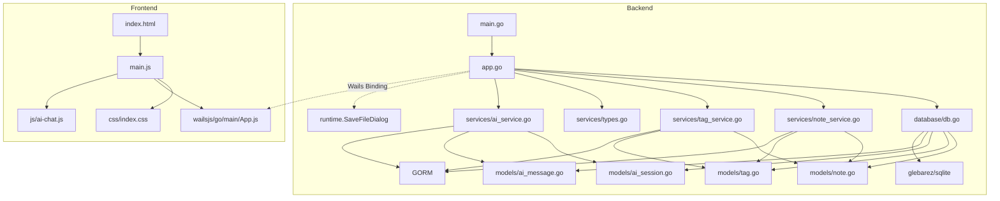

# Jot 项目分析报告

> 生成日期: 2026-06-30（更新 29）
> 项目类型: 桌面端卡片式笔记应用（类小米笔记）
> 技术栈: Wails v2 + Go + GORM + SQLite + 原生 HTML/CSS/JS + CodeMirror 6（编辑器）

---

## 一、目录结构梳理

```
jot/                                    # 项目根目录
├── main.go                             # 【入口文件】Wails 应用启动入口，配置窗口/资源/绑定
├── app.go                              # 【核心文件】Wails 绑定层，暴露 71 个 Go API 给前端
├── go.mod                              # Go 模块定义，声明依赖版本
├── go.sum                              # Go 依赖锁文件
├── wails.json                          # Wails 项目配置（名称/构建脚本/作者）
├── AGENTS.md                           # 本报告文件
│
├── internal/                           # 【内部包】Go 子包统一目录
│   ├── database/
│   │   └── db.go                       # SQLite 初始化（glebarez/sqlite 纯 Go 驱动）+ DefaultDBPath() 路径函数
│   ├── fontutil/
│   │   └── fonts_windows.go           # EnumFontFamiliesW API 封装
│   ├── models/
│   │   ├── note.go                     # Note 实体（笔记）
│   │   ├── tag.go                      # Tag 实体（标签）
│   │   ├── setting.go                  # Setting 实体（KV 配置）
│   │   ├── ai_session.go              # AI 会话实体（标题/时间戳）
│   │   └── ai_message.go              # AI 消息实体（角色/内容/思维链，外键关联 SessionID）
│   └── services/
│       ├── note_service.go             # 笔记 CRUD + 搜索 + 置顶 + 回收站 + 统计 + 导入导出 + VACUUM 瘦身 + GetAllIDs
│       ├── tag_service.go              # 标签管理 + 笔记标签关联 + 标签计数
│       ├── setting_service.go          # 配置读写
│       ├── ai_service.go               # AI 对话（OpenAI 兼容 API 调用 + 流式 SSE 解析 + 深度思考模式 + 会话持久化 CRUD + 消息管理）
│       └── types.go                    # 通用类型（PaginatedResult, DataStats, ImportResult 等）
│
├── frontend/                           # 【前端目录】Wails 前端（Vanilla + Vite）
│   ├── index.html                      # 入口 HTML，7 个视图
│   ├── package.json                    # 前端依赖（Vite 3.x + CM6 ~16 包 + marked + highlight.js + @codemirror/lang-* 6 包 + @codemirror/legacy-modes）
│   ├── src/
│   │   ├── main.js                     # 【核心文件】前端逻辑 ~5490 行（CM6 集成 + 搜索弹窗 + MD 语法页面 + AI 对话 + TOC + 回到顶部；数据管理页/回收站页/常量工具函数/通知类/模拟数据已拆分为独立模块）
│   │   ├── js/                         # 【JS 模块目录】
│   │   │   ├── cm6-syntax-highlight.js # CM6 通用语法高亮模块（11 套配色 + 46+ 语言解析器映射）
│   │   │   ├── data-management.js      # 数据管理页面模块（10 个函数 + reloadSettings，从 main.js 提取）
│   │   │   ├── trash-page.js           # 回收站页面模块（6 个函数，从 main.js 提取）
│   │   │   ├── ai-chat.js              # AI 对话模块（自实现聊天引擎 + 流式输出 + Markdown 渲染 + 多会话管理 + 侧栏折叠 + 用户/助手消息复制按钮 + 清空按钮常显 + 模型/深度思考切换）
│   │   │   ├── constants.js            # 图标常量 SVGS + 工具函数（formatTime/highlightText/getSummary/debounce，从 main.js 提取）
│   │   │   ├── notification.js         # NotificationManager 通知类 + window.showNotification 全局函数 + 模拟数据（getMockNotes/getMockTags，从 main.js 提取）
│   │   │   └── preview-worker.js       # Web Worker 离线程 Markdown 渲染（从 src/ 移入）
│   │   └── css/                        # 【CSS 模块化目录】原 style.css (~4990 行) + app.css (~697 行) 拆分
│   │       ├── index.css               # 入口文件，@import 引入所有子文件（设计系统 → 组件）
│   │       ├── variables.css           # 12 主题 CSS 变量：`--bg`/`--accent`/`--text-primary` 等
│   │       ├── reset.css               # 全局 reset（box-sizing/body 边距/overscroll-behavior）
│   │       ├── scrollbar.css           # 统一滚动条 6px 细条 + 自动隐藏 + 透明轨道 + 主题变量联动（含主内容区/搜索/数据管理/AI 对话消息列表）
│   │       ├── animations.css          # 13 个 keyframes + 通用工具类 `.anim-*` + stagger 延迟
│   │       └── components/
│   │           ├── topbar.css          # 顶栏（品牌/搜索框/窗口控制按钮/更多菜单含图标）
│   │           ├── main-content.css    # 主内容区布局（卡片网格/视图容器/滚动）
│   │           ├── sidebar.css         # 笔记本侧边栏三段式设计 + 折叠按钮
│   │           ├── editor.css          # 编辑器面板/CM6 主题/全屏/预览/代码块复制按钮
│   │           ├── dropdowns.css       # 右键菜单/更多菜单/下拉选择器
│   │           ├── modals.css          # 通用模态框/确认弹窗/覆盖层/快捷键页面样式（shortcut-row flex 水平布局）
│   │           ├── settings-panel.css  # 设置页分段控件/开关/按钮
│   │           ├── search-modal.css    # 搜索弹窗/结果列表/高亮
│   │           ├── data-view.css       # 数据管理统计卡片/操作卡片
│   │           ├── md-reference.css    # MD 语法手册卡片源码/预览双栏对照
│   │           └── ai-chat.css         # AI 对话页面（气泡/输入区/Markdown 渲染/代码高亮/打字指示器/会话侧栏/折叠按钮/滚动条自动隐藏/消息居中 900px 最大宽度/32px 间距）
│   ├── wailsjs/                        # Wails 自动生成的 JS 绑定
│   │   └── go/main/
│   │       ├── App.js                  # 后端 API 的 JS 封装
│   │       ├── App.d.ts               # TypeScript 类型定义
│   │       └── models.ts              # Go 模型的 TS 类型
│   └── dist/                           # Vite 构建产物（前端编译输出）
│
└── .trae/specs/                        # 项目 Spec 文档目录
    ├── add-about-page/               # 关于页面规格
    ├── add-batch-tagging/            # 批量标签操作
    ├── add-calendar-date-picker/     # 日历日期选择器
    ├── add-card-note-app/            # 初始需求规格
    ├── add-code-lang-badge/          # 代码块语言标签
    ├── add-data-management/          # 数据管理功能规格
    ├── add-draft-auto-save/          # 草稿自动保存
    ├── add-draft-cleanup-on-exit/    # 退出清理草稿
    ├── add-drag-drop-import/         # 拖拽导入文件
    ├── add-editor-and-undo-features/ # 编辑器和撤销功能
    ├── add-editor-tweaks/            # 编辑器微调
    ├── add-find-replace/             # 查找替换功能
    ├── add-font-settings/            # 字体设置功能规格
    ├── add-frameless-window/         # 无边框窗口
    ├── add-md-editor/                # MD 编辑功能
    ├── add-md-formatting-toolbar/    # MD 格式化工具栏
    ├── add-md-ref-try-button/        # MD 语法打开编辑器试试按钮（已完成）
    ├── add-md-reference-page/        # MD 语法手册页面（已完成）
    ├── add-md-rendering/             # Markdown 渲染查看规格
    ├── add-misc-improvements/        # 杂项优化规格
    ├── add-note-file-ext/            # 笔记文件后缀字段（.txt/.md）
    ├── add-note-type/                # 笔记类型（纯文本/Markdown）
    ├── add-notebook-system/          # 笔记本系统
    ├── add-notes-move-notebook/      # 笔记迁移笔记本
    ├── add-one-click-backup-restore/ # 一键备份还原规格
    ├── add-quick-note-mode/          # 快速笔记模式规格
    ├── add-save-success-notification/ # 保存成功通知
    ├── add-search-filters/           # 搜索筛选器
    ├── add-search-modal-sort-dropdown/ # 搜索弹窗排序下拉菜单（已完成）
    ├── add-sort-pagination/          # 排序分页设置
    ├── add-table-copy-button/        # 表格复制按钮
    ├── add-theme-system/             # 主题系统
    ├── add-toolbar-toggle-setting/   # MD 工具栏开关设置（已完成）
    ├── add-view-mode-toggle-from-edit/ # 查看/编辑模式返回按钮
    ├── add-web-worker-rendering/     # Web Worker 离线程渲染
    ├── db-backup-restore/            # 数据库备份还原
    ├── editor-header-compact/        # 编辑器头部紧凑化
    ├── elevate-visual-refinement/    # UI 视觉品质升级
    ├── enhance-interaction-animation/ # 交互体验与动画增强
    ├── fix-cm6-horizontal-scrollbar-gutter/ # CM6 水平滚动条遮挡行号修复（已完成）
    ├── fix-date-picker-auto-close/   # 日期选择器自动关闭修复
    ├── fix-drag-drop-notebook-scope/ # 拖拽导入笔记本作用域修正（已完成）
    ├── fix-fullscreen-cover-custom-titlebar/ # 全屏模式遮挡标题栏修复（已完成）
    ├── fix-preview-scrollbar/        # 预览模式滚动条修复（已完成）
    ├── fix-viewmode-fullscreen-halfheight/ # 查看模式全屏半高修复（已完成）
    ├── integrate-codemirror-6/       # CodeMirror 6 编辑器集成（已完成）
    └── lazy-content-loading/         # 懒加载 Content 优化（已完成）
    ├── move-menu-to-left/            # 更多菜单移至左上角
    ├── move-search-to-modal/         # 搜索移至弹窗
    ├── polish-search-modal-animation/ # 搜索弹窗动画优化
    ├── redesign-data-management/     # 数据管理页面 UI 重构与动画增强
    ├── redesign-ui/                  # UI 重新设计
    ├── refine-search-modal-ui/       # 搜索弹窗 UI 优化
    ├── remove-auto-save-draft/       # 移除草稿自动保存
    ├── remove-edit-mode-auto-save/   # 移除编辑模式自动保存
    ├── replace-quikchat-with-custom-ai-chat/ # 自实现 AI 对话组件 + 流式输出（已完成）
    ├── fix-ai-sessions-and-collapsible-sidebar/ # AI 会话持久化 + 多会话 + 侧栏折叠（已完成）
    ├── restructure-internal-packages/ # 内部包重构
    ├── simplicity-date-filter/         # 时间筛选简化（日历→下拉菜单）
    ├── skip-quicknote-animation-on-start/ # 快速笔记启动跳过动画
    ├── unify-app-scrollbars/           # 统一应用滚动条样式（已完成）
    └── unify-notification-system/    # 统一通知系统
```

### 目录规范评价

| 维度 | 评价 |
|------|------|
| **分层清晰度** | 优秀。严格按 `models → services → database → app` 分层，前端后端隔离清晰 |
| **命名规范** | 良好。目录名使用复数形式（models/services），符合 Go 社区惯例 |
| **冗余目录** | 无。每个目录职责单一，无多余层级 |
| **待改进** | frontend/dist 为构建产物，应加入 .gitignore |

---

## 二、核心功能模块识别

### 2.1 基础支撑模块

| 模块名称 | 核心功能 | 对应文件 | 核心依赖 |
|----------|----------|----------|----------|
| **数据库初始化模块** | SQLite 连接建立、连接池配置、AutoMigrate | `database/db.go` | glebarez/sqlite, GORM |
| **数据模型层** | Note/Tag/Setting/ AISession/AIMessage 实体定义、GORM tag 映射 | `models/note.go`, `models/tag.go`, `models/setting.go`, `models/ai_session.go`, `models/ai_message.go` | GORM |
| **通用类型** | 分页返回格式、统计数据、导入导出结构 | `services/types.go` | 无外部依赖 |
| **Wails 绑定层** | Go API → JS Bridge，含 runtime.SaveFileDialog | `app.go` | Wails v2 binding + runtime |
| **前端构建** | Vite 打包、Wails dev 热重载 | `frontend/package.json`, `wails.json` | Vite 3.x（保留，未移除）|
| **前端构建流程** | `wails build` 自动执行 `npm run build`（Vite）→ `frontend/dist/`，再嵌入 Go 二进制 | `go:embed all:frontend/dist` | 前端构建和后端编译都由 `wails build` 一条命令完成 |
| **字体枚举** | Windows GDI EnumFontFamiliesW 系统字体枚举 | `fontutil/fonts_windows.go` | gdi32.dll / user32.dll (syscall) |
| **配置存储** | KV 结构配置读写（字体偏好等） | `services/setting_service.go` | GORM |
| **路径工具** | 数据库默认路径 `~/.jot/data/jot.db` | `database/db.go:DefaultDBPath()` | `os.UserHomeDir()` |

### 2.2 业务核心模块

| 模块名称 | 核心功能 | 对应代码 | 核心输入 | 核心输出 |
|----------|----------|----------|----------|----------|
| **笔记 CRUD** | 创建/更新/查询/删除笔记 | `services/note_service.go` | 标题/内容/颜色/ID | Note 对象/错误 |
| **笔记搜索** | 标题+内容 LIKE 模糊搜索，支持 3 种排序（updated_at/created_at/title，均 pinned DESC 优先）| `note_service.go:Search()` | 关键词/分页/sortBy 参数 | 笔记列表+总数 |
| **笔记置顶** | 切换置顶状态 | `note_service.go:TogglePin()` | 笔记 ID | 更新后的笔记 |
| **回收站** | 软删除/查看/恢复/永久删除 | `note_service.go:Delete/GetTrash/Restore/PermanentDelete` | 笔记 ID | 操作结果 |
| **批量回收站操作** | 全部恢复/全部清空 | `note_service.go:RestoreAll/EmptyTrash` | — | 操作结果 |
| **标签管理** | 标签 CRUD | `services/tag_service.go` | 名称/颜色/ID | Tag 对象 |
| **笔记标签关联** | 为笔记添加/移除标签 | `tag_service.go:AddTagToNote/RemoveTagFromNote` | 笔记ID+标签ID | 操作结果 |
| **按标签筛选** | 通过标签 ID 查询笔记 | `note_service.go:GetByTag()` | 标签ID/分页参数 | 笔记列表+总数 |
| **数据统计** | 统计笔记总数/回收站数/标签数 | `note_service.go:GetStats()` + `tag_service.go:Count()` | — | DataStats 对象 |
| **数据导出为 .db** | 导出为 SQLite 数据库文件（VACUUM INTO + fs.CopyEx）| `app.go:ExportDataWithDialog()` | — | "导出成功" 提示 |
| **数据导入** | 从 JSON 文件导入笔记（跳过同名） | `note_service.go:ImportFromJSON()` | JSON 字节数组 | ImportResult 对象 |
| **前端卡片渲染** | 卡片网格展示 | `frontend/src/main.js` | 笔记数据数组 | DOM 渲染 |
| **前端编辑器** | 笔记编辑模态框（CM6 编辑器，支持行号/撤销重做/查找替换/Tab缩进/自动补全/自动闭合括号/Markdown 语法高亮） | `frontend/src/main.js` | 笔记数据/用户输入 | 保存/取消 |
| **前端查找替换** | CM6 search panel，Ctrl+F 查找 / Ctrl+H 查找替换，选中内容自动填充搜索框，预览模式自动切回编辑模式搜索 | `frontend/src/main.js:handleKeyboardNavigation()` | 搜索关键词 | 搜索面板匹配导航 |
| **前端搜索交互** | 搜索弹窗 200ms 防抖自动搜索，支持标题/内容/标签（多标签 AND 语义过滤）、笔记本/日期/排序筛选器（排序 3 选项：更新时间/创建时间/名称，均 pinned 优先） | `frontend/src/main.js` | 关键词 + 过滤条件 + sortBy | 搜索弹窗结果列表 |
| **前端导航切换** | 网格/搜索/设置/数据管理/回收站/AI 助手视图切换 | `frontend/src/main.js:switchView()` | 视图名称 | 视图 DOM 切换 |
| **前端右键菜单** | 右键弹出菜单（查看/编辑/置顶/删除） | `frontend/src/main.js` | 鼠标事件+笔记ID | 菜单显示/操作 |
| **前端只读查看** | 左击笔记打开只读查看器 | `frontend/src/main.js:openEditor()` | 笔记 ID | 只读查看模态框 |
| **标签搜索** | 点击标签 chip 打开搜索弹窗并预选该标签筛选器 | `frontend/src/main.js:searchByTag()` | 标签 ID | 搜索弹窗结果列表 |
| **键盘快捷键** | Ctrl+F 编辑器搜索 / Ctrl+H 编辑器查找替换 / Ctrl+N 新建 / Ctrl+L 编辑器切换模式 / PgUp/PgDn 滚动 / Ctrl+Home/End / Ctrl+数字键 1-9 导航（Ctrl+7 切换快捷键页开关） | `frontend/src/main.js:handleKeyboardNavigation()` | 键盘事件 | 对应操作 |
| **版本号信息** | 返回 verman.V.GitVersion 纯版本号 | `app.go:GetVersion()` | — | 版本字符串 |
| **打开外链** | 调用 runtime.BrowserOpenURL 在默认浏览器打开链接 | `app.go:OpenProjectURL()` | URL 字符串 | — |
| **打开数据目录** | 在文件管理器中打开 `~/.jot/data/` | `app.go:OpenDataDir()` | — | explorer 文件管理器 |
| **一键备份** | 备份当前库到 `~/.jot/backup/jot-backup.db`（覆盖）| `app.go:BackupToDir()` | — | 备份成功提示 |
| **一键还原** | 从 `jot-backup.db` 还原并刷新笔记/标签/统计 | `app.go:RestoreFromDir()` | — | Toast 提示结果 |
| **字体设置** | 字体族下拉选择（搜索+键盘导航）+ 字体大小预设/自定义 | `frontend/src/main.js:loadFontSettings/applyFontFamily/applyFontSize` | 字体名称/大小 | 更新 CSS 变量 |
| **AI 对话** | OpenAI 兼容 API 流式对话（自实现聊天引擎 + SSE 流式输出 + Markdown/代码高亮渲染 + 多会话管理） | `services/ai_service.go` + `frontend/src/js/ai-chat.js` + `frontend/src/css/components/ai-chat.css` | 用户消息 | AI 流式回复 |
| **AI 配置管理** | Base URL/API Key/Model 的读写 + 连通性测试 + 模型列表获取 | `app.go:GetAIConfig/SaveAIConfig/TestBaseURL/FetchAIModels` | 配置项 | 配置/测试结果 |
| **统一通知系统** | NotificationManager 单例类，右上角浮动通知，4 种类型 + undo 撤销 | `frontend/src/js/notification.js` | 消息/类型/回调 | 通知 DOM 创建与自动销毁 |

### 2.3 模块分层图

```
┌─────────────────────────────────────────────────────┐
│                    Frontend                          │
│  (main.js / css/index.css / index.html)               │
│   ├─ 视图渲染 (卡片/搜索/设置/数据管理/回收站/AI)     │
│   ├─ 交互逻辑 (事件绑定/状态管理)                      │
│   └─ Wails Bridge (window.go.main.App.*)              │
└────────────────────────┬────────────────────────────┘
                         │ Wails Binding (JSON 序列化)
┌────────────────────────▼────────────────────────────┐
│              App 层 (app.go)                         │
│  38+ 个绑定方法（CRUD/搜索/置顶/回收站/统计/导入导出/路径/│
│   AI 配置/会话管理/消息管理)                          │
│  (含 runtime.SaveFileDialog 原生对话框调用)            │
└────────────────────────┬────────────────────────────┘
                         │
              ┌──────────┼──────────┐
              ▼          ▼          ▼
    ┌─────────────┐ ┌──────────┐ ┌──────────────┐
    │ NoteService │ │TagService│ │  AI Service  │
    │ (CRUD/搜索/ │ │(CRUD/关联)│ │ (AI 流式对话 │
    │  置顶/回收站 │ │          │ │  会话管理    │
    │  统计/导入   │ │          │ │  消息持久化) │
    │  导出)      │ │          │ │              │
    └──────┬──────┘ └─────┬────┘ └──────┬───────┘
           │              │             │
           └──────┬───────┴──────┬──────┘
                  ▼              ▼
        ┌─────────────────┐ ┌─────────────────┐
        │    GORM ORM     │ │   GORM ORM     │
        │ (数据访问层)      │ │ (AI 模型层)     │
        └────────┬────────┘ └────────┬───────┘
                 ▼                   ▼
        ┌──────────────────────────────┐
        │          SQLite              │
        │   (glebarez/sqlite 纯 Go 驱动)│
        └──────────────────────────────┘
```

---

## 三、模块间依赖关系分析

### 3.1 依赖关系详表

| 依赖方 | 被依赖方 | 依赖类型 | 依赖详情 |
|--------|----------|----------|----------|
| `app.go` | `database` | 编译依赖 | 调用 `database.InitDB()` 获取 `*gorm.DB` 实例 |
| `app.go` | `services` | 编译依赖 | 创建 `NoteService` / `TagService` / `SettingService` 实例 |
| `app.go` | `models` | 编译依赖 | 返回 `*models.Note` / `*models.Tag` / `*models.Setting` 类型 |
| `app.go` | `runtime` | 编译依赖 | `runtime.SaveFileDialog` 原生保存对话框 |
| `app.go` | `fontutil` | 编译依赖 | `fontutil.GetFonts()` 枚举系统字体 |
| `services` | `models` | 编译依赖 | 操作 Note/Tag/Setting/AISession/AIMessage 结构体 |
| `services` | GORM | 编译依赖 | `*gorm.DB` 数据库操作 |
| `database` | `models` | 编译依赖 | `AutoMigrate(&models.Note{}, &models.Tag{}, &models.Setting{}, &models.AISession{}, &models.AIMessage{})` |
| `database` | glebarez/sqlite | 编译依赖 | 纯 Go SQLite 驱动 |
| `fontutil` | gdi32/user32 | 运行时依赖 | syscall 调用 Windows GDI API |
| `frontend/main.js` | `wailsjs/go/main/App.js` | 运行时调用 | `window.go.main.App.*` 调用后端 API |
| `frontend/wailsjs` | `app.go` | 构建时生成 | `wails generate module` 自动生成 |

### 3.2 依赖关系图（Mermaid）



### 3.3 依赖问题分析

| 问题类型 | 描述 | 严重程度 |
|----------|------|----------|
| **循环依赖** | 无。所有依赖为单向 `main → app → services → models`，无循环 | ✅ 无问题 |
| **过度依赖** | 无。每个 Service 仅依赖 `*gorm.DB` 和自身模型 | ✅ 无问题 |
| **依赖缺失** | 无。`go.sum` 中所有传递依赖完整 | ✅ 无问题 |
| **隐式依赖** | 前端 `window.go` 对象依赖 Wails 运行时注入，本地开发/独立预览时不可用 | ⚠️ 有降级处理（Mock 数据） |
| **编译期依赖 vs 运行时依赖** | `wailsjs/` 目录需在修改 `app.go` 后重新生成 | ⚠️ 需手动执行 `wails generate module` |

---

## 四、设计模式与实现逻辑

### 4.1 设计模式识别

| 模式名称 | 应用位置 | 说明 | 代码示例 |
|----------|----------|------|----------|
| **Service Layer 模式** | `services/` 包 | 将业务逻辑从 controller（app.go）中抽离，封装为独立 Service 结构体 | `NoteService` / `TagService` |
| **依赖注入 (DI)** | `app.go` | Service 依赖的 `*gorm.DB` 通过构造函数注入 | `NewNoteService(db)` / `NewTagService(db)` |
| **Repository 模式** | `services/` 包内嵌 GORM | Service 内部直接使用 GORM 作为数据访问层 | `s.db.Create()` / `s.db.Where()` |
| **单例模式 (应用级)** | App 结构体 | Wails 运行时保证 App 实例唯一 | `NewApp()` 在 `main()` 中仅调用一次 |
| **MVC 变体** | 整体架构 | Model(models) - View(frontend) - Controller(app.go + services) 分层 | 见分层图 |
| **降级策略 (Fallback)** | `frontend/main.js` | 后端未绑定时自动使用 Mock 数据 | `if (!window.go.main.App.GetNotes) { state.notes = getMockNotes(); }` |
| **Wails Runtime 集成** | `app.go` | 通过 runtime 包调用原生桌面功能 | `runtime.SaveFileDialog()` 弹出系统保存对话框 |

### 4.2 核心业务逻辑流程

#### 4.2.1 笔记创建流程

```
用户点击 "+" 按钮 / Ctrl+N
  → openEditor(null)          // 打开空编辑器模态框
    → 用户填写标题/内容/选择颜色/选择标签
    → 点击"保存"按钮
      → createNote()
        → 前端校验（标题不为空）
        → window.go.main.App.CreateNote(title, content, color)
          → app.go:CreateNote()
            → noteService.Create()          // GORM db.Create(&note)
            → 返回 *models.Note（含 id）
          → 遍历 selectedTags
            → window.go.main.App.AddTagToNote(note.id, tagId)
              → tagService.AddTagToNote()   // GORM Association("Tags").Append
        → closeEditor()                     // 关闭模态框
        → loadNotes()                       // 重新加载笔记列表
          → GetNotes(1, 100)                // 分页查询
          → renderCardGrid()                // 渲染右侧卡片网格
```

#### 4.2.2 笔记搜索流程

```
Ctrl+F / Ctrl+K → 打开搜索弹窗
  → els.searchModalInput 自动聚焦
  → 用户输入文字 → 200ms 防抖
    → searchModalLoadPage(1, false)
```

...（中间流程不变）

---

## 五、技术栈评估

### 5.1 技术栈清单

| 层级 | 技术 | 版本 | 用途 |
|------|------|------|------|
| **桌面框架** | Wails v2 | v2.9.2 | 桌面窗口 + Go ↔ JS Bridge |
| **后端语言** | Go | go1.22+ | 后端业务逻辑 |
| **数据库** | SQLite | — | 本地数据存储 |
| **数据库驱动** | glebarez/sqlite | v1.11 | 纯 Go SQLite 驱动（无 CGO） |
| **ORM** | GORM | v1.25 | 对象关系映射 |
| **前端构建** | Vite | v3.2.11 | 前端打包工具 |
| **前端技术** | 原生 HTML/CSS/JS | — | UI 渲染 |
| **编辑器** | CodeMirror 6 | @codemirror/view v6.26 | 笔记编辑器 |
| **Markdown 解析** | marked | v12.0 | Markdown → HTML 渲染 |
| **代码高亮** | highlight.js | v11.10 | 代码块语法高亮 |
| **AI 对话** | OpenAI 兼容 API | — | SSE 流式对话接口 |
| **本地存储** | localStorage | — | UI 状态持久化（主题/侧栏状态等） |

### 5.2 技术栈选型评价

| 评价维度 | 说明 |
|----------|------|
| **合理性** | Wails v2 适合桌面端 Go 应用，原生 HTML/CSS/JS 避免前端框架学习成本 |
| **性能** | SQLite + GORM 组合满足本地笔记应用性能需求，流式输出不阻塞 UI |
| **维护性** | 前后端分层清晰，CSS 模块化拆分降低维护成本 |
| **可扩展性** | 新增功能只需添加 binding 方法和前端模块，架构本身无限制 |
| **风险** | Wails v2 社区较小，Wails v3 路线图不明确，长期维护可能受限 |

### 5.3 版本兼容性问题

| 问题 | 说明 |
|------|------|
| **Wails 版本锁定** | `go.mod` 中 `wails.io v2.9.2` 已固定，`wails/v2` 包需与 Wails CLI 版本匹配。升级需同步更新 CLI, go.mod, wails.json 三方 |
| **GORM AutoMigrate** | 新增模型（如 AISession/AIMessage）后需在 `database/db.go` 的 `AutoMigrate` 中注册，否则表不会自动创建 |

---

## 六、补充分析

### 6.1 扩展性评估

| 扩展方向 | 可行性 | 建议 |
|----------|--------|------|
| **多用户/云端同步** | 低 | 如需云端同步，建议引入 WebDAV/第三方同步库 |
| **AI 功能扩展** | 高 | 当前 AI 会话架构（Session + Message 模型）天然支持多会话切换和上下文管理，易于扩展。新增方法直接注册 binding 到 app.go 即可 |
| **国际化 (i18n)** | 中 | 所有 UI 文本硬编码在 HTML/JS 中，需统一抽离 |
| **插件系统** | 低 | 原生 HTML 架构不适合动态加载插件 |

### 6.2 性能关键点

| 关键点 | 现状 | 评估 |
|--------|------|------|
| **数据库查询** | GORM + SQLite，分页查询 | ✅ 满足笔记本规模 |
| **前端渲染** | 卡片网格渲染 | ✅ 性能良好 |
| **AI 流式输出** | 基于 Wails Events 逐块推送，不阻塞 UI | ✅ 体验优秀 |
| **CM6 编辑器** | 仅初始化当前编辑的笔记 | ✅ 性能良好 |
| **多会话切换** | 切换时从后端加载对应会话的消息，每次只渲染当前会话 | ✅ 符合预期 |

### 6.3 异常处理分析

| 异常场景 | 处理方式 |
|----------|----------|
| **后端 API 不可用** | 前端 Mock 数据降级 |
| **AI API 调用失败** | 错误消息以 AI 消息气泡展示在对话中 |
| **数据库损坏** | 备份还原机制 |
| **流式连接中断** | 前端监听 `ai:stream-error` 事件，显示错误提示 |
| **会话/消息查询失败** | 返回空列表 + 控制台错误日志，不阻断 UI |

### 6.4 安全分析

| 风险点 | 评估 |
|--------|------|
| **本地数据库** | SQLite 文件本地存储，无远程访问风险 |
| **API Key 存储** | 明文存储在 Setting KV 表中，未加密 |
| **XSS 风险** | AI 回复经 `marked.parse()` 渲染，`marked` 默认 Sanitize |

---

## 七、项目核心特点

### 核心设计理念

1. **Wails v2 跨平台桌面应用**：Go + 原生前端（HTML/CSS/JS）架构，兼顾后端性能和前端灵活性

2. **CodeMirror 6 编辑器集成**：主流 Markdown 编辑器引擎，支持行号/撤销重做/查找替换/Tab缩进/自动补全/语法高亮（11 套配色 + 46+ 语言）

3. **CSS 变量主题系统（12 主题）**：全局 CSS 变量联动（`--bg`/`--accent`/`--border` 等），一键切换 12 套系统主题 + 11 套代码高亮主题，所有组件自动适配

4. **三步交互范式**：笔记本（容器）→ 笔记卡片（列表）→ 编辑器（操作），符合直觉的文件夹-文件-编辑结构

5. **自实现 AI 对话引擎**：完全自实现（非第三方库），SSE 流式输出 + Markdown 渲染 + 代码高亮 + 思维链折叠 + 多会话管理 + 侧栏折叠

6. **统一的通知系统**：NotificationManager 单例，右上角浮动通知，支持 success/error/warning/info 四种类型 + undo 撤销

7. **过度动画与交互反馈**：13 个 keyframes、stagger 延迟、hover 分层反馈、spring 弹性缓动、骨架屏 shimmer

8. **无 UI 框架依赖**：无 Vue/React/Svelte，纯手写 DOM 操作，极致轻量

### 设计系统

- **尺寸**：`--radius-md`(8px) / `--radius-sm`(6px)，全局统一
- **间距**：4px 基线网格，组件内部 8-16px，布局 16-24px
- **阴影**：4 层 Token — `elevated`(卡片) / `dropdown`(下拉菜单) / `modal`(模态框) / `toast`(通知)
- **语义色**：`--success`(绿) / `--warning`(黄) / `--error`(红) / `--info`(蓝)
- **字体**：全局统一 `var(--font-family)`，编辑器和代码块跟随系统设置
- **滚动条**：6px 细条，`--scrollbar-thumb` / `--scrollbar-thumb-hover` 联动 12 主题
- **圆角一致性**：所有交互元素（按钮/卡片/输入框/下拉菜单/模态框）均使用 `var(--radius-sm)` 或 `var(--radius-md)`，无硬编码

### 关键文件统计

| 文件 | 行数（约） | 说明 |
|------|-----------|------|
| `frontend/src/main.js` | 5460 | 前端核心逻辑 |
| `frontend/src/css/components/ai-chat.css` | 1565 | AI 对话全部样式（含引用笔记浮层/chip/骨架屏动画/标签筛选/条目标签 badge） |
| `frontend/src/js/ai-chat.js` | 1639 | AI 对话 JS 逻辑（含引用笔记选择器/上下文注入/标签筛选） |
| `app.go` | 1064 | Wails 绑定层（71+ API，含引用笔记新接口） |
| `services/note_service.go` | 568 | 笔记 CRUD 服务 + 引用上下文构建 |
| `services/types.go` | ~30 | 通用类型（含 NoteRefInfo/NoteRefContext） |
| `frontend/src/css/variables.css` | 210 | 12 主题 CSS 变量 |

---

## 八、待优化点

### 中期优化

- **虚拟列表支持**：AI 对话消息较多时，使用 IntersectionObserver 虚拟化

### 架构层面

- **代码分割**：main.js 可继续拆分为独立视图模块
- **CSS 变量颜色 Token**：AI 对话页面的配色确认已全部纳入主题系统

### 已实现

- [x] **CSS 模块化拆分**（variables, reset, scrollbar, animations + 6 组件模块）
- [x] **AI 对话自实现**（流式输出 + Markdown 渲染 + 思维链 + 代码高亮 + 多会话 + 侧栏折叠）
- [x] **笔记软删除与回收站**（Trash/Restore/PermanentDelete/RestoreAll/EmptyTrash）
- [x] **Markdown 语法手册页面**（10 张语法卡片 + 双栏源码/预览 + 打开编辑器试试）
- [x] **12 系统主题 + 11 代码高亮主题**（统一 CSS 变量体系）
- [x] **搜索弹窗**（200ms 防抖 + 笔记本/日期/排序/标签筛选器）
- [x] **一键备份/还原**（BackupToDir/RestoreFromDir + VACUUM）
- [x] **返回查看/保存脏检测**（无变更不触发保存 + 不弹出通知）
- [x] **数据库瘦身 VACUUM**（数据管理页面按钮触发）
- [x] **字体设置**（族+大小，联动 CSS 变量）
- [x] **通知系统**（右上角 NotificationManager，4 种类型 + undo 撤销）
- [x] **更多菜单**（7 个选项，`min-width: 120px`）
- [x] **数字键导航**（Ctrl+数字键 1-9）
- [x] **快捷键说明页**（Ctrl+7 打开，可滚动列表）
- [x] **拖拽导入闪烁动画**（3 次红色慢闪）

---

## 九、关键记忆点

1. **Wails v2 事件驱动流式输出**：AI 回复流式数据传输使用 `runtime.EventsEmit`（Go 端）+ `EventsOn`（前端），Go 端 `bufio.Reader` 逐行解析 SSE `data: {...}` 流，通过回调（`onChunk`/`onThinking`/`onDone`/`onError`）逐块推送。前端在 `onSend()` 中动态注册一次性事件回调（`Array.from` 包裹闭包捕获局部变量），每个请求各自独立的 `streamingContent`/`streamingEl`/`lastReasoningEl` 局部变量隔离，防止多消息冲突

2. **思维链折叠**：深度思考模型返回 `delta.reasoning_content`，Go 端在 `streamChoice.Delta` 中解析此字段，通过 `onThinking` 回调和 `ai:stream-thinking` 事件推送。前端创建 `<details class="ai-thinking">` 可折叠区域（summary + 内容），首次 thinking chunk 懒创建，后续流式追加，`addMessage()` 也接受 `reasoningContent` 参数用于显式渲染

3. **AI 会话持久化**：`AISession` + `AIMessage` 两个 GORM 模型（`ai_session.go`/`ai_message.go`），`SaveAIMessages()` 保存一轮对话并自动生成标题（取首条用户消息前 30 字），`LoadAISessionMessages()` 按 `CreatedAt` 升序返回历史消息，`ClearAISessionMessages()` 删除指定会话全部消息

4. **AI 对话侧栏 + 折叠机制**：左右分栏布局（`.ai-chat-layout`），左侧 `.ai-session-sidebar`（220px），右侧 `.ai-chat-content` flex:1。折叠按钮（`.ai-sidebar-toggle`）为 14×44px 纤细条状，置于侧栏外作为兄弟元素，通过兄弟选择器 `~` 控制 `left` 定位（展开时 220px、折叠时 0）。展开时按钮左侧加 `border-left: 1px solid var(--border)` 延续分割感。折叠状态 `localStorage` 持久化，CSS `transition: width 0.25s ease` 动画。SVG Chevron 图标（Lucide 风格）替代 Unicode 字符

5. **`onAIChatViewActivated` 惰性加载**：仅在 `activeSessionId === null`（无活跃会话）时自动加载第一个会话，视图切换不重置当前会话状态，避免切换回来后消息错乱。`switchSession()` 按 `msg.role` 遍历渲染，`Message` 结构体含 `ReasoningContent` 字段

6. **CSS 变量系统**：全局使用 `var(--xxx)` 定义主题变量，AI 对话页面全组件（气泡/侧栏/输入区/按钮）联动 12 套主题

7. **OpenAI 兼容 API 调用**：`CallAI`（非流式）+ `CallAIStream`（流式），`chatRequest` 结构体含 `Stream bool` 字段。思考型模型需调 `stream: true` 才能触发流式输出。`bufio.Scanner` 拆分 SSE 行（`data: [DONE]` 终止），JSON 解析使用 `json.NewDecoder` 单对象模式

8. **消息渲染与气泡**：`addMessage()` 创建消息气泡 DOM，AI 侧使用 `marked.parse()` 渲染 Markdown（含 `hljs.highlightElement()` 代码高亮），用户侧以 `<pre class="ai-user-msg">` 转义纯文本。打字指示器内嵌到 `msg-content` 内部（不独立建气泡）

---

## 十、新增记忆点（CodeMirror 6 集成）

| 记忆点 | 内容 |
|--------|------|
| **CM6 初始化流程** | `initCodeMirror()` 在 `openEditor()` 中调用：`new EditorView()` → `updateListener` 更新字数 → 自定义 Tab（2 空格）→ 快捷键 Ctrl+B/I/U/Shift+Enter（软换行）。`setEditorContent()` 设置内容，`getEditorContent()` 获取内容 |
| **Markdown 语法高亮** | 使用 `@codemirror/lang-markdown` 包，通过 `markdown()` 扩展启用。`initCodeMirror()` 中引入 `syntaxHighlights` 主题映射和 `languagePluginMap` 语言解析器映射 |
| **CM6 重初始化模式** | 在 `applyCodeHighlightTheme()` 或更新语言解析器时，执行：`cmEditor.destroy()` → `cmEditor = null` → `container.innerHTML = ''` → 重新 `initCodeMirror()` |
| **通用高亮模块（cm6-syntax-highlight.js）** | 11 套代码高亮配色通过 `HighlightStyle.define()` + `syntaxHighlights` 映射注册。`languagePluginMap` 覆盖 46+ 语言解析器。`cm6-syntax-highlight.js` 暴露 `applyCodeHighlightTheme()` 和 `cm6InitCodeMirror()`（供 main.js 中 `initCodeMirror()` 调用）|
| **编辑器/预览切换** | `toggleEditorMode()` 切换 CM6 编辑 / Markdown 渲染预览，`els.editorOverlay.dataset.mode = 'edit'|'preview'|'view'` 模式标识 |
| **CM6 只读查看模式** | `openEditor(noteId, readonly=true)` 设置 `cmEditor.dom.contentEditable = false`，禁用编辑但保持语法高亮 |
| **代码块复制按钮** | 预览模式/查看模式中，hover `pre code` 时右上角显示复制按钮（`.copy-code-btn`），点击复制内容到剪贴板 |

---

## 十一、新增记忆点（搜索弹窗系统）

| 记忆点 | 内容 |
|--------|------|
| **初始化** | `initSearchModal()` 绑定事件，排序下拉 `change`、筛选器 `change`、关闭按钮、覆盖层关闭、键盘 Esc 关闭 |
| **安全更新** | `safeUpdateSearchResults()` 用 `DocumentFragment` 一次插入、`scrollTo(0,0)` 重置滚动、`innerHTML = ''` 清楚旧结果 |
| **筛选器功能** | `initFilterDropdowns()` 统一处理笔记本/日期范围/排序三选下拉（toggle/dropdown/items）。笔记本/标签筛选器选中后点击同一项取消选中。笔记本筛选器默认"全部笔记本"。日期默认为"全部时间"。标签筛选器在 `searchModalLoadPage()` 加载结果时同步加载 |

---

## 十二、设置页开发规范

### 新增设置项 Checklist

#### Step 1: HTML — 在 `index.html` 中添加 toggle/控件
```html
<div class="setting-item">
    <div class="setting-item-left">
        <div class="setting-item-label">设置名称</div>
        <div class="setting-item-desc">设置描述</div>
    </div>
    <div class="setting-item-right">
        <label class="toggle-switch">
            <input type="checkbox" id="xxxToggle">
            <span class="toggle-slider"></span>
        </label>
    </div>
</div>
```

#### Step 2: DOM 引用 — 在 `els` 对象中添加引用
在 `main.js` 中找到 `const els = { ... }` 对象，在适当位置（按字母或功能分组）添加：
```js
xxxToggle: document.getElementById('xxxToggle'),
```

#### Step 3: 持久化 — 保存走后端优先 + localStorage fallback
```js
async function saveXxxSetting() {
    const enabled = els.xxxToggle.checked;
    try {
        if (window.go && window.go.main && window.go.main.App && window.go.main.App.SaveSetting) {
            await window.go.main.App.SaveSetting('setting_key', String(enabled));
        } else {
            localStorage.setItem('setting_key', String(enabled));
        }
        // [可选] 设置变更的即时生效逻辑
    } catch (err) {
        console.error('保存 XXX 设置失败:', err);
    }
}
```

#### Step 4: 初始化 — 创建 `loadXxxSetting()` 函数并在 `init()` 中调用
在 main.js 底部（`loadMdHighlightSetting()` 附近）添加加载函数：

```js
async function loadXxxSetting() {
    try {
        let enabled = true; // 默认值
        if (window.go && window.go.main && window.go.main.App && window.go.main.App.GetSetting) {
            const val = await window.go.main.App.GetSetting('setting_key');
            enabled = val !== 'false';
        } else {
            const local = localStorage.getItem('setting_key');
            enabled = local !== 'false';
        }
        els.xxxToggle.checked = enabled;
    } catch (err) {
        console.error('加载 XXX 设置失败:', err);
    }
}
```

在 `init()` 函数中（`loadMdHighlightSetting()` 之后）添加调用：
```js
await loadXxxSetting();
```

#### Step 5: 重置一致性 — 确保 `ResetDatabase` 后能回退到默认值
- 使用上述模板后自动满足：`ResetDatabase` 调用后端 `DeleteAll()` 清空 settings 表 → 前端 `loadXxxSetting()` 读不到值 → 按默认值恢复
- **不要**只使用 localStorage 存储，否则重置数据库后该设置值会残留，与其他设置行为不一致

---

## 十三、新增记忆点（MD 语法手册页面）

| 记忆点 | 内容 |
|--------|------|
| **MD 语法页面视图** | 更多菜单新增「MD 语法」页面（`#viewMdRef`），通过 `switchView('md-ref')` 访问。Ctrl+8 快捷打开。`renderMdRefCards()` 在首次显示时同步渲染 10 张语法卡片（复用 `marked.parse()` + `highlight.js` 高亮），卡片数据存储在 10 个 `<script type="text/plain" class="md-ref-source">` 标签中 |
| **MD 语法卡片布局** | 每张卡片分三部分：顶部 `.md-ref-badge` 分类标签（如「H 标题」「B 文本样式」「📋 列表」），中部 `.md-ref-panel` 双栏面板（左 `.md-ref-source-panel` 源码区 + 右 `.md-ref-preview-panel` 预览区），底部 `.md-ref-card-footnote` 脚注说明。10 张卡片覆盖：标题/文本样式/链接与图片/列表/引用与代码块/表格/任务列表/分割线/转义字符 |
| **源码/预览双栏渲染** | 源码区使用 `<pre><code>` 展示（复制按钮在 hover 时显示），预览区通过 `marked.parse()` 渲染。`E$()` 函数在 `renderMdRefCards()` 末尾遍历 10 对 `.md-ref-source`/`.md-ref-preview`，源码取 `textContent.trim()` 后 `marked.parse()` 写入预览容器，然后 `hljs.highlightElement()` 高亮代码块。`b$()` 为源码面板的每个 `<pre>` 添加复制按钮 |
| **「打开编辑器试试」按钮** | 每张卡片底部 `.md-ref-try-btn` 按钮，点击后 `openMdRefTryEditor(source, badgeText)`：解码 HTML 实体 → `switchView('grid')` → `await openEditor(null)` 等待 cmEditor 就绪 → 设置标题 `[MD 语法] xxx` → `setEditorContent(decoded)` 写入源码 → `els.editorFileExt.textContent = '.md'` → 更新 UI（类型切换按钮/编辑预览切换/工具栏显隐）→ `cmEditor.focus()`。`setupMdRefTryButtons()` 在 `renderMdRefCards()` 末尾调用，防重复绑定（`_mdRefTryBound` 标志）|
| **HTML 实体解码** | 源码可能含 HTML 实体（`&gt;`/`&lt;`/`&amp;`/`&quot;`/`&#39;`），`openMdRefTryEditor()` 中先 `.replace(/&gt;/g, '>')` 等 5 步解码再写入编辑器，确保 `>`（引用块）、`<` 等特殊字符正确显示 |
| **MD 语法页面全主题适配** | 所有 `.md-ref-*` CSS 从硬编码颜色改为 `var(--xxx)` 主题变量：源码面板背景 `var(--bg-secondary)`、预览面板 `var(--card-bg)`、代码块字体 `var(--font-family)`、复制按钮背景 `var(--card-bg)`/边框 `var(--border)`/文字 `var(--text-muted)`、hover 背景 `var(--hover-bg)`、引用块底色 `var(--hover-bg)`、表格边框 `var(--border)`、标签 `.md-ref-badge` 继承 `var(--accent)` 配色、`<kbd>` 元素 `var(--bg-secondary)` 底色 + `var(--border)` 边框。6 套主题（default/nord/monokai-pro/light/tokyo-night/dark）均自动适配 |
| **代码块字体跟随全局** | 源码面板 `<pre><code>` 和预览区 `<pre><code>` 的 `font-family` 从硬编码 `'SF Mono', SFMono-Regular, Consolas, ...` 改为 `var(--font-family)`，联动全局字体设置，切换字体后 MD 语法页面代码块同步更新 |
| **「打开编辑器试试」async 时序修复** | 修复前：`openMdRefTryEditor()` 非 async，`openEditor(null)` 无 await 返回 Promise，`setEditorContent()` 在 `cmEditor===null` 时静默失败。修复后：函数改为 `async` + `await openEditor(null)`，cmEditor 就绪后再写入内容和设置 `.md` 后缀 |
| **Seed 工具增强** | `tools/seed/main.go` 从原来的 5 笔记本/5 标签/22 笔记增强为 6 笔记本（新增「随笔」）/7 标签（新增「技术」「随笔」）/38 条笔记。每条笔记含完整 Markdown 正文（标题/引用/代码块/表格/列表等混合内容），时间跨度覆盖 30 天（自动生成 `updated_at`）。`FileExt` 字段按内容分配 `.md`/`.txt` |

---

## 十四、新增记忆点（搜索弹窗 UI 修复与菜单调整）

| 记忆点 | 内容 |
|--------|------|
| **搜索弹窗圆角调整** | `.search-modal-content` 的 `border-radius` 从 20px 减小到 12px。原圆角过大导致滚动条箭头在视觉上"戳出去"（圆角弧度过大使滚动条靠近边缘时箭头部分超出圆角视觉边界），减小到 12px 后滚动条箭头被正确包含在容器内 |
| **搜索结果底部内边距** | `.search-modal-results` 的 `padding` 从 `8px 12px` 改为 `8px 12px 20px`，底部增加 20px 空间，防止滚动条箭头紧贴容器底部圆角 |
| **搜索结果水平滚动隐藏** | `.search-modal-results` 新增 `overflow-x: hidden`，防止意外出现水平滚动条干扰显示 |
| **菜单项文案修改** | 更多菜单中「帮助」改为「快捷键说明」，与实际功能（快捷键说明弹窗）更匹配 |

---

## 十五、新增记忆点（拖拽闪烁 + 卡片布局 + 侧栏键盘导航）

| 记忆点 | 内容 |
|--------|------|
| **拖拽导入红色闪烁动画** | 拖拽文件导入后不再打开编辑器，改为成功导入的卡片以 `@keyframes cardFlash` 红色边框缓慢闪烁 3 次（3s），闪烁后 `opacity: 1` 保持可见。卡片模板添加 `data-id="${note.id}"`，通过 `flashNoteCards()` 在 `loadNotes()` 后根据 ID 查询卡片元素并设置动画。详见 `.trae/documents/plan-drag-drop-flash-animation.md` |
| **卡片 footer 固定底部** | `.note-card` 改为 `display: flex; flex-direction: column`，`.card-body` 加 `flex: 1`。配合 CSS Grid `align-items: stretch` 默认行为，同行卡片等高，footer（含更新时间）始终贴在卡片底部，内容多少不影响 footer 位置 |
| **笔记本侧栏键盘导航** | `#notebookList` 加 `tabindex="0"`、`outline: none`。`ArrowDown`/`ArrowUp` 移动 `.keyboard-focus` 高亮（accent 背景 + 轮廓），`Enter` 切换笔记本。`.sidebar-notebook-list:focus` 无默认轮廓框。`blur` 时自动 `clearNotebookKeyboardFocus()` 避免与 hover 冲突。列表重渲染时自动清除聚焦。无新增绑定方法 |
|
## 十六、新增记忆点（移除 MD 工具栏 + 编辑器闪烁修复）
|
| 记忆点 | 内容 |
|--------|------|
| **移除 MD 格式化工具栏** | 移除 `index.html` 中 `#editorToolbar` 整个块（10 个按钮 + 标题下拉面板）、`editor.css` 中全部工具栏样式（~130 行，含 `.editor-toolbar`/`.heading-dropdown-*`/`.hd-*` 及预览模式隐藏规则）、`main.js` 中 10 个 `format*()` 函数/`initEditorToolbar()`/CM6 keymap Ctrl+B/I/U/12 个 els DOM 引用/`loadToolbarSetting()`/工具栏显隐控制 3 处/~230 行。资源减少：HTML 67.81→60.83 KiB，CSS 91.24→89.46 KiB，JS 1798.83→1793.20 KiB。`prefers-reduced-motion` 降级媒体查询中 2 条孤立 CSS 规则（`.editor-toolbar-btn`/`.heading-dropdown-panel`）一并清除。详见 `.trae/specs/remove-md-toolbar/` |
| **编辑器面板闪烁修复** | `openEditor()` 中 `.editor-body`（含标题/标签/内容区）入场动画原被 `requestAnimationFrame` + 50ms delay 包裹，比面板动画晚启动 ~66ms，造成标题和标签栏区域「闪烁」。移除 rAF 和 delay 后 body 与面板同步淡入。同时在视图可见前内联设置 `opacity: 0` + 强制回流，防止 `initCodeMirror()` 期间 `::before` 伪元素动画意外渲染。详见 `.trae/documents/fix-editor-panel-flash.md` |
|
## 十七、新增记忆点（编辑模式切换虚假通知修复）
|
| 记忆点 | 内容 |
|--------|------|
| **「返回查看模式」虚假通知** | 查看模式进入编辑 → 不做任何修改 → 点击"返回查看模式"时，原逻辑无条件调用 `App.UpdateNote()` + 弹出"笔记已更新"。修复后：在 `editorViewBtn` click handler 中新增 `state._editSnapshot` 比对（title/content/tags），无变更时跳过保存+通知，仅 `openEditor(noteId, true)` 静默切回。与 `closeEditorSafe()` 使用完全一致的比对逻辑（`.trim()` + `JSON.stringify` 排序标签数组）。详见 `.trae/documents/fix-editor-mode-switch-false-notification.md` |
|
| ## 十八、新增记忆点（MD 语法 TOC 两行网格 + 回到顶部按钮）
| |
| | 记忆点 | 内容 |
| |--------|------|
| | **TOC 两行网格布局（方案 C）** | MD 语法页面目录从 `flex-wrap` 水平排列改为 CSS Grid `grid-template-columns: repeat(5, auto)`，10 个 TOC 项按两行五列排布，`justify-content: center` + `justify-items: center` 居中对齐。窄屏（<768px）降为 3 列。每项加 `white-space: nowrap` 禁止换行。详见 `md-reference.css` `.md-ref-toc` |
| | **TOC 选中态滚动自动清除** | 点击 TOC 项后通过 `window._tocScrolling` 标志 + 800ms `setTimeout` 保护平滑滚动期间不误清除 `.active`。用户手动滚动时（`_tocScrolling = false`），scroll handler 立即清除所有 TOC 项的 `.active` 类，避免过期高亮残留。详见 `main.js` `renderMdRefCards()` |
| | **MD 语法页面回到顶部按钮** | 在 `#viewMdRef` 内添加 `#mdRefTopBtn` 固定定位按钮（样式同笔记首页 FAB）。滚动超过 300px 时淡入显示（`opacity` + `translateY` 过渡），点击 `els.mainContent.scrollTo({ top: 0, behavior: 'smooth' })` 平滑回到顶部。仅在 MD 语法视图可见时生效，不影响其他页面。详见 `md-reference.css` `.md-ref-top-btn` |
|
|## 十六、新增记忆点（移除 NoteType + 字数统计/状态栏变更）
|
|| 记忆点 | 内容 |
||--------|------|
|| **移除 NoteType 体系** | `NoteType` 字段从 Note 模型彻底移除，后端所有 API 签名从 `noteType` 改为 `fileExt`。前端 `state.noteType`/`noteTypeFromFileExt()`/`switchNoteType()`/T 按钮点击事件全部删除。编辑器模式判断统一使用 `els.editorFileExt.textContent === '.md'` |
|| **FileExt 为单一数据源** | `.md` → Markdown 模式（显示编辑/预览切换按钮），其他任意后缀（`.txt`/`.py`/`.js` 等）→ 纯文本模式（隐藏编辑/预览切换按钮）。纯文本模式也显示编辑器（非 `<pre>`），CM6 始终负责文本展示和编辑 |
|| **后缀修改两种方式** | ① 点击底部状态栏文件后缀 → 弹出对话框手动输入任意后缀（如 `.py`/`.js`/`.md`）→ 点击保存更新后端 ② 点击 header 工具栏左侧 T/M 快捷按钮 → 在 `.md` 和 `.txt` 之间一键切换，自动保存到后端 |
|| **字数统计仅统计正文** | 状态栏 `updateWordCount()` 只统计 CM6 编辑器正文内容（`getEditorContent()`），不包含标题。新建笔记自动填充的日期时间标题不计入 |
|| **字数统计格式** | 统一格式：`2 个字数 | 3 个字符 | .txt`，文件后缀内嵌在字数统计字符串中。后缀通过 `saveFileExt()` 或 `toggleFileExt()` 变更后自动刷新显示 |
|
|## 十九、新增记忆点（后缀变更保存提示 + 查看模式后缀同步 + 预览模式间距压缩）
|
|| 记忆点 | 内容 |
||--------|------|
|| **后缀变更纳入脏检测** | `saveFileExt()` 和 `toggleFileExt()` 移除立即调用 `UpdateNoteFileExt` 后端的逻辑，后缀变更不再即时持久化，改为随主保存（`updateNote()`/`saveEditorContent()`）一起提交。`_editSnapshot` 新增 `fileExt` 字段记录初始后缀。`closeEditorSafe()`、返回查看按钮、`handleAppExit()` 三个入口均增加 `extChanged` 检测，后缀有变更时弹出保存确认对话框 |
|| **返回查看后缀不同步修复** | 查看模式按钮保存后更新本地缓存 `state.notes` 时遗漏 `file_ext`，导致 `openEditor(noteId, true)` 从本地缓存读到旧后缀（如 `.md`），预期走纯文本却走 Markdown 预览分支。修复：在 `if (cached) { ... }` 块中增加 `cached.file_ext = els.editorFileExt.textContent` |
|| **预览模式标签与正文间距压缩** | 查看模式预览、编辑模式预览中标签区域与渲染内容之间留白过大。在 `editor.css` 中新增两条 `.editor-overlay[data-mode="preview"]` 专用规则：`.editor-section { margin-bottom: 2px }`、`.md-rendered { padding-top: 0.1em }`，合计间隙从 ~20px 缩减至 ~3-4px，仅预览模式生效 |
|| **标题标签左间距增大** | `.editor-body` 的 `padding` 从 `0 8px 8px` 改为 `0 20px 10px`，左右内边距从 8px 扩至 20px，标题和标签不再紧贴左边缘。所有模式（查看/编辑/新建）同步生效 |
|
|## 二十、新增记忆点（数据库瘦身 VACUUM）
|
|| 记忆点 | 内容 |
||--------|------|
|| **数据库瘦身按钮** | 数据管理页面新增"数据库瘦身"按钮（`#vacuumDbBtn`），点击后后端执行 SQLite `VACUUM` 命令重建数据库文件，回收已删除数据占用的磁盘空间。瘦身前/后分别读取文件大小，计算释放空间并通过通知提示用户。完成后自动刷新统计卡片。详见 `.trae/specs/add-db-vacuum/` |
|| **后端 Vacuum() 方法** | `note_service.go` 新增 `Vacuum()` 方法，调用 `s.db.Exec("VACUUM")`。`app.go` 新增 `VacuumDatabase()` 绑定方法，读取执行前后文件大小并格式化为可读的释放空间提示（B/KB/MB） |
|
|## 二十一、新增记忆点（数据管理页面 UI v2 重新设计）
|
|| 记忆点 | 内容 |
||--------|------|
|| **按钮样式彻底改造** | 从全宽 `.data-action-btn` 卡片（`padding: 18px 20px`、`40×40px` 大图标盒）改为紧凑的 `.data-action-row` 设置列表行样式：20×20px 小图标（无背景盒）+ `.dar-body`（`.dar-label` 标签 + `.dar-desc` 描述）+ `.dar-chevron` 右箭头 `›`。行高 48px，hover 整行变色 |
|| **功能分组** | 三个分组扁平排列：数据迁移（导出/导入）、数据库维护（瘦身/打开目录）、快速备份（备份状态 + 一键备份 + 一键还原）。每组一个 `.data-action-list` 容器（圆角边框+分隔线） |
|| **危险操作独立** | 恢复出厂设置移至底部 `.data-danger-zone` 区域，红色文本 + 红色箭头 + hover 浅红背景 |
|| **统计卡片精简** | padding 从 24px 16px 缩至 16px 12px，数值从 1.5rem 缩至 1.25rem，标签从 0.75rem 缩至 0.688rem。移除 hover 位移（translateY），仅保留边框变色 + 阴影 |
|| **main.js 适配** | 新增 `backupStatusText` 元素注册；备份/还原按钮加载态从 `innerHTML` 替换改为 `dar-label` 文本变更；`backupInfo.innerHTML` 重写为 `backupStatusText.textContent` 设置 |
|| **旧类清理** | `.data-action-btn`、`.dab-icon`、`.dab-text`、`.dab-desc`、`.data-actions-row`、`.data-section-card`、`.backup-section` 等旧类全部删除。详见 `.trae/specs/redesign-data-management-v2/` |
|
|## 二十二、新增记忆点（导出笔记 Filter 动态匹配扩展名）
|
|| 记忆点 | 内容 |
||--------|------|
|| **导出 Filter 固定 *.md 问题** | `ExportNoteAsMarkdown()` 中 `runtime.SaveFileDialog` 的 Filters 固定为 `{DisplayName: "Markdown (*.md)", Pattern: "*.md"}`，即使笔记实际扩展名为 `.txt`/`.py`/`.js`，保存类型下拉框也只显示 `*.md`，与默认文件名中的实际后缀不匹配 |
|| **修复方式** | 将 Filter 改为动态拼接 `note.FileExt`：`{DisplayName: "笔记文件 (*" + note.FileExt + ")", Pattern: "*" + note.FileExt}`，并添加 `{DisplayName: "所有文件 (*.*)", Pattern: "*.*"}` 兜底。文件名依然是 `sanitizeFilename(note.Title) + note.FileExt` |
|
|## 二十三、新增记忆点（后缀点击修复 + 语法高亮刷新 + 状态栏紧凑布局）
|
|| 记忆点 | 内容 |
||--------|------|
|| **后缀点击不可用修复** | `#editorFileExt` 元素在重构中被误加 `style="display:none"` 隐藏，点击事件无法触发。修复：移除 `display:none` 让后缀元素可见；从 `updateWordCount()` 中移除后缀拼接逻辑（原格式 `2 个字数 | 3 个字符 | .txt`），后缀由独立的 `.file-ext` 元素展示。详见 `frontend/index.html` 和 `frontend/src/main.js` |
| **后缀变更刷新语法高亮** | `saveFileExt()` 和 `toggleFileExt()` 保存后缀后均为 UI 更新，未重新初始化 CM6，语法高亮不刷新。修复：在两个函数末尾均增加 CM6 重初始化逻辑（销毁旧实例 → 用新后缀重建），语法高亮立即根据新后缀切换（`.md`→Markdown、`.py`→Python、`.txt`→无高亮）。参见 `applyCodeHighlightTheme()` 的重初始化模式 |
| **T/M 切换按钮同步** | `saveFileExt()` 底部自定义后缀后未同步更新顶部 `els.editorTypeToggle` 按钮的文本和 title。修复：在 `saveFileExt()` 中增加与 `toggleFileExt()` 相同的 `editorTypeToggle.textContent` 和 `editorTypeToggle.title` 更新逻辑 |
| **后缀对话框按钮改名** | "保存"改为"应用"，因后缀变更不再立即持久化到后端，而是随笔记主保存一起提交，"应用"更准确 |
| **状态栏紧凑布局** | `.editor-footer-left` 的 `gap` 从 `12px` 改为 `4px`，字数/字符/后缀名之间的间距收紧。`white-space: nowrap` 保证内容增长时不换行，`flex: 1` 保证左右空间平衡。详见 `frontend/src/css/components/editor.css` |
|
|## 二十四、新增记忆点（保存前脏检测）
|
|| 记忆点 | 内容 |
||--------|------|
|| **保存前脏检测** | 点击"保存"按钮调用 `updateNote()` 时，先比对 `_editSnapshot` 中的 title/content/tags/fileExt 是否有实际变更。全部无变化时跳过 IPC 调用（`App.UpdateNote`）和标签同步，直接 `closeEditor()` 关闭编辑器。与 `closeEditorSafe()`、`handleAppExit()` 使用完全一致的脏检测逻辑 |
|
|## 二十五、新增记忆点（导出内容简化 + 文件名白名单清洗）
|
|| 记忆点 | 内容 |
||--------|------|
|| **导出内容不再拼接标题** | `ExportNoteAsMarkdown()` 原逻辑 `fmt.Sprintf("# %%s\n\n%%s", note.Title, note.Content)` 对所有后缀统一拼接 `# 标题`。改为所有后缀统一仅写入 `note.Content` 正文。标题仅作为默认文件名来源。弹窗标题同步从「导出笔记为 Markdown」改为「导出笔记」。详见 [app.go#L551](file:///d:/资源池/下水道/Dev/本地项目/jot/app.go) |
|| **sanitizeFilename 白名单重构** | 从黑名单替换（`[\\/:*?"<>\|\s]+` → `_`）改为白名单保留策略。使用 `strings.Builder` 逐字符过滤：仅保留 a-z/A-Z/0-9/中文(CJK 统一表意文字 U+4E00-9FFF)/中文标点(U+3000-303F)/安全符号(`-_.()[]{};,;!?+=~@#& `)。emoji、©™®、数学符号、零宽字符、控制字符等全部移除。原有清洗流程（TrimSpace、Win非法字符→`_`、合并`_`、trim首尾`_`、空值回退"untitled"）保持不变。详见 [app.go#L558-L580](file:///d:/资源池/下水道/Dev/本地项目/jot/app.go) |
|| **白名单方案动机** | 枚举 emoji Unicode 范围在黑名单模式下非常麻烦（Go `regexp` 不支持 `\uXXXX` 语法，需用原生 rune 判断），且易遗漏新 emoji。白名单一行 `switch` 覆盖所有场景，未来新增任何奇怪字符自然被过滤，且编译期零依赖 |
|
|## 二十六、新增记忆点（主题收藏集扩展 + 下拉菜单选择器 + 主题预览 UI）
|
|| 记忆点 | 内容 |
||--------|------|
|| **系统主题从 6 个扩展到 12 个** | 新增 Catppuccin Latte（暖咖）、Catppuccin Mocha（暖夜）、Gruvbox Light（旧纸）、Gruvbox Dark（陈酿）、Ayu Mirage（暮光）、Dracula（德古拉）。配色均参考 VS Code Marketplace 流行主题官方色板（Catppuccin 官方色板、Gruvbox 官方规范、Dracula 官方 spec、Ayu 官方色板）。详见 [variables.css](file:///d:/资源池/下水道/Dev/本地项目/jot/frontend/src/css/variables.css) 末尾 6 个 `[data-theme]` 块 |
|| **代码高亮主题从 5 个扩展到 11 个** | 新增 Catppuccin、Gruvbox Dark、Dracula、Ayu Mirage、Material Palenight、GitHub Light（浅色）。所有主题已注册到 `codeHighlightThemes` / `codeHighlightThemeNames` / `codeHighlightThemeLabels` 三个映射表中。详见 [cm6-syntax-highlight.js](file:///d:/资源池/下水道/Dev/本地项目/jot/frontend/src/js/cm6-syntax-highlight.js) 末尾 6 个 `HighlightStyle.define([...])` |
|| **系统主题选择器改为下拉菜单** | 移除 `.segmented-control theme-segmented`（12 按钮 grid 布局），替换为与代码高亮主题同款的 `.theme-select` 下拉菜单结构（trigger + dropdown + items）。`main.js` 中 `initThemeSettings()` 从分段点击事件重写为下拉事件模式：点击触发器切换、选项选择更新、外部点击关闭。新增 `_themeInited` 标志防止重复初始化。详见 [index.html](file:///d:/资源池/下水道/Dev/本地项目/jot/frontend/index.html) 设置页和 [main.js](file:///d:/资源池/下水道/Dev/本地项目/jot/frontend/src/main.js) `initThemeSettings()` |
|| **主题配对体验增强** | 新增 `codeHighlightThemePairing` 映射表（系统主题 → 推荐代码高亮主题），在下拉菜单中用 `✦` 标记推荐配对的代码高亮主题，用户选择系统主题后自动高亮推荐配对项。详见 [main.js](file:///d:/资源池/下水道/Dev/本地项目/jot/frontend/src/main.js) |
|| **设置页主题预览 UI 重新设计** | 系统主题预览从 10 个抽象色块（`.theme-palette` + `.palette-swatch`）改为迷你 UI 卡片（`.theme-preview-card`）：展示伪工具栏（`tp-toolbar`，含圆点 + 标题）、伪卡片（`tp-card`，含标题线 + 正文线 + 短线）、伪操作按钮（`tp-btn-primary` + `tp-btn-secondary`）、语义色指示器（`tp-semantic-row`，展示 `--success`/`--warning`/`--error`/`--accent` 四色圆点）。所有颜色通过 CSS `var()` 引用当前主题变量，切换主题时自动刷新。详见 [settings-panel.css](file:///d:/资源池/下水道/Dev/本地项目/jot/frontend/src/css/components/settings-panel.css) 中的 `theme-preview-card` 样式块 |
|| **代码高亮预览支持滚动** | 代码预览从 6 行 fibonacci 示例改为 16 行 React 示例（展示 import/function/hook/条件/console/JSX 等丰富语法节点），CM6 `maxHeight` 从 `120px` 改为 `200px`，`overflow` 从 `hidden` 改为 `auto`，新增 6px 自定义滚动条样式（`--border`/`--text-muted` 颜色联动）。详见 [main.js](file:///d:/资源池/下水道/Dev/本地项目/jot/frontend/src/main.js) `buildCodePreview()` 和 [settings-panel.css](file:///d:/资源池/下水道/Dev/本地项目/jot/frontend/src/css/components/settings-panel.css) 中 `.code-preview` 的滚动条样式 |
|
|## 二十七、新增记忆点（AI 会话持久化 + 多会话管理 + 侧栏折叠）
|
|| 记忆点 | 内容 |
||--------|------|
|| **AISession + AIMessage GORM 模型** | 新建 `internal/models/ai_session.go`（ID/Title/CreatedAt/UpdatedAt/DeletedAt）和 `internal/models/ai_message.go`（ID/SessionID/Role/Content text/ReasoningContent text/CreatedAt）。`database/db.go` 的 AutoMigrate 新增注册这两个模型 |
|| **7 个会话管理绑定方法** | `ai_service.go` 新增 `GetAISessions()`/`CreateAISession()`/`DeleteAISession()`/`RenameAISession()`/`LoadAISessionMessages()`/`SaveAIMessages()`/`ClearAISessionMessages()`。`app.go` 对应注册 7 个 binding 方法，总数从 59 增至 71 |
|| **AI 对话页面左右分栏布局** | `index.html` 中 AI 助手视图改为 `.ai-chat-layout`（`display: flex`），左侧 `.ai-session-sidebar`（220px 会话列表）+ 右侧 `.ai-chat-content`（flex:1 对话区）。侧栏三段式：header（标题 + 新建按钮）、list（会话列表）、footer（清空按钮）|
|| **ai-chat.js 会话管理重写** | 新增 `activeSessionId`/`chatHistory`/`sessions`/`isStreaming` 四个状态变量。`loadSessionList()` 加载会话列表渲染侧栏，`switchSession(id)` 加载指定会话消息，`createSession()` 新建会话并发消息，`onSend()` 根据 `activeSessionId` 创建或追加会话，`saveSessionMessages()` 保存一轮对话并自动生成标题 |
|| **侧栏折叠/展开机制** | 默认折叠进入 AI 对话页面。折叠按钮（`.ai-sidebar-toggle`）14×44px 纤细条状，绝对定位在 `.ai-chat-layout` 中作为兄弟元素，通过 `~` 兄弟选择器按 collapsed 状态控制 `left` 值（展开 220px / 折叠 0）。展开时按钮左侧 `border-left: 1px solid var(--border)` 延续侧栏分割线。折叠状态通过 `localStorage('ai_sidebar_collapsed')` 持久化。CSS `transition: width 0.25s ease` 动画 |
|| **SVG 图标替代 Unicode** | 切换按钮使用 Lucide 风格 SVG Chevron（`stroke-width="1.5"`），与项目其他图标保持一致。折叠时宽箭头 `▶` → SVG Chevron Left，展开时 `◀` → Chevron Right。JS 中通过 `innerHTML` 动态切换 SVG 字符串 |
|| **会话切换消息错乱修复** | `onAIChatViewActivated` 仅在 `activeSessionId === null` 时自动加载第一个会话，避免视图切换时覆盖当前会话。`switchSession()` 按 `msg.role` 遍历渲染，`Message` 结构体含 `ReasoningContent` 字段，思维链正确显示 |
|
## 二十八、新增记忆点（思维链入库 + 滚动条统一 + 侧栏折叠按钮 + AI 对话居中）

| 记忆点 | 内容 |
|--------|------|
| **思维链入库修复** | `SaveAIMessages()` 中创建 `AIMessage` 时未赋值 `ReasoningContent`字段（`ai_service.go`）。同时前端 JS 用 `reasoningContent`（camelCase）但 Go JSON tag 是 `reasoning_content`（snake_case），前后端序列化不匹配。修复：后端 `AIMessage` 赋值补上 `ReasoningContent`；前端发送/读取全改为 `reasoning_content`（snake_case）。详见 [ai_service.go#L383-L387](file:///d:/资源池/下水道/Dev/本地项目/jot/internal/services/ai_service.go) 和 [ai-chat.js#L424](file:///d:/资源池/下水道/Dev/本地项目/jot/frontend/src/js/ai-chat.js) |
| **AI 对话滚动条自动隐藏** | 移除 `ai-chat.css` 中独立的 `.ai-chat-messages` 滚动条样式（一直显示灰色块），将 `.ai-chat-messages` 接入 `scrollbar.css` 的自动隐藏系统（静止 1 秒淡出）。轨道底色改为 `transparent` 融进背景。`main.js` 的 `initScrollbarAutoHide()` 容器列表新增 `.ai-chat-messages`。详见 [scrollbar.css](file:///d:/资源池/下水道/Dev/本地项目/jot/frontend/src/css/scrollbar.css) 和 [main.js#L4016](file:///d:/资源池/下水道/Dev/本地项目/jot/frontend/src/main.js) |
| **笔记本侧栏折叠按钮** | 在 `<aside#notebookSidebar>` 和 `.main-content-area` 之间插入兄弟按钮（`.notebook-sidebar-toggle`），14×44px 纤细条状同款。`:not(.collapsed) ~ .notebook-sidebar-toggle { left: 176px }`，展开时左边框延续分割线，折叠时 `left: 0`。只在 `grid` 视图显示。JS 新增 `updateNotebookSidebarToggleBtn()` 切换 SVG 箭头方向，`toggleSidebar()` 和 `restoreSidebarState()` 联动更新。详见 [sidebar.css](file:///d:/资源池/下水道/Dev/本地项目/jot/frontend/src/css/components/sidebar.css)、[main.js](file:///d:/资源池/下水道/Dev/本地项目/jot/frontend/src/main.js)、[index.html](file:///d:/资源池/下水道/Dev/本地项目/jot/frontend/index.html) |
| **AI 对话侧栏贴左** | 去掉 `#viewAiChat.view` 的全局 padding（`padding: 0`），侧栏直接顶到视图左边缘。标题栏和对话区各自加回 padding（标题 `24px 32px 0`，对话区 `0 16px 16px`）。`.ai-chat-content` 增加 `align-items: center` 使消息列表居中，`.ai-chat-messages` 和 `.ai-chat-input-area` 加 `max-width: 900px; margin: 0 auto`。详见 [ai-chat.css](file:///d:/资源池/下水道/Dev/本地项目/jot/frontend/src/css/components/ai-chat.css) |
| **消息间距 32px + 用户消息复制按钮** | `.ai-chat-messages` 的 `gap` 从 12px → 24px → 32px 防止 hover 操作按钮被下一条消息遮挡。`createMsgActions()` 在 user 消息上也调用（加载历史消息和实时发送两处），用户消息只显示复制按钮（assistant 消息显示复制+重新生成）。详见 [ai-chat.js](file:///d:/资源池/下水道/Dev/本地项目/jot/frontend/src/js/ai-chat.js) |

## 二十九、新增记忆点（会话排序 + 标题编辑）

| 记忆点 | 内容 |
|--------|------|
| **会话列表按最新排序** | `GetAISessions()` 按 `Order("updated_at DESC")` 查询。`SaveAIMessages()` 中更新 `updated_at` 改为先查记录 `a.db.First(&s, sessionID)` 再用 `Model(&s).Update("updated_at", time.Now())`，确保 GORM 正确处理时间戳。最新/最活跃的会话显示在列表顶部。详见 [ai_service.go](file:///d:/资源池/下水道/Dev/本地项目/jot/internal/services/ai_service.go) |
| **会话标题双击编辑** | 已存在于 `renderSessionList()` 中每个 `.ai-session-item-title` 绑定 `dblclick` 事件，`contentEditable` 内联编辑。Enter 确认/blur 自动保存/Escape 取消。调用 `window.go.main.App.RenameAISession(s.id, newTitle)` 持久化。详见 [ai-chat.js#L169-L208](file:///d:/资源池/下水道/Dev/本地项目/jot/frontend/src/js/ai-chat.js) |

---

## 三十、新增记忆点（清空按钮常显 + 重置导入还原刷新设置 + 通知全局函数 + AI 设置加载）

| 记忆点 | 内容 |
|--------|------|
| **清空按钮常显** | 底部「清空当前对话」按钮不再根据 `messagesEl.children.length === 0` 隐藏/显示，改为一直显示。无对话时点击弹出通知提示「当前没有对话可以清空」，而非静默返回。删除了 `updateClearBtn()` 函数及全部 7 处调用。详见 [ai-chat.js](file:///d:/资源池/下水道/Dev/本地项目/jot/frontend/src/js/ai-chat.js) |
| **恢复出厂重置设置** | `resetDatabase()` 清空数据库后调用 `window.loadThemeSetting?.(` / `loadFontSettings/loadSortSettings/loadPageSizeSetting/loadQuickNoteSetting/loadSyntaxHighlightSetting/loadCodeHighlightThemeSetting` 全部 7 个设置函数恢复默认。详见 [data-management.js](file:///d:/资源池/下水道/Dev/本地项目/jot/frontend/src/js/data-management.js) |
| **AI 设置默认恢复** | 从 `initAISettings()` 中提取 `loadAISettings()` 函数（只做值加载不做事件绑定），暴露到 `window.loadAISettings`。恢复出厂/导入备份/一键还原后调用，清空或恢复 AI Base URL/API Key/Model 配置。详见 [main.js#L1549-L1561](file:///d:/资源池/下水道/Dev/本地项目/jot/frontend/src/main.js) |
| **导入/还原刷新设置** | `importData()` 和 `restoreFromDir()` 成功后调用 `reloadSettings()` 刷新所有 8 项设置（主题/字体/排序/分页/快速笔记/语法高亮/代码主题/AI 配置）。统一抽取 `reloadSettings()` 辅助函数替代 `resetDatabase()` 中 8 行内联调用。详见 [data-management.js](file:///d:/资源池/下水道/Dev/本地项目/jot/frontend/src/js/data-management.js) |
| **全局通知函数** | `NotificationManager` 类基础上新增 `window.showNotification(msg, type, duration)` 全局便利函数，单行调用即可弹出通知。详见 [notification.js#L102-L106](file:///d:/资源池/下水道/Dev/本地项目/jot/frontend/src/js/notification.js) |

---

## 三十一、新增记忆点（快捷键页面对齐 + Ctrl+7 切换开关）

| 记忆点 | 内容 |
|--------|------|
| **快捷键行 flex 水平布局** | `renderShortcutsPage()` 生成的每行 `.shortcut-row` 原无 `display: flex`，div 块级元素导致快捷键和说明垂直堆叠（"说明比快捷键低一层"）。修复：`.shortcut-row` 增加 `display: flex; align-items: center; justify-content: space-between`，`padding: 8px 0`。删除未使用的 `.shortcuts-section` 样式。`.shortcut-desc` 移除无效的 `margin-left: 24px`。详见 [modals.css#L456-L466](file:///d:/资源池/下水道/Dev/本地项目/jot/frontend/src/css/components/modals.css) |
| **Ctrl+7 切换开关** | 原 `case '7'` 始终调用 `openShortcuts()`，无法通过键盘关闭。改为检测 `els.shortcutsView.style.display !== 'none'`，已打开则调用 `closeShortcuts()` 关闭，未打开则调用 `openShortcuts()` 打开。详见 [main.js#L3937-L3944](file:///d:/资源池/下水道/Dev/本地项目/jot/frontend/src/main.js) |

---

## 三十二、新增记忆点（联网搜索 → 深度思考）

| 记忆点 | 内容 |
|--------|------|
| **后端结构体替换** | `chatRequest` 中 `SearchEnabled bool \`json:"search_enabled,omitempty"\`` 删除，新增 `Thinking *thinkingParam \`json:"thinking,omitempty"\``，其中 `thinkingParam` 为 `type Type string \`json:"type"\``。`CallAIStream` 函数签名 `enableSearch bool` → `thinkingEnabled bool`。构建请求 body 时根据 `thinkingEnabled` 设置 `body.Thinking = &thinkingParam{Type: "enabled/disabled"}`，始终显式发送 `thinking` 参数。详见 [ai_service.go#L63-L84](file:///d:/资源池/下水道/Dev/本地项目/jot/internal/services/ai_service.go) |
| **绑定层签名同步** | `app.go` 中 `CallAIStream` 方法签名同步更改为 `thinkingEnabled bool`，透传给 `aiService.CallAIStream`。详见 [app.go#L513](file:///d:/资源池/下水道/Dev/本地项目/jot/app.go) |
| **前端文本与图标** | 工具栏 toggle：文本由「联网搜索」改为「深度思考」，放大镜 SVG 改为灯泡 SVG（lightbulb 图标，表示思考）。设置页同理：标签和描述均改为「深度思考」和「发送消息时启用深度思考」。详见 [index.html](file:///d:/资源池/下水道/Dev/本地项目/jot/frontend/index.html) |
| **前端变量与 localStorage** | `ai-chat.js`：`enableSearch` → `enableThinking`，localStorage key `ai_search_enabled` → `ai_thinking_enabled`，`CallAIStream(chatHistory, enableSearch)` → `CallAIStream(chatHistory, enableThinking)`。`main.js` 设置页同步同理。详见 [ai-chat.js](file:///d:/资源池/下水道/Dev/本地项目/jot/frontend/src/js/ai-chat.js) 和 [main.js](file:///d:/资源池/下水道/Dev/本地项目/jot/frontend/src/main.js) |
| **CSS 不动** | 所有 CSS class 名（`.ai-chat-search-toggle`、`.ai-chat-toggle-switch`、`.ai-chat-toggle-knob` 等）保持不变，只改 HTML 文本内容和 JS 逻辑语义 |

---

## 三十三、新增记忆点（更多菜单重新设计 + 侧栏状态指示）

| 记忆点 | 内容 |
|--------|------|
| **分隔线从 6 条减至 3 条** | 顶栏「更多」下拉菜单原 9 个菜单项被 6 条分隔线切成 6 组（几乎每项一组），视觉碎片化严重。重新分组为 4 组：①笔记首页/展开侧栏/批量管理（导航）②数据管理/回收站（管理）③设置/快捷键说明/MD 语法（配置与参考）④AI 助手（独立功能）。分隔线仅在组间出现，组内无分隔。详见 [index.html#L44-L59](file:///d:/资源池/下水道/Dev/本地项目/jot/frontend/index.html) |
| **每项加入 SVG 图标** | 9 个菜单项各配 14×14 SVG 图标（stroke-width="1.5"，与项目其余图标风格一致）：🏠 首页、📐 侧栏、▦ 批量、💾 数据、🗑 回收站、⚙ 设置、⌨ 快捷键、📄 MD 语法、🤖 AI 助手。CSS 中 `.dropdown-item svg { opacity: 0.5 }` 比文字浅一层，hover 时 `opacity: 0.8`。详见 [topbar.css#L179-L184](file:///d:/资源池/下水道/Dev/本地项目/jot/frontend/src/css/components/topbar.css) |
| **菜单宽度加大** | `.dropdown-menu` 的 `min-width: 120px` → **150px**，容纳图标+文字不拥挤。详见 [topbar.css#L144](file:///d:/资源池/下水道/Dev/本地项目/jot/frontend/src/css/components/topbar.css) |
| **分隔线视觉优化** | `.dropdown-divider` 新增 `opacity: 0.6` 更克制，淡出背景。详见 [topbar.css#L192](file:///d:/资源池/下水道/Dev/本地项目/jot/frontend/src/css/components/topbar.css) |
| **展开侧栏状态指示** | `updateSidebarMenuItem()` 原用 `textContent` 赋值，抹掉 HTML 中的 SVG 图标。改为 `innerHTML` 动态切换：侧栏折叠时显示「展开侧栏」+ 竖线在左的 panel 图标（面板打开），展开时显示「折叠侧栏」+ 竖线在右的 panel 图标（面板收起）。图标随侧栏状态实时更新。详见 [main.js#L4783-L4790](file:///d:/资源池/下水道/Dev/本地项目/jot/frontend/src/main.js) |

---

## 三十四、新增记忆点（AI 设置保存守卫条件修复）

| 记忆点 | 内容 |
|--------|------|
| **首次输入不触发"已保存"的根因** | `saveAIConfig()` 有两个守卫条件阻断首次输入保存：① `if (!url || !key) return;`（URL 和 Key 必须同时非空）② `if (!hasItems || model === '-- 请先获取模型列表 --' || !model) return;`（必须已获取模型并选中）。首次填 URL 时 Key 为空（守卫 1 拦截），填 Key 时模型未获取（守卫 2 拦截），一直无法触发保存提示。详见 [main.js#L1672-L1687](file:///d:/峡谷/Dev/本地项目/jot/frontend/src/main.js) |
| **修复方案** | 将 URL 和 Key 的 `change` 事件改为独立保存各自字段：读取后端当前配置 → 只更新当前字段 → 写回后端 → 弹"已保存"。不再依赖 `saveAIConfig()` 的全局守卫条件。模型选择仍复用原有 `saveAIConfig()`（此时 URL/Key/模型都已就绪，条件自然通过）。详见 [main.js#L1689-L1712](file:///d:/峡谷/Dev/本地项目/jot/frontend/src/main.js) |

---

## 三十五、新增记忆点（AI 消息重复修复 — 流 Generation 隔离 + EventsOff 清理 + Regenerate 修复）

| 记忆点 | 内容 |
|--------|------|
| **根因** | Wails 事件按**事件名**分发，不区分流来源。当一轮流完成事件还在 IPC 传递中、用户快速发送下一条时，旧流的事件可能被**新流的监听器**接收，导致 `saveSessionMessages` 对同一轮消息执行两次，产生重复记录。详见 [plan](file:///d:/峡谷/Dev/本地项目/jot/.trae/documents/fix-ai-regenerate-duplicate-messages.md) |
| **修复：后端 streamGen 透传** | `app.go:CallAIStream(streamGen int, ...)` 新增 `streamGen` 参数，所有 `EventsEmit` 将 `streamGen` 作为首个参数透传。前端监听器通过 `(streamGen, ...data)` 接收并检查 `streamGen !== myGen`，不匹配则丢弃。详见 [app.go#L514](file:///d:/峡谷/Dev/本地项目/jot/app.go) |
| **修复：EventsOff 主动清理** | `startStreaming()` 开头调用 `window.runtime.EventsOff('ai:stream-done', 'ai:stream-error', 'ai:stream-chunk', 'ai:stream-thinking')` 清除该事件名下所有旧监听器，防止残留。详见 [ai-chat.js#L502-L504](file:///d:/峡谷/Dev/本地项目/jot/frontend/src/js/ai-chat.js) |
| **修复：Regenerate 避免 user 重复** | `handleRegenerate()` 改为 `async`：先 `ClearAISessionMessages` 清库 → `SaveAIMessages` 重保存截断后的 chatHistory → `startStreaming(true)` 标记再生模式 → `unsubDone` 中只保存 assistant，不再重复保存 user。详见 [ai-chat.js#L836-L853](file:///d:/峡谷/Dev/本地项目/jot/frontend/src/js/ai-chat.js) |

## 三十六、新增记忆点（AI 助手页面闪烁修复）

| 记忆点 | 内容 |
|--------|------|
| **根因** | `#aiChatEmpty` 空状态元素在 HTML 中默认可见（无 `display:none`），但正确的显示状态需要等 `onAIChatViewActivated()` 异步加载后端配置后才能确定。每次打开 AI 助手时，"尚未配置 AI 服务"会短暂闪现约 50ms + Wails IPC 延迟后被 `hideEmptyState()` 隐藏。详见 [plan](file:///d:/峡谷/Dev/本地项目/jot/.trae/documents/fix-ai-chat-init-flash.md) |
| **修复** | `index.html#L647` 中 `#aiChatEmpty` 添加 `style="display:none"`，与 `#aiChatMessages`、`#aiChatInputArea` 保持一致三者初始都隐藏。由 `onAIChatViewActivated()` 异步完成后通过 `showEmptyState()` / `hideEmptyState()` 决定正确显示哪个。详见 [index.html#L647](file:///d:/峡谷/Dev/本地项目/jot/frontend/index.html) |

## 三十七、新增记忆点（AI 消息保存为笔记）

| 记忆点 | 内容 |
|--------|------|
| **后端绑定** | `app.go:SaveAIMessageAsNote(content)` 校验非空 → `generateNoteTitle` 自动生成标题（取第一行，截断 50 字符）→ `noteService.CreateWithNotebook(title, content, ".md", 1)` 归入默认笔记本。详见 [app.go#L582](file:///d:/峡谷/Dev/本地项目/jot/app.go) |
| **前端按钮** | `ai-chat.js:createMsgActions` assistant 分支中插入"保存为笔记"（软盘 SVG 图标），位于复制和重新生成之间。点击调用 `SaveAIMessageAsNote`，成功显示通知。详见 [ai-chat.js#L899](file:///d:/峡谷/Dev/本地项目/jot/frontend/src/js/ai-chat.js) |

## 三十八、新增记忆点（通知系统增强 — showAction）

| 记忆点 | 内容 |
|--------|------|
| **showAction 方法** | `notification.js:NotificationManager` 新增 `showAction(message, type, actions, duration)` 方法，支持传入动作按钮数组 `[{text, callback}]`，按钮随通知类型变色（success 绿色/error 红色等）。详见 [notification.js#L85](file:///d:/峡谷/Dev/本地项目/jot/frontend/src/js/notification.js) |
| **全局函数** | `window.showActionNotification = (msg, type, actions, duration)` 快捷入口。详见 [notification.js#L161](file:///d:/峡谷/Dev/本地项目/jot/frontend/src/js/notification.js) |
| **"查看"按钮回调** | 保存笔记通知带"查看"按钮：`async () => { switchView('grid'); await loadNotes(); openEditor(note.id, true) }`。需先 `loadNotes` 刷新 `state.notes`，否则 `openEditor` 内部 `state.notes.find()` 找不到新创建的笔记。详见 [ai-chat.js#L908](file:///d:/峡谷/Dev/本地项目/jot/frontend/src/js/ai-chat.js) |
| **window.openEditor** | `main.js` 将 `openEditor` 函数暴露到 `window` 供外部调用。详见 [main.js#L6038](file:///d:/峡谷/Dev/本地项目/jot/frontend/src/main.js) |

## 三十九、新增记忆点（AI 会话侧栏默认展开 + localStorage 读写修正）

| 记忆点 | 内容 |
|--------|------|
| **HTML 初始状态** | `index.html` 中 `ai-session-sidebar` 去掉 `collapsed` 类，默认展开。详见 [index.html#L625](file:///d:/峡谷/Dev/本地项目/jot/frontend/index.html) |
| **JS 恢复逻辑** | `ai-chat.js` 侧栏状态恢复改为：`saved === 'false'`（折叠）→ `collapsed` 类；`null`（首次）或 `'true'`（展开）→ 移除 `collapsed` 类。同时修正了原有读写逻辑反转的 bug（写入 `'true'` 表示展开但读取时 `'true'` 进折叠分支）。详见 [ai-chat.js#L192](file:///d:/峡谷/Dev/本地项目/jot/frontend/src/js/ai-chat.js) |
| | | |
|## 四十、新增记忆点（AI 引用笔记 — 前后端完整架构）
| |
| | 记忆点 | 内容 |
| |--------|------|
| | **引用笔记功能概述** | AI 输入框上方新增"引用笔记"按钮（📎），点击弹出笔记选择浮层，支持搜索/按笔记本筛选/多选。选中笔记以 chip 形式展示在输入框上方，发送时作为 `role:system` 上下文注入 AI API 请求，不污染对话历史。详见 [ai-chat.js](file:///d:/峡谷/Dev/本地项目/jot/frontend/src/js/ai-chat.js) `showNoteRefModal()` / `loadNoteList()` / `toggleNoteSelection()` / `confirmNoteSelection()` / `getNoteContext()` |
| | **后端新类型** | `services/types.go` 新增 `NoteRefInfo`（ID uint, Title string, Truncated bool, NotebookName string）和 `NoteRefContext`（Notes []NoteRefInfo, Context string）。详见 [types.go](file:///d:/峡谷/Dev/本地项目/jot/internal/services/types.go) |
| | **后端 BuildNoteRefContext** | `note_service.go` 新增 `BuildNoteRefContext(ids []uint) (*NoteRefContext, error)` 方法。核心逻辑：`LEFT JOIN notebooks ON notes.notebook_id = notebooks.id` 联表一次查出全部笔记的标题/内容/笔记本名 → 后端逐条截断（4000 字/条 + 标记 `Truncated=true` + 末尾追加 `...(内容已截断)`）→ 拼接 8000 字总上限 → 返回拼装好的 context 字符串 + 每条笔记的元信息。详见 [note_service.go](file:///d:/峡谷/Dev/本地项目/jot/internal/services/note_service.go) |
| | **后端 GetNoteRefContext binding** | `app.go` 新增 `GetNoteRefContext(ids []uint) (*services.NoteRefContext, error)` binding，透传给 `noteService.BuildNoteRefContext(ids)`。详见 [app.go](file:///d:/峡谷/Dev/本地项目/jot/app.go) |
| | **前端 confirmNoteSelection** | 用户点击浮层"确认引用"后，调用 `window.go.main.App.GetNoteRefContext(ids)` → 收到 `refContext`：`refContext.notes`（NoteRefInfo 数组）替换 `referencedNotes`（含 `NotebookName` 用于 chip 次级标签），`refContext.context` 缓存到 `cachedRefContext` → `updateRefChips()` 渲染 chip。**不再逐个调用 `GetNoteContent(id)`**，单次 IPC 完成所有截断和拼装。详见 [ai-chat.js](file:///d:/峡谷/Dev/本地项目/jot/frontend/src/js/ai-chat.js) `confirmNoteSelection()` |
| | **前端 getNoteContext 缓存** | `onSend()` 调用 `getNoteContext()`：优先使用 `cachedRefContext`（已缓存，不重复请求后端），不存在则调用 `GetNoteRefContext(ids)` 实时获取。返回的 context 字符串直接 `unshift` 到 `chatHistory` 作为 `role:system` 消息。详见 [ai-chat.js](file:///d:/峡谷/Dev/本地项目/jot/frontend/src/js/ai-chat.js) |
| | **前后端架构变化** | 初始实现截断逻辑全在前端（`buildNoteContext()` + `refreshRefTruncStatus()` 分别调用 `GetNoteContent(id)` 逐个获取全文）。重构后：后端 `BuildNoteRefContext` 一次性完成联表查询 + 截断 + 拼装。前端删除 `refreshRefTruncStatus()` 和 `buildNoteContext()`，改为 `confirmNoteSelection()` 一次调后端拿到全部结果 + `cachedRefContext` 缓存。避免大笔记（284KB）通过 IPC 传输导致偶发失败的问题 |
| | **Go JSON tag vs JS 属性名** | Go 的 `json:"notes"` 和 `json:"context"` 在 JS 中必须用小写属性名访问：`refContext.notes`（不是 `refContext.Notes`）、`refContext.context`（不是 `refContext.Context`）。详见 `types.go` 中 `NoteRefContext` 的 JSON tag |
| | **笔记选择浮层交互** | 点击"引用笔记"按钮 → 弹出 `.ai-note-ref-overlay` 浮层 → 显示搜索框+笔记本下拉筛选+笔记列表（带复选框多选）→ 底部"确认引用"按钮关闭浮层。搜索框 200ms debounce 调 `SearchNotes()`，搜索/筛选/初始加载均读取 `GetPageSize()` 设置的分页条数。详见 [ai-chat.js](file:///d:/峡谷/Dev/本地项目/jot/frontend/src/js/ai-chat.js) `showNoteRefModal()` |
| | **加载动画与骨架屏** | 初始加载显示 5 条骨架屏（`shimmer` 脉动动画），二次加载（切换笔记本/搜索）保留旧列表 + 半透明 overlay + 旋转环。条目渲染使用 stagger 动画（`--i` 索引 + `animation-delay: calc(var(--i) * 30ms)` 依次淡入上移）。详见 [ai-chat.css](file:///d:/峡谷/Dev/本地项目/jot/frontend/src/css/components/ai-chat.css) `.ai-note-ref-skeleton` / `.ai-note-ref-loading-overlay` |
| | **分页加载** | 首次加载/搜索/筛选最多 `pageSize` 条（从设置读取），底部"加载更多"按钮显示剩余条数，点击追加下一页。`_refCurrentPage`/`_refTotalItems` 跟踪分页状态。`appendToList()` 追加条目并保留 stagger 动画。非追加模式下 `_refCurrentPage` 重置为 1。详见 [ai-chat.js](file:///d:/峡谷/Dev/本地项目/jot/frontend/src/js/ai-chat.js) `loadNoteList()` |
| | **Chip 展示（updateRefChips）** | 确认引用后，已选笔记在输入框上方以 `.ai-chat-ref-chip` 形式展示。chip 结构：📄 图标 + `.ai-chat-ref-chip-title`（标题，溢出省略号）+ `.ai-chat-ref-chip-trunc`（截断提示，独立 flex 子项，不包在 title 内）+ × 移除按钮。多条 chip 横向排列，换行显示，`gap: 6px`。详见 [ai-chat.js](file:///d:/峡谷/Dev/本地项目/jot/frontend/src/js/ai-chat.js) `updateRefChips()` |
| | **截断提示位置修复** | `<span class="ai-chat-ref-chip-title">` 有 `overflow: hidden + text-overflow: ellipsis`，如果把截断提示 `(内容已截断...)` 包在 title 内部，会被 CSS 裁剪隐藏。修复：将截断提示 `.ai-chat-ref-chip-trunc` 移到 title 外面，作为独立的 flex 子项，不受 ellipsis 影响。详见 [ai-chat.css](file:///d:/峡谷/Dev/本地项目/jot/frontend/src/css/components/ai-chat.css) `.ai-chat-ref-chip-trunc` |
| | **上下文注入方式** | `onSend()` → `getNoteContext()` 获取 `cachedRefContext`（system 消息格式 `以下是用户引用的笔记，请作为回答的参考上下文：\n\n--- 📄 《标题》---\n内容...`）→ `chatHistory.unshift({role:"system", content})` → 发往 API。**system message 不存库**（不调 `SaveAIMessages()`），仅拼在本次请求中。多条笔记合并到一条 system message。详见 [ai-chat.js](file:///d:/峡谷/Dev/本地项目/jot/frontend/src/js/ai-chat.js) `getNoteContext()` |
| | **截断保护（后端）** | `BuildNoteRefContext` 后端处理：单条笔记内容超过 4000 字则截断并在末尾添加 `...(内容已截断)`，`Truncated=true`。总 context 超过 8000 字则按顺序截断后续笔记并添加 `...(后续笔记内容已截断)`。详见 [note_service.go](file:///d:/峡谷/Dev/本地项目/jot/internal/services/note_service.go) `BuildNoteRefContext()` |
| | **chip 生命周期** | 引用列表跨轮保留（多轮对话持续存在），切换会话/新建会话时自动清空 `referencedNotes = []` + `cachedRefContext = ''`。用户可随时点击 × 移除单条 chip（`removeNoteRef(id)` 同时清空缓存 `cachedRefContext = ''` 触发下次 onSend 重建）。详见 [ai-chat.js](file:///d:/峡谷/Dev/本地项目/jot/frontend/src/js/ai-chat.js) `switchSession()` / `createSession()` |
| | **事件委托** | 加载更多按钮点击通过 `refList` 的事件委托（`e.target.closest('.ai-note-ref-load-more')`）处理，避免内联 `onclick` 跨作用域失效。笔记本筛选 `change` 事件显式传 `() => loadNoteList(false)`，防止 Event 对象被误当 `append=true` 参数。详见 [ai-chat.js](file:///d:/峡谷/Dev/本地项目/jot/frontend/src/js/ai-chat.js) `showNoteRefModal()` |
| | **CSS 修复集锦** | ①滚动条不显示：flex 子项 `min-height` 默认 `auto`，在 wrap 层和 list 层加 `min-height: 0` 或显式 `max-height: 360px` + `overflow-y: auto`。②选中项互相挤压：`border` + `margin: -1px` 补偿导致相邻选中项叠加，改为 `box-shadow: inset 0 0 0 1px` 模拟边框 + `display: flex; gap: 3px`。③复选框不居中：`align-items: flex-start` 改为 `align-items: center`。④清除按钮跑出搜索框：`right: 134px` 硬编码改为包进 `.ai-note-ref-search-field` 相对定位容器 + `right: 4px; top: 50%; transform: translateY(-50%)`。详见 [ai-chat.css](file:///d:/峡谷/Dev/本地项目/jot/frontend/src/css/components/ai-chat.css) |
| | | |
|## 四十一、新增记忆点（笔记全屏打开设置）
| | |
| | 记忆点 | 内容 |
| |--------|------|
| | **"全屏打开"设置** | 设置页编辑器选项新增"全屏打开"开关（`#noteOpenFullscreenToggle`），控制笔记在查看/编辑/新建时是否默认以全屏模式打开。默认关闭。使用现有的 `toggle-switch` 组件。详见 [index.html](file:///d:/峡谷/Dev/本地项目/jot/frontend/index.html) |
| | **持久化机制** | 设置键 `note_open_fullscreen`，值 `'true'`/`'false'`。复用 `SetSetting`/`GetSetting` 后端绑定，降级 localStorage。详见 [main.js](file:///d:/峡谷/Dev/本地项目/jot/frontend/src/main.js) `loadNoteOpenFullscreenSetting()` |
| | **辅助函数** | `getNoteOpenFullscreen()` 读取开关状态返回布尔值。详见 [main.js](file:///d:/峡谷/Dev/本地项目/jot/frontend/src/main.js) |
| | **生效入口** | 5 处笔记打开入口均传入 `getNoteOpenFullscreen()` 作为 `openEditor` 的第三个参数 `startFullscreen`：`window.viewNote()`（卡片点击、右键查看）、`window.openNote()`（右键编辑）、FAB 新建按钮、Ctrl+N 快捷键、搜索弹窗 `_openNoteFromSearch()`。快速笔记模式（`openEditor(null, false, true)`）不受影响。详见 [main.js](file:///d:/峡谷/Dev/本地项目/jot/frontend/src/main.js) |
| | |
|## 四十二、新增记忆点（查看/编辑模式内联切换 — 闪烁修复）
| | |
| | 记忆点 | 内容 |
| |--------|------|
| | **闪烁根因** | 点击"编辑笔记"按钮时旧代码调用 `openEditor(noteId, false)`，导致：① `cmEditor.destroy()` 销毁旧 CM6 实例 ② 重新 `GetNoteContent()` 从后端拉取内容 ③ 重新播放 `modalEnter` 淡入动画（~0.3s）→ 面板像"重新打开"一样闪烁。同时未传 `startFullscreen` 参数，导致全屏状态下点击编辑会丢失全屏状态，面板尺寸突变 |
| | **CM6 Compartment 动态只读** | `initCodeMirror()` 新增 `cmReadOnlyCompartment = new Compartment()` 包裹 `EditorState.readOnly.of(readOnly)`。详见 [main.js](file:///d:/峡谷/Dev/本地项目/jot/frontend/src/main.js#L59) `initCodeMirror()` |
| | **setCMReadOnly** | 通过 `cmReadOnlyCompartment.reconfigure(EditorState.readOnly.of(readOnly))` 动态切换 CM6 只读状态，无需 destroy 重建。详见 [main.js](file:///d:/峡谷/Dev/本地项目/jot/frontend/src/main.js) `setCMReadOnly()` |
| | **switchEditorReadOnly** | 新增函数内联切换查看/编辑模式：切换标题 readonly、按钮显隐、panel class、文件后缀 readonly、标签选择器只读、CM6 只读。Markdown 笔记自动切换预览/编辑模式（`marked.parse()` 重新渲染预览）。编辑模式记录快照，查看模式清除快照。**不重放任何动画，全屏状态保持**。详见 [main.js](file:///d:/峡谷/Dev/本地项目/jot/frontend/src/main.js) `switchEditorReadOnly()` |
| | **修改入口** | 编辑按钮 → `switchEditorReadOnly(false)`，查看按钮（无变更）→ `switchEditorReadOnly(true)`，查看按钮（有变更→保存后）→ `switchEditorReadOnly(true)`。均替代原先的 `openEditor(noteId, false/true)`。详见 [main.js](file:///d:/峡谷/Dev/本地项目/jot/frontend/src/main.js#L3564) |
| | | |
|## 四十三、新增记忆点（后端标签搜索 — 标签 AND 过滤移至 SQL）
| | |
| | 记忆点 | 内容 |
| |--------|------|
| | **问题背景** | 搜索弹窗中的标签过滤原在前端客户端做（`Array.filter` AND 语义），导致分页失效（`hasMore` 被设为 `false`），无法滚动加载更多 |
| | **后端子查询** | `note_service.go` 中 `Search()` 和 `SearchByNotebook()` 增加 `tagIDs []uint` 参数。使用子查询实现 AND 语义：`SELECT note_id FROM note_tags WHERE tag_id IN (?) GROUP BY note_id HAVING COUNT(DISTINCT tag_id) = ?`，不影响 `Preload("Tags")`。详见 [note_service.go](file:///d:/峡谷/Dev/本地项目/jot/internal/services/note_service.go#L269-L278) |
| | **app.go 绑定** | `SearchNotes` 增加第 8 个参数 `tagIDs []uint`，透传给 service 层。详见 [app.go](file:///d:/峡谷/Dev/本地项目/jot/app.go#L138) |
| | **前端改动** | `searchModalLoadPage()` 中：①移除两段客户端过滤代码（`Array.filter` + `hasMore=false`）；②传递 `Array.from(state.searchModalTagIds)` 作为第 8 个参数给后端。详见 [main.js](file:///d:/峡谷/Dev/本地项目/jot/frontend/src/main.js#L5079) |
| | | |

## 四十四、新增记忆点（AI 引用笔记选择器无限滚动 + 加载体验修复）

| 记忆点 | 内容 |
|--------|------|
| **从按钮加载改为无限滚动** | 移除底部"加载更多"按钮和 `loadMoreBtn`/`loadMoreText` DOM 引用。在 `.ai-note-ref-list-wrap` 上监听 `scroll` 事件（阈值到 400px 触发），替代原按钮点击。注意 scroll 事件要绑在 **有 `overflow-y: auto` 的实际滚动容器** 上，而非内层静态高度的 `#aiNoteRefList`。详见 [ai-chat.js](file:///d:/峡谷/Dev/本地项目/jot/frontend/src/js/ai-chat.js) `showNoteRefModal` 中的滚动事件绑定 |
| **固定加载器元素** | 将加载指示器从 `appendToList()` 动态创建的临时 DOM 改为 `index.html` 中静态的 `.ai-note-ref-list-loader`（`#aiNoteRefListLoader`），用 `classList.visible` 控制显隐，设为 `refListWrap` 的直接子元素（与 `refList` 同级，放在 `refList` 后面）。避免 flex 布局下加载器不恰当出现在列表项之间 |
| **追加条目禁用动画** | 追加页的条目 `inline style` 中明确设置 `animation:none;opacity:1;transform:translateY(0)` 覆盖 CSS 的 stagger 动画（`--i` 索引 + 30ms/项 × 20 条 = 600ms 不可见期），消除白屏闪烁 |
| **加载器增大 padding** | `.ai-note-ref-list-loader.visible` 时 `padding` 从 16px 翻倍到 32px，增加视觉占位高度，防止快速滚动到底部时加载器太小拦不住白屏 |
| **搜索防抖 300ms→200ms** | 加快响应速度 |
| **CSS 移除 max-height** | `.ai-note-ref-list-wrap` 移除 `max-height: 360px`，改为父容器 `calc(100vh - 80px)` 自然约束，充分利用弹窗高度，容纳更多条目 |
| **笔记本切换不生效修复** | 根因有两处：① `loadNoteList()` 中 `SearchNotes` 调用只传了 7 个参数（少传 `tagIDs`），Wails v2 严格校验参数个数直接抛错，catch 块因 `_refListLoaded=true` 静默保留旧列表。② `_refLoading` 守卫可能在切换时阻塞请求。修复：补上第 8 个参数 `[]`，新增 `_refPendingRefresh` 标志在 finally 块中自动重试。详见 [ai-chat.js](file:///d:/峡谷/Dev/本地项目/jot/frontend/src/js/ai-chat.js) `loadNoteList()` |
| **查询慢缓存优化** | `_refPageSize` 和 `_notebooksCache` 分别缓存从后端 `GetPageSize()` 和 `GetAllNotebooks()` 的结果，避免每次打开弹窗都重复 IPC 调用（从 3 次 RPC 降至 1 次）。详见 [ai-chat.js](file:///d:/峡谷/Dev/本地项目/jot/frontend/src/js/ai-chat.js) `loadAllNotebooks()` / `getRefPageSize()` |

## 四十五、新增记忆点（AI 引用笔记选择器标签筛选）

| 记忆点 | 内容 |
|--------|------|
| **标签筛选下拉菜单** | 在 AI 引用笔记选择器的 `.ai-note-ref-search-row` 中笔记本下拉框右侧新增标签筛选按钮（`.ai-note-ref-filter-btn`）+ 下拉菜单（`.ai-note-ref-filter-dropdown`）。按钮显示当前选中状态：无选中→"标签"，选中 1 个→`#标签名`，选中多个→`N 个标签`。选中时按钮加 `.active` 类。详见 [ai-chat.css](file:///d:/峡谷/Dev/本地项目/jot/frontend/src/css/components/ai-chat.css) 中的 `.ai-note-ref-filter-*` 样式块和 [ai-chat.js](file:///d:/峡谷/Dev/本地项目/jot/frontend/src/js/ai-chat.js) 中的 `renderRefTagDropdown()` / `updateRefTagFilterBtn()` |
| **loadAllRefTags 缓存** | 与 `loadAllNotebooks` 同模式，带 `_tagsCache` 缓存，只在首次打开弹窗时调用 `GetAllTags()` IPC 一次。详见 [ai-chat.js](file:///d:/峡谷/Dev/本地项目/jot/frontend/src/js/ai-chat.js) `loadAllRefTags()` |
| **标签选项点击 → 刷新列表** | 下拉选项点击后关闭下拉、更新按钮状态、调用 `loadNoteList()` 刷新。选"全部"清除 `_refTagIds`，选标签 toggle 加入/移除 Set。详见 [ai-chat.js](file:///d:/峡谷/Dev/本地项目/jot/frontend/src/js/ai-chat.js) `renderRefTagDropdown()` |
| **openNoteRefModal 重置** | 每次弹窗打开时清除 `_refTagIds`，重置按钮文本为"标签"。`Promise.all` 中并行 `loadAllRefTags()` |
| **标签条件缺失修复** | `loadNoteList()` 中判断走 `SearchNotes` 的条件从 `if (query \|\| notebookId > 0)` 改为 `if (query \|\| notebookId > 0 \|\| _refTagIds.size > 0)`，否则用户仅选了标签但无搜索词/无笔记本筛选时，代码走 `GetNotes` 分支（不支持 tagIDs），标签过滤完全被绕过。详见 [ai-chat.js](file:///d:/峡谷/Dev/本地项目/jot/frontend/src/js/ai-chat.js) `loadNoteList()` |
| **Wails 参数校验** | Wails v2 严格校验 Go 绑定方法的参数个数。`SearchNotes(keyword, page, pageSize, notebookID, sortBy, startDate, endDate, tagIDs)` 需传 8 个参数。实际 `tagIDs` 传 `[]`（JavaScript 空数组）→ Go 侧 `[]uint{}`（空切片），`len(tagIDs) > 0` 为 false，不触发子查询。 |

## 四十六、新增记忆点（AI 引用笔记选择器条目标签展示）

| 记忆点 | 内容 |
|--------|------|
| **笔记条目标签 badge** | 在 `renderNoteList()` 和 `appendToList()` 中每条笔记的 `.ai-note-ref-item-meta` 区域增加标签 badge（`#标签名` 样式），最多显示 3 个。标签数据来自 API 结果中 `note.tags`（`Preload("Tags")` 预加载）。详见 [ai-chat.js](file:///d:/峡谷/Dev/本地项目/jot/frontend/src/js/ai-chat.js) `renderNoteList()` / `appendToList()` |
| **filter-active 高亮** | 若标签 ID 在 `_refTagIds`（当前标签筛选器的选中集合）中，该 badge 添加 `.filter-active` 类（红色危险色背景 + 边框），提示用户"这条笔记包含了这个筛选中的标签"。详见 [ai-chat.css](file:///d:/峡谷/Dev/本地项目/jot/frontend/src/css/components/ai-chat.css) `.ai-note-ref-item-tag.filter-active` |
|
|## 四十七、新增记忆点（AI 消息耗时记录 + 代码块复制按钮 + 语法高亮）
||
|| 记忆点 | 内容 |
||--------|------|
|| **AI 消息耗时字段入库** | `internal/models/ai_message.go` 的 `AIMessage` 结构体新增 `ThinkingElapsed float64`（思维链耗时，秒）和 `TotalElapsed float64`（总耗时，秒），GORM 自动迁移。详见 [ai_message.go](file:///d:/峡谷/Dev/本地项目/jot/internal/models/ai_message.go) |
|| **后端耗时计算** | `ai_service.go:CallAIStream()` 在流开始前记录 `streamStart := time.Now()`，首个 thinking chunk 到达时记录 `thinkingStart`。首个正文 chunk 到达时计算 `thinkingElapsed = time.Since(thinkingStart).Seconds()`。流结束时计算 `totalElapsed = time.Since(streamStart).Seconds()`。通过回调 `onThinkingDone`/`onDone` 将耗时传回。详见 [ai_service.go](file:///d:/峡谷/Dev/本地项目/jot/internal/services/ai_service.go) |
|| **前端实时计时器** | `ai-chat.js:startThinkingTimer()` 用 `setInterval` 每 200ms 更新思维链显示文本 `思考中 X.X 秒`，`clearInterval()` 在首个正文 chunk 时停止。进入内容生成阶段后更新为 `已思考 X.X 秒`。消息底部 `createTimeElapsed()` 显示 `⚡ 总耗时 X.X 秒`。详见 [ai-chat.js](file:///d:/峡谷/Dev/本地项目/jot/frontend/src/js/ai-chat.js) |
|| **前后端耗时一致性** | 后端 `thinkingElapsed` 和 `totalElapsed` 通过 `ai:stream-done` 事件传回前端，写入 `onDone` 回调的 JS 对象 `{ thinkingElapsed, totalElapsed }`，由 `saveSessionMessages()` 一并存入数据库。前端计时器仅做展示，最终以后端数据为准。详见 [ai-chat.js](file:///d:/峡谷/Dev/本地项目/jot/frontend/src/js/ai-chat.js) |
|| **AI 回复代码块复制按钮** | `renderMarkdown()` 中遍历 `.ai-msg-assistant` 内所有 `<pre>`，为每个 `pre code` 创建复制按钮 `.code-copy-btn`。通过 `code.textContent.trim().includes('\n')` 判断单行/多行，单行添加 `.code-copy-btn--single` 类。点击后 `navigator.clipboard.writeText(code.textContent)` 复制，按钮文本改为"已复制" + 绿色边框（`.copied` 类），1.5 秒复原。详见 [ai-chat.js](file:///d:/峡谷/Dev/本地项目/jot/frontend/src/js/ai-chat.js) `addCopyButtons()` |
|| **复制按钮 CSS 定位** | 多行代码块按钮 `.code-copy-btn`：`position: absolute; top: 4px; right: 8px`，pre hover 时 `opacity: 0→1` 渐显。单行按钮 `.code-copy-btn--single`：`top: 50%; transform: translateY(-50%)` 垂直居中。success 状态 `.copied`：`color: #16a34a; border-color: #16a34a`。hover 放大效果：`.code-copy-btn:hover { transform: scale(1.08) }`。详见 [ai-chat.css](file:///d:/峡谷/Dev/本地项目/jot/frontend/src/css/components/ai-chat.css) |
|| **复制按钮 hover 不显现修复** | 根因：CSS 选择器路径问题。复制按钮在 `.pre-wrapper` 内（与 `<pre>` 同级），`pre:hover .code-copy-btn` 选择器无法跨级命中。修复：将复制按钮移回 `<pre>` 内部（作为 `pre` 的直接子元素），同时添加 `.code-copy-btn:hover` 作为兜底选择器确保按钮本身 hover 也保持可见。详见 [ai-chat.css](file:///d:/峡谷/Dev/本地项目/jot/frontend/src/css/components/ai-chat.css) |
|| **AI 回复代码块语法高亮** | `renderMarkdown()` 中在 `marked.parse()` 生成 HTML 后，遍历 `.ai-msg-assistant pre code[class*="language-"]`，调用 `hljs.highlightElement(block)` 应用 highlight.js 语法高亮。仅在最终渲染时执行（非流式期间），避免流式输出中重复高亮引发闪烁。详见 [ai-chat.js](file:///d:/峡谷/Dev/本地项目/jot/frontend/src/js/ai-chat.js) |

## 四十八、新增记忆点（AI 对话代码块滚动条消失修复）

| 记忆点 | 内容 |
|--------|------|
| **问题根因** | AI 对话代码块（`.ai-msg-assistant pre`）的水平滚动条在拖动后约 1 秒消失，无法交互。排查发现 3 个 CSS 问题叠加导致 Chromium WebView2 无法正确渲染滚动条 |
| **修复 1：`scrollbar-color` 缺失** | 父容器 `.ai-chat-messages` 设有 `scrollbar-color: transparent transparent`（auto-hide 透明），虽然此属性不继承，但 Chromium 中父容器的透明色会通过 `::-webkit-scrollbar` 系统影响子元素滚动条渲染。修复：给 pre 显式设置 `scrollbar-color: var(--scrollbar-thumb) transparent; scrollbar-width: thin`，与编辑器 `.md-rendered` 完全一致，确保独立控制滚动条颜色。详见 [ai-chat.css#L182-L183](file:///d:/资源池/下水道/Dev/本地项目/jot/frontend/src/css/components/ai-chat.css) |
| **修复 2：`height: auto` 无效值** | `.ai-msg-assistant pre::-webkit-scrollbar { height: auto }` 对水平滚动条是非法值，Chromium 默认回退为 0，导致水平滚动条不可见。修复：改为 `height: 6px`（正确水平滚动条高度值），与全局 `::-webkit-scrollbar` 一致。详见 [ai-chat.css#L188](file:///d:/资源池/下水道/Dev/本地项目/jot/frontend/src/css/components/ai-chat.css) |
| **修复 3：`display: block` 按钮冲突** | 全局规则 `::-webkit-scrollbar-button { display: none !important }` 隐藏滚动条按钮，pre 却 override 为 `display: block !important` + 零尺寸。Chromium 分配按钮空间但无内容渲染，干扰滚动条绘制。修复：`display: none !important`，与全局规则一致。详见 [ai-chat.css#L203-L206](file:///d:/资源池/下水道/Dev/本地项目/jot/frontend/src/css/components/ai-chat.css) |
