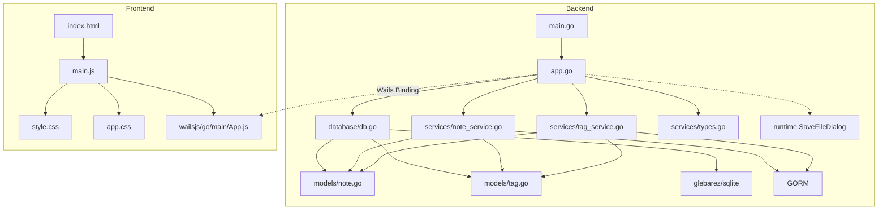

# Jot 项目分析报告

> 生成日期: 2026-06-24（已更新）
> 项目类型: 桌面端卡片式笔记应用（类小米笔记）
> 技术栈: Wails v2 + Go + GORM + SQLite + 原生 HTML/CSS/JS + CodeMirror 6（编辑器）

---

## 一、目录结构梳理

```
jot/                                    # 项目根目录
├── main.go                             # 【入口文件】Wails 应用启动入口，配置窗口/资源/绑定
├── app.go                              # 【核心文件】Wails 绑定层，暴露 57 个 Go API 给前端
├── go.mod                              # Go 模块定义，声明依赖版本
├── go.sum                              # Go 依赖锁文件
├── wails.json                          # Wails 项目配置（名称/构建脚本/作者）
├── AGENTS.md                           # 本报告文件
│
├── internal/                           # 【内部包】Go 子包统一目录
│   ├── database/
│   │   └── db.go                       # SQLite 初始化（glebarez/sqlite 纯 Go 驱动）+ DefaultDBPath() 路径函数
│   ├── fontutil/
│   │   └── fonts_windows.go           # EnumFontFamiliesW API 封装
│   ├── models/
│   │   ├── note.go                     # Note 实体（笔记）
│   │   ├── tag.go                      # Tag 实体（标签）
│   │   ├── setting.go                  # Setting 实体（KV 配置）
│   │   └── draft.go                    # Draft 实体（草稿，仅 1 行记录 ID=1）
│   └── services/
│       ├── note_service.go             # 笔记 CRUD + 搜索 + 置顶 + 回收站 + 统计 + 导入导出 + GetAllIDs
│       ├── tag_service.go              # 标签管理 + 笔记标签关联 + 标签计数
│       ├── setting_service.go          # 配置读写
│       ├── draft_service.go            # 草稿 SaveDraft/GetDraft/ClearDraft
│       └── types.go                    # 通用类型（PaginatedResult, DataStats, ImportResult 等）
│
├── frontend/                           # 【前端目录】Wails 前端（Vanilla + Vite）
│   ├── index.html                      # 入口 HTML，单栏布局 + 6 个视图
│   ├── package.json                    # 前端依赖（Vite 3.x + CM6 8 包 + marked + highlight.js）
│   ├── src/
│   │   ├── main.js                     # 【核心文件】前端逻辑 ~5100 行（含 CM6 集成）
│   │   ├── style.css                   # 组件样式 ~3064 行（含 CM6 主题/语法高亮）
│   │   └── app.css                     # 全局样式（reset/布局/滚动条 ~458 行）
│   ├── wailsjs/                        # Wails 自动生成的 JS 绑定
│   │   └── go/main/
│   │       ├── App.js                  # 后端 API 的 JS 封装
│   │       ├── App.d.ts               # TypeScript 类型定义
│   │       └── models.ts              # Go 模型的 TS 类型
│   └── dist/                           # Vite 构建产物（前端编译输出）
│
└── .trae/specs/                        # 项目 Spec 文档目录
    ├── add-view-mode-toggle-from-edit/  # 查看/编辑模式返回按钮
    ├── add-card-note-app/              # 初始需求规格
    │   ├── spec.md
    │   ├── tasks.md
    │   └── checklist.md
    ├── add-data-management/            # 数据管理功能规格
    │   ├── spec.md
    │   ├── tasks.md
    │   └── checklist.md
    ├── add-font-settings/              # 字体设置功能规格
    │   ├── spec.md
    │   ├── tasks.md
    │   └── checklist.md
    ├── add-quick-note-mode/          # 快速笔记模式规格
    │   ├── spec.md
    │   ├── tasks.md
    │   └── checklist.md
    ├── add-md-rendering/             # Markdown 渲染查看规格
    │   ├── spec.md
    │   ├── tasks.md
    │   └── checklist.md
    ├── add-about-page/               # 关于页面规格
    │   ├── spec.md
    │   ├── tasks.md
    │   └── checklist.md
    ├── add-misc-improvements/         # 杂项优化规格（滚动条美化/默认标签/快捷键说明/分段控件重构）
    │   ├── spec.md
    │   ├── tasks.md
    │   └── checklist.md
    ├── add-one-click-backup-restore/   # 一键备份还原规格
    │   ├── spec.md
    │   ├── tasks.md
    │   └── checklist.md
    ├── redesign-data-management/       # 数据管理页面 UI 重构与动画增强规格
    │   ├── spec.md
    │   ├── tasks.md
    │   └── checklist.md
    ├── unify-notification-system/       # 统一通知系统规格（右上角浮动通知组件）
    │   ├── spec.md
    │   ├── tasks.md
    │   └── checklist.md
    ├── enhance-interaction-animation/  # 交互体验与动画增强规格（16 项动画/过渡/交互动画）
    │   ├── spec.md
    │   ├── tasks.md
    │   └── checklist.md
    └── integrate-codemirror-6/        # CodeMirror 6 编辑器集成（已完成）
        ├── spec.md
        ├── tasks.md
        └── checklist.md
    └── lazy-content-loading/          # 懒加载 Content 优化（已完成）
        ├── spec.md
        ├── tasks.md
        └── checklist.md
    └── fix-drag-drop-notebook-scope/   # 拖拽导入按当前笔记本作用域修正（已完成）
        ├── spec.md
        ├── tasks.md
        └── checklist.md
    └── fix-preview-scrollbar/          # 预览模式滚动条修复（已完成）
        ├── spec.md
        ├── tasks.md
        └── checklist.md
    └── fix-cm6-horizontal-scrollbar-gutter/  # CM6 水平滚动条遮挡行号修复（已完成）
        ├── spec.md
        ├── tasks.md
        └── checklist.md
    └── fix-fullscreen-cover-custom-titlebar/  # 全屏模式遮挡自定义标题栏修复（已完成）
        ├── spec.md
        ├── tasks.md
        └── checklist.md
    └── fix-viewmode-fullscreen-halfheight/  # 查看模式全屏半高修复（已完成）
        ├── spec.md
        ├── tasks.md
        └── checklist.md
    └── hide-topbar-items-on-editor-fullscreen/ # 全屏隐藏搜索框/更多菜单 + 平滑过渡（已完成，文档在 .trae/documents/）
        └── ...
    └── elevate-visual-refinement/ # UI 视觉品质升级（已完成）
        ├── spec.md
        ├── tasks.md
        └── checklist.md
    └── add-table-copy-button/ # 表格复制按钮（已完成）
        ├── spec.md
        ├── tasks.md
        └── checklist.md
```

### 目录规范评价

| 维度 | 评价 |
|------|------|
| **分层清晰度** | 优秀。严格按 `models → services → database → app` 分层，前端后端隔离清晰 |
| **命名规范** | 良好。目录名使用复数形式（models/services），符合 Go 社区惯例 |
| **冗余目录** | 无。每个目录职责单一，无多余层级 |
| **待改进** | frontend/dist 为构建产物，应加入 .gitignore |

---

## 二、核心功能模块识别

### 2.1 基础支撑模块

| 模块名称 | 核心功能 | 对应文件 | 核心依赖 |
|----------|----------|----------|----------|
| **数据库初始化模块** | SQLite 连接建立、连接池配置、AutoMigrate | `database/db.go` | glebarez/sqlite, GORM |
| **数据模型层** | Note/Tag/Setting 实体定义、GORM tag 映射 | `models/note.go`, `models/tag.go`, `models/setting.go` | GORM |
| **通用类型** | 分页返回格式、统计数据、导入导出结构 | `services/types.go` | 无外部依赖 |
| **Wails 绑定层** | Go API → JS Bridge，含 runtime.SaveFileDialog | `app.go` | Wails v2 binding + runtime |
| **前端构建** | Vite 打包、Wails dev 热重载 | `frontend/package.json`, `wails.json` | Vite 3.x（保留，未移除）|
| **前端构建流程** | `wails build` 自动执行 `npm run build`（Vite）→ `frontend/dist/`，再嵌入 Go 二进制 | `go:embed all:frontend/dist` | 前端构建和后端编译都由 `wails build` 一条命令完成 |
| **字体枚举** | Windows GDI EnumFontFamiliesW 系统字体枚举 | `fontutil/fonts_windows.go` | gdi32.dll / user32.dll (syscall) |
| **配置存储** | KV 结构配置读写（字体偏好等） | `services/setting_service.go` | GORM |
| **路径工具** | 数据库默认路径 `~/.jot/data/jot.db` | `database/db.go:DefaultDBPath()` | `os.UserHomeDir()` |

### 2.2 业务核心模块

| 模块名称 | 核心功能 | 对应代码 | 核心输入 | 核心输出 |
|----------|----------|----------|----------|----------|
| **笔记 CRUD** | 创建/更新/查询/删除笔记 | `services/note_service.go` | 标题/内容/颜色/ID | Note 对象/错误 |
| **笔记搜索** | 标题+内容 LIKE 模糊搜索 | `note_service.go:Search()` | 关键词/分页参数 | 笔记列表+总数 |
| **笔记置顶** | 切换置顶状态 | `note_service.go:TogglePin()` | 笔记 ID | 更新后的笔记 |
| **回收站** | 软删除/查看/恢复/永久删除 | `note_service.go:Delete/GetTrash/Restore/PermanentDelete` | 笔记 ID | 操作结果 |
| **批量回收站操作** | 全部恢复/全部清空 | `note_service.go:RestoreAll/EmptyTrash` | — | 操作结果 |
| **标签管理** | 标签 CRUD | `services/tag_service.go` | 名称/颜色/ID | Tag 对象 |
| **笔记标签关联** | 为笔记添加/移除标签 | `tag_service.go:AddTagToNote/RemoveTagFromNote` | 笔记ID+标签ID | 操作结果 |
| **按标签筛选** | 通过标签 ID 查询笔记 | `note_service.go:GetByTag()` | 标签ID/分页参数 | 笔记列表+总数 |
| **数据统计** | 统计笔记总数/回收站数/标签数 | `note_service.go:GetStats()` + `tag_service.go:Count()` | — | DataStats 对象 |
| **数据导出为 .db** | 导出为 SQLite 数据库文件（VACUUM INTO + fs.CopyEx）| `app.go:ExportDataWithDialog()` | — | "导出成功" 提示 |
| **数据导入** | 从 JSON 文件导入笔记（跳过同名） | `note_service.go:ImportFromJSON()` | JSON 字节数组 | ImportResult 对象 |
| **前端卡片渲染** | 卡片网格展示 | `frontend/src/main.js` | 笔记数据数组 | DOM 渲染 |
| **前端编辑器** | 笔记编辑模态框（CM6 编辑器，支持行号/撤销重做/查找替换/Tab缩进/自动补全/自动闭合括号/Markdown 语法高亮） | `frontend/src/main.js` | 笔记数据/用户输入 | 保存/取消 |
| **前端查找替换** | CM6 search panel，Ctrl+F 查找 / Ctrl+H 查找替换，选中内容自动填充搜索框，预览模式自动切回编辑模式搜索 | `frontend/src/main.js:handleKeyboardNavigation()` | 搜索关键词 | 搜索面板匹配导航 |
| **前端搜索交互** | 输入框 250ms 防抖自动搜索，支持标题/内容/标签 | `frontend/src/main.js` | 关键词 | 搜索结果列表 |
| **前端导航切换** | 网格/搜索/设置/数据管理/回收站视图切换 | `frontend/src/main.js:switchView()` | 视图名称 | 视图 DOM 切换 |
| **前端右键菜单** | 右键弹出菜单（查看/编辑/置顶/删除） | `frontend/src/main.js` | 鼠标事件+笔记ID | 菜单显示/操作 |
| **前端只读查看** | 左击笔记打开只读查看器 | `frontend/src/main.js:openEditor()` | 笔记 ID | 只读查看模态框 |
| **标签搜索** | 点击标签 chip 触发按标签名搜索 | `frontend/src/main.js:searchByTag()` | 标签名 | 搜索结果列表 |
| **键盘快捷键** | Ctrl+F 编辑器搜索 / Ctrl+H 编辑器查找替换 / Ctrl+N 新建 / Ctrl+L 编辑器切换模式 / PgUp/PgDn 滚动 / Ctrl+Home/End / Ctrl+数字键 1-7 导航 | `frontend/src/main.js:handleKeyboardNavigation()` | 键盘事件 | 对应操作 |
| **版本号信息** | 返回 verman.V.GitVersion 纯版本号 | `app.go:GetVersion()` | — | 版本字符串 |
| **打开外链** | 调用 runtime.BrowserOpenURL 在默认浏览器打开链接 | `app.go:OpenProjectURL()` | URL 字符串 | — |
| **打开数据目录** | 在文件管理器中打开 `~/.jot/data/` | `app.go:OpenDataDir()` | — | explorer 文件管理器 |
| **一键备份** | 备份当前库到 `~/.jot/backup/jot-backup.db`（覆盖）| `app.go:BackupToDir()` | — | 备份成功提示 |
| **一键还原** | 从 `jot-backup.db` 还原并刷新笔记/标签/统计 | `app.go:RestoreFromDir()` | — | Toast 提示结果 |
| **字体设置** | 字体族下拉选择（搜索+键盘导航）+ 字体大小预设/自定义 | `frontend/src/main.js:loadFontSettings/applyFontFamily/applyFontSize` | 字体名称/大小 | 更新 CSS 变量 |
| **统一通知系统** | NotificationManager 单例类，右上角浮动通知，4 种类型 + undo 撤销 | `frontend/src/main.js:NotificationManager` | 消息/类型/回调 | 通知 DOM 创建与自动销毁 |

### 2.3 模块分层图

```
┌─────────────────────────────────────────────────────┐
│                    Frontend                          │
│  (main.js / style.css / index.html)                  │
│   ├─ 视图渲染 (卡片/搜索/设置/数据管理/回收站)          │
│   ├─ 交互逻辑 (事件绑定/状态管理)                      │
│   └─ Wails Bridge (window.go.main.App.*)              │
└────────────────────────┬────────────────────────────┘
                         │ Wails Binding (JSON 序列化)
┌────────────────────────▼────────────────────────────┐
│              App 层 (app.go)                         │
│  32 个绑定方法（CRUD/搜索/置顶/回收站/统计/导入导出/路径）│
│  (含 runtime.SaveFileDialog 原生对话框调用)            │
└────────────────────────┬────────────────────────────┘
                         │
              ┌──────────┼──────────┐
              ▼          ▼          ▼
    ┌─────────────┐ ┌──────────┐ ┌──────────────┐
    │ NoteService │ │TagService│ │    Types     │
    │ (CRUD/搜索/ │ │(CRUD/关联)│ │ Paginated    │
    │  置顶/回收站 │ │          │ │ DataStats    │
    │  统计/导入   │ │          │ │ Import       │
    │  导出)      │ │          │ │ Result 等    │
    └──────┬──────┘ └─────┬────┘ └──────────────┘
           │              │
           └──────┬───────┘
                  ▼
        ┌─────────────────┐
        │    GORM ORM     │
        │ (数据访问层)      │
        └────────┬────────┘
                 ▼
        ┌─────────────────┐
        │    SQLite       │
        │ (glebarez/sqlite│
        │  纯 Go 驱动)    │
        └─────────────────┘
```

---

## 三、模块间依赖关系分析

### 3.1 依赖关系详表

| 依赖方 | 被依赖方 | 依赖类型 | 依赖详情 |
|--------|----------|----------|----------|
| `app.go` | `database` | 编译依赖 | 调用 `database.InitDB()` 获取 `*gorm.DB` 实例 |
| `app.go` | `services` | 编译依赖 | 创建 `NoteService` / `TagService` / `SettingService` 实例 |
| `app.go` | `models` | 编译依赖 | 返回 `*models.Note` / `*models.Tag` / `*models.Setting` 类型 |
| `app.go` | `runtime` | 编译依赖 | `runtime.SaveFileDialog` 原生保存对话框 |
| `app.go` | `fontutil` | 编译依赖 | `fontutil.GetFonts()` 枚举系统字体 |
| `services` | `models` | 编译依赖 | 操作 Note/Tag/Setting 结构体 |
| `services` | GORM | 编译依赖 | `*gorm.DB` 数据库操作 |
| `database` | `models` | 编译依赖 | `AutoMigrate(&models.Note{}, &models.Tag{}, &models.Setting{})` |
| `database` | glebarez/sqlite | 编译依赖 | 纯 Go SQLite 驱动 |
| `fontutil` | gdi32/user32 | 运行时依赖 | syscall 调用 Windows GDI API |
| `frontend/main.js` | `wailsjs/go/main/App.js` | 运行时调用 | `window.go.main.App.*` 调用后端 API |
| `frontend/wailsjs` | `app.go` | 构建时生成 | `wails generate module` 自动生成 |

### 3.2 依赖关系图（Mermaid）



### 3.3 依赖问题分析

| 问题类型 | 描述 | 严重程度 |
|----------|------|----------|
| **循环依赖** | 无。所有依赖为单向 `main → app → services → models`，无循环 | ✅ 无问题 |
| **过度依赖** | 无。每个 Service 仅依赖 `*gorm.DB` 和自身模型 | ✅ 无问题 |
| **依赖缺失** | 无。`go.sum` 中所有传递依赖完整 | ✅ 无问题 |
| **隐式依赖** | 前端 `window.go` 对象依赖 Wails 运行时注入，本地开发/独立预览时不可用 | ⚠️ 有降级处理（Mock 数据） |
| **编译期依赖 vs 运行时依赖** | `wailsjs/` 目录需在修改 `app.go` 后重新生成 | ⚠️ 需手动执行 `wails generate module` |

---

## 四、设计模式与实现逻辑

### 4.1 设计模式识别

| 模式名称 | 应用位置 | 说明 | 代码示例 |
|----------|----------|------|----------|
| **Service Layer 模式** | `services/` 包 | 将业务逻辑从 controller（app.go）中抽离，封装为独立 Service 结构体 | `NoteService` / `TagService` |
| **依赖注入 (DI)** | `app.go` | Service 依赖的 `*gorm.DB` 通过构造函数注入 | `NewNoteService(db)` / `NewTagService(db)` |
| **Repository 模式** | `services/` 包内嵌 GORM | Service 内部直接使用 GORM 作为数据访问层 | `s.db.Create()` / `s.db.Where()` |
| **单例模式 (应用级)** | App 结构体 | Wails 运行时保证 App 实例唯一 | `NewApp()` 在 `main()` 中仅调用一次 |
| **MVC 变体** | 整体架构 | Model(models) - View(frontend) - Controller(app.go + services) 分层 | 见分层图 |
| **降级策略 (Fallback)** | `frontend/main.js` | 后端未绑定时自动使用 Mock 数据 | `if (!window.go.main.App.GetNotes) { state.notes = getMockNotes(); }` |
| **Wails Runtime 集成** | `app.go` | 通过 runtime 包调用原生桌面功能 | `runtime.SaveFileDialog()` 弹出系统保存对话框 |

### 4.2 核心业务逻辑流程

#### 4.2.1 笔记创建流程

```
用户点击 "+" 按钮 / Ctrl+N
  → openEditor(null)          // 打开空编辑器模态框
    → 用户填写标题/内容/选择颜色/选择标签
    → 点击"保存"按钮
      → createNote()
        → 前端校验（标题不为空）
        → window.go.main.App.CreateNote(title, content, color)
          → app.go:CreateNote()
            → noteService.Create()          // GORM db.Create(&note)
            → 返回 *models.Note（含 id）
          → 遍历 selectedTags
            → window.go.main.App.AddTagToNote(note.id, tagId)
              → tagService.AddTagToNote()   // GORM Association("Tags").Append
        → closeEditor()                     // 关闭模态框
        → loadNotes()                       // 重新加载笔记列表
          → GetNotes(1, 100)                // 分页查询
          → renderCardGrid()                // 渲染右侧卡片网格
```

#### 4.2.2 笔记搜索流程

```
Ctrl+F / 用户点击搜索框 → 输入框聚焦
用户在搜索框输入文字 → 250ms 防抖
  → searchNotes(keyword, 'input')
    → 前端调用 SearchNotes(kw, 1, 100)
      → app.go:SearchNotes()
        → noteService.Search(keyword, page, pageSize)
          → GORM: WHERE title LIKE '%kw%' OR content LIKE '%kw%'
                 AND deleted_at IS NULL
          → ORDER BY pinned DESC, updated_at DESC
          → Preload("Tags")
          → 返回 []Note + total
    → 接收 PaginatedResult.Items
    → renderSearchResults(results, keyword)
      → 关键词高亮 (highlightText)
      → 渲染搜索结果列表（含可点击标签）
    → switchView('search')                  // 切换到搜索列表视图

清空搜索框 → 返回网格视图

点击标签 chip → searchByTag(tagName)
  → 设置搜索框值 → searchNotes(tagName, 'tag')
```

#### 4.2.3 笔记查看与右键菜单流程

```
左击笔记卡片/搜索结果
  → window.viewNote(id)
    → openEditor(id, true)
      → 标题输入框 readonly
      → 内容文本域 readonly
      → 标签仅展示（不可切换）
      → 隐藏"保存"/"取消"按钮
      → 标题显示"查看笔记"

右键笔记卡片/搜索结果
  → window.showContextMenu(event, noteId)
    → 阻止默认右键菜单
    → 定位菜单到鼠标位置
    → 菜单项：查看 / 编辑 / 置顶(取消置顶) / 删除
  → 点击菜单项 → window.handleContextAction(action)
    → 'view': 打开只读查看
    → 'edit': 打开编辑器(编辑模式)
    → 'pin': 切换置顶
    → 'delete': 确认后删除
  → 点击页面其他区域 → 关闭菜单
```

#### 4.2.4 笔记软删除与回收站流程

```
用户点击卡片上的 "✕" 删除按钮
  → confirm("确定要删除这条笔记吗？")
    → [确认]
      → deleteNote(id)
        → window.go.main.App.DeleteNote(id)
          → app.go:DeleteNote()
            → noteService.Delete(id)
              → GORM: db.Delete(&Note{}, id)    // 设置 deleted_at 时间戳
        → loadNotes()                           // 刷新列表
    → [取消] 无操作

用户进入回收站（通过顶部 ☰ → 回收站）
  → switchView('trash')
    → loadTrashNotes()
      → GetTrashNotes(1, 100)
        → GORM: Unscoped().Where("deleted_at IS NOT NULL")
  → 渲染回收站列表（含"全部恢复"和"全部清空"按钮）
    → 恢复单个: RestoreNote(id) → GORM: Update("deleted_at", nil)
    → 永久删除单个: PermanentDeleteNote(id) → GORM: Unscoped().Delete()
    → 全部恢复: RestoreAll() → GORM: Update 所有回收站笔记
    → 全部清空: EmptyTrash() → GORM: Unscoped().Delete 所有回收站笔记
```

#### 4.2.5 数据库导出流程

```
用户进入数据管理页面（通过顶部 ☰ → 数据管理）
  → loadDataStats()
    → GetDataStats()
      → noteService.GetStats() + tagService.Count() + os.Stat(dbPath) 获取文件大小
    → 渲染 4 张统计卡片（笔记总数/标签总数/回收站数/数据库大小）
      → 数字使用 countUp 动画递增显示

用户点击「导出数据」
  → window.go.main.App.ExportDataWithDialog()
    → app.go:ExportDataWithDialog()
      → 创建临时路径 → noteService.ExportBackup(tempPath)
        → GORM: VACUUM INTO tempPath       // SQLite 原生在线备份
      → runtime.SaveFileDialog()            // 弹出原生保存对话框
      → fs.CopyEx(tempPath, filePath, true) // go-kit/fs 原子性复制
      → 清理临时文件
    → 返回 "导出成功：/path/to/file.db"
    → 前端 Toast 弹出提示
```

#### 4.2.6 数据库导入流程

```
用户点击「导入数据」
  → runtime.OpenFileDialog()                // 弹出原生文件选择器，过滤 *.db
  → 用户选择 .db 文件
  → window.go.main.App.ImportDatabaseWithDialog()
    → app.go:ImportDatabaseWithDialog()
      → Step 1: 备份当前数据库 → fs.CopyEx(dbPath, backupPath)   // go-kit/fs
      → Step 2: sqlDB.Close() 关闭旧 SQLite 连接
      → Step 3: fs.CopyEx(filePath, dbPath) 覆盖数据库文件
      → Step 4: database.InitDB(dbPath) 重新打开数据库
      → Step 5: 重建 NoteService/TagService/SettingService
      → Step 6: 清理 .bak 备份
      → [任何步骤失败] 自动从 backupPath 恢复原始文件 + 重连
    → 返回 ImportResult{Message, SuccessCount}
    → 前端 Toast 提示结果 + 自动刷新笔记/标签/统计

用户点击「恢复出厂设置」
  → 二次确认对话框
  → window.go.main.App.ResetDatabase()
    → app.go:ResetDatabase()
      → 清空 notes、tags、note_tags、settings 所有表
      → 重新注入 6 个默认标签
    → 前端切回首页 + loadNotes() 刷新笔记列表
    → 统计卡片刷新显示零值
```

### 4.3 代码质量分析

| 维度 | 评价 | 具体表现 |
|------|------|----------|
| **命名规范** | 良好 | Go 使用 CamelCase（`NoteService`、`GetAll`），JS 使用 camelCase + snake_case（`loadNotes`, `created_at`），CSS 使用 kebab-case（`note-card`, `search-box`） |
| **注释覆盖** | 良好 | 所有公开方法和关键函数均有 `//` 行注释说明，JS 函数有 JSDoc 风格注释 |
| **硬编码** | 轻量 | 数据库路径通过 `database.DefaultDBPath()` 统一获取（`~/.jot/data/jot.db`）；Mock 数据硬编码在 JS 中 |
| **冗余代码** | 无 | 无明显重复代码，Service 间职责分离清晰 |
| **错误处理** | 中等 | Go 层完整处理 GORM 错误（ErrRecordNotFound），JS 层有 try/catch 包裹后端调用；前端有导入结果 Toast 提示 |
| **安全性** | 基础 | Go 层使用了参数化查询（GORM 防 SQL 注入），JS 层有 `escapeHtml()` 防 XSS；但无输入长度/格式校验 |

---

## 五、技术栈评估

### 5.1 技术栈清单

| 层级 | 技术组件 | 版本 | 用途 | 社区活跃度 |
|------|----------|------|------|------------|
| **桌面框架** | Wails v2 | v2.12.0 | 跨平台桌面应用框架（Go 后端 + 原生 WebView） | 🟢 活跃，Wails 社区增长迅速 |
| **后端语言** | Go | 1.26.1 | 编译型，高性能，跨平台 | 🟢 主流 |
| **ORM** | GORM | v1.31.1 | Go ORM 库，数据库操作抽象 | 🟢 活跃，Star 37k+ |
| **SQLite 驱动** | glebarez/sqlite | v1.11.0 | 纯 Go SQLite 驱动（免 cgo） | 🟢 活跃，纯 Go 实现 |
| **底层 SQLite** | modernc.org/sqlite | v1.23.1 | CGo-free SQLite 实现 | 🟢 活跃 |
| **前端构建** | Vite | v3.2.11 | 前端构建工具 | 🟡 较老版本（v3 已 EOL，建议 v5/v6） |
| **前端技术** | 原生 HTML/CSS/JS（CM6 编辑器）| — | 无框架依赖 | 🟢 稳定 |

### 5.2 技术栈选型评价

| 选型 | 评价 |
|------|------|
| **Wails v2** | ✅ 适合小型桌面应用。相比之下 Electron 更重（>100MB），Wails 打包体积小（<10MB），内存占用低 |
| **Go + GORM** | ✅ 适合本项目的 CRUD 密集型场景，GORM 降低 SQL 编写量 |
| **glebarez/sqlite** | ✅ 纯 Go 实现，免 CGO 编译。解决了 Windows 下 CGO 交叉编译的痛点 |
| **原生 HTML/CSS/JS** | ✅ 适合小项目，无需引入 React/Vue 等框架的打包体积和学习成本 |
| **Vite 3.x** | ⚠️ 版本较旧（v3）。Wails 默认模板锁定 v3，升级需手动修改。v3 已停止维护 |

### 5.3 版本兼容性问题

| 问题 | 描述 |
|------|------|
| GORM v1.31 vs Go 1.26 | ✅ 兼容。GORM v1.31.1 支持 Go 1.23+ |
| glebarez/sqlite v1.11 vs modernc.org/sqlite v1.23 | ✅ 兼容，glebarez 为 modernc 的上层封装 |
| Wails v2.12 vs Go 1.26 | ✅ 兼容，Wails v2.12 支持 Go 1.21+ |
| Vite 3.x vs Node 版本 | ⚠️ 需确认开发环境的 Node.js 版本是否在 Vite 3 支持范围内 |

---

## 六、补充分析

### 6.1 扩展性评估

| 维度 | 评价 |
|------|------|
| **新增数据模型** | 容易。在 `models/` 新建文件，`database/db.go` 中追加 `AutoMigrate`，新增对应 Service |
| **新增 API 接口** | 容易。在对应 Service 新增方法，`app.go` 新增绑定方法，前端 `main.js` 新增调用函数 |
| **前端新增视图** | 容易。在 `index.html` 新增 `div.view`，`main.js` 中 `switchView()` 添加分支 |
| **替换数据库** | 中等。改驱动 + 适配 SQL 方言，Service 层使用 GORM 可降低迁移成本 |
| **UI 框架集成** | 容易。原生 HTML/JS，可逐步引入 Vue/React |

### 6.2 性能关键点

| 关注点 | 描述 | 影响 |
|--------|------|------|
| **SQLite 单连接** | `SetMaxOpenConns(1)` | ✅ SQLite 本身不支持并发写入，限制为 1 是正确做法 |
| **N+1 查询** | `Preload("Tags")` 确保了预加载 | ✅ 避免了遍历笔记时逐个查询标签 |
| **LIKE 搜索** | `LIKE '%keyword%'` 无法利用索引 | ⚠️ 大数据量（>10万条）时性能下降，建议引入全文检索（FTS5） |
| **全量加载** | `GetNotes(1, pageSize)` 首屏只加载当前分页大小；底部滚动/键盘快捷键可按需追加剩余页 | ✅ 已优化：列表/搜索查询使用 GORM Select 截断 Content 为前 200 字符，编辑/查看页按需调用 `GetNoteContent(id)` 加载完整内容 |
| **前端 DOM 操作** | 每次 `loadNotes()` 全量重新渲染所有卡片 | ⚠️ 笔记数量>500时可能有卡顿，建议虚拟滚动或增量更新 |

### 6.3 异常处理分析

| 层级 | 处理方式 | 不足 |
|------|----------|------|
| **Go Service 层** | GORM 错误处理完整（ErrRecordNotFound），返回 `error` | 缺少自定义错误类型，错误信息不够结构化 |
| **Go App 层** | 透传 Service 层 error 到 Wails；导出使用 runtime.SaveFileDialog | 无额外的错误包装/日志记录 |
| **JS 前端** | `try/catch` 包裹后端调用，console.error 输出；导入结果有 Toast 显示 | 其他场景仍缺少用户可见的错误提示 |
| **数据库初始化** | Panic 策略（InitDB 失败直接 panic） | ✅ 数据库不可用是致命错误，panic 合理 |

### 6.4 安全分析

| 维度 | 状态 | 说明 |
|------|------|------|
| **SQL 注入** | ✅ 安全 | 全部使用 GORM 参数化查询或 `?` 占位符 |
| **XSS** | ✅ 防护 | `escapeHtml()` 对用户输入做 HTML 转义后渲染 |
| **文件路径** | ✅ 安全 | 数据库路径通过 `DefaultDBPath()` 统一定位到 `~/.jot/data/jot.db`；导出路径由 `runtime.SaveFileDialog` 提供 |
| **输入校验** | ⚠️ 基础 | 仅检查空标题，无长度/格式限制 |

---

## 七、项目核心特点

1. **轻量架构**：原生 WebView（Wails）+ 纯 Go 后端，构建产物小、内存占用低
2. **免 CGO 编译**：glebarez/sqlite 纯 Go 实现，Windows 交叉编译无障碍
3. **Service Layer 分离**：业务逻辑与界面绑定完全解耦，便于测试和扩展
4. **前后端松耦合**：前端通过 Wails Binding 调用后端，无直接依赖
5. **降级友好**：前端内置 Mock 数据，后端未绑定时仍可独立预览 UI
6. **组件化渲染**：前端渲染函数独立，数据驱动 DOM 更新
7. **原生桌面体验**：通过 Wails runtime 集成系统保存对话框（SaveFileDialog）
8. **键盘驱动**：支持 Ctrl+F/Ctrl+N/PgUp/PgDn（触底加载下一页）/Ctrl+Home/Ctrl+End（加载全部到底）/E（回首页）及数字键 1-6 快捷导航
9. **窗口焦点自动刷新**：`visibilitychange` 事件监听，切回应用自动刷新数据
10. **批量管理**：批量选择（全选从后端拉取全部 ID）、批量删除（支持撤销）、选中计数联动
11. **动画系统**：全局 CSS 变量驱动动画体系（13 个 keyframes + 20 项交错延迟工具类），16 项动画覆盖所有交互场景，`prefers-reduced-motion` 降级支持
12. **一键备份还原**：`~/.jot/backup/jot-backup.db` 固定路径，覆盖式备份，还原带确认弹窗
13. **按钮交互反馈**：按压缩放 + 涟漪效果 + 危险按钮全红按压态 + 禁用态灰化，覆盖所有交互场景
14. **统一通知系统**：右上角浮动通知组件，4 种类型色彩区分，自动消失/手动关闭/撤销回调
15. **MD 实时预览编辑器**：纯文本/预览双模式切换（`Ctrl+L` 快捷键），marked + highlight.js 实时渲染，底部状态栏切换按钮
16. **查找替换功能**：Ctrl+F 唤起查找条、Ctrl+H 唤起查找+替换条，位于状态栏上方。纯文本模式用 overlay 覆盖层高亮（`#findOverlay` 绝对定位同步滚动），预览模式用 TreeWalker 遍历 `#mdRendered` 文本节点包裹高亮。支持正则（待 CM6 替代后内置）、替换单个/全部、`[`/`]` 导航匹配项、选中内容自动填入查找框。查看模式仅支持查找。纯文本模式下替换需在编辑态（非预览），否则提示"请先切换到纯文本模式"
17. **置顶不更新时间**：后端 `TogglePin` 使用 `UpdateColumn("pinned")` 跳过 GORM 的 `UpdatedAt` 自动更新
18. **新建默认时间标题**：新建笔记自动填入 `YYYY-MM-DD HH:mm ☺️` 格式标题
19. **批量标签操作**：批量模式下 +标签/-标签 按钮，标签选择弹窗（选中态切换 + 确认按钮 + 已选计数），操作后不退出批量模式保持选中状态
20. **右键导出为 Markdown**：右键菜单「导出」→ 标题特殊符号→下划线 → 系统保存对话框 → `.md` 文件写入
21. **笔记本侧边栏系统**：三段式侧栏设计（header/list/footer），使用 `--card-bg`/`--bg-secondary` + `color-mix()` 配色过渡。书签隐喻（左侧 3px 指示条 + hover 微弹）。新建按钮移入 header 标题右侧（简洁 `+`）。footer 与按钮铺平融为一体，折叠动画 `white-space: nowrap` 防文字换行。6 主题自适应
22. **笔记本 CRUD**：后端 NotebookService（Create/Update/Delete/DeleteWithNotes/GetAll/GetAllNotesCount/EnsureDefaultNotebook），默认笔记本（ID=1）不可删不可改名。前端 rename 防重名校验（`isNameTaken`），删除对话框带 checkbox（迁移笔记到默认 / 连带永久删除笔记），删除活跃笔记本后自动切换到默认笔记本首页
23. **笔记本笔记隔离**：所有笔记查询按 `activeNotebookId` 过滤（`GetNotes`/`SearchNotes` 均接受 `notebookID` 参数）。`selectAllIds` 使用 `GetNoteIDsByNotebook` 替代 `GetAllNoteIDs`，确保全选仅限当前笔记本笔记。各笔记本笔记数 badge 自动同步更新
24. **CodeMirror 6 编辑器集成**：用 CM6（EditorView/EditorState）替换原生 `<textarea>`，解决了 WebView2 中撤销/恢复失效的问题，同时带来行号、Tab 缩进、自动补全、闭合括号、Markdown 语法高亮等原生编辑器能力。搜索替换改用 CM6 内置 search panel（`openSearchPanel` + `setSearchQuery`），选中内容自动填入搜索框。预览模式按 Ctrl+F 自动切回编辑模式搜索。新增 ~22 个 CM6 依赖包（`@codemirror/state`、`@codemirror/view`、`@codemirror/commands`、`@codemirror/search`、`@codemirror/lang-markdown`、`@codemirror/language`、`@codemirror/autocomplete`、`@lezer/highlight` 等），删除 ~640 行 FindReplaceManager 死代码。净减 ~510 行，CSS/JS 重构覆盖编辑器初始化/快捷键/只读模式/模式切换。详见 `.trae/specs/integrate-codemirror-6/`
25. **CM6 Markdown 语法高亮系统**：使用 `HighlightStyle.define()` + `syntaxHighlighting()` 为 Markdown 语法节点分配颜色，引用 CSS 变量（`--accent`、`--text-primary`、`--text-muted` 等）实现 6 主题联动。覆盖 16 种元素：heading1-6、strong、emphasis、strikethrough、link、url、quote、monospace、comment（代码块）、list（列表标记）、contentSeparator（水平线）、escape（转义符）、character（HTML 实体）、labelName（代码语言标签）、string（链接标题）、processingInstruction（语法标记符号如 ```）。不使用 `classHighlighter`（生成 `tok-xxx` 类名不匹配 CM6 DOM 结构）。
26. **预览区代码块复制按钮**：`updatePreview()` 中为每个 `pre` 元素添加 `.copy-code-btn`，悬浮时显示（`.copy-code-btn { opacity: 0; } pre:hover .copy-code-btn { opacity: 1; }`），点击通过 `navigator.clipboard.writeText()` 复制代码内容到剪贴板。状态反馈：默认 `'复制'` → 成功 `'✓ 已复制'` → 1.5s 恢复 `'复制'`；失败 `'✗ 复制失败'` → 1s 恢复 `'复制'`。
27. **纯文本编辑器 MD 高亮开关**：设置页新增「编辑器选项」→「纯文本编辑器启用 MD 语法高亮」toggle，存储键 `md_highlight_plain`（默认 true）。`initCodeMirror()` 新增 `useMdHighlight` 参数，条件性添加 `markdown()` + `syntaxHighlighting(jotHighlightStyle)`。Markdown 笔记始终启用 MD 语法高亮，纯文本笔记根据设置决定。
28. **查看页编辑按钮**：查看模式（只读）header 工具栏在「全屏」按钮左侧显示 `✎` 编辑按钮（空心铅笔图标，与全屏⛶/关闭✕ 线条风格一致）。点击后直接调用 `openEditor(noteId, false)` 原地切换为编辑模式，不走 `closeEditor()`（避免其内部 200ms setTimeout 动画回调隐藏面板导致闪烁后消失的问题）。编辑模式下该按钮自动 `display:none` 隐藏。按钮顺序：T(类型切换) → ✎(编辑,仅查看可见) → ⛶(全屏) → ✕(关闭)
29. **拖拽文件导入**：支持将文件拖入应用窗口导入为笔记。Wails 层面 `main.go` 配置 `DragAndDrop.EnableFileDrop: true` 启用 OS 级拖放拦截。前端用 `_dragCounter` 模式控制遮罩显示/隐藏（避免子元素 dragleave 误触发），拖入文件后 Wails `OnFileDrop(x, y, paths)` 回调直接返回文件路径数组，传后端 `ImportFiles(paths, notebookID)` 统一处理。向后端传递当前 `state.activeNotebookId`，文件导入到用户当前所在的笔记本。拖入时显示全局半透明遮罩层（#dropOverlay）+ 虚线卡片提示「释放以导入文件」。后端用 `go-kit/fs.IsBinaryPath()` 检测二进制文件（前 8000 字节含空字符）并拒绝。支持多文件批量导入，后端 stat 检测目录并拒绝提示。单文件大小限制 10MB。导入完成后打开最后一条笔记为查看页面，发通知提示导入结果。
30. **懒加载 Content 优化**：列表/搜索查询使用 GORM `Select("id, title, SUBSTR(content, 1, 200) AS content, ...")` 截断 Content 为前 200 字符（足够卡片预览摘要），避免全量加载大 Content 字段导致内存飙升和网络传输膨胀。新增 `GetNoteContent(id)` API，前端 `openEditor()` 按需调用获取完整内容注入 CM6 编辑器和 Markdown 预览渲染。


---


## 八、待优化点

### 中期优化
1. **Vite 升级**：Vite 3 → Vite 5/6，获取更好的构建性能和生态支持
2. **全文搜索**：引入 SQLite FTS5，替代 `LIKE %keyword%` 模糊搜索

### 架构层面
3. **前端框架**（可选）：若功能持续增长，可引入 Vue/React 管理复杂状态
4. **单元测试**：补充 Service 层的 `_test.go` 测试文件

### 已实现
- ✅ **滚动/分页加载**：首屏按分页大小加载，触底按需追加下一页，Ctrl+End 一次加载全部
- ✅ **Pagination 设置**：操作 CRUD 后重置到第 1 页
- ✅ **PgDn/ESC 快捷键**：PgDn 触底主动加载，ESC 退出子视图回首页
- ✅ **加载动画**：触底加载时显示 CSS 旋转动画 + 最短 1s 显示时间
- ✅ **排序设置**：设置页支持按更新时间/创建时间/名称排序，iOS 风格分段控件（3 等分滑动指示器），持久化到 Setting `sort_order`
- ✅ **分页大小设置**：设置页支持 20/40/60/80/100 分页档位，iOS 风格分段控件
- ✅ **Go 内部包重构**：database/fontutil/models/services 移至 internal/ 目录
- ✅ **主题系统**：6 个主题 — default（暖灰）、nord（北极蓝调）、monokai-pro（荧光粉墨）、light（亮白蓝强调）、tokyo-night（靛紫夜幕）、dark（纯黑琥珀强调）。CSS 变量体系统一，`data-theme` 属性切换，iOS 风格分段控件选择（6 等分滑动指示器），持久化到 Setting `theme`
- ✅ **标签选中态视觉优化**：未选中标签压暗去饱和，选中亮色 + ✓ 前缀 + 脉冲动画 + 外发光
- ✅ **悬浮操作按钮**：右下角 `+`（新建）和 `↑`（回到顶部），`↑` 滚动超过 300px 时淡入
- ✅ **滚动条美化**：主内容区滚动显示/停止 1s 淡出，6px 半透明灰条，6 主题独立配色；textarea `flex:1` 独占滚动，编者面板高度固定 85vh
- ✅ **快速笔记模式**：设置页 iOS 风格开关，启用后启动时直接以全屏尺寸打开编辑器（`openEditor(null, false, true)`，不经过「先悬浮卡片再切换全屏」的闪烁），保存/取消后回到网格首页
- ✅ **Markdown 渲染查看**：查看模式使用 marked + highlight.js 渲染 Markdown 为 HTML，代码块语法高亮，编辑模式不变
- ✅ **关于页面**：品牌名点击弹出覆盖层，展示项目名/简介/版本号/项目地址链接；版本号由 verman 库通过 ldflags 注入；项目链接点击在默认浏览器打开
- ✅ **快捷键说明**：更多菜单「帮助」或按数字键 `5` 弹出模态覆盖层，展示全部快捷键列表；与关于页面相同遮罩/卡片动画
- ✅ **窗口焦点自动刷新**：`visibilitychange` 事件监听，切回应用自动刷新 grid/trash/data 视图
- ✅ **数据库路径迁移**：从 `./data/jot.db` 迁移到 `~/.jot/data/jot.db`（`DefaultDBPath()`），应用/种子脚本统一
- ✅ **批量全选加载全部 ID**：全选时调用 `App.GetAllNoteIDs()` 获取所有笔记 ID，一次选中全部
- ✅ **搜索框逻辑修复**：回车立即搜索，清空自动刷新笔记列表（footer 清理 bug 修复）
- ✅ **交互体验与动画增强**：16 项动画/过渡增强 — 视图切换过渡、卡片网格交错入场/hover/active 动画、统计卡片 count-up 数字动画、回收站 shrinkOut 删除/恢复动画、设置 toggle-switch/字体下拉展开收起、帮助/关于模态弹簧动画、编辑器模态缩放淡入 + 品牌色条展开 + 标签脉冲、Markdown 淡入/代码块交错、快速笔记全屏过渡、批量模式滑入滑出 + 复选框交错、Toast 滑入滑出/堆叠上移、右键菜单缩放展开/收起、更多菜单 transform-origin 缩放、主题切换 300ms 平滑过渡；全局 prefers-reduced-motion 降级支持
- ✅ **搜索结果滚动条贴边**：搜索列表容器负边距贴靠窗口右边缘，列表内容保持 32px 内边距
- ✅ **数据管理三层布局**：第一层统计卡片（4 列网格）、第二层操作按钮（纵向 card 列表 + 恢复出厂设置危险按钮）、第三层数据目录
- ✅ **数据库大小统计**：4 张统计卡片包含数据库文件大小，通过 os.Stat 读取并格式化显示 B/KB/MB
- ✅ **导出改为 DB 文件备份**：VACUUM INTO → fs.CopyEx → .db 文件，完整备份所有数据（含回收站/设置/关联关系）
- ✅ **导入改为文件覆盖**：6 步流程（备份→关连接→覆盖→重连→重建→清理），出错自动回滚
- ✅ **恢复出厂设置刷新首页**：重置后自动切回首页 + loadNotes()，空库显示「暂无笔记」
- ✅ **打开数据目录**：数据管理第三层按钮，exec.Command("explorer") 在文件管理器中打开数据库目录
- ✅ **Ctrl+A/Ctrl+D 批量快捷键**：全局 Ctrl+A 阻止全选，批量模式 Ctrl+A 全选 Ctrl+D 取消全选
- ✅ **lint 0 issues**：golangci-lint errcheck 等 7 个问题全部修复，0 issues 通过
- ✅ **一键备份还原**：`~/.jot/backup/jot-backup.db` 固定路径，每次覆盖备份；还原带自定义确认弹窗 + 按钮加载状态；备份信息标签（时间/大小/绿色标识）
- ✅ **数据管理页面重构**：除统计卡外所有区域改卡片风格（圆角/阴影/边框），标题与设置页统一（0.938rem 无装饰条），view-header 整体左移 16px
- ✅ **按钮点击反馈增强**：所有 `data-action-btn` 按压缩放（0.975）+ 涟漪 `::after` 闪现；危险按钮按压全红底白字；禁用态灰化+禁止点击；统计卡卡 hover 上浮 + active 按压 + 交错入场动画
- ✅ **全局 overscroll-behavior 禁用**：`body` + `#mainContent` 设置 `overscroll-behavior: none`，双指触控板滑动不回弹
- ✅ **统一通知系统**：删除旧底部堆叠 toast（`#undoToast`/`showToast`/`showUndoToast`），替换为 `NotificationManager` 单例类，右上角浮动通知组件。支持 4 种通知类型（success/error/warning/info）+ undo 类型，左侧色标条 + 图标区分，入场 `notifSlideIn` 弹性滑入，出场 `notifSlideOut` 滑出淡出。`nm.show(msg, type, duration?)` 自动 3s 消失，`nm.showUndo(msg, onUndo, duration?)` 带撤销按钮 5s 消失。替换全部 34 个旧调用点，删除旧函数 5 个 + 状态变量 4 个。设置页保存操作后发通知提示。创建/删除标签操作发通知提示
- ✅ **MD 实时预览编辑器**：编辑器新增纯文本/预览双模式切换，底部状态栏中间胶囊按钮组。查看模式自动切预览，编辑模式默认纯文本。使用已有 marked + highlight.js 渲染，300ms 防抖自动更新。预览区隐藏滚动条，各滚各的不同步
- ✅ **查找替换功能**：FindReplaceManager 类（~636 行），Ctrl+F 唤起查找条、Ctrl+H 唤起替换条，位于状态栏上方。纯文本模式用 `#findOverlay` 绝对定位覆盖层高亮（`transform: translateY(-scrollTop)` 同步滚动），预览模式用 TreeWalker 遍历 `#mdRendered` 文本节点包裹 `.find-highlight` span。支持替换单个/全部、`[`/`]` 导航匹配项、选中内容（textarea 或预览区）自动填入查找框。查看模式仅支持查找（替换显示禁用提示 3s）。纯文本+预览模式下替换提示"请先切换到纯文本模式"。模式切换时自动关闭查找条。焦点管理：查找输入框输入时焦点稳定不跳回内容区
- ✅ **编辑器蒙层点击修复**：关闭编辑器的蒙层事件从 `click` 改为 `mousedown`，解决 WebView2 中鼠标拖拽选中文本时 mouseup 落在 overlay 上误触发关闭的问题
- ✅ **撤销恢复代码已移除**：曾实现 UndoRedoManager（基于字符串快照栈）解决 WebView2 Ctrl+Z/Y 失效问题，但因防抖合并导致只能撤回一次、_skipRecord 标志位复杂度高等问题，已由用户移除代码。计划引入 CodeMirror 6 后由其内置 history() extension 完全覆盖
- ✅ **移除 Google Fonts CDN**：删除 DM Sans 字体依赖，默认字体改为 `system-ui, -apple-system, sans-serif`，完全无外部网络请求
- ✅ **只读模式标签过滤**：查看页面标签只显示该笔记已添加的标签，不再展示全部标签
- ✅ **README 精简**：删除内部 API 文档/使用示例/配置选项/项目结构/测试说明，聚焦用户视角的使用和安装
- ✅ **CSS 清理**：删除 Section L 旧确认弹窗死代码（38 行）、删除 style.css 中重复的 `cardEnter` 关键帧（app.css 版本生效）、补齐 6 主题 `--bg-secondary`/`--text-tertiary` 变量（此前引用未定义）
- ✅ **确认弹窗修复**：HTML 类名 `confirm-dialog-overlay` 指向已被删除的旧 CSS，修复为 `confirm-overlay` + 适配 CSS/JS，弹窗居中 + 模糊背景 + 淡入动画
- ✅ **标签删除刷新笔记**：`deleteTag()` 末尾追加 `await loadNotes()`，删除标签后卡片网格立即更新，不再显示已删除的标签
- ✅ **全屏动画优化**：CSS 去掉 `!important`，尺寸/圆角加入默认 transition；JS 移除 inline transition 逻辑 + transitionend 监听，纯 classList 切换；overlay 全屏态加深背景 + 升模糊至 10px；editor-body 过渡期间淡出/淡入防内容跳跃
- ✅ **编辑器快捷键放行**：编辑器打开时 Ctrl+Home/End 和 PgUp/PgDn 不拦截，交由 textarea 原生处理（光标到行首/行末，上下翻页）
- ✅ **ESC 关闭编辑器**：编辑器打开时按 ESC 触发 `closeEditor()`，关闭查看/新建/编辑弹窗
- ✅ **Ctrl+L 切换编辑器模式**：编辑器打开时按 `Ctrl+L` 切换纯文本/预览模式，已在快捷键说明页注册
- ✅ **新建默认时间标题**：新建笔记自动填入当前日期时间 `2026-06-06 14:30 ☺️`
- ✅ **置顶不更新时间**：`TogglePin` 改为 `UpdateColumn("pinned")`，跳过 `UpdatedAt` 自动更新
- ✅ **右键导出为 Markdown**：右键菜单「导出」→ 标题特殊符号→下划线 → 系统保存对话框 → `.md` 文件（`# 标题\n\n内容` 格式写入）
- ✅ **批量标签操作**：批量工具栏新增 +标签/-标签 按钮；点击弹出标签选择弹窗（毛玻璃背景 + 弹入动画），所有标签以彩色圆点展示；添加/移除模式统一为「点击标签切换选中态 → 确认按钮执行」；底部确认按钮显示已选数量；移除模式不可移除标签灰色禁用；操作后不退出批量模式保持选中状态；空态提示「当前选中的笔记中没有可移除的标签」
- ✅ **草稿自动保存与恢复**：新建 `drafts` 表（仅 1 行 ID=1，存 title/content），后端 `DraftService`（SaveDraft upsert / GetDraft / ClearDraft）+ app.go 绑定 3 个方法。前端 `startAutoSave()` 扩展：有 ID → `UpdateNote`（编辑已有笔记），无 ID → `SaveDraft`（新建笔记草稿），3s 防抖，标题内容均空不保存。`loadNotes()` 完成后延迟 1s 检测草稿（编辑器打开时跳过），有则弹窗「发现未保存的草稿，是否恢复？」恢复→填入编辑器、放弃→清除。清除时机：保存成功（`createNote`）、取消按钮（明确放弃）、恢复弹窗恢复/放弃。叉号/点击蒙层/ESC 不清除（保留供下次恢复）。快速笔记启用启动时 `loadQuickNoteSetting()` 自动查草稿并填入编辑器。底部栏 autoSaveIndicator 提示文字 2s 后清空（`textContent=''`），布局自动恢复
- ✅ **设置页首次打开白屏修复**：根因为 `updateFontSettingsUI()` 调用 `renderFontFamilyOptions()` 在首次显示时创建 200+ 带 `style="font-family:..."` 的字体选项 DOM 节点，浏览器首次布局计算耗时 1-2 秒。修复：`updateFontSettingsUI()` 移除 `renderFontFamilyOptions()` 调用，改为仅在用户点击下拉触发器时渲染（已有点击处理逻辑），设置页首次打开不再含大量字体节点参与布局，白屏消除
- ✅ **笔记类型功能**：Note 模型新增 `NoteType string` 字段（`gorm:"size:20;default:text"`），支持 `"text"`（纯文本）和 `"markdown"`（Markdown）两种类型。新建笔记默认选中「纯文本」（text）。纯文本模式底部隐藏「编辑/预览」切换按钮（`#editorModes`），仅显示纯文本编辑区。查看模式：`note_type="text"` 或 `""` 时内容以 `<pre>` 原始格式显示跳过 marked 解析；`note_type="markdown"` 走现有渲染流程。创建/更新笔记时 `note_type` 字段随请求写入，旧笔记 `note_type=""` 默认按 text 处理
- ✅ **笔记类型切换器位置重构**：类型切换器从 footer 底部（与模式切换器冲突）移到 header 标题行右侧紧凑胶囊（`.editor-title-row`），再重构为 header 工具栏中的 32×32 T/M 图标按钮（`#editorTypeToggle`），与全屏/关闭按钮同尺寸同风格。查看只读模式隐藏
- ✅ **置顶按钮重新设计**：从旧 `.card-pin-badge` 左侧指示器 + hover 显示按钮改为始终可见的圆形图标按钮（`border-radius: 50%`）。分 4 级透明度：默认 20% → 卡片 hover 50% → 按钮自身 hover 100% + 放大 1.15x → 已置顶 100% + `accent-lighter` 背景 + 阴影。star 使用字体加粗区分状态
- ✅ **置顶操作局部更新**：`togglePin()` 切换后不再 `await loadNotes()` 全量重载，改为本地更新 `state.notes` + `renderCardGrid('none')`，省掉后端请求和整页入场动画
- ✅ **批量模式 pin 按钮可见**：批量模式下 pin 按钮不再 `display: none`，与 checkbox 并存显示；添加 `.disabled` class（`pointer-events: none`），退出批量模式恢复交互
- ✅ **批量置顶/取消置顶**：后端 `note_service.go` 新增 `BatchPinNotes(ids []uint, pin bool)` + `app.go` 绑定。批量操作栏新增 `#batchPinBtn` 按钮；`updateBatchBar()` 根据选中笔记状态动态切换文字（全部已置顶→"取消置顶"，否则→"置顶"）；`batchPinSelected()` 调用后端 + 本地同步 + 通知提示
- ✅ **Seed 工具 note_type**：`tools/seed/main.go` 24 条模拟笔记 50/50 分配 text/markdown 类型（含 Checklist/纯列表的为 text，含 headings/代码块/表格的为 markdown）
- ✅ **笔记本侧边栏三段式设计**：Header（--card-bg 56px + 标题 + `+` 按钮）→ List（--bg-secondary，书签隐喻笔记本项）→ Footer（color-mix 55/45 铺平，无圆角无 padding）。6 主题自适应，折叠动画防文字换行
- ✅ **笔记本 CRUD 系统**：NotebookService 7 方法（Create/Update/Delete/DeleteWithNotes/GetAll/GetAllNotesCount/EnsureDefaultNotebook）。默认笔记本（ID=1）不可删不可改名。重命名防同名检测
- ✅ **删除笔记本连带选项**：自定义确认弹窗内嵌 checkbox，勾选→硬删除笔记+软删笔记本，不勾选→笔记迁到默认笔记本。删除活跃笔记本后自动回默认首页
- ✅ **笔记本笔记隔离**：所有查询按 `activeNotebookId` 过滤，`selectAllIds` 使用 `GetNoteIDsByNotebook`。badge 在 6 种笔记操作后自动同步更新
- ✅ **切换笔记本回首页**：`switchNotebook()` 强制 `switchView('grid')` 回到当前笔记本笔记首页
- ✅ **笔记本侧栏折叠动画优化**：`white-space: nowrap` + `overflow: hidden` 防按钮文字折叠时竖排换行
- ✅ **笔记跨笔记本迁移**：右键菜单「移动到...」+ 批量工具栏「移动到」，弹出笔记本选择器弹窗（radio 列表 + badge 计数 + 弹簧动画），迁移后自动刷新列表和 badge 计数
- ✅ **笔记本数统计卡片**：数据管理页第 5 张统计卡片（`statTotalNotebooks`），`DataStats` 新增 `total_notebooks` 字段，后端 COUNT + 前端 count-up 动画
- ✅ **切换笔记本退出批量模式**：`switchNotebook()` 中检测 `state.batchMode`，自动调用 `toggleBatchMode()` 清空选中，防止跨笔记本残留选中
- ✅ **启动默认收起侧边栏**：`restoreSidebarState()` 和 inline script 逻辑改为 `!== 'false'`，无 localStorage 记录时默认收起
- ✅ **CodeMirror 6 编辑器集成**：CM6（EditorView/EditorState）替换原生 `<textarea>`，解决 WebView2 撤销/恢复失效，支持行号/Tab 缩进/自动补全/闭合括号/Markdown 语法高亮。搜索替换改用 CM6 search panel。删除 FindReplaceManager（~640 行）和旧 Find Bar CSS（~140 行）。净减 ~510 行。CM6 在面板动画启动前同步初始化，面板/编辑器一体出场。CSS 变量联动主题/字体，`cmFadeIn` 动画防白屏。详见 `.trae/specs/integrate-codemirror-6/`
- ✅ **CM6 Markdown 语法高亮**：使用 HighlightStyle + syntaxHighlighting 引用 CSS 变量实现，覆盖 16 种 MD 元素。不使用 classHighlighter（tok-xxx 类名不匹配 CM6 DOM）
- ✅ **预览区代码块复制按钮**：悬浮出现、点击复制代码内容、成功/失败状态反馈
- ✅ **预览模式滚动条修复**：移除 `.md-rendered` 隐藏滚动条的 CSS（`scrollbar-width: none`、`::-webkit-scrollbar { display: none }`），替换为 6px 精致微调滚动条（`var(--scrollbar-thumb)` 主题色联动、hover 加深、圆角 3px）
- ✅ **纯文本编辑器 MD 高亮开关**：设置页新增 toggle，md_highlight_plain 键存储，Markdown 笔记始终启用，纯文本按设置决定
- ✅ **查看页编辑按钮**：查看模式 header 工具栏显示 ✎ 编辑按钮（全屏左侧），点击原地切换为编辑模式（不走 closeEditor 避免闪烁），图标为空心铅笔与全屏/关闭风格统一
- ✅ **拖拽文件导入**：Wails OnFileDrop + DragAndDrop.EnableFileDrop，后端 go-kit/fs 检测二进制；按当前笔记本 scope 导入（传递 activeNotebookId）
- ✅ **懒加载 Content 优化**：列表/搜索查询使用 Select 截断 Content 为前 200 字符，打开笔记时按需加载完整内容
- ✅ **重置数据库后刷新侧边栏**：resetDatabase 后追加 loadNotebooks() 调用，解决笔记本计数不刷新问题
- ✅ **空标题保存校验**：createNote/updateNote 标题为空时 show('标题不能为空...') 提示，阻止保存
- ✅ **CM6 行号栏背景修复**：水平滚动条出现时不再覆盖左侧行号区域；`.cm-gutters` 背景改为 `var(--card-bg)` 并设置 `z-index: 10`，行号数字右侧 padding 从 8px 收窄到 4px。详见 `.trae/specs/fix-cm6-horizontal-scrollbar-gutter/`
- ✅ **查看模式全屏半高修复**：查看模式纯文本笔记全屏后编辑器只剩半高的根因是 `openEditor()` 的 view mode + text 分支未设置 `data-mode="edit"`，导致 `toggleEditorFullscreen()` Phase 3 清除内联样式后 `.md-rendered` 以 `flex: 1` 可见与 CM6 各占一半空间。修复方案：统一在 `openEditor()` 各分支前设默认 `data-mode="edit"`，查看模式纯文本分支不再需要手动设置，Markdown 分支继续 override 为 `'preview'`。详见 `.trae/specs/fix-viewmode-fullscreen-halfheight/`
- ✅ **全屏快捷键绑定**：编辑器全屏绑定 `Ctrl+E`（编辑器打开时有效），窗口 OS 全屏绑定 `F11`（全局有效），两者独立不冲突。导入 Wails runtime 的 `WindowFullscreen/WindowUnfullscreen/WindowIsFullscreen` 实现窗口全屏。详见 `.trae/documents/add-fullscreen-keyboard-shortcuts.md`
- ✅ **快速笔记启动跳过动画**：`openEditor(null, false, true)` 的 `startFullscreen` 分支先 `panel.style.transition='none'` 禁用 CSS 过渡，再添加 `.fullscreen` class，`void panel.offsetHeight` 强制回流确保生效后恢复 transition。同时覆盖 `overlay/panel` 的 `opacity: 1`、`transform: scale(1)` 避免 CSS 初始状态 `opacity:0/scale(0.85)` 导致面板不可见。全程零动画，快速笔记启动瞬间全屏显示。详见 `.trae/specs/skip-quicknote-animation-on-start/`

---

## 九、关键记忆点

| 记忆点 | 内容 |
|--------|------|
| **项目名** | Jot（卡片式笔记桌面应用） |
| **技术栈** | Wails v2 + Go 1.26 + GORM v1.31 + glebarez/sqlite + 原生 HTML/CSS/JS |
| **数据库** | SQLite（`~/.jot/data/jot.db`），免 CGO 纯 Go 驱动，路径由 `DefaultDBPath()` 统一获取 |
| **后端结构** | `main.go → app.go → services/ → models/` + `database/` + `fontutil/` |
| **绑定方法数** | 57 个（19 个 Note 相关 + 6 个 Tag 相关 + 6 个 Notebook 相关 + 2 个迁移 + 6 个数据管理 + 3 个字体设置 + 4 个排序/分页设置 + 2 个关于页面 + 3 个 Draft 草稿 + 3 个备份还原）|
| **前端视图** | 8 个：卡片网格、编辑器（模态框）、搜索结果、设置、数据管理、回收站、关于页面（覆盖层）、快捷键说明（覆盖层）|
| **前端代码量** | ~5100 行 JS + ~3064 行 CSS + ~458 行 CSS 全局样式（含 6 主题 CSS 变量 + 20+ keyframes 动画）|
| **数据流向** | 用户操作 → JS 事件 → Wails Bridge → app.go → Service → GORM → SQLite |
| **核心字段** | Note: id/title/content/color/pinned/created_at/updated_at/deleted_at/tags |
| **接口风格** | RESTful 风格方法命名（CRUD + Search + Toggle + GetTrash + Restore + Stats + Export/Import）|
| **排序规则** | `pinned DESC, updated_at DESC`（置顶优先，最新在前） |
| **交互特点** | 左击查看（只读），右击菜单（查看/编辑/置顶/删除），输入框 250ms 防抖自动搜索/回车立即搜索，标签 chip 可点击搜索，Ctrl+F 聚焦搜索，Ctrl+N 新建笔记 |
| **卡片操作** | 右上角 hover 只显示置顶按钮，编辑/删除移至右键菜单（纯文字无图标） |
| **布局** | topbar（品牌/搜索框/新建/+更多菜单），主内容区（卡片网格/搜索/设置/数据管理/回收站视图）；设置/数据管理/回收站页面的 view-header 结构统一（`← 返回` + 居中标题 + view-controls），内容区均设置 `max-width` + `margin: 0 auto` 居中 |
| **键盘快捷键** | Ctrl+F 查找（编辑器内打开 CM6 搜索面板/编辑器外聚焦全局搜索框）/ Ctrl+H 编辑器内查找替换 / Ctrl+N 新建 / Ctrl+L 编辑器切换模式 / PgUp 上翻 / PgDn 下翻或触底加载下一页 / Ctrl+Home 顶部 / Ctrl+End 加载全部并到底 / E 退出子视图回首页 / Ctrl+数字键 1=笔记首页 2=展开/折叠侧栏 3=批量管理 4=数据管理 5=回收站 6=设置 7=快捷键说明；编辑器打开时 Ctrl+Home/End 和 PgUp/PgDn 不拦截，交由 CM6 原生处理 |
| **回收站** | 通过顶部 ☰ → 回收站 进入，支持全部恢复/全部清空 |
| **数据管理** | 通过顶部 ☰ → 数据管理 进入，含统计卡片 + 数据操作/快速备份/数据目录三个卡片分区 |
| **导出** | `ExportDataWithDialog()` 调用 `runtime.SaveFileDialog`，VACUUM INTO 创建 SQLite 压缩副本 → fs.CopyEx 到用户选择路径，输出 .db 文件 |
| **导入** | `ImportDatabaseWithDialog()` 弹出原生文件选择器（*.db），6 步流程：备份 → 关连接 → 覆盖文件 → 重开数据库 → 重建 Service → 清理备份；任何步骤失败自动从 .bak 恢复 + 重连；前端 Toast 提示 + 自动刷新 |
| **恢复出厂设置** | `ResetDatabase()` 清空 notes/tags/note_tags/settings 所有表，重新注入 6 个默认标签；前端切回首页 + loadNotes() 刷新笔记列表 |
| **数据管理统计卡片** | 5 张卡片（笔记总数/标签总数/回收站数/笔记本数/数据库大小），去图标纯文字居中，数字使用 countUp 动画递增显示；最大宽度 760px + margin:0 auto 居中 |
| **数据管理布局** | 三层结构：第一层「数据统计」（5 卡片网格 5 列，无标题）、第二层「数据操作」卡片区（导出/导入水平并排 + 恢复出厂设置独占一行）、第三层「快速备份」卡片区（备份信息标签 + 备份/还原按钮）、第四层「数据目录」卡片区（单按钮 max-width:400px）。所有卡片使用 `.data-section-card` 样式（圆角/阴影/边框/内边距），标题与设置页统一（0.938rem 无装饰条）。最大宽度 760px + margin:0 auto 居中 |
| **数据管理滚动条** | 与首页一致的覆盖式滚动条（6px 半透明灰 + 自动隐藏），`#viewData.view { padding-right: 0 }` 贴靠窗口右边缘 |
| **打开数据目录** | `app.go:OpenDataDir()` 调用 `exec.Command("explorer", dir)` 在文件管理器中打开数据库目录，数据管理第三层按钮 |
| **一键备份** | 备份到 `~/.jot/backup/jot-backup.db`（固定路径，每次覆盖）。前端按钮显示 loading 状态「⏳ 备份中…」+ disabled。备份后信息标签绿色标识 `✓ 已有备份 — 时间，大小`，无备份显示「暂无备份」|
| **一键还原** | 从 `jot-backup.db` 还原，先弹出应用自定义确认弹窗，确认后按钮显示 loading 状态。还原失败自动从 .bak 回滚。成功后刷新笔记/标签/统计 |
| **统一通知系统** | 删除旧底部堆叠 toast（`#undoToast`/`showToast`/`showUndoToast`），替换为 `NotificationManager` 单例类，从右上角浮动弹出。支持 4 种通知类型（success/error/warning/info）+ undo 类型，左侧色标条 + 图标区分，入场 `notifSlideIn` 弹性滑入，出场 `notifSlideOut` 滑出淡出。`nm.show(msg, type, duration?)` 自动 3s 消失，`nm.showUndo(msg, onUndo, duration?)` 带撤销按钮 5s 消失。替换全部 34 个旧调用点，删除旧函数 5 个 + 状态变量 4 个 |
| **自定义确认弹窗** | `.confirm-overlay` 遮罩层 + `.confirm-dialog` 卡片（背景模糊，弹簧动画），确定按钮红色 danger 色。用于还原确认和回收站操作。复用已有 `showConfirmDialog()` 函数 |
| **Ctrl+A/Ctrl+D 快捷键** | 全局阻止默认 Ctrl+A；批量模式下 Ctrl+A = 全选所有笔记、Ctrl+D = 取消全选 |
| **lint 状态** | `golangci-lint run ./...` 0 issues（errcheck 等 7 个问题已全部修复）|
| **Mock 数据** | `getMockNotes()` 3 条示例笔记，`getMockTags()` 3 个标签；通过 `mockNotes` 可变变量持久化修改 |
| **Seed 工具** | `tools/seed/main.go` 默认注入 `~/.jot/data/jot.db`（支持命令行参数指定路径）；含 24 条覆盖多领域的测试笔记 + 5 个标签 |
| **右键菜单** | 纯文字无图标，`min-width: 120px` |
| **更多菜单** | 含笔记首页/展开/折叠侧栏/数据管理/回收站/设置/帮助六个选项，分隔线分组，`min-width: 120px` |
| **Spec 位置** | `.trae/specs/add-view-mode-toggle-from-edit/`、`.trae/specs/add-card-note-app/`、`.trae/specs/add-data-management/`、`.trae/specs/add-font-settings/`、`.trae/specs/add-quick-note-mode/`、`.trae/specs/add-md-rendering/`、`.trae/specs/add-about-page/`、`.trae/specs/add-misc-improvements/`、`.trae/specs/enhance-interaction-animation/`、`.trae/specs/add-draft-auto-save/`、`.trae/specs/integrate-codemirror-6/`（CM6 集成已完成）、`.trae/specs/add-drag-drop-import/`（拖拽导入已完成）、`.trae/specs/lazy-content-loading/`（懒加载 Content 已完成）、`.trae/specs/fix-drag-drop-notebook-scope/`（拖拽导入笔记本作用域修正已完成）、`.trae/specs/fix-preview-scrollbar/`（预览模式滚动条修复已完成） |
| **字体设置** | 设置页面新增「字体设置」分区，字体族下拉（搜索+↑↓/Enter/Escape 键盘导航）+ 大小预设/自定义。下拉选项采用延迟渲染策略：`updateFontSettingsUI()` 不调用 `renderFontFamilyOptions()`，仅用户首次点击下拉触发器时渲染 200+ 字体选项 DOM，避免首次打开设置页时大量字体节点参与布局导致 1-2 秒白屏 |
| **字体枚举** | `fontutil/fonts_windows.go` 使用 Win32 GDI EnumFontFamiliesW API 直接枚举，不依赖第三方库 |
| **配置存储** | `models/setting.go` KV 结构，`services/setting_service.go` Get/Set 读写 |
| **CSS rem 适配** | 所有 font-size 已从 px 转为 rem，通过 `--font-size-base` CSS 变量控制等比缩放 |
| **view-header 统一** | 设置/数据管理/回收站三个功能页的 view-header 均为 `← 返回` + 居中标题 + `view-controls` 结构，保证标题位置一致 |
| **内容区居中** | 设置页 `settings-content` 为 `max-width: 600px` + 居中；数据管理 `data-content` 和回收站 `trash-list` 为 `max-width: 680px` + 居中 |
| **数字键导航** | 键盘快捷键：Ctrl+1=首页(清空搜索)/Ctrl+2=展开侧栏/Ctrl+3=批量管理/Ctrl+4=数据管理/Ctrl+5=回收站/Ctrl+6=设置/Ctrl+7=帮助；不在输入框或编辑器中触发 |
| **排序设置** | 设置页「笔记排序」支持按更新时间/创建时间/名称排序，iOS 风格分段控件（3 等分滑动指示器），持久化到 Setting `sort_order`；后端 `GetAll`/`GetByTag` 动态构建 ORDER BY |
| **分页大小** | 设置页 iOS 风格分段控件：20/40/60/80/100，选中色块带滑动动画，默认 20，持久化到 Setting `page_size` |
| **懒加载** | 所有场景（启动/CRUD）只加载第 1 页，滚动到底部（<200px）自动追加下一页；Ctrl+End 一次加载所有剩余页；底部显示「共 X 条笔记」|
| **加载动画** | CSS 圆环旋转动画（0.8s/infinite），最少显示 1 秒，确保可见 |
| **PgDn 逻辑** | 已到底时直接调用 `loadMoreNotes()` 加载下一页（不走 scroll 事件）；未到底时设置 `_keyboardScroll` 标志阻止 scroll 监听器误触发 |
| **ESC 逻辑** | 按 ESC 依次检查：关于页 → 关闭；全屏 → 退出全屏；编辑器打开 → `closeEditor()`；快捷键弹窗 → 关闭；批量模式 → 退出；搜索视图 → 清空回首页；其他子视图 → 回首页 |
| **Sort & PageSize** | 后端 `GetAll`/`GetByTag` 接受 `sortBy` 参数动态 ORDER BY，新增 4 个绑定方法：`GetSortOrder`/`SetSortOrder`/`GetPageSize`/`SetPageSize` |
| **主题系统** | 6 个主题：default（暖灰）、nord（北极蓝调）、monokai-pro（荧光粉墨）、light（亮白蓝强调）、tokyo-night（靛紫夜幕）、dark（纯黑琥珀强调）。CSS 变量体系统一在 `app.css` 的 `:root`/`[data-theme]` 中，切换通过 `document.documentElement.setAttribute('data-theme', name)`。设置页使用 iOS 风格分段控件（6 等分滑动指示器，宽度 320px），持久化到 Setting `theme`。分段控件动态计算按钮数，支持任意数量按钮 |
| **标签交互优化** | 编辑器标签点击态改为 DOM 类切换（`active`/`clicked`），不再整个重渲染 `renderTagSelector`。选中 → `filter:none + opacity:1 + ✓前缀 + box-shadow`；未选中 → `filter:saturate(0.25) brightness(0.65) + opacity:0.55`；点击脉冲动画 0.25s |
| **编辑器滚动结构** | `.editor-panel` 固定 `height: 85vh`，`.editor-body` 做 flex 布局分配（无滚动），`.editor-textarea` 设为 `flex:1; overflow-y:auto` 独占滚动。textarea 不自带滚动高度（无 `rows`/`min-height` 限制，用 `flex:1; min-height:0` 填满空间）。Editor scrollbar 6px 半透明灰独立主题色 |
| **悬浮按钮 FAB** | 右下角 `position: fixed`，z-index:100。`+`（`#fabNewNote`）始终可见，accent 圆底白字 44px；`↑`（`#backToTopBtn`）默认隐藏，主内容 scrollTop>300 淡入。hover scale(1.08)，active scale(0.95)。距右下角 28px，间距 12px，`+` 在下 |
| **右键菜单滚动锁定** | `showContextMenu` 设 `#mainContent overflow:hidden`，`hideContextMenu` 清空还原。配合 `scrollbar-gutter: stable` 防止宽度抖动 |
| **主内容区滚动条** | 滚动时显示 `var(--scrollbar-thumb)`，停止 1s 后淡出（`.scrolling` 类 0.3s transition）。6 主题独立配色（default `rgba(0,0,0,0.18)`、nord `rgba(46,52,64,0.20)`、monokai-pro `rgba(255,97,136,0.25)`、light `rgba(0,0,0,0.14)`、tokyo-night `rgba(122,162,247,0.25)`、dark `rgba(255,255,255,0.18)`），hover 加深。8px 宽，track 极淡底色 |
| **标签重名提示** | 设置页添加标签时，先在前端 `state.tags` 中查重，已存在则弹出 Toast「该标签已存在」3s 自动消失 |
| **快速笔记模式** | 设置页「快速笔记」iOS 风格开关（`.toggle-switch`），持久化到 Setting `quick_note_enabled`。`init()` 最后调用 `loadQuickNoteSetting()`，启用时直接 `openEditor(null, false, true)`（以全屏尺寸一步打开，不经过悬浮卡片态），自动查询草稿并填入编辑器；关闭编辑器时 `closeEditor()` 自动退出全屏恢复网格视图 |
| **Markdown 渲染查看** | 查看模式（只读）将 textarea 替换为 `.md-rendered` div，使用 `marked` 渲染 Markdown 为 HTML。代码块通过 `highlight.js` 全量导入（197 种语言自动注册，`import hljs from 'highlight.js'`）着色。npm 本地安装（无 CDN），Vite 打包内联。编辑模式 textarea 不变。`.md-rendered` 样式覆盖 h1-h6/列表/引用/代码块/表格/图片/链接，6 主题适配。`.md-rendered` 滚动条隐藏（`::-webkit-scrollbar { display: none }`），内边距 `0.5em 1rem 1rem 1.5em` |
| **关于页面** | 品牌名「Jot」点击弹出全屏覆盖层（`#viewAbout`），居中卡片展示：品牌 Logo（2.5rem 800w accent 色）+ 副标题 + 简介 + 项目地址链接（外链 SVG 图标，点击调用 `runtime.BrowserOpenURL` 打开 `https://gitee.com/MM-Q/jot.git`）+ 底部版本号（等宽字体，通过 verman 库 + ldflags 注入 `GitVersion`）。卡片 `border-radius: 20px`，遮罩 `backdrop-filter: blur(6px)`，弹簧动画 `cubic-bezier(0.16, 1, 0.3, 1)`。关闭方式：✕ 按钮 / 点击遮罩 / ESC 键 |
| **快捷键说明** | 更多菜单「帮助」或按数字键 `5` 弹出模态覆盖层（`#shortcutsView`），居中卡片展示所有快捷键列表，与关于页面相同弹出动画和遮罩样式。关闭方式：✕ 按钮 / 点击遮罩 / ESC 键 |
| **verman 库** | `gitee.com/MM-Q/verman v0.0.19`，通过 `-X gitee.com/MM-Q/verman.V.GitVersion=$(git describe --tags --always --dirty)` 注入版本号。`app.go:GetVersion()` 返回 `verman.V.GitVersion`（纯版本号，不含平台/Go 版本信息）|
| **窗口焦点自动刷新** | `document.addEventListener('visibilitychange', ...)` 在 `init()` 中注册。切回应用自动刷新：grid → `loadNotes()`，trash → `loadTrashNotes()`，data → `loadDataStats()`。编辑中/批量模式时不刷新 |
| **批量全选加载全部 ID** | `toggleSelectAll()` 判断 `selectedNoteIds.size === state.totalAllNotes`。全选时调用 `selectAllIds()` → `App.GetAllNoteIDs()` 拉取所有 ID 塞入 Set。降级：后端不可用时回退当前页 |
| **搜索框逻辑** | `input` 事件 250ms 防抖自动搜索，清空时 `loadNotes()` 刷新。`keydown(Enter)` 非空立即搜索（跳过防抖），空内容刷新笔记。`renderCardGrid()` 中 footer 清理移到空状态判断之前，避免提前 return 导致 footer 残留 |
| **分段控件重构** | 主题选择（6 主题：默认/北极/粉墨/浅色/夜幕/深色）和笔记排序（更新时间/创建时间/名称）从下拉菜单/radio 改为 iOS 风格分段控件（`.segmented-control`）。分段控件动态计算按钮数及指示器位置，支持任意数量按钮 |
| **默认标签颜色** | 6 个默认标签使用不同色：待办#F59E0B、工作#3B82F6、生活#10B981、个人#8B5CF6、学习#EC4899、重要#EF4444 |
| **动画系统** | 全局 `:root` CSS 动画变量（`--anim-duration-fast: 150ms`、`--anim-ease-spring: cubic-bezier(0.16,1,0.3,1)` 等）+ 13 个 keyframes（fadeIn/fadeInUp/fadeInDown/scaleIn/slideUp/slideDown/slideInRight/shrinkOut/countUp/pulseOnce/spin/elasticScale/shake）。通用工具类 `.anim-fade-in`/`.anim-slide-up`/`.anim-scale-in`/`.anim-stagger-*`（支持 20 项交错延迟 0.02-0.4s）。`prefers-reduced-motion` 媒体查询一键降级所有动画。所有动画使用 `will-change` + `transform`/`opacity` 保证 GPU 合成层性能 |
| **搜索结果滚动条** | `.search-results` 容器通过 `scrollbar-gutter: stable` 预占滚动条空间 + `margin-right: -8px` 抵消父容器 gutter 预留，使滚动条贴靠窗口右边缘，与主内容区一致的滚动条显示/1s 淡出逻辑 |
| **编辑器双模式** | 编辑器新增纯文本/预览双模式，底部状态栏中间胶囊按钮组切换（`.editor-modes`），`data-mode="edit|preview"` 控制 textarea/预览区显隐。查看模式自动切预览，编辑默认纯文本。marked + 防抖渲染，各滚各的 |
| **查找替换** | 使用 CM6 内置 search panel，Ctrl+F 打开搜索面板（选中内容自动填充搜索框），Ctrl+H 打开搜索面板（替换功能默认展开）。预览模式下 Ctrl+F 自动切回编辑模式搜索，Ctrl+H 在预览模式无效。模式切换自动关闭查找条 |
| **撤销恢复** | WebView2 原生 Ctrl+Z/Y 失效。曾实现 UndoRedoManager（字符串快照栈）但已移除。现由 CM6 history() extension 原生支持撤销/恢复，支持多次回退 |
| **蒙层关闭修复** | 编辑器 overlay 关闭事件从 `click` 改为 `mousedown`，解决拖拽选中文本时 mouseup 落在 overlay 误关闭的问题 |
| **全屏动画** | 全屏切换不再使用 JS inline transition，改为 CSS class 切换。`.editor-panel` 默认 `transition` 包含 `width/height/max-width/max-height/border-radius`（0.35s spring）。`.editor-panel.fullscreen` 移除 `!important`，靠 class 优先级自然覆盖。`.editor-overlay.fullscreening` 增加 backdrop-filter(10px) + 深色背景，全屏时周围更沉浸。editor-body 在过渡期间短暂淡出/淡入防内容跳跃 |
| **CSS 变量补齐** | 6 主题均已定义 `--bg-secondary`（略深于 `--bg`）+ `--text-tertiary`（略浅于 `--text-muted`），此前 7 处引用为未定义变量 |
| **确认弹窗** | `.confirm-overlay`（`position:fixed;inset:0;flex center;opacity 过渡;pointer-events`），`.visible` 切换显示。JS 用 `classList.add/remove('visible')`，不再用 `style.display` |
| **Ctrl+L 切换模式** | 编辑器打开时 `Ctrl+L` 在纯文本/预览间切换，快捷键在 `handleKeyboardNavigation` 中注册，快捷键说明页已展示 |
| **新建默认标题** | 新建笔记自动填入 `YYYY-MM-DD HH:mm ☺️`（`padStart(2,'0')` 补齐两位数），标题可手动修改后保存 |
| **置顶不更新时间** | 后端 `TogglePin` 使用 `s.db.Model(note).UpdateColumn("pinned", note.Pinned)`，GORM 的 `UpdateColumn` 不触发 `BeforeUpdate` hook，`UpdatedAt` 保持不变 |
| **右键导出 Markdown** | 右键菜单「导出」→ `ExportNoteAsMarkdown(id)` → 标题特殊符号/空白→下划线（`\ / : * ? " < > \|`）→ `runtime.SaveFileDialog` 默认文件名 `标题.md` → `os.WriteFile` 写入 `# 标题\n\n内容`，成功/失败通知 |
| **批量标签操作** | 批量工具栏 +标签/-标签 按钮。点击打开 `.batch-tag-overlay`（毛玻璃 + 居中弹入动画）。添加/移除模式统一流程：全部标签以 `.batch-tag-chip` 展示（彩色圆点，移除模式不可移除标签加 `.disabled` 灰色禁用）→ 点击切换 `.selected` 态（双环高亮边框）→ 底部确认按钮显示已选数量 → 执行后 `loadNotes()` 刷新但**不退出批量模式、不清空选择**。移除模式空态：选中笔记无任何标签时通知提示，不弹窗。后端 `BatchAddTagToNotes`/`BatchRemoveTagFromNotes` 遍历笔记 IDs 逐个操作 |
| **草稿自动保存与恢复** | 新建 `drafts` 表（ID 固定 1，字段 ID/Title/Content/CreatedAt/UpdatedAt），`DraftService` 提供 SaveDraft(upsert)/GetDraft(nil, nil)/ClearDraft。app.go 绑定 SaveDraft/GetDraft/ClearDraft 三个方法。前端 `startAutoSave()` 分支：有 editingNoteId → UpdateNote（编辑），无 → SaveDraft（新建草稿），3s 防抖，空内容不保存。`loadNotes()` 完成后延迟 1s GetDraft 检测（编辑器打开时跳过），有则 showConfirmDialog 弹窗恢复/放弃。清除时机：createNote 成功、取消按钮（明确放弃）、恢复弹窗恢复/放弃；叉号/蒙层/ESC 不清除（保留下次恢复）。快速笔记启用启动时 `loadQuickNoteSetting()` 自动查草稿填入编辑器。autoSaveIndicator 提示文字 2s 后 textContent 清空恢复布局 |
| **笔记类型（NoteType）** | Note 模型新增 `NoteType string` 字段（`gorm:"size:20;default:text"`），支持 `"text"`（纯文本）和 `"markdown"`（Markdown）两种。新建笔记默认 `"text"`。类型切换器为 header 工具栏 T/M 图标按钮（`#editorTypeToggle`，32×32，与全屏按钮同风格），查看只读模式隐藏。纯文本模式隐藏底部「编辑/预览」切换按钮（`#editorModes`），查看模式 text/`<pre>` 原始显示跳过 marked，markdown 走现有渲染。旧笔记 `note_type=""` 默认按 text 处理。创建/更新由前端传入 `noteType` 参数 |
| **置顶按钮** | 圆形图标按钮（`border-radius: 50%`），始终可见，分 4 级透明度：默认 20% → 卡片 hover 50% → 按钮 hover 100% + 放大 1.15x → 已置顶 100% + accent-lighter 背景 + 阴影。置顶操作 `togglePin()` 局部 `renderCardGrid('none')` 不再重载全部笔记 |
| **批量置顶** | 后端 `BatchPinNotes(ids, pin)` + 前端 `#batchPinBtn`。按钮文字动态：全部已置顶→「取消置顶」，否则→「置顶」。批量模式下 pin 按钮可见但 `pointer-events: none` 禁止交互 |
| **笔记本侧边栏三段式设计** | Header（`--card-bg`，56px 与 topbar 对齐，标题 + `+` 按钮）→ List（`--bg-secondary`，书签隐喻笔记本项 + badge 药丸计数器）→ Footer（`color-mix(55% bg-secondary + 45% card-bg)`，新建按钮铺满无圆角）。`color-mix()` 实现 6 主题自适应，无需硬编码各主题颜色 |
| **笔记本项书签隐喻** | 每项左侧 3px `::before` 指示条（默认透明 → hover 半透明 → active 全亮 + 发光）。hover 时 `translateX(3px)` 微弹 + accent 色背景。active 态 `inset box-shadow` 内陷感 + accent 色文字 + 加粗。名称 `text-overflow: ellipsis` 截断长名。badge 药丸形，active/hover 跟随 accent 变色 |
| **笔记本删除流程** | 自定义确认弹窗内嵌 checkbox「同时永久删除该笔记本中的 N 条笔记」。勾选 → `DeleteNotebookWithNotes()`（硬删除所有笔记 + 软删笔记本），不勾选 → `DeleteNotebook()`（笔记迁移到默认笔记本）。删除活跃笔记本后：`activeNotebookId=1` + `switchView('grid')` + `resetPagination()` 自动回到默认笔记本笔记首页 |
| **笔记本切换** | `switchNotebook(id)` 设置 `activeNotebookId` → 清空搜索 → `switchView('grid')` 强制回到网格首页 → `resetPagination()` + `loadNotes()` + `renderNotebookList()`。切换笔记本总是回到该笔记本首页 |
| **Notebook 后端模型** | `models/notebook.go` — ID/Name/CreatedAt/UpdatedAt/DeletedAt，GORM 软删除。`notebook_service.go` — 7 个公开方法 + 1 个私有 `isNameTaken()`。默认笔记本（ID=1）由 `EnsureDefaultNotebook()` 在启动时自动创建保护 |
| **窗口主题与颜色同步** | **问题**：启动时 BackgroundColour 改为动态取色 (getThemeBackgroundColour)，但运行时切换主题后窗口标题栏颜色未同步更新。Wails runtime.WindowSetDarkTheme 因 Invoke() 异步投递，DwmSetWindowAttribute 延迟执行且无强制重绘，导致标题栏不刷新 |
| | **修复**：1. 启动时通过 getWindowsOptions() 设置 CustomTheme 自定义标题栏色/文字色/边框色 2. 运行时 ApplyWindowTheme 在**当前 goroutine 同步**调用 DwmSetWindowAttribute 的 DWMWA_USE_IMMERSIVE_DARK_MODE(20) / CAPTION_COLOR(35) / TEXT_COLOR(36) / BORDER_COLOR(34) API 3. 发送 WM_NCACTIVATE(0x86) 强制标题栏重绘，解决 Win10 上 API 设置后不立即生效的问题 |
| | **相关文件**：app.go (getThemeBackgroundColour, getWindowsOptions, ApplyWindowTheme, findMainWindow, setWindowAttribute), main.go (Windows 选项) |
| **无边框窗口与自定义标题栏** | **问题**：Windows 原生标题栏失去焦点时变黑色（DWM 非激活状态默认行为），深色主题下反差极大 |
| | **方案**：改用 Frameless 模式完全移除原生标题栏，前端用 HTML/CSS 绘制自定义标题栏。topbar 同时承担窗口标题栏职责，右侧放置窗口控制按钮（─ □ ✕），与应用操作按钮（+ ✓ ☰）融为一体 |
| | **实现**：1. main.go 启用 `Frameless: true` + `CSSDragProperty/Value` 2. index.html 删除独立 #windowTitleBar，窗口控制按钮直接放入 #topbar-actions 3. style.css 统一按钮样式（.topbar-btn），窗口控制按钮与应用按钮同风格 4. main.js 导入 Wails Runtime API，新增 initWindowControls() 绑定最小化/最大化/关闭事件，双击 topbar 空白区最大化/还原 5. 所有按钮加 `--wails-draggable: no-drag`，topbar 加 `--wails-draggable: drag` |
| | **按钮布局演进**：最初 6 个按钮并排（+ ✓ ☰ ─ □ ✕）→ 去掉 +（底部 FAB 已有新建）→ ✓ 移入更多菜单（批量管理）→ 最终只剩 ☰ ─ □ ✕，☰ 在最右侧 |
| | **快捷键更新**：Ctrl+数字键 1-7 导航（1 笔记首页/2 展开侧栏/3 批量管理/4 数据管理/5 回收站/6 设置/7 快捷键说明），快捷键说明页改为可滚动列表（max-height: 50vh + overflow-y: auto）。`[`/`]` 随 FindReplaceManager 一并删除 |
| | **相关文件**：main.go (Frameless 配置), index.html (topbar 结构), style.css (按钮样式), main.js (窗口控制 + 快捷键映射) |

---

> **报告结束** | 已完成项目记忆更新（2026-06-23），后续可基于此报告回答项目相关问题。

## 十、新增记忆点（CodeMirror 6 集成）

| 记忆点 | 内容 |
|--------|------|
| **CM6 初始化** | `els.viewEditor.classList.add('active')` 后同步调用 `initCodeMirror()`，CM6 在 `opacity:0` 状态下完成渲染，再启动面板动画，做到一体出场 |
| **CM6 扩展** | lineNumbers, highlightActiveLineGutter, history (historyKeymap), search (searchKeymap + highlightSelectionMatches), markdown, autocomplete (autocompletionKeymap + closeBracketsKeymap), highlightSpecialChars, drawSelection, highlightActiveLine |
| **CM6 Theme** | `EditorView.theme()` 引用 CSS 变量（`--accent`、`--bg`、`--text-primary`、`--font-family` 等），无需编译时主题同步，运行时 CSS 变量变化自动反映 |
| **CM6 只读模式** | `EditorState.readOnly.of(true)` 配置，查看笔记时 CM6 不可编辑但可选中/滚动/搜索 |
| **CM6 搜索** | 使用 `openSearchPanel` + `setSearchQuery` + `SearchQuery`。Ctrl+F 选中内容自动填充搜索面板。预览模式 Ctrl+F 切回编辑模式搜索，Ctrl+H 仅在编辑模式生效 |
| **CM6 快捷键重构** | 删除旧 FindReplaceManager 的 `[`/`]` 匹配导航。Ctrl+Z/Y 由 historyKeymap 原生处理。Ctrl+F/H 由文档级 `handleKeyboardNavigation` 统一调度 |
| **CM6 初始化时序** | 初始文本内容通过 `editorContent` 变量暂存，无需等待 CM6 实例化。查看模式 Markdown 笔记直接由 `marked.parse(editorContent)` 渲染预览，CM6 就绪后无感刷新 |
| **CM6 异步初始化修复** | 查看模式预览渲染先由 `editorContent` 字符串直接渲染（不依赖 CM6），CM6 初始化完成后若处于预览模式则二次刷新。已删除旧 320ms setTimeout 延迟，CM6 在面板动画启动前同步初始化 |
| **CM6 反白闪屏** | CSS 添加 `animation: cmFadeIn 0.15s ease-out forwards` 在 `.cm-editor` 上，CM6 创建编辑器 DOM 时自动淡入。编辑器 `editor-textarea` 使用 `background: transparent` 避免白屏 |
| **CM6 依赖包** | 新增 8 个主要包：`@codemirror/state@^6.5.0`、`@codemirror/view@^6.35.0`、`@codemirror/commands@^6.8.0`、`@codemirror/search@^6.5.0`、`@codemirror/lang-markdown@^6.3.0`、`@codemirror/language@^6.10.0`、`@codemirror/autocomplete@^6.18.0`、`@lezer/highlight@^1.2.0` |
| **旧代码清理** | 删除 FindReplaceManager 类（~636 行）及所有 findReplace 引用（12 处变量 + 1 处 init 调用）。删除 style.css 中旧 Find Bar CSS（~140 行）。index.html 删除 `#findOverlay` div，`<textarea>` 替换为 `<div>` |
| **快捷键数字键** | 1-7 改为 Ctrl+数字键防止误触。快捷键说明页、下拉菜单 tooltip、侧栏动态 tooltip 同步更新。`[`/`]` 快捷键说明已移除 |
| **字体联动** | CM6 通过 `EditorView.theme()` 中 `"&"` 的 `fontFamily`/ `fontSize` 绑定 `--cm-font-family` / `--cm-font-size` CSS 变量，字体设置实时同步 |
| **CM6 Markdown 语法高亮** | 使用 `HighlightStyle.define([...])` + `syntaxHighlighting()` 扩展，引用 CSS 变量（`--accent`/`--text-primary`/`--text-muted`/`--text-secondary`/`--hover-bg`/`--border` 等）实现 6 主题联动。`jotHighlightStyle` 定义在 `initCodeMirror()` 上方，覆盖 16 种 tag：`heading1~6`（h1 最大最亮橙色，逐级递减）、`strong`（加粗）、`emphasis`（斜体）、`strikethrough`（删除线）、`link`（accent 色）、`url`（下划线）、`quote`（灰绿）、`monospace`（橙底）、`comment`（灰色斜体，代码块）、`list`（列表标记）、`contentSeparator`（水平线）、`escape`（转义符）、`character`（HTML 实体）、`labelName`（代码语言标签）、`string`（链接标题）、`processingInstruction`（语法标记符号）。不使用 `classHighlighter`（生成 `tok-xxx` 类名不匹配 CM6 DOM 结构）|
| **预览区代码块复制按钮** | `updatePreview()` 末尾遍历 `pre code` 为每个 `pre` 添加 `.copy-code-btn`。CSS 初始 `opacity:0`，`pre:hover .copy-code-btn { opacity:1 }`。按钮垂直居中于代码块（`top:50%; transform:translateY(-50%)`），置于右侧内边距区域（`right:4px`，pre `padding-right:16px`），不遮挡代码文字。悬浮 hover 放大 `scale(1.08)`。点击通过 `navigator.clipboard.writeText(code.textContent)` 复制。状态反馈：初始 `'复制'` → 成功 `'✓ 已复制'` 1.5s 恢复 → 失败 `'✗ 复制失败'` 1s 恢复 |

| **纯文本编辑器 MD 高亮开关** | 设置键 `md_highlight_plain`（默认 true）。HTML 添加 `#mdHighlightToggle`，JS 添加 `els.mdHighlightToggle` DOM 引用 + `loadMdHighlightSetting()`（读取后端/回退 localStorage）+ toggle `change` 事件自动保存。`initCodeMirror()` 第三参数 `useMdHighlight`，条件性添加 `markdown()` + `syntaxHighlighting(jotHighlightStyle)`。`openEditor()` 中逻辑：`const useMdHighlight = state.noteType === 'markdown' \|\| els.mdHighlightToggle.checked` — Markdown 笔记始终启用，纯文本按设置决定 |
| **查看页编辑按钮** | header 工具栏中 `#editorEditBtn`（✎ 空心铅笔），仅在查看模式（isReadOnly=true）下显示（`els.editorEditBtn.style.display = isReadOnly ? '' : 'none'`）。位置在 `#editorFullscreenBtn` 左侧。点击事件：直接调用 `openEditor(noteId, false)` 原地切换为编辑模式——**不走 closeEditor()**，因为 closeEditor 内部 200ms setTimeout 动画回调会隐藏面板，导致 openEditor 先显示后又被隐藏（闪烁后消失）。initCodeMirror() 内部会销毁旧只读实例并创建新的可编辑实例 |
| **拖拽文件导入** | Wails 层面：`main.go` 需添加 `DragAndDrop: &options.DragAndDrop{EnableFileDrop: true}`（缺失则 OnFileDrop 回调永不触发）。前端 `initFileDrop()` 使用 `_dragCounter` 模式控制 `#dropOverlay` 遮罩（dragenter ++ / dragleave --），HTML5 drop 事件仅 `preventDefault` + 重置遮罩，不处理文件。文件处理由 `window.runtime.OnFileDrop(cb, false)` 接手，回调签名 `(x, y, paths)` 返回文件路径数组。`OnFileDrop` 回调调用 `handleFileDropPaths(paths, state.activeNotebookId)` 传递当前笔记本 ID。后端 `ImportFiles(paths, notebookID uint)` 统一处理：os.Stat 检测目录拒绝、fs.IsBinaryPath(p) 读前 8000 字节检测二进制、os.ReadFile 读取内容、CreateWithNotebook(title, content, noteType, notebookID) 创建笔记到指定笔记本。多文件批量导入，单文件 10MB 限制。完成通知 + 刷新列表 + 打开最后一条查看页 |
| **懒加载 Content** | `note_service.go` 中定义 `noteThinSelect` 常量 (`"id, title, SUBSTR(content, 1, 200) AS content, note_type, pinned, notebook_id, created_at, updated_at"`)，`GetAllByNotebook()`、`Search()`、`SearchByNotebook()` 三个列表/搜索查询方法在执行 `Find(&notes)` 前调用 `.Select(noteThinSelect)`。`LIKE %keyword%` 的 WHERE 子句不受 Select 影响（仅限制 RETURN 列）。Tags 的 `Preload` 在 GORM 中独立生成子查询，不受主查询 Select 影响。新增 `GetNoteContent(id)` 方法：`s.db.Model(&Note{}).Where("id=? AND deleted_at IS NULL", id).Select("content").Take(&content)` 单行查询仅返回文本。`app.go` 新增同名方法暴露给前端。前端 `openEditor()` 中：注释掉直接 `editorContent = note.content`，改为 `await GetNoteContent(noteId)` 按需加载完整内容注入 CM6 和 Markdown 预览。|
| **空标题校验** | `createNote()` 和 `updateNote()` 入口检查 `if (!title)` → `nm.show('标题不能为空，请输入标题后再保存', 'warning')` + return，阻止空标题保存 |
| **重置数据库刷新侧边栏** | `resetDatabase()` 成功后追加 `await loadNotebooks()` 调用（位于 `loadDataStats()` 之后、`switchView('grid')` 之前），解决重置后笔记本侧边栏仍显示旧计数的问题 |
| **复制功能逻辑** | `copyNote(id)` 在前端直接拼接标题和内容：`const text = (note.title ? note.title + '\n\n' : '') + (note.content || '')`，通过 `navigator.clipboard.writeText(text)` 写入剪贴板。与导出功能 `ExportNoteAsMarkdown` 类似（也是标题+内容组合），但导出走后端生成 .md 文件 |
| **CM6 行号栏背景修复** | 水平滚动条不再遮挡行号：`.cm-gutters` 背景设为 `var(--card-bg)` + `z-index: 10`；`.cm-lineNumbers .cm-gutterElement` padding 从 `0 8px 0 4px` 收窄为 `0 4px 0 4px`，减少背景色延伸。详见 `.trae/specs/fix-cm6-horizontal-scrollbar-gutter/` |
| **全屏模式保留自定义标题栏** | 编辑器全屏时 `.editor-panel.fullscreen` 将 `height: 100vh` 改为 `height: calc(100vh - 56px)`，`.editor-overlay.fullscreening` 添加 `top: 56px`，使 Wails Frameless 自定义标题栏（#topbar，高 56px）始终可见可交互。详见 `.trae/specs/fix-fullscreen-cover-custom-titlebar/` |
| **全屏隐藏装饰横线** | `.editor-panel.fullscreen::before { display: none }` — 全屏模式下隐藏编辑器顶部 3px 粉色强调线（accent 色），保持界面干净 |
| **全屏隐藏搜索框与更多菜单** | 进入/退出全屏时通过 JS 给 `#topbar` 切换 `editor-fullscreen` 类，CSS 控制 `.topbar-search`（搜索框）和 `.topbar-dropdown`（☰ 菜单）隐藏。隐藏使用 `opacity + max-width + transform` 平滑过渡（~250ms），搜索框淡出+水平收缩，☰ 菜单淡出+scale缩小，右侧窗口控件随 flex 布局自然左移。文档见 `.trae/documents/smooth-topbar-transition-on-fullscreen.md` |
| **UI 视觉品质升级** | 5 项升级：① 30+ Unicode 图标替换为 Lucide 风格 SVG（窗口控制/工具栏/功能按钮），所有图标使用 `currentColor` 适配 6 主题；② 新增语义色 Token（success/warning/error/info）和 4 层阴影 Token（elevated/dropdown/modal/toast），6 主题分别定义且满足 WCAG AA；③ 组件交互增强（卡片 hover 上浮+边框微亮、按钮 hover→active 分层反馈、编辑器色条渐变、侧栏 spring 缓动）；④ 空状态 SVG 插图+骨架屏 shimmer 加载态；⑤ 全局一致性修复（12 处圆角硬编码→Token、侧栏 172px→176px）。spec 见 `.trae/specs/elevate-visual-refinement/` |
| **侧栏笔记本项圆角对称** | `.notebook-item` 从 `border-radius: var(--radius-sm) 0 0 var(--radius-sm)`（左侧圆角右侧直角书签隐喻）改为 `border-radius: var(--radius-sm)` 两侧对称圆角，与项目中其他容器（卡片/按钮/面板）保持一致 |
| **全屏自动收起侧栏** | `toggleEditorFullscreen(goFullscreen)` 进入全屏时检测 `els.notebookSidebar` 未折叠则添加 `collapsed` 类自动收起，退出全屏不自动展开 |
| **代码块内边距重构** | 内边距从 `pre code { padding: 1em }` 移到 `pre { padding: 12px 16px; margin: 1.2em 0 }`，`pre code { padding: 0 }`。修正重复 `.md-rendered pre` 声明合并，统一为 L1227（含 `position: relative; min-height: 52px`），删除 L1510 旧副本。复制按钮置于 16px 右内边距区域内（`right: 4px`），不遮挡代码文字。`min-height: 52px` 确保单行代码块高度足够容纳按钮 |
| **表格复制按钮** | 预览模式 Markdown 表格 hover 时右上角显示复制按钮（`.copy-table-btn`，`top: 6px; right: 6px`），与代码块复制按钮同设计模式。`updatePreview()` 中遍历 `.md-rendered table`，用 `<div class="table-wrapper">`（`position: relative; margin: 1.2em 0`）包裹后添加按钮。`tableToMarkdown()` 将 HTML table 转为 Markdown 表格语法（`| cell |` + `|---|` 分隔行），`navigator.clipboard.writeText()` 写入。成功/失败状态反馈同代码块按钮 |
| **代码块语言标签** | 预览模式代码块 hover 时右下角显示只读语言标签（`.code-lang-badge`），显示 hljs 检测到的语言名。定位在代码块外部右下角（`top: 100%; right: 8px; margin-top: 4px`），`background: var(--card-bg)` + `border: 1px solid var(--border)` + `color: var(--text-muted)` 全主题自适应。JS 中用 `<div class="pre-wrapper">`（`position: relative`）包裹 `<pre>`，badge 追加到 wrapper 内（pre 外部），避免 pre 的 `overflow-x: auto` 裁剪。与右上角的复制按钮互不干扰 |
| **单行复制按钮垂直居中** | 单行代码块复制按钮使用 `.copy-code-btn--single` 类：`top: 50%; translateY(-50%)` 右侧垂直居中；多行代码块按钮在右上角（`.copy-code-btn`）。通过 `codeEl.textContent.trim().includes('\n')` 精确判定单行/多行（trim 掉 marked 自动追加的尾随换行符） |
| **highlight.js 全量导入** | `main.js` 中将按需导入（`highlight.js/lib/core` + 6 个语言文件）改为 `import hljs from 'highlight.js'` 全量导入，自动注册全部 197 种语言语法。删除 6 个 `import .../languages/...` 和 10 行 `hljs.registerLanguage()` 调用。打包体积约 800KB（Vite 构建时 tree-shaking + minify 后体积有限） |
| **编辑器返回查看模式按钮** | 查看模式点击铅笔编辑后，右上角出现眼睛图标按钮（`#editorViewBtn`）可切回查看模式。通过 `state.enteredFromViewMode` 标志位控制：仅从查看模式进入编辑时显示。点击后先保存内容（`UpdateNote` + 标签同步）并更新 `state.notes` 本地缓存，再调用 `openEditor(noteId, true)` 切回只读查看。`closeEditor()` 中重置标志位。spec 见 `.trae/specs/add-view-mode-toggle-from-edit/` |
| **编辑器搜索框/菜单隐藏** | 打开编辑器（`openEditor()`）时自动给 `#topbar` 添加 `editor-fullscreen` 类隐藏搜索框和更多菜单，关闭编辑器（`closeEditor()`）时移除。全屏切换不再单独控制 `topbar` 类名，由 `openEditor`/`closeEditor` 统一管理 |
| **Ctrl+S 保存快捷键** | `handleKeyboardNavigation()` 中新增 Ctrl+S 处理：`e.preventDefault()` 阻止浏览器默认保存，检查编辑器激活且非只读模式（`els.editorSaveBtn.style.display !== 'none'`）后调用 `updateNote(noteId)` 或 `createNote()`。快捷键说明面板已添加 `Ctrl + S — 编辑器内保存笔记` |
| **更多菜单移至左上角** | ☰ 按钮从 `#topbar` 右侧移到左侧窗口控制按钮旁，形成 `[×][—][□] [☰][Jot] [🔍搜索...]` 布局。下拉菜单位置从 `right: 0` 改为 `left: 0` 向右展开。JS 事件绑定额外不变，只改 HTML 结构（新增 `.topbar-left` 容器）和 CSS 定位 |
| **编辑器打开 Jot 滑到最左侧** | `openEditor()` 给 `#topbar` 加 `editor-fullscreen` 类，CSS 中 `#topbar.editor-fullscreen { padding-left: 4px }` + `padding-left` 参与过渡（`0.35s cubic-bezier`），Jot 随 `padding-left` 从 24px→4px 平滑滑到最左侧。关闭编辑器恢复 |
| **动画过渡统一优化** | 材料设计标准减速曲线 `cubic-bezier(0.4, 0, 0.2, 1)` 统一应用到 `#topbar`（padding-left）、`.topbar-dropdown`（opacity/transform/width）、`.topbar-search`（opacity/max-width/padding/margin）、`.topbar-brand`（transform）。退出动画（打开编辑器）：0~0.2s 淡出，0.35s 收窄完成。进入动画（关闭编辑器）：0~0.15s 开始展开，0.25s 渐入，0.35s 全部到位 |
| **全屏按钮状态标志位** | `toggleEditorFullscreen()` 改为使用 `state._isFullscreen` 标志位代替 `panel.classList.contains('fullscreen')` DOM 检查，消除 `closeEditor()` setTimeout 回调与 `toggleEditorFullscreen()` 之间的状态不同步。`closeEditor()` 中先检查 `state._isFullscreen` 再重置 |
| **窗口最大化按钮 `dataset.maximized`** | `WindowToggleMaximise()` 后直接用 `dataset.maximized` 追踪窗口最大化状态（`'true'`/`'false'`），不依赖 innerHTML 字符串比较或异步 `WindowIsMaximised()` 查询。初始化 `maximizeBtn.dataset.maximized = 'false'`，点击/双击 topbar 时取反。`EventsOn('wails:window:maximise/unmaximise')` 也同步更新 dataset。`updateMaximizeButtonIcon()` 兜底路径改用 dataset 而非 innerHTML.includes |
| **查看模式全屏半高修复** | 查看模式纯文本笔记全屏后编辑器半高的根因：view mode + text 分支未设 `data-mode="edit"`，全屏 Phase 3 清除 `.md-rendered` 内联 `display:none` 后无 CSS `[data-mode]` 选择器命中，`.md-rendered` 以 `flex: 1` 可见与 CM6 各占一半高度。修复：在 `openEditor()` 各分支前统一设 `els.editorOverlay.dataset.mode = 'edit'`，查看模式纯文本分支不再手动设置，Markdown 分支 override 为 `'preview'`。详见 `.trae/specs/fix-viewmode-fullscreen-halfheight/` |
| **全屏快捷键区分** | 编辑器 CSS 伪全屏 = `Ctrl+E`（需编辑器打开），窗口 OS 全屏 = `F11`（全局），两者完全独立可同时启用。`WindowIsFullscreen()` 返回 Promise，用 `.then()` 回调判断状态决定 `WindowFullscreen()` 或 `WindowUnfullscreen()`。详见 `.trae/documents/add-fullscreen-keyboard-shortcuts.md` |
| **快速笔记启动零动画** | `openEditor(null, false, true)` 的 `startFullscreen` 分支先 `panel.style.transition='none'` 禁用 CSS 过渡，再添加 `.fullscreen` class，`void panel.offsetHeight` 强制回流后恢复 transition。同时设 `overlay/panel` 的 `opacity:1`、`panel.transform:scale(1)` 覆盖 CSS 初始不可见态。`transition:none` + 强制回流是确保全屏 class 切换不触发 `width/height` transition 的关键技巧。详见 `.trae/specs/skip-quicknote-animation-on-start/` |
