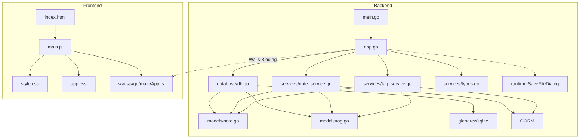

# Jot 项目分析报告

> 生成日期: 2026-06-04
> 项目类型: 桌面端卡片式笔记应用（类小米笔记）
> 技术栈: Wails v2 + Go + GORM + SQLite + 原生 HTML/CSS/JS

---

## 一、目录结构梳理

```
jot/                                    # 项目根目录
├── main.go                             # 【入口文件】Wails 应用启动入口，配置窗口/资源/绑定
├── app.go                              # 【核心文件】Wails 绑定层，暴露 25 个 Go API 给前端
├── go.mod                              # Go 模块定义，声明依赖版本
├── go.sum                              # Go 依赖锁文件
├── wails.json                          # Wails 项目配置（名称/构建脚本/作者）
├── AGENTS.md                           # 本报告文件
│
├── internal/                           # 【内部包】Go 子包统一目录
│   ├── database/
│   │   └── db.go                       # SQLite 初始化（glebarez/sqlite 纯 Go 驱动）
│   ├── fontutil/
│   │   └── fonts_windows.go           # EnumFontFamiliesW API 封装
│   ├── models/
│   │   ├── note.go                     # Note 实体（笔记）
│   │   ├── tag.go                      # Tag 实体（标签）
│   │   └── setting.go                  # Setting 实体（KV 配置）
│   └── services/
│       ├── note_service.go             # 笔记 CRUD + 搜索 + 置顶 + 回收站 + 统计 + 导入导出
│       ├── tag_service.go              # 标签管理 + 笔记标签关联 + 标签计数
│       ├── setting_service.go          # 配置读写
│       └── types.go                    # 通用类型（PaginatedResult, DataStats, ImportResult 等）
│
├── frontend/                           # 【前端目录】Wails 前端（Vanilla + Vite）
│   ├── index.html                      # 入口 HTML，单栏布局 + 6 个视图
│   ├── package.json                    # 前端依赖（仅 Vite 3.x）
│   ├── src/
│   │   ├── main.js                     # 【核心文件】前端逻辑 ~1650 行
│   │   ├── style.css                   # 组件样式 ~1060 行
│   │   └── app.css                     # 全局样式（reset/布局/滚动条）
│   ├── wailsjs/                        # Wails 自动生成的 JS 绑定
│   │   └── go/main/
│   │       ├── App.js                  # 后端 API 的 JS 封装
│   │       ├── App.d.ts               # TypeScript 类型定义
│   │       └── models.ts              # Go 模型的 TS 类型
│   └── dist/                           # Vite 构建产物（前端编译输出）
│
└── .trae/specs/                        # 项目 Spec 文档目录
    ├── add-card-note-app/              # 初始需求规格
    │   ├── spec.md
    │   ├── tasks.md
    │   └── checklist.md
    ├── add-data-management/            # 数据管理功能规格
    │   ├── spec.md
    │   ├── tasks.md
    │   └── checklist.md
    └── add-font-settings/              # 字体设置功能规格
        ├── spec.md
        ├── tasks.md
        └── checklist.md
```

### 目录规范评价

| 维度 | 评价 |
|------|------|
| **分层清晰度** | 优秀。严格按 `models → services → database → app` 分层，前端后端隔离清晰 |
| **命名规范** | 良好。目录名使用复数形式（models/services），符合 Go 社区惯例 |
| **冗余目录** | 无。每个目录职责单一，无多余层级 |
| **待改进** | frontend/dist 为构建产物，应加入 .gitignore |

---

## 二、核心功能模块识别

### 2.1 基础支撑模块

| 模块名称 | 核心功能 | 对应文件 | 核心依赖 |
|----------|----------|----------|----------|
| **数据库初始化模块** | SQLite 连接建立、连接池配置、AutoMigrate | `database/db.go` | glebarez/sqlite, GORM |
| **数据模型层** | Note/Tag/Setting 实体定义、GORM tag 映射 | `models/note.go`, `models/tag.go`, `models/setting.go` | GORM |
| **通用类型** | 分页返回格式、统计数据、导入导出结构 | `services/types.go` | 无外部依赖 |
| **Wails 绑定层** | Go API → JS Bridge，含 runtime.SaveFileDialog | `app.go` | Wails v2 binding + runtime |
| **前端构建** | Vite 打包、Wails dev 热重载 | `frontend/package.json`, `wails.json` | Vite 3.x |
| **字体枚举** | Windows GDI EnumFontFamiliesW 系统字体枚举 | `fontutil/fonts_windows.go` | gdi32.dll / user32.dll (syscall) |
| **配置存储** | KV 结构配置读写（字体偏好等） | `services/setting_service.go` | GORM |

### 2.2 业务核心模块

| 模块名称 | 核心功能 | 对应代码 | 核心输入 | 核心输出 |
|----------|----------|----------|----------|----------|
| **笔记 CRUD** | 创建/更新/查询/删除笔记 | `services/note_service.go` | 标题/内容/颜色/ID | Note 对象/错误 |
| **笔记搜索** | 标题+内容 LIKE 模糊搜索 | `note_service.go:Search()` | 关键词/分页参数 | 笔记列表+总数 |
| **笔记置顶** | 切换置顶状态 | `note_service.go:TogglePin()` | 笔记 ID | 更新后的笔记 |
| **回收站** | 软删除/查看/恢复/永久删除 | `note_service.go:Delete/GetTrash/Restore/PermanentDelete` | 笔记 ID | 操作结果 |
| **批量回收站操作** | 全部恢复/全部清空 | `note_service.go:RestoreAll/EmptyTrash` | — | 操作结果 |
| **标签管理** | 标签 CRUD | `services/tag_service.go` | 名称/颜色/ID | Tag 对象 |
| **笔记标签关联** | 为笔记添加/移除标签 | `tag_service.go:AddTagToNote/RemoveTagFromNote` | 笔记ID+标签ID | 操作结果 |
| **按标签筛选** | 通过标签 ID 查询笔记 | `note_service.go:GetByTag()` | 标签ID/分页参数 | 笔记列表+总数 |
| **数据统计** | 统计笔记总数/回收站数/标签数 | `note_service.go:GetStats()` + `tag_service.go:Count()` | — | DataStats 对象 |
| **数据导出** | JSON 格式导出所有笔记 | `note_service.go:ExportAll()` + `app.go:ExportDataWithDialog()` | — | JSON 文件（通过 SaveDialog）|
| **数据导入** | 从 JSON 文件导入笔记（跳过同名） | `note_service.go:ImportFromJSON()` | JSON 字节数组 | ImportResult 对象 |
| **前端卡片渲染** | 卡片网格展示 | `frontend/src/main.js` | 笔记数据数组 | DOM 渲染 |
| **前端编辑器** | 笔记编辑模态框（含标签选择/颜色选择） | `frontend/src/main.js` | 笔记数据/用户输入 | 保存/取消 |
| **前端搜索交互** | 输入框 250ms 防抖自动搜索，支持标题/内容/标签 | `frontend/src/main.js` | 关键词 | 搜索结果列表 |
| **前端导航切换** | 网格/搜索/设置/数据管理/回收站视图切换 | `frontend/src/main.js:switchView()` | 视图名称 | 视图 DOM 切换 |
| **前端右键菜单** | 右键弹出菜单（查看/编辑/置顶/删除） | `frontend/src/main.js` | 鼠标事件+笔记ID | 菜单显示/操作 |
| **前端只读查看** | 左击笔记打开只读查看器 | `frontend/src/main.js:openEditor()` | 笔记 ID | 只读查看模态框 |
| **标签搜索** | 点击标签 chip 触发按标签名搜索 | `frontend/src/main.js:searchByTag()` | 标签名 | 搜索结果列表 |
| **键盘快捷键** | Ctrl+F 搜索 / Ctrl+N 新建 / PgUp/PgDn 滚动 / Ctrl+Home/End | `frontend/src/main.js:handleKeyboardNavigation()` | 键盘事件 | 对应操作 |
| **字体设置** | 字体族下拉选择（搜索+键盘导航）+ 字体大小预设/自定义 | `frontend/src/main.js:loadFontSettings/applyFontFamily/applyFontSize` | 字体名称/大小 | 更新 CSS 变量 |

### 2.3 模块分层图

```
┌─────────────────────────────────────────────────────┐
│                    Frontend                          │
│  (main.js / style.css / index.html)                  │
│   ├─ 视图渲染 (卡片/搜索/设置/数据管理/回收站)          │
│   ├─ 交互逻辑 (事件绑定/状态管理)                      │
│   └─ Wails Bridge (window.go.main.App.*)              │
└────────────────────────┬────────────────────────────┘
                         │ Wails Binding (JSON 序列化)
┌────────────────────────▼────────────────────────────┐
│              App 层 (app.go)                         │
│  22 个绑定方法（CRUD/搜索/置顶/回收站/统计/导入导出）    │
│  (含 runtime.SaveFileDialog 原生对话框调用)            │
└────────────────────────┬────────────────────────────┘
                         │
              ┌──────────┼──────────┐
              ▼          ▼          ▼
    ┌─────────────┐ ┌──────────┐ ┌──────────────┐
    │ NoteService │ │TagService│ │    Types     │
    │ (CRUD/搜索/ │ │(CRUD/关联)│ │ Paginated    │
    │  置顶/回收站 │ │          │ │ DataStats    │
    │  统计/导入   │ │          │ │ Import       │
    │  导出)      │ │          │ │ Result 等    │
    └──────┬──────┘ └─────┬────┘ └──────────────┘
           │              │
           └──────┬───────┘
                  ▼
        ┌─────────────────┐
        │    GORM ORM     │
        │ (数据访问层)      │
        └────────┬────────┘
                 ▼
        ┌─────────────────┐
        │    SQLite       │
        │ (glebarez/sqlite│
        │  纯 Go 驱动)    │
        └─────────────────┘
```

---

## 三、模块间依赖关系分析

### 3.1 依赖关系详表

| 依赖方 | 被依赖方 | 依赖类型 | 依赖详情 |
|--------|----------|----------|----------|
| `app.go` | `database` | 编译依赖 | 调用 `database.InitDB()` 获取 `*gorm.DB` 实例 |
| `app.go` | `services` | 编译依赖 | 创建 `NoteService` / `TagService` / `SettingService` 实例 |
| `app.go` | `models` | 编译依赖 | 返回 `*models.Note` / `*models.Tag` / `*models.Setting` 类型 |
| `app.go` | `runtime` | 编译依赖 | `runtime.SaveFileDialog` 原生保存对话框 |
| `app.go` | `fontutil` | 编译依赖 | `fontutil.GetFonts()` 枚举系统字体 |
| `services` | `models` | 编译依赖 | 操作 Note/Tag/Setting 结构体 |
| `services` | GORM | 编译依赖 | `*gorm.DB` 数据库操作 |
| `database` | `models` | 编译依赖 | `AutoMigrate(&models.Note{}, &models.Tag{}, &models.Setting{})` |
| `database` | glebarez/sqlite | 编译依赖 | 纯 Go SQLite 驱动 |
| `fontutil` | gdi32/user32 | 运行时依赖 | syscall 调用 Windows GDI API |
| `frontend/main.js` | `wailsjs/go/main/App.js` | 运行时调用 | `window.go.main.App.*` 调用后端 API |
| `frontend/wailsjs` | `app.go` | 构建时生成 | `wails generate module` 自动生成 |

### 3.2 依赖关系图（Mermaid）



### 3.3 依赖问题分析

| 问题类型 | 描述 | 严重程度 |
|----------|------|----------|
| **循环依赖** | 无。所有依赖为单向 `main → app → services → models`，无循环 | ✅ 无问题 |
| **过度依赖** | 无。每个 Service 仅依赖 `*gorm.DB` 和自身模型 | ✅ 无问题 |
| **依赖缺失** | 无。`go.sum` 中所有传递依赖完整 | ✅ 无问题 |
| **隐式依赖** | 前端 `window.go` 对象依赖 Wails 运行时注入，本地开发/独立预览时不可用 | ⚠️ 有降级处理（Mock 数据） |
| **编译期依赖 vs 运行时依赖** | `wailsjs/` 目录需在修改 `app.go` 后重新生成 | ⚠️ 需手动执行 `wails generate module` |

---

## 四、设计模式与实现逻辑

### 4.1 设计模式识别

| 模式名称 | 应用位置 | 说明 | 代码示例 |
|----------|----------|------|----------|
| **Service Layer 模式** | `services/` 包 | 将业务逻辑从 controller（app.go）中抽离，封装为独立 Service 结构体 | `NoteService` / `TagService` |
| **依赖注入 (DI)** | `app.go` | Service 依赖的 `*gorm.DB` 通过构造函数注入 | `NewNoteService(db)` / `NewTagService(db)` |
| **Repository 模式** | `services/` 包内嵌 GORM | Service 内部直接使用 GORM 作为数据访问层 | `s.db.Create()` / `s.db.Where()` |
| **单例模式 (应用级)** | App 结构体 | Wails 运行时保证 App 实例唯一 | `NewApp()` 在 `main()` 中仅调用一次 |
| **MVC 变体** | 整体架构 | Model(models) - View(frontend) - Controller(app.go + services) 分层 | 见分层图 |
| **降级策略 (Fallback)** | `frontend/main.js` | 后端未绑定时自动使用 Mock 数据 | `if (!window.go.main.App.GetNotes) { state.notes = getMockNotes(); }` |
| **Wails Runtime 集成** | `app.go` | 通过 runtime 包调用原生桌面功能 | `runtime.SaveFileDialog()` 弹出系统保存对话框 |

### 4.2 核心业务逻辑流程

#### 4.2.1 笔记创建流程

```
用户点击 "+" 按钮 / Ctrl+N
  → openEditor(null)          // 打开空编辑器模态框
    → 用户填写标题/内容/选择颜色/选择标签
    → 点击"保存"按钮
      → createNote()
        → 前端校验（标题不为空）
        → window.go.main.App.CreateNote(title, content, color)
          → app.go:CreateNote()
            → noteService.Create()          // GORM db.Create(&note)
            → 返回 *models.Note（含 id）
          → 遍历 selectedTags
            → window.go.main.App.AddTagToNote(note.id, tagId)
              → tagService.AddTagToNote()   // GORM Association("Tags").Append
        → closeEditor()                     // 关闭模态框
        → loadNotes()                       // 重新加载笔记列表
          → GetNotes(1, 100)                // 分页查询
          → renderCardGrid()                // 渲染右侧卡片网格
```

#### 4.2.2 笔记搜索流程

```
Ctrl+F / 用户点击搜索框 → 输入框聚焦
用户在搜索框输入文字 → 250ms 防抖
  → searchNotes(keyword, 'input')
    → 前端调用 SearchNotes(kw, 1, 100)
      → app.go:SearchNotes()
        → noteService.Search(keyword, page, pageSize)
          → GORM: WHERE title LIKE '%kw%' OR content LIKE '%kw%'
                 AND deleted_at IS NULL
          → ORDER BY pinned DESC, updated_at DESC
          → Preload("Tags")
          → 返回 []Note + total
    → 接收 PaginatedResult.Items
    → renderSearchResults(results, keyword)
      → 关键词高亮 (highlightText)
      → 渲染搜索结果列表（含可点击标签）
    → switchView('search')                  // 切换到搜索列表视图

清空搜索框 → 返回网格视图

点击标签 chip → searchByTag(tagName)
  → 设置搜索框值 → searchNotes(tagName, 'tag')
```

#### 4.2.3 笔记查看与右键菜单流程

```
左击笔记卡片/搜索结果
  → window.viewNote(id)
    → openEditor(id, true)
      → 标题输入框 readonly
      → 内容文本域 readonly
      → 标签仅展示（不可切换）
      → 隐藏"保存"/"取消"按钮
      → 标题显示"查看笔记"

右键笔记卡片/搜索结果
  → window.showContextMenu(event, noteId)
    → 阻止默认右键菜单
    → 定位菜单到鼠标位置
    → 菜单项：查看 / 编辑 / 置顶(取消置顶) / 删除
  → 点击菜单项 → window.handleContextAction(action)
    → 'view': 打开只读查看
    → 'edit': 打开编辑器(编辑模式)
    → 'pin': 切换置顶
    → 'delete': 确认后删除
  → 点击页面其他区域 → 关闭菜单
```

#### 4.2.4 笔记软删除与回收站流程

```
用户点击卡片上的 "✕" 删除按钮
  → confirm("确定要删除这条笔记吗？")
    → [确认]
      → deleteNote(id)
        → window.go.main.App.DeleteNote(id)
          → app.go:DeleteNote()
            → noteService.Delete(id)
              → GORM: db.Delete(&Note{}, id)    // 设置 deleted_at 时间戳
        → loadNotes()                           // 刷新列表
    → [取消] 无操作

用户进入回收站（通过顶部 ☰ → 回收站）
  → switchView('trash')
    → loadTrashNotes()
      → GetTrashNotes(1, 100)
        → GORM: Unscoped().Where("deleted_at IS NOT NULL")
  → 渲染回收站列表（含"全部恢复"和"全部清空"按钮）
    → 恢复单个: RestoreNote(id) → GORM: Update("deleted_at", nil)
    → 永久删除单个: PermanentDeleteNote(id) → GORM: Unscoped().Delete()
    → 全部恢复: RestoreAll() → GORM: Update 所有回收站笔记
    → 全部清空: EmptyTrash() → GORM: Unscoped().Delete 所有回收站笔记
```

#### 4.2.5 数据导出流程

```
用户进入数据管理页面（通过顶部 ☰ → 数据管理）
  → loadDataStats()
    → GetDataStats()
      → noteService.GetStats() + tagService.Count()
    → 渲染统计卡片（笔记总数/标签总数/回收站数）

用户点击「导出数据」
  → window.go.main.App.ExportDataWithDialog()
    → app.go:ExportDataWithDialog()
      → noteService.ExportAll()
        → 查询所有未删除笔记并组装 JSON
      → runtime.SaveFileDialog()              // 弹出原生保存对话框
      → os.WriteFile(path, jsonData, 0644)    // 写入用户选择路径
    → 返回 "导出成功：/path/to/file.json"
```

#### 4.2.6 数据导入流程

```
用户点击「导入数据」
  → 前端 <input type="file"> 弹出文件选择器
  → 选择 .json 文件后读取内容
  → window.go.main.App.ImportData(jsonString)
    → app.go:ImportData()
      → noteService.ImportFromJSON([]byte)
        → json.Unmarshal([]ExportNoteItem)
        → 遍历每个条目:
          → 检查标题为空? → fail++
          → 检查同名笔记已存在? → skip++
          → db.Create(&note) 失败? → fail++
          → 处理标签：查找或创建后关联
          → success++
    → 返回 ImportResult{success, fail, skipped, message}
  → showImportResult()
    → 显示 "导入完成：成功 X 条，跳过 Y 条（已存在），失败 Z 条"
```

### 4.3 代码质量分析

| 维度 | 评价 | 具体表现 |
|------|------|----------|
| **命名规范** | 良好 | Go 使用 CamelCase（`NoteService`、`GetAll`），JS 使用 camelCase + snake_case（`loadNotes`, `created_at`），CSS 使用 kebab-case（`note-card`, `search-box`） |
| **注释覆盖** | 良好 | 所有公开方法和关键函数均有 `//` 行注释说明，JS 函数有 JSDoc 风格注释 |
| **硬编码** | 轻量 | 数据库路径 `data/jot.db` 硬编码在 `app.go:NewApp()`；Mock 数据硬编码在 JS 中 |
| **冗余代码** | 无 | 无明显重复代码，Service 间职责分离清晰 |
| **错误处理** | 中等 | Go 层完整处理 GORM 错误（ErrRecordNotFound），JS 层有 try/catch 包裹后端调用；前端有导入结果 Toast 提示 |
| **安全性** | 基础 | Go 层使用了参数化查询（GORM 防 SQL 注入），JS 层有 `escapeHtml()` 防 XSS；但无输入长度/格式校验 |

---

## 五、技术栈评估

### 5.1 技术栈清单

| 层级 | 技术组件 | 版本 | 用途 | 社区活跃度 |
|------|----------|------|------|------------|
| **桌面框架** | Wails v2 | v2.12.0 | 跨平台桌面应用框架（Go 后端 + 原生 WebView） | 🟢 活跃，Wails 社区增长迅速 |
| **后端语言** | Go | 1.26.1 | 编译型，高性能，跨平台 | 🟢 主流 |
| **ORM** | GORM | v1.31.1 | Go ORM 库，数据库操作抽象 | 🟢 活跃，Star 37k+ |
| **SQLite 驱动** | glebarez/sqlite | v1.11.0 | 纯 Go SQLite 驱动（免 cgo） | 🟢 活跃，纯 Go 实现 |
| **底层 SQLite** | modernc.org/sqlite | v1.23.1 | CGo-free SQLite 实现 | 🟢 活跃 |
| **前端构建** | Vite | v3.2.11 | 前端构建工具 | 🟡 较老版本（v3 已 EOL，建议 v5/v6） |
| **前端技术** | 原生 HTML/CSS/JS | — | 无框架依赖 | 🟢 稳定 |

### 5.2 技术栈选型评价

| 选型 | 评价 |
|------|------|
| **Wails v2** | ✅ 适合小型桌面应用。相比之下 Electron 更重（>100MB），Wails 打包体积小（<10MB），内存占用低 |
| **Go + GORM** | ✅ 适合本项目的 CRUD 密集型场景，GORM 降低 SQL 编写量 |
| **glebarez/sqlite** | ✅ 纯 Go 实现，免 CGO 编译。解决了 Windows 下 CGO 交叉编译的痛点 |
| **原生 HTML/CSS/JS** | ✅ 适合小项目，无需引入 React/Vue 等框架的打包体积和学习成本 |
| **Vite 3.x** | ⚠️ 版本较旧（v3）。Wails 默认模板锁定 v3，升级需手动修改。v3 已停止维护 |

### 5.3 版本兼容性问题

| 问题 | 描述 |
|------|------|
| GORM v1.31 vs Go 1.26 | ✅ 兼容。GORM v1.31.1 支持 Go 1.23+ |
| glebarez/sqlite v1.11 vs modernc.org/sqlite v1.23 | ✅ 兼容，glebarez 为 modernc 的上层封装 |
| Wails v2.12 vs Go 1.26 | ✅ 兼容，Wails v2.12 支持 Go 1.21+ |
| Vite 3.x vs Node 版本 | ⚠️ 需确认开发环境的 Node.js 版本是否在 Vite 3 支持范围内 |

---

## 六、补充分析

### 6.1 扩展性评估

| 维度 | 评价 |
|------|------|
| **新增数据模型** | 容易。在 `models/` 新建文件，`database/db.go` 中追加 `AutoMigrate`，新增对应 Service |
| **新增 API 接口** | 容易。在对应 Service 新增方法，`app.go` 新增绑定方法，前端 `main.js` 新增调用函数 |
| **前端新增视图** | 容易。在 `index.html` 新增 `div.view`，`main.js` 中 `switchView()` 添加分支 |
| **替换数据库** | 中等。改驱动 + 适配 SQL 方言，Service 层使用 GORM 可降低迁移成本 |
| **UI 框架集成** | 容易。原生 HTML/JS，可逐步引入 Vue/React |

### 6.2 性能关键点

| 关注点 | 描述 | 影响 |
|--------|------|------|
| **SQLite 单连接** | `SetMaxOpenConns(1)` | ✅ SQLite 本身不支持并发写入，限制为 1 是正确做法 |
| **N+1 查询** | `Preload("Tags")` 确保了预加载 | ✅ 避免了遍历笔记时逐个查询标签 |
| **LIKE 搜索** | `LIKE '%keyword%'` 无法利用索引 | ⚠️ 大数据量（>10万条）时性能下降，建议引入全文检索（FTS5） |
| **全量加载** | `GetNotes(1, 100)` 固定每次加载 100 条 | ⚠️ 笔记数量大时分页效率降低，建议前端实现滚动加载/无限滚动 |
| **前端 DOM 操作** | 每次 `loadNotes()` 全量重新渲染所有卡片 | ⚠️ 笔记数量>500时可能有卡顿，建议虚拟滚动或增量更新 |

### 6.3 异常处理分析

| 层级 | 处理方式 | 不足 |
|------|----------|------|
| **Go Service 层** | GORM 错误处理完整（ErrRecordNotFound），返回 `error` | 缺少自定义错误类型，错误信息不够结构化 |
| **Go App 层** | 透传 Service 层 error 到 Wails；导出使用 runtime.SaveFileDialog | 无额外的错误包装/日志记录 |
| **JS 前端** | `try/catch` 包裹后端调用，console.error 输出；导入结果有 Toast 显示 | 其他场景仍缺少用户可见的错误提示 |
| **数据库初始化** | Panic 策略（InitDB 失败直接 panic） | ✅ 数据库不可用是致命错误，panic 合理 |

### 6.4 安全分析

| 维度 | 状态 | 说明 |
|------|------|------|
| **SQL 注入** | ✅ 安全 | 全部使用 GORM 参数化查询或 `?` 占位符 |
| **XSS** | ✅ 防护 | `escapeHtml()` 对用户输入做 HTML 转义后渲染 |
| **文件路径** | ✅ 安全 | 数据库路径硬编码 `data/jot.db`；导出路径由 `runtime.SaveFileDialog` 提供 |
| **输入校验** | ⚠️ 基础 | 仅检查空标题，无长度/格式限制 |

---

## 七、项目核心特点

1. **轻量架构**：原生 WebView（Wails）+ 纯 Go 后端，构建产物小、内存占用低
2. **免 CGO 编译**：glebarez/sqlite 纯 Go 实现，Windows 交叉编译无障碍
3. **Service Layer 分离**：业务逻辑与界面绑定完全解耦，便于测试和扩展
4. **前后端松耦合**：前端通过 Wails Binding 调用后端，无直接依赖
5. **降级友好**：前端内置 Mock 数据，后端未绑定时仍可独立预览 UI
6. **组件化渲染**：前端渲染函数独立，数据驱动 DOM 更新
7. **原生桌面体验**：通过 Wails runtime 集成系统保存对话框（SaveFileDialog）
8. **键盘驱动**：支持 Ctrl+F/Ctrl+N/PgUp/PgDn/Ctrl+Home/Ctrl+End 及数字键 1-4 快捷导航

---

## 八、待优化点

### 优先优化
1. **滚动加载**：笔记列表改为滚动加载/分页，避免全量渲染
2. **Vite 升级**：Vite 3 → Vite 5/6，获取更好的构建性能和生态支持

### 中期优化
4. **全文搜索**：引入 SQLite FTS5，替代 `LIKE %keyword%` 模糊搜索
5. **主题切换**：支持暗色模式

### 架构层面
6. **前端框架**（可选）：若功能持续增长，可引入 Vue/React 管理复杂状态
7. **单元测试**：补充 Service 层的 `_test.go` 测试文件
8. **配置外部化**：数据库路径、窗口大小等配置从硬编码改为配置文件

---

## 九、关键记忆点

| 记忆点 | 内容 |
|--------|------|
| **项目名** | Jot（卡片式笔记桌面应用） |
| **技术栈** | Wails v2 + Go 1.26 + GORM v1.31 + glebarez/sqlite + 原生 HTML/CSS/JS |
| **数据库** | SQLite（`data/jot.db`），免 CGO 纯 Go 驱动 |
| **后端结构** | `main.go → app.go → services/ → models/` + `database/` + `fontutil/` |
| **绑定方法数** | 29 个（14 个 Note 相关 + 6 个 Tag 相关 + 2 个数据管理 + 3 个字体设置 + 4 个排序/分页设置）|
| **前端视图** | 6 个：卡片网格、编辑器（模态框）、搜索结果、设置、数据管理、回收站 |
| **前端代码量** | ~1650 行 JS + ~1060 行 CSS + 46 行 CSS 全局样式 |
| **数据流向** | 用户操作 → JS 事件 → Wails Bridge → app.go → Service → GORM → SQLite |
| **核心字段** | Note: id/title/content/color/pinned/created_at/updated_at/deleted_at/tags |
| **接口风格** | RESTful 风格方法命名（CRUD + Search + Toggle + GetTrash + Restore + Stats + Export/Import）|
| **排序规则** | `pinned DESC, updated_at DESC`（置顶优先，最新在前） |
| **交互特点** | 左击查看（只读），右击菜单（查看/编辑/置顶/删除），输入框 250ms 防抖自动搜索，标签 chip 可点击搜索，Ctrl+F 聚焦搜索，Ctrl+N 新建笔记 |
| **卡片操作** | 右上角 hover 只显示置顶按钮，编辑/删除移至右键菜单（纯文字无图标） |
| **布局** | topbar（品牌/搜索框/新建/+更多菜单），主内容区（卡片网格/搜索/设置/数据管理/回收站视图）；设置/数据管理/回收站页面的 view-header 结构统一（`← 返回` + 居中标题 + view-controls），内容区均设置 `max-width` + `margin: 0 auto` 居中 |
| **键盘快捷键** | Ctrl+F 搜索 / Ctrl+N 新建 / PgUp 上翻 / PgDn 下翻 / Ctrl+Home 顶部 / Ctrl+End 底部 / 数字键 1=首页 2=设置 3=数据管理 4=回收站 |
| **回收站** | 通过顶部 ☰ → 回收站 进入，支持全部恢复/全部清空 |
| **数据管理** | 通过顶部 ☰ → 数据管理 进入，含统计卡片 + JSON 导入导出（使用原生保存对话框）|
| **导出** | `ExportDataWithDialog()` 调用 `runtime.SaveFileDialog`，用户选择保存位置 |
| **导入** | 前端 `<input type="file">` 选择 JSON，后端 `ImportFromJSON` 解析并跳过同名笔记 |
| **Mock 数据** | `getMockNotes()` 3 条示例笔记，`getMockTags()` 3 个标签；通过 `mockNotes` 可变变量持久化修改 |
| **右键菜单** | 纯文字无图标，`min-width: 120px` |
| **更多菜单** | 含设置/数据管理/回收站三个选项，`min-width: 120px` |
| **Spec 位置** | `.trae/specs/add-card-note-app/`、`.trae/specs/add-data-management/`、`.trae/specs/add-font-settings/` |
| **字体设置** | 设置页面新增「字体设置」分区，字体族下拉（搜索+↑↓/Enter/Escape 键盘导航）+ 大小预设/自定义 |
| **字体枚举** | `fontutil/fonts_windows.go` 使用 Win32 GDI EnumFontFamiliesW API 直接枚举，不依赖第三方库 |
| **配置存储** | `models/setting.go` KV 结构，`services/setting_service.go` Get/Set 读写 |
| **CSS rem 适配** | 所有 font-size 已从 px 转为 rem，通过 `--font-size-base` CSS 变量控制等比缩放 |
| **view-header 统一** | 设置/数据管理/回收站三个功能页的 view-header 均为 `← 返回` + 居中标题 + `view-controls` 结构，保证标题位置一致 |
| **内容区居中** | 设置页 `settings-content` 为 `max-width: 600px` + 居中；数据管理 `data-content` 和回收站 `trash-list` 为 `max-width: 680px` + 居中 |
| **数字键导航** | 键盘快捷键扩展：`1`=首页(清空搜索)、`2`=设置、`3`=数据管理、`4`=回收站；输入框内不触发 |
| **排序设置** | 设置页「笔记排序」支持按更新时间/创建时间/名称排序，持久化到 Setting `sort_order`；后端 `GetAll`/`GetByTag` 动态构建 ORDER BY |
| **分页大小** | 设置页 iOS 风格分段控件：20/40/60/80/100，选中色块带滑动动画，默认 20，持久化到 Setting `page_size` |
| **懒加载** | 所有场景（启动/CRUD）只加载第 1 页，滚动到底部（<200px）自动追加下一页；底部显示「共 X 条笔记」|

---

> **报告结束** | 已完成项目记忆更新（2026-06-04），后续可基于此报告回答项目相关问题。
