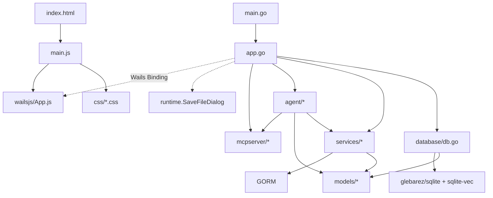

# Jot 项目分析报告

> 项目类型: 桌面端「会思考的卡片笔记」应用（类小米笔记，Wails v2 跨平台桌面应用）
> 技术栈: Go + Wails v2 + GORM + SQLite（纯 Go 驱动，无 CGO）+ 原生 HTML/CSS/JS + CodeMirror 6（编辑器）+ eino（CloudWeGo，OpenAI 兼容 AI 驱动）+ sqlite-vec（本地向量召回）
> 数据存储: 本地 `~/.jot/`（data/backup/images/logs/mcp/workspace 六子目录）
> 仓库: gitee.com/MM-Q/jot（MIT License）
> 说明: 旧版完整历史（含 47 条详细技术记忆点）已归档至 `.trae/documents/AGENTS-archive-2026-09-17.md`

---

## 一、目录结构梳理

```
jot/                                    # 项目根目录
├── main.go                             # 【入口】Wails 应用启动：窗口配置/资源嵌入/API 绑定/主题背景色
├── app.go                              # 【核心】Wails 绑定层，暴露 95+ 个 Go API 给前端（CRUD/AI/审批/导入导出/路径）
├── go.mod / go.sum                     # Go 模块定义与依赖锁文件
├── wails.json                          # Wails 项目配置
├── AGENTS.md                           # 本报告文件
│
├── internal/                           # 【内部包】Go 子包统一目录
│   ├── agent/                          # Agent 执行引擎（ReAct 循环 + 工具注册 + 显式规划 + ask_user + 审批机制）
│   │   ├── agent.go / registry.go / types.go  # ReAct 循环 / 工具注册表 / 类型定义
│   │   ├── approval_test.go / session_test.go / mcp_pool_test.go  # 测试
│   │   ├── TOOLS.md / EVENTS.md / doc.go         # 工具开发 / 事件协议 / 包文档
│   │   └── tools/                        # 内置工具实现（一文件一工具）
│   ├── aierrors/                       # AI 错误分类（11 类，签名含 {category,user_msg,raw}）
│   ├── config/                         # 路径工具（JotHomeDir/SubDir/WorkspaceDir/WorkspaceFilePath 沙箱校验）
│   ├── converter/                      # doc2md 封装：办公文件转 Markdown（7 格式 + 60s 超时）
│   ├── einocli/                        # eino 薄适配层（chat/embedding/types，OpenAI 兼容客户端）
│   ├── database/                       # SQLite 初始化 + AutoMigrate + 种子数据（内置服务商/MCP/提示词）+ WAL PRAGMA + 孤儿列清理
│   ├── fontutil/                       # 跨平台系统字体枚举（Windows GDI/Linux/Darwin/fc）
│   ├── mcpserver/                      # MCP 客户端（官方 modelcontextprotocol/go-sdk）+ 连接池预热 + 自动重连
│   ├── models/                         # GORM 实体层（Note/Tag/Notebook/Setting/PasswordRecord/Todo/NoteVector/AISession/AISessionConfig/AIMessage/AIPrompt/APIProfile/MCPServer/AIMemory）
│   └── services/                       # 业务服务层（note/notebook/tag/setting/ai/ai_context/todo/password/profile/stats/log/vector/chunk/recall/mcp_server/crypto/memory）
│
├── frontend/                           # 【前端目录】Vanilla JS + Vite
│   ├── index.html                      # 入口 HTML，多视图 + 各类浮层
│   ├── package.json                    # Vite 3.x + CM6 ~16 包 + marked + highlight.js + mermaid + pinyin-pro
│   ├── src/
│   │   ├── main.js                     # 【核心】前端逻辑（CM6 集成/搜索/AI 对话/设置/主题/快捷键/审批）
│   │   ├── js/                         # JS 模块（ai-chat/constants/notification/launcher/password-manager/calendar/editor-actions/preview-worker/theme-config/data-management/trash-page）
│   │   └── css/                        # 模块化 CSS（variables/reset/scrollbar/animations/index + components/*）
│   ├── wailsjs/                        # Wails 自动生成 JS 绑定（App.js/App.d.ts/models.ts）
│   └── dist/                           # Vite 构建产物（.gitignore）
│
├── build/                              # Wails 构建资源（windows/darwin 打包）
├── playground/                         # 各类 PoC/独立 demo（agent-demo/vec-poc/mcp-* 等，非交付）
├── tools/seed/                         # 种子数据工具
└── .trae/                              # Trae 项目文档目录
    ├── plans/ · specs/                 # 特性规划与实现 Spec（大量增量开发记录）
    └── documents/                      # 规则/方案/评审文档 + 本报告归档
```

### 目录规范评价

| 维度 | 评价 |
|------|------|
| 分层清晰度 | 优秀。严格 `models → services → database → app.go` 分层，前后端经 Wails Binding 隔离 |
| 命名规范 | 良好。Go 子包用复数（models/services），前端 CSS/JS 模块化均遵循项目自定义规范 |
| 冗余目录 | 基本无。`playground/` 为非交付 PoC，职责独立 |
| 待改进 | ① `app.go` 单文件 95+ 绑定方法偏大，可按域（note/ai/password）进一步拆分 Service 绑定；② `frontend/src/main.js` 仍承载核心逻辑，部分已抽模块，可继续拆分 |

---

## 二、核心功能模块识别

### 2.1 基础支撑模块

| 模块 | 核心功能 | 对应文件 | 核心依赖 |
|------|----------|----------|----------|
| 数据库初始化 | SQLite 连接、AutoMigrate、WAL PRAGMA、blank import 注册 sqlite-vec、孤儿列清理 | `database/db.go` | glebarez/sqlite, GORM, modernc.org/sqlite/vec |
| 数据模型层 | 全部实体定义 + GORM tag 映射 | `models/*.go` + `database/models.go`（AllModels 注册表） | GORM |
| 通用类型 | 分页/统计/导入导出结构 | `services/types.go` | 无 |
| Wails 绑定层 | Go API → JS Bridge（95+ 方法） | `app.go` | Wails v2 binding + runtime |
| 路径工具 | `~/.jot` 六子目录解析 + workspace 沙箱路径校验（EvalSymlinks 防逃逸） | `config/config.go` | os.UserHomeDir |
| 办公文件转换 | doc2md 封装（docx/pdf/xlsx 等 7 格式 + 60s 超时） | `converter/converter.go` | gitee.com/MM-Q/doc2md |
| AI 错误分类 | 11 类中文友好错误（auth/rate_limit/server_error...） | `aierrors/errors.go` | 无 |
| 字体枚举 | 跨平台系统字体枚举 | `fontutil/*` | gdi32/user32 (Windows) 等 |
| 前端构建 | Vite 打包 + Wails dev 热重载 | `frontend/package.json`, `wails.json` | Vite 3.x |
| 统一通知 | NotificationManager 单例（4 类型 + undo） | `frontend/src/js/notification.js` | 无 |

### 2.2 业务核心模块

| 模块 | 核心功能 | 对应代码 | 核心 I/O / 依赖 |
|------|----------|----------|-----------------|
| 笔记管理 | CRUD + 搜索（打分排序）+ 置顶 + 回收站（硬删清理孤儿图片）+ 统计 + 导入导出 | `services/note_service.go` + `app.go` | Note/Tag 表 |
| 笔记本/标签/待办 | 三类基础 CRUD + 关联 | `notebook_service.go`/`tag_service.go`/`todo_service.go` | 对应表 |
| 笔记搜索 | 打分排序（相等>前缀>标题+内容>仅标题>仅内容）+ 多筛选 + 转义防注入 | `note_service.go:Search/buildSearchSortOrder/escapeLike` | Note 索引 idx_notes_* |
| 密码管理 | CRUD（列表/详情分离传输）+ 搜索 + 批量 + Base64 编码 + 生成器 | `password_service.go` + `password-manager.js` | PasswordRecord 表 + zxcvbn |
| 记事日历 | 按月圆点统计 + 按日列表 | `note_service.go:GetByDate/GetMonthCounts` + `calendar.js` | Note（创建时间索引） |
| AI 对话 | eino 驱动流式对话 + 会话/消息持久化 + 上下文压缩 + 三态模式（Chat/Agent/Plan） | `services/ai_service.go` + `einocli/` + `ai-chat.js` | AISession/AIMessage，OpenAI 兼容端点 |
| Agent 引擎 | ReAct 循环 + 16 内置工具 + 显式规划 + ask_user 反问 + 工具级开关 + MCP 工具装配 | `agent/*.go` + `agent/tools/*` | 会话注册表 + 150 语义核心 |
| 向量召回 | 笔记切块向量化 + sqlite-vec 余弦距离检索 + 笔记本过滤 + 相邻块补充 | `vector_service.go` + `chunk.go` + `recall_service.go` | NoteVector 表 + 嵌入模型 |
| 审批机制 | workspace 沙箱文件/命令工具 + 三模式审批门控 + auto 审计留痕 | `agent/tools/fs_base.go` 等 + `agent.go:RequestApproval/recordAutoApproval` | ApprovalMode 字段 + ai:tool-approval 事件 |
| MCP 扩展 | 三传输客户端 + 连接池预热 + 断线重连 + 导入导出 | `mcpserver/*` + `mcp_server_service.go` | go-sdk + MCP 服务器配置表 |
| 全局记忆空间 | 跨会话长期记忆（manage_memory 工具 + AlwaysOn 常驻） | `memory_service.go` + `manage_memory.go` | AIMemory 表 |
| AI 全局消息搜索 | 跨会话检索 + 会话聚类排序 + 消息跳转定位 | `ai_service.go:SearchAIChat` + `ai-chat.js` | AISession/AIMessage |
| 联网搜索/读 URL | MCP 驱动多源搜索 + read_url 分页读取（SSRF 防护） | `read_url.go` + `mcpserver` + `http_request.go` | eino-ext URL Loader + ssrf.go |
| 数据管理 | 统计 + 向量索引 + 批量管理 + 备份还原 + VACUUM 瘦身 + 重置 | `data-management.js` + `app.go` | 多表 + 文件系统 |
| 主题/外观系统 | 11 套主题 CSS 变量 + 14 主题维护文档 + 三源色值同步 + FOUC 兜底 | `variables.css` + `theme-config.js` + `main.go` | CSS 变量 + localStorage |

### 2.3 模块分层图

```
┌───────────────────────────────────────────────────────────┐
│                    Frontend (main.js + css/*.css)          │
│  视图渲染 / 交互逻辑 / Wails Bridge (window.go.main.App.*) │
└──────────────────────────┬────────────────────────────────┘
                           │ Wails Binding (JSON 序列化)
┌──────────────────────────▼────────────────────────────────┐
│                  App 层 (app.go) 95+ 绑定方法              │
└───────┬──────────────┬───────────────┬────────────────────┘
        ▼              ▼               ▼
  Note/Tag/Todo/  AI Service +    Agent 引擎 + MCP 池
  Password/Pw    einocli         (工具/审批)     │
  Service 层      │                 │            │
        │          |                 │            ▼
        ▼          ▼                 ▼        mcpserver
  ┌────────────────────  GORM ORM + database/db.go ──────┐
  │                       SQLite (glebarez 纯 Go 驱动)     │
  │               models v Aut oMigrate + sqlite-vec 扩展   │
  └──────────────────────────────────────────────────────────┘
```

---

## 三、模块间依赖关系分析

### 3.1 依赖关系详表

| 依赖方 | 被依赖方 | 类型 | 详情 |
|--------|----------|----------|------|
| main.go | config/app | 编译 | 获取主题色 + NewApp |
| app.go | database | 编译 | InitDB() → *gorm.DB |
| app.go | services | 编译 | 创建各 Service 实例（DI 注入 db） |
| app.go | agent | 编译 | AgentService + Run + ApproveToolCall 绑定 |
| app.go | mcpserver | 编译 | MCP 池预热/shutdown |
| app.go | runtime/fontutil/converter | 编译 | SaveFileDialog/GetFonts/Convert |
| services | models | 编译 | 访问各类实体结构体 |
| services | GORM | 编译 | *gorm.DB 数据操作 |
| database | models | 编译 | AutoMigrate（models.go AllModels 注册表） |
| agent | services/models/mcpserver | 编译 | AI 加载会话/MCP 工具装配 + 工具实现 |
| frontend | wailsjs(App.js) | 运行时 | window.go.main.App.* 调后端 |
| frontend/wailsjs | app.go | 构建时 | wails generate module 自动生成 |

依赖方向单向：`main → app → services/agent → models → GORM → SQLite`，无循环。

### 3.2 依赖关系图（Mermaid）


```mermaid
graph TD
    M[main.go] --> A[app.go]
    A --> DB[database/db.go]
    A --> S[services/*]
    A --> AG[agent/*]
    A --> MCP[mcpserver/*]
    DB --> MD[models/*]
    S --> MD
    S --> G[GORM]
    AG --> S
    AG --> MD
    AG --> MCP
    DB --> K[glebarez/sqlite + sqlite-vec]
    A -.-> RT[runtime.SaveFileDialog]
    FE[index.html] --> MJ[main.js]
    MJ --> CSS[css/*.css]
    MJ --> WJS[wailsjs/App.js]
    A -.->|Wails Binding| WJS
```

### 3.3 依赖问题分析

| 问题类型 | 描述 | 程度 |
|----------|------|------|
| 循环依赖 | 无，单向分层 | ✅ |
| 过度依赖 | 无 | ✅ |
| 依赖缺失 | go.sum 完整 | ✅ |
| 隐式依赖 | 前端 `window.go` 依赖 Wails 运行时注入，独立预览不可用（有 Mock 降级） | ⚠️ |
| 构建时依赖 | 修改 app.go 后需 `wails generate module` 重生成 wailsjs 绑定 | ⚠️ |
| AI 单元耦合 | app.go 既做 Shell/agent 装配又做 Wails 绑定，逻辑与绑定高度耦合（结构性，CodeReview 关注） | ⚠️ |

---

## 四、设计模式与实现逻辑

### 4.1 设计模式识别

| 模式 | 位置 | 说明 |
|------|------|------|
| Service Layer | `services/` | 业务逻辑从 app.go 抽离封装为独立 Service |
| 依赖注入 (DI) | `app.go` | Service 构造函数注入 *gorm.DB |
| Repository | services 内嵌 GORM | GORM 作数据访问层 |
| 单例 | app.go NewApp / einocli 客户端 | Wails 运行时单实例；AI 会话注册表 LRU cap32 |
| MVC 变体 | 整体 | Model(models) - View(frontend) - Controller(app+services) |
| 观察者/事件驱动 | runtime.EventsEmit ↔ EventsOn | AI 流式事件（chunk/thinking/tool-status/approval/ask-user/done/error）带 streamGen 代际防串流 |
| 降级策略 | frontend | 后端未绑定时 Mock 数据 |
| 门控策略 | agent.go RequestApproval | 三模式审批：`needConfirm := mode==confirm_every \|\| (critical && mode==review)` |
| 连接池 | mcpserver/pool.go | 按名预热复用，指纹变化关旧重连，断线自动重建 |
| 订阅注册表 + LRU | agent session registry | 会话级 askCh/approveCh/runMu 串行化 |

### 4.2 核心业务逻辑流程

#### 4.2.1 Agent 工具审批流程（confirm_every / review 高危）

```
AI ReAct 循环调用 run_command
  → requestApproval(ctx, name, summary, critical)
    → agentSession.RequestApproval 读 ApprovalMode
      → needConfirm?  (confirm_every 全确认 / review 仅 critical)
        → 阻塞 AI 流，emit ai:tool-approval{approval_id,critical}
        → 前端弹确认面板
          → AppendToolCall(sessionID, approvalID, approved)
            → 允许=继续执行；拒绝=工具返回错误文本落 tool_error
  → 执行工具（workspace 沙箱 + 30s 超时 + 有界输出）
```

#### 4.2.2 向量召回流程

```
用户问题 → 上下文构建 → 注入【长期记忆/环境信息】
  → VectorRecall(query, notebookIDs)
    → chunk 语义切块（600 rune + 元数据前缀 + 围栏保护）
    → embed 化 → vec_f32(?) + vec_distance_cosine < 1.0 过滤 + 距离升序 TopN
    → JOIN notes 过滤软删除 → 命中块补相邻块 → 按笔记合并召回卡片
  → FormattedText 注入 system message + Cards 前端展示
```

#### 4.2.3 AI 上下文压缩（token 预算 + 摘要持久化）

```
SelectTailByTokenBudget(预算默认128K，轮次对齐)
  → tail 达 预算×触发比例(0.8) 时 CompactSessionSummary
    → 合并头部旧消息 → 生成新摘要 → 推进 SummaryUpToMsgID 边界
  → 失败即中止本轮（ai:summary-status:failed），重发时自动再触发
```

### 4.3 实现逻辑评价

- **清晰度**：分层与命名高度一致，Service 职责单一，关键 AI/工具逻辑均有权威文档（TOOLS.md/EVENTS.md/AI_CONTEXT.md/theme-maintenance.md）。
- **冗余点**：app.go 过大（95+ 绑定 + shell 装配）；main.js 仍偏大；存在历史 dead code（如已废弃的搜索来源解析字段 `search_sources`，DB 保留但前端置空）。

---

## 五、技术栈评估

### 5.1 技术栈清单

| 层级 | 技术 | 版本 | 用途 |
|------|------|------|------|
| 桌面框架 | Wails v2 | v2.12.0 | 桌面窗口 + Go↔JS Bridge（无边框、DragAndDrop、Frameless） |
| 后端语言 | Go | 1.26.0 | 业务逻辑 |
| 数据库 | SQLite | — | 本地存储 |
| 驱动 | glebarez/sqlite | v1.11.0 | 纯 Go 驱动（无 CGO） |
| 向量检索 | sqlite-vec | modernc.org/sqlite v1.51.0（vec 子包 v0.1.9） | SQL 内余弦距离函数式用法 |
| ORM | GORM | v1.31.1 | 对象关系映射 |
| AI 驱动 | eino (CloudWeGo) | v0.9.13 + eino-ext openai v0.1.13 + acl/openai v0.1.17 | 流式对话/嵌入，OpenAI 兼容端点 |
| OpenAI SDK | meguminnnnnnnnn/go-openai | v0.1.2 | eino 底层调用 |
| MCP | modelcontextprotocol/go-sdk | v1.7.0 | MCP 服务器客户端（stdio/sse/http） |
| 分词/搜索 | gse | v1.0.2 | 中文分词（关键词侧） |
| JSON 提取 | tidwall/gjson | v1.18.0 | Agent json_* 工具 |
| 前端构建 | Vite | v3.2.11 | 打包 |
| 前端技术 | 原生 HTML/CSS/JS | — | 无 UI 框架，纯手写 DOM |
| 编辑器 | CodeMirror 6 | @codemirror/view v6.43.0 | Markdown 编辑器 |
| Markdown | marked | v18.0.5 | Markdown→HTML |
| 代码高亮 | highlight.js | v11.11.1 | 代码块高亮 |
| 图表 | mermaid | v11.x | Mermaid 渲染 |
| 拼音 | pinyin-pro | v3.29.3 | 启动器三路拼音匹配 |
| 自研库 | doc2md / fastlog / go-kit / verman / logrotatex / color / comprx（gitee.com/MM-Q/） | 见 go.mod | 文档转换/日志/工具集/版本/轮转/上色/压缩 |
| 本地存储 | localStorage | — | UI 状态持久化 |
| 任务编排 | rnx (Rnx.toml) | — | 构建/任务/lint 编排 |

### 5.2 技术选型适配性

- **Go + Wails v2 + 原生前端**：契合单机、轻量、无外部依赖场景，编译产物小，符合「小型桌面应用不过度工程」原则。✅ 适配良好
- **纯 Go SQLite + sqlite-vec**：无 CGO 跨平台友好，向量召回本地化，无远程依赖。✅ 契合本地语义检索场景
- **eino 薄适配 + OpenAI 兼容端点**：支持 DeepSeek/智谱等多家服务商，配置预设驱动。已移除 Ollama 原生协议（`remove-*-ollama` spec）。⚠️ 需外网/自定义网关
- **自研 G 库（doc2md 等）抽离为独立库**：单一变更点，冗余降低，可复用可测试。✅ 合理演进
- **Vite v3.2.11 较新版本未升级**：功能满足，非阻塞项。

### 5.3 版本兼容 / 维护状态

| 项 | 说明 |
|----|------|
| Wails 版本锁定 | v2.12.0 需 CLI 与 go.mod、wails.json 三方匹配，升级需同步三处 |
| GORM AutoMigrate | 新增模型必须同步注册进 `database/models.go` 的 AllModels |
| modernc.org/sqlite 升级 | v1.51.0 捆绑 sqlite-vec，升级需回归向量召回测试（测试包需自行 import） |
| AI 端点迁移 | Ollama 原生协议已移除，仅 OpenAI 兼容端点 |
| GORM Order 坑 | `Order(gorm.Expr)` 被静默丢弃，须用 `clause.OrderBy{Expression: clause.Expr{...}}` |

---

## 六、长期记忆

存放项目**长时间稳定**的关键信息，一旦确定便长期保持不变（结构性变化才更新）。

1. **项目定位**：桌面端「会思考的卡片笔记」，本地数据优先，AI Agent + 本地语义检索为差异化核心。
2. **技术选型**：Go + Wails v2 2.12 + GORM 1.31 + SQLite（glebarez 纯 Go 驱动，modernc.org/sqlite v1.51 含 sqlite-vec）；前端纯原生 HTML/CSS/JS + Vite 3 + CM6；AI 用 eino + OpenAI 兼容端点。理由：单机轻量、无 CGO、跨平台、无外部服务依赖。
3. **数据目录**：`~/.jot/` 下 data/backup/images/logs/mcp/workspace 六子目录；DB 默认 `~/.jot/data/jot.db`；AI 无边界执行沙箱即 workspace。
4. **模块边界**：`models → services → database → app.go` 单向分层，无循环依赖；app.go 为 Wails 绑定层（95+ 方法）；前端经 window.go.main.App 调用。
5. **审批门控公式**：`needConfirm := mode=="confirm_every" || (critical && mode=="review")`；三模式 confirm_every（每次确认）/review（常规自动+高危确认，不可绕过）/auto（全自动放行，高危额外 `tool_auto_approval` 审计留痕）。命令行工具用 os/exec 裸命令，不支持 shell 语法。
6. **工作区边界**：文件/命令工具仅允许操作 `~/.jot/workspace/`，`WorkspaceFilePath` 用 EvalSymlinks 解析防 symlink/junction 逃逸；危险命令判定走 `highRiskTokens` 黑名单（基名或参数整词命中，含 `--flag=value` 拆解）。
7. **代码规范**：目录用复数（models/services）；前端 CSS/JS 模块化按 `js/`、`css/components/` 拆分；新增模型必须注册 `database/models.go` AllModels；一文件一工具（tools/ 下命名即文件名）；工具描述与实际实现一致（meta.go 反例教训）。
8. **关键工程约定**：
   - 数据模型注册唯一入口 = `database/models.go` 的 `AllModels`（db.go 建表与 app.go ResetDatabase 共用），多对多表需在 ResetDatabase 显式 DROP。
   - 新增内部滚动型视图必须加 `#viewX.view.active { padding-bottom: 0 }` 双类规则，防「底栏」遮挡。
   - 主题维护以 `frontend/src/css/theme-maintenance.md` 为权威；主题色三源（variables.css/criticalColors/main.go themeBG）必须对齐。
   - AI 事件协议见 `internal/agent/EVENTS.md`，工具开发见 `internal/agent/TOOLS.md`。
   - ESC 快捷键统一收口在 `main.js` 的 `handleKeyboardNavigation`，模块内不单独监听 ESC。
   - 前端 CSS/HTML 改动必须 `npm run build`（+ `wails build` 出二进制）才生效。
   - AI 上下文字段 maxToolLongText=100000（write_file/edit_file/http_request body），与 maxAIMessageChars=20000 相互独立。
   - `ai_card_recall_limit`（笔记数）唯一控制召回总量，无单笔记内容截断。
9. **设计要点**：AI 流式事件全部携带 `streamGen` 代际 ID，前端按代丢弃过期流防串流；工具调用/消息渲染实时与历史回放共用同一渲染函数族，保证「所见即所存」；关键词+向量混合召回，sqlite-vec 函数式余弦距离（非 vec0 虚拟表）。
10. **SQLite/数据库工程约定**：WAL + `busy_timeout=5000` + `synchronous=NORMAL` + `cache_size=-8000`，PRAGMA 失败不中断初始化；notes 建 `idx_notes_sort(pinned,updated_at)`/`idx_notes_notebook_deleted`/`idx_notes_created` 三命名索引，避免默认排序全表 temp 排序；默认排序统一 `pinned DESC, updated_at DESC`。`replaceDatabase()` 需清理 `-wal/-shm` 残留。数据库 model 注册唯一入口 = `database/models.go` 的 `AllModels`（与 db.go 建表、ResetDatabase 共用，多对多表在 ResetDatabase 显式 DROP）。
11. **AI 会话/消息全链路**：AISession+AIMessage 持久化；编辑/删除/重发/再生合并为后端 `ReplaceAISessionMessages`（GORM Transaction 清空+写入原子）；消息懒加载分页（游标 beforeID）；编辑/重发/再生按 msgID 用 `TruncateAISessionAfterMessage` 截断、删除 `DeleteAIMessage`；Token 由后端 `SumSessionTokens`/`GetSessionContextTokens`；`stream-done` 事件 9 参数（含 userMsgID/assistantMsgID）。上下文压缩持久化摘要边界 `SummaryUpToMsgID`，解耦预算/窗口设置变更。
12. **前端竞态防护范式（代际序号）**：所有异步/流式竞态用「代际 ID」丢弃过期结果——AI 流 `streamGen`、编辑器 `editorOpSeq`、预览 Worker `previewRenderSeq`、密码列表 `pmLoadSeq`、斜杠搜索 `slashQuerySeq`、AI 全局搜索 `_aiSearchSeq`；引入新异步交互时应遵循同一范式。配合「懒创建 + 单一定时器（如 toolStatusTimer 防 per-row 泄漏）」。
13. **渲染单一事实源（所见即所存）**：工具调用记录实时与历史回放**共用模块级** `buildToolRecords`/`rebuildToolSummaryHeader`/`buildToolStatusRows`/`updateToolSummary`；消息渲染 `addMessage` 单一路径。修改渲染逻辑必须同步双路径，否则实时一致但回放错乱。
14. **MCP 客户端与连接池**：官方 `modelcontextprotocol/go-sdk v1.7.0`，三传输（stdio/sse/http）+ 协议版本协商（可降级 2024-11-05）；go-sdk transport 无 Headers 字段，鉴权用自定义 `headerRoundTripper` 包装 http.Client；连接生命周期绑定 ctx（`defer cancel()` 会终止 SSE 长连接致 EOF）；池按 Name 预热、per-name in-flight 信号串行化建连防重复拉进程、`serverFingerprint` 指纹变化自动关旧重连、Session 检测连接类错误自动重建一次并重试。
15. **SSRF 三层防护（read_url/http_request 共享 `ssrf.go`）**：① `validateHTTPURL` 仅放行 http/https 公网地址；② `CheckRedirect` 逐跳 `isPrivateHost`（上限 10 次）；③ `guardedDialContext` 拨号期解析全部 IP 逐个校验**直连已校验 IP** 防 DNS rebinding。`Transport` 必须以 `DefaultTransport.Clone()` 为底座（裸构造丢系统代理/HTTP2/TLS）。`isPrivateHost` 含 inet_aton 数值编码归一化 + 裸 IPv6 判漏。
16. **导入/导出图片闭环 & 时间戳规则**：导出 `.md` + 同名 `.assets/` 目录相对引用（保留 uuid 原始文件名）；导入反向复制进 `~/.jot/images/` 改内部 URL（URL 跳过、`/images/` 幂等跳过）；回收站硬删联动清理不再被引用的孤儿图片。导入时间戳对齐文件 `ModTime()` 作同步基准 + SHA256 内容哈希兜底；**导入写库必须用 `CreateWithNotebookAt`/`UpdateWithTime`，禁普通 `Update`/`Save`（GORM 会刷 UpdatedAt 破坏基准）**。
17. **AI System Prompt 三层结构**：`baseIdentity`(身份)/`baseNormsBoundaries`(规范+边界)/`baseSystemPrompt`(全三层)；技能激活仅跳过身份层，规范+边界始终注入；共享提示词末尾注入【环境信息】当前时间 +【长期记忆】段，注入置于尾部利于前缀缓存。时光同步：Chat/Agent 两模式共用 buildAIContextInstruction。
18. **主题/外观一致性**：主题维护以 `frontend/src/css/theme-maintenance.md` 为权威；主题色三源（variables.css/criticalColors/main.go themeBG）必须对齐防启动闪色；`resolveTheme` 纯函数兜底（`hasOwnProperty.call` 防 `__proto__`/`constructor` 原型污染，无效回落 default）；`applyTheme` 保持纯 DOM 同步器、不落库（防覆盖其他设置）。

## 七、临时记忆

存放**近期动态**结论（最多 5 条，编号 5 最新、1 最旧），快速接续上次会话现场。稳定后升级合并进「长期记忆」。

### 临时记忆 5（= 归档「记忆点 5」）
| 记忆点 | 内容 |
| --- | --- |
| **变更概览** | 在记忆点 3/4 审批门控基础上细化三模式行为：**auto（完全访问）不再拦截高危（黑名单命中）操作**——`critical=true` 也自动放行，但写独立审计 `tool_auto_approval`（区别于普通 tool_approval）并发射 `ai:tool-status` 驱动前端渲染独立警示行。原「critical 任何模式都不可绕过」的语义已废除，auto 高危改由「留痕 + 前端警示」兜底而非阻塞。另含写入上限上调、高危判定增强、审批选择器前端细节。 |
| **三模式门控（重要）** | `RequestApproval` 门控公式 `needConfirm := mode=="confirm_every" || (critical && mode=="review")`。confirm_every=每次命令执行阻塞确认；review=普通自动放行、黑名单强制确认（不可绕过）；auto=普通与黑名单**全部自动放行**，其中黑名单命中者额外 `recordAutoApproval`（[agent.go](internal/agent/agent.go)）双写：`appendRecord` 落库 `tool_auto_approval`（Result 标注「完全访问模式自动放行（高危命令，未经人工确认）」）+ `emit("ai:tool-status")` 实时推送（action=tool_auto_approval、action_text=完整命令、result=留痕说明）。非法 mode 回落 confirm_every。auto 与 review 行为不再等价：仅 auto 对黑名单放行并留痕。 |
| **前端渲染（重要）** | 实时 `ai:tool-status` 回调与历史回放 `buildToolRecords` 均识别 `tool_auto_approval`：**升级同名最近 running/pending 记录为 `status:'auto'` 警示行**（含完整命令），无配对时新建 auto 行——避免「警示行+普通进度行」双行重复；`tool_result`/`tool_error` 补行前检测同名最近记录已为 auto 则跳过。`buildToolStatusRows` 对 auto 渲染独立高亮 `.is-auto` 行（行内只显示命令）；悬停卡标题「完全访问自动放行」、正文展示完整命令。CSS 新增 `.ai-mode-tip.anchor-right/.anchor-left`（右/左弹自适应、箭头朝向随倒置、垂直居中，`--tip-arrow-y` 定位）。审批按钮图标随模式切换（`APPROVAL_MODE_ICON`：confirm_every=锁、review=盾牌对勾、auto=盾牌警告），描述文案随模式准确化。 |
| **长度上限与高危判定** | `maxToolLongText` 20000→**100000**（rune），统一影响 `write_file.content`/`edit_file.replace`/`http_request.body`（`maxAIMessageChars`=20000 为另一独立护栏）。高危判定增强：`matchArgTokens` 增加 `--flag=value` 拆「=」前 flag 命中检查（堵 `--force=x`/`--yes=1`）；`commandBaseName` 去后缀补 `.ps1`（与 .exe/.bat/.cmd 一致）。 |
| **审查修复与测试** | 代码审查后修复：① 各文件「critical 不可绕过」过时注释与 auto 放行语义对齐（agent.go/context.go/run_command.go/TOOLS.md）；② 回补 auto_approval 前端过时注释（maxToolLongText 独立于 MAX_AI_INPUT_CHARS）；③ 补 `TestRequestApprovalModeGating`（[approval_test.go](internal/agent/approval_test.go)）断言 `ai:tool-status`(tool_auto_approval) 审计事件发射。验证 `go build/vet/test` + `npm run build` 全绿。 |
| **涉及文件** | [agent.go](internal/agent/agent.go)（门控+recordAutoApproval）、[context.go](internal/agent/tools/context.go)（maxToolLongText）、[run_command.go](internal/agent/tools/run_command.go)（flag=value/.ps1）、[approval_test.go](internal/agent/approval_test.go)、[ai-chat.js](frontend/src/js/ai-chat.js)、[ai-chat.css](frontend/src/css/components/ai-chat.css)（.is-auto/.anchor-*）、[index.html](frontend/index.html)（审批选项描述/图标）、[TOOLS.md](internal/agent/TOOLS.md) |

### 临时记忆 4（= 归档「记忆点 4」）
| 记忆点 | 内容 |
| --- | --- |
| **变更概览** | 在记忆点 3 五工具基础上扩展为**完整文件工具家族**（读→写→改→找→复制→移动→删除→建目录闭环），新增五工具一文件一工具：`grep_file`（字符串+正则双模式、流式有界输出逼近上限提前中断、二进制跳过）、`copy_file`/`move_file`（go-kit `CopyEx`/`MoveEx`：临时文件+rename 原子、覆盖备份恢复、dest 为已存在目录自动追加源基名）、`delete_file`（非空目录必须 `recursive=true`、拒绝删工作区根、critical=true）、`mkdir_dir`（默认仅建单级，父目录不存在引导 `recursive=true`；MkdirAll 递归、已存在幂等）。统一二进制检测（go-kit `IsBinaryFile`，前 8000 字节 NUL）——read_file 跳过、edit_file 审批前拒绝、grep_file 换库删自实现。 |
| **os.Root 试点** | read_file/ls_dir/delete_file 三工具切换 Go 1.24+ `os.Root` 目录句柄（`openRootFor`：os.OpenRoot + filepath.Rel，openat 消 TOCTOU），与 resolvePath（EvalSymlinks）构成**双防线**。Root 无 ReadDir/WriteFile：ls_dir 经 `root.FS()` 适配器用 fs.ReadDir；Root 对 "." 的 Remove/RemoveAll 内置拒绝作根保护。copy_file/move_file 因 go-kit 不认 Root 未切换（全量切换净损失）；grep_file 保留 resolvePath（审查问题 5，用户选择不修）。 |
| **审查修复** | 发现并修复 4 问题：① `checkSrcDestRelation` 源=目标、或目标在源目录内部（自复制无限递归/磁盘暴涨）前置拦截（参数错误不触发审批）；go-kit `CopyEx` 顶层 validatePathRelations 传 checkSubdir=false 且 copyDir 兜底校验大小写敏感，用 `pathEqualsFold` 大小写不敏感比较覆盖 Windows 绕过窗口；② `relDisplayPath` 反馈路径相对化（防暴露机器目录结构）；③ 根保护比较改 pathEqualsFold；④ ls_dir 对文件路径先 root.Stat 判「不是目录」而非含糊错误。 |
| **审批分级** | copy_file 覆盖（overwrite=true）→ critical=false 常规审批、新建不审批；move_file **始终**审批（必移除源，结构性变更，critical=false）；delete_file 强制 critical=true（auto 模式放行并留审计痕）；mkdir_dir/write_file 新建不审批。requestApproval 保持 ctx==nil 放行、Approver==nil fail-fast。 |
| **涉及文件** | [fs_base.go](internal/agent/tools/fs_base.go)（openRootFor/pathEqualsFold/checkSrcDestRelation/relDisplayPath）、[grep_file.go](internal/agent/tools/grep_file.go)/[copy_file.go](internal/agent/tools/copy_file.go)/[move_file.go](internal/agent/tools/move_file.go)/[delete_file.go](internal/agent/tools/delete_file.go)/[mkdir_dir.go](internal/agent/tools/mkdir_dir.go)、[read_file.go](internal/agent/tools/read_file.go)/[ls_dir.go](internal/agent/tools/ls_dir.go)/[edit_file.go](internal/agent/tools/edit_file.go)（os.Root/二进制检测接入）、[registry.go](internal/agent/registry.go)/[meta.go](internal/agent/tools/meta.go)/[doc.go](internal/agent/tools/doc.go)、测试（fs_operate/grep_file/edit_file/fs_tools）、[TOOLS.md](internal/agent/TOOLS.md) |

### 临时记忆 3（= 归档「记忆点 3」）
| 记忆点 | 内容 |
| --- | --- |
| **变更概览** | 正式落地 AI 在 `~/.jot/workspace/` 沙箱内的**文件操作 + 命令执行工具**与**审批暂停/续跑机制**。共五工具一文件一工具（fs_base.go 共享 + read_file/write_file/ls_dir/glob/run_command）：read_file（rune 分页 offset/length 续读）、write_file（覆盖触发审批、自动建父目录）、ls_dir（单层像 ls，os.ReadDir 非递归）、glob（`*`/`?`/`[abc]` 单层，标准库 path.Match 不递归）、run_command。run_command 用 **os/exec 裸命令 + 参数数组**（不支持 shell 语法，规避语法错位/降低越权逃逸面），`exec.CommandContext` 30s 超时；`exec.LookPath` 找不到回填「环境中没有命令」让模型改自适应（不禁止、不预判）。 |
| **文件工具边界** | `WorkspaceFilePath(root,p)`：filepath.Abs+Clean 归一化后前缀校验，落出返回「超出工作目录」中文错误；三文件工具经 `fsToolBase.resolvePath` 复用（测试经 workspaceRoot 注入临时目录）。run_command cwd 仅允许 workspace 内子目录或缺省。**不引入内核级沙箱**（Windows 桌面难强隔离），靠「路径校验 + 裸命令白名单化 + 审批门」分层兜底。 |
| **审批机制** | 泛化 ask_user 范式为 `tools.Approver` 接口（RequestApproval(ctx,toolName,summary,critical bool) error），agentSession 实现之（approveCh cap1/approvePending/approveMu/approvalID/pendingApprovalID/emit/loadApprovalMode + claimApproval 抢占互斥/clearApproval/drainApproval 排空）。危险操作**阻塞 AI 流**并发 `ai:tool-approval`{tool,summary,approval_id,critical}；前端确认面板 → `ApproveToolCall(sessionID, approvalID, approved)` 投递解锁；**拒绝=工具返回错误文本经 wrappedTool 落 tool_error 记入 toolRecords 并回填模型继续，不中断循环**。 |
| **三模式门控** | RequestApproval 懒读 ApprovalMode（nil/非法回落 confirm_every）。run_command 每次执行都请求审批，critical 由 `CommandNeedsApproval` 决定。门控 `needConfirm := mode==confirm_every || (critical && mode==review)`。**critical 判定"两档一张集合"**：`highRiskTokens`（map[string]bool）——破坏宿主系统命令（rm/dd/sudo/mkfs.*/fdisk/systemctl/diskpart...）+ 脚本解释器整族（python/node/bash/pwsh/cmd/lua...堵脚本包裹）+ Windows LOLBin（certutil/bitsadmin/wmic...）+ 网络下载（curl/wget）+ 高危动词/flag（install/uninstall/clone/push/reset/--force/-y/--upgrade...）。判据：基名或参数 token 整词命中（大小写不敏感，非子串）→critical；`strings.Fields` 切词兜底覆盖"基名无害参数藏危险子命令"；**此为护栏非隔离**（对抗性可绕过，硬边界靠 confirm_every）。requestApproval：ctx==nil（测试）放行、Approver==nil 直接报错防静默跳过。审查修复：WorkspaceFilePath 用 EvalSymlinks 解析最深已存在祖先防 symlink/junction 逃逸；read_file 有界流式读取；run_command limitedBuffer 有界；glob/ls_dir 有界输出逼近上限提前中断附「[结果超长]」。 |
| **前端面板** | index.html 新增 `#aiToolApprovalPanel`；ai-chat.js 监听 ai:tool-approval（与 ask-user 同守卫：isAgentFlow + 丢弃旧流 + activeSessionId 非空）→ showApprovalPanel（工具中文名 + summary + 允许/拒绝；critical 加 .is-critical 警示条）；**无关闭按钮、不监听 ESC/外点**（后端正阻塞等待，必须显式选择）；提交中禁用防重复，成功收起 + showNotification；停止/stream-done/stream-error 均 hideApprovalPanel。配色：允许(accent)/取消(error)按钮实底+白字、hover 上浮 + brightness(0.92)、点击回弹 scale(0.97)；警示条 color-mix(error 12%, card-bg) tint + 左侧 error 色条 + 图标。审批模式按钮流式锁定（is-locked 置灰 + 收起浮层）。 |
| **涉及文件** | [config.go](internal/config/config.go)（WorkspaceFilePath/EvalSymlinks）、[fs_base.go](internal/agent/tools/fs_base.go)（fsToolBase/requestApproval fail-fast）、read_file/write_file/ls_dir/glob/run_command 五工具+IsDestructiveCommand/CommandNeedsApproval/highRiskTokens、[registry.go](internal/agent/registry.go)+[meta.go](internal/agent/tools/meta.go)+[doc.go](internal/agent/tools/doc.go)、测试（fs_tools/run_command/glob）、[context.go](internal/agent/tools/context.go)（Approver 接口+Context.Approver）、[agent.go](internal/agent/agent.go)（approveCh 等 + RequestApproval/claimApproval/clearApproval/drainApproval/ApproveToolCall + Run 注入 Approver: sess）、[app.go](app.go)（绑定 ApproveToolCall）、[index.html](frontend/index.html)、[ai-chat.js](frontend/src/js/ai-chat.js)、[ai-chat.css](frontend/src/css/components/ai-chat.css)、[TOOLS.md](internal/agent/TOOLS.md)、[EVENTS.md](internal/agent/EVENTS.md) |

### 临时记忆 2（= 归档「记忆点 2」）
| 记忆点 | 内容 |
| --- | --- |
| **变更概览** | 为 AI 文件/命令工具奠基，纯增量（**未接执行逻辑**，approval_mode 仅落地为存储字段，运行行为零变化）。工作目录：config.go 新增 `DirWorkspace` + `WorkspaceDir()`（~/.jot/workspace/）+ `EnsureWorkspaceDir()`（app.go 启动调用，MkdirAll 幂等）——未来所有文件/命令工具的强制边界即此目录。审批字段 `approval_mode` 默认 confirm_every。前端审批选择器：AI 顶栏「审批」下拉，三选项手动 confirm_every / 自动 review / 完全访问 auto。 |
| **审批模式存取** | ai_session_config.go 新增 `ApprovalMode` 列；ai_service.go SessionConfig 加字段、`SaveSessionConfig` **空值不覆写**（ApprovalMode=="" 保留库中原值，防加载态空字段冲掉）、`LoadSessionConfig` 经 approvalModeOrDefault 兜底（空/非法回落 confirm_every）；新建默认也写 confirm_every。前端 ai-chat.js 同步（getSessionConfig 读 / saveApprovalMode 写）。**决策**：默认值 + 空值不覆写 + 读兜底三重保证，旧库旧会话安全回落。 |
| **前端选择器** | index.html 顶栏「审批」按钮 + .ai-approval-dropdown（顶部说明 + 三选项，每项图标列/名称描述/右侧激活对勾）；ai-chat.js initApprovalPicker/syncApprovalToggle/saveApprovalMode——syncModeToggle 显隐（chat 隐藏）、外点/ESC 关闭（ESC 走全局 handleKeyboardNavigation）、切换即持久化 + showNotification（手动/自动 success、完全访问 warning）。样式要点：--warning 警示色用于"完全访问"图标与激活文本；激活项右侧绿色对勾；激活/悬停几何高度严格一致（对勾绝对定位、描述 nowrap+省略、图标抽 .ai-approval-icon 列垂直居中）；下拉 gap:2px 防背景块相连。 |
| **涉及文件** | [config.go](internal/config/config.go)（DirWorkspace/WorkspaceDir/EnsureWorkspaceDir）、[app.go](app.go)（启动创建 workspace）、[ai_session_config.go](internal/models/ai_session_config.go)（ApprovalMode 列）、[ai_service.go](internal/services/ai_service.go)（approvalModeOrDefault）、[index.html](frontend/index.html)、[ai-chat.js](frontend/src/js/ai-chat.js)、[ai-chat.css](frontend/src/css/components/ai-chat.css) |

### 临时记忆 1（= 归档「记忆点 1」）
| 记忆点 | 内容 |
| --- | --- |
| **变更概览** | AI 助手输入框工具浮层与设置页 Agent 工具面板统一为**四分组**（内置 → MCP 扩展 → 仅 Plan → 常驻），组标签支持**盲切**（内置/MCP 组整行点击=组内全选/取消全选），带弹性按压回弹与圆角。分组判定（PlanOnly>AlwaysOn/MCPServer）：PlanOnly→仅Plan、AlwaysOn→常驻、MCPServer→MCP扩展、否则内置。仅内置/MCP 可勾选可盲切；仅 Plan/常驻为锁演示组（置灰+禁用）。空组自动跳过；MCP 组内按 Name.localeCompare 排序（后端 pool map 遍历无序）。 |
| **状态写入统一（重要）** | AI 浮层 `applyTool` 与设置页 `applyAgentTool` **合并**为模块级共享 `applyAgentTool(tool,enabled)`（[main.js](frontend/src/main.js)），作为 Agent 工具启停**唯一写入口**：同时维护 agentToolsDisabled 持久化集合与 agentToolsChanges 变更记录（去重+反向清空）。所有入口（浮层单行/组盲切/全选/设置页单行/设置页组盲切/toggleSelectAllTools）统一收敛，避免多份不同步复制代码。 |
| **分组渲染与盲切** | [renderChatAgentToolsList](frontend/src/main.js) 与渲染单各自构造 groups 四元组，groups[1].tools.sort 前置于 MCP 排序。可勾选组标签 role="button"+tabIndex=0，click/Enter/空格触发 toggleGroup（tools.every(isEnabled) 判 allEnabled → 逐工具 applyAgentTool → 手动同步 rows checkbox → updateAgentToolsButtonText/updateSelectAllCheckboxState/saveSettings）。盲切手动设 checkbox.checked 不触发 change 事件、避免重复 update/save，靠组标签末尾手动同步。设置页用 firstGroupRendered 标记首个非空组加 .first 去顶距（display:flex 下 :first-child 永远命中 header，故用 JS 标记真实首组）。 |
| **样式规范** | 组标签 .agent-tools-mgr-group（设置页）/ .ai-chat-agent-tools-group（浮层）：border-bottom hairline 35% 半透明（color-mix(var(--border) 35%, transparent)）、border-radius 6px、transform translateZ(0) GPU 合成防抖 + transition 0.18s cubic-bezier(0.34,1.56,0.64,1) 弹性回弹、:active 缩放（浮层 scale(0.97) / 设置页 scale(0.99)）。「按压缩小+弹性回弹」为项目统一交互范式。 |
| **涉及文件** | [frontend/src/main.js](frontend/src/main.js)（renderChatAgentToolsList/renderAgentToolsMgrList/共享 applyAgentTool）、[frontend/src/css/components/ai-chat.css](frontend/src/css/components/ai-chat.css)（.ai-chat-agent-tools-group）、[frontend/src/css/components/settings-panel.css](frontend/src/css/components/settings-panel.css)（.agent-tools-mgr-group/.first/.is-selectable）、[internal/agent/types.go](internal/agent/types.go)（ToolMeta.MCPServer）、[app.go](app.go)（GetAgentTools 填充 MCPServer） |
| 旧版 AGENTS.md 重构 | 历史版本已归档 `.trae/documents/AGENTS-archive-2026-09-17.md`，本报告迁移至「分析 + 长期/临时记忆 + 维护规范」新结构 |

## 九、初始静态分析关键结论

> 以下为本轮首次静态分析的核心认知，非变更记录，供快速回忆项目全貌。
1. **本质**：单机、本地存储的 AI 增强型卡片笔记应用，数据与计算均在本地，AI 走 OpenAI 兼容端点。
2. **架构成熟度**：分层清晰、模块职责单一、单向依赖无循环，工程规范严格（权威文档 + AllModels 唯一注册 + lint 零告警）。
3. **核心复杂度集中在 AI 链路**：Agent 引擎（ReAct + 工具家族 + 三模式审批 + 沙箱）、向量召回、上下文压缩、MCP 扩展为技术核心，均配套完善的事件/开发文档。
4. **安全边界设计**：依靠「workspace 路径校验 + 裸命令 + 审批门 + auto 留痕」分层兜底，不做内核沙箱（Windows 桌面难做强隔离），符合「靠审批非强沙箱」基线。
5. **维护约定刚性强**：模型注册、主题三源、ESC 收口、视图 padding、前端重编译、相对路径引用等约束需严格遵守，否则静默失效。

## 十、维护规范

1. **第一~九章（含长期记忆）反映项目当前状态**，代码结构性变化时更新（新增模块、架构重构、技术栈调整、重要功能上线）；日常增量开发不修改。
2. **临时记忆顺序**：编号 1（最旧）→ 5（最新），从上到下按时间升序。新增临时记忆条目时严格执行三步：
   - **第一步**：删除最旧的条目（即 `临时记忆 1`）
   - **第二步**：将剩余条目顺移重新编号（原 2→1、原 3→2、……、原 5→4）
   - **第三步**：在末尾追加新条目作为 `临时记忆 5`
3. **上限 5 条**，不得超出；禁止在顶部/中间插入，新条目只追加末尾。
4. **长期记忆与临时记忆共同遵守**：所有文件引用必须使用项目相对路径（如 `frontend/src/js/ai-chat.js`），禁止绝对路径（如 `file:///d:/...`），确保克隆后链接有效且不泄露本地目录。
5. **不要记录文件行数/大小统计**，此类信息变化频繁无维护价值。
6. **临时记忆里的稳定结论需升级为长期记忆**；长期记忆中的陈旧内容可下沉为临时记忆待清理项。
7. **详细的变更记录写入项目其他文档目录**（`.trae/specs/`、`.trae/documents/`），AGENTS.md 仅作快速参考；旧版完整历史见 `.trae/documents/AGENTS-archive-2026-09-17.md`。
8. **数据模型维护**：新增/修改 models 包 struct 必须同步 `internal/database/models.go` 的 `AllModels` 注册表；新增无 struct 的多对多表需在 `ResetDatabase` 补显式 `DROP TABLE IF EXISTS`。
9. **Agent 事件/工具开发**按需参考 `internal/agent/EVENTS.md` 与 `internal/agent/TOOLS.md`。
10. **主题维护**遵循 `frontend/src/css/theme-maintenance.md`；
11. **设置页项维护**遵循 `frontend/src/css/components/settings-maintenance.md`（4 文件 7-8 处全链路 + 无 UI 后端项简化流程 + 删除时孤儿键清理 + 易漏项清单）。**CM6 编辑器相关设置需在所有调用点透传**：`openEditor` / `applyFileExt` / `toggleFileExt` / `applyCodeHighlightTheme` 共 4 处。
12. **ESC 快捷键**统一在 `main.js` 的 `handleKeyboardNavigation` 处理，模块内不单独注册。
