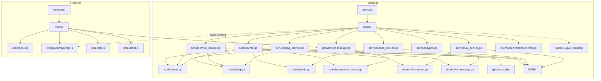

# Jot 项目分析报告

> 项目类型: 桌面端卡片式笔记应用（类小米笔记）
> 技术栈: Wails v2 + Go + GORM + SQLite + 原生 HTML/CSS/JS + CodeMirror 6（编辑器）+ einocli 薄适配层（eino 库驱动，OpenAI 兼容）

---

## 一、目录结构梳理

```
jot/                                    # 项目根目录
├── main.go                             # 【入口文件】Wails 应用启动入口，配置窗口/资源/绑定
├── app.go                              # 【核心文件】Wails 绑定层，暴露 95+ 个 Go API 给前端
├── go.mod                              # Go 模块定义，声明依赖版本
├── go.sum                              # Go 依赖锁文件
├── wails.json                          # Wails 项目配置（名称/构建脚本/作者）
├── AGENTS.md                           # 本报告文件
│
├── internal/                           # 【内部包】Go 子包统一目录
│   ├── agent/                          # Agent 执行引擎（ReAct 循环 + 工具注册 + 显式规划 + ask_user）
│   │   ├── agent.go                    # ReAct 循环 / 工具调用调度 / 代际事件（streamGen）发射 / 规划提示词
│   │   ├── registry.go                 # 内置工具注册表（按 Mode 过滤 + ToolMeta 声明）
│   │   ├── types.go                    # Agent 类型（Request/PlanState/Deps/Event 等）
│   │   ├── TOOLS.md / EVENTS.md        # 工具文档 / 事件文档
│   │   │   └── tools/                      # 内置工具实现（manage_note/ask_user/plan/recall_notes/read_url/http_request/read_note_section/json 三件套/manage_notebook/manage_tag/manage_todo/get_stats 共 15 个）
│   ├── aierrors/                       # AI 错误分类（errors.go：auth_error/rate_limit/server_error 等 11 类）
│   ├── config/                         # 路径工具（JotHomeDir/SubDir，~/.jot 下 data/backup/images/logs/mcp 五子目录）
│   ├── converter/                      # markitdown 封装：办公文件转 Markdown（7 种格式 + 60s 超时）
│   ├── einocli/                        # eino 薄适配层（chat.go/embedding.go/types.go，OpenAI 兼容客户端封装）
│   ├── markitdown/                     # 从 Go module cache 克隆的 markitdown 库本地副本（含 PDFium Stdout/Stderr Discard 修复）
│   ├── database/                       # SQLite 初始化 + 种子数据
│   │   ├── db.go                       # SQLite 初始化（glebarez/sqlite 驱动，底层 modernc.org/sqlite v1.51）+ WAL + 优化 PRAGMA + DefaultDBPath() + blank import 注册 sqlite-vec 扩展 + 孤儿列清理
│   │   ├── models.go                   # GORM 模型 AutoMigrate 注册入口
│   │   ├── builtin_profiles.go         # 内置 API 预设服务商定义（DeepSeek/智谱 GLM/Ollama/Agnes 等 12 个），InitDB 时按 Name 去重增量插入
│   │   ├── builtin_mcp_servers.go      # 内置 MCP 服务器定义（Tavily/AnySearch/知乎/Context7 等），InitDB 时按 Name 去重增量插入
│   │   └── builtin_prompts.go          # 内置技能提示词种子
│   ├── fontutil/                       # 跨平台系统字体枚举（fonts_windows/Linux/Darwin/fc）
│   ├── mcpserver/                      # MCP 客户端（官方 modelcontextprotocol/go-sdk）+ 连接池与预热
│   │   ├── client.go                   # 三传输（stdio/sse/http）+ 协议版本协商 + headerRoundTripper 鉴权注入
│   │   ├── pool.go                     # 连接池（Warmup/Reconcile/WarmupOne/getOrCreate/断线自动重连）
│   │   ├── tools.go                    # ListTools/CallTool 封装（InputSchema → eino ParamsOneOf）
│   │   └── config.go / MCP_CONFIG.md   # MCP 服务器配置结构 / 配置文档
│   ├── models/                         # GORM 实体层
│   │   ├── note.go                     # Note 实体（笔记，含 3 个排序/过滤命名索引）
│   │   ├── tag.go / notebook.go        # Tag 实体 / 笔记本实体
│   │   ├── setting.go                  # Setting 实体（KV 配置）
│   │   ├── password_record.go / todo.go  # 密码记录 / 待办实体
│   │   ├── note_vector.go              # NoteVector 实体（笔记切块向量索引，按 note_id+chunk_index 索引）
│   │   ├── ai_session.go               # AI 会话实体（标题/置顶/时间戳/摘要 SummaryContent/摘要边界 SummaryUpToMsgID）
│   │   ├── ai_session_config.go        # AI 会话操作栏配置（模型/深度思考/搜索源/Mode 三态/卡片召回/引用/技能，与 AISession 一对一）
│   │   ├── ai_message.go               # AI 消息实体（角色/内容/思维链/Meta chip 字段，外键关联 SessionID）
│   │   ├── ai_prompt.go                # AI 提示词实体（技能提示词数据库存储）
│   │   ├── api_profile.go              # API 配置预设实体（名称/服务商/URL/Key，无 is_builtin）
│   │   └── mcp_server.go               # MCP 服务器配置实体
│   └── services/                       # 业务服务层
│       ├── note_service.go             # 笔记 CRUD + 搜索 + 置顶 + 回收站 + 统计 + 导入导出 + VACUUM 瘦身 + GetAllIDs
│       ├── notebook_service.go / tag_service.go / setting_service.go  # 笔记本/标签/配置读写
│       ├── ai_service.go               # AI 业务层（einocli 客户端，OpenAI 兼容 + 流式 + 深度思考 + 会话/消息持久化 + Token 计算 + 上下文注入）
│       ├── ai_context.go               # AI 上下文与摘要压缩（token 预算窗口/轮次对齐选取/摘要边界持久化/增量压缩/触发比例与预算设置读取）
│       ├── todo_service.go             # 待办 CRUD + 按状态批量删除（DeleteUnfinished/DeleteCompleted/DeleteAll）
│       ├── password_service.go / password_generator.go  # 密码管理 CRUD/搜索（escapeLike 转义）/批量删除 + 密码生成器
│       ├── profile_service.go / stats_service.go / log_service.go  # API 预设 CRUD / 统计 / 日志服务
│       ├── vector_service.go           # 笔记向量索引（IndexNotes/GetIndexStatus/Count*/DeleteAllVectors）+ sqlite-vec 函数式召回 VectorRecall（SQL 内余弦距离 + 笔记本过滤 + 相邻块补充）
│       ├── chunk.go                    # 文档切块（600 rune 上限 + 元数据前缀注入（标题/标签/创建时间）+ 段落聚合 + 多级标题栈 + 围栏代码块保护 + 块首父级链补全）
│       ├── recall_service.go           # 召回结果类型与合并/截断工具（RecallCard/CardRecallResult/MergeRecallCards/Truncate*Preview）
│       ├── mcp_server_service.go / mcp_import.go  # MCP 服务器 CRUD / 导入导出
│       ├── crypto.go                   # 敏感密钥 Base64 编码/解码工具（(zk) 前缀标识）
│       └── types.go                    # 通用类型（PaginatedResult/DataStats/ImportResult/SettingsConfig/RecallNotebookIDs 等）
│
├── frontend/                           # 【前端目录】Wails 前端（Vanilla + Vite）
│   ├── index.html                      # 入口 HTML，10 个视图 + 关于浮层
│   ├── package.json                    # 前端依赖（Vite 3.x + CM6 ~16 包 + marked + highlight.js + @codemirror/lang-* 6 包 + @codemirror/legacy-modes）
│   ├── src/
│   │   ├── main.js                     # 【核心文件】前端逻辑（CM6 集成 + 搜索弹窗 + MD 语法页面 + AI 对话 + TOC + 回到顶部 + 批量管理 + 设置统一重构 + 锁屏密码 + 标签管理 + 导航切换；数据管理页/回收站页/常量工具函数/通知类/密码管理/启动器/待办清单已拆分为独立模块）
│   │   ├── js/                         # 【JS 模块目录】
│   │   │   ├── cm6-syntax-highlight.js # CM6 通用语法高亮模块（13 套配色 + 46+ 语言解析器映射 + 围栏代码块嵌套解析 mdCodeLanguages + 行内代码标记插件 markdownInlineCodePlugin）
│   │   │   ├── editor-actions/        # 编辑器操作菜单分组模块目录
│   │   │   │   ├── format.js          # 格式化操作项（JSON/XML/HTML/CSS/JS/SQL/CSV/YAML/TOML 各含格式化+压缩 + SQL 辅助函数 compactSQL/convertSQLCase）
│   │   │   │   ├── text-transform.js  # 文本转换操作项（7 项）
│   │   │   │   ├── text-clean.js      # 文本清理操作项（5 项）
│   │   │   │   ├── encode-decode.js   # 编码解码操作项（6 项）
│   │   │   │   └── md-syntax.js       # MD 语法插入操作项（22 项，type: 'insert' 模式）
│   │   │   ├── editor-actions.js      # 编辑器操作菜单模块（聚合导入各分组模块 + 菜单渲染/交互/执行引擎，main.js import 引入）
│   │   │   ├── data-management.js      # 数据管理页面模块（10 个函数 + reloadSettings，从 main.js 提取）
│   │   │   ├── trash-page.js           # 回收站页面模块（6 个函数，从 main.js 提取）
│   │   │   ├── ai-chat.js              # AI 对话模块（自实现聊天引擎 + 流式输出 + Markdown 渲染 + 多会话管理 + 侧栏折叠 + 多来源搜索 + 卡片召回（含笔记本选择菜单）+ 引用笔记 + 上传文件 + 拖拽上传 + 更多技能 + 双语言翻译方向组件 + 语言选择浮层 + 技能激活时禁用更多技能按钮 + 用户消息编辑/删除/重新发送 + 会话统一菜单（置顶/重命名/导出/删除）+ 分块渲染 + Token 显示 + 提示词迁移 + 会话切换一次性渲染+同步滚动消除跳跃 + 会话配置持久化同步 + 替换消息操作统一后端原子方法 + 分页懒加载消息 + 模式三态切换 + 悬停提示 JS portal + 用户消息跳转 Alt+↑/↓ + 300ms 防抖 + 分页加载向上触发）
│   │   │   ├── constants.js            # 图标常量 SVGS + 工具函数（formatTime/highlightText/getSummary/debounce，从 main.js 提取）
│   │   │   ├── notification.js         # NotificationManager 通知类 + window.showNotification 全局函数 + 模拟数据（getMockNotes/getMockTags，从 main.js 提取）
│   │   │   ├── launcher.js             # 启动器模块（Ctrl+P 全局浮层 / 13 项功能导航 / pinyin-pro 三路拼音匹配 / 4 列网格 / 键盘四方向导航 / 80ms 输入防抖 / DOM 查询缓存 / 关闭时清理定时器）
│   │   │   ├── password-manager.js     # 密码管理模块（完整 CRUD / 搜索 / 批量操作 / 右键菜单 / 复制/打开链接 / Base64 编码 / 搜索高亮 / 静默渲染 + pmLoadSeq 防乱序 + 密码生成器 + 强度算法）
│   │   │   ├── calendar.js             # 笔记日历模块（日历网格渲染 / 墨水圆点统计 / 本月摘要统计 / 按日笔记列表 / 回到今天 / 点击笔记跳转 / 切月自动重置今天）
│   │   │   └── preview-worker.js       # Web Worker 离线程 Markdown 渲染（从 src/ 移入）
│   │   └── css/                        # 【CSS 模块化目录】原 style.css + app.css 拆分
│   │       ├── index.css               # 入口文件，@import 引入所有子文件（设计系统 → 组件）
│   │       ├── variables.css           # 11 主题 CSS 变量：`--bg`/`--accent`/`--text-primary` 等
│   │       ├── reset.css               # 全局 reset（box-sizing/body 边距/overscroll-behavior）
│   │       ├── scrollbar.css           # 统一滚动条 6px 细条 + 自动隐藏 + 透明轨道 + 主题变量联动（含主内容区/搜索/AI 对话消息列表）
│   │       ├── animations.css          # 28 个 keyframes + 通用工具类 `.anim-*` + stagger 延迟
│   │       └── components/
│   │           ├── topbar.css          # 顶栏（品牌/搜索框/窗口控制按钮/更多菜单含图标）
│   │           ├── main-content.css    # 主内容区布局（卡片网格/视图容器/滚动）
│   │           ├── sidebar.css         # 笔记本侧边栏三段式设计 + 折叠按钮
│   │   │   │   ├── editor.css          # 编辑器面板/CM6 主题/全屏/预览/代码块复制按钮（含 AI 消息代码块）
│   │           ├── dropdowns.css       # 右键菜单/更多菜单/下拉选择器
│   │           ├── modals.css          # 通用模态框/确认弹窗/覆盖层/快捷键页面样式（shortcut-row flex 水平布局）
│   │           ├── settings-panel.css  # 设置页分段控件/滑块/开关/按钮
│   │           ├── search-modal.css    # 搜索弹窗/结果列表/高亮
│   │           ├── data-view.css       # 数据管理页分类导航（左侧导航 + 右侧面板切换动画）+ 信笺统计 + 操作卡片
│   │           ├── md-reference.css    # MD 语法手册卡片源码/预览双栏对照
│   │   │   │   ├── ai-chat.css         # AI 对话页面（气泡/输入区/Markdown 渲染/打字指示器/会话侧栏/折叠按钮/滚动条自动隐藏/消息居中响应式宽度 clamp(800px,92vw,1600px)/40px 间距/更多技能菜单选中态+离场动画+翻译chip双语言布局/联网搜索 toggle 开关+召回笔记本菜单/用户消息跳转高亮闪烁）
│   │           ├── todo.css            # 待办清单页面（FAB 浮动输入 + 两段式新增动画 + 行内编辑 + 保存涟漪 + 悬浮预览 Tooltip + 分类感知清空 + 8 个 @keyframes）
│   │           ├── launcher.css        # 启动器样式（全屏遮罩 + 4 列网格 grid-template-rows: repeat(3, 1fr) 固定高度 + 卡片 + prefers-reduced-motion 降级）
│   │           ├── password-manager.css # 密码管理页样式（三栏布局 + hover accent 竖条 + 搜索高亮 + 批量操作栏 + 空状态 + 密码生成器对话框）
│   │           └── calendar.css        # 笔记日历视图样式（日历网格/墨水圆点/统计卡片/笔记列表/入场动画）
│   ├── wailsjs/                        # Wails 自动生成的 JS 绑定
│   │   └── go/main/
│   │       ├── App.js                  # 后端 API 的 JS 封装
│   │       ├── App.d.ts               # TypeScript 类型定义
│   │       └── models.ts              # Go 模型的 TS 类型
│   └── dist/                           # Vite 构建产物（前端编译输出）
│
└── .trae/specs/                        # 项目 Spec 文档目录
```

### 目录规范评价

| 维度 | 评价 |
|------|------|
| **分层清晰度** | 优秀。严格按 `models → services → database → app` 分层，前端后端隔离清晰 |
| **命名规范** | 良好。目录名使用复数形式（models/services），符合 Go 社区惯例 |
| **冗余目录** | 无。每个目录职责单一，无多余层级 |
| **待改进** | 无（frontend/dist 已在 .gitignore 中） |

---

## 二、核心功能模块识别

### 2.1 基础支撑模块

| 模块名称 | 核心功能 | 对应文件 | 核心依赖 |
|----------|----------|----------|----------|
| **数据库初始化模块** | SQLite 连接建立、连接池配置、AutoMigrate、blank import 注册 sqlite-vec 扩展 | `database/db.go` | glebarez/sqlite, GORM, modernc.org/sqlite/vec |
| **数据模型层** | Note/Tag/Setting/PasswordRecord/AISession/AIMessage/APIProfile/AIPrompt/AISessionConfig/Todo/NoteVector 实体定义、GORM tag 映射 | `models/note.go`, `models/tag.go`, `models/setting.go`, `models/password_record.go`, `models/ai_session.go`, `models/ai_message.go`, `models/api_profile.go`, `models/ai_prompt.go`, `models/ai_session_config.go`, `models/todo.go`, `models/note_vector.go` | GORM |
| **通用类型** | 分页返回格式、统计数据、导入导出结构 | `services/types.go` | 无外部依赖 |
| **Wails 绑定层** | Go API → JS Bridge，95+ 个绑定方法，含 runtime.SaveFileDialog | `app.go` | Wails v2 binding + runtime |
| **前端构建** | Vite 打包、Wails dev 热重载 | `frontend/package.json`, `wails.json` | Vite 3.x（保留，未移除）|
| **前端构建流程** | `wails build` 自动执行 `npm run build`（Vite）→ `frontend/dist/`，再嵌入 Go 二进制 | `go:embed all:frontend/dist` | 前端构建和后端编译都由 `wails build` 一条命令完成 |
| **字体枚举** | Windows GDI EnumFontFamiliesW 系统字体枚举 | `fontutil/fonts_windows.go` | gdi32.dll / user32.dll (syscall) |
| **配置存储** | KV 结构配置读写（字体偏好等） | `services/setting_service.go` | GORM |
| **内置 MCP 服务器** | 内置 MCP 服务器模板（Tavily/AnySearch/知乎三服务/Context7），InitDB 时按 Name 去重增量插入 | `database/builtin_mcp_servers.go` | GORM |
| **路径工具** | `~/.jot` 根目录统一解析（data/backup/images/logs/mcp 五个子目录），数据库默认路径 `~/.jot/data/jot.db` | `internal/config/config.go:JotHomeDir()/SubDir()`，`database/db.go:DefaultDBPath()` | `os.UserHomeDir()` |
| **办公文件转换器** | 封装 markitdown 库，将 .docx/.pdf/.xlsx 等 7 种办公文件转为 Markdown 文本，带 60s 超时保护 | `internal/converter/converter.go` | github.com/conductor-oss/markitdown

### 2.2 业务核心模块

| 模块名称 | 核心功能 | 对应代码 | 核心输入 | 核心输出 |
|----------|----------|----------|----------|----------|
| **锁屏密码** | SHA-256 哈希验证 + 设置/修改密码 | `app.go:VerifyScreenLockPassword/SetScreenLockPassword` | 密码明文 | bool/错误 |
| **密码管理** | 完整 CRUD + 搜索 + 批量删除 + 右键菜单 + 复制/打开链接 + 搜索高亮 + Base64 编码（`(zk)` 前缀）+ 列表/详情分离传输（列表不含密码字段）+ 密码生成器（前端随机生成 + 强度评级 + 批量复制）| `services/password_service.go` + `app.go`（7 个绑定）+ `frontend/src/js/password-manager.js` | 名称/用户名/密码/URL/备注 | 密码记录 CRUD 结果 |
| **笔记 CRUD** | 创建/更新/查询/删除笔记 | `services/note_service.go` | 标题/内容/颜色/ID | Note 对象/错误 |
| **笔记搜索** | 标题+内容 LIKE 模糊搜索，支持 3 种排序（updated_at/created_at/title，均 pinned DESC 优先）| `note_service.go:Search()` | 关键词/分页/sortBy 参数 | 笔记列表+总数 |
| **笔记置顶** | 切换置顶状态 | `note_service.go:TogglePin()` | 笔记 ID | 更新后的笔记 |
| **回收站** | 软删除/查看/恢复/永久删除 | `note_service.go:Delete/GetTrash/Restore/PermanentDelete` | 笔记 ID | 操作结果 |
| **批量回收站操作** | 全部恢复/全部清空 | `note_service.go:RestoreAll/EmptyTrash` | — | 操作结果 |
| **标签管理** | 标签 CRUD | `services/tag_service.go` | 名称/颜色/ID | Tag 对象 |
| **笔记标签关联** | 为笔记添加/移除标签 | `tag_service.go:AddTagToNote/RemoveTagFromNote` | 笔记ID+标签ID | 操作结果 |
| **按标签筛选** | 通过标签 ID 查询笔记 | `note_service.go:GetByTag()` | 标签ID/分页参数 | 笔记列表+总数 |
| **数据统计** | 统计笔记总数/回收站数/标签数 | `note_service.go:GetStats()` + `tag_service.go:Count()` | — | DataStats 对象 |
| **数据导出为 .db** | 导出为 SQLite 数据库文件（VACUUM INTO + fs.CopyEx）| `app.go:ExportDataWithDialog()` | — | "导出成功" 提示 |
| **数据导入** | 从 JSON 文件导入笔记（跳过同名） | `note_service.go:ImportFromJSON()` | JSON 字节数组 | ImportResult 对象 |
| **前端卡片渲染** | 卡片网格展示 | `frontend/src/main.js` | 笔记数据数组 | DOM 渲染 |
| **前端编辑器** | 笔记编辑模态框（CM6 编辑器，支持行号/撤销重做/查找替换/Tab缩进/自动补全/自动闭合括号/Markdown 语法高亮） | `frontend/src/main.js` | 笔记数据/用户输入 | 保存/取消 |
| **前端查找替换** | CM6 search panel，Ctrl+F 查找 / Ctrl+H 查找替换，选中内容自动填充搜索框，预览模式自动切回编辑模式搜索 | `frontend/src/main.js:handleKeyboardNavigation()` | 搜索关键词 | 搜索面板匹配导航 |
| **前端搜索交互** | 搜索弹窗 200ms 防抖自动搜索，支持标题/内容/标签（多标签 AND 语义过滤）、笔记本/日期/排序筛选器（排序 3 选项：更新时间/创建时间/名称，均 pinned 优先） | `frontend/src/main.js` | 关键词 + 过滤条件 + sortBy | 搜索弹窗结果列表 |
| **笔记日历视图** | 日历导航（上/下月切换） + 创建时间墨水圆点统计（1/2-5/6+ 三档） + 按日笔记列表 + 点击笔记原地打开编辑器查看模式 | `frontend/src/js/calendar.js` + `frontend/src/css/components/calendar.css` + `services/note_service.go:GetByDate/GetMonthCounts` + `app.go:GetNotesByDate/GetMonthNoteCounts` | 年月参数/日期字符串 | 按月统计 map / 按日笔记列表 |
| **前端导航切换** | 网格/搜索/设置/数据管理/回收站/AI 助手视图切换 | `frontend/src/main.js:switchView()` | 视图名称 | 视图 DOM 切换 |
| **前端右键菜单** | 右键弹出菜单（查看/编辑/置顶/删除） | `frontend/src/main.js` | 鼠标事件+笔记ID | 菜单显示/操作 |
| **前端只读查看** | 左击笔记打开只读查看器 | `frontend/src/main.js:openEditor()` | 笔记 ID | 只读查看模态框 |
| **编辑器操作菜单** | 顶栏「操作」按钮下拉菜单，配置驱动操作注册表（EDITOR_ACTIONS 数组按分组拆分到 `frontend/src/js/editor-actions/` 模块，主文件聚合导入），当前含 5 个分组：格式化（JSON/XML/HTML/CSS/JS/SQL/CSV/YAML/TOML 各含格式化+压缩，SQL 另有关键字大小写共 18 项）、文本转换（大写/小写/首字母大写/驼峰式/蛇形式/行反转/字符反转 7 项）、文本清理（去除多余空格/去除空行/行尾空格清理/Tab↔空格 5 项）、编码解码（Base64/URL/HTML 各含编码+解码 6 项）、MD 语法（22 项，`type: 'insert'` 插入模式：有选中包裹选中文本、无选中在光标处插入样板）。支持选中文本或全文处理 + Ctrl+Z 撤销 + 查看模式隐藏 + 预览模式隐藏。无 subGroup 的项直接铺平在分组下，有 subGroup 的渲染为嵌套子菜单。 | `frontend/src/js/editor-actions.js` + `frontend/src/js/editor-actions/*.js` + `frontend/src/main.js`（import + els 注册 + window.cmEditor 暴露） | 选中文本或全文 | 格式化/转换/清理/编码解码/MD 样板结果 |
| **标签搜索** | 点击标签 chip 打开搜索弹窗并预选该标签筛选器 | `frontend/src/main.js:searchByTag()` | 标签 ID | 搜索弹窗结果列表 |
| **键盘快捷键** | Ctrl+F 编辑器搜索 / Ctrl+H 编辑器查找替换 / Ctrl+N 新建 / Ctrl+L 编辑器切换模式 / Ctrl+P 启动器菜单 / Alt+↑/↓ AI 会话中跳转用户消息 / PgUp/PgDn 滚动 / Ctrl+Home/End / Ctrl+0 锁屏 | `frontend/src/main.js:handleKeyboardNavigation()` | 键盘事件 | 对应操作 |
| **版本号信息** | 返回 verman.V.GitVersion 纯版本号 | `app.go:GetVersion()` | — | 版本字符串 |
| **打开外链** | 调用 runtime.BrowserOpenURL 在默认浏览器打开链接 | `app.go:OpenProjectURL()` | URL 字符串 | — |
| **打开数据目录** | 在文件管理器中打开 `~/.jot/data/` | `app.go:OpenDataDir()` | — | explorer 文件管理器 |
| **一键备份** | 备份当前库到 `~/.jot/backup/jot-backup.db`（覆盖）| `app.go:BackupToDir()` | — | 备份成功提示 |
| **一键还原** | 从 `jot-backup.db` 还原并刷新笔记/标签/统计 | `app.go:RestoreFromDir()` | — | Toast 提示结果 |
| **外观设置** | 字体族下拉选择（搜索+键盘导航）+ 字体大小滑条（10-32px 实时预览）+ 主题选择（11 种）+ 主题预览迷你 UI 卡片 | `frontend/src/main.js:loadFontSettings/applyFontFamily/applyFontSize` + `loadThemeSetting` | 字体名称/大小/主题名称 | 更新 CSS 变量 |
| **AI 对话** | einocli 薄适配层（eino 库）驱动 OpenAI 兼容流式对话（自实现聊天引擎 + Markdown/代码高亮渲染 + 多会话管理/置顶/重命名/导出/统一菜单 + 引用笔记 + 上传文件 + 更多技能 + 双语翻译 + 用户消息编辑/删除/重新发送 + 用户消息 Meta Chip（引用/文件/技能可视化）+ 大消息截断折叠 + Agent 工具（内置工具 + MCP 工具 + 工具级开关）+ ask_user 反问机制 + 联网搜索（MCP 驱动，含内置服务器 Tavily/AnySearch/知乎/Context7）+ 卡片召回（sqlite-vec 向量召回）+ 对话摘要持久化 + Token 显示 + 后端统一上下文注入 + 分页懒加载消息 + 会话自动恢复 + MCP 连接池与预热 + 输入区自适应 + 三栏合并（引用/技能/文件）） | `services/ai_service.go`+ `einocli/` + `internal/agent/` + `internal/mcpserver/` + `frontend/src/js/ai-chat.js`+ `frontend/src/css/components/ai-chat.css` | 用户消息 | AI 流式回复 |
| **向量召回** | 笔记切块向量化（`chunk.go` 标题链拼接 + `IndexNotes` 先删后插幂等嵌入）后由 sqlite-vec 函数式检索——`vec_distance_cosine` SQL 内余弦距离 + `vec_f32` 解析 query 向量 JSON，`dist < 1.0` 过滤 + 距离升序 TopN；支持指定笔记本（JOIN notes 过滤）或全部笔记；命中块补充前后各 1 相邻块并按笔记合并卡片（召回块完整注入，已去掉单卡截断，由 ai_card_recall_limit 控制总量）；embedClient/模型未配置或当前模型无向量数据时静默跳过 | `services/vector_service.go:VectorRecall` + `services/chunk.go` + `models/note_vector.go` | 用户问题 query + 可选笔记本 ID 列表 | CardRecallResult（FormattedText 注入 system message + Cards 前端展示） |
| **AI 配置管理** | Base URL/API Key/Model 的读写 + 连通性测试 + 模型列表获取 | `app.go:GetAIConfig/SaveAIConfig/TestBaseURL/FetchAIModels` | 配置项 | 配置/测试结果 |
| **统一通知系统** | NotificationManager 单例类，右上角浮动通知，4 种类型 + undo 撤销 | `frontend/src/js/notification.js` | 消息/类型/回调 | 通知 DOM 创建与自动销毁 |

### 2.3 模块分层图

```
┌─────────────────────────────────────────────────────┐
│                    Frontend                          │
│  (main.js / css/index.css / index.html)               │
│   ├─ 视图渲染 (卡片/搜索/设置/数据管理/回收站/AI/MD 语法/日历/待办/密码管理)     │
│   ├─ 交互逻辑 (事件绑定/状态管理)                      │
│   └─ Wails Bridge (window.go.main.App.*)              │
└────────────────────────┬────────────────────────────┘
                         │ Wails Binding (JSON 序列化)
┌────────────────────────▼────────────────────────────┐
│              App 层 (app.go)                         │
│  95+ 个绑定方法（CRUD/搜索/置顶/回收站/统计/导入导出/路径/│
│    AI 配置/会话管理/消息管理/笔记本回收站/配置文件预设)    │
│  (含 runtime.SaveFileDialog 原生对话框调用)            │
└────────────────────────┬────────────────────────────┘
                         │
              ┌──────────┼──────────┐
              ▼          ▼          ▼
    ┌─────────────┐ ┌──────────┐ ┌──────────────┐ ┌──────────────┐ ┌──────────────┐
    │ NoteService │ │TagService│ │  TodoService │ │PwService     │ │  AI Service  │
    │ (CRUD/搜索/ │ │(CRUD/关联)│ │ (CRUD/切换   │ │(CRUD/搜索/   │ │ (AI 流式对话 │
    │  置顶/回收站 │ │          │ │  完成/删除   │ │  批量删除    │ │  会话管理    │
    │  统计/导入   │ │          │ │  按状态清空) │ │  编码/搜索   │ │  消息持久化) │
    │  导出)      │ │          │ │              │ │  高亮)       │ │              │
    └──────┬──────┘ └─────┬────┘ └──────┬───────┘ └──────┬───────┘ └──────┬───────┘
           │              │             │                │                │
           └──────┬───────┴──────┬──────┴──────┬─────────┴──────┬─────────┘
                  │              │             │                │
                  ▼              ▼             ▼                ▼
        ┌─────────────────┐ ┌──────────┐ ┌─────────────────┐ ┌─────────────────┐
        │    GORM ORM     │ │GORM ORM │ │   GORM ORM     │ │   GORM ORM     │
        │ (数据访问层)      │ │(待办层)  │ │ (密码管理层)    │ │ (AI 模型层)     │
        └────────┬────────┘ └────┬─────┘ └────────┬────────┘ └────────┬────────┘
                 │               │                 │
                 └───────────────┴─────────────────┘
                                    ▼
                          ┌─────────────────┐
                          │     SQLite      │
                          │ (glebarez/sqlite│
                          │  纯 Go 驱动)     │
                          └─────────────────┘
```

---

## 三、模块间依赖关系分析

### 3.1 依赖关系详表

| 依赖方 | 被依赖方 | 依赖类型 | 依赖详情 |
|--------|----------|----------|----------|
| `app.go` | `database` | 编译依赖 | 调用 `database.InitDB()` 获取 `*gorm.DB` 实例 |
| `app.go` | `services` | 编译依赖 | 创建 `NoteService` / `TagService` / `TodoService` / `PasswordService` / `SettingService` 实例 |
| `app.go` | `models` | 编译依赖 | 返回 `*models.Note` / `*models.Tag` / `*models.Todo` / `*models.PasswordRecord` / `*models.Setting` 类型 |
| `app.go` | `runtime` | 编译依赖 | `runtime.SaveFileDialog` 原生保存对话框 |
| `app.go` | `fontutil` | 编译依赖 | `fontutil.GetFonts()` 枚举系统字体 |
| `services` | `models` | 编译依赖 | 操作 Note/Tag/Todo/Setting/AISession/AIMessage 结构体 |
| `services` | GORM | 编译依赖 | `*gorm.DB` 数据库操作 |
| `database` | `models` | 编译依赖 | `AutoMigrate(&models.Note{}, &models.Tag{}, &models.Todo{}, &models.PasswordRecord{}, &models.Setting{}, &models.AISession{}, &models.AIMessage{})` |
| `database` | glebarez/sqlite | 编译依赖 | 纯 Go SQLite 驱动 |
| `fontutil` | gdi32/user32 | 运行时依赖 | syscall 调用 Windows GDI API |
| `frontend/main.js` | `wailsjs/go/main/App.js` | 运行时调用 | `window.go.main.App.*` 调用后端 API |
| `frontend/wailsjs` | `app.go` | 构建时生成 | `wails generate module` 自动生成 |

### 3.2 依赖关系图（Mermaid）


```mermaid
graph TD
    subgraph Backend
        A[main.go] --> B[app.go]
        B --> C[database/db.go]
        B --> D[services/note_service.go]
        B --> E[services/tag_service.go]
        B --> TD[services/todo_service.go]
        B --> PW[services/password_service.go]
        B --> F[services/types.go]
        B --> AI[services/ai_service.go]
        B --> CV[internal/converter/converter.go]
        C --> G[models/note.go]
        C --> H[models/tag.go]
        C --> TD2[models/todo.go]
        C --> PR[models/password_record.go]
        C --> I[models/ai_session.go]
        C --> J[models/ai_message.go]
        D --> G
        D --> H
        E --> G
        E --> H
        TD --> TD2
        PW --> PR
        AI --> I
        AI --> J
        C --> K[glebarez/sqlite]
        D --> L[GORM]
        E --> L
        TD --> L
        AI --> L
        B -.-> M[runtime.SaveFileDialog]
    end

    subgraph Frontend
        N[index.html] --> O[main.js]
        O --> P[css/index.css]
        O --> Q[wailsjs/go/main/App.js]
        O --> R[js/ai-chat.js]
        O --> LA[js/launcher.js]
        O --> PW[js/password-manager.js]
    end

    B -.->|Wails Binding| Q
```

### 3.3 依赖问题分析

| 问题类型 | 描述 | 严重程度 |
|----------|------|----------|
| **循环依赖** | 无。所有依赖为单向 `main → app → services → models`，无循环 | ✅ 无问题 |
| **过度依赖** | 无。每个 Service 仅依赖 `*gorm.DB` 和自身模型 | ✅ 无问题 |
| **依赖缺失** | 无。`go.sum` 中所有传递依赖完整 | ✅ 无问题 |
| **隐式依赖** | 前端 `window.go` 对象依赖 Wails 运行时注入，本地开发/独立预览时不可用 | ⚠️ 有降级处理（Mock 数据） |
| **编译期依赖 vs 运行时依赖** | `wailsjs/` 目录需在修改 `app.go` 后重新生成 | ⚠️ 需手动执行 `wails generate module` |

---

## 四、设计模式与实现逻辑

### 4.1 设计模式识别

| 模式名称 | 应用位置 | 说明 | 代码示例 |
|----------|----------|------|----------|
| **Service Layer 模式** | `services/` 包 | 将业务逻辑从 controller（app.go）中抽离，封装为独立 Service 结构体 | `NoteService` / `TagService` |
| **依赖注入 (DI)** | `app.go` | Service 依赖的 `*gorm.DB` 通过构造函数注入 | `NewNoteService(db)` / `NewTagService(db)` |
| **Repository 模式** | `services/` 包内嵌 GORM | Service 内部直接使用 GORM 作为数据访问层 | `s.db.Create()` / `s.db.Where()` |
| **单例模式 (应用级)** | App 结构体 | Wails 运行时保证 App 实例唯一 | `NewApp()` 在 `main()` 中仅调用一次 |
| **MVC 变体** | 整体架构 | Model(models) - View(frontend) - Controller(app.go + services) 分层 | 见分层图 |
| **降级策略 (Fallback)** | `frontend/main.js` | 后端未绑定时自动使用 Mock 数据 | `if (!window.go.main.App.GetNotes) { state.notes = getMockNotes(); }` |
| **Wails Runtime 集成** | `app.go` | 通过 runtime 包调用原生桌面功能 | `runtime.SaveFileDialog()` 弹出系统保存对话框 |

### 4.2 核心业务逻辑流程

#### 4.2.1 笔记创建流程

```
用户点击 "+" 按钮 / Ctrl+N
  → openEditor(null)          // 打开空编辑器模态框
    → 用户填写标题/内容/选择颜色/选择标签
    → 点击"保存"按钮
      → createNote()
        → 前端校验（标题不为空）
        → window.go.main.App.CreateNote(title, content, color)
          → app.go:CreateNote()
            → noteService.Create()          // GORM db.Create(&note)
            → 返回 *models.Note（含 id）
          → 遍历 selectedTags
            → window.go.main.App.AddTagToNote(note.id, tagId)
              → tagService.AddTagToNote()   // GORM Association("Tags").Append
        → closeEditor()                     // 关闭模态框
        → loadNotes()                       // 重新加载笔记列表
          → GetNotes(1, 100)                // 分页查询
          → renderCardGrid()                // 渲染右侧卡片网格
```

#### 4.2.2 笔记搜索流程

```
Ctrl+F / Ctrl+K → 打开搜索弹窗
  → els.searchModalInput 自动聚焦
  → 用户输入文字 → 200ms 防抖
    → searchModalLoadPage(1, false)
```

...（中间流程不变）

---

## 五、技术栈评估

### 5.1 技术栈清单

| 层级 | 技术 | 版本 | 用途 |
|------|------|------|------|
| **桌面框架** | Wails v2 | v2.12.0 | 桌面窗口 + Go ↔ JS Bridge |
| **后端语言** | Go | go1.22+ | 后端业务逻辑 |
| **数据库** | SQLite | — | 本地数据存储 |
| **数据库驱动** | glebarez/sqlite | v1.11 | 纯 Go SQLite 驱动（无 CGO） |
| **向量检索** | sqlite-vec（modernc.org/sqlite/vec） | v0.1.9 | SQL 内余弦距离 vec_distance_cosine / vec_f32，函数式用法（非 vec0 虚拟表），blank import 自动注册 |
| **ORM** | GORM | v1.31.1 | 对象关系映射 |
| **前端构建** | Vite | v3.2.11 | 前端打包工具 |
| **前端技术** | 原生 HTML/CSS/JS | — | UI 渲染 |
| **编辑器** | CodeMirror 6 | @codemirror/view v6.43.0 | 笔记编辑器 |
| **Markdown 解析** | marked | v18.0.5 | Markdown → HTML 渲染 |
| **代码高亮** | highlight.js | v11.11.1 | 代码块语法高亮 |
| **Mermaid 图表** | mermaid | v11.16.0 | Markdown 代码块图表渲染（mermaid/render 子路径） |
| **拼音搜索** | pinyin-pro | v3.29.3 | 启动器三路拼音匹配（全拼/首字母/中文原文） |
| **AI 对话** | einocli 薄适配层（eino 库） | github.com/cloudwego/eino v0.9.13 + eino-ext（components/model/openai v0.1.13 + libs/acl/openai v0.1.17，底层 github.com/meguminnnnnnnnn/go-openai v0.1.2） | 流式对话/深度思考/多会话/联网搜索/卡片召回 |
| **本地存储** | localStorage | — | UI 状态持久化（主题/侧栏状态等） |

### 5.3 版本兼容性问题

| 问题 | 说明 |
|------|------|
| **Wails 版本锁定** | `go.mod` 中 `wails.io v2.12.0` 已固定，`wails/v2` 包需与 Wails CLI 版本匹配。升级需同步更新 CLI, go.mod, wails.json 三方 |
| **GORM AutoMigrate** | 新增模型（如 AISession/AIMessage）后需在 `database/db.go` 的 `AutoMigrate` 中注册，否则表不会自动创建 |

---

## 六、补充分析

### 6.1 性能关键点

| 关键点 | 现状 | 评估 |
|--------|------|------|
| **数据库查询** | GORM + SQLite，分页查询 | ✅ 满足笔记本规模 |
| **前端渲染** | 卡片网格渲染 | ✅ 性能良好 |
| **AI 流式输出** | 基于 Wails Events 逐块推送，不阻塞 UI | ✅ 体验优秀 |
| **CM6 编辑器** | 仅初始化当前编辑的笔记 | ✅ 性能良好 |
| **多会话切换** | 切换时从后端加载对应会话的消息，采用一次性同步渲染（无 yield）+ 同步滚动（`scroll-behavior: auto` 临时禁用），浏览器只绘制一次最终状态，彻底消除视觉跳跃。后端 `LoadAISessionMessagesPaginated` 在返回前端前已截断 `RecallCards`/`SearchSources` 的 Content 为 200 字，减小 Wails 桥传输量和 DOM 渲染开销 | ✅ 切换瞬间完成，无任何中间状态闪烁 |

### 6.2 异常处理分析

| 异常场景 | 处理方式 |
|----------|----------|
| **后端 API 不可用** | 前端 Mock 数据降级 |
| **AI API 调用失败** | HTTP 状态码封装为 11 种分类中文提示（auth_error/rate_limit/server_error 等），通过 `ai:stream-error` 事件以 JSON 格式（`{category, user_msg, raw}`）传递到前端，解析后通过 `showNotification()` 右上角通知展示，不再插入对话流中 |
| **联网搜索失败** | 每个搜索来源独立发射错误事件 `ai:search-error`，不影响其他来源继续搜索；前端通过 `showNotification()` 提示用户 |
| **数据库损坏** | 备份还原机制 |
| **办公文件转换失败** | 60s 超时保护 + `Warnw` 日志记录大文件/损坏文件，`Errorw` 记录转换异常；前端通过 `showImportResults()` 逐个显示文件错误详情 |
| **流式连接中断** | 前端监听 `ai:stream-error` 事件，显示错误提示 |
| **会话/消息查询失败** | 返回空列表 + 控制台错误日志，不阻断 UI |

### 6.3 安全分析

| 风险点 | 评估 |
|--------|------|
| **本地数据库** | SQLite 文件本地存储，无远程访问风险 |
| **API Key 存储** | Base64 编码存储在 DB 中，带 `(zk)` 前缀标识，前端读写均为解码后明文。仅防肉眼查看，非真实加密 |
| **XSS 风险** | AI 回复经 `marked.parse()` 渲染，`marked` 默认 Sanitize |

### 6.4 数据库优化

| 优化项 | 配置 | 说明 |
|--------|------|------|
| **WAL 模式** | `PRAGMA journal_mode=WAL` | 允许并发读取，写入不阻塞读取，显著提升多线程场景性能 |
| **busy_timeout** | `PRAGMA busy_timeout=5000` | 忙等待超时 5 秒，避免 "database is locked" 错误 |
| **synchronous** | `PRAGMA synchronous=NORMAL` | WAL 模式下 NORMAL 级别安全且性能比 FULL 快得多 |
| **cache_size** | `PRAGMA cache_size=-8000` | 8MB 页面缓存（负值表示 KB 单位） |
- 初始化位置：`internal/database/db.go` 的 `InitDB()` 函数中，`SetMaxOpenConns(1)` 之后
- PRAGMA 执行失败不影响初始化流程（忽略错误），由调用方统一处理错误日志
- 导入/还原场景需清理 WAL 残留文件（`-wal`/`-shm`），防止旧文件干扰新数据库，清理逻辑在 `app.go` 的 `replaceDatabase()` 函数中

---

## 七、项目核心特点

### 核心设计理念

1. **Wails v2 跨平台桌面应用**：Go + 原生前端（HTML/CSS/JS）架构，兼顾后端性能和前端灵活性

2. **CodeMirror 6 编辑器集成**：主流 Markdown 编辑器引擎，支持行号/撤销重做/查找替换/Tab缩进/自动补全/语法高亮（13 套配色 + 46+ 语言）

3. **CSS 变量主题系统（11 主题）**：全局 CSS 变量联动（`--bg`/`--accent`/`--border` 等），一键切换 11 套系统主题 + 13 套代码高亮主题，所有组件自动适配。2026-07 完成配色全面重构——每套主题重新设计 `--bg`/`--card-bg`/`--bg-secondary` 等核心颜色值，E 护眼/深色/浅色等主题彻底重做，共修改 ~140 个变量

4. **三步交互范式**：笔记本（容器）→ 笔记卡片（列表）→ 编辑器（操作），符合直觉的文件夹-文件-编辑结构

5. **AI 对话引擎（einocli 薄适配层 + eino 库）**：基于 eino（components/model/openai）实现 OpenAI 兼容统一接口，通过 einocli 薄适配层对外暴露，支持 DeepSeek、通义千问等兼容端点（已移除 Ollama 原生协议）。流式输出 + Markdown 渲染 + 代码高亮 + 思维链折叠 + 多会话管理 + 侧栏折叠 + 多来源联网搜索（Tavily/知乎/全网搜索，含全选/全取消开关）+ 卡片召回（含笔记本选择菜单）+ 引用笔记 + 更多技能 + 用户消息编辑/删除/重新发送 + Token 统计 + **后端统一上下文注入**。API 连接通过设置页预设管理配置与持久化。

6. **统一的通知系统**：NotificationManager 单例，右上角浮动通知，支持 success/error/warning/info 四种类型 + undo 撤销

7. **过度动画与交互反馈**：28 个 keyframes、stagger 延迟、hover 分层反馈、spring 弹性缓动、骨架屏 shimmer、分段滑块弹簧曲线（`cubic-bezier(0.34, 1.56, 0.64, 1)`，全局 `--anim-easing-spring: cubic-bezier(0.16, 1, 0.3, 1)`）、字体滑条实时预览

8. **无 UI 框架依赖**：无 Vue/React/Svelte，纯手写 DOM 操作，极致轻量

9. **Mermaid 图表渲染集成**：为 Markdown 代码块中的 `language-mermaid` 块提供按需渲染，默认显示源码，点击渲染按钮后直接主线程渲染 SVG。切换按钮与复制按钮风格统一，CSS `:has()` 处理双按钮防碰撞

10. **密码管理功能页**：独立视图，Base64 编码（`(zk)` 前缀）+ 列表/详情分离传输（列表不含密码字段，仅详情返回明文）+ 7 个 Wails 绑定 + escapeLike LIKE 转义防注入 + 静默重渲染（`.pm-no-enter` 跳过入场动画）+ pmLoadSeq 代际计数器防乱序 + 搜索高亮 + 右键菜单 + 批量操作 + 复制/打开链接 + **密码生成器**（前端 `crypto.getRandomValues` 安全随机 + 评级上限+长度阶梯强度算法 + 对话框配置长度/数量/字符类型 + 逐条/批量复制）

11. **启动器（Launcher）Ctrl+P 拼音搜索**：全屏浮层 4 列网格导航，pinyin-pro 懒计算 + Map 缓存拼音索引，三路降级匹配（中文原文 → 全拼 → 首字母），空格压缩支持分词输入，13 个功能项覆盖全部视图入口，四方向键盘导航 + 弹性动画 + prefers-reduced-motion 降级。

### 设计系统

- **尺寸**：`--radius-md`(8px) / `--radius-sm`(6px)，全局统一
- **间距**：4px 基线网格，组件内部 8-16px，布局 16-24px
- **阴影**：4 层 Token — `elevated`(卡片) / `dropdown`(下拉菜单) / `modal`(模态框) / `toast`(通知)
- **语义色**：`--success`(绿) / `--warning`(黄) / `--error`(红) / `--info`(蓝)
- **字体**：全局统一 `var(--font-family)`，编辑器和代码块跟随系统设置
- **滚动条**：6px 细条，`--scrollbar-thumb` / `--scrollbar-thumb-hover` 联动 11 主题
- **圆角一致性**：所有交互元素（按钮/卡片/输入框/下拉菜单/模态框）均使用 `var(--radius-sm)` 或 `var(--radius-md)`，无硬编码

---

## 九、关键记忆点

1. **Wails v2 事件驱动流式输出**：AI 回复流式传输使用 `runtime.EventsEmit`（Go 端）+ `EventsOn`（前端），Go 端 `bufio.Reader` 逐行解析 SSE `data: {...}` 流，经回调（`onChunk`/`onThinking`/`onDone`/`onError`）逐块推送。前端 `startStreaming()` 统一注册事件监听并返回 `unsubXxx` 清理函数，**所有 AI 流式事件（chunk/thinking/tool-status/plan/ask-user/done/error）首参携带 `streamGen` 代际 ID，回调按 `streamGen !== myGen` 丢弃过期流**，防止多请求串流（取代早期 onSend 一次性回调 + 局部变量隔离的旧方案）。详见 [ai-chat.js](frontend/src/js/ai-chat.js) `startStreaming()`

2. **思维链折叠**：深度思考模型返回 `delta.reasoning_content`，Go 端在 `streamChoice.Delta` 中解析此字段，通过 `onThinking` 回调和 `ai:stream-thinking` 事件推送。前端创建 `<details class="ai-thinking">` 可折叠区域（summary + 内容），首次 thinking chunk 懒创建，后续流式追加，`addMessage()` 也接受 `reasoningContent` 参数用于显式渲染

3. **AI 消息持久化 + 后端原子替换 + 消息懒加载（会话消息全链路）**：`AISession`+`AIMessage` GORM 模型（`ai_session.go`/`ai_message.go`），`SaveAIMessages()` 保存一轮对话并自动生成标题（取首条用户消息前 30 字），`LoadAISessionMessages()` 按 `CreatedAt` 升序返回历史，`ClearAISessionMessages()` 清空会话。**后端原子替换**：编辑/删除/重发/重新生成四操作的 DB 写入合并为后端 `ReplaceAISessionMessages(sessionID, messages)` 单次调用（GORM Transaction 保证清空+写入原子性，前端 `chatHistory` 为空时 fallback 到 ClearAISessionMessages）。**懒加载 + 上下文自取**：`CallAIAgentStream` 仅接收 userText 和元数据，后端自行从 DB 加载全部历史构建上下文；`LoadAISessionMessagesPaginated` 分页加载（游标 `beforeID` 默认 6 条 ASC）；编辑/重发/再生用基于 `msgID` 的 `TruncateAISessionAfterMessage` 截断、删除用 `DeleteAIMessage`（仅删单条）；Token 显示改后端 `SumSessionTokens`+`GetSessionContextTokens`；`stream-done` 事件 9 参数（含 userMsgID/assistantMsgID）。详见 [ai_service.go](internal/services/ai_service.go)、[app.go](app.go)、[ai-chat.js](frontend/src/js/ai-chat.js)

4. **AI 对话侧栏 + 折叠机制**：左右分栏布局（`.ai-chat-layout`），左侧 `.ai-session-sidebar`（220px），右侧 `.ai-chat-content` flex:1。折叠按钮（`.ai-sidebar-toggle`）为 14×44px 纤细条状，置于侧栏外作为兄弟元素，通过兄弟选择器 `~` 控制 `left` 定位（展开时 220px、折叠时 0）。展开时按钮左侧加 `border-left: 1px solid var(--border)` 延续分割感。折叠状态 `localStorage` 持久化，CSS `transition: width 0.25s ease` 动画。SVG Chevron 图标（Lucide 风格）替代 Unicode 字符

5. **`onAIChatViewActivated` 惰性加载**：仅在 `activeSessionId === null`（无活跃会话）时自动加载第一个会话，视图切换不重置当前会话状态，避免切换回来后消息错乱。`switchSession()` 按 `msg.role` 遍历渲染，`Message` 结构体含 `ReasoningContent` 字段

6. **消息渲染与气泡**：`addMessage()` 创建消息气泡 DOM，AI 侧使用 `marked.parse()` 渲染 Markdown（含 `hljs.highlightElement()` 代码高亮），用户侧以 `<pre class="ai-user-msg">` 转义纯文本。打字指示器内嵌到 `msg-content` 内部（不独立建气泡）

7. **联网搜索（MCP 迁移后）**：内置 Tavily/知乎多源搜索已整体移除（含 `web_search`/`refine_search_query` 工具与 `search_service.go`/`zhihu_search_service.go`/`query_refiner.go`）。Agent 的联网能力由 MCP 服务器工具提供（`mcp_{服务器名}_{工具名}`，装配见 agent.go 的 MCPServerDB 分支）；搜索结果以工具返回文本进入正文。**搜索来源面板展示已移除**（历史消息不再解析 `search_sources`，`LoadAISessionMessagesPaginated` 置空该字段，DB 数据保留）；**召回卡片展示保留**（`recall_notes` 本地检索经 `ai:agent-result`/`renderRecallCards` 展示，历史回放同样显示）。

8. **前端 Agent 工具状态展示**：`ai:tool-status` 事件实时展示工具调用状态条（含 MCP 工具，`ActionText` 文案"调用 {服务器} 的 {工具}"）；`ai:ask-user` 反问面板；`ai:agent-result` 回传搜索来源/召回卡片/工具调用链供 `stream-done` 落库与渲染。

9. **切换会话性能优化（分块渲染）**：`switchSession()` 中对大量历史消息采用分块渲染策略（CHUNK_SIZE=5），每块渲染后 `setTimeout` 0ms yield 给浏览器，避免一次性渲染大量 DOM 导致卡顿。移除 `collapseActionsIfNeeded` 同步调用（该函数已删除，不再需要布局抖动补偿）。详见 [ai-chat.js](frontend/src/js/ai-chat.js) `switchSession()`

10. **延迟语法高亮（deferHighlight）**：`renderMarkdown()` 新增 `deferHighlight` 参数，历史消息加载时使用 `deferHighlightBlocks()` 通过 `requestIdleCallback` 渐进式执行 `hljs.highlightElement()`，优先级低于首次渲染，优先保证页面交互。详见 [ai-chat.js](frontend/src/js/ai-chat.js)

11. **重置出厂设置修复集**：①`resetDatabase()` 清空 `#aiChatMessages.innerHTML` 和 `#aiSessionList.innerHTML` 避免旧数据残留；②`onAIChatViewActivated()` 中清除标题/contextSize/chatHistory/sessions/activeSessionId 等模块级变量；③重置后自动调用 `onAIChatViewActivated?.()` 让 AI 助手模块立即进入就绪状态，消除闪烁。详见 [data-management.js](frontend/src/js/data-management.js)、[ai-chat.js](frontend/src/js/ai-chat.js)

12. **全局链接系统浏览器打开**：在 `main.js` 的 `initEventListeners()` 中添加 `document` 级 click 事件委托，拦截所有 `<a>` 标签点击，通过 `e.preventDefault()` + `window.runtime.BrowserOpenURL(href)` 在系统默认浏览器中打开。排除 `#` 锚点链接和 `javascript:` 伪协议。同时移除了 `ai-chat.js` 中 `messagesEl` 级别的区域委托和搜索来源面板中的冗余 `link.addEventListener` 代码。详见 [main.js](frontend/src/main.js#L5131-L5138)

13. **SQLite WAL 模式 + 优化 PRAGMA**：`InitDB()` 中配置 `journal_mode=WAL`、`busy_timeout=5000`、`synchronous=NORMAL`、`cache_size=-8000`。PRAGMA 执行失败不中断初始化，由调用方统一记录日志。`replaceDatabase()` 中清理 `-wal`/`-shm` 残留文件防止导入/还原数据损坏。详见 [db.go](internal/database/db.go)、[app.go](app.go)

14. **基础 System Prompt 三层重构 + 技能注入修复**：将单句硬编码基础 prompt 拆分为包级常量 `baseIdentity`（身份层）、`baseNormsBoundaries`（规范层+边界层）、`baseSystemPrompt`（完整三层，均在 [app.go](app.go)）。修复 `CallAIAgentStream` 中技能激活时跳过全部基础 prompt 的 Bug，改为始终注入规范层+边界层，仅身份层在技能激活时跳过。详见 [app.go](app.go)

15. **启动器网格（Launcher Grid）+ 拼音搜索**：新增 `Ctrl+P` 触发的全屏浮层启动器，13 个功能项 3 列网格布局。**pinyin-pro 拼音搜索**：`import { pinyin } from 'pinyin-pro'`（v3.29.3），懒计算 + Map 缓存拼音索引（`{ full: 全拼连续串, initials: 首字母串 }`），三路降级匹配（中文原文 `includes` → 全拼 `includes` → 首字母 `includes`），输入 `compact = trimmed.replace(/\s+/g, '')` 支持空格分词（如 "s z t" 或 "she zhi" 均命中"设置"）。**ES module 函数暴露**：launcher 调用的操作函数（`toggleSidebar`/`openShortcuts`/`showAbout` 等）需手动 `window.xxx = xxx` 暴露。**离场动画**：`executeAction` 先调 `closeLauncher(callback)` 等 `transitionend` 完成后再执行操作——离场涉及 mask 和 panel 共 4 条过渡属性，`transitionend` 会冒泡 4 次，需 `_closed` 守卫防止重复触发。**键盘导航**：四方向（ArrowUp/Down 按列跳转+首尾循环/ArrowLeft/Right 逐项+Tab 拦截），首次导航 `_selectedIndex === -1` 时直接跳第一项。动画用 `requestAnimationFrame` 双阶段，离场加 300ms `setTimeout` 保底。详见 [launcher.js](frontend/src/js/launcher.js)、[launcher.css](frontend/src/css/components/launcher.css)

16. **markitdown 库本地克隆 + Wails 构建 PDF 转换修复**：将 `github.com/conductor-oss/markitdown` 从 Go module cache 克隆到 `internal/markitdown` 进行本地维护，通过 `go.mod` replace 指令引用。修复 `wails build` 后 PDF 转换失败问题——根因是 Wails GUI 构建缺少有效控制台句柄，wazero 初始化 PDFium WebAssembly 时调用 `GetFileType /dev/stdout` 返回无效句柄错误。修复方案：在 `initPdfiumPool()` 的 `webassembly.Config` 中添加 `Stdout: io.Discard` 和 `Stderr: io.Discard`，避免 wazero 对无效句柄调用 `GetFileType`。详见 [internal/markitdown/converter_pdf_pdfium.go](internal/markitdown/converter_pdf_pdfium.go)、[go.mod](go.mod)

17. **全屏模式顶栏分割线隐藏**：编辑器进入全屏模式（`.editor-panel.fullscreen`）时，通过纯 CSS `:has()` 选择器（`.main-content-area:has(.editor-panel.fullscreen) #topbar`）将顶栏底部 `border-bottom-color` 设为 `transparent`，使顶栏与编辑器面板在视觉上融为一体，无分割线更加宽阔沉浸。利用 topbar 已有的 `transition: border-color 0.3s ease-out` 实现平滑淡出/恢复。零 JS 改动，纯 CSS 实现。详见 [editor.css](frontend/src/css/components/editor.css)

18. **sqlite-vec 函数式向量召回**：卡片召回已从 gse 关键词召回切换为 sqlite-vec 向量召回。`modernc.org/sqlite` 升级 v1.51.0（含 vec 子包 v0.1.9），[db.go](internal/database/db.go) blank import `_ "modernc.org/sqlite/vec"`（sqlite3_auto_extension 自动生效，测试包需自行 import）。[vector_service.go](internal/services/vector_service.go) `VectorRecall`：query 向量 JSON 数组字符串 + `vec_f32(?)` 解析、`vec_distance_cosine(embedding, vec_f32(?)) < 1.0` 过滤 + 距离升序 LIMIT TopN；**无条件 JOIN notes 过滤软删除笔记**（回收站不参与召回；列加 `note_vectors.` 前缀防 id 歧义，**JOIN 紧跟 FROM、位于 WHERE 前**，否则 `near "JOIN": syntax error`）；命中后二次查询全部块补相邻块并按笔记合并（召回块完整注入、无单卡截断，由 ai_card_recall_limit 控制总量）。embedClient/Model 空或模型无向量数据时静默跳过。**向量生命周期**：笔记永久删除（PermanentDelete/EmptyTrash/CleanExpiredTrash）联动清理 NoteVector（软删除不动向量）。测试教训：SQL 拼接测试必须完整复刻真实代码顺序。

19. **Agent 内置工具治理（黑名单开关 + 防御加固 + 写操作强制确认 + ask_user 强制调用）**：`ai_agent_tools_disabled` 黑名单（默认全注册，注册级过滤）控制内置工具；设置页「Agent 工具」下拉多选；Rnx.toml `fclint`（lint + validate:html）挂 frontend run_after。**防御加固**：`WrapWithError.InvokableRun` defer recover（panic→fail 不中断 ReAct）+ web_search goroutine recover；各工具补 `ctx.Err()` 检查；统一文本长度上限（`validateTextLen`：500/find 2000/正文 20000 rune）；read_note_section 整数校验；manage_tag TrimSpace；read_url `isPrivateHost` SSRF 防护（拒绝 loopback/私网/链路本地含 169.254.169.254/.local/.internal）；manage_note 扩展名校验。**写操作强制确认**：manage_note update/edit/pin/move/add_tag/remove_tag 六动作须带 `confirm=true`，否则返回引导文本提示 ask_user。**ask_user 强制调用**：信息模糊/多方案/需确认三类场景必须调用（app.go 提示词 + 工具 Desc 双通道约束）。详见 [registry.go](internal/agent/registry.go)、[context.go](internal/agent/tools/context.go)、[manage_note.go](internal/agent/tools/manage_note.go)、[ask_user.go](internal/agent/tools/ask_user.go)、[read_url.go](internal/agent/tools/read_url.go)、[read_note_section.go](internal/agent/tools/read_note_section.go)、[manage_tag.go](internal/agent/tools/manage_tag.go)、[app.go](app.go)、[Rnx.toml](Rnx.toml)

20. **manage_note 双模式扩展 + 新工具 read_url / read_note_section + meta.go 描述修正**：manage_note 新增 update（标题/扩展名，非空才更新对应字段）、edit 双模式互斥（find+replace 片段替换可作删除（find 优先精确匹配、空白差异自动归一化兜底，count 指定第几次、replace_all=true 全替换且与 count>1 互斥）/ line_start+line_end 行级替换含末尾追加（行号来自 view/read_note_section 的 line_numbers=true 输出，replace 空串即删行区间，line_start 大于总行数时为末尾追加语义））、file_ext 缺省 .md；read_url 基于 eino-ext URL Loader 抓取网页提取正文按 `ai_web_search_max_chars` 截断（仅放行 http/https、15s 超时、浏览器 UA）；read_note_section 分段续读大笔记（id/offset/length，view 超大截断时给出续读指引，line_numbers=true 输出全局行号）；view/read_note_section 的 line_numbers 行号前缀仅作行级编辑寻址坐标、不属于正文（复制片段用于 find 时不得包含行号）；meta.go Label 修正——工具描述与实际实现必须一致（曾声称有"删除"能力实际没有，已删除虚假描述，教训）。详见 [manage_note.go](internal/agent/tools/manage_note.go)、[read_url.go](internal/agent/tools/read_url.go)、[read_note_section.go](internal/agent/tools/read_note_section.go)、[meta.go](internal/agent/tools/meta.go)

21. **ask_user 同轮续答全链路（会话注册表 + 竞态防御 + 前端交互）**：`AgentService` 会话级注册表 `sessions map[uint]*agentSession`（LRU 上限 32），持 askCh（容量 1）/askPending/runMu（同会话串行化）/runCancel/ChatModel 缓存。**同轮机制**：`tools.AskWaiter`（`ClaimAsk` 原子抢占 + `WaitForAnswer` 阻塞）——ask_user ClaimAsk 成功 → 发射 `ai:ask-user` → 阻塞等待，答案经 `AnswerAskUser` 投递 → 工具返回 → **同一轮 ReAct 循环继续**（答案不落库为新用户消息）；`streamedContent` 累计本轮正文，反问轮整轮落库。**竞态防御**：ClaimAsk 原子抢占防并行挂起；`drainAsk` 排空陈旧答案；`ReleaseSession`/`ReleaseAll` 取消等待中 run 防僵尸；AI 流事件统一携带 streamGen 前端按代过滤。**前端**：`agentAskWaiting` 状态、气泡"等待你的回答…"、主输入框禁用（`setAskInputWaiting` + `.ai-ask-waiting` 遮罩）、面板提交走 AnswerAskUser、**× 关闭=取消本轮**、`stream-done` 用 `assistantMsgID`（取消=0）区分取消与完成、**取消不写 chatHistory**。详见 [agent.go](internal/agent/agent.go)、[context.go](internal/agent/tools/context.go)、[ask_user.go](internal/agent/tools/ask_user.go)、[app.go](app.go)、[ai-chat.js](frontend/src/js/ai-chat.js)、[ai-chat.css](frontend/src/css/components/ai-chat.css)

22. **Agent 工具扩展（json 三件套）+ 上下文窗口 20→40**：新增 json_validate/json_format/json_extract（`utils.InferTool` 结构体反射风格，**gjson v1.18.0 提取**——升级为直接依赖，原为传递依赖 v1.14.2；`normalizeGJSONPath` 归一化模型 JSONPath 写法：`$` 前缀、`[n]`→`.n`、`#` 通配符透传；对象/数组返回 `res.Raw` 保留源键序）；注册 registry.go + meta.go 文案（前端开关自动生效零改动）。上下文窗口默认 20→40：`GetContextWindowSize` 兜底 + [db.go](internal/database/db.go) 种子 + **旧库值 20→40 幂等迁移**（InitDefaultSettings 迁移区，该键无 UI 暴露，旧值即种子默认直接升级）。详见 [json_tools.go](internal/agent/tools/json_tools.go)、[registry.go](internal/agent/registry.go)、[meta.go](internal/agent/tools/meta.go)、[ai_service.go](internal/services/ai_service.go)、[db.go](internal/database/db.go)。注：summarize_text 已移除（Agent 自身可直接摘要上下文中的文本，无需额外工具调用）

23. **API 预设调整（移除自动创建默认配置 + 最终移除 is_builtin + 孤儿列清理）**：① 移除"无预设时自动创建『默认配置』"（app.go 启动迁移/SaveAllSettings/SaveAIConfig 三处 `CreateProfile` 全删；内置服务商 [builtin_profiles.go](internal/database/builtin_profiles.go) 保留照常插入；`SetActive` 死代码删除）。② `IsDefault` 曾改名 `IsBuiltin`（列 is_default→is_builtin），一度加"内置不可删"拒删 + 前端隐藏删除按钮。③ 最终**移除 is_builtin 全部逻辑**（内置/用户区分无意义，重启会重新插入内置服务商）：[api_profile.go](internal/models/api_profile.go) 删字段、`CreateProfile` 恢复三参、`DeleteProfile` 移除拒删、前端统一显示删除按钮、models.ts 删 is_builtin。④ **孤儿列清理**（[db.go](internal/database/db.go) `dropAPIProfileOrphanColumns`，AutoMigrate 后调用）：HasColumn 检查 `is_default`/`is_builtin` 存在则 DropColumn，幂等无需迁移标记。存量 api_profiles 8 列 → 6 列。详见 [api_profile.go](internal/models/api_profile.go)、[profile_service.go](internal/services/profile_service.go)、[builtin_profiles.go](internal/database/builtin_profiles.go)、[db.go](internal/database/db.go)、[app.go](app.go)

24. **笔记首页加载优化（移除骨架屏 + notes 索引 + 加载并行化）**：大库"骨架屏→闪烁→笔记重来"根因：① notes 默认排序 `pinned DESC, updated_at DESC` **无索引** → 全表 temp 排序（携带大 content 列）；② `loadNotes` 每次清空 cardGrid + cardEnter 全量重放；③ 启动链 loadSettings→loadNotebooks→loadNotes→loadTags 全串行。修复：[note.go](internal/models/note.go) 加 3 命名索引（`idx_notes_sort(pinned,updated_at)` / `idx_notes_notebook_deleted(deleted_at,notebook_id)` / `idx_notes_created`，AutoMigrate 重启自动补建）；[note_service.go](internal/services/note_service.go) `GetMonthCounts` 改 `[月初,下月初)` 范围查询走索引（**时区边界**：按本地时区，跨时区统计可能偏移一天）；[main.js](frontend/src/main.js) 移除骨架屏、`loadNotes` 不清空重载 + `renderCardGrid(hadCards ? 'none' : undefined)`（首次保留入场动画/刷新原地替换）、`init()` 启动链 `Promise.all` 并行化（loadNotes 仍严格在 activeNotebookId 兜底之后）；[index.html](frontend/index.html)/[main-content.css](frontend/src/css/components/main-content.css) 删首页骨架屏（编辑器 `editor-skeleton`、AI 引用骨架屏类名独立保留）。

25. **编辑器切换闪烁修复（openEditor/closeEditor 异步竞态 + 残留 + 预览 Worker 串扰）**：非 md 打开"先显 A 再变 B"根因：openEditor 阶段二 `Promise.all([GetNoteContent, GetAllTags])` 异步续体竞态（瓶颈常在 GetAllTags IPC，与笔记大小无关）+ closeEditor 200ms 延迟清理无取消（误关新面板）+ 标题/mdRendered 残留 + 预览 Worker 结果无请求标识。修复（[main.js](frontend/src/main.js) + [preview-worker.js](frontend/src/js/preview-worker.js)）：模块级 `editorOpSeq` 代际（openEditor/closeEditor 每次递增，异步续体与 200ms 清理校验代际不匹配则放弃）；阶段一无条件清空 mdRendered/标题/`_lastPreviewContent`；updateNote/createNote 保存后仅当仍是本笔记才 closeEditor；预览 `previewRenderSeq` 随 Worker 消息传递、过期结果丢弃。验证：wails dev 隔离空库 20 轮 txt→txt 零残留；localStorage 不含编辑器内容。

26. **AI 消息 Meta Chip 显示（用户引用/上传/技能可视化）**：AIMessage 新增 `Meta` TEXT 字段（JSON 数组，与 SearchSources/RecallCards/ToolCalls 同模式），存 `[{type:'ref'|'file'|'skill', id, title/name/label, notebook?, truncated?}]`；用户消息气泡末尾渲染 inline chip，assistant/系统侧 LLM 只看到纯 `Content`（meta 独立字段零污染）。**关键 bug 教训**：`addMessage` 纯 DOM 渲染，调用方需手动 push `chatHistory`——`sendUserText`/`handleResend` 漏掉会致取消编辑时 `chatHistory.find` 返 undefined、chip 消失。详见 [ai_message.go](internal/models/ai_message.go)、[ai_service.go](internal/services/ai_service.go)、[app.go](app.go)（`SaveAIMessage` 加 meta 参数 + `UpdateAIMessageMeta`）、[ai-chat.js](frontend/src/js/ai-chat.js)、[ai-chat.css](frontend/src/css/components/ai-chat.css)

27. **笔记搜索打分排序 + 搜索弹窗（筛选下拉超长截断 + 标签去井号）**：Ctrl+F 搜索弹窗按相关性打分排序（[note_service.go](internal/services/note_service.go) `buildSearchSortOrder`：完全相等 50 > 前缀 40 > 标题+内容 30 > 仅标题 25 > 仅内容 10，空关键词回退常规排序；标签/笔记本/时间筛选仅过滤不参与排序）。**GORM v1.31.1 坑**：`Order()` 传 `gorm.Expr` 被**静默丢弃**（查询无 ORDER BY，用户实测"搜『日志』标题命中不排前"）——必须返回 `clause.OrderBy{Expression: clause.Expr{...}}`；测试须打乱插入顺序防假阳性；`escapeLike` 转义 `\ % _` + `LIKE ? ESCAPE '\'` 4 处统一。**筛选下拉超长换行**（[search-modal.css](frontend/src/css/components/search-modal.css)）：filters 强制 `flex-wrap: nowrap` + 按钮 `min-width: 0`/`flex: 0 1 auto`（flex 子项 ellipsis 生效关键）+ `max-width: 160px` + 下拉固定 `width: 220px`；另修复下拉被 `.search-modal-content` `overflow:hidden` 裁剪（改 visible）、placeholder 误导文案（只搜标题/内容改"搜索笔记(标题/内容)..."）；标签下拉与选中按钮去 `#` 前缀（[main.js](frontend/src/main.js) `renderTagFilterDropdown`/`updateTagFilterLabel`，搜索项 chip 与 AI 引用面板保留 `#`）。验证教训：CSS/JS 改动必须 `npm run build` 或 wails dev 才生效。详见 [note_service.go](internal/services/note_service.go)、[note_service_test.go](internal/services/note_service_test.go)、[search-modal.css](frontend/src/css/components/search-modal.css)、[main.js](frontend/src/main.js)

28. **MCP 客户端迁移官方 modelcontextprotocol/go-sdk v1.7.0（替换 mark3labs/mcp-go + eino-ext）**：知乎 MCP SSE 服务器持续发服务端 ping，mcp-go SSE 客户端无服务端请求分支（不回 pong）导致超时，go-sdk 经 jsonrpc2 + ClientSession.handle 内置 ping/cancel 天然解决。[client.go](internal/mcpserver/client.go) 重写：stdio/sse/http 三传输 + `Connect` 自动协议版本协商（含降级 2024-11-05，protocolVersion 私有无法外部强制）+ **鉴权**：go-sdk transport 无 Headers 字段，自定义 http.Client 包装 `headerRoundTripper` 注入请求头（SSE GET/POST 均生效）；**会话生命周期**：`WithCancel` + 手动计时器实现握手超时（10s），**`defer cancel()` 会终止 SSE 长连接导致 EOF，连接生命周期绑定传入 ctx**。[tools.go](internal/mcpserver/tools.go)：`ListTools`/`CallTool` 替代 `mcpp.GetTools`，`InputSchema`→eino `ParamsOneOf`（无法解析降级无参数）。详见 [client.go](internal/mcpserver/client.go)、[tools.go](internal/mcpserver/tools.go)、[go.mod](go.mod)、[ping_test.go](internal/mcpserver/ping_test.go)（手写 SSE 服务器模拟知乎 ping）

29. **全局 MCP 连接池与预热机制（http/sse/stdio 常驻复用，替代每轮重建连）**：[pool.go](internal/mcpserver/pool.go) `mcpserver.Pool` 按 Name 持有预热会话（stdio 子进程常驻）：`Warmup`（并发 3 槽位，**per-name in-flight 信号串行化同名建连**防并发重复拉进程）/`Reconcile`（关不在列表条目 + 预热剩余）/`WarmupOne`（发消息兜底现场连接）/`getOrCreate`（指纹 `serverFingerprint` 变化自动关旧重连）/`Close`/`CloseAll`；**断线自动重连**——`Session.callTool` 检测连接类错误自动重建一次并重试，Close 后拒绝重连；`Session` 加锁保护 cli 替换。装配：agent.go `Deps.MCPPool`，Run 时统一 `Pool.Session` + `WarmupOne` 兜底，**移除每轮 OpenSession + defer Close**；app.go `WarmupMCPServers()`（内部 Reconcile）+ shutdown/rebuildServices 关旧池；前端首次进入 AI 助手预热（`mcpWarmupDone` 防重复）+ 设置页操作后同步预热，汇总一条通知。详见 [pool.go](internal/mcpserver/pool.go)、[tools.go](internal/mcpserver/tools.go)、[agent.go](internal/agent/agent.go)、[app.go](app.go)、[main.js](frontend/src/main.js)、[ai-chat.js](frontend/src/js/ai-chat.js)

30. **AI 上下文 token 预算窗口 + 持久化摘要边界（替代旧条数窗口 + SummaryMsgCount）**：上下文构建从"固定条数滑动窗口"重构为 **token 预算制**。[ai_context.go](internal/services/ai_context.go) `SelectTailByTokenBudget` 按预算 `ai_context_token_budget`（默认 128K）从尾部累计 `EstimateTokens` 选取 tail（**轮次对齐**：边界回退到 user 消息起点；单条超预算消息强制保留）；tail 达 **预算 × 触发比例**（`ai_context_summary_trigger_ratio`，默认 0.8，clamp [0.05,1.0]，测试时可改小）时 `CompactSessionSummary` 把 tail 头部旧消息（保留区 ≤50% 预算，`SelectKeepTailByTokenBudget`）合并旧摘要生成新摘要，**持久化摘要边界 `SummaryUpToMsgID`**（按消息 ID 推进，解耦预算/窗口设置变更；boundary 前内容视为已摘要，tail 选取从边界之后开始，避免"压缩后每轮重复触发"）。**失败即中止**：压缩失败发 `ai:summary-status:failed` + `stream-error`，本轮不调 LLM，用户重发时自动再触发（无重试状态机）。**Wails 事件派发约束**：`truncateAIMessages` 必须在 goroutine 内执行——绑定方法返回前发出的 EventsEmit 积压到方法返回才派发，会导致状态条延迟到压缩结束才显示（教训详见记忆点 9）。摘要生成超时 90s（40K token 区间 + 慢网关实测 13s~30s+）。详见 [ai_context.go](internal/services/ai_context.go)、[AI_CONTEXT.md](internal/services/AI_CONTEXT.md)、[app.go](app.go)（truncateAIMessages）、[EVENTS.md](internal/agent/EVENTS.md) §7

31. **密码管理功能页（列表/详情分离传输 + Base64 编码 + 修复 + 样式打磨）**：独立视图。后端：`PasswordRecord` 模型（name/username/password/url/note + GORM 软删除）、`PasswordService`（CRUD+Search+BatchDelete）、7 个 Wails 绑定。**传输安全分离**：列表返回 `PasswordListItem` DTO（仅 ID/名称/用户名/URL），密码不出现在列表；详情 `GetPasswordRecord(id)` 解码明文。**编码**：Base64 + `(zk)` 前缀（可逆编码非加密），存量无前缀值原样返回，启动自动迁移。**前端**：三栏布局 + 防抖搜索（250ms）+ 高亮 `<mark>` + 添加/编辑对话框 + 详情（掩码+显隐）+ 一键复制（clipboard+execCommand 降级）+ 打开链接 + 右键菜单 + 批量操作 + ESC 层级关闭。**修复**：Enter 连按守卫、`pmLoadSeq` 代际防乱序、`escapeLike` 转义、模板残留改 createElement。详见 [password_service.go](internal/services/password_service.go)、[password_record.go](internal/models/password_record.go)、[crypto.go](internal/services/crypto.go)、[password-manager.js](frontend/src/js/password-manager.js)、[password-manager.css](frontend/src/css/components/password-manager.css)

32. **待办清单大幅优化（零重渲染 + FAB + 两段式动画 + 分类感知清空 + 行内编辑 + Tooltip）**：**零重渲染**——toggle/delete/add 全部绕过 `loadTodos()` 全量 innerHTML，直接操作 DOM（prepend/remove），统计独立 `refreshTodoStats()`。**addTodo 两段式**：已有条目 `translateY` 下移 → rAF 插新条目清 transform，350ms 时序精控。**toggleTodo 原地切换**：全部筛选直接切类+移位置（完成移底/取消移顶），筛选模式 exit 动画后 remove。**FAB**：44px 圆形按钮展开 300px 内联面板（textarea+Enter 提交），旋转 45° 变 X，外部/Escape 收起。**行内编辑**：双击进 textarea，Enter 保存/Escape 取消/失焦自动保存，保存播放涟漪动画。**分类感知清空**：按筛选（active/done/all）切换清空范围，后端 `ClearTodosByFilter` switch 分发，文案随分类变化。**Tooltip**：600ms 防抖全文预览。**启动提醒**：异步检测未完成数，支持锁屏延迟。详见 [main.js](frontend/src/main.js)、[todo.css](frontend/src/css/components/todo.css)（8 个 @keyframes）、[todo_service.go](internal/services/todo_service.go)（DeleteUnfinished/DeleteCompleted/DeleteAll）

33. **Agent 显式规划 + AI 模式三态（create_plan/update_plan + Chat/Agent/Plan 切换）**：显式规划——后端两个规划工具（[plan.go](internal/agent/tools/plan.go)）+ `Context.PlanState` 跨轮保存 + `GenModelInput` 每轮注入计划状态/进度/ask_user 提醒 + 结果兜底（漏 create_plan 自动补建单步计划、漏 update_plan 自动补标 done）；前端 `#aiPlanPanel` 悬浮可折叠面板 + ask_user 互斥 + stream-done 清理。模式三态——`PlanMode bool` 重构为 `Mode string`（chat/agent/plan，默认 agent）：DB 存量迁移 + 孤儿列清理；Chat 不注入工具规范；`ToolMeta.PlanOnly`（create_plan/update_plan）按模式过滤注册；前端 `#aiModeToggle` 三按钮切换 + 设置页 PlanOnly 禁用展示。详见 [agent.go](internal/agent/agent.go)、[plan.go](internal/agent/tools/plan.go)、[context.go](internal/agent/tools/context.go)、[registry.go](internal/agent/registry.go)、[types.go](internal/agent/types.go)、[ai_session_config.go](internal/models/ai_session_config.go)、[db.go](internal/database/db.go)、[app.go](app.go)、[ai-chat.js](frontend/src/js/ai-chat.js)、[index.html](frontend/index.html)、[ai-chat.css](frontend/src/css/components/ai-chat.css)、[settings-panel.css](frontend/src/css/components/settings-panel.css)、[TOOLS.md](internal/agent/TOOLS.md)

34. **HTTP API 调用工具 http_request + 共享 SSRF 防护客户端（ssrf.go 统一三层防护）**：新增 `http_request` 内置工具（面向 API/原始响应，不做解析加工；method 白名单 GET/POST/PUT/DELETE/PATCH，headers/body 可选，Content-Type/UA 有缺省，4xx/5xx 原样返回不算工具失败，二进制 Content-Type 只提示类型，`ai_http_max_chars` 截断，**日志禁止输出请求头**防密钥泄漏）。**抽出 [ssrf.go](internal/agent/tools/ssrf.go) 共享客户端**（read_url 与 http_request 共用）：三层防护——① validateHTTPURL 仅放行 http/https 公网地址；② CheckRedirect 逐跳 isPrivateHost（上限 10 次）；③ guardedDialContext 拨号期防护（解析全部 IP 逐个校验、**直连已校验 IP** 防 DNS rebinding、多 A 记录容灾）+ 传输层 1MB 响应体限长；**Transport 必须以 `DefaultTransport.Clone()` 为底座**（裸构造丢系统代理/HTTP2/TLS 默认配置，曾致环境变量代理失效）。isPrivateHost 加固：inet_aton 数值编码 IP 归一化 + 修复裸 IPv6（::1）漏判。**关键决策**：标准库不引三方库（自动重试对非幂等方法有重复副作用，重试由模型在 ReAct 循环承担）；内网/本机默认拒绝是业界主流；代理模式下第③层校验的是代理地址（已知权衡）。实现细节与设计决策详见 [ssrf.go](internal/agent/tools/ssrf.go)、[http_request.go](internal/agent/tools/http_request.go)、[ssrf_test.go](internal/agent/tools/ssrf_test.go)

35. **导入时间对比规则重构（时间戳对齐文件 mtime + 内容哈希兜底）**：修复重导入同一文件必误弹冲突窗（旧实现 `UpdatedAt`=导入时刻，永远比文件 mtime 新）。导入写入（创建/覆盖）时把笔记 `CreatedAt`/`UpdatedAt` 对齐为文件的 `ModTime()`——时间戳本身成为同步基准，无需新增字段；时间对比前增加内容哈希兜底（`\r\n→\n`+TrimSpace 规范化后 SHA256，go-kit `hash.HashString`），一致直接 `skipped`，否则走 fileTime vs UpdatedAt 对比（`updated`/`conflict`/`skipped`）。**导入路径必须用 `CreateWithNotebookAt`/`UpdateWithTime` 对齐时间戳，禁用普通 `Update`/`Save`（GORM 会把 UpdatedAt 刷成 now 破坏基准）**；`ResolveImportConflict` 增加第 6 参 `fileTime`，前端冲突弹窗回传 `item.file_time`。UI 语义变化：导入笔记显示文件修改时间而非导入时刻（已确认接受）。详见 [note_service.go](internal/services/note_service.go)、[app.go](app.go)、[main.js](frontend/src/main.js)、规则文档 [.trae/documents/import-file-rules.md](.trae/documents/import-file-rules.md)

36. **系统提示词注入当前时间替代 get_current_time 工具（工具 16→15）**：移除内置时间工具（一次工具往返 + 长 Desc schema token + 强制调用规范的非确定性约束），在共享提示词组装 `buildAIContextInstruction`（[app.go](app.go)）末尾注入【环境信息】当前时间行（日期 + 星期 + 时分 + 时区名 + UTC 偏移），Chat/Agent 两模式共用——补齐 Chat 模式此前无任何真实时间来源的缺口，Agent 回答时间问题不再触发工具调用；注入置于 Instruction 尾部避免扰动前部稳定内容（利于前缀缓存）。同步精简 json 三件套 Desc 约 55%（曾评估合并为单工具 + action 参数被否决：三工具条件必填参数无法用 InferTool 反射表达，合并损害模型调用准确率）。详见 [json_tools.go](internal/agent/tools/json_tools.go)、[TOOLS.md](internal/agent/TOOLS.md)。同轮作业新增 AI 模式描述注入：在 `CallAIStream`（Chat 模式）和 `CallAIAgentStream`（Agent/Plan 模式）中分别注入 `chatModeDescription`/`agentModeDescription`/`planModeDescription` 三套文案，让 AI 认知自身模式特点、适用场景与行为指引。

37. **AI 全局消息搜索（弹窗 + 会话聚类排序 + Ctrl+K 开关 + 消息跳转定位）**：侧栏内联标题过滤搜索整体改造为按钮触发的全局搜索弹窗（`#aiSearchModal` 复用 `.search-modal` 样式体系），检索所有历史会话的标题与消息内容。后端 [ai_service.go](internal/services/ai_service.go) `SearchAIChat`：标题命中不分页 Limit 20（`titleMatchTier` 精确度排序 完全相等>前缀>包含 + 独立 COUNT 真实总数 + **窗口函数 `ROW_NUMBER() OVER (PARTITION BY session_id ...)` 单查询批量取各会话最新消息摘要**防 N+1），消息命中分页（排除 system + JOIN 过滤软删除会话；**会话聚类排序** `COUNT(*) OVER (PARTITION BY session_id)` 命中条数多者靠前 → 会话内 `created_at DESC, id DESC` 全序兜底保证分页不重不漏；摘要 `INSTR/SUBSTR` 围绕关键词截取约 120 字符同 `noteThinSelect` 口径）。前端 [ai-chat.js](frontend/src/js/ai-chat.js)：200ms 防抖 + `_aiSearchSeq` 防竞态 + **打开与关闭都必须清输入防抖定时器**（否则关闭后空跑一次搜索，笔记弹窗 `closeSearchModal` 同款问题一并修复）+ 触底分页每页条数取笔记首页 `page_size` 设置（追加失败回滚页码防跳页漏数据）+ `jumpToMessage` 跨会话逐批加载更早历史定位高亮（滚动加载抽取为 `prependOlderMessages` 共用）。Ctrl+K 开/关切换（仅 AI 视图，流式期间 isStreaming 拦截三道防线：Ctrl+K/按钮/跳转）；全局 Ctrl+F 编辑器外改为搜索弹窗开关切换（编辑器内 CM6 面板不变）；快捷键说明页补 Ctrl+K。条目统一样式：上部会话名（ellipsis 截断）+ 时间，下部摘要行，无角色徽标无图标。详见 [ai_service.go](internal/services/ai_service.go)、[app.go](app.go)、[ai-chat.js](frontend/src/js/ai-chat.js)、[main.js](frontend/src/main.js)、[search-modal.css](frontend/src/css/components/search-modal.css)、[ai-chat.css](frontend/src/css/components/ai-chat.css)

38. **全局记忆空间 + manage_memory 工具 + AlwaysOn 常驻机制**：新增跨会话持久记忆表 `a_memories`（`AIMemory`：`summary` 唯一摘要注入用 + `content` 详情 + 时间戳），用户在对话中让 AI 记住/遗忘长期偏好与事实；Agent 通过 `manage_memory` 工具增删改查列出（action 区分五动作；delete 用 `ids` 数组一次删多条；create 软删重建复活、update 部分更新；summary 唯一去重、content 超长截断）。**注入**：`buildAIContextInstruction` 末尾注入【长期记忆】段（仅 `summary`+真实 `id`，空/失败跳过，引导栏注管理记忆详情），Chat/Agent 共用。**AlwaysOn 机制**（新增 `ToolMeta.AlwaysOn` + `agent.ToolMeta` 透传）：`manage_memory`/`ask_user` 设为常驻不可禁用——后端装配点从 `ai_agent_tools_disabled` 强制剔除并记 Warn，前端置灰不可勾、不参与全选/全不选（复用 `is-plan-only` 样式 + 主题色提示）。**统计接入**：`MemoryService.Count` + `DataStats.TotalMemories`，数据概览信笺新增「AI 长期记忆」段、`get_stats` overview 增加「长期记忆：N 条」，均共用 `StatsService.GetDataStats` 单一事实源。详见 [ai_memory.go](internal/models/ai_memory.go)、[memory_service.go](internal/services/memory_service.go)、[manage_memory.go](internal/agent/tools/manage_memory.go)、[meta.go](internal/agent/tools/meta.go)、[app.go](app.go)、[stats_service.go](internal/services/stats_service.go)、[data-management.js](frontend/src/js/data-management.js)

---

## 记忆点 1：笔记属性弹窗（右键菜单只读属性查看 + GetNoteProperties API）

| 记忆点 | 内容 |
|--------|------|
| **变更概览** | 笔记右键菜单新增"属性"项（放在第一组"查看"之后，不放删除附近），打开仿资源管理器风格的只读属性弹窗：类型/位置/大小/字符数/行数/标签/置顶/创建时间/修改时间/状态。后端新增 `GetNoteProperties`（[app.go](app.go)）+ `GetNoteWithRelations`（[note_service.go](internal/services/note_service.go)，`Unscoped` 支持回收站笔记、预加载 Tags+Notebook）；统计（字节数/字符数/行数）后端算好，content 全文不出后端。 |
| **实现要点** | 前端弹窗静态骨架在 [index.html](frontend/index.html)（`#notePropertiesOverlay`），`.note-properties-*` 样式在 [modals.css](frontend/src/css/components/modals.css)（对齐现有 overlay+visible 模式）；[main.js](frontend/src/main.js) `showNoteProperties` 每次实时调 API 填充，"已删除"状态红色强调。**Esc 关闭走全局 Escape 分发链**（与导入冲突弹窗等一致，分支位于全局 keydown 处理中），本地只保留关闭按钮 + 遮罩点击。 |

---

## 记忆点 2：系统提示词注入当前时间替代 get_current_time 工具（Chat/Agent 共用环境信息 + 工具 16→15 + JSON 工具 Desc 精简）

| 记忆点 | 内容 |
|--------|------|
| **变更概览** | 移除内置工具 `get_current_time`（一次工具往返延迟 + 长 Desc schema token + 依赖提示词强制调用规范的非确定性约束），改为共享系统提示词组装函数 `buildAIContextInstruction`（[app.go](app.go)）末尾注入一行【环境信息】当前时间（日期 + 中文星期 + 时分 + 时区名 + UTC 偏移，桌面应用本地时区即用户时区）。Chat 与 Agent 两模式共用：补齐 Chat 模式此前无任何真实时间来源（只能靠模型训练知识瞎猜）的缺口，Agent 模式回答时间问题不再触发工具调用。内置工具 16 → 15。 |
| **实现要点** | 注入位于技能提示词之后、`return` 之前（Instruction 尾部：不扰动前部稳定内容、利于提示词前缀缓存）；`now.Zone()` 取时区名 + `Format("-07:00")` 取 UTC 偏移，中文星期数组内联 app.go（不复用 tools 包未导出变量）。同步删除：current_time.go、registry.go 注册行、meta.go 展示条目（前端工具开关列表自动少一项）、Agent 提示词"时间工具强制调用"规范段、两个 doc.go 工具清单、TOOLS.md 引用（§1 架构树 + §4.2 无参模板的文件引用 + §4.3 命名示例改 read_url）。用户设置 `ai_agent_tools_disabled` 中的残留工具名按未知名忽略，无需迁移。 |
| **相关决策** | ① 不采用"注入 + 保留工具"混合方案：应用无"运行中反复获取秒级时间"的场景，保留工具徒增 schema token 与冗余调用风险；将来若引入子代理，在子代理提示词同样注入一行即可。② 曾评估将 json_validate/json_format/json_extract 合并为单工具 + action 参数，否决——三工具参数形状差异大（path 仅 extract 必填），InferTool 反射无法表达条件必填，合并损害模型调用准确率；改为精简三个工具 Desc（删除"适用场景 ①②③"枚举，保留功能定义 + 关键参数写法 + 互相引导边界，约减 55%，每次请求省约 300 token）。 |
| **涉及文件** | [app.go](app.go)、[registry.go](internal/agent/registry.go)、[meta.go](internal/agent/tools/meta.go)、[json_tools.go](internal/agent/tools/json_tools.go)、[doc.go](internal/agent/doc.go)、[tools/doc.go](internal/agent/tools/doc.go)、[TOOLS.md](internal/agent/TOOLS.md)、[mcpserver/tools_test.go](internal/mcpserver/tools_test.go)（测试假工具 get_current_time 改名 ping 避免混淆）、[README.md](README.md) 与 playground/landing 展示口径（16→15）。方案详见 [.trae/documents/plan-inject-current-time-remove-time-tool.md](.trae/documents/plan-inject-current-time-remove-time-tool.md) |

---

## 记忆点 3：ask_user 多问题反问（单次调用 1-3 问 + 前端三段式面板 + Windows 文字渲染/滚动条教训）

| 记忆点 | 内容 |
|--------|------|
| **变更概览** | ask_user 从单问题升级为单次调用携带 `questions` 数组（1-3 条，每题独立 options 2-6 个 + single/multiple 选择模式），相关联信息合并为一次提问；前端反问面板重写为三段式布局（固定头部 / 中部列表滚动 / 固定底部按钮）；**会话等待机制零改动**——仍是一次 ClaimAsk 抢占 + 一次 WaitForAnswer 阻塞 + 一个答案投递，仅答案从单条文本变为多条拼装文本。 |
| **后端要点** | [ask_user.go](internal/agent/tools/ask_user.go)：schema 用 eino `ElemInfo`+`SubParams` 表达对象数组（**该表示法不支持 minItems/maxItems**，1-3 上限靠 `maxAskUserQuestions=3` 运行时校验 + Desc 文字双重约束）；保留旧单字段 question/options/selection 兜底解析（模型偶发回退旧格式）；逐题校验（问句非空/500 rune、选项 200 rune）→ `normalizeAskUserOptions` 去空去重取 6 项 → **先校验后 ClaimAsk**（参数错误不占反问名额）；`ActionText` 多问显示"向用户提问（共N问）：首问"；事件负载双格式（questions 数组 + 旧顶层字段取首条）。 |
| **答案映射协议（重要）** | 前端约定：单问题 = 原始答案文本；多问题 = 每题一行（`答案1\n答案2`，行内禁止换行，输入框 maxlength=500 与后端 `maxToolShortText` 截断对齐——**曾用全局 20000 上限，长答案会被后端静默截断**）。`buildAskUserAnswerText`：行数与问题数一致时逐题映射"问题→用户回答"列表回填模型；不匹配时整体兜底为单条答案（防御性防错配）。 |
| **前端面板** | [ai-chat.js](frontend/src/js/ai-chat.js) `showAskPanel` 重写：多问题渲染表单分组（编号标题 + 各组单选互斥/多选勾选 + 各组"其他"自定义输入），底部唯一「确认提交」右对齐；缺题提交时 `scrollIntoView` 滚到视野中央再抖动（**只抖动不滚动时缺的题可能在滚动区外，用户看不到**）；单问题保留旧交互（单选点击即发、无分组样式）；事件解析兼容新旧双格式。 |
| **Windows 渲染教训（重要）** | ① **滚动不能放在圆角面板自身**（`border-radius` + `overflow-y:auto` 合成滚动层在 Windows 显示缩放下对文字做纹理重采样导致发糊），必须滚动内部矩形容器（应用其他列表均为矩形裁剪所以清晰）；② **动画去掉 `both` 填充**——结束后 transform 残留把面板永久提升为 GPU 合成层，超高触发滚动后文字丢子像素抗锯齿；③ **字号用整数 px**，`0.92em` 类小数像素（≈12.88px）在 Windows 发虚；④ **`scrollbar-color` 可继承**——面板在 `#mainContent` 内会继承其"默认透明"滚动条颜色导致滚动条隐形，悬浮面板需显式声明常显样式（thin + thumb 常显）；⑤ 水平内边距从面板下沉到 header/body/footer 内部，让滚动条贴住面板右边框。 |
| **相关决策** | ① 单次调用带 questions 数组而非并行多条 ask_user：ClaimAsk 互斥设计无需改动（并行方案需计数抢占 + 答案按问题 ID 路由 + 多面板互相覆盖，复杂度高收益低）；② 面板高度封顶 `min(420px, 60vh)` 而非弹性撑满（小窗口回退防溢出），超出部分列表内部滚动，头部问题与底部按钮固定可见。 |
| **涉及文件** | [ask_user.go](internal/agent/tools/ask_user.go)、[meta.go](internal/agent/tools/meta.go)、[TOOLS.md](internal/agent/TOOLS.md)、[EVENTS.md](internal/agent/EVENTS.md)、[ai-chat.js](frontend/src/js/ai-chat.js)、[ai-chat.css](frontend/src/css/components/ai-chat.css)（`.ai-ask-body` 滚动区 + `.ai-ask-qgroup` 分组样式） |

---

## 记忆点 4：AI 上下文 token 预算压缩重构（边界持久化 + 失败即中止 + 压缩进度圆环 + Wails 事件派发教训）

| 记忆点 | 内容 |
|--------|------|
| **变更概览** | 上下文摘要机制从"条数窗口"整体重构为 **token 预算制**（新文件 [ai_context.go](internal/services/ai_context.go)）：`SelectTailByTokenBudget` 按预算 `ai_context_token_budget`（默认 128K）从尾部选 tail（轮次对齐 + 单条超预算保护）；tail 达 **预算 × 触发比例**（`ai_context_summary_trigger_ratio` 默认 0.8，无 UI 设置键，测试可改库调小）时压缩 tail 头部旧消息（保留 ≤50% 预算）进摘要；**持久化摘要边界 `SummaryUpToMsgID` 替代 SummaryMsgCount**（按消息 ID 推进，解耦设置变更；tail 选取从边界之后开始，防"压缩后每轮重复触发"）。压缩**失败即中止本轮**（failed + stream-error，本轮不调 LLM，重发自动再触发）。旧键 `ai_context_window_size` / 旧列 `summary_msg_count` 经 [db.go](internal/database/db.go) `cleanupOrphanedData` 清理。 |
| **Wails 事件派发教训（重要）** | **绑定方法返回前发出的 `runtime.EventsEmit` 不会实时送达前端，积压到方法返回后才派发**。摘要压缩（10s+）若在绑定方法体内同步执行，`generating` 状态条事件会延迟到压缩结束才到达，UI 全程无反馈（用户只见打字点动画）。**修复：`truncateAIMessages`（含压缩与事件发射）必须移入 `go func()` goroutine**（[app.go](app.go) `CallAIAgentStream`），与流式 chunk 事件同机制实时送达。该约束已写入 [AI_CONTEXT.md](internal/services/AI_CONTEXT.md)。 |
| **前端压缩进度圆环（重要）** | 头部新增 SVG 双圆环进度组件（20px，`stroke-dashoffset` 驱动，三态色随语义变量：正常 accent / ≥触发比例 warning / >95% danger），日常仅显示"圆环 + 百分比"，`aria-label` 为"历史对话压缩进度"；悬停 tooltip 复用 `#aiModeTipPortal` 同款组件（`initModeTips` 泛化绑定，明细"当前 X / Y tokens"1024 进制折算 = 摘要边界后 tail 估算 / 预算，第二行"达到预算的 80% 时自动压缩更早的历史"，阈值随触发比例动态化）。数据源 `GetAIContextUsage` 与压缩机制**严格同口径**（边界感知 tail token / 同一预算，经公共 helper `selectAIContextTail` 与 `truncateAIMessages` 复用同一实现，防口径漂移）。0% 时 dashoffset 取周长+1 防圆点伪影。 |
| **状态条与重试语义** | `ai:summary-status` generating/done/failed 三态；状态条 **700ms 最短可见**（生成过快时延迟隐藏保证反馈可感知，定时器互斥清理防误隐藏）；failed 显示"生成失败，请重新发送"5s + stream-error 通知，输入解锁复用既有 handler。摘要生成超时 30s→**90s**（40K token 区间慢网关实测 13s~30s+，30s 频繁超时）。 |
| **测试与验证方法** | [ai_context_test.go](internal/services/ai_context_test.go) 覆盖 token 估算/选取/轮次对齐/边界推进/失败沿用旧摘要（httptest 模拟 OpenAI 全链路）。**调试技巧**：settings 表改 `ai_context_token_budget=12000` + `ai_context_summary_trigger_ratio=0.06`（约 720 token 触发），几轮对话即可走完压缩流程；日志观察 `compact_elapsed_ms` 字段（该字段存在即证明运行新代码）。前端热重载时注意：运行的应用若非 wails dev/最新构建，修复不会生效（曾因此误判修复无效）。 |
| **涉及文件** | [internal/services/ai_context.go](internal/services/ai_context.go)（新）、[internal/services/ai_context_test.go](internal/services/ai_context_test.go)（新）、[internal/services/AI_CONTEXT.md](internal/services/AI_CONTEXT.md)（新，机制文档）、[app.go](app.go)（truncateAIMessages 重写 + GetAIContextUsage + 移入 goroutine）、[internal/models/ai_session.go](internal/models/ai_session.go)（SummaryUpToMsgID）、[internal/database/db.go](internal/database/db.go)（种子 + 清理清单）、[internal/agent/EVENTS.md](internal/agent/EVENTS.md) §7、[frontend/src/js/ai-chat.js](frontend/src/js/ai-chat.js)、[frontend/src/css/components/ai-chat.css](frontend/src/css/components/ai-chat.css)、[frontend/index.html](frontend/index.html)（圆环 + tooltip 复用） |

---

## 记忆点 5：上下文摘要状态条修复 + 回退功能 + 图标统一 + 压缩进度两阶段更新

| 记忆点 | 内容 |
|--------|------|
| **变更概览** | 修复上下文摘要状态条在输入框下方的显示问题，实现用户消息右键菜单"回退"功能，统一引用栏/用户消息图标风格，实现压缩进度指示器两阶段更新机制，以及修复停止时误报摘要失败等边界问题。 |
| **摘要状态条 z-index 修复（重要）** | 摘要状态条（`.ai-summary-status`）显示在输入框下方而非上方，根因是 CSS 定位与 z-index 层级问题。修复：`position: absolute; bottom: calc(8px + var(--input-h, 120px) + 8px); left: 50%; transform: translateX(-50%); z-index: 6; white-space: nowrap;`。[ai-chat.js](frontend/src/js/ai-chat.js) `showSummaryStatus` 将状态条追加到父容器并设置 `--input-h` CSS 变量。详见 [ai-chat.css](frontend/src/css/components/ai-chat.css) |
| **停止按钮静默隐藏（重要）** | 点击停止按钮时，如果无摘要生成（从未收到 `generating` 事件），则不显示失败提示。`handleAICancelled` 仅当 `summaryStatusShownAt > 0` 时才发 `ai:summary-status:failed` 事件（带 `session_id` 字段），避免误报"摘要生成失败"。详见 [app.go](app.go) `handleAICancelled` |
| **回退功能（重要）** | 用户消息右键菜单新增"回退"项（`handleRollback`），完整流程：弹出确认对话框（支持 ESC 关闭）→ 删除该消息起的后续 DOM 消息 → `TruncateAISessionAfterMessage` 截断数据库 → 恢复 `referencedNotes`/`activeSkills`/`roleplayNotes` 到输入区 chips → 调用 `saveCurrentSessionConfig()` 持久化状态 → `updateContextUsage()` 刷新。**关键教训**：`buildUserMessageMeta` 用 `id` 字段存技能 ID（非 `skillId`），`renderSkillChips` 是引用栏技能 chip 渲染入口。详见 [ai-chat.js](frontend/src/js/ai-chat.js) |
| **图标统一（重要）** | 引用栏与用户消息气泡图标统一：引用栏技能使用统一闪电图标（`CHIP_ICON_SVG.skill`），文件使用回形针图标（`CHIP_ICON_SVG.file`）；用户消息气泡中 `type: skill` 使用闪电，`type: roleplay` 使用角色头像图标。详见 [ai-chat.js](frontend/src/js/ai-chat.js) `CHIP_ICON_SVG`、`renderSkillChips` |
| **压缩进度两阶段更新** | 压缩进度指示器显示与摘要触发时序不一致（显示不包含刚发送的消息，但摘要触发检查包含）。修复：`sendUserText`/`handleResend`/`handleRegenerate` 中在消息保存/截断后立即调用 `updateContextUsage()`（Phase 1），AI 回复完成后再次调用（Phase 2），确保显示与触发判断口径一致。详见 [ai-chat.js](frontend/src/js/ai-chat.js) |
| **HTML 验证修复** | `npm run validate:html` 报 `prefer-native-element` 错误（line 1131:106）：在 [index.html](frontend/index.html) 中添加 `<!-- html-validate-disable-next prefer-native-element -->` 注释忽略该警告。 |
| **涉及文件** | [frontend/src/js/ai-chat.js](frontend/src/js/ai-chat.js)（`handleRollback`/`showSummaryStatus`/`hideSummaryStatus`/`updateContextUsage`/`CHIP_ICON_SVG`/`renderSkillChips`/`sendUserText`/`handleResend`/`handleRegenerate`/右键菜单项）、[app.go](app.go)（`handleAICancelled` 事件补发）、[frontend/src/css/components/ai-chat.css](frontend/src/css/components/ai-chat.css)（`.ai-summary-status` 定位修复）、[frontend/index.html](frontend/index.html)（html-validate 忽略注释） |

---

## 记忆点 6：用户消息发送时间显示 + 智能截断与悬停提示

| 记忆点 | 内容 |
|--------|------|
| **变更概览** | 用户消息气泡底部增加发送时间显示（复用 `AIMessage.CreatedAt` 字段），采用智能格式化规则（今天→`HH:MM`、今年内→`MM-DD HH:MM`、跨年→`YYYY-MM-DD HH:MM`）；时间与 token 数同行显示，超出气泡宽度时截断省略号，悬停显示完整内容。AI 消息的耗时/token 脚标同步应用相同的截断+悬停方案。 |
| **后端数据链路（重要）** | [services/ai_service.go](internal/services/ai_service.go) `Message` 结构体新增 `CreatedAt time.Time json:"created_at"` 字段；`LoadAISessionMessagesPaginated` 转换时赋值 `CreatedAt: m.CreatedAt`；`SaveAIMessage` 返回值改为 `(uint, time.Time, error)` 同时返回消息 ID 和创建时间。[app.go](app.go) `SaveAIMessageResult` 新增 `CreatedAt string json:"createdAt"`，填入 `createdAt.Format(time.RFC3339)`，两处保存 assistant 消息的调用同步适配新签名。 |
| **前端时间渲染（重要）** | [ai-chat.js](frontend/src/js/ai-chat.js) 新增 `formatSmartTime(isoStr)` 工具函数：解析 ISO 字符串后按天/年边界智能格式化。`createMsgActions` 新增 `createdAt` 参数，拼接 token + 时间显示到 `.user-tokens` 元素。`loadSession` 的 chatHistory map 保存 `created_at: msg.created_at`，`sendUserText` 从后端 `result.createdAt` 获取并传递/保存，`handleRegenerate` 同理。**修复关键 bug**：AI 回复完成后更新用户消息 token 数时（`updateUserMessageTokens`/`updateMsgActions`）覆盖了时间——修复为从 `chatHistory` 读取 `created_at` 重新拼接完整内容。 |
| **截断与悬停（重要）** | [ai-chat.css](frontend/src/css/components/ai-chat.css) `.ai-msg-user .user-tokens` 和 `.ai-msg-time` 均添加 `overflow: hidden; text-overflow: ellipsis; min-width: 0;`，超出气泡宽度时自动截断省略号。[ai-chat.js](frontend/src/js/ai-chat.js) 创建元素时设置 `title` 属性为完整文本内容，鼠标悬停时浏览器原生 tooltip 显示完整信息（截断和不截断时均显示）。 |
| **涉及文件** | [internal/services/ai_service.go](internal/services/ai_service.go)（`Message.CreatedAt` + `SaveAIMessage` 返回值 + `LoadAISessionMessagesPaginated` 赋值）、[app.go](app.go)（`SaveAIMessageResult.CreatedAt` + 两处 assistant 消息调用适配）、[frontend/src/js/ai-chat.js](frontend/src/js/ai-chat.js)（`formatSmartTime`/`createMsgActions`/`loadSession`/`sendUserText`/`handleRegenerate`/`updateUserMessageTokens` 更新）、[frontend/src/css/components/ai-chat.css](frontend/src/css/components/ai-chat.css)（`.user-tokens` + `.ai-msg-time` 截断样式） |

---

## 记忆点 7：AI 消息分叉功能 + MCP 工具描述从服务器获取 + AI 消息右键菜单分组调整

| 记忆点 | 内容 |
|--------|------|
| **变更概览** | 三处改动：① AI 消息右键菜单新增"分叉"功能，复制选中消息及之前消息到新会话，标题递增编号，长标题 20 字符截断，复制会话配置，侧边栏自动刷新；② MCP Agent 工具描述改为从 MCP 服务器动态获取（两段式：MCP desc 优先取前 40 字符，空则兜底拼接"服务器名 的 工具名"）；③ AI 消息右键菜单按方案 B 重新分组（保存为笔记/分叉/追问此条回复一组，重新生成单独一组，删除独立）。 |
| **分叉功能（重要）** | [ai-chat.js](frontend/src/js/ai-chat.js) `forkSession()`：获取右键消息 ID → `LoadAISessionMessages` 筛选到该消息为止 → 复制会话配置（模型/深度思考/搜索源/Mode/引用笔记/技能/角色扮演）→ `CreateAISession` → `RenameAISession`（`parseForkTitle` 递增编号 `(1)` `(2)`... + 20 字符截断）→ `SaveAIMessages` → `SaveSessionConfig` → `switchSession` + `loadSessionList` + `updateChatTitle`。右键菜单项 `FORK_ICON`（git-branch SVG），菜单位置在"保存为笔记"和"重新生成"之间。修复右键菜单重复追加 bug（`closeAiMsgContextMenu` 定时器取消后清空 `innerHTML`）。分叉后侧边栏展开时刷新列表。 |
| **MCP 工具描述两段式（重要）** | [pool.go](internal/mcpserver/pool.go) `SessionToolMeta` 增加 `Description` 字段，`ListToolMetas` 从 `t.Info(ctx).Desc` 提取描述。[app.go](app.go) `GetAgentTools` 两段式构造 Label：`mt.Description` 非空时取前 40 rune（`[...]` 中英文安全），超长追加 `"..."`；空时回退 `"{ServerName} 的 {toolName}"` 拼接。内置工具不受影响，仍使用 `meta.go` 硬编码中文描述。 |
| **右键菜单分组调整** | [ai-chat.js](frontend/src/js/ai-chat.js) AI 消息右键菜单按方案 B 重新分组：`复制` → `保存为笔记` / `分叉` / `追问此条回复`（同一组）→ `重新生成`（单独一组）→ `删除`。消除原来中间组杂糅（保存为笔记/分叉/重新生成三种不同性质操作混放）的问题。 |
| **涉及文件** | [internal/mcpserver/pool.go](internal/mcpserver/pool.go)（`SessionToolMeta.Description` + `ListToolMetas` 提取 desc）、[app.go](app.go)（`GetAgentTools` 两段式 Label）、[frontend/src/js/ai-chat.js](frontend/src/js/ai-chat.js)（`forkSession`/`parseForkTitle`/`FORK_ICON`/右键菜单项/分组重排/菜单重复追加修复） |

---

## 记忆点 8：AI 模式描述注入（Chat/Agent/Plan 三态 self-awareness + 模式切换引导）

| 记忆点 | 内容 |
|--------|------|
| **变更概览** | 在 AI 系统提示词中注入当前模式描述（Chat/Agent/Plan 三种方案B文案），让 AI 具备模式自我认知。Chat 模式注入 `chatModeDescription`（纯文本对话，不调用工具，用户请求搜索笔记时建议切换到 Agent），Agent 模式注入 `agentModeDescription`（可调用工具完成任务），Plan 模式注入 `planModeDescription`（先计划后执行）。注入点在 `CallAIStream` 和 `CallAIAgentStream` 中，不修改 `buildAIContextInstruction` 签名。 |
| **实现要点** | [app.go](app.go) 新增三个包级常量 `chatModeDescription`/`agentModeDescription`/`planModeDescription`。Chat 模式（`CallAIStream`）在 `buildAIContextInstruction` 结果末尾追加 `chatModeDescription`；Agent/Plan 模式（`CallAIAgentStream`）将 `sessCfg.LoadSessionConfig` 提前到 instruction 构建之前，在所有工具使用规范之后追加 `agentModeDescription`/`planModeDescription`（根据 `sessCfg.Mode` 判断）。Plan 模式描述注入 ReAct 循环的 Instruction 中，而非 `planGenSystemPrompt`（计划生成阶段已有独立角色定义）。 |
| **涉及文件** | [app.go](app.go)（常量定义 + `CallAIStream` + `CallAIAgentStream`） |

---

## 记忆点 9：AI 全局消息搜索（按钮触发弹窗 + 会话聚类排序 + Ctrl+K 开关 + 消息跳转定位）

| 记忆点 | 内容 |
|--------|------|
| **变更概览** | AI 助手侧栏内联标题过滤搜索（`#aiSessionSearch`，仅过滤已加载会话标题）整体改造为按钮触发的全局搜索弹窗（`#aiSearchModal`，复用笔记搜索弹窗 `.search-modal` 样式体系），检索全部历史会话的标题与消息内容；Ctrl+K 开/关切换（仅 AI 视图生效，流式期间拦截并通知）。检索范围含会话标题 + 消息正文，结果条目统一样式：上部左侧会话名（ellipsis 截断）+ 右侧时间，下部摘要行——**不区分消息/会话与提问/回答，无角色徽标无图标**。 |
| **后端搜索接口（重要）** | [ai_service.go](internal/services/ai_service.go) `SearchAIChat(keyword, page, pageSize)` 返回两组结果：① **标题命中**：`LIKE ? ESCAPE '\'`（`escapeLike` 转义 `\ % _`），不分页 Limit 20，`TitleTotal` 用独立 COUNT 取真实总数（**不得用窗口 COUNT 受 Limit 截断影响**）；附带各会话最新一条非 system 消息摘要——**窗口函数 `ROW_NUMBER() OVER (PARTITION BY session_id ORDER BY created_at DESC, id DESC)` 取 rn=1 单查询批量获取**（避免每会话一次 N+1 查询）；排序：SQL 先 `updated_at DESC, id DESC`，Go 侧 `titleMatchTier` 按精确度稳定排序（完全相等 3 > 前缀 2 > 包含 1，转小写与 LIKE 口径一致，同档保持时间序）。② **消息命中**：排除 system 角色 + JOIN 过滤软删除会话，分页；**会话聚类排序**：`COUNT(*) OVER (PARTITION BY session_id)` 命中条数多者整体靠前 → 会话内 `created_at DESC, id DESC` → `id` 倒序兜底（**无 `id` 兜底时同 created_at 顺序不定会分页漏/重**）。摘要同笔记 `noteThinSelect` 口径：SQL 层 `SUBSTR(content, MAX(1, INSTR(content, ?) - 40), 120)` 围绕关键词截取约 120 字符（INSTR 大小写敏感，未命中退化取前 120；单引号转义 `''`）。[app.go](app.go) `SearchAIChat` 绑定。 |
| **前端弹窗（重要）** | [ai-chat.js](frontend/src/js/ai-chat.js) `openAiSearchModal`/`toggleAiSearchModal`/`closeAiSearchModal`/`aiSearchLoadPage`：200ms 输入防抖 + `_aiSearchSeq` 请求序号丢弃过期响应（双保险）；**打开与关闭都必须 `clearTimeout(_aiSearchInputTimer)`**——关闭后定时器仍会以残留关键词空跑一次后台搜索（笔记弹窗 `closeSearchModal` 同款问题已一并修复，教训：防抖定时器清理必须覆盖 open/close 两侧）；触底分页**每页条数取笔记首页 `page_size` 设置项**（`GetAllSettings` 异步获取，取不到保持默认 20）；**追加加载失败回滚页码**（catch 中 `_aiSearchPage -= 1`，带 seq 与页码双重守卫，防下次触底跳页漏数据，与笔记弹窗同口径）；首页搜索失败弹通知、追加失败静默防通知轰炸。键盘 ↑↓ 导航 + Enter 跳转（Enter 不触发新搜索）。 |
| **消息跳转定位（重要）** | 点击结果 `jumpToMessage(sessionId, msgId)`：跨会话先 `switchSession`（默认只加载最近 6 条）；目标消息不在已加载窗口时**循环逐批 `LoadAISessionMessagesPaginated(sid, 50, _oldestMsgId)` 加载更早历史**直至找到或耗尽（`_oldestMsgId=0` 终止），定位后 `scrollIntoView` 居中 + 复用既有 `ai-msg-jump-target` 闪烁高亮。switchSession 原滚动上滑加载逻辑抽取为 `prependOlderMessages` 共用（防重复实现漂移）。标题命中条目点击同样定位到该会话最新消息。 |
| **快捷键与流式拦截** | [main.js](frontend/src/main.js) `handleKeyboardNavigation`：Ctrl/Cmd+K → `toggleAiSearchModal`（`state.currentView === 'ai-chat'` 视图守卫，同 Ctrl+J 模式；已开则关，未开则开）；**全局 Ctrl+F 编辑器外同步改为搜索弹窗开关切换**（已开 `closeSearchModal`/未开 `openSearchModal`，编辑器内 CM6 面板与预览查找行为不变）；快捷键说明页补 `Ctrl + K` 行。流式拦截三道防线：`openAiSearchModal`/侧栏按钮/`jumpToMessage` 均在 `isStreaming` 时拦截，`showNotification('回复进行中，暂时无法搜索', 'warning')` + `setToggleLocked` 置灰按钮。 |
| **滚动防劫持教训** | 弹窗列表初次滚动被拉回顶部：`renderResults` 每次重渲列表后无条件同步键盘选中态 + `scrollIntoView`，滚轮 hover 移动也触发选中切换并滚动——修复为**键盘导航（↑↓/Enter）时才同步选中与滚动，鼠标 hover 只做高亮不滚动**；且重渲仅在有关键词结果时执行。 |
| **涉及文件** | [internal/services/ai_service.go](internal/services/ai_service.go)（`SearchAIChat` + `AISearchSessionHit`/`AISearchMessageHit`/`AISearchResult` + `titleMatchTier` + 摘要截取）、[app.go](app.go)（`SearchAIChat` 绑定）、[frontend/src/js/ai-chat.js](frontend/src/js/ai-chat.js)（弹窗模块 + `jumpToMessage` + `prependOlderMessages` 抽取 + 旧内联搜索整体移除）、[frontend/src/main.js](frontend/src/main.js)（Ctrl+K/Ctrl+F 分支 + 快捷键说明 + 笔记弹窗关闭清定时器）、[frontend/index.html](frontend/index.html)（侧栏搜索按钮 + `#aiSearchModal`）、[frontend/src/css/components/search-modal.css](frontend/src/css/components/search-modal.css)（AI 条目统一样式）、[frontend/src/css/components/ai-chat.css](frontend/src/css/components/ai-chat.css)（搜索按钮样式） |

---

## 记忆点 10：全局记忆空间 + manage_memory 工具 + AlwaysOn 常驻机制

| 记忆点 | 内容 |
|--------|------|
| **变更概览** | 新增**跨会话全局记忆空间**：用户在对话中让 AI 保存/更新/删除长期偏好与重要事实（区别于会话摘要的窗口压缩与笔记召回——三者分工：摘要=会话内压缩、召回=查笔记、全局记忆=跨会话显式事实/偏好）。数据模型 [ai_memory.go](internal/models/ai_memory.go)：`AIMemory` 表 `a_memories`，字段 `summary`（简短描述，**唯一索引**，仅它注入系统提示词）+ `content`（详情）+ `CreatedAt`/`UpdatedAt`；注册进 [models.go](internal/database/models.go) 的 `AllModels`（启动建表 + 恢复出厂删表重建自动覆盖，无外键无需手工补删）。 |
| **Agent 工具 manage_memory（重要）** | [manage_memory.go](internal/agent/tools/manage_memory.go) 一个工具五动作（action 参数：create/update/delete/get/list）。依赖注入：`agent.Deps.Memory`，**app.go 首次初始化装配极易漏传 `Memory` 导致 nil panic**（`Deps.Memory` 为 nil → 工具内 `memSvc` 空指针，用户报"invalid memory address"；两处 `NewAgentService` 与两处 `NewStatsService` 均须同步注入）。**create**：summary 必填（≤200 字符）、content 超长（>2000）截断并注明；不同名摘要已存在返回提示（含 id 引导 update）而非错误；命中软删记录（同摘要曾删除）复活并更新内容，保证可重建。**update**：部分更新——summary/content 留空则取原值保留；新 summary 撞另一条唯一约束映射为哨兵 `ErrMemorySummaryConflict` 友好报错（勿直接抛 DB 生硬错误）。**delete**：用 **`ids` 数组**一次删多条（从 `id` 升级，不兼容旧参），入口先过滤非法+去重再单轮统计，返回删除/失败条数。**get**：单条详情。 |
| **注入（重要）** | [app.go](app.go) `buildAIContextInstruction` 末尾注入【长期记忆】段：仅注入每条 `summary` + 真实 `id`（`- id=N. 描述`），**不含 content**；为空或 List 失败时跳过、不阻断提问；随后追加引导语"如需查看某条记忆的完整详情，可通过 manage_memory 工具的 get 动作按 id 查询"。Chat/Agent 两模式共用（chat 无工具时记忆呈只读）。注入放提示词尾部避免扰动前部稳定内容（利于前缀缓存）。 |
| **AlwaysOn 常驻机制（重要）** | 新增 `ToolMeta.AlwaysOn`（[meta.go](internal/agent/tools/meta.go)）+ `agent.ToolMeta` 透传；`manage_memory`/`ask_user` 设为 `AlwaysOn: true`——**不可被前端禁用**，防止"记忆注入生效但写回工具被禁"的割裂。后端：装配入口（[app.go](app.go) 例外过滤 `ai_agent_tools_disabled`）强制剔除该工具名并记 Warn；前端：设置页 checkbox 置灰不可勾、强制勾选、不参与全选/全不选（数据层与 DOM 选择器 `:not(.is-always-on)` 两处过滤须同步，复用 `is-plan-only` 禁用样式 + 主题色提示文案）。详见 [TOOLS.md](internal/agent/TOOLS.md) §5b。 |
| **统计接入** | `MemoryService.Count`（仅未删除）+ `DataStats.TotalMemories`（`json:"total_memories"`），数据概览信笺 [data-management.js](frontend/src/js/data-management.js) 新增「🧠 AI 长期记忆」段（纳入 hasData 判定），`get_stats` overview 增加「长期记忆：N 条」，均共用 `StatsService.GetDataStats` 单一事实源，口径与页面一致。 |
| **涉及文件** | [internal/models/ai_memory.go](internal/models/ai_memory.go)、[internal/database/models.go](internal/database/models.go)、[internal/services/memory_service.go](internal/services/memory_service.go)、[internal/agent/tools/manage_memory.go](internal/agent/tools/manage_memory.go)、[internal/agent/tools/meta.go](internal/agent/tools/meta.go)、[internal/agent/registry.go](internal/agent/registry.go)、[internal/agent/types.go](internal/agent/types.go)、[app.go](app.go)、[internal/services/stats_service.go](internal/services/stats_service.go)、[internal/services/types.go](internal/services/types.go)、[frontend/src/js/data-management.js](frontend/src/js/data-management.js)、[frontend/src/main.js](frontend/src/main.js)、[frontend/src/css/components/settings-panel.css](frontend/src/css/components/settings-panel.css)、[internal/agent/TOOLS.md](internal/agent/TOOLS.md) |

---

## 十二、AGENTS.md 维护规范

1. **第 1-12 章反映项目当前状态**，代码发生结构性变化时更新（新增模块/架构重构图/重要功能/文件行数统计等）
2. **记忆点顺序**：编号 1（最旧）→ 10（最新），从上到下按时间升序排列。新增记忆点时严格执行以下三步：
   - **第一步**：删除最旧的条目（即 `记忆点 1`）
   - **第二步**：将剩余条目顺移重新编号（原 2→1、原 3→2、……、原 10→9）
   - **第三步**：在末尾追加新条目作为 `记忆点 10`
3. **上限 10 条**，不得超出。禁止在顶部或中间插入新条目，新条目只追加在末尾
4. **详细的变更记录请写在 `.trae/specs/` 或 `.trae/documents/` 中**，AGENTS.md 仅作为快速参考
5. **更新关键文件统计**时，用 `Measure-Object -Line`（Windows）或 `wc -l`（Linux/macOS）获取实际行数
6. **第 八 章"待优化点"** 中的"已实现"列表仅在重大功能完成时归档，小修改不必追加条目
7. **所有文件引用必须使用相对路径**（从项目根目录开始，如 `frontend/src/js/ai-chat.js`），禁止使用绝对路径（如 `file:///d:/.../frontend/...`），确保项目克隆到任意机器后链接仍然有效，且不泄露本地目录结构
8. **ESC 快捷键统一在全局 `handleKeyboardNavigation` 函数（[main.js](frontend/src/main.js)）中处理**，不要在模块或组件中单独注册 ESC 监听器（如密码弹窗、确认对话框、自定义浮层等），确保快捷键入口集中、行为可控、避免冲突
9. **系统主题维护规范**：新增或修改系统主题需同时修改以下四处文件，色值以 CSS 为准——
   - **[variables.css](frontend/src/css/variables.css)**：新增一个完整的 `[data-theme="..."]` 变量块，包含所有主题色变量（配色、阴影、主题系统变量、语义色、分层阴影），参照已有主题块的结构和值类型；`--bg` 为该主题的唯一权威背景色
   - **[theme-config.js](frontend/src/js/theme-config.js)**：在 `themeLabels` 中添加主题 key → 中文显示名的映射；在 `codeHighlightThemePairing` 中添加主题 key → 推荐代码高亮主题的配对映射
   - **[index.html](frontend/index.html)**：头部内联脚本 `criticalColors` 添加/更新该主题的 `key: [背景色, 顶栏色]` 首帧配色（**必须与 variables.css 的 `--bg` / `--topbar-bg` 一致**，否则启动瞬间出现窗口底色→最终背景的色差闪烁）
   - **[main.go](main.go)**：`themeBG()` 添加/更新该主题的窗口背景色 RGB 分支（**必须与 variables.css 的 `--bg` 一致**）
   - 无需修改 `main.js`（主题下拉菜单已由 `buildThemeDropdown()` 和 `buildCodeHighlightThemeDropdown()` 自动生成）；**删除主题时同样需清理以上三处残留**（如 one-dark-pro 移除时 index.html 内联 `criticalColors` 与 main.go `themeBG` 均曾有残留）
10. **设置页新增设置项流程**：如需在设置页新增一个设置项（如 toggle/输入框/下拉菜单），需依次修改以下 4 个文件共 7-8 处——
    - **[internal/database/db.go](internal/database/db.go)**：在 `InitDefaultSettings` 的 defaults 列表末尾添加该设置的 key 和默认值（增量插入，仅对新用户生效）
    - **[internal/services/types.go](internal/services/types.go)**：三处——① `SettingsConfig` 结构体新增对应类型字段（bool/int/string）；② `GetAllSettings()` 中初始化读取映射（`parseBoolSetting`/`parseIntSetting`/`s.Get()`）；③ `SaveAllSettings()` 的 `sets` map 中新增写入映射（`strconv.FormatBool`/`strconv.Itoa`/直接赋值）
    - **[frontend/index.html](frontend/index.html)**：在对应设置分区卡片内新增 HTML 控件（参考现有 toggle/输入框/下拉菜单的结构和 class）
    - **[frontend/src/main.js](frontend/src/main.js)**：三至四处——④ `els` 对象中注册元素引用（`$('elementId')`）；⑤ `loadSettings()` 中读取 `cfg.xxx` 同步到 DOM；⑥ `saveSettings()` 的 `cfg` 对象中收集 DOM 值；⑦ 若需要自动保存，在事件绑定区域添加 `addEventListener('change', ...)` 调用 `saveSettings()` + 通知
    - 注意：CM6 编辑器相关设置（如 `initCodeMirror` 参数）需在所有调用点透传（`openEditor`/`applyFileExt`/`toggleFileExt`/`applyCodeHighlightTheme` 共 4 处）
11. **禁止维护实际文件行数**：`AGENTS.md` 中不得出现 `（~XXX 行）` 类标记，文件名后也无需标注行数，避免频繁维护。
12. **数据模型维护规范**：**新增或修改数据模型（models 包中的 struct）时，必须同步维护 [internal/database/models.go](internal/database/models.go) 的 `AllModels` 注册表**（按"子表在前"顺序追加/调整），[db.go](internal/database/db.go) 的 `InitDB` 建表与 [app.go](app.go) 的 `ResetDatabase` 重置出厂均引用该唯一注册点，无需也不得在其他地方单独维护模型列表。若新增无 model struct 的表（如多对多关联表），需在 `ResetDatabase` 中补显式 `DROP TABLE IF EXISTS` 语句。
