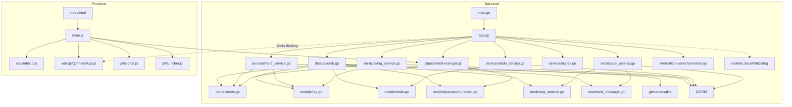

# Jot 项目分析报告

> 项目类型: 桌面端卡片式笔记应用（类小米笔记）
> 技术栈: Wails v2 + Go + GORM + SQLite + 原生 HTML/CSS/JS + CodeMirror 6（编辑器）+ einocli 薄适配层（eino 库驱动，OpenAI 兼容）

---

## 一、目录结构梳理

```
jot/                                    # 项目根目录
├── main.go                             # 【入口文件】Wails 应用启动入口，配置窗口/资源/绑定
├── app.go                              # 【核心文件】Wails 绑定层，暴露 95+ 个 Go API 给前端
├── go.mod                              # Go 模块定义，声明依赖版本
├── go.sum                              # Go 依赖锁文件
├── wails.json                          # Wails 项目配置（名称/构建脚本/作者）
├── AGENTS.md                           # 本报告文件
│
├── internal/                           # 【内部包】Go 子包统一目录
│   ├── agent/                          # Agent 执行引擎（ReAct 循环 + 工具注册 + 显式规划 + ask_user）
│   │   ├── agent.go                    # ReAct 循环 / 工具调用调度 / 代际事件（streamGen）发射 / 规划提示词
│   │   ├── registry.go                 # 内置工具注册表（按 Mode 过滤 + ToolMeta 声明）
│   │   ├── types.go                    # Agent 类型（Request/PlanState/Deps/Event 等）
│   │   ├── TOOLS.md / EVENTS.md        # 工具文档 / 事件文档
│   │   │   └── tools/                      # 内置工具实现（manage_note/ask_user/plan/recall_notes/read_url/read_note_section/json 三件套/manage_notebook/manage_tag/manage_todo/get_stats/current_time 共 15 个）
│   ├── aierrors/                       # AI 错误分类（errors.go：auth_error/rate_limit/server_error 等 11 类）
│   ├── config/                         # 路径工具（JotHomeDir/SubDir，~/.jot 下 data/backup/images/logs/mcp 五子目录）
│   ├── converter/                      # markitdown 封装：办公文件转 Markdown（7 种格式 + 60s 超时）
│   ├── einocli/                        # eino 薄适配层（chat.go/embedding.go/types.go，OpenAI 兼容客户端封装）
│   ├── markitdown/                     # 从 Go module cache 克隆的 markitdown 库本地副本（含 PDFium Stdout/Stderr Discard 修复）
│   ├── database/                       # SQLite 初始化 + 种子数据
│   │   ├── db.go                       # SQLite 初始化（glebarez/sqlite 驱动，底层 modernc.org/sqlite v1.51）+ WAL + 优化 PRAGMA + DefaultDBPath() + blank import 注册 sqlite-vec 扩展 + 孤儿列清理
│   │   ├── models.go                   # GORM 模型 AutoMigrate 注册入口
│   │   ├── builtin_profiles.go         # 内置 API 预设服务商定义（DeepSeek/智谱 GLM/Ollama/Agnes 等 12 个），InitDB 时按 Name 去重增量插入
│   │   ├── builtin_mcp_servers.go      # 内置 MCP 服务器定义（Tavily/AnySearch/知乎/Context7 等），InitDB 时按 Name 去重增量插入
│   │   └── builtin_prompts.go          # 内置技能提示词种子
│   ├── fontutil/                       # 跨平台系统字体枚举（fonts_windows/Linux/Darwin/fc）
│   ├── mcpserver/                      # MCP 客户端（官方 modelcontextprotocol/go-sdk）+ 连接池与预热
│   │   ├── client.go                   # 三传输（stdio/sse/http）+ 协议版本协商 + headerRoundTripper 鉴权注入
│   │   ├── pool.go                     # 连接池（Warmup/Reconcile/WarmupOne/getOrCreate/断线自动重连）
│   │   ├── tools.go                    # ListTools/CallTool 封装（InputSchema → eino ParamsOneOf）
│   │   └── config.go / MCP_CONFIG.md   # MCP 服务器配置结构 / 配置文档
│   ├── models/                         # GORM 实体层
│   │   ├── note.go                     # Note 实体（笔记，含 3 个排序/过滤命名索引）
│   │   ├── tag.go / notebook.go        # Tag 实体 / 笔记本实体
│   │   ├── setting.go                  # Setting 实体（KV 配置）
│   │   ├── password_record.go / todo.go  # 密码记录 / 待办实体
│   │   ├── note_vector.go              # NoteVector 实体（笔记切块向量索引，按 note_id+chunk_index 索引）
│   │   ├── ai_session.go               # AI 会话实体（标题/置顶/时间戳/摘要 SummaryContent/SummaryMsgCount）
│   │   ├── ai_session_config.go        # AI 会话操作栏配置（模型/深度思考/搜索源/Mode 三态/卡片召回/引用/技能，与 AISession 一对一）
│   │   ├── ai_message.go               # AI 消息实体（角色/内容/思维链/Meta chip 字段，外键关联 SessionID）
│   │   ├── ai_prompt.go                # AI 提示词实体（技能提示词数据库存储）
│   │   ├── api_profile.go              # API 配置预设实体（名称/服务商/URL/Key，无 is_builtin）
│   │   └── mcp_server.go               # MCP 服务器配置实体
│   └── services/                       # 业务服务层
│       ├── note_service.go             # 笔记 CRUD + 搜索 + 置顶 + 回收站 + 统计 + 导入导出 + VACUUM 瘦身 + GetAllIDs
│       ├── notebook_service.go / tag_service.go / setting_service.go  # 笔记本/标签/配置读写
│       ├── ai_service.go               # AI 业务层（einocli 客户端，OpenAI 兼容 + 流式 + 深度思考 + 会话/消息持久化 + 对话摘要 + Token 计算 + 上下文注入）
│       ├── todo_service.go             # 待办 CRUD + 按状态批量删除（DeleteUnfinished/DeleteCompleted/DeleteAll）
│       ├── password_service.go / password_generator.go  # 密码管理 CRUD/搜索（escapeLike 转义）/批量删除 + 密码生成器
│       ├── profile_service.go / stats_service.go / log_service.go  # API 预设 CRUD / 统计 / 日志服务
│       ├── vector_service.go           # 笔记向量索引（IndexNotes/GetIndexStatus/Count*/DeleteAllVectors）+ sqlite-vec 函数式召回 VectorRecall（SQL 内余弦距离 + 笔记本过滤 + 相邻块补充）
│       ├── chunk.go                    # 文档切块（600 rune 上限 + 元数据前缀注入（标题/标签/创建时间）+ 段落聚合 + 多级标题栈 + 围栏代码块保护 + 块首父级链补全）
│       ├── recall_service.go           # 召回结果类型与合并/截断工具（RecallCard/CardRecallResult/MergeRecallCards/Truncate*Preview）
│       ├── mcp_server_service.go / mcp_import.go  # MCP 服务器 CRUD / 导入导出
│       ├── crypto.go                   # 敏感密钥 Base64 编码/解码工具（(zk) 前缀标识）
│       └── types.go                    # 通用类型（PaginatedResult/DataStats/ImportResult/SettingsConfig/RecallNotebookIDs 等）
│
├── frontend/                           # 【前端目录】Wails 前端（Vanilla + Vite）
│   ├── index.html                      # 入口 HTML，10 个视图 + 关于浮层
│   ├── package.json                    # 前端依赖（Vite 3.x + CM6 ~16 包 + marked + highlight.js + @codemirror/lang-* 6 包 + @codemirror/legacy-modes）
│   ├── src/
│   │   ├── main.js                     # 【核心文件】前端逻辑（CM6 集成 + 搜索弹窗 + MD 语法页面 + AI 对话 + TOC + 回到顶部 + 批量管理 + 设置统一重构 + 锁屏密码 + 标签管理 + 导航切换；数据管理页/回收站页/常量工具函数/通知类/密码管理/启动器/待办清单已拆分为独立模块）
│   │   ├── js/                         # 【JS 模块目录】
│   │   │   ├── cm6-syntax-highlight.js # CM6 通用语法高亮模块（13 套配色 + 46+ 语言解析器映射 + 围栏代码块嵌套解析 mdCodeLanguages + 行内代码标记插件 markdownInlineCodePlugin）
│   │   │   ├── editor-actions/        # 编辑器操作菜单分组模块目录
│   │   │   │   ├── format.js          # 格式化操作项（JSON/XML/HTML/CSS/JS/SQL/CSV/YAML/TOML 各含格式化+压缩 + SQL 辅助函数 compactSQL/convertSQLCase）
│   │   │   │   ├── text-transform.js  # 文本转换操作项（7 项）
│   │   │   │   ├── text-clean.js      # 文本清理操作项（5 项）
│   │   │   │   ├── encode-decode.js   # 编码解码操作项（6 项）
│   │   │   │   └── md-syntax.js       # MD 语法插入操作项（22 项，type: 'insert' 模式）
│   │   │   ├── editor-actions.js      # 编辑器操作菜单模块（聚合导入各分组模块 + 菜单渲染/交互/执行引擎，main.js import 引入）
│   │   │   ├── data-management.js      # 数据管理页面模块（10 个函数 + reloadSettings，从 main.js 提取）
│   │   │   ├── trash-page.js           # 回收站页面模块（6 个函数，从 main.js 提取）
│   │   │   ├── ai-chat.js              # AI 对话模块（自实现聊天引擎 + 流式输出 + Markdown 渲染 + 多会话管理 + 侧栏折叠 + 多来源搜索 + 卡片召回（含笔记本选择菜单）+ 引用笔记 + 上传文件 + 拖拽上传 + 更多技能 + 双语言翻译方向组件 + 语言选择浮层 + 技能激活时禁用更多技能按钮 + 用户消息编辑/删除/重新发送 + 会话统一菜单（置顶/重命名/导出/删除）+ 分块渲染 + Token 显示 + 提示词迁移 + 会话切换一次性渲染+同步滚动消除跳跃 + 会话配置持久化同步 + 替换消息操作统一后端原子方法 + 分页懒加载消息 + 模式三态切换 + 悬停提示 JS portal）
│   │   │   ├── constants.js            # 图标常量 SVGS + 工具函数（formatTime/highlightText/getSummary/debounce，从 main.js 提取）
│   │   │   ├── notification.js         # NotificationManager 通知类 + window.showNotification 全局函数 + 模拟数据（getMockNotes/getMockTags，从 main.js 提取）
│   │   │   ├── launcher.js             # 启动器模块（Ctrl+P 全局浮层 / 13 项功能导航 / pinyin-pro 三路拼音匹配 / 4 列网格 / 键盘四方向导航 / 弹性动画）
│   │   │   ├── password-manager.js     # 密码管理模块（完整 CRUD / 搜索 / 批量操作 / 右键菜单 / 复制/打开链接 / Base64 编码 / 搜索高亮 / 静默渲染 + pmLoadSeq 防乱序 + 密码生成器 + 强度算法）
│   │   │   ├── calendar.js             # 笔记日历模块（日历网格渲染 / 墨水圆点统计 / 本月摘要统计 / 按日笔记列表 / 回到今天 / 点击笔记跳转 / 切月自动重置今天）
│   │   │   └── preview-worker.js       # Web Worker 离线程 Markdown 渲染（从 src/ 移入）
│   │   └── css/                        # 【CSS 模块化目录】原 style.css + app.css 拆分
│   │       ├── index.css               # 入口文件，@import 引入所有子文件（设计系统 → 组件）
│   │       ├── variables.css           # 11 主题 CSS 变量：`--bg`/`--accent`/`--text-primary` 等
│   │       ├── reset.css               # 全局 reset（box-sizing/body 边距/overscroll-behavior）
│   │       ├── scrollbar.css           # 统一滚动条 6px 细条 + 自动隐藏 + 透明轨道 + 主题变量联动（含主内容区/搜索/AI 对话消息列表）
│   │       ├── animations.css          # 28 个 keyframes + 通用工具类 `.anim-*` + stagger 延迟
│   │       └── components/
│   │           ├── topbar.css          # 顶栏（品牌/搜索框/窗口控制按钮/更多菜单含图标）
│   │           ├── main-content.css    # 主内容区布局（卡片网格/视图容器/滚动）
│   │           ├── sidebar.css         # 笔记本侧边栏三段式设计 + 折叠按钮
│   │   │   │   ├── editor.css          # 编辑器面板/CM6 主题/全屏/预览/代码块复制按钮（含 AI 消息代码块）
│   │           ├── dropdowns.css       # 右键菜单/更多菜单/下拉选择器
│   │           ├── modals.css          # 通用模态框/确认弹窗/覆盖层/快捷键页面样式（shortcut-row flex 水平布局）
│   │           ├── settings-panel.css  # 设置页分段控件/滑块/开关/按钮
│   │           ├── search-modal.css    # 搜索弹窗/结果列表/高亮
│   │           ├── data-view.css       # 数据管理页分类导航（左侧导航 + 右侧面板切换动画）+ 信笺统计 + 操作卡片
│   │           ├── md-reference.css    # MD 语法手册卡片源码/预览双栏对照
│   │   │   │   ├── ai-chat.css         # AI 对话页面（气泡/输入区/Markdown 渲染/打字指示器/会话侧栏/折叠按钮/滚动条自动隐藏/消息居中响应式宽度 clamp(800px,92vw,1600px)/40px 间距/更多技能菜单选中态+离场动画+翻译chip双语言布局/联网搜索 toggle 开关+召回笔记本菜单）
│   │           ├── todo.css            # 待办清单页面（FAB 浮动输入 + 两段式新增动画 + 行内编辑 + 保存涟漪 + 悬浮预览 Tooltip + 分类感知清空 + 8 个 @keyframes）
│   │           ├── launcher.css        # 启动器样式（全屏遮罩 + 4 列网格 + 卡片 + 弹性动画 + prefers-reduced-motion 降级）
│   │           ├── password-manager.css # 密码管理页样式（三栏布局 + hover accent 竖条 + 搜索高亮 + 批量操作栏 + 空状态 + 密码生成器对话框）
│   │           └── calendar.css        # 笔记日历视图样式（日历网格/墨水圆点/统计卡片/笔记列表/入场动画）
│   ├── wailsjs/                        # Wails 自动生成的 JS 绑定
│   │   └── go/main/
│   │       ├── App.js                  # 后端 API 的 JS 封装
│   │       ├── App.d.ts               # TypeScript 类型定义
│   │       └── models.ts              # Go 模型的 TS 类型
│   └── dist/                           # Vite 构建产物（前端编译输出）
│
└── .trae/specs/                        # 项目 Spec 文档目录
```

### 目录规范评价

| 维度 | 评价 |
|------|------|
| **分层清晰度** | 优秀。严格按 `models → services → database → app` 分层，前端后端隔离清晰 |
| **命名规范** | 良好。目录名使用复数形式（models/services），符合 Go 社区惯例 |
| **冗余目录** | 无。每个目录职责单一，无多余层级 |
| **待改进** | 无（frontend/dist 已在 .gitignore 中） |

---

## 二、核心功能模块识别

### 2.1 基础支撑模块

| 模块名称 | 核心功能 | 对应文件 | 核心依赖 |
|----------|----------|----------|----------|
| **数据库初始化模块** | SQLite 连接建立、连接池配置、AutoMigrate、blank import 注册 sqlite-vec 扩展 | `database/db.go` | glebarez/sqlite, GORM, modernc.org/sqlite/vec |
| **数据模型层** | Note/Tag/Setting/PasswordRecord/AISession/AIMessage/APIProfile/AIPrompt/AISessionConfig/Todo/NoteVector 实体定义、GORM tag 映射 | `models/note.go`, `models/tag.go`, `models/setting.go`, `models/password_record.go`, `models/ai_session.go`, `models/ai_message.go`, `models/api_profile.go`, `models/ai_prompt.go`, `models/ai_session_config.go`, `models/todo.go`, `models/note_vector.go` | GORM |
| **通用类型** | 分页返回格式、统计数据、导入导出结构 | `services/types.go` | 无外部依赖 |
| **Wails 绑定层** | Go API → JS Bridge，95+ 个绑定方法，含 runtime.SaveFileDialog | `app.go` | Wails v2 binding + runtime |
| **前端构建** | Vite 打包、Wails dev 热重载 | `frontend/package.json`, `wails.json` | Vite 3.x（保留，未移除）|
| **前端构建流程** | `wails build` 自动执行 `npm run build`（Vite）→ `frontend/dist/`，再嵌入 Go 二进制 | `go:embed all:frontend/dist` | 前端构建和后端编译都由 `wails build` 一条命令完成 |
| **字体枚举** | Windows GDI EnumFontFamiliesW 系统字体枚举 | `fontutil/fonts_windows.go` | gdi32.dll / user32.dll (syscall) |
| **配置存储** | KV 结构配置读写（字体偏好等） | `services/setting_service.go` | GORM |
| **内置 MCP 服务器** | 内置 MCP 服务器模板（Tavily/AnySearch/知乎三服务/Context7），InitDB 时按 Name 去重增量插入 | `database/builtin_mcp_servers.go` | GORM |
| **路径工具** | `~/.jot` 根目录统一解析（data/backup/images/logs/mcp 五个子目录），数据库默认路径 `~/.jot/data/jot.db` | `internal/config/config.go:JotHomeDir()/SubDir()`，`database/db.go:DefaultDBPath()` | `os.UserHomeDir()` |
| **办公文件转换器** | 封装 markitdown 库，将 .docx/.pdf/.xlsx 等 7 种办公文件转为 Markdown 文本，带 60s 超时保护 | `internal/converter/converter.go` | github.com/conductor-oss/markitdown

### 2.2 业务核心模块

| 模块名称 | 核心功能 | 对应代码 | 核心输入 | 核心输出 |
|----------|----------|----------|----------|----------|
| **锁屏密码** | SHA-256 哈希验证 + 设置/修改密码 | `app.go:VerifyScreenLockPassword/SetScreenLockPassword` | 密码明文 | bool/错误 |
| **密码管理** | 完整 CRUD + 搜索 + 批量删除 + 右键菜单 + 复制/打开链接 + 搜索高亮 + Base64 编码（`(zk)` 前缀）+ 列表/详情分离传输（列表不含密码字段）+ 密码生成器（前端随机生成 + 强度评级 + 批量复制）| `services/password_service.go` + `app.go`（7 个绑定）+ `frontend/src/js/password-manager.js` | 名称/用户名/密码/URL/备注 | 密码记录 CRUD 结果 |
| **笔记 CRUD** | 创建/更新/查询/删除笔记 | `services/note_service.go` | 标题/内容/颜色/ID | Note 对象/错误 |
| **笔记搜索** | 标题+内容 LIKE 模糊搜索，支持 3 种排序（updated_at/created_at/title，均 pinned DESC 优先）| `note_service.go:Search()` | 关键词/分页/sortBy 参数 | 笔记列表+总数 |
| **笔记置顶** | 切换置顶状态 | `note_service.go:TogglePin()` | 笔记 ID | 更新后的笔记 |
| **回收站** | 软删除/查看/恢复/永久删除 | `note_service.go:Delete/GetTrash/Restore/PermanentDelete` | 笔记 ID | 操作结果 |
| **批量回收站操作** | 全部恢复/全部清空 | `note_service.go:RestoreAll/EmptyTrash` | — | 操作结果 |
| **标签管理** | 标签 CRUD | `services/tag_service.go` | 名称/颜色/ID | Tag 对象 |
| **笔记标签关联** | 为笔记添加/移除标签 | `tag_service.go:AddTagToNote/RemoveTagFromNote` | 笔记ID+标签ID | 操作结果 |
| **按标签筛选** | 通过标签 ID 查询笔记 | `note_service.go:GetByTag()` | 标签ID/分页参数 | 笔记列表+总数 |
| **数据统计** | 统计笔记总数/回收站数/标签数 | `note_service.go:GetStats()` + `tag_service.go:Count()` | — | DataStats 对象 |
| **数据导出为 .db** | 导出为 SQLite 数据库文件（VACUUM INTO + fs.CopyEx）| `app.go:ExportDataWithDialog()` | — | "导出成功" 提示 |
| **数据导入** | 从 JSON 文件导入笔记（跳过同名） | `note_service.go:ImportFromJSON()` | JSON 字节数组 | ImportResult 对象 |
| **前端卡片渲染** | 卡片网格展示 | `frontend/src/main.js` | 笔记数据数组 | DOM 渲染 |
| **前端编辑器** | 笔记编辑模态框（CM6 编辑器，支持行号/撤销重做/查找替换/Tab缩进/自动补全/自动闭合括号/Markdown 语法高亮） | `frontend/src/main.js` | 笔记数据/用户输入 | 保存/取消 |
| **前端查找替换** | CM6 search panel，Ctrl+F 查找 / Ctrl+H 查找替换，选中内容自动填充搜索框，预览模式自动切回编辑模式搜索 | `frontend/src/main.js:handleKeyboardNavigation()` | 搜索关键词 | 搜索面板匹配导航 |
| **前端搜索交互** | 搜索弹窗 200ms 防抖自动搜索，支持标题/内容/标签（多标签 AND 语义过滤）、笔记本/日期/排序筛选器（排序 3 选项：更新时间/创建时间/名称，均 pinned 优先） | `frontend/src/main.js` | 关键词 + 过滤条件 + sortBy | 搜索弹窗结果列表 |
| **笔记日历视图** | 日历导航（上/下月切换） + 创建时间墨水圆点统计（1/2-5/6+ 三档） + 按日笔记列表 + 点击笔记原地打开编辑器查看模式 | `frontend/src/js/calendar.js` + `frontend/src/css/components/calendar.css` + `services/note_service.go:GetByDate/GetMonthCounts` + `app.go:GetNotesByDate/GetMonthNoteCounts` | 年月参数/日期字符串 | 按月统计 map / 按日笔记列表 |
| **前端导航切换** | 网格/搜索/设置/数据管理/回收站/AI 助手视图切换 | `frontend/src/main.js:switchView()` | 视图名称 | 视图 DOM 切换 |
| **前端右键菜单** | 右键弹出菜单（查看/编辑/置顶/删除） | `frontend/src/main.js` | 鼠标事件+笔记ID | 菜单显示/操作 |
| **前端只读查看** | 左击笔记打开只读查看器 | `frontend/src/main.js:openEditor()` | 笔记 ID | 只读查看模态框 |
| **编辑器操作菜单** | 顶栏「操作」按钮下拉菜单，配置驱动操作注册表（EDITOR_ACTIONS 数组按分组拆分到 `frontend/src/js/editor-actions/` 模块，主文件聚合导入），当前含 5 个分组：格式化（JSON/XML/HTML/CSS/JS/SQL/CSV/YAML/TOML 各含格式化+压缩，SQL 另有关键字大小写共 18 项）、文本转换（大写/小写/首字母大写/驼峰式/蛇形式/行反转/字符反转 7 项）、文本清理（去除多余空格/去除空行/行尾空格清理/Tab↔空格 5 项）、编码解码（Base64/URL/HTML 各含编码+解码 6 项）、MD 语法（22 项，`type: 'insert'` 插入模式：有选中包裹选中文本、无选中在光标处插入样板）。支持选中文本或全文处理 + Ctrl+Z 撤销 + 查看模式隐藏 + 预览模式隐藏。无 subGroup 的项直接铺平在分组下，有 subGroup 的渲染为嵌套子菜单。 | `frontend/src/js/editor-actions.js` + `frontend/src/js/editor-actions/*.js` + `frontend/src/main.js`（import + els 注册 + window.cmEditor 暴露） | 选中文本或全文 | 格式化/转换/清理/编码解码/MD 样板结果 |
| **标签搜索** | 点击标签 chip 打开搜索弹窗并预选该标签筛选器 | `frontend/src/main.js:searchByTag()` | 标签 ID | 搜索弹窗结果列表 |
| **键盘快捷键** | Ctrl+F 编辑器搜索 / Ctrl+H 编辑器查找替换 / Ctrl+N 新建 / Ctrl+L 编辑器切换模式 / Ctrl+P 启动器菜单 / PgUp/PgDn 滚动 / Ctrl+Home/End / Ctrl+0 锁屏 | `frontend/src/main.js:handleKeyboardNavigation()` | 键盘事件 | 对应操作 |
| **版本号信息** | 返回 verman.V.GitVersion 纯版本号 | `app.go:GetVersion()` | — | 版本字符串 |
| **打开外链** | 调用 runtime.BrowserOpenURL 在默认浏览器打开链接 | `app.go:OpenProjectURL()` | URL 字符串 | — |
| **打开数据目录** | 在文件管理器中打开 `~/.jot/data/` | `app.go:OpenDataDir()` | — | explorer 文件管理器 |
| **一键备份** | 备份当前库到 `~/.jot/backup/jot-backup.db`（覆盖）| `app.go:BackupToDir()` | — | 备份成功提示 |
| **一键还原** | 从 `jot-backup.db` 还原并刷新笔记/标签/统计 | `app.go:RestoreFromDir()` | — | Toast 提示结果 |
| **外观设置** | 字体族下拉选择（搜索+键盘导航）+ 字体大小滑条（10-32px 实时预览）+ 主题选择（11 种）+ 主题预览迷你 UI 卡片 | `frontend/src/main.js:loadFontSettings/applyFontFamily/applyFontSize` + `loadThemeSetting` | 字体名称/大小/主题名称 | 更新 CSS 变量 |
| **AI 对话** | einocli 薄适配层（eino 库）驱动 OpenAI 兼容流式对话（自实现聊天引擎 + Markdown/代码高亮渲染 + 多会话管理/置顶/重命名/导出/统一菜单 + 引用笔记 + 上传文件 + 更多技能 + 双语翻译 + 用户消息编辑/删除/重新发送 + 用户消息 Meta Chip（引用/文件/技能可视化）+ 大消息截断折叠 + Agent 工具（内置工具 + MCP 工具 + 工具级开关）+ ask_user 反问机制 + 联网搜索（MCP 驱动，含内置服务器 Tavily/AnySearch/知乎/Context7）+ 卡片召回（sqlite-vec 向量召回）+ 对话摘要持久化 + Token 显示 + 后端统一上下文注入 + 分页懒加载消息 + 会话自动恢复 + MCP 连接池与预热 + 输入区自适应 + 三栏合并（引用/技能/文件）） | `services/ai_service.go`+ `einocli/` + `internal/agent/` + `internal/mcpserver/` + `frontend/src/js/ai-chat.js`+ `frontend/src/css/components/ai-chat.css` | 用户消息 | AI 流式回复 |
| **向量召回** | 笔记切块向量化（`chunk.go` 标题链拼接 + `IndexNotes` 先删后插幂等嵌入）后由 sqlite-vec 函数式检索——`vec_distance_cosine` SQL 内余弦距离 + `vec_f32` 解析 query 向量 JSON，`dist < 1.0` 过滤 + 距离升序 TopN；支持指定笔记本（JOIN notes 过滤）或全部笔记；命中块补充前后各 1 相邻块并按笔记合并卡片（召回块完整注入，已去掉单卡截断，由 ai_card_recall_limit 控制总量）；embedClient/模型未配置或当前模型无向量数据时静默跳过 | `services/vector_service.go:VectorRecall` + `services/chunk.go` + `models/note_vector.go` | 用户问题 query + 可选笔记本 ID 列表 | CardRecallResult（FormattedText 注入 system message + Cards 前端展示） |
| **AI 配置管理** | Base URL/API Key/Model 的读写 + 连通性测试 + 模型列表获取 | `app.go:GetAIConfig/SaveAIConfig/TestBaseURL/FetchAIModels` | 配置项 | 配置/测试结果 |
| **统一通知系统** | NotificationManager 单例类，右上角浮动通知，4 种类型 + undo 撤销 | `frontend/src/js/notification.js` | 消息/类型/回调 | 通知 DOM 创建与自动销毁 |

### 2.3 模块分层图

```
┌─────────────────────────────────────────────────────┐
│                    Frontend                          │
│  (main.js / css/index.css / index.html)               │
│   ├─ 视图渲染 (卡片/搜索/设置/数据管理/回收站/AI/MD 语法/日历/待办/密码管理)     │
│   ├─ 交互逻辑 (事件绑定/状态管理)                      │
│   └─ Wails Bridge (window.go.main.App.*)              │
└────────────────────────┬────────────────────────────┘
                         │ Wails Binding (JSON 序列化)
┌────────────────────────▼────────────────────────────┐
│              App 层 (app.go)                         │
│  95+ 个绑定方法（CRUD/搜索/置顶/回收站/统计/导入导出/路径/│
│    AI 配置/会话管理/消息管理/笔记本回收站/配置文件预设)    │
│  (含 runtime.SaveFileDialog 原生对话框调用)            │
└────────────────────────┬────────────────────────────┘
                         │
              ┌──────────┼──────────┐
              ▼          ▼          ▼
    ┌─────────────┐ ┌──────────┐ ┌──────────────┐ ┌──────────────┐ ┌──────────────┐
    │ NoteService │ │TagService│ │  TodoService │ │PwService     │ │  AI Service  │
    │ (CRUD/搜索/ │ │(CRUD/关联)│ │ (CRUD/切换   │ │(CRUD/搜索/   │ │ (AI 流式对话 │
    │  置顶/回收站 │ │          │ │  完成/删除   │ │  批量删除    │ │  会话管理    │
    │  统计/导入   │ │          │ │  按状态清空) │ │  编码/搜索   │ │  消息持久化) │
    │  导出)      │ │          │ │              │ │  高亮)       │ │              │
    └──────┬──────┘ └─────┬────┘ └──────┬───────┘ └──────┬───────┘ └──────┬───────┘
           │              │             │                │                │
           └──────┬───────┴──────┬──────┴──────┬─────────┴──────┬─────────┘
                  │              │             │                │
                  ▼              ▼             ▼                ▼
        ┌─────────────────┐ ┌──────────┐ ┌─────────────────┐ ┌─────────────────┐
        │    GORM ORM     │ │GORM ORM │ │   GORM ORM     │ │   GORM ORM     │
        │ (数据访问层)      │ │(待办层)  │ │ (密码管理层)    │ │ (AI 模型层)     │
        └────────┬────────┘ └────┬─────┘ └────────┬────────┘ └────────┬────────┘
                 │               │                 │
                 └───────────────┴─────────────────┘
                                    ▼
                          ┌─────────────────┐
                          │     SQLite      │
                          │ (glebarez/sqlite│
                          │  纯 Go 驱动)     │
                          └─────────────────┘
```

---

## 三、模块间依赖关系分析

### 3.1 依赖关系详表

| 依赖方 | 被依赖方 | 依赖类型 | 依赖详情 |
|--------|----------|----------|----------|
| `app.go` | `database` | 编译依赖 | 调用 `database.InitDB()` 获取 `*gorm.DB` 实例 |
| `app.go` | `services` | 编译依赖 | 创建 `NoteService` / `TagService` / `TodoService` / `PasswordService` / `SettingService` 实例 |
| `app.go` | `models` | 编译依赖 | 返回 `*models.Note` / `*models.Tag` / `*models.Todo` / `*models.PasswordRecord` / `*models.Setting` 类型 |
| `app.go` | `runtime` | 编译依赖 | `runtime.SaveFileDialog` 原生保存对话框 |
| `app.go` | `fontutil` | 编译依赖 | `fontutil.GetFonts()` 枚举系统字体 |
| `services` | `models` | 编译依赖 | 操作 Note/Tag/Todo/Setting/AISession/AIMessage 结构体 |
| `services` | GORM | 编译依赖 | `*gorm.DB` 数据库操作 |
| `database` | `models` | 编译依赖 | `AutoMigrate(&models.Note{}, &models.Tag{}, &models.Todo{}, &models.PasswordRecord{}, &models.Setting{}, &models.AISession{}, &models.AIMessage{})` |
| `database` | glebarez/sqlite | 编译依赖 | 纯 Go SQLite 驱动 |
| `fontutil` | gdi32/user32 | 运行时依赖 | syscall 调用 Windows GDI API |
| `frontend/main.js` | `wailsjs/go/main/App.js` | 运行时调用 | `window.go.main.App.*` 调用后端 API |
| `frontend/wailsjs` | `app.go` | 构建时生成 | `wails generate module` 自动生成 |

### 3.2 依赖关系图（Mermaid）


```mermaid
graph TD
    subgraph Backend
        A[main.go] --> B[app.go]
        B --> C[database/db.go]
        B --> D[services/note_service.go]
        B --> E[services/tag_service.go]
        B --> TD[services/todo_service.go]
        B --> PW[services/password_service.go]
        B --> F[services/types.go]
        B --> AI[services/ai_service.go]
        B --> CV[internal/converter/converter.go]
        C --> G[models/note.go]
        C --> H[models/tag.go]
        C --> TD2[models/todo.go]
        C --> PR[models/password_record.go]
        C --> I[models/ai_session.go]
        C --> J[models/ai_message.go]
        D --> G
        D --> H
        E --> G
        E --> H
        TD --> TD2
        PW --> PR
        AI --> I
        AI --> J
        C --> K[glebarez/sqlite]
        D --> L[GORM]
        E --> L
        TD --> L
        AI --> L
        B -.-> M[runtime.SaveFileDialog]
    end

    subgraph Frontend
        N[index.html] --> O[main.js]
        O --> P[css/index.css]
        O --> Q[wailsjs/go/main/App.js]
        O --> R[js/ai-chat.js]
        O --> LA[js/launcher.js]
        O --> PW[js/password-manager.js]
    end

    B -.->|Wails Binding| Q
```

### 3.3 依赖问题分析

| 问题类型 | 描述 | 严重程度 |
|----------|------|----------|
| **循环依赖** | 无。所有依赖为单向 `main → app → services → models`，无循环 | ✅ 无问题 |
| **过度依赖** | 无。每个 Service 仅依赖 `*gorm.DB` 和自身模型 | ✅ 无问题 |
| **依赖缺失** | 无。`go.sum` 中所有传递依赖完整 | ✅ 无问题 |
| **隐式依赖** | 前端 `window.go` 对象依赖 Wails 运行时注入，本地开发/独立预览时不可用 | ⚠️ 有降级处理（Mock 数据） |
| **编译期依赖 vs 运行时依赖** | `wailsjs/` 目录需在修改 `app.go` 后重新生成 | ⚠️ 需手动执行 `wails generate module` |

---

## 四、设计模式与实现逻辑

### 4.1 设计模式识别

| 模式名称 | 应用位置 | 说明 | 代码示例 |
|----------|----------|------|----------|
| **Service Layer 模式** | `services/` 包 | 将业务逻辑从 controller（app.go）中抽离，封装为独立 Service 结构体 | `NoteService` / `TagService` |
| **依赖注入 (DI)** | `app.go` | Service 依赖的 `*gorm.DB` 通过构造函数注入 | `NewNoteService(db)` / `NewTagService(db)` |
| **Repository 模式** | `services/` 包内嵌 GORM | Service 内部直接使用 GORM 作为数据访问层 | `s.db.Create()` / `s.db.Where()` |
| **单例模式 (应用级)** | App 结构体 | Wails 运行时保证 App 实例唯一 | `NewApp()` 在 `main()` 中仅调用一次 |
| **MVC 变体** | 整体架构 | Model(models) - View(frontend) - Controller(app.go + services) 分层 | 见分层图 |
| **降级策略 (Fallback)** | `frontend/main.js` | 后端未绑定时自动使用 Mock 数据 | `if (!window.go.main.App.GetNotes) { state.notes = getMockNotes(); }` |
| **Wails Runtime 集成** | `app.go` | 通过 runtime 包调用原生桌面功能 | `runtime.SaveFileDialog()` 弹出系统保存对话框 |

### 4.2 核心业务逻辑流程

#### 4.2.1 笔记创建流程

```
用户点击 "+" 按钮 / Ctrl+N
  → openEditor(null)          // 打开空编辑器模态框
    → 用户填写标题/内容/选择颜色/选择标签
    → 点击"保存"按钮
      → createNote()
        → 前端校验（标题不为空）
        → window.go.main.App.CreateNote(title, content, color)
          → app.go:CreateNote()
            → noteService.Create()          // GORM db.Create(&note)
            → 返回 *models.Note（含 id）
          → 遍历 selectedTags
            → window.go.main.App.AddTagToNote(note.id, tagId)
              → tagService.AddTagToNote()   // GORM Association("Tags").Append
        → closeEditor()                     // 关闭模态框
        → loadNotes()                       // 重新加载笔记列表
          → GetNotes(1, 100)                // 分页查询
          → renderCardGrid()                // 渲染右侧卡片网格
```

#### 4.2.2 笔记搜索流程

```
Ctrl+F / Ctrl+K → 打开搜索弹窗
  → els.searchModalInput 自动聚焦
  → 用户输入文字 → 200ms 防抖
    → searchModalLoadPage(1, false)
```

...（中间流程不变）

---

## 五、技术栈评估

### 5.1 技术栈清单

| 层级 | 技术 | 版本 | 用途 |
|------|------|------|------|
| **桌面框架** | Wails v2 | v2.12.0 | 桌面窗口 + Go ↔ JS Bridge |
| **后端语言** | Go | go1.22+ | 后端业务逻辑 |
| **数据库** | SQLite | — | 本地数据存储 |
| **数据库驱动** | glebarez/sqlite | v1.11 | 纯 Go SQLite 驱动（无 CGO） |
| **向量检索** | sqlite-vec（modernc.org/sqlite/vec） | v0.1.9 | SQL 内余弦距离 vec_distance_cosine / vec_f32，函数式用法（非 vec0 虚拟表），blank import 自动注册 |
| **ORM** | GORM | v1.31.1 | 对象关系映射 |
| **前端构建** | Vite | v3.2.11 | 前端打包工具 |
| **前端技术** | 原生 HTML/CSS/JS | — | UI 渲染 |
| **编辑器** | CodeMirror 6 | @codemirror/view v6.43.0 | 笔记编辑器 |
| **Markdown 解析** | marked | v18.0.5 | Markdown → HTML 渲染 |
| **代码高亮** | highlight.js | v11.11.1 | 代码块语法高亮 |
| **Mermaid 图表** | mermaid | v11.16.0 | Markdown 代码块图表渲染（mermaid/render 子路径） |
| **拼音搜索** | pinyin-pro | v3.29.3 | 启动器三路拼音匹配（全拼/首字母/中文原文） |
| **AI 对话** | einocli 薄适配层（eino 库） | github.com/cloudwego/eino v0.9.13 + eino-ext（components/model/openai v0.1.13 + libs/acl/openai v0.1.17，底层 github.com/meguminnnnnnnnn/go-openai v0.1.2） | 流式对话/深度思考/多会话/联网搜索/卡片召回 |
| **本地存储** | localStorage | — | UI 状态持久化（主题/侧栏状态等） |

### 5.3 版本兼容性问题

| 问题 | 说明 |
|------|------|
| **Wails 版本锁定** | `go.mod` 中 `wails.io v2.12.0` 已固定，`wails/v2` 包需与 Wails CLI 版本匹配。升级需同步更新 CLI, go.mod, wails.json 三方 |
| **GORM AutoMigrate** | 新增模型（如 AISession/AIMessage）后需在 `database/db.go` 的 `AutoMigrate` 中注册，否则表不会自动创建 |

---

## 六、补充分析

### 6.1 性能关键点

| 关键点 | 现状 | 评估 |
|--------|------|------|
| **数据库查询** | GORM + SQLite，分页查询 | ✅ 满足笔记本规模 |
| **前端渲染** | 卡片网格渲染 | ✅ 性能良好 |
| **AI 流式输出** | 基于 Wails Events 逐块推送，不阻塞 UI | ✅ 体验优秀 |
| **CM6 编辑器** | 仅初始化当前编辑的笔记 | ✅ 性能良好 |
| **多会话切换** | 切换时从后端加载对应会话的消息，采用一次性同步渲染（无 yield）+ 同步滚动（`scroll-behavior: auto` 临时禁用），浏览器只绘制一次最终状态，彻底消除视觉跳跃。后端 `LoadAISessionMessagesPaginated` 在返回前端前已截断 `RecallCards`/`SearchSources` 的 Content 为 200 字，减小 Wails 桥传输量和 DOM 渲染开销 | ✅ 切换瞬间完成，无任何中间状态闪烁 |

### 6.2 异常处理分析

| 异常场景 | 处理方式 |
|----------|----------|
| **后端 API 不可用** | 前端 Mock 数据降级 |
| **AI API 调用失败** | HTTP 状态码封装为 11 种分类中文提示（auth_error/rate_limit/server_error 等），通过 `ai:stream-error` 事件以 JSON 格式（`{category, user_msg, raw}`）传递到前端，解析后通过 `showNotification()` 右上角通知展示，不再插入对话流中 |
| **联网搜索失败** | 每个搜索来源独立发射错误事件 `ai:search-error`，不影响其他来源继续搜索；前端通过 `showNotification()` 提示用户 |
| **数据库损坏** | 备份还原机制 |
| **办公文件转换失败** | 60s 超时保护 + `Warnw` 日志记录大文件/损坏文件，`Errorw` 记录转换异常；前端通过 `showImportResults()` 逐个显示文件错误详情 |
| **流式连接中断** | 前端监听 `ai:stream-error` 事件，显示错误提示 |
| **会话/消息查询失败** | 返回空列表 + 控制台错误日志，不阻断 UI |

### 6.3 安全分析

| 风险点 | 评估 |
|--------|------|
| **本地数据库** | SQLite 文件本地存储，无远程访问风险 |
| **API Key 存储** | Base64 编码存储在 DB 中，带 `(zk)` 前缀标识，前端读写均为解码后明文。仅防肉眼查看，非真实加密 |
| **XSS 风险** | AI 回复经 `marked.parse()` 渲染，`marked` 默认 Sanitize |

### 6.4 数据库优化

| 优化项 | 配置 | 说明 |
|--------|------|------|
| **WAL 模式** | `PRAGMA journal_mode=WAL` | 允许并发读取，写入不阻塞读取，显著提升多线程场景性能 |
| **busy_timeout** | `PRAGMA busy_timeout=5000` | 忙等待超时 5 秒，避免 "database is locked" 错误 |
| **synchronous** | `PRAGMA synchronous=NORMAL` | WAL 模式下 NORMAL 级别安全且性能比 FULL 快得多 |
| **cache_size** | `PRAGMA cache_size=-8000` | 8MB 页面缓存（负值表示 KB 单位） |
- 初始化位置：`internal/database/db.go` 的 `InitDB()` 函数中，`SetMaxOpenConns(1)` 之后
- PRAGMA 执行失败不影响初始化流程（忽略错误），由调用方统一处理错误日志
- 导入/还原场景需清理 WAL 残留文件（`-wal`/`-shm`），防止旧文件干扰新数据库，清理逻辑在 `app.go` 的 `replaceDatabase()` 函数中

---

## 七、项目核心特点

### 核心设计理念

1. **Wails v2 跨平台桌面应用**：Go + 原生前端（HTML/CSS/JS）架构，兼顾后端性能和前端灵活性

2. **CodeMirror 6 编辑器集成**：主流 Markdown 编辑器引擎，支持行号/撤销重做/查找替换/Tab缩进/自动补全/语法高亮（13 套配色 + 46+ 语言）

3. **CSS 变量主题系统（11 主题）**：全局 CSS 变量联动（`--bg`/`--accent`/`--border` 等），一键切换 11 套系统主题 + 13 套代码高亮主题，所有组件自动适配。2026-07 完成配色全面重构——每套主题重新设计 `--bg`/`--card-bg`/`--bg-secondary` 等核心颜色值，E 护眼/深色/浅色等主题彻底重做，共修改 ~140 个变量

4. **三步交互范式**：笔记本（容器）→ 笔记卡片（列表）→ 编辑器（操作），符合直觉的文件夹-文件-编辑结构

5. **AI 对话引擎（einocli 薄适配层 + eino 库）**：基于 eino（components/model/openai）实现 OpenAI 兼容统一接口，通过 einocli 薄适配层对外暴露，支持 DeepSeek、通义千问等兼容端点（已移除 Ollama 原生协议）。流式输出 + Markdown 渲染 + 代码高亮 + 思维链折叠 + 多会话管理 + 侧栏折叠 + 多来源联网搜索（Tavily/知乎/全网搜索，含全选/全取消开关）+ 卡片召回（含笔记本选择菜单）+ 引用笔记 + 更多技能 + 用户消息编辑/删除/重新发送 + Token 统计 + **后端统一上下文注入**。API 连接通过设置页预设管理配置与持久化。

6. **统一的通知系统**：NotificationManager 单例，右上角浮动通知，支持 success/error/warning/info 四种类型 + undo 撤销

7. **过度动画与交互反馈**：28 个 keyframes、stagger 延迟、hover 分层反馈、spring 弹性缓动、骨架屏 shimmer、分段滑块弹簧曲线（`cubic-bezier(0.34, 1.56, 0.64, 1)`，全局 `--anim-easing-spring: cubic-bezier(0.16, 1, 0.3, 1)`）、字体滑条实时预览

8. **无 UI 框架依赖**：无 Vue/React/Svelte，纯手写 DOM 操作，极致轻量

9. **Mermaid 图表渲染集成**：为 Markdown 代码块中的 `language-mermaid` 块提供按需渲染，默认显示源码，点击渲染按钮后直接主线程渲染 SVG。切换按钮与复制按钮风格统一，CSS `:has()` 处理双按钮防碰撞

10. **密码管理功能页**：独立视图，Base64 编码（`(zk)` 前缀）+ 列表/详情分离传输（列表不含密码字段，仅详情返回明文）+ 7 个 Wails 绑定 + escapeLike LIKE 转义防注入 + 静默重渲染（`.pm-no-enter` 跳过入场动画）+ pmLoadSeq 代际计数器防乱序 + 搜索高亮 + 右键菜单 + 批量操作 + 复制/打开链接 + **密码生成器**（前端 `crypto.getRandomValues` 安全随机 + 评级上限+长度阶梯强度算法 + 对话框配置长度/数量/字符类型 + 逐条/批量复制）

11. **启动器（Launcher）Ctrl+P 拼音搜索**：全屏浮层 4 列网格导航，pinyin-pro 懒计算 + Map 缓存拼音索引，三路降级匹配（中文原文 → 全拼 → 首字母），空格压缩支持分词输入，13 个功能项覆盖全部视图入口，四方向键盘导航 + 弹性动画 + prefers-reduced-motion 降级。

### 设计系统

- **尺寸**：`--radius-md`(8px) / `--radius-sm`(6px)，全局统一
- **间距**：4px 基线网格，组件内部 8-16px，布局 16-24px
- **阴影**：4 层 Token — `elevated`(卡片) / `dropdown`(下拉菜单) / `modal`(模态框) / `toast`(通知)
- **语义色**：`--success`(绿) / `--warning`(黄) / `--error`(红) / `--info`(蓝)
- **字体**：全局统一 `var(--font-family)`，编辑器和代码块跟随系统设置
- **滚动条**：6px 细条，`--scrollbar-thumb` / `--scrollbar-thumb-hover` 联动 11 主题
- **圆角一致性**：所有交互元素（按钮/卡片/输入框/下拉菜单/模态框）均使用 `var(--radius-sm)` 或 `var(--radius-md)`，无硬编码

---

## 九、关键记忆点

1. **Wails v2 事件驱动流式输出**：AI 回复流式传输使用 `runtime.EventsEmit`（Go 端）+ `EventsOn`（前端），Go 端 `bufio.Reader` 逐行解析 SSE `data: {...}` 流，经回调（`onChunk`/`onThinking`/`onDone`/`onError`）逐块推送。前端 `startStreaming()` 统一注册事件监听并返回 `unsubXxx` 清理函数，**所有 AI 流式事件（chunk/thinking/tool-status/plan/ask-user/done/error）首参携带 `streamGen` 代际 ID，回调按 `streamGen !== myGen` 丢弃过期流**，防止多请求串流（取代早期 onSend 一次性回调 + 局部变量隔离的旧方案）。详见 [ai-chat.js](frontend/src/js/ai-chat.js) `startStreaming()`

2. **思维链折叠**：深度思考模型返回 `delta.reasoning_content`，Go 端在 `streamChoice.Delta` 中解析此字段，通过 `onThinking` 回调和 `ai:stream-thinking` 事件推送。前端创建 `<details class="ai-thinking">` 可折叠区域（summary + 内容），首次 thinking chunk 懒创建，后续流式追加，`addMessage()` 也接受 `reasoningContent` 参数用于显式渲染

3. **AI 消息持久化 + 后端原子替换 + 消息懒加载（会话消息全链路）**：`AISession`+`AIMessage` GORM 模型（`ai_session.go`/`ai_message.go`），`SaveAIMessages()` 保存一轮对话并自动生成标题（取首条用户消息前 30 字），`LoadAISessionMessages()` 按 `CreatedAt` 升序返回历史，`ClearAISessionMessages()` 清空会话。**后端原子替换**：编辑/删除/重发/重新生成四操作的 DB 写入合并为后端 `ReplaceAISessionMessages(sessionID, messages)` 单次调用（GORM Transaction 保证清空+写入原子性，前端 `chatHistory` 为空时 fallback 到 ClearAISessionMessages）。**懒加载 + 上下文自取**：`CallAIAgentStream` 仅接收 userText 和元数据，后端自行从 DB 加载全部历史构建上下文；`LoadAISessionMessagesPaginated` 分页加载（游标 `beforeID` 默认 6 条 ASC）；编辑/重发/再生用基于 `msgID` 的 `TruncateAISessionAfterMessage` 截断、删除用 `DeleteAIMessage`（仅删单条）；Token 显示改后端 `SumSessionTokens`+`GetSessionContextTokens`；`stream-done` 事件 9 参数（含 userMsgID/assistantMsgID）。详见 [ai_service.go](internal/services/ai_service.go)、[app.go](app.go)、[ai-chat.js](frontend/src/js/ai-chat.js)

4. **AI 对话侧栏 + 折叠机制**：左右分栏布局（`.ai-chat-layout`），左侧 `.ai-session-sidebar`（220px），右侧 `.ai-chat-content` flex:1。折叠按钮（`.ai-sidebar-toggle`）为 14×44px 纤细条状，置于侧栏外作为兄弟元素，通过兄弟选择器 `~` 控制 `left` 定位（展开时 220px、折叠时 0）。展开时按钮左侧加 `border-left: 1px solid var(--border)` 延续分割感。折叠状态 `localStorage` 持久化，CSS `transition: width 0.25s ease` 动画。SVG Chevron 图标（Lucide 风格）替代 Unicode 字符

5. **`onAIChatViewActivated` 惰性加载**：仅在 `activeSessionId === null`（无活跃会话）时自动加载第一个会话，视图切换不重置当前会话状态，避免切换回来后消息错乱。`switchSession()` 按 `msg.role` 遍历渲染，`Message` 结构体含 `ReasoningContent` 字段

6. **消息渲染与气泡**：`addMessage()` 创建消息气泡 DOM，AI 侧使用 `marked.parse()` 渲染 Markdown（含 `hljs.highlightElement()` 代码高亮），用户侧以 `<pre class="ai-user-msg">` 转义纯文本。打字指示器内嵌到 `msg-content` 内部（不独立建气泡）

7. **联网搜索（MCP 迁移后）**：内置 Tavily/知乎多源搜索已整体移除（含 `web_search`/`refine_search_query` 工具与 `search_service.go`/`zhihu_search_service.go`/`query_refiner.go`）。Agent 的联网能力由 MCP 服务器工具提供（`mcp_{服务器名}_{工具名}`，装配见 agent.go 的 MCPServerDB 分支）；搜索结果以工具返回文本进入正文。**搜索来源面板展示已移除**（历史消息不再解析 `search_sources`，`LoadAISessionMessagesPaginated` 置空该字段，DB 数据保留）；**召回卡片展示保留**（`recall_notes` 本地检索经 `ai:agent-result`/`renderRecallCards` 展示，历史回放同样显示）。

8. **前端 Agent 工具状态展示**：`ai:tool-status` 事件实时展示工具调用状态条（含 MCP 工具，`ActionText` 文案"调用 {服务器} 的 {工具}"）；`ai:ask-user` 反问面板；`ai:agent-result` 回传搜索来源/召回卡片/工具调用链供 `stream-done` 落库与渲染。

9. **切换会话性能优化（分块渲染）**：`switchSession()` 中对大量历史消息采用分块渲染策略（CHUNK_SIZE=5），每块渲染后 `setTimeout` 0ms yield 给浏览器，避免一次性渲染大量 DOM 导致卡顿。移除 `collapseActionsIfNeeded` 同步调用（该函数已删除，不再需要布局抖动补偿）。详见 [ai-chat.js](frontend/src/js/ai-chat.js) `switchSession()`

10. **延迟语法高亮（deferHighlight）**：`renderMarkdown()` 新增 `deferHighlight` 参数，历史消息加载时使用 `deferHighlightBlocks()` 通过 `requestIdleCallback` 渐进式执行 `hljs.highlightElement()`，优先级低于首次渲染，优先保证页面交互。详见 [ai-chat.js](frontend/src/js/ai-chat.js)

11. **重置出厂设置修复集**：①`resetDatabase()` 清空 `#aiChatMessages.innerHTML` 和 `#aiSessionList.innerHTML` 避免旧数据残留；②`onAIChatViewActivated()` 中清除标题/contextSize/chatHistory/sessions/activeSessionId 等模块级变量；③重置后自动调用 `onAIChatViewActivated?.()` 让 AI 助手模块立即进入就绪状态，消除闪烁。详见 [data-management.js](frontend/src/js/data-management.js)、[ai-chat.js](frontend/src/js/ai-chat.js)

12. **全局链接系统浏览器打开**：在 `main.js` 的 `initEventListeners()` 中添加 `document` 级 click 事件委托，拦截所有 `<a>` 标签点击，通过 `e.preventDefault()` + `window.runtime.BrowserOpenURL(href)` 在系统默认浏览器中打开。排除 `#` 锚点链接和 `javascript:` 伪协议。同时移除了 `ai-chat.js` 中 `messagesEl` 级别的区域委托和搜索来源面板中的冗余 `link.addEventListener` 代码。详见 [main.js](frontend/src/main.js#L5131-L5138)

13. **SQLite WAL 模式 + 优化 PRAGMA**：`InitDB()` 中配置 `journal_mode=WAL`、`busy_timeout=5000`、`synchronous=NORMAL`、`cache_size=-8000`。PRAGMA 执行失败不中断初始化，由调用方统一记录日志。`replaceDatabase()` 中清理 `-wal`/`-shm` 残留文件防止导入/还原数据损坏。详见 [db.go](internal/database/db.go)、[app.go](app.go)

14. **基础 System Prompt 三层重构 + 技能注入修复**：将单句硬编码基础 prompt 拆分为包级常量 `baseIdentity`（身份层）、`baseNormsBoundaries`（规范层+边界层）、`baseSystemPrompt`（完整三层，均在 [app.go](app.go)）。修复 `CallAIAgentStream` 中技能激活时跳过全部基础 prompt 的 Bug，改为始终注入规范层+边界层，仅身份层在技能激活时跳过。详见 [app.go](app.go)

15. **启动器网格（Launcher Grid）+ 拼音搜索**：新增 `Ctrl+P` 触发的全屏浮层启动器，13 个功能项 3 列网格布局。**pinyin-pro 拼音搜索**：`import { pinyin } from 'pinyin-pro'`（v3.29.3），懒计算 + Map 缓存拼音索引（`{ full: 全拼连续串, initials: 首字母串 }`），三路降级匹配（中文原文 `includes` → 全拼 `includes` → 首字母 `includes`），输入 `compact = trimmed.replace(/\s+/g, '')` 支持空格分词（如 "s z t" 或 "she zhi" 均命中"设置"）。**ES module 函数暴露**：launcher 调用的操作函数（`toggleSidebar`/`openShortcuts`/`showAbout` 等）需手动 `window.xxx = xxx` 暴露。**离场动画**：`executeAction` 先调 `closeLauncher(callback)` 等 `transitionend` 完成后再执行操作——离场涉及 mask 和 panel 共 4 条过渡属性，`transitionend` 会冒泡 4 次，需 `_closed` 守卫防止重复触发。**键盘导航**：四方向（ArrowUp/Down 按列跳转+首尾循环/ArrowLeft/Right 逐项+Tab 拦截），首次导航 `_selectedIndex === -1` 时直接跳第一项。动画用 `requestAnimationFrame` 双阶段，离场加 300ms `setTimeout` 保底。详见 [launcher.js](frontend/src/js/launcher.js)、[launcher.css](frontend/src/css/components/launcher.css)

16. **markitdown 库本地克隆 + Wails 构建 PDF 转换修复**：将 `github.com/conductor-oss/markitdown` 从 Go module cache 克隆到 `internal/markitdown` 进行本地维护，通过 `go.mod` replace 指令引用。修复 `wails build` 后 PDF 转换失败问题——根因是 Wails GUI 构建缺少有效控制台句柄，wazero 初始化 PDFium WebAssembly 时调用 `GetFileType /dev/stdout` 返回无效句柄错误。修复方案：在 `initPdfiumPool()` 的 `webassembly.Config` 中添加 `Stdout: io.Discard` 和 `Stderr: io.Discard`，避免 wazero 对无效句柄调用 `GetFileType`。详见 [internal/markitdown/converter_pdf_pdfium.go](internal/markitdown/converter_pdf_pdfium.go)、[go.mod](go.mod)

17. **全屏模式顶栏分割线隐藏**：编辑器进入全屏模式（`.editor-panel.fullscreen`）时，通过纯 CSS `:has()` 选择器（`.main-content-area:has(.editor-panel.fullscreen) #topbar`）将顶栏底部 `border-bottom-color` 设为 `transparent`，使顶栏与编辑器面板在视觉上融为一体，无分割线更加宽阔沉浸。利用 topbar 已有的 `transition: border-color 0.3s ease-out` 实现平滑淡出/恢复。零 JS 改动，纯 CSS 实现。详见 [editor.css](frontend/src/css/components/editor.css)

18. **sqlite-vec 函数式向量召回**：卡片召回已从 gse 关键词召回切换为 sqlite-vec 向量召回。`modernc.org/sqlite` 升级 v1.51.0（含 vec 子包 v0.1.9），[db.go](internal/database/db.go) blank import `_ "modernc.org/sqlite/vec"`（sqlite3_auto_extension 自动生效，测试包需自行 import）。[vector_service.go](internal/services/vector_service.go) `VectorRecall`：query 向量 JSON 数组字符串 + `vec_f32(?)` 解析、`vec_distance_cosine(embedding, vec_f32(?)) < 1.0` 过滤 + 距离升序 LIMIT TopN；**无条件 JOIN notes 过滤软删除笔记**（回收站不参与召回；列加 `note_vectors.` 前缀防 id 歧义，**JOIN 紧跟 FROM、位于 WHERE 前**，否则 `near "JOIN": syntax error`）；命中后二次查询全部块补相邻块并按笔记合并（召回块完整注入、无单卡截断，由 ai_card_recall_limit 控制总量）。embedClient/Model 空或模型无向量数据时静默跳过。**向量生命周期**：笔记永久删除（PermanentDelete/EmptyTrash/CleanExpiredTrash）联动清理 NoteVector（软删除不动向量）。测试教训：SQL 拼接测试必须完整复刻真实代码顺序。

19. **Agent 内置工具治理（黑名单开关 + 防御加固 + 写操作强制确认 + ask_user 强制调用）**：`ai_agent_tools_disabled` 黑名单（默认全注册，注册级过滤）控制内置工具；设置页「Agent 工具」下拉多选；Rnx.toml `fclint`（lint + validate:html）挂 frontend run_after。**防御加固**：`WrapWithError.InvokableRun` defer recover（panic→fail 不中断 ReAct）+ web_search goroutine recover；各工具补 `ctx.Err()` 检查；统一文本长度上限（`validateTextLen`：500/find 2000/正文 20000 rune）；read_note_section 整数校验；manage_tag TrimSpace；read_url `isPrivateHost` SSRF 防护（拒绝 loopback/私网/链路本地含 169.254.169.254/.local/.internal）；manage_note 扩展名校验。**写操作强制确认**：manage_note update/edit/pin/move/add_tag/remove_tag 六动作须带 `confirm=true`，否则返回引导文本提示 ask_user。**ask_user 强制调用**：信息模糊/多方案/需确认三类场景必须调用（app.go 提示词 + 工具 Desc 双通道约束）。详见 [registry.go](internal/agent/registry.go)、[context.go](internal/agent/tools/context.go)、[manage_note.go](internal/agent/tools/manage_note.go)、[ask_user.go](internal/agent/tools/ask_user.go)、[read_url.go](internal/agent/tools/read_url.go)、[read_note_section.go](internal/agent/tools/read_note_section.go)、[manage_tag.go](internal/agent/tools/manage_tag.go)、[app.go](app.go)、[Rnx.toml](Rnx.toml)

20. **manage_note 双模式扩展 + 新工具 read_url / read_note_section + meta.go 描述修正**：manage_note 新增 update（标题/扩展名，非空才更新对应字段）、edit 双模式互斥（find+replace 片段替换可作删除（find 优先精确匹配、空白差异自动归一化兜底，count 指定第几次、replace_all=true 全替换且与 count>1 互斥）/ line_start+line_end 行级替换含末尾追加（行号来自 view/read_note_section 的 line_numbers=true 输出，replace 空串即删行区间，line_start 大于总行数时为末尾追加语义））、file_ext 缺省 .md；read_url 基于 eino-ext URL Loader 抓取网页提取正文按 `ai_web_search_max_chars` 截断（仅放行 http/https、15s 超时、浏览器 UA）；read_note_section 分段续读大笔记（id/offset/length，view 超大截断时给出续读指引，line_numbers=true 输出全局行号）；view/read_note_section 的 line_numbers 行号前缀仅作行级编辑寻址坐标、不属于正文（复制片段用于 find 时不得包含行号）；meta.go Label 修正——工具描述与实际实现必须一致（曾声称有"删除"能力实际没有，已删除虚假描述，教训）。详见 [manage_note.go](internal/agent/tools/manage_note.go)、[read_url.go](internal/agent/tools/read_url.go)、[read_note_section.go](internal/agent/tools/read_note_section.go)、[meta.go](internal/agent/tools/meta.go)

21. **ask_user 同轮续答全链路（会话注册表 + 竞态防御 + 前端交互）**：`AgentService` 会话级注册表 `sessions map[uint]*agentSession`（LRU 上限 32），持 askCh（容量 1）/askPending/runMu（同会话串行化）/runCancel/ChatModel 缓存。**同轮机制**：`tools.AskWaiter`（`ClaimAsk` 原子抢占 + `WaitForAnswer` 阻塞）——ask_user ClaimAsk 成功 → 发射 `ai:ask-user` → 阻塞等待，答案经 `AnswerAskUser` 投递 → 工具返回 → **同一轮 ReAct 循环继续**（答案不落库为新用户消息）；`streamedContent` 累计本轮正文，反问轮整轮落库。**竞态防御**：ClaimAsk 原子抢占防并行挂起；`drainAsk` 排空陈旧答案；`ReleaseSession`/`ReleaseAll` 取消等待中 run 防僵尸；AI 流事件统一携带 streamGen 前端按代过滤。**前端**：`agentAskWaiting` 状态、气泡"等待你的回答…"、主输入框禁用（`setAskInputWaiting` + `.ai-ask-waiting` 遮罩）、面板提交走 AnswerAskUser、**× 关闭=取消本轮**、`stream-done` 用 `assistantMsgID`（取消=0）区分取消与完成、**取消不写 chatHistory**。详见 [agent.go](internal/agent/agent.go)、[context.go](internal/agent/tools/context.go)、[ask_user.go](internal/agent/tools/ask_user.go)、[app.go](app.go)、[ai-chat.js](frontend/src/js/ai-chat.js)、[ai-chat.css](frontend/src/css/components/ai-chat.css)

22. **Agent 工具扩展（json 三件套）+ 上下文窗口 20→40**：新增 json_validate/json_format/json_extract（`utils.InferTool` 结构体反射风格，**gjson v1.18.0 提取**——升级为直接依赖，原为传递依赖 v1.14.2；`normalizeGJSONPath` 归一化模型 JSONPath 写法：`$` 前缀、`[n]`→`.n`、`#` 通配符透传；对象/数组返回 `res.Raw` 保留源键序）；注册 registry.go + meta.go 文案（前端开关自动生效零改动）。上下文窗口默认 20→40：`GetContextWindowSize` 兜底 + [db.go](internal/database/db.go) 种子 + **旧库值 20→40 幂等迁移**（InitDefaultSettings 迁移区，该键无 UI 暴露，旧值即种子默认直接升级）。详见 [json_tools.go](internal/agent/tools/json_tools.go)、[registry.go](internal/agent/registry.go)、[meta.go](internal/agent/tools/meta.go)、[ai_service.go](internal/services/ai_service.go)、[db.go](internal/database/db.go)。注：summarize_text 已移除（Agent 自身可直接摘要上下文中的文本，无需额外工具调用）

23. **API 预设调整（移除自动创建默认配置 + 最终移除 is_builtin + 孤儿列清理）**：① 移除"无预设时自动创建『默认配置』"（app.go 启动迁移/SaveAllSettings/SaveAIConfig 三处 `CreateProfile` 全删；内置服务商 [builtin_profiles.go](internal/database/builtin_profiles.go) 保留照常插入；`SetActive` 死代码删除）。② `IsDefault` 曾改名 `IsBuiltin`（列 is_default→is_builtin），一度加"内置不可删"拒删 + 前端隐藏删除按钮。③ 最终**移除 is_builtin 全部逻辑**（内置/用户区分无意义，重启会重新插入内置服务商）：[api_profile.go](internal/models/api_profile.go) 删字段、`CreateProfile` 恢复三参、`DeleteProfile` 移除拒删、前端统一显示删除按钮、models.ts 删 is_builtin。④ **孤儿列清理**（[db.go](internal/database/db.go) `dropAPIProfileOrphanColumns`，AutoMigrate 后调用）：HasColumn 检查 `is_default`/`is_builtin` 存在则 DropColumn，幂等无需迁移标记。存量 api_profiles 8 列 → 6 列。详见 [api_profile.go](internal/models/api_profile.go)、[profile_service.go](internal/services/profile_service.go)、[builtin_profiles.go](internal/database/builtin_profiles.go)、[db.go](internal/database/db.go)、[app.go](app.go)

24. **笔记首页加载优化（移除骨架屏 + notes 索引 + 加载并行化）**：大库"骨架屏→闪烁→笔记重来"根因：① notes 默认排序 `pinned DESC, updated_at DESC` **无索引** → 全表 temp 排序（携带大 content 列）；② `loadNotes` 每次清空 cardGrid + cardEnter 全量重放；③ 启动链 loadSettings→loadNotebooks→loadNotes→loadTags 全串行。修复：[note.go](internal/models/note.go) 加 3 命名索引（`idx_notes_sort(pinned,updated_at)` / `idx_notes_notebook_deleted(deleted_at,notebook_id)` / `idx_notes_created`，AutoMigrate 重启自动补建）；[note_service.go](internal/services/note_service.go) `GetMonthCounts` 改 `[月初,下月初)` 范围查询走索引（**时区边界**：按本地时区，跨时区统计可能偏移一天）；[main.js](frontend/src/main.js) 移除骨架屏、`loadNotes` 不清空重载 + `renderCardGrid(hadCards ? 'none' : undefined)`（首次保留入场动画/刷新原地替换）、`init()` 启动链 `Promise.all` 并行化（loadNotes 仍严格在 activeNotebookId 兜底之后）；[index.html](frontend/index.html)/[main-content.css](frontend/src/css/components/main-content.css) 删首页骨架屏（编辑器 `editor-skeleton`、AI 引用骨架屏类名独立保留）。

25. **编辑器切换闪烁修复（openEditor/closeEditor 异步竞态 + 残留 + 预览 Worker 串扰）**：非 md 打开"先显 A 再变 B"根因：openEditor 阶段二 `Promise.all([GetNoteContent, GetAllTags])` 异步续体竞态（瓶颈常在 GetAllTags IPC，与笔记大小无关）+ closeEditor 200ms 延迟清理无取消（误关新面板）+ 标题/mdRendered 残留 + 预览 Worker 结果无请求标识。修复（[main.js](frontend/src/main.js) + [preview-worker.js](frontend/src/js/preview-worker.js)）：模块级 `editorOpSeq` 代际（openEditor/closeEditor 每次递增，异步续体与 200ms 清理校验代际不匹配则放弃）；阶段一无条件清空 mdRendered/标题/`_lastPreviewContent`；updateNote/createNote 保存后仅当仍是本笔记才 closeEditor；预览 `previewRenderSeq` 随 Worker 消息传递、过期结果丢弃。验证：wails dev 隔离空库 20 轮 txt→txt 零残留；localStorage 不含编辑器内容。

26. **AI 消息 Meta Chip 显示（用户引用/上传/技能可视化）**：AIMessage 新增 `Meta` TEXT 字段（JSON 数组，与 SearchSources/RecallCards/ToolCalls 同模式），存 `[{type:'ref'|'file'|'skill', id, title/name/label, notebook?, truncated?}]`；用户消息气泡末尾渲染 inline chip，assistant/系统侧 LLM 只看到纯 `Content`（meta 独立字段零污染）。**关键 bug 教训**：`addMessage` 纯 DOM 渲染，调用方需手动 push `chatHistory`——`sendUserText`/`handleResend` 漏掉会致取消编辑时 `chatHistory.find` 返 undefined、chip 消失。详见 [ai_message.go](internal/models/ai_message.go)、[ai_service.go](internal/services/ai_service.go)、[app.go](app.go)（`SaveAIMessage` 加 meta 参数 + `UpdateAIMessageMeta`）、[ai-chat.js](frontend/src/js/ai-chat.js)、[ai-chat.css](frontend/src/css/components/ai-chat.css)

27. **笔记搜索打分排序 + 搜索弹窗（筛选下拉超长截断 + 标签去井号）**：Ctrl+F 搜索弹窗按相关性打分排序（[note_service.go](internal/services/note_service.go) `buildSearchSortOrder`：完全相等 50 > 前缀 40 > 标题+内容 30 > 仅标题 25 > 仅内容 10，空关键词回退常规排序；标签/笔记本/时间筛选仅过滤不参与排序）。**GORM v1.31.1 坑**：`Order()` 传 `gorm.Expr` 被**静默丢弃**（查询无 ORDER BY，用户实测"搜『日志』标题命中不排前"）——必须返回 `clause.OrderBy{Expression: clause.Expr{...}}`；测试须打乱插入顺序防假阳性；`escapeLike` 转义 `\ % _` + `LIKE ? ESCAPE '\'` 4 处统一。**筛选下拉超长换行**（[search-modal.css](frontend/src/css/components/search-modal.css)）：filters 强制 `flex-wrap: nowrap` + 按钮 `min-width: 0`/`flex: 0 1 auto`（flex 子项 ellipsis 生效关键）+ `max-width: 160px` + 下拉固定 `width: 220px`；另修复下拉被 `.search-modal-content` `overflow:hidden` 裁剪（改 visible）、placeholder 误导文案（只搜标题/内容改"搜索笔记(标题/内容)..."）；标签下拉与选中按钮去 `#` 前缀（[main.js](frontend/src/main.js) `renderTagFilterDropdown`/`updateTagFilterLabel`，搜索项 chip 与 AI 引用面板保留 `#`）。验证教训：CSS/JS 改动必须 `npm run build` 或 wails dev 才生效。详见 [note_service.go](internal/services/note_service.go)、[note_service_test.go](internal/services/note_service_test.go)、[search-modal.css](frontend/src/css/components/search-modal.css)、[main.js](frontend/src/main.js)

28. **MCP 客户端迁移官方 modelcontextprotocol/go-sdk v1.7.0（替换 mark3labs/mcp-go + eino-ext）**：知乎 MCP SSE 服务器持续发服务端 ping，mcp-go SSE 客户端无服务端请求分支（不回 pong）导致超时，go-sdk 经 jsonrpc2 + ClientSession.handle 内置 ping/cancel 天然解决。[client.go](internal/mcpserver/client.go) 重写：stdio/sse/http 三传输 + `Connect` 自动协议版本协商（含降级 2024-11-05，protocolVersion 私有无法外部强制）+ **鉴权**：go-sdk transport 无 Headers 字段，自定义 http.Client 包装 `headerRoundTripper` 注入请求头（SSE GET/POST 均生效）；**会话生命周期**：`WithCancel` + 手动计时器实现握手超时（10s），**`defer cancel()` 会终止 SSE 长连接导致 EOF，连接生命周期绑定传入 ctx**。[tools.go](internal/mcpserver/tools.go)：`ListTools`/`CallTool` 替代 `mcpp.GetTools`，`InputSchema`→eino `ParamsOneOf`（无法解析降级无参数）。详见 [client.go](internal/mcpserver/client.go)、[tools.go](internal/mcpserver/tools.go)、[go.mod](go.mod)、[ping_test.go](internal/mcpserver/ping_test.go)（手写 SSE 服务器模拟知乎 ping）

29. **全局 MCP 连接池与预热机制（http/sse/stdio 常驻复用，替代每轮重建连）**：[pool.go](internal/mcpserver/pool.go) `mcpserver.Pool` 按 Name 持有预热会话（stdio 子进程常驻）：`Warmup`（并发 3 槽位，**per-name in-flight 信号串行化同名建连**防并发重复拉进程）/`Reconcile`（关不在列表条目 + 预热剩余）/`WarmupOne`（发消息兜底现场连接）/`getOrCreate`（指纹 `serverFingerprint` 变化自动关旧重连）/`Close`/`CloseAll`；**断线自动重连**——`Session.callTool` 检测连接类错误自动重建一次并重试，Close 后拒绝重连；`Session` 加锁保护 cli 替换。装配：agent.go `Deps.MCPPool`，Run 时统一 `Pool.Session` + `WarmupOne` 兜底，**移除每轮 OpenSession + defer Close**；app.go `WarmupMCPServers()`（内部 Reconcile）+ shutdown/rebuildServices 关旧池；前端首次进入 AI 助手预热（`mcpWarmupDone` 防重复）+ 设置页操作后同步预热，汇总一条通知。详见 [pool.go](internal/mcpserver/pool.go)、[tools.go](internal/mcpserver/tools.go)、[agent.go](internal/agent/agent.go)、[app.go](app.go)、[main.js](frontend/src/main.js)、[ai-chat.js](frontend/src/js/ai-chat.js)

30. **AI 会话持久化对话摘要（窗口 20 条 + 增量更新 + 同步阻塞生成）**：将纯滑动窗口截断（简单丢弃 40 条外消息）升级为**持久化对话摘要**方案。AISession 新增 `SummaryContent`（text）/ `SummaryMsgCount`（int），数据库持久化（[ai_session.go](internal/models/ai_session.go)）。**触发规则**：`diff = 当前总消息数 - SummaryMsgCount`，`diff ≥ 20` 时触发。首次生成（消息 21）取前 1 条，增量更新（消息 41/61...）取上次摘要终点到当前尾部 20 条之前的 20 条消息，合并旧摘要生成新摘要，`SummaryMsgCount` 更新为当前总消息数。**同步阻塞**：摘要在 `truncateAIMessages` 中同步生成（非 goroutine），确保当前轮对话就能用到新摘要，发 `ai:summary-status:generating/done` 事件给前端状态条。**提示词优化**：每条消息截断到 500 字，提示词要求"每条消息 1~2 句话概括，不要大段复制原文"。详见 [ai_service.go](internal/services/ai_service.go)（GenerateSessionSummary + UpdateSessionSummary + buildSummaryPrompt）、[app.go](app.go)（truncateAIMessages 重构）、[ai-chat.js](frontend/src/js/ai-chat.js)（summaryGenerating 状态 + 事件监听）

31. **密码管理功能页（列表/详情分离传输 + Base64 编码 + 修复 + 样式打磨）**：独立视图。后端：`PasswordRecord` 模型（name/username/password/url/note + GORM 软删除）、`PasswordService`（CRUD+Search+BatchDelete）、7 个 Wails 绑定。**传输安全分离**：列表返回 `PasswordListItem` DTO（仅 ID/名称/用户名/URL），密码不出现在列表；详情 `GetPasswordRecord(id)` 解码明文。**编码**：Base64 + `(zk)` 前缀（可逆编码非加密），存量无前缀值原样返回，启动自动迁移。**前端**：三栏布局 + 防抖搜索（250ms）+ 高亮 `<mark>` + 添加/编辑对话框 + 详情（掩码+显隐）+ 一键复制（clipboard+execCommand 降级）+ 打开链接 + 右键菜单 + 批量操作 + ESC 层级关闭。**修复**：Enter 连按守卫、`pmLoadSeq` 代际防乱序、`escapeLike` 转义、模板残留改 createElement。详见 [password_service.go](internal/services/password_service.go)、[password_record.go](internal/models/password_record.go)、[crypto.go](internal/services/crypto.go)、[password-manager.js](frontend/src/js/password-manager.js)、[password-manager.css](frontend/src/css/components/password-manager.css)

32. **待办清单大幅优化（零重渲染 + FAB + 两段式动画 + 分类感知清空 + 行内编辑 + Tooltip）**：**零重渲染**——toggle/delete/add 全部绕过 `loadTodos()` 全量 innerHTML，直接操作 DOM（prepend/remove），统计独立 `refreshTodoStats()`。**addTodo 两段式**：已有条目 `translateY` 下移 → rAF 插新条目清 transform，350ms 时序精控。**toggleTodo 原地切换**：全部筛选直接切类+移位置（完成移底/取消移顶），筛选模式 exit 动画后 remove。**FAB**：44px 圆形按钮展开 300px 内联面板（textarea+Enter 提交），旋转 45° 变 X，外部/Escape 收起。**行内编辑**：双击进 textarea，Enter 保存/Escape 取消/失焦自动保存，保存播放涟漪动画。**分类感知清空**：按筛选（active/done/all）切换清空范围，后端 `ClearTodosByFilter` switch 分发，文案随分类变化。**Tooltip**：600ms 防抖全文预览。**启动提醒**：异步检测未完成数，支持锁屏延迟。详见 [main.js](frontend/src/main.js)、[todo.css](frontend/src/css/components/todo.css)（8 个 @keyframes）、[todo_service.go](internal/services/todo_service.go)（DeleteUnfinished/DeleteCompleted/DeleteAll）

33. **Agent 显式规划 + AI 模式三态（create_plan/update_plan + Chat/Agent/Plan 切换）**：显式规划——后端两个规划工具（[plan.go](internal/agent/tools/plan.go)）+ `Context.PlanState` 跨轮保存 + `GenModelInput` 每轮注入计划状态/进度/ask_user 提醒 + 结果兜底（漏 create_plan 自动补建单步计划、漏 update_plan 自动补标 done）；前端 `#aiPlanPanel` 悬浮可折叠面板 + ask_user 互斥 + stream-done 清理。模式三态——`PlanMode bool` 重构为 `Mode string`（chat/agent/plan，默认 agent）：DB 存量迁移 + 孤儿列清理；Chat 不注入工具规范；`ToolMeta.PlanOnly`（create_plan/update_plan）按模式过滤注册；前端 `#aiModeToggle` 三按钮切换 + 设置页 PlanOnly 禁用展示。详见 [agent.go](internal/agent/agent.go)、[plan.go](internal/agent/tools/plan.go)、[context.go](internal/agent/tools/context.go)、[registry.go](internal/agent/registry.go)、[types.go](internal/agent/types.go)、[ai_session_config.go](internal/models/ai_session_config.go)、[db.go](internal/database/db.go)、[app.go](app.go)、[ai-chat.js](frontend/src/js/ai-chat.js)、[index.html](frontend/index.html)、[ai-chat.css](frontend/src/css/components/ai-chat.css)、[settings-panel.css](frontend/src/css/components/settings-panel.css)、[TOOLS.md](internal/agent/TOOLS.md)

34. **HTTP API 调用工具 http_request + 共享 SSRF 防护客户端（ssrf.go 统一三层防护）**：新增 `http_request` 内置工具（标准库 net/http 调用第三方 REST API，method 白名单 GET/POST/PUT/DELETE/PATCH，headers/body 可选，Content-Type 缺省 application/json、UA 缺省浏览器、4xx/5xx 原样返回不算工具失败、二进制 Content-Type 只提示类型、`ai_http_max_chars` 截断默认 5000、日志不含请求头防密钥泄漏、ActionText "请求 GET url"、重定向后输出"最终地址"行）。**抽出 [ssrf.go](internal/agent/tools/ssrf.go) 共享客户端**（read_url 与 http_request 共用 `newGuardedHTTPClient` 三层防护）：① validateHTTPURL 仅放行 http/https 公网地址；② CheckRedirect 逐跳 isPrivateHost（上限 10 次）；③ guardedDialContext 拨号期防护（LookupIPAddr 解析全部 IP 逐个黑名单校验、**直连已校验 IP** 防 DNS rebinding、多 A 记录逐个拨号容灾）+ limitBodyTransport 传输层 1MB 响应体限长。Transport 以 **DefaultTransport.Clone() 为底座**（裸构造 `&http.Transport{}` 会丢系统代理/HTTP2/TLS 超时等默认配置，曾导致环境变量代理失效）。**isPrivateHost 加固**：normalizeIPLiteral 归一化 inet_aton 数值编码 IP（0x7f000001/2130706433/0177.0.0.1/127.1 等不再绕过内网判定）+ 修复裸 IPv6（::1）被端口剥离逻辑截断成 ":" 漏判的既有 bug（单冒号才当 host:port 截断，多冒号裸 IPv6 直接判定）。**关键决策**：标准库不引三方库（重试由模型在 ReAct 循环承担，HTTP 层自动重试对非幂等方法有重复副作用）；内网/本机默认拒绝是业界主流（Claude/Dify/OpenClaw 默认禁，MCP 官方 fetch 未禁被视为漏洞）；代理模式下第③层校验的是代理地址（已知权衡写入 ssrf.go 文件头）；测试注入缝 buildClient(false)/skipURLGuard 零值全防护。详见 [ssrf.go](internal/agent/tools/ssrf.go)、[http_request.go](internal/agent/tools/http_request.go)、[read_url.go](internal/agent/tools/read_url.go)、[ssrf_test.go](internal/agent/tools/ssrf_test.go)、[registry.go](internal/agent/registry.go)、[meta.go](internal/agent/tools/meta.go)、[db.go](internal/database/db.go)

---

## 记忆点 1：Plan-and-Exec 解耦（预规划 + 执行分离 + 多 Bug 修复 + UnknownToolsHandler）

| 记忆点 | 内容 |
|--------|------|
| **变更概览** | 将 Plan 模式从"计划与执行在同一 ReAct 循环"重构为 **Plan-and-Exec 分离模式**：先单独调用 LLM 生成结构化计划，再进入 ReAct 循环执行。同时修复了多个长期存在的 Bug，增强了 Agent 健壮性。 |
| **预规划阶段（generatePlan）** | [agent.go](internal/agent/agent.go) 新增 `generatePlan()` 方法——Plan 模式下在 `Run()` 开头先单独调用 LLM：复用 `chatModel.WithTools()` 创建仅绑定 `create_plan` 的新模型实例，非流式 `Generate()` 获取结构化计划，通过 `ParseCreatePlanArgs` 解析 → 设置 `PlanState` + emit `ai:plan-created`。失败时返回 error 终止整个任务（用户看到"计划生成失败"提示）。[plan.go](internal/agent/tools/plan.go) 抽取 `ParseCreatePlanArgs()` 导出函数供 `generatePlan()` 复用。 |
| **执行阶段工具过滤** | [registry.go](internal/agent/registry.go) 新增 `planExecExcluded` 集合（`{"create_plan": true}`）——Plan 模式执行阶段不再注册 `create_plan` 工具，防止模型重复生成计划。`planOnlyTools` 仅保留 `update_plan`。Agent 模式完全不受影响。 |
| **ai:plan-generating 事件** | 后端在调用 `generatePlan()` 前 emit `ai:plan-generating` 事件通知前端"正在制定执行计划..."。前端 [ai-chat.js](frontend/src/js/ai-chat.js) 监听后将打字动画替换为旋转 spinner + 固定文字（`.ai-msg-plan-generating`）。`ai:plan-created` 到达时清空 contentDiv 移除状态文案。[ai-chat.css](frontend/src/css/components/ai-chat.css) 新增 `.plan-gen-spinner` 旋转动画。 |
| **Bug 修复合集** | ① **streamedContent 跨迭代累积**——外层 ReAct 循环开头 `streamedContent = ""` 重置，防止被拒内容通过兜底逻辑泄漏为最终回答；② **非流式路径缺少计划完成检测**——非流式 assistant 消息同样检查 `countPendingSteps`；③ **SkippedPlanUpdate 同轮多工具误触发**——改为按轮次跟踪 `currentIterCalledPlanUpdate` + `currentIterCalledNonPlanTool`，在下一个 assistant 消息到来时结算，消除工具执行时序不确定性；④ **genPlanHint nil 分支**——移除防御性引导文本（"必须先调用 create_plan"），改为返回空串，`GenModelInput` 中新增 `PlanState == nil` 检查直接报错终止。 |
| **UnknownToolsHandler** | [agent.go](internal/agent/agent.go) `ToolsConfig` 新增 `UnknownToolsHandler`——模型幻觉调用不存在工具时，框架返回友好错误提示而非崩溃，模型可自行调整策略继续执行。 |
| **关键设计决策** | ① 预规划失败直接终止任务（不降级到旧模式），因为失败意味着 API 配置或模型能力问题；② `create_plan` 保留用于预规划阶段（`generatePlan` 复用），执行阶段排除；③ 前端事件协议不变（`ai:plan-created`/`ai:plan-updated`），UI 零改动。 |
| **涉及文件** | [agent.go](internal/agent/agent.go)（`generatePlan`/`genPlanHint` 重构/`UnknownToolsHandler`/Bug 修复）、[plan.go](internal/agent/tools/plan.go)（`ParseCreatePlanArgs` 导出）、[registry.go](internal/agent/registry.go)（`planExecExcluded` 过滤）、[ai-chat.js](frontend/src/js/ai-chat.js)（`ai:plan-generating` 监听 + `ai:plan-created` 清理）、[ai-chat.css](frontend/src/css/components/ai-chat.css)（`.plan-gen-spinner` 样式）、[EVENTS.md](internal/agent/EVENTS.md)（新增 §5.0 事件文档） |

---

## 记忆点 2：计划生成阶段强化（可用工具列表注入 + 提示词智能拆解 + allStreamedContent 跨轮累积 + 多缺陷修复）

| 记忆点 | 内容 |
|--------|------|
| **变更概览** | 集中强化 Plan 模式的计划生成阶段与内容落库一致性：① 可用工具列表注入计划生成提示词；② 提示词紧凑化 + 智能拆解步骤数；③ 工具描述截断告警；④ MCP 工具加载逻辑提取为独立函数；⑤ `allStreamedContent` 跨轮累积修复落库与前端显示不一致；⑥ 三个逻辑缺陷修复；⑦ `tool_name` 强指导。 |
| **工具列表注入生成阶段（重要）** | 不把工具注册到 `generatePlan`（避免模型误调用、污染执行），而是将 `tools.BuiltinTools()` 的名称+描述拼接成字符串（**跳过 PlanOnly 工具与用户禁用工具**），注入 [agent.go](internal/agent/agent.go) `planGenSystemPrompt` 的 `{{.Tools}}` 占位符。工具描述超 `maxToolDescLen=80` rune 截断并 `Warnw` 告警（含工具名/原始长度）。这样模型知道有哪些工具可用，生成计划时能标注工具名。 |
| **提示词紧凑 + 智能拆解** | `planGenSystemPrompt` 精简且赋予判断能力：不再固定"≤10 步"，改为"根据需求复杂度合理拆解步骤（简单需求 2-3 步，中等 4-6 步，复杂 7-10 步）"；工具列表每行一条 `- 工具名: 描述`。 |
| **MCP 工具加载提取（loadMCPTools）** | 将 `Run()` 中约 110 行 MCP 加载逻辑提取为 [registry.go](internal/agent/registry.go) `loadMCPTools()` 独立函数（返回已过滤禁用工具的 `[]tool.BaseTool`，空列表提前返回，失败仅记录日志不中断调用方）+ `buildToolMetas()`（从工具列表提取名称/描述元信息供 generatePlan 拼接）。两者在 `Run()` 内联调用，`generatePlan` 现在能看到全部工具（含 MCP），与执行阶段工具来源一致。 |
| **allStreamedContent 跨轮累积（重要）** | 修复"计划模式落库内容与页面实时显示不一致、切换会话后消息内容变化"：`streamedContent` 每轮 ReAct 迭代开头重置、只保留当前轮，但前端 `ai:stream-chunk` 事件累积了所有轮次文本 → 落库只剩最后一轮。新增 `allStreamedContent` 跨轮累积变量（不随迭代重置，流式/非流式路径同步累积），最终兜底逻辑改 `finalContent == "" && allStreamedContent != ""` 时用其落库。**普通 Agent 模式无此问题**（模型通常在最后一轮输出最终回答、`finalContent` 正常设置，兜底不触发）。 |
| **三个逻辑缺陷修复** | ① **非流式路径计划未完成缺 continue**——只清空 `finalContent` 无 `continue`（流式路径有），补 `continue` + debug 日志统一行为；② **自动步骤完成检测前置条件不完整**——仅检查 `in_progress`，模型跳过 `update_plan` 直接调用业务工具时步骤卡在 `pending` → 扩展为 `in_progress \|\| pending`；③ **`create_plan` 加入 `planOnlyTools`**——此前普通 Agent 模式下 `create_plan` 仍注册，模型误调用会意外激活计划逻辑（`countPendingSteps`/`SkippedPlanUpdate` 等），现 create_plan/update_plan 均仅 Plan 模式可见。 |
| **tool_name 强指导（重要）** | 计划生成提示词升级为"每步描述简洁明确，**必须填写 tool_name**（使用可用工具列表中的工具名）"；`create_plan` 工具 `tool_name` 描述改为"建议填写，使用可用工具列表中的工具名"；`genPlanHint` 当前待执行步骤显示 `（建议工具：xxx）`——**强指导但不强制**（模型仍可根据实际调整工具选择）。 |
| **计划生成 debug 日志** | 生成前记录可用工具列表（`计划生成阶段：可用工具列表`）；生成后记录计划详情（goal/steps/detail，detail 含每步 ID/描述/工具名）。 |
| **涉及文件** | [agent.go](internal/agent/agent.go)（`planGenSystemPrompt`/`generatePlan`/`genPlanHint`/`allStreamedContent`/三缺陷修复/调试日志/`maxToolDescLen`）、[registry.go](internal/agent/registry.go)（`loadMCPTools`/`buildToolMetas`/`planOnlyTools` 扩展）、[plan.go](internal/agent/tools/plan.go)（`tool_name` 描述） |

---

## 记忆点 3：AI 回复期间交互锁定（工具栏 5 按钮 + 侧栏自动折叠禁用 + 计划提示词分级 + 打字动画过渡）

| 记忆点 | 内容 |
|--------|------|
| **变更概览** | 强化 AI 回复（流式）期间的交互管控与体验：① 新增统一锁定系统 `setToggleLocked`——回复期间锁定 5 个工具栏按钮（Agent/Plan 模式切换、深度思考、模型选择、更多技能、添加内容）与会话侧栏，视觉置灰 + 点击抖动 + Toast 提示；② 发送/重发/重新生成/编辑后发送时若侧栏未折叠则自动折叠，回复结束后还原流前状态；③ 计划模式系统提示词按任务复杂度分级拆解，避免小任务被强制拆步；④ 计划面板弹出后保留打字动画作为过渡。 |
| **锁定系统（setToggleLocked，重要）** | [ai-chat.js](frontend/src/js/ai-chat.js) 新增模块级 `setToggleLocked(locked)` + `shakeLockedToggle(el)`（shake 动画 + `animationend` 一次性清理）。生命周期挂钩恰 5 处：`startStreaming` 置 `isStreaming=true` 后上锁；停止按钮、`ai:stream-done`、`ai:stream-error`、`CallAIAgentStream` 同步异常 catch 四处解锁。锁定元素统一加 `is-locked` 类（置灰 + `cursor: not-allowed`，**不加 `pointer-events:none`**——保留点击以触发抖动反馈）。点击守卫统一模式：`if (isStreaming) { shakeLockedToggle(el); showNotification('回复进行中，暂时无法xxx'); return; }`。 |
| **锁定范围** | 工具栏 5 按钮：模式切换（`.ai-mode-btn`）、深度思考（`#aiChatSearchToggle`）、模型选择（`#aiChatModelTrigger`）、更多技能（`#aiChatMoreSkillsBtn`）、添加内容（`#aiChatAddBtn`，复用 `.ai-chat-toolbar-btn`）。会话侧栏：折叠按钮（`#aiSidebarToggle`，Ctrl+J 快捷键经 `toggleAISessionSidebar` 一并拦截）、新建会话（`#aiSessionNewBtn`）、清空对话（`#aiChatClearBtn`，原"自动取消流再清空"分支成为死代码已移除）、搜索框（`#aiSessionSearch` 原生 `disabled`）。锁定同时收起已展开的模型/技能/添加下拉与会话菜单。 |
| **侧栏自动折叠（重要）** | 发送/重发/重新生成/编辑后发送均经 `startStreaming` → `setToggleLocked(true)` 触发。模块级 `_preStreamSidebarExpanded` 记录流前展开状态：未折叠则 `classList.add('collapsed')` + 按钮 title 更新；回复结束后按流前状态还原（流前已折叠则保持折叠，不强行展开）。**不写 localStorage**——折叠是流内临时态，持久化偏好仅由手动折叠按钮 `window.toggleAISessionSidebar` 维护，避免流中途关闭应用污染用户偏好。 |
| **计划提示词分级** | [agent.go](internal/agent/agent.go) `planGenSystemPrompt` 增加任务分级：简单任务 1 步直接执行 / 常规 2-5 步 / 复杂 6-10 步 + "宁少勿多"总原则（复杂任务先核心后辅助、粒度均匀）；`create_plan` 工具 `tool_name` 参数描述改为"可选，仅当步骤依赖工具时填写"（[plan.go](internal/agent/tools/plan.go)），并移除"收到任何请求都应先调用本工具"的强引导——小任务不再被强制拆步。 |
| **打字动画过渡** | `ai:plan-created` 处理器清空 `contentDiv` 后重新挂载 `createTypingDots()`：计划面板弹出后到首个 thinking/chunk 到达前气泡持续显示打字动画，避免"空气泡无反馈"窗口；首个正文 chunk 到达时 `hasReceivedChunk` 置位 + `contentDiv.innerHTML=''` 天然替换打字动画，无需额外清理逻辑。 |
| **关键设计决策** | ① 用"类锁定 + 点击守卫"而非原生 `disabled`：`disabled` 阻断 click 事件、无法触发抖动反馈，且深度思考开关是 `div` 不支持；② 清空对话流式期间一并禁用（经用户确认保持禁用，需先停止再清空）；③ 会话条目/更多菜单因侧栏折叠不可见，`switchSession`/`createSession` 原有 `if (isStreaming) return` 守卫兜底；④ 润色流程走独立 `CallAI` 通道、不经过 `startStreaming`，不参与锁定；⑤ 审计确认 `isStreaming` 全文件仅 5 处赋值，锁/解锁无遗漏路径。 |
| **涉及文件** | [ai-chat.js](frontend/src/js/ai-chat.js)（`setToggleLocked`/`shakeLockedToggle`/`_preStreamSidebarExpanded`/5 处生命周期挂钩/6 个点击守卫）、[ai-chat.css](frontend/src/css/components/ai-chat.css)（`.is-locked`/`.is-shaking`/`ai-toggle-shake` keyframes/搜索框 `:disabled`）、[agent.go](internal/agent/agent.go)（`planGenSystemPrompt` 任务分级）、[plan.go](internal/agent/tools/plan.go)（`tool_name` 描述可选） |

---

## 记忆点 4：AI Chat 模式回归（Mode 字段统一 chat/agent/plan + 会话配置迁移 + 三档切换 UI）+ aierrors 增强（REASONING_REQUIRED 分类 + 未命中回填原始错误）

| 记忆点 | 内容 |
|--------|------|
| **变更概览** | ① 恢复 AI 助手 Chat 模式（单次请求直接回答、不调用工具），解决部分模型不支持深度思考/工具调用、本地模型跑不动 Agent 多轮循环的问题；模式控制从 `PlanMode bool` 重构为单一 `Mode` 字符串（`chat`/`agent`/`plan`），初始化数据库时自动迁移存量数据。② aierrors 错误分类增强：新增 `REASONING_REQUIRED`（模型**必须开启**深度思考，反向于已有的"不支持"场景）分类，并去掉未命中时的通用兜底文案、`UserMsg` 直接回填原始错误信息便于排查。 |
| **Mode 三态统一（重要）** | [ai_session_config.go](internal/models/ai_session_config.go)：`AISessionConfig.PlanMode bool` → `Mode string`（`gorm:"size:10;default:'agent'"`）；[ai_service.go](internal/services/ai_service.go)：`SessionConfig` 同步 `Mode string`，`CreateDefaultSessionConfig` 写 `"agent"`、`SaveSessionConfig` 写 `"mode"`、`LoadSessionConfig` 用 `modeOrDefault` 兜底（新增）。Agent 请求级 `Request.PlanMode`（bool）内部保持不变，仅判定改 `PlanMode: sessCfg.Mode == "plan"`。 |
| **存量数据迁移（重要）** | [db.go](internal/database/db.go) `InitDB`：AutoMigrate 后、`cleanupOrphanedData` 前一次性迁移——`HasColumn(&AISessionConfig{}, "plan_mode")` 时把 `plan_mode = 1` 的会话更新为 `mode = 'plan'`；孤儿列清单追加 `"plan_mode"`（字段移除后 AutoMigrate 残留列自动清理）。 |
| **Chat 模式实现（重要）** | [app.go](app.go) 新增 `CallAIStream`（单次流式入口，Chat 不注入任何工具规范）；共享上下文组装抽取为 `buildAIContextInstruction`（身份层 + 技能/角色扮演/引用/追问/上传 7 个逻辑块，与 Agent 流逐行一致——抽取需与原代码逐块核对，勿偷工减料）；Token 口径：`estimateUserTokens(messages) + estimateTokens(systemMsg)`（Chat 计入系统提示词）；前端 [ai-chat.js](frontend/src/js/ai-chat.js) `currentPlanMode`→`currentMode`（`'chat'|'agent'|'plan'`），[index.html](frontend/index.html) `#aiModeToggle` 三按钮两分割线，`syncModeToggle` 按 `btn.dataset.mode === currentMode` 高亮，`startStreaming` 按 `currentMode === 'chat'` 分流走 Chat 流。 |
| **aierrors REASONING_REQUIRED（重要）** | 新增分类 `CategoryThinkingRequired`（文案"当前模型必须开启深度思考才能回答，请在输入框上方开启深度思考开关后重试"）。**误判根因**：megumin `openai.RequestError`（400）在 `classifyOpenAIRequestError` 无 400 分支 → 直接兜底 `network_error`（显示"网络连接失败"误导用户）；且 `message: %!s(<nil>)`（`Err` 为 nil），真实错误码 `REASONING_REQUIRED` 只在 body 里。修复：`classifyOpenAIRequestError` 补 400（及 402/404）分支，末尾先 `classifyByText` 再 unknown；`classifyBadRequest(msg, code, raw)` 合并 message/code/raw 三文本匹配（覆盖 eino 路径 `Code` 字段与 RequestError body 两条来源）；匹配 `reasoning_required`/`thinking_required`/`必须开启深度思考`/`must enable thinking|reasoning`；`classifyByText` 兜底同款匹配。 |
| **未命中回填原始错误（重要）** | 去掉 `CategoryUnknown`（"AI 调用出错，请稍后重试"）与 `CategoryInvalidRequest`（"请求参数有误"）通用兜底文案；`NewAIError` 分类无映射时 `UserMsg` 直接 = `raw`（原始错误文本），前端 `if (errData.user_msg)` 原样弹出方便排查。真实网络错误仍由文本匹配（`connection refused`/`no such host` 等）命中 `network_error` 保留友好文案。 |
| **测试** | [errors_test.go](internal/aierrors/errors_test.go) 新增 7 个用例：RequestError(400, Err=nil, Body=REASONING_REQUIRED) 精确复现场景 / go-openai + eino APIError `Code` 路径 / 纯文本兜底 / 纯中文文案 / unknown 与 400-invalid_request 的 `UserMsg == raw` 断言。 |
| **涉及文件** | [internal/models/ai_session_config.go](internal/models/ai_session_config.go)、[internal/services/ai_service.go](internal/services/ai_service.go)、[internal/database/db.go](internal/database/db.go)、[app.go](app.go)、[frontend/index.html](frontend/index.html)、[frontend/src/js/ai-chat.js](frontend/src/js/ai-chat.js)、[internal/aierrors/errors.go](internal/aierrors/errors.go)、[internal/aierrors/errors_test.go](internal/aierrors/errors_test.go) |

---

## 记忆点 5：AI 模式按钮悬停提示（JS portal 重构解决层叠遮挡）+ 主题三处同步清理（one-dark-pro 残留移除 + default 色值统一）

| 记忆点 | 内容 |
|--------|------|
| **变更概览** | ① AI 模式切换按钮（Chat/Agent/Plan）新增悬停提示卡片（标题 + 特点 + 适用场景）：初版 CSS `:hover` 实现 → 发现层级被遮挡 → 重构为 **JS portal 方案**（挂 body + fixed + z-index 9999）；② 主题体系一致性清理：移除已删除主题 `one-dark-pro` 在前端内联配色与 Go 窗口色中的残留，统一 default 主题的窗口/首帧/最终三处背景色。 |
| **悬停提示初版问题（重要教训）** | 初版 tooltip 放在 `.ai-mode-btn` 内部、`z-index: 1000` 绝对定位。**但父级 `.ai-chat-input-area` 同时有 `z-index: 5` + `transform`，构成层叠上下文**——子元素 z-index 对外只按父级上下文生效（对外层级 = 5），导致 tooltip 被 `z-index: 1000` 的会话更多菜单等浮层遮挡。**教训：绝对定位浮层若父链存在 `transform` + `z-index` 组合，z-index 无法突破父级层叠上下文；纯 CSS 提高 z-index 无效，需脱离该上下文。** |
| **JS portal 重构（重要）** | [index.html](frontend/index.html) 在 `</body>` 前新增 `#aiModeTipPortal`（`position: fixed; inset: 0; z-index: 9999; pointer-events: none`），三种模式提示内容移入 portal（`data-tip` 区分，`aria-hidden` 不影响可访问性）；[ai-chat.js](frontend/src/js/ai-chat.js) `initModeTips()`：`mouseenter/mouseleave` 控制显示（锁定态 `is-locked` 时不显示）、定位基于 `getBoundingClientRect()` 浮点计算（水平防视口溢出自动向内偏移、垂直空间不足自动弹下方）、`ResizeObserver` 监听输入区（侧栏折叠动画/窗口缩放期间实时跟随）。 |
| **主题三处同步（重要）** | 系统主题配色实际分散在 **3 处**，维护必须同步（详见"十二、维护规范"第 9 条）：① [variables.css](frontend/src/css/variables.css) `[data-theme="..."]` 块（最终样式，唯一权威色值）；② [index.html](frontend/index.html) 头部内联 `criticalColors`（CSS 加载前的首帧背景，防闪烁）；③ [main.go](main.go) `themeBG()`（Wails 窗口背景色）。 |
| **本次清理内容** | ① `one-dark-pro`（已从主题注册表移除）：删除 [index.html](frontend/index.html) 内联 `criticalColors` 残留键 + [main.go](main.go) `themeBG` 残留 `case "one-dark-pro"` 分支；② default 色值统一：CSS default 为 `--bg:#F2EDE3 / --topbar-bg:#FCF9F2`，而 Go 窗口色（`#F7F5F0`）与内联首帧（`#F7F5F0/#FFFFFF`）不一致 → 全部统一为 `#F2EDE3 / #FCF9F2`，消除启动瞬间窗口底色→页面背景的色差闪烁。 |
| **涉及文件** | [frontend/index.html](frontend/index.html)（`#aiModeTipPortal` + 内联 `criticalColors`）、[frontend/src/js/ai-chat.js](frontend/src/js/ai-chat.js)（`initModeTips`）、[frontend/src/css/components/ai-chat.css](frontend/src/css/components/ai-chat.css)（`.ai-mode-tip-portal`/`.ai-mode-tip`）、[main.go](main.go)（`themeBG`） |

---

## 记忆点 6：文件导入重复检测与覆盖（标题+后缀匹配 + 时间对比 + 冲突弹窗 + 批量去重 + 导入锁）

| 记忆点 | 内容 |
|--------|------|
| **变更概览** | 为文件导入功能增加重复检测与覆盖机制，解决"同一文件反复导入产生重复笔记"问题。导入前按标题+后缀+笔记本查找已有笔记，根据文件修改时间与笔记更新时间对比自动覆盖或弹窗让用户选择。同时增加批量内同名文件去重（自动追加编号后缀）、导入期间拖入禁用、冲突弹窗交互优化等。 |
| **重复检测逻辑（后端）** | [note_service.go](internal/services/note_service.go) `FindByTitleAndExt(title, fileExt, notebookID)` 按三条件精确查询已有笔记（排除已删除）。[app.go](app.go) `processImportFile` 新增 `titleOverride` 参数：导入前先查找匹配笔记，获取文件 `info.ModTime()` 与笔记 `UpdatedAt` 对比——文件更新则自动覆盖（status: `updated`），笔记更新则返回冲突（status: `conflict`，附带 Content/FileExt/FileTime/NoteTime），时间相同则跳过（status: `skipped`）。无匹配则创建新笔记（status: `created`）。`FileImportResult` 扩展 `Status`/`FileTime`/`NoteTime`/`Content`/`FileExt` 字段。 |
| **冲突解决（后端）** | `ResolveImportConflict(noteID, overwrite, title, content, fileExt)` 处理用户选择：`overwrite=true` 调用 `Update` 覆盖笔记，`false` 标记跳过。`Update` 方法直接操作 DB（不 preload Tags）。 |
| **批量内同名去重（后端）** | `ImportFiles` 入口处按 `title+ext` 去重（办公文件统一 `.md`），首次出现正常处理，重复出现自动追加编号后缀（`readme` → `readme (2)` → `readme (3)`），通过 `titleOverride` 传入 goroutine，全部导入不跳过。 |
| **冲突弹窗（前端）** | [main.js](frontend/src/main.js) `showImportConflictDialog` 创建 `.import-conflict-overlay`（z-index 10000），支持逐个覆盖/跳过和全部覆盖/全部跳过。**FLIP 动画**：单条操作时先折叠移除（opacity+height 250ms），再用 `requestAnimationFrame` 双层帧驱动剩余条目平滑上移（250ms ease）。空文件条目标题左侧显示红色 `[空文件]` 小标签（`title` 悬停显示完整提示）。所有操作按钮点击后弹出二次确认框（z-index 10001），确认框 `focus()` 捕获键盘。 |
| **ESC 层级关闭** | 全局 `handleKeyboardNavigation` 中：确认框打开时 ESC 只关确认框（`stopPropagation`）；冲突弹窗打开时 ESC 关闭弹窗并显示"导入已取消"；点击遮罩空白处同 ESC 行为；导入完成后（所有条目处理完）弹窗自动关闭显示"导入完成"。 |
| **导入期间禁用（前端）** | 模块级 `_importing` 标志：`handleFileDropPaths` 入口置 true，所有完成路径（正常/冲突/取消/异常）清除。导入中拖入文件：遮罩变灰（`.disabled` 类）+ 文字改为"导入进行中，请稍候"，释放时弹通知不触发导入。Wails 绑定不可用时 guard 失败也清除标志防泄漏。 |
| **冲突计数修复** | 后端冲突项 `Success` 改为 `false`（原为 `true` 导致统计不准确）；前端对 `status === 'conflict'` 单独计数显示"冲突 N 个"。`close()` 传递 `resolved` 数组而非 `null`，确保全部跳过/全部覆盖后正确显示统计。 |
| **ESC 确认框层级教训** | 初版确认框与冲突弹窗无 `stopPropagation`，ESC 事件冒泡导致同时关闭两层。修复：确认框 `focus()` + `keydown` 中 `e.stopPropagation()`，全局处理函数用 `.confirm-dialog-overlay` 判断优先级。 |
| **涉及文件** | [internal/services/note_service.go](internal/services/note_service.go)（`FindByTitleAndExt`）、[app.go](app.go)（`processImportFile` 重构 + `ResolveImportConflict` + `FileImportResult` 扩展 + 批量去重）、[frontend/src/main.js](frontend/src/main.js)（`showImportConflictDialog`/`showImportResults` 改造 + `_importing` 锁 + `OnFileDrop`/`handleFileDropPaths` 防重入 + FLIP 动画）、[frontend/src/css/components/modals.css](frontend/src/css/components/modals.css)（`.import-conflict-overlay`/`.conflict-item`/`.empty-file-badge`/`.drop-overlay.disabled` 样式）、[internal/services/note_service_test.go](internal/services/note_service_test.go)（`FindByTitleAndExt` 测试） |

---

## 记忆点 7：Agent 工具调用折叠摘要条重构（统一折叠摘要 + 删淡出状态机 + 召回面板归位 + 计划卡片不落库决策）

| 记忆点 | 内容 |
|--------|------|
| **变更概览** | AI 助手 Agent 模式工具调用展示重构：流式实时与历史回放统一为**折叠摘要条**（`.ai-tool-summary`），彻底删除"逐行状态条 + 350ms 延迟淡出"状态机，从根上消除"工具条闪烁/记录丢失"竞态；召回卡片面板归位到工具面板下方（正文上方）；确认计划（plan）**不落库、不历史回放**，仅前端流式悬浮面板临时展示，并清理对应前端死代码。 |
| **折叠摘要条行为规则（重要）** | [ai-chat.js](frontend/src/js/ai-chat.js)：① 首次调用工具**默认折叠**（`showToolStatusStart` 不自动展开），header 显示"正在调用工具…"（`.is-working` 图标脉冲）；② 用户手动展开后**中途不自动收起**——正文 chunk、决策文本均不打断观察状态；③ 流结束（`ai:stream-done`）统一收起（移除 `.open` + 重置内联 `maxHeight: 0`），与历史回放折叠形态一致；④ 展开状态由 JS 内联 `maxHeight: 'none'/'0'` 控制，CSS 仅负责 opacity 过渡，无内部滚动。 |
| **工具行名与统计（重要）** | 工具行名统一「工具名 ×N」（`toolNameSeq` 同名计数，与历史回放一致）；header 完成后显示"已调用 N 次 · M 个工具"+ 失败/部分徽标（`_liveToolStats` 实时统计）。摘要条懒创建（`ensureToolSummary`）于正文上方（thinking 之下），header 点击切换 `.open` + `aria-expanded`。 |
| **正文/工具切换清理机制（重要）** | `tool_start` 时调用 `clearStreamedText()` 清除模型决策输出的中间文本（最终正文单独累积）；`clearStreamedText()` 中**重置 `hasReceivedChunk = false`**——这是修复"正文开始不收起摘要"的关键：决策文本曾提前置位 `hasReceivedChunk`，导致工具执行后的最终正文首 chunk 跳过收起逻辑。重置后最终正文首 chunk 重新走完整流程（清空占位/停思考计时/检查并收起摘要）。 |
| **召回面板归位（重要）** | `renderRecallCards` 内部优先插入 `.ai-tool-summary` 之后（正文上方，与工具调用同属"过程证据区"），无工具面板时 append 末尾；历史回放 `addMessage` 先 `renderToolCalls` 再 `renderRecallCards`（顺序依赖，工具面板须先存在）。流式路径同步简化（删除"插到操作栏之前"旧逻辑），消除流式/历史召回面板位置不一致。 |
| **计划卡片不落库决策（重要）** | 计划（plan）**不落库、不历史回放**，仅前端执行时输入框上方悬浮面板（`showPlanPanel`/`createPlanCard`）临时展示。数据链路现状：`models.AIMessage` 与 `services.Message` 均无 Plan 字段（保存/查询均不回传）。同步清理前端死代码：`renderPlanCard` 函数、`addMessage` 的 `plan` 形参及 JSDoc、历史加载两处调用实参 `msg.plan`；`createPlanCard` 因被悬浮面板复用而保留。 |
| **涉及文件** | [frontend/src/js/ai-chat.js](frontend/src/js/ai-chat.js)（`ensureToolSummary`/`updateToolSummaryHeader`/`showToolStatus*`/`clearStreamedText`/`handleStreamChunk`/`renderToolCalls`/`renderRecallCards`/`unsubToolStatus`/`unsubDone`/`addMessage` 清理）、[frontend/src/css/components/ai-chat.css](frontend/src/css/components/ai-chat.css)（删除 `.ai-tool-status-list-live`/`.exiting`/分隔虚线，新增 `.is-working` 脉冲与折叠高度控制） |

---

## 记忆点 8：AI 气泡过程证据区重设计（极简单行样式 + 思维链真实计时重构 + 折叠行为对齐）

| 记忆点 | 内容 |
|--------|------|
| **变更概览** | AI 消息气泡顶部"过程证据区"（思维链/工具记录/召回卡片）重设计：三个组件去掉"盒子感"（border+背景+圆角），统一为**极简单行元数据**样式（hover 才高亮、展开仅细分割线）；思维链 header 图标配色与右侧箭头对齐工具/召回；思维链实时计时重构为**思考段累计计时**（仅实际推理期间累加，工具执行不计时），修复"决策文本提前结束计时/假终态/时间变空"多个 bug；思维链折叠行为对齐工具摘要（默认折叠、不持久化偏好、流结束若展开则折叠）。 |
| **极简单行样式（重要）** | [ai-chat.css](frontend/src/css/components/ai-chat.css)：`.thinking-details`/`.ai-tool-summary`/`.recall-cards-panel` 移除 `border+background+border-radius`，仅 `margin: 2px 0`；header padding 压至 `4px 6px`（思维链 `3px 6px`）+ `border-radius: var(--radius-sm)`，折叠态每行高度约 24px；hover 才 `--accent`+`--hover-bg` 高亮；展开内容区（`.open`/`[open]`）仅加 `border-top: 1px solid var(--border)` 细分割线（折叠态不泄漏残留边框）；正文 `.ai-msg-assistant .msg-content` 加 `margin-top: 6px` 与证据区保持距离。 |
| **思维链对齐工具/召回（重要）** | 思维链 header 与工具/召回样式统一：图标 `color: var(--accent)`；右侧新增 `.thinking-summary-arrow`（14px chevron，`margin-left: auto`，`[open]` 时 `rotate(90deg)`）；隐藏 `<details>` 原生三角 marker（`list-style: none` + `::-webkit-details-marker{display:none}`）；[ai-chat.js](frontend/src/js/ai-chat.js) 流式（`appendThinkingChunk`）与历史回放（`addMessage`）两处 summary 均追加箭头 span。 |
| **思维链真实计时重构（重要）** | 原"一次性计时"（首个正文 chunk 即 `stopThinkingTimer` 设"已思考"终态）在 Agent 多轮 ReAct 下失效：工具决策正文会提前结束计时、工具后推理无计时、每次工具后时间"跳变"。重构为**思考段累计计时**：`_thinkingAccumMs`（累计毫秒）+ `_segmentStartedAt`（当前段起点）；`pauseThinkingTimer()` 在首正文 chunk / `tool_start`（`clearStreamedText` 兜底）时冻结并累加；`resumeThinkingTimer()` 在工具后新推理分片（`appendThinkingChunk` else 分支）续算（不清空文本、立即刷新，避免"思考中"无时间闪烁）；`stopThinkingTimer` 仅流结束/错误时调用，`ai:stream-done` 用后端思考净耗时（`elapsedThinking`，已排除工具执行时间）定稿"已思考 N 秒"。interval 100ms 平滑递增。 |
| **思维链折叠行为（重要）** | 与工具摘要一致：① 首次创建（流式）与历史回放（`addMessage`）均**默认折叠**（`details.open = false`）；② 移除 `ai_cot_collapsed` localStorage 持久化（不再保存用户展开偏好）；③ 输出过程中手动展开不干预、不自动折叠；④ 流结束（`ai:stream-done`）若仍展开则 `thinkingDetails.open = false` 统一折叠。 |
| **涉及文件** | [frontend/src/js/ai-chat.js](frontend/src/js/ai-chat.js)（`appendThinkingChunk`/`updateThinkingTimer`/`pauseThinkingTimer`/`resumeThinkingTimer`/`stopThinkingTimer`/`handleStreamChunk`/`clearStreamedText`/`unsubDone`/`addMessage` + 两处 summary 箭头）、[frontend/src/css/components/ai-chat.css](frontend/src/css/components/ai-chat.css)（三组件去盒子化 + 思维链图标/箭头/marker + 正文间距） |

---

## 记忆点 9：编辑器顶栏标题 + 全应用右键菜单体系统一 + 底部状态栏/卡片标签/标签管理弹窗重设计

| 记忆点 | 内容 |
|--------|------|
| **变更概览** | 一轮编辑器与全局 UI 体系改造：① 编辑器标题输入框从 editor-body 顶部**迁移到顶栏操作栏左侧**（双击编辑的伪静态文字）；② 编辑器正文顶部留白收紧 + CM6 聚焦虚线轮廓修复；③ 底部状态栏统一 40px 高度 + 按钮按压回弹；④ 首页卡片标签强制单行截断；⑤ **5 个右键菜单统一图标/间距/缩进体系**；⑥ 笔记右键菜单按用途重排分组；⑦ 标签「添加/移除」两弹窗合并为单一「管理标签」toggle 差量模式。 |
| **顶栏标题（重要）** | [index.html](frontend/index.html) `#editorNoteTitle` 移入顶栏新增 `.editor-title-wrap`（左侧），`.editor-header` 改 `justify-content: space-between`。**复用原 input 而非双元素切换**——20+ 处 `els.editorNoteTitle.value` 读写（保存/快照/关闭确认/默认标题）数据流零改动。[editor.css](frontend/src/css/components/editor.css) 方案 A"纸面标题"：静态纯文字（1.05rem/650 字重/0.01em 字距/max-width 50% + ellipsis），hover 淡胶囊（仅编辑/新建模式），双击进编辑态=胶囊+accent 双层光环（外圈 22% 透明 + 内圈 1px 实线），查看模式零痕迹；全走 CSS 变量 + `color-mix` 适配 14 主题。[main.js](frontend/src/main.js) 新增双击进编辑（光标至末尾）/Enter 提交/Esc 取消恢复快照/blur 提交+空值回退 + `updateTitleTooltip()`（编辑态"双击编辑标题"、查看态全文）。新建默认标题 `YYYY-MM-DD HH:MM ☺️` 机制与后端"空标题不覆盖"语义不变。 |
| **CM6 聚焦轮廓教训** | 编辑区聚焦时顶栏交界处出现"虚线"，曾误判为标题 hover 样式——真因是 **CM6 baseTheme 给 `.cm-editor.cm-focused` 画的 1px dotted 全局轮廓**（顶边恰在顶栏/编辑区交界）。修复：[cm6-syntax-highlight.js](frontend/src/js/cm6-syntax-highlight.js) jotTheme 补 `'&.cm-focused': { outline: 'none' }`（设置页预览/MCP 编辑器两个 CM6 实例早有此覆盖，唯独主编辑器 jotTheme 漏了）。同轮将 `.cm-content` 顶部 padding 归零、4px 留白移到 `.editor-textarea` 容器——留白放内容列会导致行号分割线比首行凸出。 |
| **底部状态栏（重要）** | 原 `.editor-footer` 高度随模式/笔记类型在 26~45px 跳动（取消/保存按钮 `display:none` 脱离文档流不占高度）。统一 `min-height: 40px`；控件压扁进预算（40px-12px padding=28px）：`.editor-footer .btn` padding `4px 14px` + `line-height: 1`（≈22px）、`.editor-modes` 容器 `2px 3px` + `.mode-btn` `4px 12px` + `line-height: 1`（≈24px）。**教训：footer 控件继承 body `line-height: 1.6` 是高度膨胀主因**，压高度先统一 `line-height: 1` 再调 padding。另加按压回弹：`:active scale(0.92)` 0.12s + 松开 0.25s 过冲曲线。全程限定 `.editor-footer` 作用域，不污染全局 `.btn`。 |
| **卡片标签单行** | [main-content.css](frontend/src/css/components/main-content.css) `.card-tags`：`nowrap + overflow: hidden + flex: 1`；`.card-tag`：`nowrap + ellipsis + max-width: 100%`（单个超长标签自身省略号）。渐隐 mask 曾实现后按需求移除（直接硬裁切）。[main.js](frontend/src/main.js) 标签 HTML 加 `title` 属性悬停看全文。卡片固定 190px 高下 footer 恒定单行。 |
| **右键菜单体系统一（重要）** | **5 个菜单**（笔记首页/笔记本侧边栏/密码记录/AI 消息/AI 会话侧边栏）统一规格：图标 **14px / stroke 1.5** 线性风（同款 path 复用：置顶图钉/重命名铅笔/删除垃圾桶等）、**gap 8px**、着色 `opacity 0.72`（danger 0.9，不再用 color: muted）、**内容左缩进统一 16px**（容器 4px + 菜单项左右 12px；`.context-menu` 经 `padding: 4px` + `--ctx-inset: 12px` 达成）。笔记菜单按用途重排 4 组：打开（编辑/查看）→ 整理（置顶/移动到/管理标签）→ 输出（复制内容/导出/创建副本）→ 危险（删除），divider 6→3，「复制」改名「复制内容」防与「创建副本」混淆；置顶动态文案改写 `<span data-label>` 防止 `textContent` 覆盖抹掉图标。笔记本菜单（[sidebar.css](frontend/src/css/components/sidebar.css)）与密码菜单（[password-manager.css](frontend/src/css/components/password-manager.css)）`mkItem` 式加图标。 |
| **标签管理弹窗 manage 模式（重要）** | 笔记右键菜单「添加标签/移除标签」两入口合并为单一「**管理标签**」（永远可点，删除满额/空标签禁用逻辑）。[main.js](frontend/src/main.js) `openBatchTagPicker('manage', ...)`：芯片变 toggle（已挂标签初始选中，快照存 `batchTagInitialSelected`），点击切换、实时 ≤3 拦截（提示先取消一个）；确认按钮差量计数「保存（n）」；`confirmBatchTagAction` 差量提交（先加后删 `BatchAddTagToNotes`/`BatchRemoveTagFromNotes`），无修改提示"未做任何修改"，成功按差量报「已添加 x 个、移除 y 个」。批量模式（工具栏批量添加/移除）保留原 add/remove 路径不动。**孤儿标签过滤**：快照过滤掉已不存在于标签库的 id，防止残留关联被计入差量误报"已移除"。**`MAX_NOTE_TAGS = 3` 常量**收拢全文件 6 处硬编码（编辑器选择/添加额度/批量额度/manage 上限），文案模板变量跟随。教训：manage 快照须与渲染/差量计算/按钮计数共用同一数据源，否则计数与提交错位。 |
| **涉及文件** | [frontend/index.html](frontend/index.html)（标题移位 + 笔记菜单重排/图标 + 笔记本菜单项）、[frontend/src/main.js](frontend/src/main.js)（标题交互 4 函数 + tooltip + 状态栏/标签/菜单/manage 弹窗/MAX_NOTE_TAGS）、[frontend/src/js/ai-chat.js](frontend/src/js/ai-chat.js)（会话菜单图标 14px/1.5 + RESEND_ICON 描边统一）、[frontend/src/js/password-manager.js](frontend/src/js/password-manager.js)（菜单图标 ICONS 表 + mkItem 图标参数）、[frontend/src/js/cm6-syntax-highlight.js](frontend/src/js/cm6-syntax-highlight.js)（focus outline + content padding）、[frontend/src/css/components/editor.css](frontend/src/css/components/editor.css)（顶栏标题/状态栏/回弹）、[frontend/src/css/components/main-content.css](frontend/src/css/components/main-content.css)（卡片标签单行 + 菜单 flex/图标/缩进）、[frontend/src/css/components/sidebar.css](frontend/src/css/components/sidebar.css)、[frontend/src/css/components/password-manager.css](frontend/src/css/components/password-manager.css)、[frontend/src/css/components/ai-chat.css](frontend/src/css/components/ai-chat.css)（AI 两菜单图标/间距/缩进） |

---

## 记忆点 10：HTTP API 调用工具 http_request + 共享 SSRF 防护客户端 ssrf.go（三层防护统一 + IP 归一化加固）

| 记忆点 | 内容 |
|--------|------|
| **变更概览** | 新增内置 Agent 工具 `http_request`（标准库 net/http 调用第三方 REST API，与 read_url 的"网页正文提取"分工：本工具面向 API/原始响应，不做任何解析加工），并抽出 read_url 与 http_request **共享的 SSRF 三层防护客户端**（[ssrf.go](internal/agent/tools/ssrf.go) 新文件），read_url 补齐拨号期 DNS rebinding 防护与响应体 1MB 限长；`isPrivateHost` 增加 inet_aton 数值编码 IP 归一化并修复裸 IPv6 漏判 bug。 |
| **ssrf.go 共享防护客户端（核心）** | `newGuardedHTTPClient(timeout, guardDial)` 统一三层防护：① 调用方 `validateHTTPURL` 仅放行 http/https 公网地址；② `CheckRedirect` 对每个重定向目标逐跳 `isPrivateHost` 校验（上限 10 次）；③ `guardedDialContext` 拨号期防护——`LookupIPAddr` 解析出全部 IP 逐个黑名单校验（任一命中即整体拒绝）、**直连已校验 IP 而非原 addr**（防 DNS rebinding）、通过校验的公网 IP 依次尝试拨号（多 A 记录容灾）。`limitBodyTransport` 在传输层统一限长响应体 1MB（对透明解压后字节流生效，保留 Close）。**Transport 必须 `http.DefaultTransport.(*http.Transport).Clone()` 为底座**——裸构造 `&http.Transport{}` 会丢 `Proxy: ProxyFromEnvironment`（系统代理/环境变量代理失效）、HTTP/2、TLS 握手超时等默认配置，只覆写 `DialContext`。 |
| **http_request 工具** | method 白名单 GET/POST/PUT/DELETE/PATCH（**PATCH 曾遗漏**，REST 更新资源主流方法，补齐时同步改 Info Enum + 校验 + 测试用例，原测试用 PATCH 当非法方法需改 TRACE）；headers/body 可选，Host 头跳过、body 实际发送且未指定 Content-Type 时默认 application/json、UA 缺省浏览器 UA；4xx/5xx 原样返回不算工具失败（模型依据状态码推理）；二进制 Content-Type（image/audio/video/octet-stream 等）不输出正文仅提示类型；`ai_http_max_chars` rune 截断（默认 5000 上限 50000，db.go 种子键）；重定向后输出"最终地址（跟随重定向后）"行（`resp.Request.URL` 与初始 URL 不同时）；**日志禁止输出请求头**（防 Authorization/API Key 泄漏）；ActionText "请求 GET url（截 30 字符）"。 |
| **read_url / isPrivateHost 加固** | read_url 的 eino loader Client 换共享防护客户端（补第③层拨号期防护）；`isPrivateHost` 新增 `normalizeIPLiteral`——inet_aton 兼容写法归一化（`2130706433` 十进制、`0x7f000001` 十六进制、`0177.0.0.1` 八进制、`127.1` 末段吸收等不再绕过内网判定），仅当 `net.ParseIP` 失败时兜底调用；**修复既有 bug**：裸 IPv6 字面量（`::1`）被旧端口剥离逻辑从尾部截断成 ":" 漏判——改为单冒号才当 host:port 截断、多冒号无方括号视为裸 IPv6 直接判定。 |
| **关键设计决策** | ① 标准库不引三方库：resty/retryablehttp 的自动重试有害——重试由模型在 ReAct 循环承担（带推理、不会重复副作用），HTTP 层盲目重试对 POST/PUT/DELETE 有重复副作用风险；SSRF 防护三方库也不提供。② 内网/本机默认拒绝是业界主流（Claude/Dify/OpenClaw 默认禁；MCP 官方 fetch 未禁被公认为漏洞，EC2 上可经提示词注入偷云元数据）；本地调用内网 API 的真实需求将来用"设置项 opt-in/白名单，默认关"模式实现。③ 已知权衡：配置系统代理时第③层校验的是代理地址而非目标主机（代理视为可信基础设施，写入 ssrf.go 文件头）。④ 测试注入缝 `buildClient(guardDial)` / `skipURLGuard`（跳过第①层内网拒绝）仅供同包测试访问 httptest 本机服务器，生产构造器零值全防护。 |
| **测试与教训** | [ssrf_test.go](internal/agent/tools/ssrf_test.go)：共享客户端拨号防护（guardDial=true 拒绝 127.0.0.1 / false 可访问 httptest）、传输层 1MB 限长（服务端写 2MB）、isPrivateHost 编码归一化 12 用例；[http_request_test.go](internal/agent/tools/http_request_test.go)：方法校验/GET/POST 成功路径/截断/ActionText。教训：① 新测试驱动暴露裸 IPv6 漏判既有 bug，说明边界用例表（含 IPv6 各形式）值得写全；② 改 method 白名单时记得同步三处（Info Enum / 校验 switch / 测试非法用例）。 |
| **涉及文件** | [internal/agent/tools/ssrf.go](internal/agent/tools/ssrf.go)（新）、[internal/agent/tools/http_request.go](internal/agent/tools/http_request.go)、[internal/agent/tools/read_url.go](internal/agent/tools/read_url.go)（isPrivateHost 加固 + loader 换共享客户端）、[internal/agent/tools/ssrf_test.go](internal/agent/tools/ssrf_test.go)（新）、[internal/agent/tools/http_request_test.go](internal/agent/tools/http_request_test.go)、[internal/agent/registry.go](internal/agent/registry.go)、[internal/agent/tools/meta.go](internal/agent/tools/meta.go)、[internal/agent/tools/doc.go](internal/agent/tools/doc.go)、[internal/database/db.go](internal/database/db.go)（ai_http_max_chars 种子） |

---

## 十二、AGENTS.md 维护规范

1. **第 1-12 章反映项目当前状态**，代码发生结构性变化时更新（新增模块/架构重构图/重要功能/文件行数统计等）
2. **记忆点顺序**：编号 1（最旧）→ 10（最新），从上到下按时间升序排列。新增记忆点时严格执行以下三步：
   - **第一步**：删除最旧的条目（即 `记忆点 1`）
   - **第二步**：将剩余条目顺移重新编号（原 2→1、原 3→2、……、原 10→9）
   - **第三步**：在末尾追加新条目作为 `记忆点 10`
3. **上限 10 条**，不得超出。禁止在顶部或中间插入新条目，新条目只追加在末尾
4. **详细的变更记录请写在 `.trae/specs/` 或 `.trae/documents/` 中**，AGENTS.md 仅作为快速参考
5. **更新关键文件统计**时，用 `Measure-Object -Line`（Windows）或 `wc -l`（Linux/macOS）获取实际行数
6. **第 八 章"待优化点"** 中的"已实现"列表仅在重大功能完成时归档，小修改不必追加条目
7. **所有文件引用必须使用相对路径**（从项目根目录开始，如 `frontend/src/js/ai-chat.js`），禁止使用绝对路径（如 `file:///d:/.../frontend/...`），确保项目克隆到任意机器后链接仍然有效，且不泄露本地目录结构
8. **ESC 快捷键统一在全局 `handleKeyboardNavigation` 函数（[main.js](frontend/src/main.js)）中处理**，不要在模块或组件中单独注册 ESC 监听器（如密码弹窗、确认对话框、自定义浮层等），确保快捷键入口集中、行为可控、避免冲突
9. **系统主题维护规范**：新增或修改系统主题需同时修改以下四处文件，色值以 CSS 为准——
   - **[variables.css](frontend/src/css/variables.css)**：新增一个完整的 `[data-theme="..."]` 变量块，包含所有主题色变量（配色、阴影、主题系统变量、语义色、分层阴影），参照已有主题块的结构和值类型；`--bg` 为该主题的唯一权威背景色
   - **[theme-config.js](frontend/src/js/theme-config.js)**：在 `themeLabels` 中添加主题 key → 中文显示名的映射；在 `codeHighlightThemePairing` 中添加主题 key → 推荐代码高亮主题的配对映射
   - **[index.html](frontend/index.html)**：头部内联脚本 `criticalColors` 添加/更新该主题的 `key: [背景色, 顶栏色]` 首帧配色（**必须与 variables.css 的 `--bg` / `--topbar-bg` 一致**，否则启动瞬间出现窗口底色→最终背景的色差闪烁）
   - **[main.go](main.go)**：`themeBG()` 添加/更新该主题的窗口背景色 RGB 分支（**必须与 variables.css 的 `--bg` 一致**）
   - 无需修改 `main.js`（主题下拉菜单已由 `buildThemeDropdown()` 和 `buildCodeHighlightThemeDropdown()` 自动生成）；**删除主题时同样需清理以上三处残留**（如 one-dark-pro 移除时 index.html 内联 `criticalColors` 与 main.go `themeBG` 均曾有残留）
10. **设置页新增设置项流程**：如需在设置页新增一个设置项（如 toggle/输入框/下拉菜单），需依次修改以下 4 个文件共 7-8 处——
    - **[internal/database/db.go](internal/database/db.go)**：在 `InitDefaultSettings` 的 defaults 列表末尾添加该设置的 key 和默认值（增量插入，仅对新用户生效）
    - **[internal/services/types.go](internal/services/types.go)**：三处——① `SettingsConfig` 结构体新增对应类型字段（bool/int/string）；② `GetAllSettings()` 中初始化读取映射（`parseBoolSetting`/`parseIntSetting`/`s.Get()`）；③ `SaveAllSettings()` 的 `sets` map 中新增写入映射（`strconv.FormatBool`/`strconv.Itoa`/直接赋值）
    - **[frontend/index.html](frontend/index.html)**：在对应设置分区卡片内新增 HTML 控件（参考现有 toggle/输入框/下拉菜单的结构和 class）
    - **[frontend/src/main.js](frontend/src/main.js)**：三至四处——④ `els` 对象中注册元素引用（`$('elementId')`）；⑤ `loadSettings()` 中读取 `cfg.xxx` 同步到 DOM；⑥ `saveSettings()` 的 `cfg` 对象中收集 DOM 值；⑦ 若需要自动保存，在事件绑定区域添加 `addEventListener('change', ...)` 调用 `saveSettings()` + 通知
    - 注意：CM6 编辑器相关设置（如 `initCodeMirror` 参数）需在所有调用点透传（`openEditor`/`applyFileExt`/`toggleFileExt`/`applyCodeHighlightTheme` 共 4 处）
11. **禁止维护实际文件行数**：`AGENTS.md` 中不得出现 `（~XXX 行）` 类标记，文件名后也无需标注行数，避免频繁维护。
12. **数据模型维护规范**：**新增或修改数据模型（models 包中的 struct）时，必须同步维护 [internal/database/models.go](internal/database/models.go) 的 `AllModels` 注册表**（按"子表在前"顺序追加/调整），[db.go](internal/database/db.go) 的 `InitDB` 建表与 [app.go](app.go) 的 `ResetDatabase` 重置出厂均引用该唯一注册点，无需也不得在其他地方单独维护模型列表。若新增无 model struct 的表（如多对多关联表），需在 `ResetDatabase` 中补显式 `DROP TABLE IF EXISTS` 语句。
