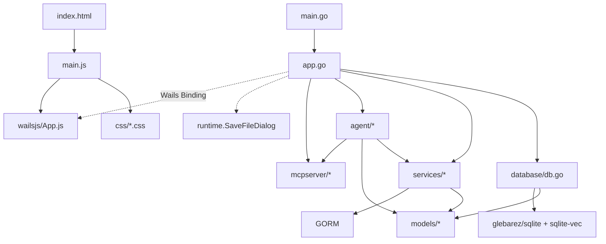

# Jot 项目分析报告

> 项目类型: 桌面端「会思考的卡片笔记」应用（类小米笔记，Wails v2 跨平台桌面应用）
> 技术栈: Go + Wails v2 + GORM + SQLite（纯 Go 驱动，无 CGO）+ 原生 HTML/CSS/JS + CodeMirror 6（编辑器）+ eino（CloudWeGo，OpenAI 兼容 AI 驱动）+ sqlite-vec（本地向量召回）
> 数据存储: 本地 `~/.jot/`（data/backup/images/logs/mcp/workspace 六子目录）
> 仓库: gitee.com/MM-Q/jot（MIT License）
> 说明: 旧版完整历史（含 47 条详细技术记忆点）已归档至 `.trae/documents/AGENTS-archive-2026-09-17.md`

---

## 一、目录结构梳理

```
jot/                                    # 项目根目录
├── main.go                             # 【入口】Wails 应用启动：窗口配置/资源嵌入/API 绑定/主题背景色
├── app.go                              # 【核心】Wails 绑定层，暴露 95+ 个 Go API 给前端（CRUD/AI/审批/导入导出/路径）
├── go.mod / go.sum                     # Go 模块定义与依赖锁文件
├── wails.json                          # Wails 项目配置
├── AGENTS.md                           # 本报告文件
│
├── internal/                           # 【内部包】Go 子包统一目录
│   ├── agent/                          # Agent 执行引擎（ReAct 循环 + 工具注册 + 显式规划 + ask_user + 审批机制）
│   │   ├── agent.go / registry.go / types.go  # ReAct 循环 / 工具注册表 / 类型定义
│   │   ├── approval_test.go / session_test.go / mcp_pool_test.go  # 测试
│   │   ├── TOOLS.md / EVENTS.md / doc.go         # 工具开发 / 事件协议 / 包文档
│   │   └── tools/                        # 内置工具实现（一文件一工具）
│   ├── aierrors/                       # AI 错误分类（11 类，签名含 {category,user_msg,raw}）
│   ├── config/                         # 路径工具（JotHomeDir/SubDir/WorkspaceDir/WorkspaceFilePath 沙箱校验）
│   ├── converter/                      # doc2md 封装：办公文件转 Markdown（7 格式 + 60s 超时）
│   ├── einocli/                        # eino 薄适配层（chat/embedding/types，OpenAI 兼容客户端）
│   ├── database/                       # SQLite 初始化 + AutoMigrate + 种子数据（内置服务商/MCP/提示词）+ WAL PRAGMA + 孤儿列清理
│   ├── fontutil/                       # 跨平台系统字体枚举（Windows GDI/Linux/Darwin/fc）
│   ├── mcpserver/                      # MCP 客户端（官方 modelcontextprotocol/go-sdk）+ 连接池预热 + 自动重连
│   ├── models/                         # GORM 实体层（Note/Tag/Notebook/Setting/PasswordRecord/Todo/NoteVector/AISession/AISessionConfig/AIMessage/AIPrompt/APIProfile/MCPServer/AIMemory）
│   └── services/                       # 业务服务层（note/notebook/tag/setting/ai/ai_context/todo/password/profile/stats/log/vector/chunk/recall/mcp_server/crypto/memory）
│
├── frontend/                           # 【前端目录】Vanilla JS + Vite
│   ├── index.html                      # 入口 HTML，多视图 + 各类浮层
│   ├── package.json                    # Vite 3.x + CM6 ~16 包 + marked + highlight.js + mermaid + pinyin-pro
│   ├── src/
│   │   ├── main.js                     # 【核心】前端逻辑（CM6 集成/搜索/AI 对话/设置/主题/快捷键/审批）
│   │   ├── js/                         # JS 模块（ai-chat/constants/notification/launcher/password-manager/calendar/editor-actions/preview-worker/theme-config/data-management/trash-page）
│   │   └── css/                        # 模块化 CSS（variables/reset/scrollbar/animations/index + components/*）
│   ├── wailsjs/                        # Wails 自动生成 JS 绑定（App.js/App.d.ts/models.ts）
│   └── dist/                           # Vite 构建产物（.gitignore）
│
├── build/                              # Wails 构建资源（windows/darwin 打包）
├── playground/                         # 各类 PoC/独立 demo（agent-demo/vec-poc/mcp-* 等，非交付）
├── tools/seed/                         # 种子数据工具
└── .trae/                              # Trae 项目文档目录
    ├── plans/ · specs/                 # 特性规划与实现 Spec（大量增量开发记录）
    └── documents/                      # 规则/方案/评审文档 + 本报告归档
```

### 目录规范评价

| 维度 | 评价 |
|------|------|
| 分层清晰度 | 优秀。严格 `models → services → database → app.go` 分层，前后端经 Wails Binding 隔离 |
| 命名规范 | 良好。Go 子包用复数（models/services），前端 CSS/JS 模块化均遵循项目自定义规范 |
| 冗余目录 | 基本无。`playground/` 为非交付 PoC，职责独立 |
| 待改进 | ① `app.go` 单文件 95+ 绑定方法偏大，可按域（note/ai/password）进一步拆分 Service 绑定；② `frontend/src/main.js` 仍承载核心逻辑，部分已抽模块，可继续拆分 |

---

## 二、核心功能模块识别

### 2.1 基础支撑模块

| 模块 | 核心功能 | 对应文件 | 核心依赖 |
|------|----------|----------|----------|
| 数据库初始化 | SQLite 连接、AutoMigrate、WAL PRAGMA、blank import 注册 sqlite-vec、孤儿列清理 | `database/db.go` | glebarez/sqlite, GORM, modernc.org/sqlite/vec |
| 数据模型层 | 全部实体定义 + GORM tag 映射 | `models/*.go` + `database/models.go`（AllModels 注册表） | GORM |
| 通用类型 | 分页/统计/导入导出结构 | `services/types.go` | 无 |
| Wails 绑定层 | Go API → JS Bridge（95+ 方法） | `app.go` | Wails v2 binding + runtime |
| 路径工具 | `~/.jot` 六子目录解析 + workspace 沙箱路径校验（EvalSymlinks 防逃逸） | `config/config.go` | os.UserHomeDir |
| 办公文件转换 | doc2md 封装（docx/pdf/xlsx 等 7 格式 + 60s 超时） | `converter/converter.go` | gitee.com/MM-Q/doc2md |
| AI 错误分类 | 11 类中文友好错误（auth/rate_limit/server_error...） | `aierrors/errors.go` | 无 |
| 字体枚举 | 跨平台系统字体枚举 | `fontutil/*` | gdi32/user32 (Windows) 等 |
| 前端构建 | Vite 打包 + Wails dev 热重载 | `frontend/package.json`, `wails.json` | Vite 3.x |
| 统一通知 | NotificationManager 单例（4 类型 + undo） | `frontend/src/js/notification.js` | 无 |

### 2.2 业务核心模块

| 模块 | 核心功能 | 对应代码 | 核心 I/O / 依赖 |
|------|----------|----------|-----------------|
| 笔记管理 | CRUD + 搜索（打分排序）+ 置顶 + 回收站（硬删清理孤儿图片）+ 统计 + 导入导出 | `services/note_service.go` + `app.go` | Note/Tag 表 |
| 笔记本/标签/待办 | 三类基础 CRUD + 关联 | `notebook_service.go`/`tag_service.go`/`todo_service.go` | 对应表 |
| 笔记搜索 | 打分排序（相等>前缀>标题+内容>仅标题>仅内容）+ 多筛选 + 转义防注入 | `note_service.go:Search/buildSearchSortOrder/escapeLike` | Note 索引 idx_notes_* |
| 密码管理 | CRUD（列表/详情分离传输）+ 搜索 + 批量 + Base64 编码 + 生成器 | `password_service.go` + `password-manager.js` | PasswordRecord 表 + zxcvbn |
| 记事日历 | 按月圆点统计 + 按日列表 | `note_service.go:GetByDate/GetMonthCounts` + `calendar.js` | Note（创建时间索引） |
| AI 对话 | eino 驱动流式对话 + 会话/消息持久化 + 上下文压缩 + 三态模式（Chat/Agent/Plan） | `services/ai_service.go` + `einocli/` + `ai-chat.js` | AISession/AIMessage，OpenAI 兼容端点 |
| Agent 引擎 | ReAct 循环 + 16 内置工具 + 显式规划 + ask_user 反问 + 工具级开关 + MCP 工具装配 | `agent/*.go` + `agent/tools/*` | 会话注册表 + 150 语义核心 |
| 向量召回 | 笔记切块向量化 + sqlite-vec 余弦距离检索 + 笔记本过滤 + 相邻块补充 | `vector_service.go` + `chunk.go` + `recall_service.go` | NoteVector 表 + 嵌入模型 |
| 审批机制 | workspace 沙箱文件/命令工具 + 三模式审批门控 + auto 审计留痕 | `agent/tools/fs_base.go` 等 + `agent.go:RequestApproval/recordAutoApproval` | ApprovalMode 字段 + ai:tool-approval 事件 |
| MCP 扩展 | 三传输客户端 + 连接池预热 + 断线重连 + 导入导出 | `mcpserver/*` + `mcp_server_service.go` | go-sdk + MCP 服务器配置表 |
| 全局记忆空间 | 跨会话长期记忆（manage_memory 工具 + AlwaysOn 常驻） | `memory_service.go` + `manage_memory.go` | AIMemory 表 |
| AI 全局消息搜索 | 跨会话检索 + 会话聚类排序 + 消息跳转定位 | `ai_service.go:SearchAIChat` + `ai-chat.js` | AISession/AIMessage |
| 联网搜索/读 URL | MCP 驱动多源搜索 + read_url 分页读取（SSRF 防护） | `read_url.go` + `mcpserver` + `http_request.go` | eino-ext URL Loader + ssrf.go |
| 数据管理 | 统计 + 向量索引 + 批量管理 + 备份还原 + VACUUM 瘦身 + 重置 | `data-management.js` + `app.go` | 多表 + 文件系统 |
| 主题/外观系统 | 11 套主题 CSS 变量 + 14 主题维护文档 + 三源色值同步 + FOUC 兜底 | `variables.css` + `theme-config.js` + `main.go` | CSS 变量 + localStorage |

### 2.3 模块分层图

```
┌───────────────────────────────────────────────────────────┐
│                    Frontend (main.js + css/*.css)          │
│  视图渲染 / 交互逻辑 / Wails Bridge (window.go.main.App.*) │
└──────────────────────────┬────────────────────────────────┘
                           │ Wails Binding (JSON 序列化)
┌──────────────────────────▼────────────────────────────────┐
│                  App 层 (app.go) 95+ 绑定方法              │
└───────┬──────────────┬───────────────┬────────────────────┘
        ▼              ▼               ▼
  Note/Tag/Todo/  AI Service +    Agent 引擎 + MCP 池
  Password/Pw    einocli         (工具/审批)     │
  Service 层      │                 │            │
        │          |                 │            ▼
        ▼          ▼                 ▼        mcpserver
  ┌────────────────────  GORM ORM + database/db.go ──────┐
  │                       SQLite (glebarez 纯 Go 驱动)     │
  │               models v Aut oMigrate + sqlite-vec 扩展   │
  └──────────────────────────────────────────────────────────┘
```

---

## 三、模块间依赖关系分析

### 3.1 依赖关系详表

| 依赖方 | 被依赖方 | 类型 | 详情 |
|--------|----------|----------|------|
| main.go | config/app | 编译 | 获取主题色 + NewApp |
| app.go | database | 编译 | InitDB() → *gorm.DB |
| app.go | services | 编译 | 创建各 Service 实例（DI 注入 db） |
| app.go | agent | 编译 | AgentService + Run + ApproveToolCall 绑定 |
| app.go | mcpserver | 编译 | MCP 池预热/shutdown |
| app.go | runtime/fontutil/converter | 编译 | SaveFileDialog/GetFonts/Convert |
| services | models | 编译 | 访问各类实体结构体 |
| services | GORM | 编译 | *gorm.DB 数据操作 |
| database | models | 编译 | AutoMigrate（models.go AllModels 注册表） |
| agent | services/models/mcpserver | 编译 | AI 加载会话/MCP 工具装配 + 工具实现 |
| frontend | wailsjs(App.js) | 运行时 | window.go.main.App.* 调后端 |
| frontend/wailsjs | app.go | 构建时 | wails generate module 自动生成 |

依赖方向单向：`main → app → services/agent → models → GORM → SQLite`，无循环。

### 3.2 依赖关系图（Mermaid）


```mermaid
graph TD
    M[main.go] --> A[app.go]
    A --> DB[database/db.go]
    A --> S[services/*]
    A --> AG[agent/*]
    A --> MCP[mcpserver/*]
    DB --> MD[models/*]
    S --> MD
    S --> G[GORM]
    AG --> S
    AG --> MD
    AG --> MCP
    DB --> K[glebarez/sqlite + sqlite-vec]
    A -.-> RT[runtime.SaveFileDialog]
    FE[index.html] --> MJ[main.js]
    MJ --> CSS[css/*.css]
    MJ --> WJS[wailsjs/App.js]
    A -.->|Wails Binding| WJS
```

### 3.3 依赖问题分析

| 问题类型 | 描述 | 程度 |
|----------|------|------|
| 循环依赖 | 无，单向分层 | ✅ |
| 过度依赖 | 无 | ✅ |
| 依赖缺失 | go.sum 完整 | ✅ |
| 隐式依赖 | 前端 `window.go` 依赖 Wails 运行时注入，独立预览不可用（有 Mock 降级） | ⚠️ |
| 构建时依赖 | 修改 app.go 后需 `wails generate module` 重生成 wailsjs 绑定 | ⚠️ |
| AI 单元耦合 | app.go 既做 Shell/agent 装配又做 Wails 绑定，逻辑与绑定高度耦合（结构性，CodeReview 关注） | ⚠️ |

---

## 四、设计模式与实现逻辑

### 4.1 设计模式识别

| 模式 | 位置 | 说明 |
|------|------|------|
| Service Layer | `services/` | 业务逻辑从 app.go 抽离封装为独立 Service |
| 依赖注入 (DI) | `app.go` | Service 构造函数注入 *gorm.DB |
| Repository | services 内嵌 GORM | GORM 作数据访问层 |
| 单例 | app.go NewApp / einocli 客户端 | Wails 运行时单实例；AI 会话注册表 LRU cap32 |
| MVC 变体 | 整体 | Model(models) - View(frontend) - Controller(app+services) |
| 观察者/事件驱动 | runtime.EventsEmit ↔ EventsOn | AI 流式事件（chunk/thinking/tool-status/approval/ask-user/done/error）带 streamGen 代际防串流 |
| 降级策略 | frontend | 后端未绑定时 Mock 数据 |
| 门控策略 | agent.go RequestApproval | 三模式审批：`needConfirm := mode==confirm_every \|\| (critical && mode==review)` |
| 连接池 | mcpserver/pool.go | 按名预热复用，指纹变化关旧重连，断线自动重建 |
| 订阅注册表 + LRU | agent session registry | 会话级 askCh/approveCh/runMu 串行化 |

### 4.2 核心业务逻辑流程

#### 4.2.1 Agent 工具审批流程（confirm_every / review 高危）

```
AI ReAct 循环调用 run_command
  → requestApproval(ctx, name, summary, critical)
    → agentSession.RequestApproval 读 ApprovalMode
      → needConfirm?  (confirm_every 全确认 / review 仅 critical)
        → 阻塞 AI 流，emit ai:tool-approval{approval_id,critical}
        → 前端弹确认面板
          → AppendToolCall(sessionID, approvalID, approved)
            → 允许=继续执行；拒绝=工具返回错误文本落 tool_error
  → 执行工具（workspace 沙箱 + 30s 超时 + 有界输出）
```

#### 4.2.2 向量召回流程

```
用户问题 → 上下文构建 → 注入【长期记忆/环境信息】
  → VectorRecall(query, notebookIDs)
    → chunk 语义切块（600 rune + 元数据前缀 + 围栏保护）
    → embed 化 → vec_f32(?) + vec_distance_cosine < 1.0 过滤 + 距离升序 TopN
    → JOIN notes 过滤软删除 → 命中块补相邻块 → 按笔记合并召回卡片
  → FormattedText 注入 system message + Cards 前端展示
```

#### 4.2.3 AI 上下文压缩（token 预算 + 摘要持久化）

```
SelectTailByTokenBudget(预算默认128K，轮次对齐)
  → tail 达 预算×触发比例(0.8) 时 CompactSessionSummary
    → 合并头部旧消息 → 生成新摘要 → 推进 SummaryUpToMsgID 边界
  → 失败即中止本轮（ai:summary-status:failed），重发时自动再触发
```

### 4.3 实现逻辑评价

- **清晰度**：分层与命名高度一致，Service 职责单一，关键 AI/工具逻辑均有权威文档（TOOLS.md/EVENTS.md/AI_CONTEXT.md/theme-maintenance.md）。
- **冗余点**：app.go 过大（95+ 绑定 + shell 装配）；main.js 仍偏大；存在历史 dead code（如已废弃的搜索来源解析字段 `search_sources`，DB 保留但前端置空）。

---

## 五、技术栈评估

### 5.1 技术栈清单

| 层级 | 技术 | 版本 | 用途 |
|------|------|------|------|
| 桌面框架 | Wails v2 | v2.12.0 | 桌面窗口 + Go↔JS Bridge（无边框、DragAndDrop、Frameless） |
| 后端语言 | Go | 1.26.0 | 业务逻辑 |
| 数据库 | SQLite | — | 本地存储 |
| 驱动 | glebarez/sqlite | v1.11.0 | 纯 Go 驱动（无 CGO） |
| 向量检索 | sqlite-vec | modernc.org/sqlite v1.51.0（vec 子包 v0.1.9） | SQL 内余弦距离函数式用法 |
| ORM | GORM | v1.31.1 | 对象关系映射 |
| AI 驱动 | eino (CloudWeGo) | v0.9.13 + eino-ext openai v0.1.13 + acl/openai v0.1.17 | 流式对话/嵌入，OpenAI 兼容端点 |
| OpenAI SDK | meguminnnnnnnnn/go-openai | v0.1.2 | eino 底层调用 |
| MCP | modelcontextprotocol/go-sdk | v1.7.0 | MCP 服务器客户端（stdio/sse/http） |
| 分词/搜索 | gse | v1.0.2 | 中文分词（关键词侧） |
| JSON 提取 | tidwall/gjson | v1.18.0 | Agent json_* 工具 |
| 前端构建 | Vite | v3.2.11 | 打包 |
| 前端技术 | 原生 HTML/CSS/JS | — | 无 UI 框架，纯手写 DOM |
| 编辑器 | CodeMirror 6 | @codemirror/view v6.43.0 | Markdown 编辑器 |
| Markdown | marked | v18.0.5 | Markdown→HTML |
| 代码高亮 | highlight.js | v11.11.1 | 代码块高亮 |
| 图表 | mermaid | v11.x | Mermaid 渲染 |
| 拼音 | pinyin-pro | v3.29.3 | 启动器三路拼音匹配 |
| 自研库 | doc2md / fastlog / go-kit / verman / logrotatex / color / comprx（gitee.com/MM-Q/） | 见 go.mod | 文档转换/日志/工具集/版本/轮转/上色/压缩 |
| 本地存储 | localStorage | — | UI 状态持久化 |
| 任务编排 | rnx (Rnx.toml) | — | 构建/任务/lint 编排 |

### 5.2 技术选型适配性

- **Go + Wails v2 + 原生前端**：契合单机、轻量、无外部依赖场景，编译产物小，符合「小型桌面应用不过度工程」原则。✅ 适配良好
- **纯 Go SQLite + sqlite-vec**：无 CGO 跨平台友好，向量召回本地化，无远程依赖。✅ 契合本地语义检索场景
- **eino 薄适配 + OpenAI 兼容端点**：支持 DeepSeek/智谱等多家服务商，配置预设驱动。已移除 Ollama 原生协议（`remove-*-ollama` spec）。⚠️ 需外网/自定义网关
- **自研 G 库（doc2md 等）抽离为独立库**：单一变更点，冗余降低，可复用可测试。✅ 合理演进
- **Vite v3.2.11 较新版本未升级**：功能满足，非阻塞项。

### 5.3 版本兼容 / 维护状态

| 项 | 说明 |
|----|------|
| Wails 版本锁定 | v2.12.0 需 CLI 与 go.mod、wails.json 三方匹配，升级需同步三处 |
| GORM AutoMigrate | 新增模型必须同步注册进 `database/models.go` 的 AllModels |
| modernc.org/sqlite 升级 | v1.51.0 捆绑 sqlite-vec，升级需回归向量召回测试（测试包需自行 import） |
| AI 端点迁移 | Ollama 原生协议已移除，仅 OpenAI 兼容端点 |
| GORM Order 坑 | `Order(gorm.Expr)` 被静默丢弃，须用 `clause.OrderBy{Expression: clause.Expr{...}}` |

---

## 六、长期记忆

存放项目**长时间稳定**的关键信息，一旦确定便长期保持不变（结构性变化才更新）。

1. **项目定位**：桌面端「会思考的卡片笔记」，本地数据优先，AI Agent + 本地语义检索为差异化核心。
2. **技术选型**：Go + Wails v2 2.12 + GORM 1.31 + SQLite（glebarez 纯 Go 驱动，modernc.org/sqlite v1.51 含 sqlite-vec）；前端纯原生 HTML/CSS/JS + Vite 3 + CM6；AI 用 eino + OpenAI 兼容端点。理由：单机轻量、无 CGO、跨平台、无外部服务依赖。
3. **数据目录**：`~/.jot/` 下 data/backup/images/logs/mcp/workspace 六子目录；DB 默认 `~/.jot/data/jot.db`；AI 无边界执行沙箱即 workspace。
4. **模块边界**：`models → services → database → app.go` 单向分层，无循环依赖；app.go 为 Wails 绑定层（95+ 方法）；前端经 window.go.main.App 调用。
5. **审批门控公式**：`needConfirm := mode=="confirm_every" || (critical && mode=="review")`；三模式 confirm_every（每次确认）/review（常规自动+高危确认，不可绕过）/auto（全自动放行，高危额外 `tool_auto_approval` 审计留痕）。命令行工具用 os/exec 裸命令，不支持 shell 语法。
6. **工作区边界**：文件/命令工具仅允许操作 `~/.jot/workspace/`，`WorkspaceFilePath` 用 EvalSymlinks 解析防 symlink/junction 逃逸；危险命令判定走 `highRiskTokens` 黑名单（基名或参数整词命中，含 `--flag=value` 拆解）。
7. **代码规范**：目录用复数（models/services）；前端 CSS/JS 模块化按 `js/`、`css/components/` 拆分；新增模型必须注册 `database/models.go` AllModels；一文件一工具（tools/ 下命名即文件名）；工具描述与实际实现一致（meta.go 反例教训）。
8. **关键工程约定**：
   - 数据模型注册唯一入口 = `database/models.go` 的 `AllModels`（db.go 建表与 app.go ResetDatabase 共用），多对多表需在 ResetDatabase 显式 DROP。
   - 新增内部滚动型视图必须加 `#viewX.view.active { padding-bottom: 0 }` 双类规则，防「底栏」遮挡。
   - 主题维护以 `frontend/src/css/theme-maintenance.md` 为权威；主题色三源（variables.css/criticalColors/main.go themeBG）必须对齐。
   - AI 事件协议见 `internal/agent/EVENTS.md`，工具开发见 `internal/agent/TOOLS.md`。
   - ESC 快捷键统一收口在 `main.js` 的 `handleKeyboardNavigation`，模块内不单独监听 ESC。
   - 前端 CSS/HTML 改动必须 `npm run build`（+ `wails build` 出二进制）才生效。
   - AI 上下文字段 maxToolLongText=100000（write_file/edit_file/http_request body），与 maxAIMessageChars=20000 相互独立。
   - `ai_card_recall_limit`（笔记数）唯一控制召回总量，无单笔记内容截断。
9. **设计要点**：AI 流式事件全部携带 `streamGen` 代际 ID，前端按代丢弃过期流防串流；工具调用/消息渲染实时与历史回放共用同一渲染函数族，保证「所见即所存」；关键词+向量混合召回，sqlite-vec 函数式余弦距离（非 vec0 虚拟表）。
10. **SQLite/数据库工程约定**：WAL + `busy_timeout=5000` + `synchronous=NORMAL` + `cache_size=-8000`，PRAGMA 失败不中断初始化；notes 建 `idx_notes_sort(pinned,updated_at)`/`idx_notes_notebook_deleted`/`idx_notes_created` 三命名索引，避免默认排序全表 temp 排序；默认排序统一 `pinned DESC, updated_at DESC`。`replaceDatabase()` 需清理 `-wal/-shm` 残留。数据库 model 注册唯一入口 = `database/models.go` 的 `AllModels`（与 db.go 建表、ResetDatabase 共用，多对多表在 ResetDatabase 显式 DROP）。
11. **AI 会话/消息全链路**：AISession+AIMessage 持久化；编辑/删除/重发/再生合并为后端 `ReplaceAISessionMessages`（GORM Transaction 清空+写入原子）；消息懒加载分页（游标 beforeID）；编辑/重发/再生按 msgID 用 `TruncateAISessionAfterMessage` 截断、删除 `DeleteAIMessage`；Token 由后端 `SumSessionTokens`/`GetSessionContextTokens`；`stream-done` 事件 9 参数（含 userMsgID/assistantMsgID）。上下文压缩持久化摘要边界 `SummaryUpToMsgID`，解耦预算/窗口设置变更。
12. **前端竞态防护范式（代际序号）**：所有异步/流式竞态用「代际 ID」丢弃过期结果——AI 流 `streamGen`、编辑器 `editorOpSeq`、预览 Worker `previewRenderSeq`、密码列表 `pmLoadSeq`、斜杠搜索 `slashQuerySeq`、AI 全局搜索 `_aiSearchSeq`；引入新异步交互时应遵循同一范式。配合「懒创建 + 单一定时器（如 toolStatusTimer 防 per-row 泄漏）」。
13. **渲染单一事实源（所见即所存）**：工具调用记录实时与历史回放**共用模块级** `buildToolRecords`/`rebuildToolSummaryHeader`/`buildToolStatusRows`/`updateToolSummary`；消息渲染 `addMessage` 单一路径。修改渲染逻辑必须同步双路径，否则实时一致但回放错乱。
14. **MCP 客户端与连接池**：官方 `modelcontextprotocol/go-sdk v1.7.0`，三传输（stdio/sse/http）+ 协议版本协商（可降级 2024-11-05）；go-sdk transport 无 Headers 字段，鉴权用自定义 `headerRoundTripper` 包装 http.Client；连接生命周期绑定 ctx（`defer cancel()` 会终止 SSE 长连接致 EOF）；池按 Name 预热、per-name in-flight 信号串行化建连防重复拉进程、`serverFingerprint` 指纹变化自动关旧重连、Session 检测连接类错误自动重建一次并重试。
15. **SSRF 三层防护（read_url/http_request 共享 `ssrf.go`）**：① `validateHTTPURL` 仅放行 http/https 公网地址；② `CheckRedirect` 逐跳 `isPrivateHost`（上限 10 次）；③ `guardedDialContext` 拨号期解析全部 IP 逐个校验**直连已校验 IP** 防 DNS rebinding。`Transport` 必须以 `DefaultTransport.Clone()` 为底座（裸构造丢系统代理/HTTP2/TLS）。`isPrivateHost` 含 inet_aton 数值编码归一化 + 裸 IPv6 判漏。
16. **导入/导出图片闭环 & 时间戳规则**：导出 `.md` + 同名 `.assets/` 目录相对引用（保留 uuid 原始文件名）；导入反向复制进 `~/.jot/images/` 改内部 URL（URL 跳过、`/images/` 幂等跳过）；回收站硬删联动清理不再被引用的孤儿图片。导入时间戳对齐文件 `ModTime()` 作同步基准 + SHA256 内容哈希兜底；**导入写库必须用 `CreateWithNotebookAt`/`UpdateWithTime`，禁普通 `Update`/`Save`（GORM 会刷 UpdatedAt 破坏基准）**。
17. **AI System Prompt 三层结构**：`baseIdentity`(身份)/`baseNormsBoundaries`(规范+边界)/`baseSystemPrompt`(全三层)；技能激活仅跳过身份层，规范+边界始终注入；共享提示词末尾注入【环境信息】当前时间 +【长期记忆】段，注入置于尾部利于前缀缓存。时光同步：Chat/Agent 两模式共用 buildAIContextInstruction。
18. **主题/外观一致性**：主题维护以 `frontend/src/css/theme-maintenance.md` 为权威；主题色三源（variables.css/criticalColors/main.go themeBG）必须对齐防启动闪色；`resolveTheme` 纯函数兜底（`hasOwnProperty.call` 防 `__proto__`/`constructor` 原型污染，无效回落 default）；`applyTheme` 保持纯 DOM 同步器、不落库（防覆盖其他设置）。
19. **输入框工具下拉互斥约束**：AI 输入坞四个带下拉控件（模型选择/更多技能/Agent 工具/执行审批）由模块级 `closeOtherToolbarDropdowns(except)`（[ai-chat.js](frontend/src/js/ai-chat.js)）统一互斥——打开任一会先关闭其余三者；Agent 工具经 `window.__closeAiChatAgentToolsList` 桥接、main.js 单向 import，避免跨模块循环依赖。**互斥名单为硬编码：未来新增第 5 个输入框列表控件必须补进该函数并在其打开入口以 except 跳过自身，否则该新控件不参与互斥。**
20. **子 Agent 机制（os_agent）**：文件/命令 11 工具（read_file/write_file/edit_file/ls_dir/glob/grep_file/copy_file/move_file/delete_file/mkdir_dir/run_command）封装为 os_agent 委托工具，**通用机制集中在 [subagent.go](internal/agent/subagent.go)**：delegatedAgentTool 基类 + newDelegatedAgentTool 工厂 + toolConstructors 构造器注册表 + 事件转发循环（InvokableRun），os_agent = 通用工厂 + 一份 subAgentConfig 配置（osAgentConfig，含提示词/白名单/前缀/描述）；**新增子 Agent 开发规范：每 Agent 一个文件（如 [subagent_os.go](internal/agent/subagent_os.go) 样板、subagent_note.go）只定义提示词常量 + 白名单 + subAgentConfig 配置 + 一个构造器（调 newDelegatedAgentTool），无需改通用机制，再在 registry.go buildTools 注册对应委托工具**；父层 buildTools 仅注册 os_agent（`tools.WrapWithError` 包装、受 ai_agent_tools_disabled 过滤、非 PlanOnly、旧禁用名静默忽略）；内层独立 `adk.NewChatModelAgent` 复用同一会话 ChatModel 客户端、`MaxIterations=20`、白名单恰 11 工具；内层每步工具调用经 `emitToolStart/emitToolResult` 写入父层同一 toolRecords 并发射 `ai:tool-status`（顺序 = os_agent start → 内层记录 → os_agent result 构成前端分组边界），内层流式正文/思考链不转发（noopEmit）；内层复用同一会话 Approver/AskWaiter，审批弹窗照常；前端实时与回放共用 `osAgentGroup*` 栈函数 + isAgentGroup/substep 标记 + `hasAgentGroup` 降级逐条渲染 + `.is-os-agent`/`.is-substep` 样式。

21. **Wails 文件拖拽上传范式**（工作区/编辑器/AI 聊天共用）：`EnableFileDrop` 开启 OS 级拖拽，拖入文件被统一拦截，经 `window.runtime.OnFileDrop(x,y,paths)` **单点路由**（paths 为绝对路径数组 + 释放坐标）；前端 DOM 层 dragenter/dragover/dragleave/drop 只做视觉（遮罩/高亮）不处理文件，**真实文件一律走 OnFileDrop**。目标目录判定**优先用 dragover 最后一刻的悬停状态**（DOM 用浏览器视口 CSS 像素，不受 DPI 影响），`OnFileDrop` 的 (x,y) 在 Windows 高 DPI 下可能为物理像素导致 `elementFromPoint` 偏移，仅作空值兜底；**DOM drop 与 OnFileDrop 触发顺序不定，禁止在 DOM drop 处理器里清空跨回调目标状态**（会因竞态把目标丢回根）。多拖拽并存时用「面板前置路由 + document 拖拽守卫」屏蔽（真文件在 OnFileDrop 最前面按 `#workspaceModal` 显示态 return），**勿 stopPropagation**（会破坏全局 `_dragCounter` 进出平衡致遮罩残留）；拖拽可见性用**无遮罩方案**（全屏遮罩挡树难以定位）——树容器边框高亮 + 目录行级高亮。

## 七、临时记忆

存放**近期动态**结论（最多 5 条，编号 5 最新、1 最旧），快速接续上次会话现场。稳定后升级合并进「长期记忆」。

### 临时记忆 1
| 记忆点 | 内容 |
| --- | --- |
| **变更概览** | 向量嵌入切块大小可配置化：硬编码常量 `chunkMaxRunes=600`（同时充当「理想块大小+硬上限」）拆分为两个全局设置项 `ai_chunk_target_rumes`（target，默认 600，段落边界落刀点）与 `ai_chunk_max_rumes`（max，默认 1500，硬上限）。spec 见 `.trae/specs/add-chunk-size-settings/`。 |
| **实现（重要）** | [chunk.go](internal/services/chunk.go) 签名改 `func ChunkContent(content string, targetRunes, maxRunes int, meta ChunkMeta) []string`，防御钳制三条（target>max 降级为 max / max<1 置 1 / target<1 置 1）替代旧 `maxRunes<=0→500` 逻辑；**空行分支 target 落刀**（`curRunes >= targetRunes` flush），正文行保持 `curRunes > maxRunes` 兜底，flush 内硬切预算用 maxRunes。**口径一致（关键约束）**：写路径 `IndexNotes` 与状态比对 `classifyVectorNotes` 共用 `VectorService.chunkSizes()`（[vector_service.go](internal/services/vector_service.go) 新增私有方法，查 settings 表两 key，错误回退默认并 Warnw），与 [types.go](internal/services/types.go) `SaveAllSettings`/`GetAllSettings` 共用 `clampChunkSizes(target,max)` helper（先钳 max∈[100,10000] 再钳 target∈[1,max]）——设置页展示 ↔ 落库 ↔ 运行切块三处口径一致，避免内容未变误判「需重新嵌入」。 |
| **设置项链路** | [db.go](internal/database/db.go) `InitDefaultSettings` 追加两 key 种子（600/1500）；[types.go](internal/services/types.go) `SettingsConfig` 新增 `AIChunkTargetRunes`/`AIChunkMaxRunes` 两 int 字段 + sets map 两键 + clamp；[index.html](frontend/index.html)「向量嵌入连接」分组新增两个 number 控件（min=1/min=100）；[main.js](frontend/src/main.js) `els` 注册 + `loadSettings` 回显（?? 600/1500）+ `saveSettings` 提交 + 两自保存 change 监听（target<1→600、max<100→1500 且 >10000→10000）。 |
| **测试与验证** | [chunk_test.go](internal/services/chunk_test.go) 各调用点传原值（500→(500,500)、600→(600,600)、120→(120,120) 保持旧行为等价）；旧 `TestChunkDefaultMaxRunes`（500 默认值逻辑已删）重写为 `TestChunkClampDefensive`；新增 3 区间用例（整段保留/段落不切开/硬切 ≤max）。[types_test.go](internal/services/types_test.go)（新建）`TestSaveAllSettingsChunkClamp`（4 场景真实落库读回）+ `TestClampChunkSizes`（6 组表驱动）。[vector_service_test.go](internal/services/vector_service_test.go) `newVectorTestDB` 迁移 `models.Setting` 并播种 600/600 与测试写路径 `(600,600)` 对齐（classifyVectorNotes 走 chunkSizes 查库）。`gofmt` 无输出 + `go build ./...` + `go vet` 全绿 + `go test ./internal/services/ -count=1` → `ok jot/internal/services 1.554s`。 |
| **涉及文件** | [chunk.go](internal/services/chunk.go)、[chunk_test.go](internal/services/chunk_test.go)、[vector_service.go](internal/services/vector_service.go)、[vector_service_test.go](internal/services/vector_service_test.go)、[types.go](internal/services/types.go)、[types_test.go](internal/services/types_test.go)（新增）、[db.go](internal/database/db.go)、[index.html](frontend/index.html)、[main.js](frontend/src/main.js)｜前端改动需 `npm run build`（+ `wails build` 出新二进制）生效 |

### 临时记忆 2
| 记忆点 | 内容 |
| --- | --- |
| **变更概览** | 切块硬切改**行边界优先**（方案①，唯一被核实的有意义优化，②③④⑤均核实为低价值/不应做）：旧 `hardSplit` 按 maxRunes 字符级硬切会劈开代码行/列表项/表格行；新逻辑优先在完整行边界落刀（保留结构语义），仅当单行本身超 maxRunes 才退化到字符级兜底。输出变化 → 存量向量判「需重新嵌入」一次（自愈路径）。 |
| **实现（重要）** | [chunk.go](internal/services/chunk.go) `hardSplit(s, maxRunes)` 重写：`strings.Split` 按行扫描 + `cur/curRunes` 累积（行间换行占 1 rune），累加将超限即在行边界前落刀；单行超限先 flush 已累积、该行走新增 `hardSplitRunes`（原字符级逻辑抽离，不切断多字节字符）兜底；flush 内 TrimSpace + 空块过滤保留。`splitWithHeading` 调用点不变（仍传 maxRunes 预算）。 |
| **测试适配（重要）** | [chunk_test.go](internal/services/chunk_test.go) `TestChunkTableHeaderCarry` 由 max=120 硬切路径（依赖旧字符级切形巧合）改为 max=2000 整块落袋路径——验证真正要测的**正常补表头**行为（含数据行块首带表头、普通段落块不带），与新硬切无冲突；新增 `TestChunkHardSplitPreservesLines`：30 行代码块 + max=200 强制硬切，断言每行 Marker（`customLineN := computeValue();`）整行完整未被切断。 |
| **测试与验证** | `go build ./...` + `go vet` 无告警 + `go test ./internal/services/ -run 'Chunk'` 与全量 services 回归全绿。经验：测试直接依赖「字符级切形巧合」的断言（如表头补充用例）在行边界硬切后会失效，应改为验证行为本质而非切形。 |
| **涉及文件** | [chunk.go](internal/services/chunk.go)（hardSplit/hardSplitRunes）、[chunk_test.go](internal/services/chunk_test.go)｜纯后端改动，需 `wails build` 出新二进制生效 |

### 临时记忆 3
| 记忆点 | 内容 |
| --- | --- |
| **变更概览** | 向量嵌入进度面板 UI 优化（多轮迭代）：耗时+预计剩余**前端 A1 估算**融合进 stage 文案且为**一句话形态**（「正在生成向量，已用 00:42，预计剩余约 01:30」，中文逗号连接而非 · 分段，DOM 仍分三个 span，1s 定时器只更新两个时间节点不重绘主文案）；**首次进度回调前时间显示占位符**（「准备中，已用 --:--，预计剩余 --」，首个 embedding 回调置 `vectorIndexTimeReady` 后才真实更新）；完成摘要按**零项省略**（成功/失败为 0 的项不显示，`/` 分隔仅两项都在时出现）；进度条块级过渡 0.2s；当前标题超宽时**字幕式横向滚动**（marquee 无缝循环，标题变化才重建，不超宽不滚动，reduced-motion 下禁用动画静态截断）。plan 见 `.trae/documents/plan-vector-index-progress-time-eta-marquee.md`。 |
| **实现（重要）** | [data-management.js](frontend/src/js/data-management.js)：模块级 `vectorIndexStartAt`（开始时刻）/`vectorIndexRemainMs`（最近估算剩余）/`vectorIndexElapsedTimer`（1s 定时器）/`vectorIndexTimeReady`（首个进度回调标记）/`vectorIndexLastTitle`（marquee 标题去重缓存，reset 时复位）五变量；`computeVectorIndexRemainMs` 按 `eta = elapsed/progress × (1-progress)` 估算（embedding 阶段当前篇按 `(done+0.5)/total` 计，progress∈(0,1) 外返回 null）；`formatVectorIndexDuration`（mm:ss/h:mm:ss）；`ensureStageTimeSpans` 惰性构建「主文案，已用，预计剩余」三段 span（`_built` 标记防重复构建，恢复纯文本处 `delete el._built` 复位防 querySelector null）；`refreshVectorIndexElapsed` 仅更新两 span 的 textContent（`vectorIndexTimeReady=false` 时显示占位符）；`setupVectorIndexCurrentMarquee` 构建 inner 前缓存 `contentWidth=el.scrollWidth`，duration=`max(6, contentWidth/50)`，超宽才加 `.is-marquee`；定时器在 start 前置清理 + done/error/close/reset 统一 `clearVectorIndexElapsedTimer` 防泄漏；标题去重：`p.title !== vectorIndexLastTitle` 才重建字幕（块级回调每块一次，标题未变跳过）。 |
| **样式** | [data-view.css](frontend/src/css/components/data-view.css)：`#vectorIndexChunkFill` 块级过渡 `width 0.2s ease`；`.vector-index-stage-time` 弱化色（text-muted）；`.vector-index-current.is-marquee` 去 ellipsis（text-overflow: clip）+ `.vector-index-current-inner`（inline-block nowrap）挂 `vectorIndexMarquee` 动画（`translateX(0→-50%)` 双份内容无缝循环，时长 `var(--marquee-duration, 12s)`，will-change: transform）；`@media (prefers-reduced-motion: reduce)` 下 `.vector-index-current-inner` animation:none 静态截断。 |
| **验证** | `npm run build` 通过（仅既有 chunk 大小警告）；纯前端改动，需 `npm run build`（+ `wails build` 出新二进制）生效 |

### 临时记忆 4
| 记忆点 | 内容 |
| --- | --- |
| **变更概览** | 新增**工作区管理器**：AI 聊天页顶栏（折叠侧栏与新建会话之间）文件夹图标按钮 → Modal 弹窗，用户以「先选后操作」范式浏览/上传/下载/删除工作区（~/.jot/workspace）文件。spec 见 `.trae/specs/add-workspace-manager/`。**操作按钮统一在 Modal 顶部操作栏**（上传文件/上传目录/下载到桌面/删除/刷新 + 已选 N 项），下载/删除未选中禁用；文件树 checkbox 多选、目录懒展开、空状态引导上传；用户手动操作**不触发 AI 审批门控**（操作者是用户本人，与约束 AI 的审批体系分离，transfer_file 工具不变）。 |
| **后端（重要）** | 新增 [workspace_service.go](internal/services/workspace_service.go)：`WorkspaceService`（`NewWorkspaceService()` 构造，测试注入 workspaceRoot/homeDir/desktopRoot 空值默认解析）；`ListWorkspaceFiles`（递归树、目录在前名称升序、**隐藏空目录自底向上修剪**、相对路径 `/` 分隔）/`UploadFiles`/`UploadDirectory`（目标取基名、`uniqueTarget` 重名自动改名 `xxx (1).ext`，`.gitignore` 类隐藏文件不拆扩展名）/`DownloadFiles`（源沙箱校验 → 桌面根同名相对路径，目录 MkdirAll，重名自动改名）/`DeleteFiles`（拒绝根目录，目录需 `recursive=true`）；批次单项失败不中断写入 `Error` 字段；复用 go-kit CopyEx + config.WorkspaceFilePath 沙箱校验。app.go 新增 5 绑定：`UploadFilesToWorkspace`/`UploadDirectoryToWorkspace`（内嵌 OpenMultipleFilesDialog/OpenDirectoryDialog，取消返回空/零值）、`ListWorkspaceFiles`/`DownloadWorkspaceFiles`/`DeleteWorkspaceFiles(relPaths, recursive)` 直转 services；`wsService` 字段在 NewApp 初始化、不依赖 db。 |
| **前端（重要）** | [workspace-manager.js](frontend/src/js/workspace-manager.js)（新建）：`workspaceLoadSeq` 代际竞态防护、`workspaceSelected` 选中集（目录仅选中自身不联动子级）、`workspaceExpanded` 懒展开集、busy 期间禁用操作按钮、刷新**保留选择**（渲染后恢复勾选并清理失效项）、删除走 `window.showConfirmDialog` 二次确认（含目录提示递归、传 recursive=true）、关闭复位全部状态、事件懒绑定一次常驻；main.js 顶栏按钮绑定 + ESC 收口进 `handleKeyboardNavigation`；[workspace.css](frontend/src/css/components/workspace.css)（新建，全量主题变量、开合缩放+淡入 150–300ms、`prefers-reduced-motion` 禁用、禁用态降透明度、删除按钮 danger 与下载分离）。 |
| **验证** | [workspace_service_test.go](internal/services/workspace_service_test.go) 7 组 13 子场景（改名/排序与空目录隐藏/目录递归 roundtrip/根保护/`../`+symlink 逃逸/批次不中断）全绿；`go build/vet` 全绿 + `npm run build` 通过 + `wails generate module` 生成 5 绑定且与前端调用名一致。注意：`go test ./internal/...` 中 `TestRequestApprovalRejectsParallel` 为 agent 包**既有并发时序缺陷**（本次 0 改动，偶发超时、单跑通过，根因 `approvePending` 投递前清除窗口可被并发二次 claim），与本功能无关。需 `wails build` 出新二进制生效。 |

### 临时记忆 5
| 记忆点 | 内容 |
| --- | --- |
| **变更概览** | 工作区管理器新增**拖拽上传文件/目录**（方案A：拖拽悬停目录行即目标；真文件走 Wails OnFileDrop）。后端 [workspace_service.go](internal/services/workspace_service.go) `uploadOne(root,srcPath)` 重构为 `uploadOne(root,targetDir,srcPath)` 支持目标目录（`uniqueTarget(targetDir,name)`+CopyEx+沙箱）；新增 `UploadPathsToWorkspace(paths []string, targetRel string)`：targetRel 空串或 `/`=根目录，非空经 `config.WorkspaceFilePath` 沙箱校验 + `os.Stat` 确认已存在目录后整体校验、不合法整体报错；app.go 新增同名绑定。前端：`#workspaceTree` 拖拽边框高亮（`.ws-drag-active`）+ 目录行级高亮（`.ws-drop-target`），**无全屏遮罩**（遮罩挡树难定位目录）；[workspace-manager.js](frontend/src/js/workspace-manager.js) 新增面板 dragenter/dragover/dragleave/drop 监听（防抖更新 `workspaceDropTargetRel`）+ `window.handleWorkspaceDrop` + `expandWorkspaceTargetChain`（目标祖先链展开）+ 开关复位；[main.js](frontend/src/main.js) OnFileDrop **最前**加面板路由（面板显示态屏蔽一切其他拖拽）+ document dragenter/dragleave/drop 面板守卫；[ai-chat.js](frontend/src/js/ai-chat.js) 四处理器同款守卫。 |
| **实现（重要）** | 目标判定优先级 = **dragover 最后一刻悬停目标优先 + OnFileDrop 坐标 (x,y) 兜底**（修复 Windows 高 DPI 下物理像素致 `elementFromPoint` 偏移 -- 悬停高亮可见但落根目录的 bug）；DOM drop 事件**不再清空** `workspaceDropTargetRel`（保留供 handleWorkspaceDrop 消费后置空，规避 DOM drop 与 OnFileDrop 触发顺序不定竞态）。后端测试补 7 用例覆盖子目录/递归/根等价/`../`逃逸/目标为文件/归一化(`a/../b`、尾斜杠)/源在工作区内。另：时间列加秒 `formatWorkspaceTime` 输出 `HH:mm:ss` + `.workspace-mtime` 宽 118→160px（tabular-nums 防秒跳动抖动）. |
| **验证** | `go vet/build` + `go test ./internal/services/ -run 'Workspace'` 全绿；`npm run build` 通过；`wails generate module` 生成新绑定 `UploadPathsToWorkspace` 且前端调用名一致。需 `wails build` 出新二进制生效。 |

## 九、初始静态分析关键结论

> 以下为本轮首次静态分析的核心认知，非变更记录，供快速回忆项目全貌。
1. **本质**：单机、本地存储的 AI 增强型卡片笔记应用，数据与计算均在本地，AI 走 OpenAI 兼容端点。
2. **架构成熟度**：分层清晰、模块职责单一、单向依赖无循环，工程规范严格（权威文档 + AllModels 唯一注册 + lint 零告警）。
3. **核心复杂度集中在 AI 链路**：Agent 引擎（ReAct + 工具家族 + 三模式审批 + 沙箱）、向量召回、上下文压缩、MCP 扩展为技术核心，均配套完善的事件/开发文档。
4. **安全边界设计**：依靠「workspace 路径校验 + 裸命令 + 审批门 + auto 留痕」分层兜底，不做内核沙箱（Windows 桌面难做强隔离），符合「靠审批非强沙箱」基线。
5. **维护约定刚性强**：模型注册、主题三源、ESC 收口、视图 padding、前端重编译、相对路径引用等约束需严格遵守，否则静默失效。

## 十、维护规范

1. **第一~九章（含长期记忆）反映项目当前状态**，代码结构性变化时更新（新增模块、架构重构、技术栈调整、重要功能上线）；日常增量开发不修改。
2. **临时记忆顺序**：编号 1（最旧）→ 5（最新），从上到下按时间升序。新增临时记忆条目时严格执行三步：
   - **第一步**：删除最旧的条目（即 `临时记忆 1`）
   - **第二步**：将剩余条目顺移重新编号（原 2→1、原 3→2、……、原 5→4）
   - **第三步**：在末尾追加新条目作为 `临时记忆 5`
3. **上限 5 条**，不得超出；禁止在顶部/中间插入，新条目只追加末尾。
4. **长期记忆与临时记忆共同遵守**：所有文件引用必须使用项目相对路径（如 `frontend/src/js/ai-chat.js`），禁止绝对路径（如 `file:///d:/...`），确保克隆后链接有效且不泄露本地目录。
5. **不要记录文件行数/大小统计**，此类信息变化频繁无维护价值。
6. **临时记忆里的稳定结论需升级为长期记忆**；长期记忆中的陈旧内容可下沉为临时记忆待清理项。
7. **详细的变更记录写入项目其他文档目录**（`.trae/specs/`、`.trae/documents/`），AGENTS.md 仅作快速参考；旧版完整历史见 `.trae/documents/AGENTS-archive-2026-09-17.md`。
8. **数据模型维护**：新增/修改 models 包 struct 必须同步 `internal/database/models.go` 的 `AllModels` 注册表；新增无 struct 的多对多表需在 `ResetDatabase` 补显式 `DROP TABLE IF EXISTS`。
9. **Agent 事件/工具/子 Agent 开发**按需参考 `internal/agent/EVENTS.md`、`internal/agent/TOOLS.md` 与 `internal/agent/SUBAGENTS.md`（子 Agent 新增/维护规范，os_agent 样板）。
10. **主题维护**遵循 `frontend/src/css/theme-maintenance.md`；
11. **设置页项维护**遵循 `frontend/src/css/components/settings-maintenance.md`（4 文件 7-8 处全链路 + 无 UI 后端项简化流程 + 删除时孤儿键清理 + 易漏项清单）。**CM6 编辑器相关设置需在所有调用点透传**：`openEditor` / `applyFileExt` / `toggleFileExt` / `applyCodeHighlightTheme` 共 4 处。
12. **ESC 快捷键**统一在 `main.js` 的 `handleKeyboardNavigation` 处理，模块内不单独注册。
