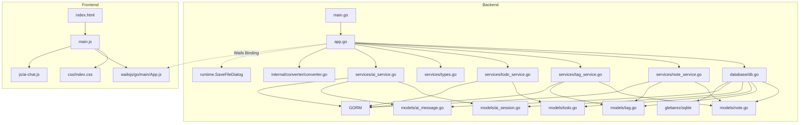

# Jot 项目分析报告

> 项目类型: 桌面端卡片式笔记应用（类小米笔记）
> 技术栈: Wails v2 + Go + GORM + SQLite + 原生 HTML/CSS/JS + CodeMirror 6（编辑器）+ aicli 自研 AI 客户端（go-openai/Ollama 双驱动）

---

## 一、目录结构梳理

```
jot/                                    # 项目根目录
├── main.go                             # 【入口文件】Wails 应用启动入口，配置窗口/资源/绑定
├── app.go                              # 【核心文件】Wails 绑定层，暴露 95+ 个 Go API 给前端
├── go.mod                              # Go 模块定义，声明依赖版本
├── go.sum                              # Go 依赖锁文件
├── wails.json                          # Wails 项目配置（名称/构建脚本/作者）
├── AGENTS.md                           # 本报告文件
│
├── internal/                           # 【内部包】Go 子包统一目录
│   ├── converter/
│   │   └── converter.go               # markitdown 封装：办公文件转 Markdown（7 种格式 + 60s 超时）
│   ├── markitdown/                     # 从 Go module cache 克隆的 markitdown 库本地副本（含 PDFium Stdout/Stderr Discard 修复）
│   ├── database/
│   │   ├── db.go                       # SQLite 初始化（glebarez/sqlite 纯 Go 驱动）+ WAL 模式 + 优化 PRAGMA + DefaultDBPath() 路径函数
│   │   └── builtin_profiles.go         # 内置 API 预设服务商定义（DeepSeek/智谱 GLM/Ollama/Agnes 等 12 个），InitDB 时按 Name 去重增量插入
│   ├── fontutil/
│   │   └── fonts_windows.go           # EnumFontFamiliesW API 封装
│   ├── models/
│   │   ├── note.go                     # Note 实体（笔记）
│   │   ├── tag.go                      # Tag 实体（标签）
│   │   ├── setting.go                  # Setting 实体（KV 配置）
│   │   ├── ai_session.go              # AI 会话实体（标题/置顶/时间戳）
│   │   │   ├── ai_session_config.go      # AI 会话操作栏配置实体（模型/深度思考/搜索源/卡片召回（含指定笔记本）/笔记引用/技能，与 AISession 一对一关联）
│   │   ├── ai_message.go              # AI 消息实体（角色/内容/思维链，外键关联 SessionID）
│   │   ├── api_profile.go             # API 配置预设实体（名称/服务商/URL/Key）
│   │   ├── ai_prompt.go               # AI 提示词实体（技能提示词数据库存储）
│   │   └── todo.go                    # Todo 实体（待办/文本/完成状态/时间戳）
│   └── services/
│       ├── note_service.go             # 笔记 CRUD + 搜索 + 置顶 + 回收站 + 统计 + 导入导出 + VACUUM 瘦身 + GetAllIDs
│       ├── tag_service.go              # 标签管理 + 笔记标签关联 + 标签计数
│       ├── setting_service.go          # 配置读写
│       ├── ai_service.go               # AI 业务层（自研 aicli 客户端，OpenAI 兼容/Ollama 双 Provider + 流式输出 + 深度思考 + 会话持久化 CRUD + 会话配置持久化 + 消息管理 + Token 后端计算 + 会话 Token 持久化 + 技能提示词查询）
│       ├── todo_service.go             # 待办 CRUD（创建/列表/切换完成/删除/编辑）
│       ├── profile_service.go          # API 配置预设 CRUD + 切换/激活
│       ├── crypto.go                   # 敏感密钥 Base64 编码/解码工具（(zk) 前缀标识）
│       ├── search_service.go           # 通用网页搜索（Tavily API）
│       ├── zhihu_search_service.go     # 知乎搜索 + 全网搜索
│   │       ├── recall_service.go           # 卡片召回（gse 分词 + 停用词过滤 + 相关度打分 + 按笔记本筛选）
│       ├── query_refiner.go            # 搜索 Query 精炼
│       ├── notebook_service.go         # 笔记本 CRUD
│   │   │   ├── types.go                    # 通用类型（PaginatedResult, DataStats, ImportResult, SettingsConfig, RecallNotebookIDs 等）
│
├── frontend/                           # 【前端目录】Wails 前端（Vanilla + Vite）
│   ├── index.html                      # 入口 HTML，9 个视图 + 关于浮层
│   ├── package.json                    # 前端依赖（Vite 3.x + CM6 ~16 包 + marked + highlight.js + @codemirror/lang-* 6 包 + @codemirror/legacy-modes）
│   ├── src/
│   │   ├── main.js                     # 【核心文件】前端逻辑（CM6 集成 + 搜索弹窗 + MD 语法页面 + AI 对话 + TOC + 回到顶部 + 批量管理 + 设置统一重构 + 骨架屏 + 锁屏密码 + 标签管理；数据管理页/回收站页/常量工具函数/通知类/模拟数据已拆分为独立模块）
│   │   ├── js/                         # 【JS 模块目录】
│   │   │   ├── cm6-syntax-highlight.js # CM6 通用语法高亮模块（13 套配色 + 46+ 语言解析器映射 + 围栏代码块嵌套解析 mdCodeLanguages + 行内代码标记插件 markdownInlineCodePlugin）
│   │   │   ├── editor-actions/        # 编辑器操作菜单分组模块目录
│   │   │   │   ├── format.js          # 格式化操作项（JSON/XML/HTML/CSS/JS/SQL/CSV/YAML/TOML 各含格式化+压缩 + SQL 辅助函数 compactSQL/convertSQLCase）
│   │   │   │   ├── text-transform.js  # 文本转换操作项（7 项）
│   │   │   │   ├── text-clean.js      # 文本清理操作项（5 项）
│   │   │   │   ├── encode-decode.js   # 编码解码操作项（6 项）
│   │   │   │   └── md-syntax.js       # MD 语法插入操作项（22 项，type: 'insert' 模式）
│   │   │   ├── editor-actions.js      # 编辑器操作菜单模块（聚合导入各分组模块 + 菜单渲染/交互/执行引擎，main.js import 引入）
│   │   │   ├── data-management.js      # 数据管理页面模块（10 个函数 + reloadSettings，从 main.js 提取）
│   │   │   ├── trash-page.js           # 回收站页面模块（6 个函数，从 main.js 提取）
│   │   │   ├── ai-chat.js              # AI 对话模块（自实现聊天引擎 + 流式输出 + Markdown 渲染 + 多会话管理 + 侧栏折叠 + 多来源搜索 + 卡片召回（含笔记本选择菜单）+ 引用笔记 + 上传文件 + 拖拽上传 + 更多技能 + 双语言翻译方向组件 + 语言选择浮层 + 技能激活时禁用更多技能按钮 + 用户消息编辑/删除/重新发送 + 会话统一菜单（置顶/重命名/导出/删除）+ 分块渲染 + Token 显示 + 提示词迁移 + 会话切换一次性渲染+同步滚动消除跳跃 + 会话配置持久化同步 + 替换消息操作统一后端原子方法 + 分页懒加载消息）
│   │   │   ├── constants.js            # 图标常量 SVGS + 工具函数（formatTime/highlightText/getSummary/debounce，从 main.js 提取）
│   │   │   ├── notification.js         # NotificationManager 通知类 + window.showNotification 全局函数 + 模拟数据（getMockNotes/getMockTags，从 main.js 提取）
│   │   │   ├── calendar.js             # 笔记日历模块（日历网格渲染 / 墨水圆点统计 / 本月摘要统计 / 按日笔记列表 / 回到今天 / 点击笔记跳转 / 切月自动重置今天）
│   │   │   └── preview-worker.js       # Web Worker 离线程 Markdown 渲染（从 src/ 移入）
│   │   └── css/                        # 【CSS 模块化目录】原 style.css + app.css 拆分
│   │       ├── index.css               # 入口文件，@import 引入所有子文件（设计系统 → 组件）
│   │       ├── variables.css           # 14 主题 CSS 变量：`--bg`/`--accent`/`--text-primary` 等
│   │       ├── reset.css               # 全局 reset（box-sizing/body 边距/overscroll-behavior）
│   │       ├── scrollbar.css           # 统一滚动条 6px 细条 + 自动隐藏 + 透明轨道 + 主题变量联动（含主内容区/搜索/AI 对话消息列表）
│   │       ├── animations.css          # 28 个 keyframes + 通用工具类 `.anim-*` + stagger 延迟
│   │       └── components/
│   │           ├── topbar.css          # 顶栏（品牌/搜索框/窗口控制按钮/更多菜单含图标）
│   │           ├── main-content.css    # 主内容区布局（卡片网格/视图容器/滚动）
│   │           ├── sidebar.css         # 笔记本侧边栏三段式设计 + 折叠按钮
│   │   │   │   ├── editor.css          # 编辑器面板/CM6 主题/全屏/预览/代码块复制按钮（含 AI 消息代码块）
│   │           ├── dropdowns.css       # 右键菜单/更多菜单/下拉选择器
│   │           ├── modals.css          # 通用模态框/确认弹窗/覆盖层/快捷键页面样式（shortcut-row flex 水平布局）
│   │           ├── settings-panel.css  # 设置页分段控件/滑块/开关/按钮
│   │           ├── search-modal.css    # 搜索弹窗/结果列表/高亮
│   │           ├── data-view.css       # 数据管理信笺风格统计 + 操作卡片
│   │           ├── md-reference.css    # MD 语法手册卡片源码/预览双栏对照
│   │   │   │   ├── ai-chat.css         # AI 对话页面（气泡/输入区/Markdown 渲染/打字指示器/会话侧栏/折叠按钮/滚动条自动隐藏/消息居中响应式宽度 clamp(800px,92vw,1600px)/32px 间距/更多技能菜单选中态+离场动画+翻译chip双语言布局/联网搜索 toggle 开关+召回笔记本菜单）
│   │           ├── todo.css            # 待办清单页面（输入+筛选一体化工具栏/8 个 @keyframes 动画 + 两段式新增 + 编辑保存动画 + 悬浮预览 tooltip）
│   │           └── calendar.css        # 笔记日历视图样式（日历网格/墨水圆点/统计卡片/笔记列表/入场动画）
│   ├── wailsjs/                        # Wails 自动生成的 JS 绑定
│   │   └── go/main/
│   │       ├── App.js                  # 后端 API 的 JS 封装
│   │       ├── App.d.ts               # TypeScript 类型定义
│   │       └── models.ts              # Go 模型的 TS 类型
│   └── dist/                           # Vite 构建产物（前端编译输出）
│
└── .trae/specs/                        # 项目 Spec 文档目录
```

### 目录规范评价

| 维度 | 评价 |
|------|------|
| **分层清晰度** | 优秀。严格按 `models → services → database → app` 分层，前端后端隔离清晰 |
| **命名规范** | 良好。目录名使用复数形式（models/services），符合 Go 社区惯例 |
| **冗余目录** | 无。每个目录职责单一，无多余层级 |
| **待改进** | 无（frontend/dist 已在 .gitignore 中） |

---

## 二、核心功能模块识别

### 2.1 基础支撑模块

| 模块名称 | 核心功能 | 对应文件 | 核心依赖 |
|----------|----------|----------|----------|
| **数据库初始化模块** | SQLite 连接建立、连接池配置、AutoMigrate | `database/db.go` | glebarez/sqlite, GORM |
| **数据模型层** | Note/Tag/Setting/AISession/AIMessage/APIProfile/AIPrompt/AISessionConfig/Todo 实体定义、GORM tag 映射 | `models/note.go`, `models/tag.go`, `models/setting.go`, `models/ai_session.go`, `models/ai_message.go`, `models/api_profile.go`, `models/ai_prompt.go`, `models/ai_session_config.go`, `models/todo.go` | GORM |
| **通用类型** | 分页返回格式、统计数据、导入导出结构 | `services/types.go` | 无外部依赖 |
| **Wails 绑定层** | Go API → JS Bridge，95+ 个绑定方法，含 runtime.SaveFileDialog | `app.go` | Wails v2 binding + runtime |
| **前端构建** | Vite 打包、Wails dev 热重载 | `frontend/package.json`, `wails.json` | Vite 3.x（保留，未移除）|
| **前端构建流程** | `wails build` 自动执行 `npm run build`（Vite）→ `frontend/dist/`，再嵌入 Go 二进制 | `go:embed all:frontend/dist` | 前端构建和后端编译都由 `wails build` 一条命令完成 |
| **字体枚举** | Windows GDI EnumFontFamiliesW 系统字体枚举 | `fontutil/fonts_windows.go` | gdi32.dll / user32.dll (syscall) |
| **配置存储** | KV 结构配置读写（字体偏好等） | `services/setting_service.go` | GORM |
| **路径工具** | 数据库默认路径 `~/.jot/data/jot.db` | `database/db.go:DefaultDBPath()` | `os.UserHomeDir()` |
| **办公文件转换器** | 封装 markitdown 库，将 .docx/.pdf/.xlsx 等 7 种办公文件转为 Markdown 文本，带 60s 超时保护 | `internal/converter/converter.go` | github.com/conductor-oss/markitdown

### 2.2 业务核心模块

| 模块名称 | 核心功能 | 对应代码 | 核心输入 | 核心输出 |
|----------|----------|----------|----------|----------|
| **锁屏密码** | SHA-256 哈希验证 + 设置/修改密码 | `app.go:VerifyScreenLockPassword/SetScreenLockPassword` | 密码明文 | bool/错误 |
| **笔记 CRUD** | 创建/更新/查询/删除笔记 | `services/note_service.go` | 标题/内容/颜色/ID | Note 对象/错误 |
| **笔记搜索** | 标题+内容 LIKE 模糊搜索，支持 3 种排序（updated_at/created_at/title，均 pinned DESC 优先）| `note_service.go:Search()` | 关键词/分页/sortBy 参数 | 笔记列表+总数 |
| **笔记置顶** | 切换置顶状态 | `note_service.go:TogglePin()` | 笔记 ID | 更新后的笔记 |
| **回收站** | 软删除/查看/恢复/永久删除 | `note_service.go:Delete/GetTrash/Restore/PermanentDelete` | 笔记 ID | 操作结果 |
| **批量回收站操作** | 全部恢复/全部清空 | `note_service.go:RestoreAll/EmptyTrash` | — | 操作结果 |
| **标签管理** | 标签 CRUD | `services/tag_service.go` | 名称/颜色/ID | Tag 对象 |
| **笔记标签关联** | 为笔记添加/移除标签 | `tag_service.go:AddTagToNote/RemoveTagFromNote` | 笔记ID+标签ID | 操作结果 |
| **按标签筛选** | 通过标签 ID 查询笔记 | `note_service.go:GetByTag()` | 标签ID/分页参数 | 笔记列表+总数 |
| **数据统计** | 统计笔记总数/回收站数/标签数 | `note_service.go:GetStats()` + `tag_service.go:Count()` | — | DataStats 对象 |
| **数据导出为 .db** | 导出为 SQLite 数据库文件（VACUUM INTO + fs.CopyEx）| `app.go:ExportDataWithDialog()` | — | "导出成功" 提示 |
| **数据导入** | 从 JSON 文件导入笔记（跳过同名） | `note_service.go:ImportFromJSON()` | JSON 字节数组 | ImportResult 对象 |
| **前端卡片渲染** | 卡片网格展示 | `frontend/src/main.js` | 笔记数据数组 | DOM 渲染 |
| **前端编辑器** | 笔记编辑模态框（CM6 编辑器，支持行号/撤销重做/查找替换/Tab缩进/自动补全/自动闭合括号/Markdown 语法高亮） | `frontend/src/main.js` | 笔记数据/用户输入 | 保存/取消 |
| **前端查找替换** | CM6 search panel，Ctrl+F 查找 / Ctrl+H 查找替换，选中内容自动填充搜索框，预览模式自动切回编辑模式搜索 | `frontend/src/main.js:handleKeyboardNavigation()` | 搜索关键词 | 搜索面板匹配导航 |
| **前端搜索交互** | 搜索弹窗 200ms 防抖自动搜索，支持标题/内容/标签（多标签 AND 语义过滤）、笔记本/日期/排序筛选器（排序 3 选项：更新时间/创建时间/名称，均 pinned 优先） | `frontend/src/main.js` | 关键词 + 过滤条件 + sortBy | 搜索弹窗结果列表 |
| **笔记日历视图** | 日历导航（上/下月切换） + 创建时间墨水圆点统计（1/2-5/6+ 三档） + 按日笔记列表 + 点击笔记原地打开编辑器查看模式 | `frontend/src/js/calendar.js` + `frontend/src/css/components/calendar.css` + `services/note_service.go:GetByDate/GetMonthCounts` + `app.go:GetNotesByDate/GetMonthNoteCounts` | 年月参数/日期字符串 | 按月统计 map / 按日笔记列表 |
| **前端导航切换** | 网格/搜索/设置/数据管理/回收站/AI 助手视图切换 | `frontend/src/main.js:switchView()` | 视图名称 | 视图 DOM 切换 |
| **前端右键菜单** | 右键弹出菜单（查看/编辑/置顶/删除） | `frontend/src/main.js` | 鼠标事件+笔记ID | 菜单显示/操作 |
| **前端只读查看** | 左击笔记打开只读查看器 | `frontend/src/main.js:openEditor()` | 笔记 ID | 只读查看模态框 |
| **编辑器操作菜单** | 顶栏「操作」按钮下拉菜单，配置驱动操作注册表（EDITOR_ACTIONS 数组按分组拆分到 `frontend/src/js/editor-actions/` 模块，主文件聚合导入），当前含 5 个分组：格式化（JSON/XML/HTML/CSS/JS/SQL/CSV/YAML/TOML 各含格式化+压缩，SQL 另有关键字大小写共 18 项）、文本转换（大写/小写/首字母大写/驼峰式/蛇形式/行反转/字符反转 7 项）、文本清理（去除多余空格/去除空行/行尾空格清理/Tab↔空格 5 项）、编码解码（Base64/URL/HTML 各含编码+解码 6 项）、MD 语法（22 项，`type: 'insert'` 插入模式：有选中包裹选中文本、无选中在光标处插入样板）。支持选中文本或全文处理 + Ctrl+Z 撤销 + 查看模式隐藏 + 预览模式隐藏。无 subGroup 的项直接铺平在分组下，有 subGroup 的渲染为嵌套子菜单。 | `frontend/src/js/editor-actions.js` + `frontend/src/js/editor-actions/*.js` + `frontend/src/main.js`（import + els 注册 + window.cmEditor 暴露） | 选中文本或全文 | 格式化/转换/清理/编码解码/MD 样板结果 |
| **标签搜索** | 点击标签 chip 打开搜索弹窗并预选该标签筛选器 | `frontend/src/main.js:searchByTag()` | 标签 ID | 搜索弹窗结果列表 |
| **键盘快捷键** | Ctrl+F 编辑器搜索 / Ctrl+H 编辑器查找替换 / Ctrl+N 新建 / Ctrl+L 编辑器切换模式 / Ctrl+P 启动器菜单 / PgUp/PgDn 滚动 / Ctrl+Home/End / Ctrl+0 锁屏 | `frontend/src/main.js:handleKeyboardNavigation()` | 键盘事件 | 对应操作 |
| **版本号信息** | 返回 verman.V.GitVersion 纯版本号 | `app.go:GetVersion()` | — | 版本字符串 |
| **打开外链** | 调用 runtime.BrowserOpenURL 在默认浏览器打开链接 | `app.go:OpenProjectURL()` | URL 字符串 | — |
| **打开数据目录** | 在文件管理器中打开 `~/.jot/data/` | `app.go:OpenDataDir()` | — | explorer 文件管理器 |
| **一键备份** | 备份当前库到 `~/.jot/backup/jot-backup.db`（覆盖）| `app.go:BackupToDir()` | — | 备份成功提示 |
| **一键还原** | 从 `jot-backup.db` 还原并刷新笔记/标签/统计 | `app.go:RestoreFromDir()` | — | Toast 提示结果 |
| **外观设置** | 字体族下拉选择（搜索+键盘导航）+ 字体大小滑条（10-32px 实时预览）+ 主题选择（14 种）+ 主题预览迷你 UI 卡片 | `frontend/src/main.js:loadFontSettings/applyFontFamily/applyFontSize` + `loadThemeSetting` | 字体名称/大小/主题名称 | 更新 CSS 变量 |
| **AI 对话** | 自研 aicli 客户端，支持 OpenAI 兼容 + Ollama 双 Provider 流式对话（自实现聊天引擎 + Markdown/代码高亮渲染 + 多会话管理 + 会话置顶 + 更多按钮下拉菜单 + 多来源联网搜索（Tavily/知乎/全网搜索）+ 卡片召回 + 引用笔记 + 更多技能 + 用户消息编辑/删除/重新发送 + 操作按钮折叠 + Token 显示 + 提示词迁移到数据库 + 联网搜索与卡片召回通用 Query 精炼 + 搜索指示器三态展示 + 搜索来源与召回卡片结构化数据持久化 + 会话自动恢复 + 后端统一上下文注入 + 分页懒加载消息 + 基于 msgID 的截断操作 + 再生原子化 + 搜索来源与召回卡片前端预览截断 200 字） | `services/ai_service.go`+ `aicli/` + `frontend/src/js/ai-chat.js`+ `frontend/src/css/components/ai-chat.css` | 用户消息 | AI 流式回复 |
| **AI 配置管理** | Base URL/API Key/Model 的读写 + 连通性测试 + 模型列表获取 | `app.go:GetAIConfig/SaveAIConfig/TestBaseURL/FetchAIModels` | 配置项 | 配置/测试结果 |
| **统一通知系统** | NotificationManager 单例类，右上角浮动通知，4 种类型 + undo 撤销 | `frontend/src/js/notification.js` | 消息/类型/回调 | 通知 DOM 创建与自动销毁 |

### 2.3 模块分层图

```
┌─────────────────────────────────────────────────────┐
│                    Frontend                          │
│  (main.js / css/index.css / index.html)               │
│   ├─ 视图渲染 (卡片/搜索/设置/数据管理/回收站/AI/MD 语法/日历/待办)     │
│   ├─ 交互逻辑 (事件绑定/状态管理)                      │
│   └─ Wails Bridge (window.go.main.App.*)              │
└────────────────────────┬────────────────────────────┘
                         │ Wails Binding (JSON 序列化)
┌────────────────────────▼────────────────────────────┐
│              App 层 (app.go)                         │
│  95+ 个绑定方法（CRUD/搜索/置顶/回收站/统计/导入导出/路径/│
│    AI 配置/会话管理/消息管理/笔记本回收站/配置文件预设)    │
│  (含 runtime.SaveFileDialog 原生对话框调用)            │
└────────────────────────┬────────────────────────────┘
                         │
              ┌──────────┼──────────┐
              ▼          ▼          ▼
    ┌─────────────┐ ┌──────────┐ ┌────────────┐ ┌──────────────┐
    │ NoteService │ │TagService│ │TodoService │ │  AI Service  │
    │ (CRUD/搜索/ │ │(CRUD/关联)│ │ (CRUD/切换 │ │ (AI 流式对话 │
    │  置顶/回收站 │ │          │ │  完成/删除 │ │  会话管理    │
    │  统计/导入   │ │          │ │  编辑)     │ │  消息持久化) │
    │  导出)      │ │          │ │            │ │              │
    └──────┬──────┘ └─────┬────┘ └──────┬─────┘ └──────┬───────┘
           │              │             │              │
           └──────┬───────┴──────┬──────┴──────┬───────┘
                  │              │              │
                  ▼              ▼              ▼
        ┌─────────────────┐ ┌──────────┐ ┌─────────────────┐
        │    GORM ORM     │ │GORM ORM │ │   GORM ORM     │
        │ (数据访问层)      │ │(待办层)  │ │ (AI 模型层)     │
        └────────┬────────┘ └────┬─────┘ └────────┬────────┘
                 │               │                 │
                 └───────────────┴─────────────────┘
                                    ▼
                          ┌─────────────────┐
                          │     SQLite      │
                          │ (glebarez/sqlite│
                          │  纯 Go 驱动)     │
                          └─────────────────┘
```

---

## 三、模块间依赖关系分析

### 3.1 依赖关系详表

| 依赖方 | 被依赖方 | 依赖类型 | 依赖详情 |
|--------|----------|----------|----------|
| `app.go` | `database` | 编译依赖 | 调用 `database.InitDB()` 获取 `*gorm.DB` 实例 |
| `app.go` | `services` | 编译依赖 | 创建 `NoteService` / `TagService` / `TodoService` / `SettingService` 实例 |
| `app.go` | `models` | 编译依赖 | 返回 `*models.Note` / `*models.Tag` / `*models.Todo` / `*models.Setting` 类型 |
| `app.go` | `runtime` | 编译依赖 | `runtime.SaveFileDialog` 原生保存对话框 |
| `app.go` | `fontutil` | 编译依赖 | `fontutil.GetFonts()` 枚举系统字体 |
| `services` | `models` | 编译依赖 | 操作 Note/Tag/Todo/Setting/AISession/AIMessage 结构体 |
| `services` | GORM | 编译依赖 | `*gorm.DB` 数据库操作 |
| `database` | `models` | 编译依赖 | `AutoMigrate(&models.Note{}, &models.Tag{}, &models.Todo{}, &models.Setting{}, &models.AISession{}, &models.AIMessage{})` |
| `database` | glebarez/sqlite | 编译依赖 | 纯 Go SQLite 驱动 |
| `fontutil` | gdi32/user32 | 运行时依赖 | syscall 调用 Windows GDI API |
| `frontend/main.js` | `wailsjs/go/main/App.js` | 运行时调用 | `window.go.main.App.*` 调用后端 API |
| `frontend/wailsjs` | `app.go` | 构建时生成 | `wails generate module` 自动生成 |

### 3.2 依赖关系图（Mermaid）


```mermaid
graph TD
    subgraph Backend
        A[main.go] --> B[app.go]
        B --> C[database/db.go]
        B --> D[services/note_service.go]
        B --> E[services/tag_service.go]
        B --> TD[services/todo_service.go]
        B --> F[services/types.go]
        B --> AI[services/ai_service.go]
        B --> CV[internal/converter/converter.go]
        C --> G[models/note.go]
        C --> H[models/tag.go]
        C --> TD2[models/todo.go]
        C --> I[models/ai_session.go]
        C --> J[models/ai_message.go]
        D --> G
        D --> H
        E --> G
        E --> H
        TD --> TD2
        AI --> I
        AI --> J
        C --> K[glebarez/sqlite]
        D --> L[GORM]
        E --> L
        TD --> L
        AI --> L
        B -.-> M[runtime.SaveFileDialog]
    end

    subgraph Frontend
        N[index.html] --> O[main.js]
        O --> P[css/index.css]
        O --> Q[wailsjs/go/main/App.js]
        O --> R[js/ai-chat.js]
    end

    B -.->|Wails Binding| Q
```

### 3.3 依赖问题分析

| 问题类型 | 描述 | 严重程度 |
|----------|------|----------|
| **循环依赖** | 无。所有依赖为单向 `main → app → services → models`，无循环 | ✅ 无问题 |
| **过度依赖** | 无。每个 Service 仅依赖 `*gorm.DB` 和自身模型 | ✅ 无问题 |
| **依赖缺失** | 无。`go.sum` 中所有传递依赖完整 | ✅ 无问题 |
| **隐式依赖** | 前端 `window.go` 对象依赖 Wails 运行时注入，本地开发/独立预览时不可用 | ⚠️ 有降级处理（Mock 数据） |
| **编译期依赖 vs 运行时依赖** | `wailsjs/` 目录需在修改 `app.go` 后重新生成 | ⚠️ 需手动执行 `wails generate module` |

---

## 四、设计模式与实现逻辑

### 4.1 设计模式识别

| 模式名称 | 应用位置 | 说明 | 代码示例 |
|----------|----------|------|----------|
| **Service Layer 模式** | `services/` 包 | 将业务逻辑从 controller（app.go）中抽离，封装为独立 Service 结构体 | `NoteService` / `TagService` |
| **依赖注入 (DI)** | `app.go` | Service 依赖的 `*gorm.DB` 通过构造函数注入 | `NewNoteService(db)` / `NewTagService(db)` |
| **Repository 模式** | `services/` 包内嵌 GORM | Service 内部直接使用 GORM 作为数据访问层 | `s.db.Create()` / `s.db.Where()` |
| **单例模式 (应用级)** | App 结构体 | Wails 运行时保证 App 实例唯一 | `NewApp()` 在 `main()` 中仅调用一次 |
| **MVC 变体** | 整体架构 | Model(models) - View(frontend) - Controller(app.go + services) 分层 | 见分层图 |
| **降级策略 (Fallback)** | `frontend/main.js` | 后端未绑定时自动使用 Mock 数据 | `if (!window.go.main.App.GetNotes) { state.notes = getMockNotes(); }` |
| **Wails Runtime 集成** | `app.go` | 通过 runtime 包调用原生桌面功能 | `runtime.SaveFileDialog()` 弹出系统保存对话框 |

### 4.2 核心业务逻辑流程

#### 4.2.1 笔记创建流程

```
用户点击 "+" 按钮 / Ctrl+N
  → openEditor(null)          // 打开空编辑器模态框
    → 用户填写标题/内容/选择颜色/选择标签
    → 点击"保存"按钮
      → createNote()
        → 前端校验（标题不为空）
        → window.go.main.App.CreateNote(title, content, color)
          → app.go:CreateNote()
            → noteService.Create()          // GORM db.Create(&note)
            → 返回 *models.Note（含 id）
          → 遍历 selectedTags
            → window.go.main.App.AddTagToNote(note.id, tagId)
              → tagService.AddTagToNote()   // GORM Association("Tags").Append
        → closeEditor()                     // 关闭模态框
        → loadNotes()                       // 重新加载笔记列表
          → GetNotes(1, 100)                // 分页查询
          → renderCardGrid()                // 渲染右侧卡片网格
```

#### 4.2.2 笔记搜索流程

```
Ctrl+F / Ctrl+K → 打开搜索弹窗
  → els.searchModalInput 自动聚焦
  → 用户输入文字 → 200ms 防抖
    → searchModalLoadPage(1, false)
```

...（中间流程不变）

---

## 五、技术栈评估

### 5.1 技术栈清单

| 层级 | 技术 | 版本 | 用途 |
|------|------|------|------|
| **桌面框架** | Wails v2 | v2.9.2 | 桌面窗口 + Go ↔ JS Bridge |
| **后端语言** | Go | go1.22+ | 后端业务逻辑 |
| **数据库** | SQLite | — | 本地数据存储 |
| **数据库驱动** | glebarez/sqlite | v1.11 | 纯 Go SQLite 驱动（无 CGO） |
| **ORM** | GORM | v1.25 | 对象关系映射 |
| **前端构建** | Vite | v3.2.11 | 前端打包工具 |
| **前端技术** | 原生 HTML/CSS/JS | — | UI 渲染 |
| **编辑器** | CodeMirror 6 | @codemirror/view v6.26 | 笔记编辑器 |
| **Markdown 解析** | marked | v12.0 | Markdown → HTML 渲染 |
| **代码高亮** | highlight.js | v11.10 | 代码块语法高亮 |
| **Mermaid 图表** | mermaid | v11.4 | Markdown 代码块图表渲染（mermaid/render 子路径） |
| **AI 对话** | 自研 aicli 客户端（go-openai + ollama 双驱动） | github.com/sashabaranov/go-openai v1.41.2 + github.com/ollama/ollama v0.31.1 | 流式对话/深度思考/多会话/联网搜索/卡片召回 |
| **本地存储** | localStorage | — | UI 状态持久化（主题/侧栏状态等） |

### 5.2 技术栈选型评价

| 评价维度 | 说明 |
|----------|------|
| **合理性** | Wails v2 适合桌面端 Go 应用，原生 HTML/CSS/JS 避免前端框架学习成本 |
| **性能** | SQLite + GORM 组合满足本地笔记应用性能需求，流式输出不阻塞 UI |
| **维护性** | 前后端分层清晰，CSS 模块化拆分降低维护成本 |
| **可扩展性** | 新增功能只需添加 binding 方法和前端模块，架构本身无限制 |
| **风险** | Wails v2 社区较小，Wails v3 路线图不明确，长期维护可能受限 |

### 5.3 版本兼容性问题

| 问题 | 说明 |
|------|------|
| **Wails 版本锁定** | `go.mod` 中 `wails.io v2.9.2` 已固定，`wails/v2` 包需与 Wails CLI 版本匹配。升级需同步更新 CLI, go.mod, wails.json 三方 |
| **GORM AutoMigrate** | 新增模型（如 AISession/AIMessage）后需在 `database/db.go` 的 `AutoMigrate` 中注册，否则表不会自动创建 |

---

## 六、补充分析

### 6.1 扩展性评估

| 扩展方向 | 可行性 | 建议 |
|----------|--------|------|
| **多用户/云端同步** | 低 | 如需云端同步，建议引入 WebDAV/第三方同步库 |
| **AI 功能扩展** | 高 | 当前 AI 会话架构（Session + Message 模型）天然支持多会话切换和上下文管理，易于扩展。新增方法直接注册 binding 到 app.go 即可 |
| **国际化 (i18n)** | 中 | 所有 UI 文本硬编码在 HTML/JS 中，需统一抽离 |
| **插件系统** | 低 | 原生 HTML 架构不适合动态加载插件 |

### 6.2 性能关键点

| 关键点 | 现状 | 评估 |
|--------|------|------|
| **数据库查询** | GORM + SQLite，分页查询 | ✅ 满足笔记本规模 |
| **前端渲染** | 卡片网格渲染 | ✅ 性能良好 |
| **AI 流式输出** | 基于 Wails Events 逐块推送，不阻塞 UI | ✅ 体验优秀 |
| **CM6 编辑器** | 仅初始化当前编辑的笔记 | ✅ 性能良好 |
| **多会话切换** | 切换时从后端加载对应会话的消息，采用一次性同步渲染（无 yield）+ 同步滚动（`scroll-behavior: auto` 临时禁用），浏览器只绘制一次最终状态，彻底消除视觉跳跃。后端 `LoadAISessionMessagesPaginated` 在返回前端前已截断 `RecallCards`/`SearchSources` 的 Content 为 200 字，减小 Wails 桥传输量和 DOM 渲染开销 | ✅ 切换瞬间完成，无任何中间状态闪烁 |
| **操作按钮折叠测量** | `collapseActionsIfNeeded()` 支持 `sync` 同步模式，在 `switchSession()` 中使用同步测量避免布局抖动 | ✅ 消除消息"跳跃"问题 |

### 6.3 异常处理分析

| 异常场景 | 处理方式 |
|----------|----------|
| **后端 API 不可用** | 前端 Mock 数据降级 |
| **AI API 调用失败** | HTTP 状态码封装为 11 种分类中文提示（auth_error/rate_limit/server_error 等），通过 `ai:stream-error` 事件以 JSON 格式（`{category, user_msg, raw}`）传递到前端，解析后通过 `showNotification()` 右上角通知展示，不再插入对话流中 |
| **联网搜索失败** | 每个搜索来源独立发射错误事件 `ai:search-error`，不影响其他来源继续搜索；前端通过 `showNotification()` 提示用户 |
| **数据库损坏** | 备份还原机制 |
| **办公文件转换失败** | 60s 超时保护 + `Warnw` 日志记录大文件/损坏文件，`Errorw` 记录转换异常；前端通过 `showImportResults()` 逐个显示文件错误详情 |
| **流式连接中断** | 前端监听 `ai:stream-error` 事件，显示错误提示 |
| **会话/消息查询失败** | 返回空列表 + 控制台错误日志，不阻断 UI |

### 6.4 安全分析

| 风险点 | 评估 |
|--------|------|
| **本地数据库** | SQLite 文件本地存储，无远程访问风险 |
| **API Key 存储** | Base64 编码存储在 DB 中，带 `(zk)` 前缀标识，前端读写均为解码后明文。仅防肉眼查看，非真实加密 |
| **XSS 风险** | AI 回复经 `marked.parse()` 渲染，`marked` 默认 Sanitize |

### 6.5 数据库优化

| 优化项 | 配置 | 说明 |
|--------|------|------|
| **WAL 模式** | `PRAGMA journal_mode=WAL` | 允许并发读取，写入不阻塞读取，显著提升多线程场景性能 |
| **busy_timeout** | `PRAGMA busy_timeout=5000` | 忙等待超时 5 秒，避免 "database is locked" 错误 |
| **synchronous** | `PRAGMA synchronous=NORMAL` | WAL 模式下 NORMAL 级别安全且性能比 FULL 快得多 |
| **cache_size** | `PRAGMA cache_size=-8000` | 8MB 页面缓存（负值表示 KB 单位） |
- 初始化位置：`internal/database/db.go` 的 `InitDB()` 函数中，`SetMaxOpenConns(1)` 之后
- PRAGMA 执行失败不影响初始化流程（忽略错误），由调用方统一处理错误日志
- 导入/还原场景需清理 WAL 残留文件（`-wal`/`-shm`），防止旧文件干扰新数据库，清理逻辑在 `app.go` 的 `replaceDatabase()` 函数中

---

## 七、项目核心特点

### 核心设计理念

1. **Wails v2 跨平台桌面应用**：Go + 原生前端（HTML/CSS/JS）架构，兼顾后端性能和前端灵活性

2. **CodeMirror 6 编辑器集成**：主流 Markdown 编辑器引擎，支持行号/撤销重做/查找替换/Tab缩进/自动补全/语法高亮（13 套配色 + 46+ 语言）

3. **CSS 变量主题系统（14 主题）**：全局 CSS 变量联动（`--bg`/`--accent`/`--border` 等），一键切换 14 套系统主题 + 13 套代码高亮主题，所有组件自动适配。2026-07 完成配色全面重构——每套主题重新设计 `--bg`/`--card-bg`/`--bg-secondary` 等核心颜色值，E 护眼/深色/浅色等主题彻底重做，共修改 ~140 个变量

4. **三步交互范式**：笔记本（容器）→ 笔记卡片（列表）→ 编辑器（操作），符合直觉的文件夹-文件-编辑结构

5. **自实现 AI 对话引擎（go-openai + ollama/ollama/api 双驱动）**：基于 go-openai 和 ollama/api 双库实现统一流式接口，支持 OpenAI 兼容（DeepSeek、通义千问等）和 Ollama 本地模型双 Provider。流式输出 + Markdown 渲染 + 代码高亮 + 思维链折叠 + 多会话管理 + 侧栏折叠 + 多来源联网搜索（Tavily/知乎/全网搜索，含全选/全取消开关）+ 卡片召回（含笔记本选择菜单）+ 引用笔记 + 更多技能 + 用户消息编辑/删除/重新发送 + Token 统计 + **后端统一上下文注入**。Provider 通过前端设置页下拉切换，配置自动持久化。

6. **统一的通知系统**：NotificationManager 单例，右上角浮动通知，支持 success/error/warning/info 四种类型 + undo 撤销

7. **过度动画与交互反馈**：28 个 keyframes、stagger 延迟、hover 分层反馈、spring 弹性缓动、骨架屏 shimmer、分段滑块弹簧曲线（`cubic-bezier(0.34, 1.2, 0.64, 1)`）、字体滑条实时预览

8. **无 UI 框架依赖**：无 Vue/React/Svelte，纯手写 DOM 操作，极致轻量

9. **Mermaid 图表渲染集成**：为 Markdown 代码块中的 `language-mermaid` 块提供按需渲染，默认显示源码，点击渲染按钮后直接主线程渲染 SVG。切换按钮与复制按钮风格统一，CSS `:has()` 处理双按钮防碰撞。

### 设计系统

- **尺寸**：`--radius-md`(8px) / `--radius-sm`(6px)，全局统一
- **间距**：4px 基线网格，组件内部 8-16px，布局 16-24px
- **阴影**：4 层 Token — `elevated`(卡片) / `dropdown`(下拉菜单) / `modal`(模态框) / `toast`(通知)
- **语义色**：`--success`(绿) / `--warning`(黄) / `--error`(红) / `--info`(蓝)
- **字体**：全局统一 `var(--font-family)`，编辑器和代码块跟随系统设置
- **滚动条**：6px 细条，`--scrollbar-thumb` / `--scrollbar-thumb-hover` 联动 14 主题
- **圆角一致性**：所有交互元素（按钮/卡片/输入框/下拉菜单/模态框）均使用 `var(--radius-sm)` 或 `var(--radius-md)`，无硬编码

---

## 八、待优化点

### 架构层面

- **代码分割**：main.js 可继续拆分为独立视图模块
- **CSS 变量颜色 Token**：AI 对话页面的配色确认已全部纳入主题系统

### 已实现

- [x] **CSS 模块化拆分**（variables, reset, scrollbar, animations + 6 组件模块）
- [x] **AI 对话自实现**（流式输出 + Markdown 渲染 + 思维链 + 代码高亮 + 多会话 + 侧栏折叠）
- [x] **笔记软删除与回收站**（Trash/Restore/PermanentDelete/RestoreAll/EmptyTrash）
- [x] **Markdown 语法手册页面**（10 张语法卡片 + 双栏源码/预览 + 打开编辑器试试）
- [x] **14 系统主题 + 13 代码高亮主题**（统一 CSS 变量体系，2026-07 完成配色全面重构）
- [x] **代码高亮主题推荐配对优化**（3 个系统主题的推荐映射重新匹配新配色：nord→github-dark、light→vscode-light-plus、quiet-light→material-palenight）
- [x] **搜索弹窗**（200ms 防抖 + 笔记本/日期/排序/标签筛选器）
- [x] **一键备份/还原**（BackupToDir/RestoreFromDir + VACUUM）
- [x] **返回查看/保存脏检测**（无变更不触发保存 + 不弹出通知）
- [x] **数据库瘦身 VACUUM**（数据管理页面按钮触发）
- [x] **字体设置**（族+大小，联动 CSS 变量）
- [x] **通知系统**（右上角 NotificationManager，4 种类型 + undo 撤销）
- [x] **更多菜单**（8 个选项，`min-width: 120px`）
- [x] **数字键导航**（Ctrl+数字键 1-9）
- [x] **快捷键说明页**（Ctrl+7 打开，可滚动列表）
- [x] **拖拽导入闪烁动画**（3 次红色慢闪）
- [x] **多来源联网搜索**（Tavily/知乎/全网搜索三来源独立开关 + 独立 Key 配置）
- [x] **搜索开关联动**（Key 为空自动禁用、点击启用时校验配置）
- [x] **切换会话分块渲染 + 延迟高亮**（CHUNK_SIZE=5 yield + requestIdleCallback hljs）
- [x] **消息操作栏简化**（移除独立按钮，仅常驻显示 Token，操作通过右键菜单）
- [x] **设置页 Token 默认隐藏 + 知乎 URL 修正**
- [x] **存储优化增强**（回收站自动清理 + 孤儿笔记迁移 + 空 AI 会话清理 + VACUUM 整合流程）
- [x] **批量管理重构**（FAB 入口 + CSS transition 动效 + 复选框移除 + 置顶按钮可操作）
- [x] **更多菜单子菜单拍平**（"帮助参考"子菜单取消，快捷键说明/MD 语法/关于 直接平铺到"帮助"分组下）
- [x] **待办清单功能**（Todo CRUD + 输入筛选一体化工具栏 + 6 个 keyframes 动画 + 筛选按钮数量显示）
- [x] **骨架屏编辑器**（点击笔记立即显示骨架屏 shimmer，异步加载内容后替换）
- [x] **笔记日历视图**（日历网格 + 创建时间墨水圆点 + 按日笔记列表 + 点击笔记网格视图打开编辑器）
- [x] **搜索来源 UI 优化**（内联卡片+折叠面板+SVG 图标+代码去重）
- [x] **召回卡片 UI 优化**（折叠面板+file_ext 徽章+CSS line-clamp+代码去重）
- [x] **编辑器骨架屏回归修复**（非缓存笔记打开校正+scrollbar-gutter 稳定）
- [x] **品牌标识动画优化**（transform 独立驱动，3 次迭代达成平滑过渡）
- [x] **用户消息 Token 提前展示**（SaveAIMessage 返回 token 数，立即显示）
- [x] **停止按钮全阶段防护**（搜索/LLM 阶段取消不报错不残留）
- [x] **Logger 初始化顺序修复**（NewApp 阶段初始化 Logger，startup 清理冗余代码）
- [x] **锁屏密码功能**（SHA-256 哈希存储 + 毛玻璃锁屏遮罩 + 设置页开关/密码配置 + 启动验证）
- [x] **设置项布局统一**（所有卡片 label 左/描述中/控件右三列对齐）
- [x] **服务商切换改为分段控件**（下拉菜单 → segmented-control + 弹簧曲线动画）
- [x] **字体大小滑条**（按钮组 → range slider 10-32px + 实时预览区）
- [x] **分段滑块指示器精度修复**（`(cw-8)/n` 公式消除溢出）
- [x] **设置页面侧边栏导航重构**（左侧 176px 侧边栏 + 9 个带 SVG 图标导航项 + 右侧面板切换替代纵向卡片列表布局 + 150ms 淡出左移 + 200ms spring 弹性滑入动画 + 服务商分段控件指示器重定位 + 布局体系统一 `.ai-setting-item`）
- [x] **标签管理卡片重设计（第二次迭代）**（输入框两行布局 + 预设8色色块选择器 + 自定义颜色入口`<input type="color">`叠加在按钮内部 + 标签列表CSS Grid卡片布局 + 增量DOM操作替代全量`loadTags()`重渲染 + spring弹性入场动画 + 收缩淡出删除动画 + 300ms超时fallback适配prefers-reduced-motion）
- [x] **AI 消息懒加载 + 后端上下文自取**（CallAIStream 从 DB 加载历史、LoadAISessionMessagesPaginated 分页、TruncateAISessionAtMessage/AfterMessage 截断、CallAIStreamRegenerate 后端读取末条用户消息再生、SumSessionTokens 后端统计 Token）
- [x] **锁屏密码 UI 精简**（移除独立状态标签，按钮文本自述状态，模态框根据状态动态显示旧密码输入框）
- [x] **Mermaid 图表支持**（代码块按需渲染 + 源码/视图切换 + 主题联动 isDarkTheme + 双按钮 SVG 图标 + 复制/渲染按钮防碰撞动画）
- [x] **更多菜单精工卡重设计**（毛玻璃 `blur(24px)` + 双层阴影悬浮感 + 三段式 overshoot 入场动画 + KBD 风格快捷键标签 + 分组左侧 accent 色装饰条 + 条目 hover 上浮微交互 + 子菜单拍平到帮助分组）
- [x] **移除更多菜单 Ctrl+1~8 快捷键**（删除 title 属性 + 全局 keydown handler + 快捷键说明页 + 动态 title 设置）
- [x] **待办清单移入 AI 分组**（从管理分组移动到 AI 分组，与 AI 助手同组）
- [x] **统一表格复制按钮样式**（SVG 图标 + 毛玻璃 backdrop-filter + min-width + 主题色 hover 边框 + 锚定 th 而非表格右边缘）
- [x] **优化 Mermaid 复制动画延迟**（200ms → 80ms，transition 0.15s → 0.08s）
- [x] **系统主题下拉菜单键盘导航**（ArrowUp/Down + 250ms 节流 + scrollIntoView + 打开聚焦 + 保持打开 + 外部点击区域判断）
- [x] **代码高亮主题下拉菜单键盘导航**（同上）
- [x] **翻译技能扁平化**（从子菜单改为普通菜单项，chip 显示源语言→目标语言方向组件 + 点击语言标签弹出浮层选择 6 种常用语言）
- [x] **技能菜单选中指示 + 点击切换**（已激活技能显示✓+accent 色高亮，打开菜单自动刷新；点击已激活技能取消引用，toggle 互斥模式）
- [x] **更多技能菜单离场动画**（反向交错消失 + 容器缩小淡出 0.18s，`setTimeout` 360ms 清理 class）
- [x] **AI 优化按钮取消 + 发送按钮禁用**（优化中可取消，显示停止按钮，恢复原文；发送按钮优化期间禁用）
- [x] **右键菜单复制通知**（AI/用户消息右键复制成功后通过 `showNotification('已复制')` 反馈）
- [x] **启动器网格**（Ctrl+P 触发全屏浮层，4 列网格 13 项功能 + 搜索过滤 + 方向键导航 + Enter 执行 + ESC 关闭 + 入场/离场动画 + stagger 卡片动画）
- [x] **快捷键说明页新增 Ctrl+P**（在 Ctrl+L/E 之间插入启动器快捷键条目）
- [x] **办公文件导入支持**（markitdown 库集成，支持 .docx/.pdf/.xlsx/.xls/.pptx/.epub/.zip 共 7 种办公文件格式，60s 超时保护 + goroutine 并发处理 + Wails Events 进度事件 + 前端批量进度通知 + 500ms 最小展示保底）
- [x] **卡片召回优化**（gse 分词替换 2-gram，复合词识别更好；SearchFull 改为 Go 侧相关度打分排序，标题命中 3 分/关键词、内容命中 1 分/关键词、覆盖率奖励）
- [x] **内置 API 预设服务商**（builtin_profiles.go 预配 DeepSeek/智谱 GLM/Ollama/Agnes 等 12 个常用服务商，启动时按 Name 去重增量插入，Key 留空用户自行配置）
- [x] **预设管理增删动画**（两阶段插入动画：先 max-height 展开空间再滑入内容；删除动画 CSS 覆盖 Bug 修复：preset-row-insert 类定义在后导致 preset-delete-out 动画被覆盖，animationend 永远不触发）
- [x] **预设弹窗遮罩点击穿透修复**（pointer-events: none 防止淡出期间拦截删除按钮点击；确认弹窗 z-index 从 1000 提升至 100000 避免被遮罩挡住）
- [x] **预设名称唯一性校验**（savePresetModal 提交前检查名称是否已存在，编辑时排除自身）
- [x] **编辑器操作菜单**（顶栏「操作」按钮 + 配置驱动下拉菜单，4 分组：格式化（JSON/XML/HTML/CSS/JS/SQL/CSV/YAML/TOML 格式化+压缩）、文本转换（7 项）、文本清理（5 项）、编码解码（6 项），选中或全文 + 撤销）
- [x] **MD 语法插入操作**（MD 语法分组 22 项，type: 'insert' 模式：行内样式/标题/列表/块元素/链接媒体/表格/数学公式，有选中包裹选中文本、无选中在光标处插入样板）
- [x] **编辑器操作菜单模块化拆分**（操作项按分组拆分至 `frontend/src/js/editor-actions/` 目录：format.js/text-transform.js/text-clean.js/encode-decode.js/md-syntax.js，主文件仅保留聚合导入 + 渲染/交互/执行引擎）

---

## 九、关键记忆点

1. **Wails v2 事件驱动流式输出**：AI 回复流式数据传输使用 `runtime.EventsEmit`（Go 端）+ `EventsOn`（前端），Go 端 `bufio.Reader` 逐行解析 SSE `data: {...}` 流，通过回调（`onChunk`/`onThinking`/`onDone`/`onError`）逐块推送。前端在 `onSend()` 中动态注册一次性事件回调（`Array.from` 包裹闭包捕获局部变量），每个请求各自独立的 `streamingContent`/`streamingEl`/`lastReasoningEl` 局部变量隔离，防止多消息冲突

2. **思维链折叠**：深度思考模型返回 `delta.reasoning_content`，Go 端在 `streamChoice.Delta` 中解析此字段，通过 `onThinking` 回调和 `ai:stream-thinking` 事件推送。前端创建 `<details class="ai-thinking">` 可折叠区域（summary + 内容），首次 thinking chunk 懒创建，后续流式追加，`addMessage()` 也接受 `reasoningContent` 参数用于显式渲染

3. **AI 会话持久化**：`AISession` + `AIMessage` 两个 GORM 模型（`ai_session.go`/`ai_message.go`），`SaveAIMessages()` 保存一轮对话并自动生成标题（取首条用户消息前 30 字），`LoadAISessionMessages()` 按 `CreatedAt` 升序返回历史消息，`ClearAISessionMessages()` 删除指定会话全部消息

4. **AI 对话侧栏 + 折叠机制**：左右分栏布局（`.ai-chat-layout`），左侧 `.ai-session-sidebar`（220px），右侧 `.ai-chat-content` flex:1。折叠按钮（`.ai-sidebar-toggle`）为 14×44px 纤细条状，置于侧栏外作为兄弟元素，通过兄弟选择器 `~` 控制 `left` 定位（展开时 220px、折叠时 0）。展开时按钮左侧加 `border-left: 1px solid var(--border)` 延续分割感。折叠状态 `localStorage` 持久化，CSS `transition: width 0.25s ease` 动画。SVG Chevron 图标（Lucide 风格）替代 Unicode 字符

5. **`onAIChatViewActivated` 惰性加载**：仅在 `activeSessionId === null`（无活跃会话）时自动加载第一个会话，视图切换不重置当前会话状态，避免切换回来后消息错乱。`switchSession()` 按 `msg.role` 遍历渲染，`Message` 结构体含 `ReasoningContent` 字段

6. **CSS 变量系统**：全局使用 `var(--xxx)` 定义主题变量，AI 对话页面全组件（气泡/侧栏/输入区/按钮）联动 12 套主题

7. **LangChainGo 统一 AI 接口**：`CallAIStream` 使用 `llms.GenerateContent` + `WithStreamingFunc`/`WithStreamingReasoningFunc` 统一流式输出。`createLLM()` 工厂函数根据 `provider` 字段创建对应 LLM 实例：`openai.New()`（OpenAI 兼容，含 BaseURL/Token/Model 配置）或 `ollama.New()`（Ollama 本地，含 ServerURL/Model 配置）。前端设置页新增「服务商」下拉选择器，切换时自动填充默认 URL、清空模型、保存配置。

8. **消息渲染与气泡**：`addMessage()` 创建消息气泡 DOM，AI 侧使用 `marked.parse()` 渲染 Markdown（含 `hljs.highlightElement()` 代码高亮），用户侧以 `<pre class="ai-user-msg">` 转义纯文本。打字指示器内嵌到 `msg-content` 内部（不独立建气泡）

9. **多来源联网搜索（三来源后端集成）**：`CallAIStream` 支持三个独立搜索来源：Tavily（通用搜索）、知乎搜索（`SearchZhihuContent`）、全网搜索（`SearchGlobalContent`）。后端通过 `SearchWeb`（Tavily）、`SearchZhihuContent`（知乎内容）、`SearchGlobalContent`（全网搜索）三个函数分别执行，每个来源独立发射 `ai:search-error` 事件处理失败不影响其他来源。搜索结果统一聚合注入 system message。详见 [search_service.go](internal/services/search_service.go)、[zhihu_search_service.go](internal/services/zhihu_search_service.go)

10. **前端多来源搜索动画**：搜索动画使用简易旋转地球 SVG + 文本变化展示状态，不展示具体来源状态详情。搜索错误通过 `showNotification()` 右上角浮动通知提示，不阻塞对话。`ai:search-source-status` 事件展示各来源进度（searching/done/failed），`ai:search-error` 事件携带来源标签和错误信息。详见 [ai-chat.js](frontend/src/js/ai-chat.js) `startStreaming()` 中的搜索事件监听

11. **搜索开关 Key 校验 + 禁用态**：前端三组搜索开关（Tavily/知乎/全网）分别受对应 Key/Tokon 配置控制。Key 为空时开关自动 disabled 防止误启用；点击启用时若 Key 未配置则 `showNotification` 提示用户先配置；修改 Key 为空时自动禁用对应开关。详见 [main.js](frontend/src/main.js) 中 settings 页搜索开关的校验逻辑

12. **切换会话性能优化（分块渲染）**：`switchSession()` 中对大量历史消息采用分块渲染策略（CHUNK_SIZE=5），每块渲染后 `setTimeout` 0ms yield 给浏览器，避免一次性渲染大量 DOM 导致卡顿。移除 `collapseActionsIfNeeded` 同步调用（该函数已删除，不再需要布局抖动补偿）。详见 [ai-chat.js](frontend/src/js/ai-chat.js) `switchSession()`

13. **延迟语法高亮（deferHighlight）**：`renderMarkdown()` 新增 `deferHighlight` 参数，历史消息加载时使用 `deferHighlightBlocks()` 通过 `requestIdleCallback` 渐进式执行 `hljs.highlightElement()`，优先级低于首次渲染，优先保证页面交互。详见 [ai-chat.js](frontend/src/js/ai-chat.js)

14. **设置页修复集**：①知乎 Token 输入框默认 `type="password"` 隐藏；②三个搜索开关检查对应 Key/Tokon 是否配置，未配置时 disabled；③知乎开发者地址改为 `https://developer.zhihu.com/`。详见 [main.js](frontend/src/main.js)

15. **重置出厂设置修复集**：①`resetDatabase()` 清空 `#aiChatMessages.innerHTML` 和 `#aiSessionList.innerHTML` 避免旧数据残留；②`onAIChatViewActivated()` 中清除标题/contextSize/chatHistory/sessions/activeSessionId 等模块级变量；③重置后自动调用 `onAIChatViewActivated?.()` 让 AI 助手模块立即进入就绪状态，消除闪烁。详见 [data-management.js](frontend/src/js/data-management.js)、[ai-chat.js](frontend/src/js/ai-chat.js)

16. **AI 错误通知修复（`ai:stream-error` JSON 格式化）**：`app.go` 中搜索关键词精炼失败时（`services.RefineSearchQuery` 出错），原始代码拼接纯文本前缀 `"搜索关键词精炼失败: " + err.Error()` 发射事件，前端 `JSON.parse()` 失败，错误落入 `addErrorMessage()` 被插入对话流。修复后通过 `errors.As()` 解出 `*aicli.AIErrorWrapper`，直接透传其 JSON（含 `category/user_msg/raw`）；若不是 AI 错误则用 `CategoryUnknown` 创建标准 JSON。前端收到合法 JSON 后走 `showNotification()` 右上角通知。详见 [app.go](app.go#L1079-L1088)、[ai-chat.js](frontend/src/js/ai-chat.js#L2227-L2237)、[errors.go](internal/aicli/errors.go)

17. **全局链接系统浏览器打开**：在 `main.js` 的 `initEventListeners()` 中添加 `document` 级 click 事件委托，拦截所有 `<a>` 标签点击，通过 `e.preventDefault()` + `window.runtime.BrowserOpenURL(href)` 在系统默认浏览器中打开。排除 `#` 锚点链接和 `javascript:` 伪协议。同时移除了 `ai-chat.js` 中 `messagesEl` 级别的区域委托和搜索来源面板中的冗余 `link.addEventListener` 代码。详见 [main.js](frontend/src/main.js#L5131-L5138)

18. **后端统一上下文注入架构**：AI 对话的上下文拼接逻辑全部迁移到后端 `CallAIStream`。8 步拼接顺序定义为 `1→2→3→4→5→6→7→8`：角色扮演笔记 → 笔记引用 → 追问引用 → 上传文件 → 联网搜索结果 → 卡片召回结果 → 技能提示词（含 `{roleplay_context}` 占位符替换）。前端只传元数据（角色扮演笔记 IDs / 引用笔记 IDs / 追问引用文本 / 上传文件列表），不再拼接 `systemContext`。详见 [app.go](app.go#L1548-L1655)

19. **后端原子替换会话消息**：AI 消息的编辑/删除/重发/重新生成四个操作中的 DB 写入，从前端两步调用 `ClearAISessionMessages` + `SaveAIMessages` 合并为后端 `ReplaceAISessionMessages(sessionID, messages)` 单次调用。后端使用 GORM Transaction 保证清空+写入的原子性。前端 `chatHistory` 为空时 fallback 到 `ClearAISessionMessages`。详见 [ai_service.go#L661-L728](internal/services/ai_service.go#L661-L728)、[app.go#L2048-L2059](app.go#L2048-L2059)

20. **AI 消息懒加载 + 后端上下文自取**：`CallAIStream` 重构为仅接收 `userText` 和元数据，后端自行从 DB 加载全部历史消息构建上下文。新增 `CallAIStreamRegenerate` 处理再生场景（接收元数据不含 userText，加载 DB 中最后一条用户消息）。新增 `LoadAISessionMessagesPaginated` 分页加载（游标 `beforeID`，默认 6 条 ASC）。编辑/重发/再生从基于 `chatHistory.splice` 改为基于 `msgID` 的 `TruncateAISessionAfterMessage`，删除操作从 `TruncateAISessionAtMessage` 改为 `DeleteAIMessage`（仅删单条而非截断）。Token 显示改为后端 `SumSessionTokens` + `GetSessionContextTokens` 统计。`stream-done` 事件扩展为 9 参数（含 `userMsgID`/`assistantMsgID`）。详见 [app.go](app.go)、[ai_service.go](internal/services/ai_service.go)、[ai-chat.js](frontend/src/js/ai-chat.js)

21. **SQLite WAL 模式 + 优化 PRAGMA**：`InitDB()` 中配置 `journal_mode=WAL`、`busy_timeout=5000`、`synchronous=NORMAL`、`cache_size=-8000`。PRAGMA 执行失败不中断初始化，由调用方统一记录日志。`replaceDatabase()` 中清理 `-wal`/`-shm` 残留文件防止导入/还原数据损坏。详见 [db.go](internal/database/db.go)、[app.go](app.go)

22. **基础 System Prompt 三层重构 + 技能注入修复**：将单句硬编码基础 prompt 拆分为包级常量 `baseIdentity`（身份层）、`baseNormsBoundaries`（规范层+边界层）、`baseSystemPrompt`（完整三层）。修复 `CallAIStream`/`CallAIStreamRegenerate` 中技能激活时跳过全部基础 prompt 的 Bug，改为始终注入规范层+边界层，仅身份层在技能激活时跳过。详见 [app.go](app.go)

23. **启动器网格（Launcher Grid）全屏浮层实现**：新增 `Ctrl+P` 触发的全屏启动器网格，与"更多"菜单并存互不干扰。核心设计要点：① ES module 中函数不会自动挂到 `window` 上，launcher 调用的操作函数（`toggleSidebar`/`openShortcuts`/`showAbout` 等）需手动 `window.xxx = xxx` 暴露；② `executeAction` 先调 `closeLauncher(callback)` 等离场动画 `transitionend` 完成后再执行操作，不能用 `setTimeout` 硬等——离场动画涉及 mask 和 panel 共 4 条过渡属性，`transitionend` 会冒泡 4 次，需 `_closed` 守卫防止重复触发；③ 方向键首次导航 `_selectedIndex === -1` 时直接跳第一项；④ 动画使用 `requestAnimationFrame` 双阶段（`display: flex` → `visible` class 触发入场），离场用 `closing` class 触发反方向过渡 + `transitionend` 监听 + 300ms `setTimeout` 保底。详见 [launcher.js](frontend/src/js/launcher.js)、[launcher.css](frontend/src/css/components/launcher.css)

24. **markitdown 库本地克隆 + Wails 构建 PDF 转换修复**：将 `github.com/conductor-oss/markitdown` 从 Go module cache 克隆到 `internal/markitdown` 进行本地维护，通过 `go.mod` replace 指令引用。修复 `wails build` 后 PDF 转换失败问题——根因是 Wails GUI 构建缺少有效控制台句柄，wazero 初始化 PDFium WebAssembly 时调用 `GetFileType /dev/stdout` 返回无效句柄错误。修复方案：在 `initPdfiumPool()` 的 `webassembly.Config` 中添加 `Stdout: io.Discard` 和 `Stderr: io.Discard`，避免 wazero 对无效句柄调用 `GetFileType`。详见 [internal/markitdown/converter_pdf_pdfium.go](internal/markitdown/converter_pdf_pdfium.go)、[go.mod](go.mod)

25. **全屏模式顶栏分割线隐藏**：编辑器进入全屏模式（`.editor-panel.fullscreen`）时，通过纯 CSS `:has()` 选择器（`.main-content-area:has(.editor-panel.fullscreen) #topbar`）将顶栏底部 `border-bottom-color` 设为 `transparent`，使顶栏与编辑器面板在视觉上融为一体，无分割线更加宽阔沉浸。利用 topbar 已有的 `transition: border-color 0.3s ease-out` 实现平滑淡出/恢复。零 JS 改动，纯 CSS 实现。详见 [editor.css](frontend/src/css/components/editor.css)

---

## 记忆点 1：设置页按钮统一为固定宽度 + spinner 纯动画加载 + 预设连接测试

| 记忆点 | 内容 |
|--------|------|
| **变更概览** | 三个互相关联的 UI 优化：① 设置页所有操作按钮（测试 × 4 + 获取模型）统一文字为「测试」/「获取」，固定宽度 `52px`，消除加载态宽度抖动；② 按钮加载状态改为仅旋转 spinner（保留原有文字不显示），`setBtnLoading` 不再改文字，确保加载前后宽度一致；③ 预设编辑/新增弹窗增加「测试连接」功能——后端 `TestAIConnection` 直接验证输入值，URI 输入框右侧 inline 按钮，空值 warning 提示，成功时展示预设名称。 |
| **按钮宽度统一** | [index.html](frontend/index.html#L498)：API 连接页「测试 URL」→「测试」+ `width:52px`；[index.html](frontend/index.html#L620-L640)：Tavily/知乎「测试连接」→「测试」+ `width:52px`；[index.html](frontend/index.html#L2031)：预设弹窗「测试」按钮；[index.html](frontend/index.html#L528)：「获取列表」→「获取」+ `width:52px`。 |
| **加载动画改进** | [main.js](frontend/src/main.js)：`setBtnLoading` 加载态清空文字追加 spinner（不改原文）、恢复态移除 spinner 还原文字；[settings-panel.css](frontend/src/css/components/settings-panel.css)：`.btn-loading` 加 `justify-content: center` 保证居中。 |
| **预设连接测试** | [app.go](app.go#L1462-L1473)：新增 `TestAIConnection(provider, baseURL, apiKey string) (bool, error)`；[main.js](frontend/src/main.js#L2770-L2842)：`testPresetConnection` 取表单值 → 校验 → `setBtnLoading` → 调后端 → 通知结果（成功含预设名、空值 warning）。 |
| **编辑行精准替换** | [main.js](frontend/src/main.js#L3041-L3049)：编辑预设保存后，通过 `data-profile-id` 定位旧行，`replaceWith` 替换为新行，避免全量重渲染闪烁。 |
| **涉及文件** | [app.go](app.go)、[frontend/index.html](frontend/index.html)、[frontend/src/main.js](frontend/src/main.js)、[frontend/src/css/components/settings-panel.css](frontend/src/css/components/settings-panel.css) |

---

## 记忆点 2：预设管理列表收起动画修复与重设计（Web Animations API）

| 记忆点 | 内容 |
|--------|------|
| **变更概览** | 管理列表关闭动画从未正常播放（根因：CSS base class 自带 animation，切换 `.closing` 时浏览器不会可靠重启新动画）。修复方案：动画从 base class 剥离，入场通过 `.open` class 触发；离场改用 Web Animations API（`element.animate()`）直接驱动，彻底绕过 CSS state 问题；关闭效果重新设计为"挤压 + 散景模糊 + 淡出"（`scaleY(1)→0.95`、`filter: blur(0)→2px`、`opacity: 1→0`）。同时添加逻辑：展开预设下拉时，若管理列表开着则先等关闭动画完成再展开下拉。 |
| **CSS 剥离** | [settings-panel.css](frontend/src/css/components/settings-panel.css#L1074-L1118)：从 `.preset-mgr-list` 移除 `animation`；新增 `.preset-mgr-list.open` 触发 `mgrSlideDown` 入场动画；`@keyframes mgrSlideUp` 重设计为 `scaleY` + `filter: blur` + `opacity` 组合。 |
| **Web Animations API** | [main.js](frontend/src/main.js#L3227-L3249)：`closePresetMgrList` 中 `container.animate()` 调用替代 CSS class 切换，`anim.onfinish` 回调替代 `animationend` 事件，始终可靠播放。 |
| **下拉联动** | [main.js](frontend/src/main.js#L2751-L2752)：展开预设下拉时 `await closePresetMgrList()`，等关闭动画完成后再开下拉菜单。 |
| **涉及文件** | [frontend/src/css/components/settings-panel.css](frontend/src/css/components/settings-panel.css)、[frontend/src/main.js](frontend/src/main.js) |

---

## 记忆点 3：AI 滑动窗口消息截断

| 记忆点 | 内容 |
|--------|------|
| **变更概览** | 在 `CallAIStream` 和 `CallAIStreamRegenerate` 中增加滑动窗口截断：加载全量消息后、注入所有 context 前，丢弃较早的 user/assistant 消息，只保留最后 N 条（默认 20 条 = 10 轮对话）发送给 LLM，大幅降低长对话场景下的 token 消耗和响应延迟。system 消息（含注入的搜索/召回/技能等 context）不受窗口影响。前端 `chatHistory` 渲染缓冲区保持不变。 |
| **设置项** | [db.go](internal/database/db.go#L551)：`InitDefaultSettings` 新增 `ai_context_window_size: "20"`。 |
| **窗口读取** | [ai_service.go](internal/services/ai_service.go#L121-L134)：`GetContextWindowSize()` 读取设置项，不存在或非法时返回默认值 20，上限 200。 |
| **截断函数** | [ai_service.go](internal/services/ai_service.go#L136-L169)：`TruncateMessagesForLLM(messages, n)` — 保留所有 system 消息 + 最后 n 条 user/assistant 消息，短对话不做截断。 |
| **统一方法** | [app.go](app.go#L2600-L2624)：`truncateAIMessages(sessionID, logLabel)` 封装加载 + 截断 + 统计 + debug 日志，两处调用点各只一行。 |
| **调用入口** | [app.go](app.go#L1705-L1706)：`CallAIStream` 中 `a.truncateAIMessages(sessionID, "AI 滑动窗口截断")`；[app.go](app.go#L2115-L2116)：`CallAIStreamRegenerate` 中同名调用。 |
| **调试日志** | debug 级别输出 `window_size`、`non_system_before`、`non_system_after`、`total_after`，便于观察截断效果。 |
| **涉及文件** | [internal/database/db.go](internal/database/db.go)（默认值初始化）、[internal/services/ai_service.go](internal/services/ai_service.go)（GetContextWindowSize + TruncateMessagesForLLM）、[app.go](app.go)（truncateAIMessages + 两处调用） |

---

## 记忆点 4：搜索词精炼扩展至卡片召回

| 记忆点 | 内容 |
|--------|------|
| **变更概览** | 搜索词精炼触发条件从仅联网搜索扩展为联网搜索或卡片召回任一启用时都触发。精炼后的关键词同时供给两者使用：联网搜索直接使用 `refinedQuery` 作为搜索 query；卡片召回使用 `combinedQuery = rawUserText + " " + refinedQuery` 拼接后由 gse 统一分词去重检索。前端状态文字从「正在优化搜索词…」改为「正在优化输入…」。 |
| **精炼触发条件扩展** | [app.go](app.go#L1698-L1704)：`searching` 标志从 `len(searchSources) > 0` 改为 `len(searchSources) > 0 \|\| cardRecallEnabled`。日志仅在联网搜索时打印。 |
| **联网搜索使用** | [app.go](app.go)：搜索块直接取用外部 `refinedQuery`，去除原搜索块内部的重复精炼调用和错误处理代码。 |
| **卡片召回使用** | [app.go](app.go)：`CardRecallSearch` 调用改为 `combinedQuery`（原始 query + refinedQuery 拼接），`refinedQuery` 为空时回退为原始 query。 |
| **前端文字更新** | [frontend/src/js/ai-chat.js](frontend/src/js/ai-chat.js)：精炼阶段显示文字从「正在优化搜索词…」改为「正在优化输入…」。 |
| **涉及文件** | [app.go](app.go)、[frontend/src/js/ai-chat.js](frontend/src/js/ai-chat.js) |

---

## 记忆点 5：CallAIStreamRegenerate 委托重构（消除 400 行重复代码）

| 记忆点 | 内容 |
|--------|------|
| **变更概览** | `CallAIStreamRegenerate` 与 `CallAIStream` 的 goroutine 内部代码几乎逐行相同，差异仅在函数签名（Regenerate 缺少 `userText` 和 `userMsgID` 参数）。将 `CallAIStreamRegenerate` 缩减为约 20 行的薄包装层：加载消息提取末条用户消息的 `userText` + `userMsgID`，然后委托给 `CallAIStream`。消除约 400 行完全重复的上下文注入/搜索/召回/流式调用代码。 |
| **委托实现** | [app.go](app.go#L2116-L2134)：`CallAIStreamRegenerate` 函数体简化为三步骤——① `truncateAIMessages` 加载消息；② 从末尾 user message 提取 `userText` 和 `userMsgID`；③ 调用 `a.CallAIStream(...)` 委托完整流程。原有 goroutine 内的步骤 1-8（身份注入/角色扮演/笔记引用/追问/文件/精炼/搜索/召回/技能）全部由 `CallAIStream` 复用。 |
| **收益** | 消除 400 行重复代码；未来新增上下文注入/统计步骤只需修改 `CallAIStream` 一处，消除遗漏风险。例如思维链 token 统计修正（[app.go#L2050-L2057](app.go#L2050-L2057)）只需改 `CallAIStream` 的 `OnDone` 回调，Regenerate 路径自动受益。 |
| **影响** | Regenerate 场景的日志不再带 `（再生）` 后缀（通过 `streamGen` 和 calling context 已能区分）；多一次 `truncateAIMessages` DB 查询（开销可忽略）。 |
| **涉及文件** | [app.go](app.go)（CallAIStreamRegenerate 函数体从 426 行缩至 19 行；`CallAIStream.OnDone` 中新增思维链 token 统计） |

---

## 记忆点 6：编辑器操作菜单 + 预览模式按钮显隐控制 + executeAction 委托重构

| 记忆点 | 内容 |
|--------|------|
| **变更概览** | 新增编辑器顶栏「操作」按钮 + 配置驱动下拉菜单（[editor-actions.js](frontend/src/js/editor-actions.js) 定义操作注册表 `EDITOR_ACTIONS` 并通过 `window.initEditorActionsMenu` 全局注册，[main.js](frontend/src/main.js) 顶部 `import './js/editor-actions.js'`）。当前含「格式化」分组（JSON 格式化/JSON 压缩），支持选中文本或全文处理、CM6 `dispatch` 写回（Ctrl+Z 可撤销）、非法 JSON 用 `nm.show()` 提示、查看模式按钮隐藏。**后续新增**：预览模式（编辑/新建内的 Markdown 预览）下操作按钮隐藏——`switchEditorMode` 函数中根据模式切换 `editorActionsBtn` 显隐，CSS 添加 `[data-mode="preview"] #editorActionsBtn { display: none !important }` 兜底。同时 `executeAction` 函数的预览→编辑切换从手动 DOM 操作重构为调用 `switchEditorMode('edit')`，确保按钮显隐与模式同步。操作注册表为数组配置（group/label/handler），新增操作只需追加条目，空分组不渲染。菜单交互参照 `themeDropdown` 模式（点击切 `.open` + 外部点击关闭 + 子菜单 hover 切换）。 |
| **菜单锚定关键方案** | 编辑器下拉菜单必须锚定**按钮本身**，不能锚定整个操作栏容器 `.editor-header-actions`（该 flex 容器含目录/M-T/编辑/查看/全屏/关闭等多个按钮、宽约 248px，`justify-content: flex-end` 右对齐）。正确做法：按钮+菜单外包 `<div class="editor-actions-wrap">`（`position: relative; display: inline-flex`，宽度=按钮宽度），根菜单 `right: calc(100% + 4px)` 出现在按钮左侧、子菜单 `left: calc(100% + 4px)` 向右弹出，全部落在 560px 编辑器面板内。定位属性（`left/right/top/transform-origin`）加 `!important` 抵御 `.dropdown-menu` 基类（[topbar.css](frontend/src/css/components/topbar.css) 中 `left: 8px`/`transform-origin: top right`）。**教训**：此前多轮把菜单锚定在整个操作栏容器上并设 `left: 0`，导致根菜单主体全部位于按钮右侧、子菜单继续向右溢出面板被裁剪，表现为"菜单太靠右/子菜单弹不出来"。 |
| **Wails 构建流程教训** | **前端改动后只 `npm run build` 不生效**——生产模式经 `go:embed all:frontend/dist`（[main.go](main.go)）在 **`wails build` 编译期**嵌入 dist，必须重新 `wails build`（`rnx --run run` 或 `rnx --run build`）才能生效，直接运行旧 exe 加载的仍是旧界面。排查手段：对比 `build/bin/jot.exe` 与 `frontend/dist` 下资源的修改时间，exe 必须晚于 dist 才包含最新前端。`Rnx.toml` 的 `frontend` 任务有 `if [ ! -d "dist" ]` 守卫（dist 存在时不自动重建）。另已为 [main.go](main.go) 的 `assetserver.Options` 添加 `Middleware`，给 `/` 与 `/index.html` 设置 `Cache-Control: no-cache, no-store, must-revalidate`，根治 WebView2 缓存旧入口页引用旧哈希资源。`frontend/vite.config.js` 固定 dev 端口 5174。 |
| **涉及文件** | [frontend/index.html](frontend/index.html)（操作按钮 + `.editor-actions-wrap` 包装器 + `#editorActionsMenu`）、[frontend/src/js/editor-actions.js](frontend/src/js/editor-actions.js)（操作注册表 + 菜单渲染/交互/执行 + executeAction 调用 switchEditorMode）、[frontend/src/main.js](frontend/src/main.js)（import 模块、`els` 注册、`openEditor()` 只读隐藏、`switchEditorMode()` 预览隐藏、`window.cmEditor` 全局暴露且 5 处 CM6 重建点同步置空）、[frontend/src/css/components/editor.css](frontend/src/css/components/editor.css)（`.editor-actions-wrap` + 菜单/子菜单定位 + `[data-mode="preview"]` 按钮隐藏兜底，`min-width: 130px`）、[main.go](main.go)（AssetServer Middleware no-cache） |

---

## 记忆点 7：编辑器操作菜单扩展——文本转换 + 文本清理 + 编码解码 + 渲染逻辑修复

| 记忆点 | 内容 |
|--------|------|
| **变更概览** | 扩展编辑器操作菜单至 4 个分组 29 个操作项（原仅 JSON 格式化/压缩）：① 新增「格式化」分组 9 个子分组（XML/HTML/CSS/JS/SQL/CSV/YAML/TOML 各含格式化+压缩，外加 JSON 已有的 2 项），XML/HTML 基于 DOMParser 零依赖实现、CSV 列对齐、SQL/YAML/TOML 需安装依赖；② 新增「文本转换」分组 7 项（大写/小写/首字母大写/驼峰式/蛇形式/行反转/字符反转），全部零依赖；③ 新增「文本清理」分组 5 项（去除多余空格/去除空行/行尾空格清理/Tab↔空格），全部零依赖；④ 新增「编码解码」分组 3 子分组 6 项（Base64/URL/HTML 各含编码+解码），全部零依赖。**渲染修复**：无 subGroup 的项（文本转换、文本清理）会产生额外 `undefined` 子菜单层级，修复为检查 `hasSubGroups` 标志，无 subGroup 时直接渲染操作项。**鼠标事件修复**：`mouseover` 事件使用 `e.target.closest('.has-submenu')` 导致 CSV 格式化等非子菜单项无法触发 `else if` 分支，修复为以 `e.target.closest('.dropdown-item')` 为准、判断 item 自身是否含 `has-submenu` 类。**vite.config.js 修复**：`smol-toml` 依赖使用 BigInt 字面量，dev server 的 esbuild 预构建需额外配置 `optimizeDeps.esbuildOptions.target: 'es2021'`（`build.target` 仅对生产构建生效）。 |
| **菜单结构** | [editor-actions.js](frontend/src/js/editor-actions.js#L22-L345)：EDITOR_ACTIONS 数组从 2 项扩展至 29 项，结构为 `{ group, subGroup?, label, errorLabel, handler }`。渲染逻辑：先按 group 分组（外层子菜单），再按 subGroup 分组（内层嵌套子菜单）；无 subGroup 时直接渲染操作项。 |
| **格式化操作** | [editor-actions.js](frontend/src/js/editor-actions.js#L25-L180)：JSON/XML/HTML/CSS/JS/SQL/CSV/YAML/TOML 各 2 项（格式化+压缩），CSV 仅格式化（无压缩）。依赖：`js-yaml`（YAML 解析/序列化）、`smol-toml`（TOML 解析/序列化）、`sql-formatter`（SQL 格式化）、`js-beautify`（CSS/JS 格式化）。零依赖：XML（DOMParser 递归遍历）、HTML（DOMParser 片段模式）、CSV（列对齐，padEnd 填充）。 |
| **文本转换** | [editor-actions.js](frontend/src/js/editor-actions.js#L294-L290)：7 项零依赖——大写 `toUpperCase()`、小写 `toLowerCase()`、首字母大写 `/\b\w/g`、驼峰式 `split→map→join`、蛇形式 `驼峰分界→_join`、行反转 `lines.reverse()`、字符反转 `str.reverse()`。 |
| **文本清理** | [editor-actions.js](frontend/src/js/editor-actions.js#L290-L292)：5 项零依赖——去除多余空格 `\s+→空格`、去除空行 `filter(trim)`、行尾空格清理 `trimEnd()`、Tab→空格 `\t→2空格`、空格→Tab `2空格→\t`。 |
| **编码解码** | [editor-actions.js](frontend/src/js/editor-actions.js#L292-L345)：3 子分组 6 项——Base64（`btoa`/`atob`）、URL（`encodeURIComponent`/`decodeURIComponent`）、HTML（`&<>"'` 实体替换/DOMParser 解码），全部零依赖。 |
| **渲染逻辑修复** | [editor-actions.js](frontend/src/js/editor-actions.js#L333-L360)：新增 `hasSubGroups` 标志（`subGroups.size > 1 \|\| subGroups.size === 1 && keys[0] !== undefined`），无 subGroup 时跳过嵌套子菜单、直接渲染操作项，消除 `undefined` 子菜单层级。 |
| **鼠标事件修复** | [editor-actions.js](frontend/src/js/editor-actions.js#L366-L385)：旧代码用 `e.target.closest('.has-submenu')` 查找子菜单触发项，但该选择器沿 DOM 向上查找，CSV 格式化等非子菜单项因位于「格式化」has-submenu 容器内而被误判为子菜单触发项，`else if` 分支永不执行。修复为以 `e.target.closest('.dropdown-item')` 为准，判断 item 自身是否含 `has-submenu` 类，非子菜单项正确关闭同级展开子菜单。 |
| **vite 配置修复** | [vite.config.js](frontend/src/vite.config.js)：`build.target: 'es2021'` 仅对生产构建生效；dev server 的 esbuild 预构建需额外配置 `optimizeDeps.esbuildOptions.target: 'es2021'`（Vite 3 的 DepOptimizationConfig 接口要求 `esbuildOptions` 而非 `esbuild`）。 |
| **涉及文件** | [frontend/src/js/editor-actions.js](frontend/src/js/editor-actions.js)（操作注册表扩展 + 渲染/交互/执行引擎）、[frontend/src/js/formatters/xml-formatter.js](frontend/src/js/formatters/xml-formatter.js)（新增 XML 格式化/压缩）、[frontend/src/js/formatters/html-formatter.js](frontend/src/js/formatters/html-formatter.js)（新增 HTML 格式化/压缩）、[frontend/src/js/formatters/csv-formatter.js](frontend/src/js/formatters/csv-formatter.js)（新增 CSV 格式化）、[frontend/vite.config.js](frontend/vite.config.js)（optimizeDeps.esbuildOptions） |

---

## 记忆点 8：MD 语法插入操作 + 编辑器操作菜单模块化拆分

| 记忆点 | 内容 |
|--------|------|
| **变更概览** | 两项改动：① 新增「MD 语法」分组，22 个插入类操作项，通过 `type: 'insert'` 标记与既有变换类操作区分——有选中文本时包裹选中内容（如 `**文本**`、`[文本](url)`），无选中文本时在光标处插入语法样板（如 `**粗体文本**`、表格模板）；② 模块化拆分——操作项定义从 [editor-actions.js](frontend/src/js/editor-actions.js) 按分组拆分为 4 个独立模块（[format.js](frontend/src/js/editor-actions/format.js) 含 18 项格式化 + SQL 辅助函数 compactSQL/convertSQLCase、[text-transform.js](frontend/src/js/editor-actions/text-transform.js) 7 项、[text-clean.js](frontend/src/js/editor-actions/text-clean.js) 5 项、[encode-decode.js](frontend/src/js/editor-actions/encode-decode.js) 6 项），主文件仅保留聚合导入 + 菜单渲染/交互/执行引擎，`EDITOR_ACTIONS` 通过 `...展开` 合并各模块导出。 |
| **插入模式执行逻辑** | [editor-actions.js](frontend/src/js/editor-actions.js) 的 `executeAction` 新增 `actionType` 参数（默认 `'transform'`）。`'insert'` 模式且无选中文本时，插入点从「替换全文」改为「光标处插入」——changes 的 `from/to` 使用 `cmEditor.state.selection.main.head` 定位，未选中时 from/to 相等即为纯插入；有选中文本时按 handler 包裹逻辑写回。点击事件通过 `action.type` 透传。 |
| **MD 语法操作项** | [md-syntax.js](frontend/src/js/editor-actions/md-syntax.js)：22 项覆盖 7 个子分组——行内样式（粗体/斜体/删除线/行内代码）、标题（H1~H6）、列表（无序/有序/任务）、块元素（代码块/引用/分割线/折叠详情）、链接/媒体（链接/图片）、表格、数学公式（行内/块级）。handler 接收选中文本参数，空值返回样板文本。 |
| **模块化拆分要点** | [format.js](frontend/src/js/editor-actions/format.js) 内 formatters 引用路径从 `./formatters/...` 调整为 `../formatters/...`（因文件移入 editor-actions/ 子目录）。`compactSQL`/`convertSQLCase` 原样迁移至 format.js，无外部引用，迁移安全。主文件渲染/执行引擎零改动，菜单分组渲染顺序不变（格式化 → 文本转换 → 文本清理 → 编码解码 → MD 语法）。 |
| **涉及文件** | [frontend/src/js/editor-actions.js](frontend/src/js/editor-actions.js)（聚合导入 + 执行引擎 actionType 支持）、[frontend/src/js/editor-actions/md-syntax.js](frontend/src/js/editor-actions/md-syntax.js)（新增）、[frontend/src/js/editor-actions/format.js](frontend/src/js/editor-actions/format.js)（新增）、[frontend/src/js/editor-actions/text-transform.js](frontend/src/js/editor-actions/text-transform.js)（新增）、[frontend/src/js/editor-actions/text-clean.js](frontend/src/js/editor-actions/text-clean.js)（新增）、[frontend/src/js/editor-actions/encode-decode.js](frontend/src/js/editor-actions/encode-decode.js)（新增） |

---

## 记忆点 9：代码块背景移除 + 行内代码红色加粗字体 + Decoration.line 空 range 教训

| 记忆点 | 内容 |
|--------|------|
| **变更概览** | 解决 CM6 代码块选中层不可见问题：方向从"加背景再清除"转为"压根不加背景"。核心改动：① 移除所有 14 处 monospace 规则的 `background: var(--hover-bg)`，代码块（命中语言/未命中语言）均无底色，命中语言由嵌套解析（`markdown({ codeLanguages })`）产生语法高亮，未命中语言保持纯文本；② 删除 `markdownFallbackCodePlugin`（约 70 行 ViewPlugin 类），该插件用 `Decoration.line` 做行标记，导致 CM6 内部 `text.skip()` 跳过整行文本 → 代码块内容消失；③ 新增 `markdownInlineCodePlugin`（`Decoration.mark` 模式），给 InlineCode 节点添加 `.cm-inline-code` 类，配合 CSS 用 `color: var(--accent) !important; font-weight: 700 !important;` 替代背景色，避免影响选中高亮。 |
| **根因分析** | `Decoration.line` 必须使用空 range（`builder.add(line.from, line.from, deco)`，与 `highlightActiveLine` 用法一致）。若 range 覆盖整行（`line.from` 到 `line.to`），CM6 渲染器在 `emit()` 中调用 `this.text.skip(to - from)` 将该段文本跳过，导致整行内容从视图中消失且不报错。 |
| **方向决策** | 用户指出背景块影响选中高亮，提议改用字体颜色/粗细区分。行内代码与未命中语言代码块在语法树中命中同一个 `tags.monospace`，无法仅靠 HighlightStyle 区分两者，因此保留 `markdownInlineCodePlugin` 做标记、CSS 控制样式。 |
| **涉及文件** | [frontend/src/js/cm6-syntax-highlight.js](frontend/src/js/cm6-syntax-highlight.js)（删除 `markdownFallbackCodePlugin` + `NodeProp`/`ViewPlugin`/`Decoration`/`RangeSetBuilder`/`syntaxTree` 等导入；新增 `markdownInlineCodePlugin` + 对应导入恢复；移除 14 处 monospace 的 `background`；`getHighlightExtension` .md 分支替换插件引用）、[frontend/src/css/components/editor.css](frontend/src/css/components/editor.css)（删除 `.cm-fallback-code` 规则；新增 `span.cm-inline-code` 规则用 `color: var(--accent) + font-weight: 700` 替代背景色）；[project_memory.md](project_memory.md)（更新过时约定 + 新增 `Decoration.line` 空 range 教训） |

---

## 记忆点 10：GitHub 风格 Alert 引用块支持 + 操作按钮显隐修复 + 弹窗 UI 修复

| 记忆点 | 内容 |
|--------|------|
| **变更概览** | 五个独立改动：① 预览模式支持 GitHub 风格 Alert 引用块 — 安装 `marked-alert` 包，在 [main.js](frontend/src/main.js) 和 [preview-worker.js](frontend/src/js/preview-worker.js) 中注册扩展，支持 `NOTE/TIP/IMPORTANT/WARNING/CAUTION` 五种类型，预览渲染为带主题语义色边框的卡片。CM6 编辑器不做特殊高亮，以默认引用块样式显示；② MD 语法菜单新增 5 个 Alert 引用块插入操作项 — 在 `md-syntax.js` 的「块元素」子菜单中新增 `NOTE/TIP/IMPORTANT/WARNING/CAUTION` 操作项，无选中时插入样板、有选中时包裹文本；③ 操作按钮查看模式显隐修复 — 在 [editor.css](frontend/src/css/components/editor.css) 新增 `.editor-view-mode #editorActionsBtn` 规则，`!important` 确保查看模式下无论 CM6 编辑器处于纯文本还是预览模式均隐藏按钮；④ 确认弹窗按钮居中修复 — [modals.css](frontend/src/css/components/modals.css) 中 `.confirm-actions` 的 `justify-content` 从 `flex-end` 改为 `center`；⑤ 锁屏密码弹窗取消按钮样式修复 — [index.html](frontend/index.html#L2173) 中 `#pwdModalCancelBtn` 补全 `btn-cancel` 类，消除无边框/无背景色的显示问题。 |
| **marked-alert 集成** | [package.json](frontend/package.json) 新增 `marked-alert` 依赖；[main.js](frontend/src/main.js) 和 [preview-worker.js](frontend/src/js/preview-worker.js) 均导入 `alert()` 并 `marked.use(alert({ variants: [...] }))`；[editor.css](frontend/src/css/components/editor.css)、[ai-chat.css](frontend/src/css/components/ai-chat.css)、[md-reference.css](frontend/src/css/components/md-reference.css) 三处同步新增 `.markdown-alert` 系列样式。 |
| **Alert 插入操作** | [md-syntax.js](frontend/src/js/editor-actions/md-syntax.js) 在 `块元素` 子菜单「引用」之后新增 5 项 Alert 操作，handler 判断 `text` 有值时每行加 `> ` 前缀包裹，无值时返回 `> [!TYPE]\n> 提示内容` 样板。 |
| **操作按钮显隐修复** | [editor.css](frontend/src/css/components/editor.css#L287-L290) 新增 `.editor-view-mode #editorActionsBtn { display: none !important }`，利用 `editor-view-mode` 类（进入查看模式时添加）的 `!important` 优先级高于 `switchEditorMode` 的内联 `display` 设置。 |
| **弹窗修复** | [modals.css](frontend/src/css/components/modals.css#L535) 将 `.confirm-actions` 从 `justify-content: flex-end` 改为 `center` 使按钮居中；[index.html](frontend/index.html#L2173) 将 `#pwdModalCancelBtn` 从 `class="btn btn-sm"` 补全为 `class="btn btn-sm btn-cancel"`。 |
| **涉及文件** | [frontend/package.json](frontend/package.json)、[frontend/src/main.js](frontend/src/main.js)、[frontend/src/js/preview-worker.js](frontend/src/js/preview-worker.js)、[frontend/src/js/editor-actions/md-syntax.js](frontend/src/js/editor-actions/md-syntax.js)、[frontend/src/css/components/editor.css](frontend/src/css/components/editor.css)、[frontend/src/css/components/modals.css](frontend/src/css/components/modals.css)、[frontend/src/css/components/ai-chat.css](frontend/src/css/components/ai-chat.css)、[frontend/src/css/components/md-reference.css](frontend/src/css/components/md-reference.css)、[frontend/index.html](frontend/index.html) |

---

## 十二、AGENTS.md 维护规范

1. **第 1-12 章反映项目当前状态**，代码发生结构性变化时更新（新增模块/架构重构图/重要功能/文件行数统计等）
2. **记忆点顺序**：编号 1（最旧）→ 10（最新），从上到下按时间升序排列。新增记忆点时严格执行以下三步：
   - **第一步**：删除最旧的条目（即 `记忆点 1`）
   - **第二步**：将剩余条目顺移重新编号（原 2→1、原 3→2、……、原 10→9）
   - **第三步**：在末尾追加新条目作为 `记忆点 10`
3. **上限 10 条**，不得超出。禁止在顶部或中间插入新条目，新条目只追加在末尾
4. **详细的变更记录请写在 `.trae/specs/` 或 `.trae/documents/` 中**，AGENTS.md 仅作为快速参考
5. **更新关键文件统计**时，用 `Measure-Object -Line`（Windows）或 `wc -l`（Linux/macOS）获取实际行数
6. **第 八 章"待优化点"** 中的"已实现"列表仅在重大功能完成时归档，小修改不必追加条目
7. **所有文件引用必须使用相对路径**（从项目根目录开始，如 `frontend/src/js/ai-chat.js`），禁止使用绝对路径（如 `file:///d:/.../frontend/...`），确保项目克隆到任意机器后链接仍然有效，且不泄露本地目录结构
8. **ESC 快捷键统一在全局 `handleKeyboardNavigation` 函数（[main.js](frontend/src/main.js)）中处理**，不要在模块或组件中单独注册 ESC 监听器（如密码弹窗、确认对话框、自定义浮层等），确保快捷键入口集中、行为可控、避免冲突
9. **系统主题维护规范**：新增或修改系统主题需同时修改以下两处文件——
   - **[variables.css](frontend/src/css/variables.css)**：新增一个完整的 `[data-theme="..."]` 变量块，包含所有主题色变量（配色、阴影、主题系统变量、语义色、分层阴影），参照已有主题块的结构和值类型
   - **[theme-config.js](frontend/src/js/theme-config.js)**：在 `themeLabels` 中添加主题 key → 中文显示名的映射；在 `codeHighlightThemePairing` 中添加主题 key → 推荐代码高亮主题的配对映射
   - 无需修改 `index.html` 或 `main.js`（主题下拉菜单已由 `buildThemeDropdown()` 和 `buildCodeHighlightThemeDropdown()` 自动生成）
10. **设置页新增设置项流程**：如需在设置页新增一个设置项（如 toggle/输入框/下拉菜单），需依次修改以下 4 个文件共 7-8 处——
    - **[internal/database/db.go](internal/database/db.go)**：在 `InitDefaultSettings` 的 defaults 列表末尾添加该设置的 key 和默认值（增量插入，仅对新用户生效）
    - **[internal/services/types.go](internal/services/types.go)**：三处——① `SettingsConfig` 结构体新增对应类型字段（bool/int/string）；② `GetAllSettings()` 中初始化读取映射（`parseBoolSetting`/`parseIntSetting`/`s.Get()`）；③ `SaveAllSettings()` 的 `sets` map 中新增写入映射（`strconv.FormatBool`/`strconv.Itoa`/直接赋值）
    - **[frontend/index.html](frontend/index.html)**：在对应设置分区卡片内新增 HTML 控件（参考现有 toggle/输入框/下拉菜单的结构和 class）
    - **[frontend/src/main.js](frontend/src/main.js)**：三至四处——④ `els` 对象中注册元素引用（`$('elementId')`）；⑤ `loadSettings()` 中读取 `cfg.xxx` 同步到 DOM；⑥ `saveSettings()` 的 `cfg` 对象中收集 DOM 值；⑦ 若需要自动保存，在事件绑定区域添加 `addEventListener('change', ...)` 调用 `saveSettings()` + 通知
    - 注意：CM6 编辑器相关设置（如 `initCodeMirror` 参数）需在所有调用点透传（`openEditor`/`applyFileExt`/`toggleFileExt`/`applyCodeHighlightTheme` 共 4 处）
11. **禁止维护实际文件行数**：`AGENTS.md` 中不得出现 `（~XXX 行）` 类标记，文件名后也无需标注行数，避免频繁维护。
