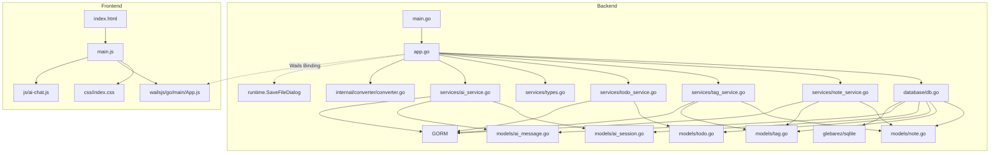

# Jot 项目分析报告

> 项目类型: 桌面端卡片式笔记应用（类小米笔记）
> 技术栈: Wails v2 + Go + GORM + SQLite + 原生 HTML/CSS/JS + CodeMirror 6（编辑器）+ einocli 薄适配层（eino 库驱动，OpenAI 兼容）

---

## 一、目录结构梳理

```
jot/                                    # 项目根目录
├── main.go                             # 【入口文件】Wails 应用启动入口，配置窗口/资源/绑定
├── app.go                              # 【核心文件】Wails 绑定层，暴露 95+ 个 Go API 给前端
├── go.mod                              # Go 模块定义，声明依赖版本
├── go.sum                              # Go 依赖锁文件
├── wails.json                          # Wails 项目配置（名称/构建脚本/作者）
├── AGENTS.md                           # 本报告文件
│
├── internal/                           # 【内部包】Go 子包统一目录
│   ├── converter/
│   │   └── converter.go               # markitdown 封装：办公文件转 Markdown（7 种格式 + 60s 超时）
│   ├── markitdown/                     # 从 Go module cache 克隆的 markitdown 库本地副本（含 PDFium Stdout/Stderr Discard 修复）
│   ├── database/
│   │   ├── db.go                       # SQLite 初始化（glebarez/sqlite 纯 Go 驱动）+ WAL 模式 + 优化 PRAGMA + DefaultDBPath() 路径函数 + blank import 注册 sqlite-vec 扩展
│   │   └── builtin_profiles.go         # 内置 API 预设服务商定义（DeepSeek/智谱 GLM/Ollama/Agnes 等 12 个），InitDB 时按 Name 去重增量插入
│   ├── fontutil/
│   │   └── fonts_windows.go           # EnumFontFamiliesW API 封装
│   ├── models/
│   │   ├── note.go                     # Note 实体（笔记）
│   │   ├── tag.go                      # Tag 实体（标签）
│   │   ├── setting.go                  # Setting 实体（KV 配置）
│   │   ├── ai_session.go              # AI 会话实体（标题/置顶/时间戳）
│   │   │   ├── ai_session_config.go      # AI 会话操作栏配置实体（模型/深度思考/搜索源/卡片召回（含指定笔记本）/笔记引用/技能，与 AISession 一对一关联）
│   │   ├── ai_message.go              # AI 消息实体（角色/内容/思维链，外键关联 SessionID）
│   │   ├── api_profile.go             # API 配置预设实体（名称/服务商/URL/Key）
│   │   │   ├── ai_prompt.go               # AI 提示词实体（技能提示词数据库存储）
│   │   │   ├── todo.go                    # Todo 实体（待办/文本/完成状态/时间戳）
│   │   │   └── note_vector.go             # NoteVector 实体（笔记切块向量索引：块文本/向量BLOB/维度/模型，按 note_id+chunk_index 索引）
│   └── services/
│       ├── note_service.go             # 笔记 CRUD + 搜索 + 置顶 + 回收站 + 统计 + 导入导出 + VACUUM 瘦身 + GetAllIDs
│       ├── tag_service.go              # 标签管理 + 笔记标签关联 + 标签计数
│       ├── setting_service.go          # 配置读写
│       ├── ai_service.go               # AI 业务层（einocli 客户端，OpenAI 兼容 + 流式输出 + 深度思考 + 会话持久化 CRUD + 会话配置持久化 + 消息管理 + Token 后端计算 + 会话 Token 持久化 + 技能提示词查询）
│       ├── todo_service.go             # 待办 CRUD（创建/列表/切换完成/删除/编辑）
│       ├── profile_service.go          # API 配置预设 CRUD + 切换/激活
│       ├── crypto.go                   # 敏感密钥 Base64 编码/解码工具（(zk) 前缀标识）
│       ├── search_service.go           # 通用网页搜索（Tavily API）
│       ├── zhihu_search_service.go     # 知乎搜索 + 全网搜索
│   │   │   ├── recall_service.go           # 召回结果类型与合并/截断工具（RecallCard/CardRecallResult/MergeRecallCards/Truncate*Preview；关键词召回已移除）
│       ├── query_refiner.go            # 搜索 Query 精炼
│       ├── notebook_service.go         # 笔记本 CRUD
│       ├── vector_service.go           # 笔记向量索引（IndexNotes 切块量化/GetIndexStatus/Count*/DeleteAllVectors）+ sqlite-vec 函数式向量召回 VectorRecall（SQL 内余弦距离 + 笔记本过滤 + 相邻块补充）
│       ├── chunk.go                    # 文档切块（600 rune 上限 + 元数据前缀注入（标题/标签/创建时间）+ 段落聚合 + 多级标题栈 1-6 级 + 标题块合并 + 空节丢弃 + 围栏代码块保护 + 块首父级链补全）
│   │   │   ├── types.go                    # 通用类型（PaginatedResult, DataStats, ImportResult, SettingsConfig, RecallNotebookIDs 等）
│
├── frontend/                           # 【前端目录】Wails 前端（Vanilla + Vite）
│   ├── index.html                      # 入口 HTML，9 个视图 + 关于浮层
│   ├── package.json                    # 前端依赖（Vite 3.x + CM6 ~16 包 + marked + highlight.js + @codemirror/lang-* 6 包 + @codemirror/legacy-modes）
│   ├── src/
│   │   ├── main.js                     # 【核心文件】前端逻辑（CM6 集成 + 搜索弹窗 + MD 语法页面 + AI 对话 + TOC + 回到顶部 + 批量管理 + 设置统一重构 + 骨架屏 + 锁屏密码 + 标签管理；数据管理页/回收站页/常量工具函数/通知类/模拟数据已拆分为独立模块）
│   │   ├── js/                         # 【JS 模块目录】
│   │   │   ├── cm6-syntax-highlight.js # CM6 通用语法高亮模块（13 套配色 + 46+ 语言解析器映射 + 围栏代码块嵌套解析 mdCodeLanguages + 行内代码标记插件 markdownInlineCodePlugin）
│   │   │   ├── editor-actions/        # 编辑器操作菜单分组模块目录
│   │   │   │   ├── format.js          # 格式化操作项（JSON/XML/HTML/CSS/JS/SQL/CSV/YAML/TOML 各含格式化+压缩 + SQL 辅助函数 compactSQL/convertSQLCase）
│   │   │   │   ├── text-transform.js  # 文本转换操作项（7 项）
│   │   │   │   ├── text-clean.js      # 文本清理操作项（5 项）
│   │   │   │   ├── encode-decode.js   # 编码解码操作项（6 项）
│   │   │   │   └── md-syntax.js       # MD 语法插入操作项（22 项，type: 'insert' 模式）
│   │   │   ├── editor-actions.js      # 编辑器操作菜单模块（聚合导入各分组模块 + 菜单渲染/交互/执行引擎，main.js import 引入）
│   │   │   ├── data-management.js      # 数据管理页面模块（10 个函数 + reloadSettings，从 main.js 提取）
│   │   │   ├── trash-page.js           # 回收站页面模块（6 个函数，从 main.js 提取）
│   │   │   ├── ai-chat.js              # AI 对话模块（自实现聊天引擎 + 流式输出 + Markdown 渲染 + 多会话管理 + 侧栏折叠 + 多来源搜索 + 卡片召回（含笔记本选择菜单）+ 引用笔记 + 上传文件 + 拖拽上传 + 更多技能 + 双语言翻译方向组件 + 语言选择浮层 + 技能激活时禁用更多技能按钮 + 用户消息编辑/删除/重新发送 + 会话统一菜单（置顶/重命名/导出/删除）+ 分块渲染 + Token 显示 + 提示词迁移 + 会话切换一次性渲染+同步滚动消除跳跃 + 会话配置持久化同步 + 替换消息操作统一后端原子方法 + 分页懒加载消息）
│   │   │   ├── constants.js            # 图标常量 SVGS + 工具函数（formatTime/highlightText/getSummary/debounce，从 main.js 提取）
│   │   │   ├── notification.js         # NotificationManager 通知类 + window.showNotification 全局函数 + 模拟数据（getMockNotes/getMockTags，从 main.js 提取）
│   │   │   ├── calendar.js             # 笔记日历模块（日历网格渲染 / 墨水圆点统计 / 本月摘要统计 / 按日笔记列表 / 回到今天 / 点击笔记跳转 / 切月自动重置今天）
│   │   │   └── preview-worker.js       # Web Worker 离线程 Markdown 渲染（从 src/ 移入）
│   │   └── css/                        # 【CSS 模块化目录】原 style.css + app.css 拆分
│   │       ├── index.css               # 入口文件，@import 引入所有子文件（设计系统 → 组件）
│   │       ├── variables.css           # 14 主题 CSS 变量：`--bg`/`--accent`/`--text-primary` 等
│   │       ├── reset.css               # 全局 reset（box-sizing/body 边距/overscroll-behavior）
│   │       ├── scrollbar.css           # 统一滚动条 6px 细条 + 自动隐藏 + 透明轨道 + 主题变量联动（含主内容区/搜索/AI 对话消息列表）
│   │       ├── animations.css          # 28 个 keyframes + 通用工具类 `.anim-*` + stagger 延迟
│   │       └── components/
│   │           ├── topbar.css          # 顶栏（品牌/搜索框/窗口控制按钮/更多菜单含图标）
│   │           ├── main-content.css    # 主内容区布局（卡片网格/视图容器/滚动）
│   │           ├── sidebar.css         # 笔记本侧边栏三段式设计 + 折叠按钮
│   │   │   │   ├── editor.css          # 编辑器面板/CM6 主题/全屏/预览/代码块复制按钮（含 AI 消息代码块）
│   │           ├── dropdowns.css       # 右键菜单/更多菜单/下拉选择器
│   │           ├── modals.css          # 通用模态框/确认弹窗/覆盖层/快捷键页面样式（shortcut-row flex 水平布局）
│   │           ├── settings-panel.css  # 设置页分段控件/滑块/开关/按钮
│   │           ├── search-modal.css    # 搜索弹窗/结果列表/高亮
│   │           ├── data-view.css       # 数据管理页分类导航（左侧导航 + 右侧面板切换动画）+ 信笺统计 + 操作卡片
│   │           ├── md-reference.css    # MD 语法手册卡片源码/预览双栏对照
│   │   │   │   ├── ai-chat.css         # AI 对话页面（气泡/输入区/Markdown 渲染/打字指示器/会话侧栏/折叠按钮/滚动条自动隐藏/消息居中响应式宽度 clamp(800px,92vw,1600px)/32px 间距/更多技能菜单选中态+离场动画+翻译chip双语言布局/联网搜索 toggle 开关+召回笔记本菜单）
│   │           ├── todo.css            # 待办清单页面（输入+筛选一体化工具栏/8 个 @keyframes 动画 + 两段式新增 + 编辑保存动画 + 悬浮预览 tooltip）
│   │           └── calendar.css        # 笔记日历视图样式（日历网格/墨水圆点/统计卡片/笔记列表/入场动画）
│   ├── wailsjs/                        # Wails 自动生成的 JS 绑定
│   │   └── go/main/
│   │       ├── App.js                  # 后端 API 的 JS 封装
│   │       ├── App.d.ts               # TypeScript 类型定义
│   │       └── models.ts              # Go 模型的 TS 类型
│   └── dist/                           # Vite 构建产物（前端编译输出）
│
└── .trae/specs/                        # 项目 Spec 文档目录
```

### 目录规范评价

| 维度 | 评价 |
|------|------|
| **分层清晰度** | 优秀。严格按 `models → services → database → app` 分层，前端后端隔离清晰 |
| **命名规范** | 良好。目录名使用复数形式（models/services），符合 Go 社区惯例 |
| **冗余目录** | 无。每个目录职责单一，无多余层级 |
| **待改进** | 无（frontend/dist 已在 .gitignore 中） |

---

## 二、核心功能模块识别

### 2.1 基础支撑模块

| 模块名称 | 核心功能 | 对应文件 | 核心依赖 |
|----------|----------|----------|----------|
| **数据库初始化模块** | SQLite 连接建立、连接池配置、AutoMigrate、blank import 注册 sqlite-vec 扩展 | `database/db.go` | glebarez/sqlite, GORM, modernc.org/sqlite/vec |
| **数据模型层** | Note/Tag/Setting/AISession/AIMessage/APIProfile/AIPrompt/AISessionConfig/Todo/NoteVector 实体定义、GORM tag 映射 | `models/note.go`, `models/tag.go`, `models/setting.go`, `models/ai_session.go`, `models/ai_message.go`, `models/api_profile.go`, `models/ai_prompt.go`, `models/ai_session_config.go`, `models/todo.go`, `models/note_vector.go` | GORM |
| **通用类型** | 分页返回格式、统计数据、导入导出结构 | `services/types.go` | 无外部依赖 |
| **Wails 绑定层** | Go API → JS Bridge，95+ 个绑定方法，含 runtime.SaveFileDialog | `app.go` | Wails v2 binding + runtime |
| **前端构建** | Vite 打包、Wails dev 热重载 | `frontend/package.json`, `wails.json` | Vite 3.x（保留，未移除）|
| **前端构建流程** | `wails build` 自动执行 `npm run build`（Vite）→ `frontend/dist/`，再嵌入 Go 二进制 | `go:embed all:frontend/dist` | 前端构建和后端编译都由 `wails build` 一条命令完成 |
| **字体枚举** | Windows GDI EnumFontFamiliesW 系统字体枚举 | `fontutil/fonts_windows.go` | gdi32.dll / user32.dll (syscall) |
| **配置存储** | KV 结构配置读写（字体偏好等） | `services/setting_service.go` | GORM |
| **路径工具** | `~/.jot` 根目录统一解析（data/backup/images/logs/mcp 五个子目录），数据库默认路径 `~/.jot/data/jot.db` | `internal/config/config.go:JotHomeDir()/SubDir()`，`database/db.go:DefaultDBPath()` | `os.UserHomeDir()` |
| **办公文件转换器** | 封装 markitdown 库，将 .docx/.pdf/.xlsx 等 7 种办公文件转为 Markdown 文本，带 60s 超时保护 | `internal/converter/converter.go` | github.com/conductor-oss/markitdown

### 2.2 业务核心模块

| 模块名称 | 核心功能 | 对应代码 | 核心输入 | 核心输出 |
|----------|----------|----------|----------|----------|
| **锁屏密码** | SHA-256 哈希验证 + 设置/修改密码 | `app.go:VerifyScreenLockPassword/SetScreenLockPassword` | 密码明文 | bool/错误 |
| **笔记 CRUD** | 创建/更新/查询/删除笔记 | `services/note_service.go` | 标题/内容/颜色/ID | Note 对象/错误 |
| **笔记搜索** | 标题+内容 LIKE 模糊搜索，支持 3 种排序（updated_at/created_at/title，均 pinned DESC 优先）| `note_service.go:Search()` | 关键词/分页/sortBy 参数 | 笔记列表+总数 |
| **笔记置顶** | 切换置顶状态 | `note_service.go:TogglePin()` | 笔记 ID | 更新后的笔记 |
| **回收站** | 软删除/查看/恢复/永久删除 | `note_service.go:Delete/GetTrash/Restore/PermanentDelete` | 笔记 ID | 操作结果 |
| **批量回收站操作** | 全部恢复/全部清空 | `note_service.go:RestoreAll/EmptyTrash` | — | 操作结果 |
| **标签管理** | 标签 CRUD | `services/tag_service.go` | 名称/颜色/ID | Tag 对象 |
| **笔记标签关联** | 为笔记添加/移除标签 | `tag_service.go:AddTagToNote/RemoveTagFromNote` | 笔记ID+标签ID | 操作结果 |
| **按标签筛选** | 通过标签 ID 查询笔记 | `note_service.go:GetByTag()` | 标签ID/分页参数 | 笔记列表+总数 |
| **数据统计** | 统计笔记总数/回收站数/标签数 | `note_service.go:GetStats()` + `tag_service.go:Count()` | — | DataStats 对象 |
| **数据导出为 .db** | 导出为 SQLite 数据库文件（VACUUM INTO + fs.CopyEx）| `app.go:ExportDataWithDialog()` | — | "导出成功" 提示 |
| **数据导入** | 从 JSON 文件导入笔记（跳过同名） | `note_service.go:ImportFromJSON()` | JSON 字节数组 | ImportResult 对象 |
| **前端卡片渲染** | 卡片网格展示 | `frontend/src/main.js` | 笔记数据数组 | DOM 渲染 |
| **前端编辑器** | 笔记编辑模态框（CM6 编辑器，支持行号/撤销重做/查找替换/Tab缩进/自动补全/自动闭合括号/Markdown 语法高亮） | `frontend/src/main.js` | 笔记数据/用户输入 | 保存/取消 |
| **前端查找替换** | CM6 search panel，Ctrl+F 查找 / Ctrl+H 查找替换，选中内容自动填充搜索框，预览模式自动切回编辑模式搜索 | `frontend/src/main.js:handleKeyboardNavigation()` | 搜索关键词 | 搜索面板匹配导航 |
| **前端搜索交互** | 搜索弹窗 200ms 防抖自动搜索，支持标题/内容/标签（多标签 AND 语义过滤）、笔记本/日期/排序筛选器（排序 3 选项：更新时间/创建时间/名称，均 pinned 优先） | `frontend/src/main.js` | 关键词 + 过滤条件 + sortBy | 搜索弹窗结果列表 |
| **笔记日历视图** | 日历导航（上/下月切换） + 创建时间墨水圆点统计（1/2-5/6+ 三档） + 按日笔记列表 + 点击笔记原地打开编辑器查看模式 | `frontend/src/js/calendar.js` + `frontend/src/css/components/calendar.css` + `services/note_service.go:GetByDate/GetMonthCounts` + `app.go:GetNotesByDate/GetMonthNoteCounts` | 年月参数/日期字符串 | 按月统计 map / 按日笔记列表 |
| **前端导航切换** | 网格/搜索/设置/数据管理/回收站/AI 助手视图切换 | `frontend/src/main.js:switchView()` | 视图名称 | 视图 DOM 切换 |
| **前端右键菜单** | 右键弹出菜单（查看/编辑/置顶/删除） | `frontend/src/main.js` | 鼠标事件+笔记ID | 菜单显示/操作 |
| **前端只读查看** | 左击笔记打开只读查看器 | `frontend/src/main.js:openEditor()` | 笔记 ID | 只读查看模态框 |
| **编辑器操作菜单** | 顶栏「操作」按钮下拉菜单，配置驱动操作注册表（EDITOR_ACTIONS 数组按分组拆分到 `frontend/src/js/editor-actions/` 模块，主文件聚合导入），当前含 5 个分组：格式化（JSON/XML/HTML/CSS/JS/SQL/CSV/YAML/TOML 各含格式化+压缩，SQL 另有关键字大小写共 18 项）、文本转换（大写/小写/首字母大写/驼峰式/蛇形式/行反转/字符反转 7 项）、文本清理（去除多余空格/去除空行/行尾空格清理/Tab↔空格 5 项）、编码解码（Base64/URL/HTML 各含编码+解码 6 项）、MD 语法（22 项，`type: 'insert'` 插入模式：有选中包裹选中文本、无选中在光标处插入样板）。支持选中文本或全文处理 + Ctrl+Z 撤销 + 查看模式隐藏 + 预览模式隐藏。无 subGroup 的项直接铺平在分组下，有 subGroup 的渲染为嵌套子菜单。 | `frontend/src/js/editor-actions.js` + `frontend/src/js/editor-actions/*.js` + `frontend/src/main.js`（import + els 注册 + window.cmEditor 暴露） | 选中文本或全文 | 格式化/转换/清理/编码解码/MD 样板结果 |
| **标签搜索** | 点击标签 chip 打开搜索弹窗并预选该标签筛选器 | `frontend/src/main.js:searchByTag()` | 标签 ID | 搜索弹窗结果列表 |
| **键盘快捷键** | Ctrl+F 编辑器搜索 / Ctrl+H 编辑器查找替换 / Ctrl+N 新建 / Ctrl+L 编辑器切换模式 / Ctrl+P 启动器菜单 / PgUp/PgDn 滚动 / Ctrl+Home/End / Ctrl+0 锁屏 | `frontend/src/main.js:handleKeyboardNavigation()` | 键盘事件 | 对应操作 |
| **版本号信息** | 返回 verman.V.GitVersion 纯版本号 | `app.go:GetVersion()` | — | 版本字符串 |
| **打开外链** | 调用 runtime.BrowserOpenURL 在默认浏览器打开链接 | `app.go:OpenProjectURL()` | URL 字符串 | — |
| **打开数据目录** | 在文件管理器中打开 `~/.jot/data/` | `app.go:OpenDataDir()` | — | explorer 文件管理器 |
| **一键备份** | 备份当前库到 `~/.jot/backup/jot-backup.db`（覆盖）| `app.go:BackupToDir()` | — | 备份成功提示 |
| **一键还原** | 从 `jot-backup.db` 还原并刷新笔记/标签/统计 | `app.go:RestoreFromDir()` | — | Toast 提示结果 |
| **外观设置** | 字体族下拉选择（搜索+键盘导航）+ 字体大小滑条（10-32px 实时预览）+ 主题选择（14 种）+ 主题预览迷你 UI 卡片 | `frontend/src/main.js:loadFontSettings/applyFontFamily/applyFontSize` + `loadThemeSetting` | 字体名称/大小/主题名称 | 更新 CSS 变量 |
| **AI 对话** | einocli 薄适配层（eino 库）驱动 OpenAI 兼容流式对话（自实现聊天引擎 + Markdown/代码高亮渲染 + 多会话管理 + 会话置顶 + 更多按钮下拉菜单 + 多来源联网搜索（Tavily/知乎/全网搜索）+ 卡片召回 + 引用笔记 + 更多技能 + 用户消息编辑/删除/重新发送 + 操作按钮折叠 + Token 显示 + 提示词迁移到数据库 + 联网搜索与卡片召回通用 Query 精炼 + 搜索指示器三态展示 + 搜索来源与召回卡片结构化数据持久化 + 会话自动恢复 + 后端统一上下文注入 + 分页懒加载消息 + 基于 msgID 的截断操作 + 再生原子化 + 搜索来源与召回卡片前端预览截断 200 字） | `services/ai_service.go`+ `einocli/` + `frontend/src/js/ai-chat.js`+ `frontend/src/css/components/ai-chat.css` | 用户消息 | AI 流式回复 |
| **向量召回** | 笔记切块向量化（`chunk.go` 标题链拼接 + `IndexNotes` 先删后插幂等量化）后由 sqlite-vec 函数式检索——`vec_distance_cosine` SQL 内余弦距离 + `vec_f32` 解析 query 向量 JSON，`dist < 1.0` 过滤 + 距离升序 TopN；支持指定笔记本（JOIN notes 过滤）或全部笔记；命中块补充前后各 1 相邻块并按笔记合并卡片（召回块完整注入，已去掉单卡截断，由 ai_card_recall_limit 控制总量）；embedClient/模型未配置或当前模型无向量数据时静默跳过 | `services/vector_service.go:VectorRecall` + `services/chunk.go` + `models/note_vector.go` | 用户问题 query + 可选笔记本 ID 列表 | CardRecallResult（FormattedText 注入 system message + Cards 前端展示） |
| **AI 配置管理** | Base URL/API Key/Model 的读写 + 连通性测试 + 模型列表获取 | `app.go:GetAIConfig/SaveAIConfig/TestBaseURL/FetchAIModels` | 配置项 | 配置/测试结果 |
| **统一通知系统** | NotificationManager 单例类，右上角浮动通知，4 种类型 + undo 撤销 | `frontend/src/js/notification.js` | 消息/类型/回调 | 通知 DOM 创建与自动销毁 |

### 2.3 模块分层图

```
┌─────────────────────────────────────────────────────┐
│                    Frontend                          │
│  (main.js / css/index.css / index.html)               │
│   ├─ 视图渲染 (卡片/搜索/设置/数据管理/回收站/AI/MD 语法/日历/待办)     │
│   ├─ 交互逻辑 (事件绑定/状态管理)                      │
│   └─ Wails Bridge (window.go.main.App.*)              │
└────────────────────────┬────────────────────────────┘
                         │ Wails Binding (JSON 序列化)
┌────────────────────────▼────────────────────────────┐
│              App 层 (app.go)                         │
│  95+ 个绑定方法（CRUD/搜索/置顶/回收站/统计/导入导出/路径/│
│    AI 配置/会话管理/消息管理/笔记本回收站/配置文件预设)    │
│  (含 runtime.SaveFileDialog 原生对话框调用)            │
└────────────────────────┬────────────────────────────┘
                         │
              ┌──────────┼──────────┐
              ▼          ▼          ▼
    ┌─────────────┐ ┌──────────┐ ┌────────────┐ ┌──────────────┐
    │ NoteService │ │TagService│ │TodoService │ │  AI Service  │
    │ (CRUD/搜索/ │ │(CRUD/关联)│ │ (CRUD/切换 │ │ (AI 流式对话 │
    │  置顶/回收站 │ │          │ │  完成/删除 │ │  会话管理    │
    │  统计/导入   │ │          │ │  编辑)     │ │  消息持久化) │
    │  导出)      │ │          │ │            │ │              │
    └──────┬──────┘ └─────┬────┘ └──────┬─────┘ └──────┬───────┘
           │              │             │              │
           └──────┬───────┴──────┬──────┴──────┬───────┘
                  │              │              │
                  ▼              ▼              ▼
        ┌─────────────────┐ ┌──────────┐ ┌─────────────────┐
        │    GORM ORM     │ │GORM ORM │ │   GORM ORM     │
        │ (数据访问层)      │ │(待办层)  │ │ (AI 模型层)     │
        └────────┬────────┘ └────┬─────┘ └────────┬────────┘
                 │               │                 │
                 └───────────────┴─────────────────┘
                                    ▼
                          ┌─────────────────┐
                          │     SQLite      │
                          │ (glebarez/sqlite│
                          │  纯 Go 驱动)     │
                          └─────────────────┘
```

---

## 三、模块间依赖关系分析

### 3.1 依赖关系详表

| 依赖方 | 被依赖方 | 依赖类型 | 依赖详情 |
|--------|----------|----------|----------|
| `app.go` | `database` | 编译依赖 | 调用 `database.InitDB()` 获取 `*gorm.DB` 实例 |
| `app.go` | `services` | 编译依赖 | 创建 `NoteService` / `TagService` / `TodoService` / `SettingService` 实例 |
| `app.go` | `models` | 编译依赖 | 返回 `*models.Note` / `*models.Tag` / `*models.Todo` / `*models.Setting` 类型 |
| `app.go` | `runtime` | 编译依赖 | `runtime.SaveFileDialog` 原生保存对话框 |
| `app.go` | `fontutil` | 编译依赖 | `fontutil.GetFonts()` 枚举系统字体 |
| `services` | `models` | 编译依赖 | 操作 Note/Tag/Todo/Setting/AISession/AIMessage 结构体 |
| `services` | GORM | 编译依赖 | `*gorm.DB` 数据库操作 |
| `database` | `models` | 编译依赖 | `AutoMigrate(&models.Note{}, &models.Tag{}, &models.Todo{}, &models.Setting{}, &models.AISession{}, &models.AIMessage{})` |
| `database` | glebarez/sqlite | 编译依赖 | 纯 Go SQLite 驱动 |
| `fontutil` | gdi32/user32 | 运行时依赖 | syscall 调用 Windows GDI API |
| `frontend/main.js` | `wailsjs/go/main/App.js` | 运行时调用 | `window.go.main.App.*` 调用后端 API |
| `frontend/wailsjs` | `app.go` | 构建时生成 | `wails generate module` 自动生成 |

### 3.2 依赖关系图（Mermaid）


```mermaid
graph TD
    subgraph Backend
        A[main.go] --> B[app.go]
        B --> C[database/db.go]
        B --> D[services/note_service.go]
        B --> E[services/tag_service.go]
        B --> TD[services/todo_service.go]
        B --> F[services/types.go]
        B --> AI[services/ai_service.go]
        B --> CV[internal/converter/converter.go]
        C --> G[models/note.go]
        C --> H[models/tag.go]
        C --> TD2[models/todo.go]
        C --> I[models/ai_session.go]
        C --> J[models/ai_message.go]
        D --> G
        D --> H
        E --> G
        E --> H
        TD --> TD2
        AI --> I
        AI --> J
        C --> K[glebarez/sqlite]
        D --> L[GORM]
        E --> L
        TD --> L
        AI --> L
        B -.-> M[runtime.SaveFileDialog]
    end

    subgraph Frontend
        N[index.html] --> O[main.js]
        O --> P[css/index.css]
        O --> Q[wailsjs/go/main/App.js]
        O --> R[js/ai-chat.js]
    end

    B -.->|Wails Binding| Q
```

### 3.3 依赖问题分析

| 问题类型 | 描述 | 严重程度 |
|----------|------|----------|
| **循环依赖** | 无。所有依赖为单向 `main → app → services → models`，无循环 | ✅ 无问题 |
| **过度依赖** | 无。每个 Service 仅依赖 `*gorm.DB` 和自身模型 | ✅ 无问题 |
| **依赖缺失** | 无。`go.sum` 中所有传递依赖完整 | ✅ 无问题 |
| **隐式依赖** | 前端 `window.go` 对象依赖 Wails 运行时注入，本地开发/独立预览时不可用 | ⚠️ 有降级处理（Mock 数据） |
| **编译期依赖 vs 运行时依赖** | `wailsjs/` 目录需在修改 `app.go` 后重新生成 | ⚠️ 需手动执行 `wails generate module` |

---

## 四、设计模式与实现逻辑

### 4.1 设计模式识别

| 模式名称 | 应用位置 | 说明 | 代码示例 |
|----------|----------|------|----------|
| **Service Layer 模式** | `services/` 包 | 将业务逻辑从 controller（app.go）中抽离，封装为独立 Service 结构体 | `NoteService` / `TagService` |
| **依赖注入 (DI)** | `app.go` | Service 依赖的 `*gorm.DB` 通过构造函数注入 | `NewNoteService(db)` / `NewTagService(db)` |
| **Repository 模式** | `services/` 包内嵌 GORM | Service 内部直接使用 GORM 作为数据访问层 | `s.db.Create()` / `s.db.Where()` |
| **单例模式 (应用级)** | App 结构体 | Wails 运行时保证 App 实例唯一 | `NewApp()` 在 `main()` 中仅调用一次 |
| **MVC 变体** | 整体架构 | Model(models) - View(frontend) - Controller(app.go + services) 分层 | 见分层图 |
| **降级策略 (Fallback)** | `frontend/main.js` | 后端未绑定时自动使用 Mock 数据 | `if (!window.go.main.App.GetNotes) { state.notes = getMockNotes(); }` |
| **Wails Runtime 集成** | `app.go` | 通过 runtime 包调用原生桌面功能 | `runtime.SaveFileDialog()` 弹出系统保存对话框 |

### 4.2 核心业务逻辑流程

#### 4.2.1 笔记创建流程

```
用户点击 "+" 按钮 / Ctrl+N
  → openEditor(null)          // 打开空编辑器模态框
    → 用户填写标题/内容/选择颜色/选择标签
    → 点击"保存"按钮
      → createNote()
        → 前端校验（标题不为空）
        → window.go.main.App.CreateNote(title, content, color)
          → app.go:CreateNote()
            → noteService.Create()          // GORM db.Create(&note)
            → 返回 *models.Note（含 id）
          → 遍历 selectedTags
            → window.go.main.App.AddTagToNote(note.id, tagId)
              → tagService.AddTagToNote()   // GORM Association("Tags").Append
        → closeEditor()                     // 关闭模态框
        → loadNotes()                       // 重新加载笔记列表
          → GetNotes(1, 100)                // 分页查询
          → renderCardGrid()                // 渲染右侧卡片网格
```

#### 4.2.2 笔记搜索流程

```
Ctrl+F / Ctrl+K → 打开搜索弹窗
  → els.searchModalInput 自动聚焦
  → 用户输入文字 → 200ms 防抖
    → searchModalLoadPage(1, false)
```

...（中间流程不变）

---

## 五、技术栈评估

### 5.1 技术栈清单

| 层级 | 技术 | 版本 | 用途 |
|------|------|------|------|
| **桌面框架** | Wails v2 | v2.9.2 | 桌面窗口 + Go ↔ JS Bridge |
| **后端语言** | Go | go1.22+ | 后端业务逻辑 |
| **数据库** | SQLite | — | 本地数据存储 |
| **数据库驱动** | glebarez/sqlite | v1.11 | 纯 Go SQLite 驱动（无 CGO） |
| **向量检索** | sqlite-vec（modernc.org/sqlite/vec） | v0.1.9 | SQL 内余弦距离 vec_distance_cosine / vec_f32，函数式用法（非 vec0 虚拟表），blank import 自动注册 |
| **ORM** | GORM | v1.25 | 对象关系映射 |
| **前端构建** | Vite | v3.2.11 | 前端打包工具 |
| **前端技术** | 原生 HTML/CSS/JS | — | UI 渲染 |
| **编辑器** | CodeMirror 6 | @codemirror/view v6.26 | 笔记编辑器 |
| **Markdown 解析** | marked | v12.0 | Markdown → HTML 渲染 |
| **代码高亮** | highlight.js | v11.10 | 代码块语法高亮 |
| **Mermaid 图表** | mermaid | v11.4 | Markdown 代码块图表渲染（mermaid/render 子路径） |
| **AI 对话** | einocli 薄适配层（eino 库） | github.com/cloudwego/eino v0.9.13 + eino-ext（components/model/openai v0.1.13 + libs/acl/openai v0.1.17，底层 github.com/meguminnnnnnnnn/go-openai v0.1.2） | 流式对话/深度思考/多会话/联网搜索/卡片召回 |
| **本地存储** | localStorage | — | UI 状态持久化（主题/侧栏状态等） |

### 5.2 技术栈选型评价

| 评价维度 | 说明 |
|----------|------|
| **合理性** | Wails v2 适合桌面端 Go 应用，原生 HTML/CSS/JS 避免前端框架学习成本 |
| **性能** | SQLite + GORM 组合满足本地笔记应用性能需求，流式输出不阻塞 UI |
| **维护性** | 前后端分层清晰，CSS 模块化拆分降低维护成本 |
| **可扩展性** | 新增功能只需添加 binding 方法和前端模块，架构本身无限制 |
| **风险** | Wails v2 社区较小，Wails v3 路线图不明确，长期维护可能受限 |

### 5.3 版本兼容性问题

| 问题 | 说明 |
|------|------|
| **Wails 版本锁定** | `go.mod` 中 `wails.io v2.9.2` 已固定，`wails/v2` 包需与 Wails CLI 版本匹配。升级需同步更新 CLI, go.mod, wails.json 三方 |
| **GORM AutoMigrate** | 新增模型（如 AISession/AIMessage）后需在 `database/db.go` 的 `AutoMigrate` 中注册，否则表不会自动创建 |

---

## 六、补充分析

### 6.1 扩展性评估

| 扩展方向 | 可行性 | 建议 |
|----------|--------|------|
| **多用户/云端同步** | 低 | 如需云端同步，建议引入 WebDAV/第三方同步库 |
| **AI 功能扩展** | 高 | 当前 AI 会话架构（Session + Message 模型）天然支持多会话切换和上下文管理，易于扩展。新增方法直接注册 binding 到 app.go 即可 |
| **国际化 (i18n)** | 中 | 所有 UI 文本硬编码在 HTML/JS 中，需统一抽离 |
| **插件系统** | 低 | 原生 HTML 架构不适合动态加载插件 |

### 6.2 性能关键点

| 关键点 | 现状 | 评估 |
|--------|------|------|
| **数据库查询** | GORM + SQLite，分页查询 | ✅ 满足笔记本规模 |
| **前端渲染** | 卡片网格渲染 | ✅ 性能良好 |
| **AI 流式输出** | 基于 Wails Events 逐块推送，不阻塞 UI | ✅ 体验优秀 |
| **CM6 编辑器** | 仅初始化当前编辑的笔记 | ✅ 性能良好 |
| **多会话切换** | 切换时从后端加载对应会话的消息，采用一次性同步渲染（无 yield）+ 同步滚动（`scroll-behavior: auto` 临时禁用），浏览器只绘制一次最终状态，彻底消除视觉跳跃。后端 `LoadAISessionMessagesPaginated` 在返回前端前已截断 `RecallCards`/`SearchSources` 的 Content 为 200 字，减小 Wails 桥传输量和 DOM 渲染开销 | ✅ 切换瞬间完成，无任何中间状态闪烁 |
| **操作按钮折叠测量** | `collapseActionsIfNeeded()` 支持 `sync` 同步模式，在 `switchSession()` 中使用同步测量避免布局抖动 | ✅ 消除消息"跳跃"问题 |

### 6.3 异常处理分析

| 异常场景 | 处理方式 |
|----------|----------|
| **后端 API 不可用** | 前端 Mock 数据降级 |
| **AI API 调用失败** | HTTP 状态码封装为 11 种分类中文提示（auth_error/rate_limit/server_error 等），通过 `ai:stream-error` 事件以 JSON 格式（`{category, user_msg, raw}`）传递到前端，解析后通过 `showNotification()` 右上角通知展示，不再插入对话流中 |
| **联网搜索失败** | 每个搜索来源独立发射错误事件 `ai:search-error`，不影响其他来源继续搜索；前端通过 `showNotification()` 提示用户 |
| **数据库损坏** | 备份还原机制 |
| **办公文件转换失败** | 60s 超时保护 + `Warnw` 日志记录大文件/损坏文件，`Errorw` 记录转换异常；前端通过 `showImportResults()` 逐个显示文件错误详情 |
| **流式连接中断** | 前端监听 `ai:stream-error` 事件，显示错误提示 |
| **会话/消息查询失败** | 返回空列表 + 控制台错误日志，不阻断 UI |

### 6.4 安全分析

| 风险点 | 评估 |
|--------|------|
| **本地数据库** | SQLite 文件本地存储，无远程访问风险 |
| **API Key 存储** | Base64 编码存储在 DB 中，带 `(zk)` 前缀标识，前端读写均为解码后明文。仅防肉眼查看，非真实加密 |
| **XSS 风险** | AI 回复经 `marked.parse()` 渲染，`marked` 默认 Sanitize |

### 6.5 数据库优化

| 优化项 | 配置 | 说明 |
|--------|------|------|
| **WAL 模式** | `PRAGMA journal_mode=WAL` | 允许并发读取，写入不阻塞读取，显著提升多线程场景性能 |
| **busy_timeout** | `PRAGMA busy_timeout=5000` | 忙等待超时 5 秒，避免 "database is locked" 错误 |
| **synchronous** | `PRAGMA synchronous=NORMAL` | WAL 模式下 NORMAL 级别安全且性能比 FULL 快得多 |
| **cache_size** | `PRAGMA cache_size=-8000` | 8MB 页面缓存（负值表示 KB 单位） |
- 初始化位置：`internal/database/db.go` 的 `InitDB()` 函数中，`SetMaxOpenConns(1)` 之后
- PRAGMA 执行失败不影响初始化流程（忽略错误），由调用方统一处理错误日志
- 导入/还原场景需清理 WAL 残留文件（`-wal`/`-shm`），防止旧文件干扰新数据库，清理逻辑在 `app.go` 的 `replaceDatabase()` 函数中

---

## 七、项目核心特点

### 核心设计理念

1. **Wails v2 跨平台桌面应用**：Go + 原生前端（HTML/CSS/JS）架构，兼顾后端性能和前端灵活性

2. **CodeMirror 6 编辑器集成**：主流 Markdown 编辑器引擎，支持行号/撤销重做/查找替换/Tab缩进/自动补全/语法高亮（13 套配色 + 46+ 语言）

3. **CSS 变量主题系统（14 主题）**：全局 CSS 变量联动（`--bg`/`--accent`/`--border` 等），一键切换 14 套系统主题 + 13 套代码高亮主题，所有组件自动适配。2026-07 完成配色全面重构——每套主题重新设计 `--bg`/`--card-bg`/`--bg-secondary` 等核心颜色值，E 护眼/深色/浅色等主题彻底重做，共修改 ~140 个变量

4. **三步交互范式**：笔记本（容器）→ 笔记卡片（列表）→ 编辑器（操作），符合直觉的文件夹-文件-编辑结构

5. **AI 对话引擎（einocli 薄适配层 + eino 库）**：基于 eino（components/model/openai）实现 OpenAI 兼容统一接口，通过 einocli 薄适配层对外暴露，支持 DeepSeek、通义千问等兼容端点（已移除 Ollama 原生协议）。流式输出 + Markdown 渲染 + 代码高亮 + 思维链折叠 + 多会话管理 + 侧栏折叠 + 多来源联网搜索（Tavily/知乎/全网搜索，含全选/全取消开关）+ 卡片召回（含笔记本选择菜单）+ 引用笔记 + 更多技能 + 用户消息编辑/删除/重新发送 + Token 统计 + **后端统一上下文注入**。API 连接通过设置页预设管理配置与持久化。

6. **统一的通知系统**：NotificationManager 单例，右上角浮动通知，支持 success/error/warning/info 四种类型 + undo 撤销

7. **过度动画与交互反馈**：28 个 keyframes、stagger 延迟、hover 分层反馈、spring 弹性缓动、骨架屏 shimmer、分段滑块弹簧曲线（`cubic-bezier(0.34, 1.2, 0.64, 1)`）、字体滑条实时预览

8. **无 UI 框架依赖**：无 Vue/React/Svelte，纯手写 DOM 操作，极致轻量

9. **Mermaid 图表渲染集成**：为 Markdown 代码块中的 `language-mermaid` 块提供按需渲染，默认显示源码，点击渲染按钮后直接主线程渲染 SVG。切换按钮与复制按钮风格统一，CSS `:has()` 处理双按钮防碰撞。

### 设计系统

- **尺寸**：`--radius-md`(8px) / `--radius-sm`(6px)，全局统一
- **间距**：4px 基线网格，组件内部 8-16px，布局 16-24px
- **阴影**：4 层 Token — `elevated`(卡片) / `dropdown`(下拉菜单) / `modal`(模态框) / `toast`(通知)
- **语义色**：`--success`(绿) / `--warning`(黄) / `--error`(红) / `--info`(蓝)
- **字体**：全局统一 `var(--font-family)`，编辑器和代码块跟随系统设置
- **滚动条**：6px 细条，`--scrollbar-thumb` / `--scrollbar-thumb-hover` 联动 14 主题
- **圆角一致性**：所有交互元素（按钮/卡片/输入框/下拉菜单/模态框）均使用 `var(--radius-sm)` 或 `var(--radius-md)`，无硬编码

---

## 八、待优化点

### 架构层面

- **代码分割**：main.js 可继续拆分为独立视图模块
- **CSS 变量颜色 Token**：AI 对话页面的配色确认已全部纳入主题系统

### 已实现

- [x] **CSS 模块化拆分**（variables, reset, scrollbar, animations + 6 组件模块）
- [x] **AI 对话自实现**（流式输出 + Markdown 渲染 + 思维链 + 代码高亮 + 多会话 + 侧栏折叠）
- [x] **笔记软删除与回收站**（Trash/Restore/PermanentDelete/RestoreAll/EmptyTrash）
- [x] **Markdown 语法手册页面**（10 张语法卡片 + 双栏源码/预览 + 打开编辑器试试）
- [x] **14 系统主题 + 13 代码高亮主题**（统一 CSS 变量体系，2026-07 完成配色全面重构）
- [x] **代码高亮主题推荐配对优化**（3 个系统主题的推荐映射重新匹配新配色：nord→github-dark、light→vscode-light-plus、quiet-light→material-palenight）
- [x] **搜索弹窗**（200ms 防抖 + 笔记本/日期/排序/标签筛选器）
- [x] **一键备份/还原**（BackupToDir/RestoreFromDir + VACUUM）
- [x] **返回查看/保存脏检测**（无变更不触发保存 + 不弹出通知）
- [x] **数据库瘦身 VACUUM**（数据管理页面按钮触发）
- [x] **字体设置**（族+大小，联动 CSS 变量）
- [x] **通知系统**（右上角 NotificationManager，4 种类型 + undo 撤销）
- [x] **更多菜单**（8 个选项，`min-width: 120px`）
- [x] **数字键导航**（Ctrl+数字键 1-9）
- [x] **快捷键说明页**（Ctrl+7 打开，可滚动列表）
- [x] **拖拽导入闪烁动画**（3 次红色慢闪）
- [x] **多来源联网搜索**（Tavily/知乎/全网搜索三来源独立开关 + 独立 Key 配置）
- [x] **搜索开关联动**（Key 为空自动禁用、点击启用时校验配置）
- [x] **切换会话分块渲染 + 延迟高亮**（CHUNK_SIZE=5 yield + requestIdleCallback hljs）
- [x] **消息操作栏简化**（移除独立按钮，仅常驻显示 Token，操作通过右键菜单）
- [x] **设置页 Token 默认隐藏 + 知乎 URL 修正**
- [x] **存储优化增强**（回收站自动清理 + 孤儿笔记迁移 + 空 AI 会话清理 + VACUUM 整合流程）
- [x] **批量管理重构**（FAB 入口 + CSS transition 动效 + 复选框移除 + 置顶按钮可操作）
- [x] **更多菜单子菜单拍平**（"帮助参考"子菜单取消，快捷键说明/MD 语法/关于 直接平铺到"帮助"分组下）
- [x] **待办清单功能**（Todo CRUD + 输入筛选一体化工具栏 + 6 个 keyframes 动画 + 筛选按钮数量显示）
- [x] **骨架屏编辑器**（点击笔记立即显示骨架屏 shimmer，异步加载内容后替换）
- [x] **笔记日历视图**（日历网格 + 创建时间墨水圆点 + 按日笔记列表 + 点击笔记网格视图打开编辑器）
- [x] **搜索来源 UI 优化**（内联卡片+折叠面板+SVG 图标+代码去重）
- [x] **召回卡片 UI 优化**（折叠面板+file_ext 徽章+CSS line-clamp+代码去重）
- [x] **编辑器骨架屏回归修复**（非缓存笔记打开校正+scrollbar-gutter 稳定）
- [x] **品牌标识动画优化**（transform 独立驱动，3 次迭代达成平滑过渡）
- [x] **用户消息 Token 提前展示**（SaveAIMessage 返回 token 数，立即显示）
- [x] **停止按钮全阶段防护**（搜索/LLM 阶段取消不报错不残留）
- [x] **Logger 初始化顺序修复**（NewApp 阶段初始化 Logger，startup 清理冗余代码）
- [x] **锁屏密码功能**（SHA-256 哈希存储 + 毛玻璃锁屏遮罩 + 设置页开关/密码配置 + 启动验证）
- [x] **设置项布局统一**（所有卡片 label 左/描述中/控件右三列对齐）
- [x] **服务商切换改为分段控件**（下拉菜单 → segmented-control + 弹簧曲线动画）
- [x] **字体大小滑条**（按钮组 → range slider 10-32px + 实时预览区）
- [x] **分段滑块指示器精度修复**（`(cw-8)/n` 公式消除溢出）
- [x] **设置页面侧边栏导航重构**（左侧 176px 侧边栏 + 9 个带 SVG 图标导航项 + 右侧面板切换替代纵向卡片列表布局 + 150ms 淡出左移 + 200ms spring 弹性滑入动画 + 服务商分段控件指示器重定位 + 布局体系统一 `.ai-setting-item`）
- [x] **标签管理卡片重设计（第二次迭代）**（输入框两行布局 + 预设8色色块选择器 + 自定义颜色入口`<input type="color">`叠加在按钮内部 + 标签列表CSS Grid卡片布局 + 增量DOM操作替代全量`loadTags()`重渲染 + spring弹性入场动画 + 收缩淡出删除动画 + 300ms超时fallback适配prefers-reduced-motion）
- [x] **AI 消息懒加载 + 后端上下文自取**（CallAIStream 从 DB 加载历史、LoadAISessionMessagesPaginated 分页、TruncateAISessionAtMessage/AfterMessage 截断、CallAIStreamRegenerate 后端读取末条用户消息再生、SumSessionTokens 后端统计 Token）
- [x] **锁屏密码 UI 精简**（移除独立状态标签，按钮文本自述状态，模态框根据状态动态显示旧密码输入框）
- [x] **Mermaid 图表支持**（代码块按需渲染 + 源码/视图切换 + 主题联动 isDarkTheme + 双按钮 SVG 图标 + 复制/渲染按钮防碰撞动画）
- [x] **更多菜单精工卡重设计**（毛玻璃 `blur(24px)` + 双层阴影悬浮感 + 三段式 overshoot 入场动画 + KBD 风格快捷键标签 + 分组左侧 accent 色装饰条 + 条目 hover 上浮微交互 + 子菜单拍平到帮助分组）
- [x] **移除更多菜单 Ctrl+1~8 快捷键**（删除 title 属性 + 全局 keydown handler + 快捷键说明页 + 动态 title 设置）
- [x] **待办清单移入 AI 分组**（从管理分组移动到 AI 分组，与 AI 助手同组）
- [x] **统一表格复制按钮样式**（SVG 图标 + 毛玻璃 backdrop-filter + min-width + 主题色 hover 边框 + 锚定 th 而非表格右边缘）
- [x] **优化 Mermaid 复制动画延迟**（200ms → 80ms，transition 0.15s → 0.08s）
- [x] **系统主题下拉菜单键盘导航**（ArrowUp/Down + 250ms 节流 + scrollIntoView + 打开聚焦 + 保持打开 + 外部点击区域判断）
- [x] **代码高亮主题下拉菜单键盘导航**（同上）
- [x] **翻译技能扁平化**（从子菜单改为普通菜单项，chip 显示源语言→目标语言方向组件 + 点击语言标签弹出浮层选择 6 种常用语言）
- [x] **技能菜单选中指示 + 点击切换**（已激活技能显示✓+accent 色高亮，打开菜单自动刷新；点击已激活技能取消引用，toggle 互斥模式）
- [x] **更多技能菜单离场动画**（反向交错消失 + 容器缩小淡出 0.18s，`setTimeout` 360ms 清理 class）
- [x] **AI 优化按钮取消 + 发送按钮禁用**（优化中可取消，显示停止按钮，恢复原文；发送按钮优化期间禁用）
- [x] **右键菜单复制通知**（AI/用户消息右键复制成功后通过 `showNotification('已复制')` 反馈）
- [x] **启动器网格**（Ctrl+P 触发全屏浮层，4 列网格 13 项功能 + 搜索过滤 + 方向键导航 + Enter 执行 + ESC 关闭 + 入场/离场动画 + stagger 卡片动画）
- [x] **快捷键说明页新增 Ctrl+P**（在 Ctrl+L/E 之间插入启动器快捷键条目）
- [x] **办公文件导入支持**（markitdown 库集成，支持 .docx/.pdf/.xlsx/.xls/.pptx/.epub/.zip 共 7 种办公文件格式，60s 超时保护 + goroutine 并发处理 + Wails Events 进度事件 + 前端批量进度通知 + 500ms 最小展示保底）
- [x] **卡片召回优化**（gse 分词替换 2-gram，复合词识别更好；SearchFull 改为 Go 侧相关度打分排序，标题命中 3 分/关键词、内容命中 1 分/关键词、覆盖率奖励）
- [x] **内置 API 预设服务商**（builtin_profiles.go 预配 DeepSeek/智谱 GLM/Ollama/Agnes 等 12 个常用服务商，启动时按 Name 去重增量插入，Key 留空用户自行配置）
- [x] **预设管理增删动画**（两阶段插入动画：先 max-height 展开空间再滑入内容；删除动画 CSS 覆盖 Bug 修复：preset-row-insert 类定义在后导致 preset-delete-out 动画被覆盖，animationend 永远不触发）
- [x] **预设弹窗遮罩点击穿透修复**（pointer-events: none 防止淡出期间拦截删除按钮点击；确认弹窗 z-index 从 1000 提升至 100000 避免被遮罩挡住）
- [x] **预设名称唯一性校验**（savePresetModal 提交前检查名称是否已存在，编辑时排除自身）
- [x] **编辑器操作菜单**（顶栏「操作」按钮 + 配置驱动下拉菜单，4 分组：格式化（JSON/XML/HTML/CSS/JS/SQL/CSV/YAML/TOML 格式化+压缩）、文本转换（7 项）、文本清理（5 项）、编码解码（6 项），选中或全文 + 撤销）
- [x] **MD 语法插入操作**（MD 语法分组 22 项，type: 'insert' 模式：行内样式/标题/列表/块元素/链接媒体/表格/数学公式，有选中包裹选中文本、无选中在光标处插入样板）
- [x] **编辑器操作菜单模块化拆分**（操作项按分组拆分至 `frontend/src/js/editor-actions/` 目录：format.js/text-transform.js/text-clean.js/encode-decode.js/md-syntax.js，主文件仅保留聚合导入 + 渲染/交互/执行引擎）
- [x] **卡片召回重构为 sqlite-vec 向量召回**（关键词召回 gse 彻底移除；`vec_distance_cosine` SQL 内余弦距离检索 + 笔记本 JOIN 过滤 + 相邻块补充 + 按笔记合并卡片；`modernc.org/sqlite` 升级 v1.51.0 含 vec 子包；[chunk.go](internal/services/chunk.go) 标题链拼接）
- [x] **切块标题块合并重构**（[chunk.go](internal/services/chunk.go) 对齐 LangChain/LlamaIndex 语义：`headingLevel` 支持 1-6 级标题、`pushHeadingStack` 多级标题栈、标题+空行不落块与正文强制合并（杜绝孤立标题/目录索引块抢占召回名额）、空节丢弃、```/~~~ 围栏代码块内空行与伪标题不切块、`prependChain` 块首补父级标题链）
- [x] **召回状态独立指示器**（[ai-chat.js](frontend/src/js/ai-chat.js) 召回脱离联网搜索状态机，独立 `ai:recall-status` 事件 + 放大镜扫动动画 + 最小展示时长 800ms + thinking 打断协调；[vector_service.go](internal/services/vector_service.go) `VectorRecall` 返回 error 分类预期跳过与意外错误，前端弹通知；召回笔记本空集跳过而非全库召回）
- [x] **会话 Token 缓存一致性修复**（[ai_service.go](internal/services/ai_service.go) Truncate 系列删除消息后事务内重算 `context_tokens`；[app.go](app.go) 召回/搜索阶段与 LLM 流中取消分支补缓存重算；[ai-chat.js](frontend/src/js/ai-chat.js) `handleResend` 截断后刷新）
- [x] **数据模型集中注册**（[internal/database/models.go](internal/database/models.go) 全局 `AllModels` 唯一注册点，InitDB 与 ResetDatabase 自动同步，重置出厂不再遗漏新表）
- [x] **设置页量化连接补全**（量化模块 `getSavedModel` 模型高亮 + 新增/管理预设按钮 + openai 路径 `TrimRight` 三层收敛 + 测试/获取模型成功后持久化 URL/Key）

---

## 九、关键记忆点

1. **Wails v2 事件驱动流式输出**：AI 回复流式数据传输使用 `runtime.EventsEmit`（Go 端）+ `EventsOn`（前端），Go 端 `bufio.Reader` 逐行解析 SSE `data: {...}` 流，通过回调（`onChunk`/`onThinking`/`onDone`/`onError`）逐块推送。前端在 `onSend()` 中动态注册一次性事件回调（`Array.from` 包裹闭包捕获局部变量），每个请求各自独立的 `streamingContent`/`streamingEl`/`lastReasoningEl` 局部变量隔离，防止多消息冲突

2. **思维链折叠**：深度思考模型返回 `delta.reasoning_content`，Go 端在 `streamChoice.Delta` 中解析此字段，通过 `onThinking` 回调和 `ai:stream-thinking` 事件推送。前端创建 `<details class="ai-thinking">` 可折叠区域（summary + 内容），首次 thinking chunk 懒创建，后续流式追加，`addMessage()` 也接受 `reasoningContent` 参数用于显式渲染

3. **AI 会话持久化**：`AISession` + `AIMessage` 两个 GORM 模型（`ai_session.go`/`ai_message.go`），`SaveAIMessages()` 保存一轮对话并自动生成标题（取首条用户消息前 30 字），`LoadAISessionMessages()` 按 `CreatedAt` 升序返回历史消息，`ClearAISessionMessages()` 删除指定会话全部消息

4. **AI 对话侧栏 + 折叠机制**：左右分栏布局（`.ai-chat-layout`），左侧 `.ai-session-sidebar`（220px），右侧 `.ai-chat-content` flex:1。折叠按钮（`.ai-sidebar-toggle`）为 14×44px 纤细条状，置于侧栏外作为兄弟元素，通过兄弟选择器 `~` 控制 `left` 定位（展开时 220px、折叠时 0）。展开时按钮左侧加 `border-left: 1px solid var(--border)` 延续分割感。折叠状态 `localStorage` 持久化，CSS `transition: width 0.25s ease` 动画。SVG Chevron 图标（Lucide 风格）替代 Unicode 字符

5. **`onAIChatViewActivated` 惰性加载**：仅在 `activeSessionId === null`（无活跃会话）时自动加载第一个会话，视图切换不重置当前会话状态，避免切换回来后消息错乱。`switchSession()` 按 `msg.role` 遍历渲染，`Message` 结构体含 `ReasoningContent` 字段

6. **CSS 变量系统**：全局使用 `var(--xxx)` 定义主题变量，AI 对话页面全组件（气泡/侧栏/输入区/按钮）联动 12 套主题

7. **LangChainGo 统一 AI 接口**：`CallAIStream` 使用 `llms.GenerateContent` + `WithStreamingFunc`/`WithStreamingReasoningFunc` 统一流式输出。`createLLM()` 工厂函数根据 `provider` 字段创建对应 LLM 实例：`openai.New()`（OpenAI 兼容，含 BaseURL/Token/Model 配置）或 `ollama.New()`（Ollama 本地，含 ServerURL/Model 配置）。前端设置页新增「服务商」下拉选择器，切换时自动填充默认 URL、清空模型、保存配置。

8. **消息渲染与气泡**：`addMessage()` 创建消息气泡 DOM，AI 侧使用 `marked.parse()` 渲染 Markdown（含 `hljs.highlightElement()` 代码高亮），用户侧以 `<pre class="ai-user-msg">` 转义纯文本。打字指示器内嵌到 `msg-content` 内部（不独立建气泡）

9. **多来源联网搜索（三来源后端集成）**：`CallAIStream` 支持三个独立搜索来源：Tavily（通用搜索）、知乎搜索（`SearchZhihuContent`）、全网搜索（`SearchGlobalContent`）。后端通过 `SearchWeb`（Tavily）、`SearchZhihuContent`（知乎内容）、`SearchGlobalContent`（全网搜索）三个函数分别执行，每个来源独立发射 `ai:search-error` 事件处理失败不影响其他来源。搜索结果统一聚合注入 system message。详见 [search_service.go](internal/services/search_service.go)、[zhihu_search_service.go](internal/services/zhihu_search_service.go)

10. **前端多来源搜索动画**：搜索动画使用简易旋转地球 SVG + 文本变化展示状态，不展示具体来源状态详情。搜索错误通过 `showNotification()` 右上角浮动通知提示，不阻塞对话。`ai:search-source-status` 事件展示各来源进度（searching/done/failed），`ai:search-error` 事件携带来源标签和错误信息。详见 [ai-chat.js](frontend/src/js/ai-chat.js) `startStreaming()` 中的搜索事件监听

11. **搜索开关 Key 校验 + 禁用态**：前端三组搜索开关（Tavily/知乎/全网）分别受对应 Key/Tokon 配置控制。Key 为空时开关自动 disabled 防止误启用；点击启用时若 Key 未配置则 `showNotification` 提示用户先配置；修改 Key 为空时自动禁用对应开关。详见 [main.js](frontend/src/main.js) 中 settings 页搜索开关的校验逻辑

12. **切换会话性能优化（分块渲染）**：`switchSession()` 中对大量历史消息采用分块渲染策略（CHUNK_SIZE=5），每块渲染后 `setTimeout` 0ms yield 给浏览器，避免一次性渲染大量 DOM 导致卡顿。移除 `collapseActionsIfNeeded` 同步调用（该函数已删除，不再需要布局抖动补偿）。详见 [ai-chat.js](frontend/src/js/ai-chat.js) `switchSession()`

13. **延迟语法高亮（deferHighlight）**：`renderMarkdown()` 新增 `deferHighlight` 参数，历史消息加载时使用 `deferHighlightBlocks()` 通过 `requestIdleCallback` 渐进式执行 `hljs.highlightElement()`，优先级低于首次渲染，优先保证页面交互。详见 [ai-chat.js](frontend/src/js/ai-chat.js)

14. **设置页修复集**：①知乎 Token 输入框默认 `type="password"` 隐藏；②三个搜索开关检查对应 Key/Tokon 是否配置，未配置时 disabled；③知乎开发者地址改为 `https://developer.zhihu.com/`。详见 [main.js](frontend/src/main.js)

15. **重置出厂设置修复集**：①`resetDatabase()` 清空 `#aiChatMessages.innerHTML` 和 `#aiSessionList.innerHTML` 避免旧数据残留；②`onAIChatViewActivated()` 中清除标题/contextSize/chatHistory/sessions/activeSessionId 等模块级变量；③重置后自动调用 `onAIChatViewActivated?.()` 让 AI 助手模块立即进入就绪状态，消除闪烁。详见 [data-management.js](frontend/src/js/data-management.js)、[ai-chat.js](frontend/src/js/ai-chat.js)

16. **AI 错误通知修复（`ai:stream-error` JSON 格式化）**：`app.go` 中搜索关键词精炼失败时（`services.RefineSearchQuery` 出错），原始代码拼接纯文本前缀 `"搜索关键词精炼失败: " + err.Error()` 发射事件，前端 `JSON.parse()` 失败，错误落入 `addErrorMessage()` 被插入对话流。修复后通过 `errors.As()` 解出 `*aicli.AIErrorWrapper`，直接透传其 JSON（含 `category/user_msg/raw`）；若不是 AI 错误则用 `CategoryUnknown` 创建标准 JSON。前端收到合法 JSON 后走 `showNotification()` 右上角通知。详见 [app.go](app.go#L1079-L1088)、[ai-chat.js](frontend/src/js/ai-chat.js#L2227-L2237)、[errors.go](internal/aicli/errors.go)

17. **全局链接系统浏览器打开**：在 `main.js` 的 `initEventListeners()` 中添加 `document` 级 click 事件委托，拦截所有 `<a>` 标签点击，通过 `e.preventDefault()` + `window.runtime.BrowserOpenURL(href)` 在系统默认浏览器中打开。排除 `#` 锚点链接和 `javascript:` 伪协议。同时移除了 `ai-chat.js` 中 `messagesEl` 级别的区域委托和搜索来源面板中的冗余 `link.addEventListener` 代码。详见 [main.js](frontend/src/main.js#L5131-L5138)

18. **后端统一上下文注入架构**：AI 对话的上下文拼接逻辑全部迁移到后端 `CallAIStream`。8 步拼接顺序定义为 `1→2→3→4→5→6→7→8`：角色扮演笔记 → 笔记引用 → 追问引用 → 上传文件 → 联网搜索结果 → 卡片召回结果 → 技能提示词（含 `{roleplay_context}` 占位符替换）。前端只传元数据（角色扮演笔记 IDs / 引用笔记 IDs / 追问引用文本 / 上传文件列表），不再拼接 `systemContext`。详见 [app.go](app.go#L1548-L1655)

19. **后端原子替换会话消息**：AI 消息的编辑/删除/重发/重新生成四个操作中的 DB 写入，从前端两步调用 `ClearAISessionMessages` + `SaveAIMessages` 合并为后端 `ReplaceAISessionMessages(sessionID, messages)` 单次调用。后端使用 GORM Transaction 保证清空+写入的原子性。前端 `chatHistory` 为空时 fallback 到 `ClearAISessionMessages`。详见 [ai_service.go#L661-L728](internal/services/ai_service.go#L661-L728)、[app.go#L2048-L2059](app.go#L2048-L2059)

20. **AI 消息懒加载 + 后端上下文自取**：`CallAIStream` 重构为仅接收 `userText` 和元数据，后端自行从 DB 加载全部历史消息构建上下文。新增 `CallAIStreamRegenerate` 处理再生场景（接收元数据不含 userText，加载 DB 中最后一条用户消息）。新增 `LoadAISessionMessagesPaginated` 分页加载（游标 `beforeID`，默认 6 条 ASC）。编辑/重发/再生从基于 `chatHistory.splice` 改为基于 `msgID` 的 `TruncateAISessionAfterMessage`，删除操作从 `TruncateAISessionAtMessage` 改为 `DeleteAIMessage`（仅删单条而非截断）。Token 显示改为后端 `SumSessionTokens` + `GetSessionContextTokens` 统计。`stream-done` 事件扩展为 9 参数（含 `userMsgID`/`assistantMsgID`）。详见 [app.go](app.go)、[ai_service.go](internal/services/ai_service.go)、[ai-chat.js](frontend/src/js/ai-chat.js)

21. **SQLite WAL 模式 + 优化 PRAGMA**：`InitDB()` 中配置 `journal_mode=WAL`、`busy_timeout=5000`、`synchronous=NORMAL`、`cache_size=-8000`。PRAGMA 执行失败不中断初始化，由调用方统一记录日志。`replaceDatabase()` 中清理 `-wal`/`-shm` 残留文件防止导入/还原数据损坏。详见 [db.go](internal/database/db.go)、[app.go](app.go)

22. **基础 System Prompt 三层重构 + 技能注入修复**：将单句硬编码基础 prompt 拆分为包级常量 `baseIdentity`（身份层）、`baseNormsBoundaries`（规范层+边界层）、`baseSystemPrompt`（完整三层）。修复 `CallAIStream`/`CallAIStreamRegenerate` 中技能激活时跳过全部基础 prompt 的 Bug，改为始终注入规范层+边界层，仅身份层在技能激活时跳过。详见 [app.go](app.go)

23. **启动器网格（Launcher Grid）全屏浮层实现**：新增 `Ctrl+P` 触发的全屏启动器网格，与"更多"菜单并存互不干扰。核心设计要点：① ES module 中函数不会自动挂到 `window` 上，launcher 调用的操作函数（`toggleSidebar`/`openShortcuts`/`showAbout` 等）需手动 `window.xxx = xxx` 暴露；② `executeAction` 先调 `closeLauncher(callback)` 等离场动画 `transitionend` 完成后再执行操作，不能用 `setTimeout` 硬等——离场动画涉及 mask 和 panel 共 4 条过渡属性，`transitionend` 会冒泡 4 次，需 `_closed` 守卫防止重复触发；③ 方向键首次导航 `_selectedIndex === -1` 时直接跳第一项；④ 动画使用 `requestAnimationFrame` 双阶段（`display: flex` → `visible` class 触发入场），离场用 `closing` class 触发反方向过渡 + `transitionend` 监听 + 300ms `setTimeout` 保底。详见 [launcher.js](frontend/src/js/launcher.js)、[launcher.css](frontend/src/css/components/launcher.css)

24. **markitdown 库本地克隆 + Wails 构建 PDF 转换修复**：将 `github.com/conductor-oss/markitdown` 从 Go module cache 克隆到 `internal/markitdown` 进行本地维护，通过 `go.mod` replace 指令引用。修复 `wails build` 后 PDF 转换失败问题——根因是 Wails GUI 构建缺少有效控制台句柄，wazero 初始化 PDFium WebAssembly 时调用 `GetFileType /dev/stdout` 返回无效句柄错误。修复方案：在 `initPdfiumPool()` 的 `webassembly.Config` 中添加 `Stdout: io.Discard` 和 `Stderr: io.Discard`，避免 wazero 对无效句柄调用 `GetFileType`。详见 [internal/markitdown/converter_pdf_pdfium.go](internal/markitdown/converter_pdf_pdfium.go)、[go.mod](go.mod)

25. **全屏模式顶栏分割线隐藏**：编辑器进入全屏模式（`.editor-panel.fullscreen`）时，通过纯 CSS `:has()` 选择器（`.main-content-area:has(.editor-panel.fullscreen) #topbar`）将顶栏底部 `border-bottom-color` 设为 `transparent`，使顶栏与编辑器面板在视觉上融为一体，无分割线更加宽阔沉浸。利用 topbar 已有的 `transition: border-color 0.3s ease-out` 实现平滑淡出/恢复。零 JS 改动，纯 CSS 实现。详见 [editor.css](frontend/src/css/components/editor.css)

26. **sqlite-vec 函数式向量召回**：卡片召回已从 gse 关键词召回彻底切换为 sqlite-vec 函数式向量召回。`modernc.org/sqlite` 升级 v1.51.0（含 vec 子包 v0.1.9），[db.go](internal/database/db.go) blank import `_ "modernc.org/sqlite/vec"` 注册扩展（sqlite3_auto_extension 自动生效，测试包需自行 import）。[vector_service.go](internal/services/vector_service.go) `VectorRecall`：query 向量 `json.Marshal` 为 JSON 数组字符串，`vec_f32(?)` SQL 内解析；`vec_distance_cosine(embedding, vec_f32(?)) < 1.0` 过滤（dist<1.0 等价 score>0）+ 距离升序 LIMIT TopN；**无条件 JOIN notes 过滤软删除笔记**（回收站笔记不参与召回，全库/指定笔记本行为统一；指定笔记本时 ON 追加 `notebook_id IN ?`；列必须加 `note_vectors.` 前缀防 id 歧义，**JOIN 必须紧跟 FROM、位于 WHERE 之前**，否则运行时报 `near "JOIN": syntax error`）；命中后二次查询该笔记全部块补相邻块（前后各 1）并按笔记合并卡片（单卡 1200 rune 截断）。`recall_service.go` 仅剩类型与合并/截断工具，`cosineSimilarity`（Go 全表扫描）已删，`Float32ToBlob`/`BlobToFloat32` 保留。embedClient/Model 为空或当前模型无向量数据时静默跳过（Debugw 日志）。**向量生命周期**：笔记永久删除（PermanentDelete / EmptyTrash / CleanExpiredTrash）时在 note_service 内联动清理 NoteVector（软删除不动向量，恢复后可直接用）。测试教训：SQL 拼接测试必须完整复刻真实代码顺序，否则测试过但运行时炸。

27. **Agent 内置工具开关配置 + fclint 前端检查任务**：`ai_agent_tools_disabled` 黑名单（默认全注册）控制 10 个内置工具注册（注册级过滤，被禁工具模型不可见）；设置页「Agent 工具」下拉多选（英文名+中文说明，关闭浮层汇总 toast）；Rnx.toml `fclint` 任务（lint + validate:html）挂 frontend 的 run_after。详见 [registry.go](internal/agent/registry.go)、[tools/meta.go](internal/agent/tools/meta.go)、[app.go](app.go)、[Rnx.toml](Rnx.toml)

---

## 记忆点 1：aicli 自研 AI 客户端平替为 eino 薄适配层（einocli）+ 预设配置品牌徽章 + AI 输入框展开尝试撤回

| 记忆点 | 内容 |
|--------|------|
| **变更概览** | 三组改动：① **AI 客户端平替 eino**——删除自研 [internal/aicli](internal/aicli)（sashabaranov/go-openai 客户端），新建 [internal/einocli](internal/einocli) 薄适配层保持公共 API 不变（[types.go](internal/einocli/types.go) 的 `Client/Config/Message/StreamCallbacks`；[chat.go](internal/einocli/chat.go) 的 `Chat/Stream` 走 eino `Generate`/`Stream` + `WithExtraFields{"enable_thinking"}` 等价原 `ChatTemplateKwargs`；[embedding.go](internal/einocli/embedding.go) 的 `Embed/EmbedWithProgress` 走 eino acl 库 + float64→float32）；调用方仅改 import（[ai_service.go](internal/services/ai_service.go)/[vector_service.go](internal/services/vector_service.go)/[agent/tools.go](internal/agent/tools.go)/[app.go](app.go) 共 4 处）；[aierrors/errors.go](internal/aierrors/errors.go) 错误分类的 `errors.As` 目标从 sashabaranov/go-openai 切换到 eino 底层 fork `meguminnnnnnnnn/go-openai`（字段结构一致零成本），并保留 eino components `*APIError` 分支；go.mod 移除 `github.com/sashabaranov/go-openai`。② **预设配置品牌徽章**——新增 [preset-brand.js](frontend/src/js/preset-brand.js)（23 个 OpenAI 兼容服务商按 base_url 域名离线识别 + 双字母品牌简称如 DS/GLM/OL + 未命中时名称/域名首字符 + FNV 哈希稳定配色兜底，前景色按背景亮度自适应黑/白），[main.js](frontend/src/main.js) 三处接入（预设下拉列表项/预设管理列表行/触发按钮选中态前置小徽章），[settings-panel.css](frontend/src/css/components/settings-panel.css) 22px/18px 圆角方形徽章样式。③ **AI 输入框展开功能尝试后撤回**——曾按"微信式放大输入框"方案实现（composer 右上角展开按钮 + 输入区宽度撑满窗口 + textarea 高度上限 140px→60vh 封顶 900px，autoResizeInput 联动展开态），用户评估后放弃并完全回退，**该想法已否决勿重复实现**。 |
| **einocli 与原 aicli 行为差异** | 非回归的两处差异（结论：保持现状）：① 流中途普通错误（非 EOF/非取消/无法分类）从"静默触发 OnDone 带部分内容"改为"触发 OnError 且不 OnDone"——错误显式暴露更合理；② Embed 从按响应 `Index` 字段回填改为按返回顺序直接映射——acl 库 `EmbedStrings` 丢弃 Index 无法还原，OpenAI 规范保证响应顺序与输入一致，数量校验保留。 |
| **eino 使用要点** | `components/model/openai` 的 `NewChatModel` + `Generate/Stream`，`WithExtraFields(map{"enable_thinking": bool})` 传递深度思考开关（兼容 Qwen3/DeepSeek）；流式消费 `schema.StreamReader[*schema.Message]` 的 `Recv()` 返回 `(msg, io.EOF)`，`chunk.Content`/`chunk.ReasoningContent`，多 chunk 用 `schema.ConcatMessages` 合并（参照 [internal/agent/agent.go](internal/agent/agent.go) `consumeAssistantStream`）；`stream.Close()` 无返回值（`defer stream.Close()`）；embedding 用 `libs/acl/openai` 的 `NewEmbeddingClient` + `EmbedStrings` 返回 `[][]float64`。 |
| **涉及文件** | [internal/einocli/](internal/einocli/)（新建 3 文件）、[internal/aierrors/errors.go](internal/aierrors/errors.go)、[internal/services/ai_service.go](internal/services/ai_service.go)、[internal/services/vector_service.go](internal/services/vector_service.go)、[internal/agent/tools.go](internal/agent/tools.go)、[app.go](app.go)、[go.mod](go.mod)/[go.sum](go.sum)、[frontend/src/js/preset-brand.js](frontend/src/js/preset-brand.js)（新建）、[frontend/src/main.js](frontend/src/main.js)、[frontend/src/css/components/settings-panel.css](frontend/src/css/components/settings-panel.css) |

---

## 记忆点 2：manage_todo 待办分页支持 + 待办页白屏/导航卡住根因修复（HTML div 配平）

| 记忆点 | 内容 |
|--------|------|
| **变更概览** | 两组改动：① **manage_todo 列表分页**——[todo_service.go](internal/services/todo_service.go) 新增 `ListPaged(done *bool, page, pageSize int) ([]models.Todo, int64, error)`（返回当前页条目 + 满足条件总数），过滤（`WHERE done = ?`）与 `LIMIT/OFFSET` 分页全部下沉 SQL；提取统一排序常量 `todoOrder = "done ASC, CASE WHEN done = 1 THEN updated_at ELSE created_at END DESC, id DESC"` 并在 `List()` 中复用——追加 `id DESC` 唯一键保证分页跨页稳定、不重复不遗漏；`List()` 全量版保留（供前端 [app.go](app.go) `ListTodos` 绑定使用）。[manage_todo.go](internal/agent/tools/manage_todo.go) `listTodos(status, page, pageSize)`：pageSize 缺省 10、上限 50，页尾提示"还有 n 条未展示，如需继续查看可要求查看第 x 页"引导模型对话式翻页；统计行用 `CountUnfinished`/`CountCompleted` 全量计数避免过滤后失真；工具 schema 新增可选参数 `page`/`pageSize`，`Info().Desc` 同步说明；[TOOLS.md](internal/agent/TOOLS.md) 工具表标注"list 支持 page/pageSize 分页"。② **待办页白屏 + 导航卡住修复**——根因：`#viewAiChat` 视图在 [index.html](frontend/index.html) 中缺少一个闭合 `</div>`（回归自 AI 输入区一体化重构提交 9d4d857），浏览器解析后 `#viewTodo`/`#viewMdRef`/`#viewCalendar` 三个视图被吞入 `display:none` 的 `#viewAiChat` 内部。修复：补齐闭合 `</div>`，用 HTML 解析器验证 5 个 `.view` 均为 `main#mainContent` 直接子级。 |
| **分页设计要点** | 只新增 `ListPaged` 而**不改 `List()` 签名**——前端 `window.go.main.App.ListTodos` 依赖 `List()` 的全量返回签名 `([]models.Todo, error)`，改签名会破坏 Wails 绑定（需同步改 app.go 与前端）。参数校验：`page < 1 → 1`；`pageSize <= 0 → 10`（DB 层兜底 20），工具层额外钳制 `> 50 → 50` 防模型传超大值。**分页前必须保证排序含唯一键**（追加 `id DESC`），否则同 `created_at` 条目跨页会重复/遗漏。 |
| **白屏机制（重要教训）** | 位于 `display:none` 祖先内的元素：子树渲染为 0×0；其上 CSS 动画（如 `.view-enter`）冻结在 0%（`animationPlayState` 显示 `running` 但进度不动）→ **`animationend` 事件永不触发**。[main.js](frontend/src/main.js) 的 `switchView()` 靠 `animationend` 驱动 `showTargetView()` 并复位 `_viewAnimating` 锁；事件不触发 → 锁被永久占用 → 之后所有视图切换被拒 = 用户感知"进入页面卡住、白屏"。"**动画不结束/视图切换卡死"类 Bug 优先排查元素是否位于 `display:none` 祖先内**：用 `getComputedStyle(el).display` 看自身，沿 `parentElement` 向上遍历 4 层即可定位（本次即通过该链锁定 `#viewTodo → #viewAiChat(disp=none) → #mainContent → .main-content-area → #mainLayout`）。 |
| **验证方法** | 修改 [index.html](frontend/index.html) 的视图结构后，用 Python `html.parser` 或标签开闭统计验证 div 配平，并确认各 `.view`（`#viewGrid`/`#viewAiChat`/`#viewMdRef`/`#viewCalendar`/`#viewTodo`）均为 `main#mainContent` 的**直接子级**；同时可对比 `git show <旧提交>:frontend/index.html` 校验回归来源。 |
| **涉及文件** | [internal/services/todo_service.go](internal/services/todo_service.go)（ListPaged + todoOrder 常量 + List 复用稳定排序）、[internal/agent/tools/manage_todo.go](internal/agent/tools/manage_todo.go)（listTodos 分页 + schema page/pageSize + Desc + 文件头注释）、[internal/agent/TOOLS.md](internal/agent/TOOLS.md)（工具表标注分页）、[frontend/index.html](frontend/index.html)（补 `#viewAiChat` 闭合 div）、[frontend/src/main.js](frontend/src/main.js)（白屏调试后清除插桩，无业务残留） |

---

## 记忆点 3：Agent 工具集扩充（manage_notebook / manage_tag / manage_todo update 动作）+ rebuildServices 重建 AgentSvc + 恢复出厂/还原后 AI 消息空白根因修复

| 记忆点 | 内容 |
|--------|------|
| **变更概览** | 两组改动补齐 Agent 工具能力：① **新增 manage_notebook / manage_tag 两个管理工具 + manage_todo 补 update 动作**——[registry.go](internal/agent/registry.go) `buildTools` 统一注册 7 个工具（refine_search_query / web_search / recall_notes / get_current_time / manage_todo / manage_notebook / manage_tag，均 `WrapWithError` 包装失败回填）；**manage_notebook**（[manage_notebook.go](internal/agent/tools/manage_notebook.go)，复用 `NotebookService.Create/Update/ListPaged/Search`）：create（name 必填）/ rename（id + name 必填）/ list（keyword 过滤 + page/pageSize 分页，pageSize 缺省 10 上限 50，页尾提示可翻页）；**manage_tag**（[manage_tag.go](internal/agent/tools/manage_tag.go)，复用 `TagService`）：list / create（name 必填、color 可选 #RRGGBB）/ update（按 id 重命名、改色，name/color 至少其一，`GetByName` 查重排除自身）；**manage_todo update**（[manage_todo.go](internal/agent/tools/manage_todo.go)）：按 id 修改待办文本（id + text 必填）。② **rebuildServices 重建 AgentSvc**——[app.go](app.go) `rebuildServices` 用新 gorm.DB 重建全部服务后，末尾同步重建 `a.AgentSvc = agent.NewAgentService(agent.Deps{...})`（注入新服务实例），修复数据库重置/切换后 Agent 工具仍持旧服务指针（旧连接）导致操作失效的问题。 |
| **工具设计要点** | 一文件一工具、构造器 `NewXxx`（导出）+ 结构体 `xxxTool`（包内私有）+ 编译期断言 `var _ tool.InvokableTool`；`Info()` 的 action Enum / 参数 Schema（Required 标记）与 `InvokableRun` 的 case 分发**必须同步维护**（新增动作时两处同改，[TOOLS.md](internal/agent/TOOLS.md) 表格同步）；update 类动作统一用列表返回的 `[数字]` id 定位（与 toggle 一致），id 需正整数校验；全空更新字段返回提示文本而非错误；服务层错误直接透传（上层 `WrapWithError` 回填模型继续对话）；list 分页参数校验统一：`page < 1 → 1`、`pageSize <= 0 → 10`、`> 50 → 50`；`ctx.Err()` 用户取消检查在动作分发前执行。 |
| **AI 消息空白根因（重要教训）** | 恢复出厂/还原备份后 AI 助手切换历史会话消息空白（连空态打字机提示也不显示）。根因：[data-management.js](frontend/src/js/data-management.js) `resetDatabase` 里 `aiMessagesEl.innerHTML = ''` 清空消息容器，连带删除了容器内的 `.ai-chat-messages-inner` 子元素，导致 [ai-chat.js](frontend/src/js/ai-chat.js) 模块级变量 `messagesInnerEl` 悬空指向已脱离 DOM 的孤儿节点——此后消息渲染全部写进孤儿节点，children 正常、display 正常但 UI 不可见，`querySelector` 返回 null（F12 渲染日志 `rendered children=6` 与诊断 `messages-inner: null` 互相矛盾即命中）。修复：新增导出 `resetAIChatState()` 重建 `messagesInnerEl` 引用（null 则 `createElement` + `appendChild` 重建），`resetDatabase` 与 `restoreFromDir` 统一改调 `window.resetAIChatState?.()` + `window.onAIChatViewActivated?.()`；[main.js](frontend/src/main.js) 导入并暴露 `window.resetAIChatState`。**清空复杂容器必须走模块自带 reset 函数（重新查询/重建内部引用），不得直接 `innerHTML=''`**。 |
| **涉及文件** | [internal/agent/registry.go](internal/agent/registry.go)（buildTools 注册）、[internal/agent/agent.go](internal/agent/agent.go)（Deps 结构）、[app.go](app.go)（NewAgentService + rebuildServices 末尾重建 AgentSvc）、[internal/agent/tools/manage_notebook.go](internal/agent/tools/manage_notebook.go)（新增）、[internal/agent/tools/manage_tag.go](internal/agent/tools/manage_tag.go)（新增 + update）、[internal/agent/tools/manage_todo.go](internal/agent/tools/manage_todo.go)（补 update）、[internal/agent/TOOLS.md](internal/agent/TOOLS.md)（工具清单）、[frontend/src/js/ai-chat.js](frontend/src/js/ai-chat.js)（新增导出 `resetAIChatState`）、[frontend/src/js/data-management.js](frontend/src/js/data-management.js)（`resetDatabase`/`restoreFromDir` 改用 `resetAIChatState` + `onAIChatViewActivated`）、[frontend/src/main.js](frontend/src/main.js)（导入并暴露 `window.resetAIChatState`） |

---

## 记忆点 4：Agent 工具动作文案后移（ActionTextProvider）+ get_stats 统计工具 + StatsService 同源聚合 + TOOLS.md 转纯规范

| 记忆点 | 内容 |
|--------|------|
| **变更概览** | 本会话 Agent 工具链四组改造：① **新增 manage_note 笔记管理工具**（[manage_note.go](internal/agent/tools/manage_note.go)，7 动作：create/list/view/pin/move/add_tag/remove_tag，按产品决策不暴露 update/删除/不可逆操作；file_ext 缺省 .md；list 在 notebook_id>0 时走 `SearchByNotebook`）。② **动作文案后移（ActionTextProvider 机制）**——前端 [showToolStatusStart](frontend/src/js/ai-chat.js) 的工具名 switch 整体删除，改为读后端下发的 `action_text`（缺失回退"执行"）；新增可选接口 `ActionTextProvider{ActionText(argumentsInJSON string) string}`，工具在自己的 .go 文件实现返回中文文案（manage_note create→"创建笔记"），父包 [agent.go](internal/agent/agent.go) 在 `tool_start` 时按工具名断言调用、填进 `Record.ActionText`（json `action_text`）下发。③ **新增 get_stats 统计工具**（[get_stats.go](internal/agent/tools/get_stats.go)，只读）：overview（StatsService.GetDataStats + VectorService.GetIndexStatus，字节格式化 B/KB/MB）/ month（GetMonthCounts 某月每日笔记数）。④ **StatsService 聚合（工具与数据管理页同源）**——修复 get_stats 直接调 `NoteService.GetStats` 导致标签/AI 用量/待办/DB 大小全为 0 的口径漂移：新建 [services/stats_service.go](internal/services/stats_service.go) 聚合 Note(GetStats)+Tag(Count)+AI(会话/消息/token/耗时)+Todo(Count/CountCompleted)+DB 文件大小，[app.go](app.go) `GetDataStats` 绑定委托它，工具与数据管理页走同一代码路径；`Deps` 加 `Stats` 字段并在 app.go 两处（构造 + rebuildServices 末尾重建 AgentSvc）传入。 |
| **ActionTextProvider 机制（设计要点）** | 工具可选实现 `ActionTextProvider`（定义于 [context.go](internal/agent/tools/context.go)），`ActionText` 解析 arguments JSON 返回中文动作文案。**关键坑**：eino `WrapInvokableToolWithErrorHandler` 包装后丢失原类型方法，父包对包装结果断言接口会失败——`WrapWithError` 改自定义 `wrappedTool` 实现接口转发（失败回填文本 / `tool_error` 事件 / 用户取消行为逐字保持）。未实现接口的工具前端回退"执行"。web_search 的"搜索 {query}"对 query 用 `TruncateRunes` 截断 30 字符防状态条超长；recall_notes 的 ActionText 不解析会话级注入参数（notebook 过滤是构造器注入，模型不传）。 |
| **StatsService 聚合要点** | 数据统计必须走 [StatsService.GetDataStats](internal/services/stats_service.go)（唯一聚合入口），禁止直接调 `NoteService.GetStats` 充当概览（缺标签/AI 用量/待办/DB 大小）。**循环依赖坑**：`internal/database` 已 import `services`，StatsService 不能反向 import database → DB 文件路径经构造器注入函数（app 层传 `database.DefaultDBPath`）。`GetMonthCounts` 也纳入 StatsService，工具只依赖 stats+vector 两个服务。 |
| **TOOLS.md 定位变更（重要）** | [TOOLS.md](internal/agent/TOOLS.md) 从"工具清单 + 规范"转为**纯开发维护规范**：删除 §6 具体工具清单表格，改为"权威来源指引"——工具清单以 [tools/doc.go](internal/agent/tools/doc.go)（工具列表与构造器名）与 [registry.go](internal/agent/registry.go) 为准，**新增工具无需更新 TOOLS.md**；§1 架构树瘦身为参考示例（current_time.go 最简 / manage_note.go 复杂）。[agent/doc.go](internal/agent/doc.go) 只读清单补 `get_current_time`。命名语义分界：manage_* = 管理操作，get_/recall_* = 只读；不可逆操作（PermanentDelete/EmptyTrash/批量删除）不暴露给 Agent 工具（与"关键操作需确认"约束一致）。 |
| **涉及文件** | [internal/agent/tools/manage_note.go](internal/agent/tools/manage_note.go)（新增）、[internal/agent/tools/get_stats.go](internal/agent/tools/get_stats.go)（新增）、[internal/services/stats_service.go](internal/services/stats_service.go)（新增）、[internal/agent/tools/context.go](internal/agent/tools/context.go)（ActionTextProvider + Record.ActionText + wrappedTool）、[internal/agent/agent.go](internal/agent/agent.go)（Deps.Stats + tool_start 填 action_text）、[internal/agent/registry.go](internal/agent/registry.go)（注册 manage_note/get_stats）、[app.go](app.go)（GetDataStats 委托 + 两处 Deps + rebuildServices）、[internal/agent/TOOLS.md](internal/agent/TOOLS.md)（转纯规范）、[internal/agent/doc.go](internal/agent/doc.go) 与 [internal/agent/tools/doc.go](internal/agent/tools/doc.go)（权威清单）、[frontend/src/js/ai-chat.js](frontend/src/js/ai-chat.js)（showToolStatusStart 读 action_text、删 switch） |

---

## 记忆点 5：Agent 反向提问（ask_user 工具）+ ai:ask-user 问题卡片 + 新消息续流方案

| 记忆点 | 内容 |
|--------|------|
| **变更概览** | 新增 Agent 反向提问能力（仿 Trae 的"向用户提问选择"交互），采用**新消息发送方案**：① **ask_user 工具**（[ask_user.go](internal/agent/tools/ask_user.go)，不执行业务仅请求澄清）——Schema question（必填）/ options（array，2-6 项）/ reason；执行时 `ctx.Emit("ai:ask-user", {question, options} JSON)` 发射问题卡片数据并返回"我需要向你确认：{question}，请从上方选项中选择或直接输入你的答案。"给模型；实现 ActionTextProvider（"向用户提问：{question}"截断 30 字符）。② **agent.go 问句兜底**——ask_user 调用轮的正文（模型写出的问句）登记为 pendingQuestion，最终回答为空时作为 finalContent 兜底，保证历史回放可读；其他工具调用轮正文行为不变。③ **app.go Instruction 约束**——仅在信息不足/需决策时用、一次一问、调用后停止生成、用户回答后继续回答。④ **前端问题卡片**（[ai-chat.js](frontend/src/js/ai-chat.js)）——`startStreaming` 监听 `ai:ask-user`，`renderAskCard` 在 assistant 气泡正文下渲染问句标题 + 选项按钮 + 自定义输入行；点击选项/提交输入 → `sendUserText(text)`（新公共函数：SaveAIMessage → addMessage → startStreaming，onSend 重构复用）以新 user 消息续流；卡片保留在气泡中不被 stream-done 清空。⑤ **历史回放退化**——assistant 消息正文即问句文本 + 工具调用链折叠展示，无交互控件。**（注：本记忆点所述第一版"气泡内嵌问题卡片"实现已被记忆点 7 的面板方案取代，`renderAskCard` 与 `.ai-ask-card` 样式均已移除。）** |
| **新消息发送方案要点** | 选型结论：用户答案作为**新 user 消息**触发新一轮 Agent 流，复用现有历史上下文机制（buildMessages 自动携带"问句 → 用户回答"完整链路），agent.go 事件循环几乎不动、无跨轮状态；**否决"同轮续流"**（需弃用 eino ChatModelAgent 自动循环改手动 ReAct + 跨调用状态 + 前端流生命周期改造，改动大一个量级）。前端事件清理列表（`['ai:stream-done', ...].forEach(EventsOff)`）须同步追加 `ai:ask-user`。 |
| **ctx.Emit 例外（重要）** | ask_user 是**唯一允许工具内部直接 ctx.Emit 发射事件**的工具（TOOLS.md §4.7/§7.1 已标注例外）：一般工具提示前端只能用 `AddPartial`（tool_partial 事件），交互卡片类需求必须走专用事件 + 前端专用监听，不得仿照 ask_user 随意发射其他事件。 |
| **涉及文件** | [internal/agent/tools/ask_user.go](internal/agent/tools/ask_user.go)（新增）、[internal/agent/registry.go](internal/agent/registry.go)（注册 ask_user）、[internal/agent/agent.go](internal/agent/agent.go)（pendingQuestion 兜底）、[app.go](app.go)（CallAIAgentStream Instruction 追加 ask_user 约束）、[frontend/src/js/ai-chat.js](frontend/src/js/ai-chat.js)（ai:ask-user 监听 + renderAskCard + sendUserText + onSend 复用）、[frontend/src/css/components/ai-chat.css](frontend/src/css/components/ai-chat.css)（.ai-ask-card 系列样式）、[internal/agent/doc.go](internal/agent/doc.go) 与 [internal/agent/tools/doc.go](internal/agent/tools/doc.go)（工具清单补 ask_user）、[internal/agent/TOOLS.md](internal/agent/TOOLS.md)（§7.1 交互事件 + 红线例外） |

---

## 记忆点 6：ask_user 反问面板重设计（方案B：输入区上方 #aiAskPanel + selection 单选/多选 + 完成任务后隐藏）

| 记忆点 | 内容 |
|--------|------|
| **变更概览** | 用户评估第一版"气泡内嵌问题卡片"（仅单选即发、随消息滚动易被忽略）后否决，重设计为**方案 B：输入区上方反问面板**：① **后端 selection 协议**（[ask_user.go](internal/agent/tools/ask_user.go)）——Schema 新增 `selection`（string，"single"\|"multiple"，缺省 single），`ai:ask-user` 事件负载扩展为 `{question, options, selection}`；Desc 补充多选决策场景说明。② **前端面板迁移**——[index.html](frontend/index.html) 在 `#aiChatInputArea` 内顶部（追问引用栏之前）新增静态容器 `#aiAskPanel`；[ai-chat.js](frontend/src/js/ai-chat.js) **移除 `renderAskCard`**，新增 `showAskPanel(question, options, selection)` 与 `hideAskPanel()`；`ai:ask-user` 监听回调改调 `showAskPanel`（位置与 unsubs 机制不变）。③ **交互**——单选点选项即发 `sendUserText(opt)`；多选 Set 勾选，条目**左侧常显 checkbox 方框**（勾选后整行高亮 + 方框填充对勾），唯一按钮「确认提交」汇总发送 `我选择：A、B`（勾选 + 自定义输入并存时拼接为 `我选择：A、B。补充说明：xxx`）；两种模式统一布局「输入框 + 唯一按钮」同排一行（单选「发送」/ 多选「确认提交」），Enter 与按钮走同一逻辑，未勾选且无输入时输入框加 `.error` 抖动提示不发送。选项以垂直列表一行一个展示。④ **面板形态迭代**——**悬浮浮层**：`.ai-ask-panel` 改 `position:absolute`（`#aiChatInputArea` 加 `position:relative` 作定位上下文），`bottom:calc(100%+8px)` 悬浮于输入区上方（覆盖消息列表、不占文档流），`z-index:50` + 悬浮阴影；**右上角 × 关闭按钮**（`.ai-ask-close`，点击 `hideAskPanel` 退出选择）；**宽度自适应**：`width:fit-content`（= 最长选项宽度）+ `min-width:280px`（短选项兜底）+ `max-width:100%`（超长满宽且文本换行）。⑤ **面板生命周期（重要）**——回答后隐藏；`startStreaming` 开头、`switchSession`、清空会话、`resetAIChatState` 4 处挂钩 `hideAskPanel()`；新问题到达替换旧内容。⑥ **历史回放不变**——agent.go pendingQuestion 兜底保证 assistant 正文为问句，面板不重现。 |
| **缺陷修复（2026-08-11 审查后）** | ① **问句落库兜底增强**：pendingQuestion 改为"正文优先、参数兜底"——模型正文为空（未遵守"正文写问句"约束）时，经新增 `askUserQuestionFromArgs` 解析 ask_user 工具参数的 `question` 兜底（流式/非流式两分支同步处理），避免问句整轮丢失（否则 finalContent 为空 → 前端判 `isEmptyMsg` 移除气泡且不落库）。② **发送链路健壮性**：`sendUserText` 改为返回布尔结果（false = 未发送）；`doSend` 改为**发送成功才 `hideAskPanel()`**——流未结束（isStreaming）时提示"请等待当前回复完成后再选择"并保留面板，未配置 AI 服务时 `ensureAIReady` 弹 warning 且面板保留便于重试；`onSend`/`handleResend` 等既有调用点忽略返回值行为不变。③ **CSS 清理**：删除 `.ai-ask-panel` 冗余 `margin-bottom:10px`（absolute 定位下无布局作用且参与 bottom 偏移，使悬浮间距由 8px 变 18px）。 |
| **selection 协议要点** | 事件负载向后兼容（旧前端忽略 selection 即默认单选）；规范化：非 "multiple" 一律 "single"。多选发送格式 `我选择：A、B`（顿号分隔），单选/自定义直接发原文本。 |
| **面板生命周期规则（重要）** | 面板是"临时交互态"而非消息流组件：必须在 `startStreaming` 开头（防用户绕答直接发消息导致残留）、`switchSession`、清空会话、`resetAIChatState` 四处挂钩 `hideAskPanel()`，否则跨会话残留挂起问题面板。回答**发送成功**才隐藏；发送失败（流未结束 / 未配置 API）保留面板；右上角 × 关闭按钮随时隐藏退出选择。 |
| **涉及文件** | [internal/agent/tools/ask_user.go](internal/agent/tools/ask_user.go)（selection 字段 + 事件负载 + Desc）、[internal/agent/agent.go](internal/agent/agent.go)（pendingQuestion 正文优先/参数兜底 + 新增 `askUserQuestionFromArgs` + strings import）、[frontend/index.html](frontend/index.html)（#aiAskPanel 容器）、[frontend/src/js/ai-chat.js](frontend/src/js/ai-chat.js)（移除 renderAskCard + showAskPanel/hideAskPanel（含 × 关闭按钮）+ ai:ask-user 回调 + 4 处生命周期挂钩 + sendUserText 返回 bool + doSend 成功才隐藏 + askPanelEl 引用）、[frontend/src/css/components/ai-chat.css](frontend/src/css/components/ai-chat.css)（.ai-ask-panel 悬浮浮层 + 宽度自适应 + 关闭按钮 + 垂直列表 + 多选左侧常显 checkbox + error 抖动 + prefers-reduced-motion；`.ai-chat-input-area` 加 position:relative）、[internal/agent/TOOLS.md](internal/agent/TOOLS.md)（§7.1 面板交互 + selection 语义 + 生命周期 + 落库兜底说明） |

---

## 记忆点 7：AI 会话侧栏顶天立地重构 + 标题栏按钮固定 + 双击标题重命名 + HTML div 配平修复 + 前端检查工具链

| 记忆点 | 内容 |
|--------|------|
| **变更概览** | 四组前端改动：① **AI 会话侧栏顶天立地重构**——侧栏不再"在标题栏里模拟边框"，`.ai-session-sidebar` 位于 `#viewAiChat .ai-chat-layout` 内，从 topbar 下缘一直顶天立地到底部，左边框连续无断层；删除侧栏头部"会话"标题层，搜索框 `.ai-session-search-wrap` 直接顶到侧栏最上面。② **标题栏按钮固定**——标题栏恒为三列 grid（`1fr auto 1fr`：左 `.view-header-left` / 中 `#aiChatTitle` / 右 `.view-controls`），标题始终居中；左侧固定「折叠/展开 + 新建」两个 32×32 按钮（`.ai-tool-btn`，图标 `stroke-width: 2.5`），返回按钮已删除；折叠图标固定面板样式（无方向箭头），折叠走 `classList.toggle('collapsed')` + localStorage 持久化 + Ctrl+J 触发，按钮不随折叠迁移。③ **双击标题重命名**——`#aiChatTitle` 双击从"新建会话"改为"重命名当前会话"（无 activeSessionId 忽略），复用 `startInlineEdit`（contenteditable + 全选 + Enter/失焦保存 `RenameAISession` + Escape 取消），保存后 `renderSessionList()` 同步侧栏标题；编辑态 `#aiChatTitle[contenteditable="true"]` 加 `min-width: 220px` + input-bg 圆角背景。④ **HTML div 配平修复 + 检查工具链配置**。 |
| **HTML div 配平修复（重要）** | `#aiNoteRefModal` 正常闭合后多出一个 `</div>`（原 L1399），导致 `.main-content-area` 被提前闭合、`<main>` 误报未闭合、其后的 viewMdRef 等视图脱离主内容区。用标签栈脚本 + html-validate 定位并删除该行。教训：HTML 嵌套改动后**不能靠缩进判断配平**，必须跑 `npm run validate:html` 兜底（与记忆点 5 的待办页 div 配平问题同类）。 |
| **前端检查工具链** | 新增 devDeps：eslint@10 + html-validate@11 + prettier@3 + eslint-config-prettier + globals + @eslint/js。配置：[eslint.config.mjs](frontend/eslint.config.mjs)（flat config；ignores：dist/node_modules/hljs-themes-data.js；`no-undef`/`no-unused-vars` 降 warn 防存量噪音；项目隐式 window 全局声明 readonly globals：nm/SVGS/getMockNotes/exportNote/initEditorActionsMenu/switchEditorMode/mockNotes）、[.prettierrc.json](frontend/.prettierrc.json)（tabWidth 4/singleQuote/printWidth 120）、[.prettierignore](frontend/.prettierignore)（dist/node_modules/wailsjs/hljs-themes-data.js）、[.htmlvalidate.json](frontend/.htmlvalidate.json)（关闭风格噪音：button type/void-style/text-content/landmark 等，保留 close-order 结构校验）。package.json scripts：`lint`/`format`/`format:check`/`validate:html`。当前 lint 0 errors/90 warnings、validate:html 0 errors。 |
| **工具链暴露的存量风险** | `mockNotes` 在 [main.js](frontend/src/main.js) 直接引用但无声明/无 window 挂载（定义在 [notification.js](frontend/src/js/notification.js) 内且未导出）——疑似死代码分支；多个已定义未使用的函数（setAIStatus/updateTodoProgress/closeSearchModalDatePicker 等）；项目大量"`window.xxx = ...` 后裸标识符调用"隐式全局（运行正常，但建议逐步改 `window.` 前缀或 import）。 |
| **搜索框方案演进** | 曾尝试：放大镜图标（left 14px→17px 反复微调后移除）、方案 C 平面样式+列表顶分隔线（用户撤回，恢复凹陷 bg-secondary 样式）。最终保持原始凹陷搜索框样式不变。教训：纯视觉微调尽量一次到位，避免逐像素拉扯。 |
| **涉及文件** | [frontend/index.html](frontend/index.html)（侧栏结构 + view-header 三列 grid + 双击标题 + 删除多余 div）、[frontend/src/js/ai-chat.js](frontend/src/js/ai-chat.js)（折叠逻辑/图标切换/双击重命名/startInlineEdit 补 renderSessionList）、[frontend/src/css/components/ai-chat.css](frontend/src/css/components/ai-chat.css)（侧栏顶天立地 + 标题栏 grid + 按钮/编辑态样式）、[frontend/eslint.config.mjs](frontend/eslint.config.mjs)、[frontend/.prettierrc.json](frontend/.prettierrc.json)、[frontend/.prettierignore](frontend/.prettierignore)、[frontend/.htmlvalidate.json](frontend/.htmlvalidate.json)、[frontend/package.json](frontend/package.json) |

---

## 记忆点 8：Agent 外部 MCP 服务器接入（配置文件驱动 + 工具前缀改名 + 逐条校验跳过）

| 记忆点 | 内容 |
|--------|------|
| **变更概览** | Agent 模式新增调用外部 MCP 服务器的能力，**来源为配置文件而非数据库**（测试阶段用户拍板不做 CRUD UI/建表）。配置文件 `mcp-servers.json`（默认 `~/.jot/mcp/mcp-servers.json`，路径经 `internal/config` 统一解析，可经 `Deps.MCPServerConfigPath` 覆盖），编写规范见 [MCP_CONFIG.md](MCP_CONFIG.md)。新增 [internal/mcpserver](internal/mcpserver) 包：`config.go`（Server/Config 结构 + `Load`/`LoadDefault` 解析校验 + `EnabledServers`）、`client.go`（按 stdio/sse/http 三种传输用 mark3labs/mcp-go 构建客户端 + Start + Initialize 握手）、`tools.go`（基于 eino-ext components/tool/mcp 把服务器工具转 eino `tool.BaseTool`，统一改名 `mcp_{服务器}_{工具}` 防命名冲突 + ActionTextProvider 提供"调用 {服务器} 的 {工具}"文案 + Session/OpenSession/Close 生命周期）。[agent.go](internal/agent/agent.go) `Run()` 在 toolByName 索引构建前并入 MCP 工具，全部经 `WrapWithError` 包装（失败回填模型 + tool_error 事件，不中断 ReAct 循环），单服务器连接失败仅 Warn 跳过，会话随本轮 Run defer 关闭。eino 版本保持 v0.9.13（eino-ext mcp 要求 eino >=v0.6.0，兼容）。 |
| **配置校验与日志（重要）** | `Load` 整体性错误（文件缺失/JSON 语法错误）返回 error 跳过全部 MCP 装配（Debug 日志）；**单条服务器校验失败仅跳过该条**，错误收集到 `Config.LoadErrors`（错误信息带 `server[i]` 索引定位），其余合法服务器正常装配，agent.go 逐条 Warn 告警（此前实现是"一条非法全盘跳过"的坑，已修）。每台服务器装配成功打 Info 日志（`MCP 服务器工具已上线 server=xxx count=N tools=...`，tools 为改名后名称）便于排查。`enabled` 默认 false（安全考量）：stdio 可执行任意命令、sse/http 可执行远程工具操作，env 密钥明文在配置文件。 |
| **测试服务器** | [playground/mcp-math](playground/mcp-math)（add/multiply/sqrt）与 [playground/mcp-text](playground/mcp-text)（to_uppercase/to_lowercase/word_count）两个独立 Go module（mark3labs/mcp-go stdio 传输），已编译 exe 并写入 `mcp-servers.json` 启用；参数解析兼容 map / JSON 字符串 / RawMessage 三种客户端传参形态。单测覆盖：config_test.go（合法/非法/混合跳过）+ tools_test.go（内存 SSE 服务器全链路：握手→工具发现→前缀改名→真实调用→关闭）。 |
| **设计决策** | 测试阶段确定**不做 CRUD UI/数据库表**（用户权衡：文件配置成本低、改完即生效、可版本控制），正式发布如需 UI 可把 mcp-servers.json 作为导入源平滑迁移（非互斥）。连接生命周期采用**每轮对话重连**（非长连接缓存）：实现简单、无残留连接、工具列表每轮刷新，stdio 子进程启动开销可接受；后续如需优化可升级为连接缓存。 |
| **涉及文件** | [internal/mcpserver/config.go](internal/mcpserver/config.go)、[internal/mcpserver/client.go](internal/mcpserver/client.go)、[internal/mcpserver/tools.go](internal/mcpserver/tools.go)、[internal/mcpserver/config_test.go](internal/mcpserver/config_test.go)、[internal/mcpserver/tools_test.go](internal/mcpserver/tools_test.go)、[internal/agent/agent.go](internal/agent/agent.go)（Deps.MCPServerConfigPath + 装配/日志）、[internal/config/config.go](internal/config/config.go)（~/.jot 统一路径解析）、[mcp-servers.json](mcp-servers.json)（保留作格式示例，不再被默认读取）、[MCP_CONFIG.md](MCP_CONFIG.md)（配置规范）、[playground/mcp-math](playground/mcp-math)、[playground/mcp-text](playground/mcp-text) |

---

## 记忆点 9：MCP 配置迁移至 ~/.jot + 统一路径配置包（internal/config）+ 连接超时 / typed-nil panic 修复 + Agent 迭代统一常量

| 记忆点 | 内容 |
|--------|------|
| **变更概览** | 四组改动：① **MCP 配置迁移家目录 + 统一路径配置包**——新建 [internal/config/config.go](internal/config/config.go)：`JotHomeDir()`（`~/.jot`，全项目唯一 `os.UserHomeDir()` 调用点）+ `SubDir(name)` + `DirData/DirBackup/DirImages/DirLogs/DirMCP` 常量；[database/db.go](internal/database/db.go) `DefaultDBPath()`/`BackupDir()`、[app.go](app.go) logs/images 全部收敛为 `config.SubDir(...)` 引用；MCP 配置默认路径从项目根迁移至 `~/.jot/mcp/mcp-servers.json`（[mcpserver/config.go](internal/mcpserver/config.go) `DefaultConfigPath()`/`LoadDefault`，[agent.go](internal/agent/agent.go) `Deps.MCPServerConfigPath` 为空时回退 `LoadDefault`，注入覆盖机制保留）。② **启动自动初始化 MCP 配置**——`EnsureConfig()`/`EnsureConfigFileAt(path)`（目录 `MkdirAll`、文件不存在写入空 servers 默认配置、已存在不覆盖），app.go startup 调用；**默认路径下 LoadDefault 失败时**：`DefaultConfigPath()` 再次解析失败（家目录不可用=系统级异常）→ 直接 return 报错退出；仅配置不可用（路径可解析）→ 回填路径 Debug 跳过不阻断对话。③ **单服务器连接超时 10s**——[client.go](internal/mcpserver/client.go) `ConnectTimeout=10s`，`Connect` 内 `context.WithTimeout` 包裹 Start/Initialize，超时走既有"连接失败跳过"分支（文案提示"连接超时"），`wrapConnectError` 附带服务器名；上线/失败日志补 `duration_ms` 耗时字段；会话关闭失败 Warn。④ **Agent 最大迭代统一常量**——[agent.go](internal/agent/agent.go) `const maxIterations=8` → 导出 `MaxIterations=20`，eino ChatModelAgent 与日志同源引用；playground/agent-demo（独立 module 受 internal 规则限制无法 import）数值同步 + 注释对齐。 |
| **typed-nil 接口 panic（重要教训）** | 测试暴露 **stdio 命令不存在时应用 panic 崩溃**：`NewStdioMCPClient` 失败返回 `(*Client)(nil)`，赋给接口后 `cli != nil` 误判为真，`Close()` 对 nil 指针 panic。修复：stdio 分支先判错再赋接口 + `safeClose`（reflect 校验底层指针）防御兜底。**凡是构造函数可能返回 nil 指针的，赋接口前必须显式判 err**；接口判空 ≠ 指针判空。 |
| **装配小优化** | ① for 循环内 defer 改为收集 `mcpSessions` 末尾统一关闭（可读性 + 提前 return 不延迟关闭）；② `mcpTool.Info` 缓存改名结果（消除装配/框架多次调用重复 JSON deepcopy），返回浅拷贝副本防共享污染（测试验证修改返回值不影响缓存）；③ 单工具 Info 失败跳过计数进 `Session.Skipped` + Warn 日志；④ golangci-lint govet inline 检查：`reflect.Ptr` 弃用别名 → `reflect.Pointer`。 |
| **涉及文件** | [internal/config/config.go](internal/config/config.go)（新建，统一路径）、[internal/database/db.go](internal/database/db.go)（DefaultDBPath/BackupDir 收敛）、[app.go](app.go)（logs/images 收敛 + startup EnsureConfig + 回退 LoadDefault）、[main.go](main.go)（logs 收敛）、[internal/mcpserver/config.go](internal/mcpserver/config.go)（DefaultConfigPath/LoadDefault/EnsureConfig + config_test.go）、[internal/mcpserver/client.go](internal/mcpserver/client.go)（ConnectTimeout + wrapConnectError + safeClose）、[internal/mcpserver/tools.go](internal/mcpserver/tools.go)（Info 缓存 + Skipped 统计）、[internal/agent/agent.go](internal/agent/agent.go)（回退 LoadDefault + 报错退出 + MaxIterations + 统一关闭 + duration_ms）、[playground/agent-demo/main.go](playground/agent-demo/main.go)（MaxIterations=20 同步）、[internal/mcpserver/MCP_CONFIG.md](internal/mcpserver/MCP_CONFIG.md)（自动初始化说明）、[internal/agent/doc.go](internal/agent/doc.go) |

---

## 记忆点 10：Agent 内置工具开关配置（设置页下拉多选 + 注册级过滤 + 关闭汇总提示 + Rnx fclint 任务）

| 记忆点 | 内容 |
|--------|------|
| **变更概览** | 新增 Agent 内置工具启用配置，控制注册给 Agent 的工具集（默认全部注册）：① **存储**——Setting KV `ai_agent_tools_disabled`（**黑名单**语义，JSON 数组字符串，默认空 = 全启用；未来新增内置工具自动默认可用），[db.go](internal/database/db.go) `InitDefaultSettings` 补默认值，[types.go](internal/services/types.go) `SettingsConfig` 新增字段 + Get/Save 映射；② **后端**——[tools/meta.go](internal/agent/tools/meta.go) 新增 `BuiltinTools()` 返回 10 个工具英文名 + 中文说明（单一事实来源），[registry.go](internal/agent/registry.go) `buildTools` 按禁用集合过滤（**注册级**：被禁工具不进模型工具列表、不会误调），[types.go](internal/agent/types.go) `Request.DisabledTools` + `agent.ToolMeta`，[app.go](app.go) `CallAIAgentStream` 读设置解析传入（解析失败按空=全启用静默降级）+ 新增 `GetAgentTools()` 绑定供前端渲染（含启用状态）；③ **前端**——[index.html](frontend/index.html)「对话与搜索」面板尾部新增「Agent 工具」设置项 + 下拉浮层（checkbox + 英文工具名 + 中文说明，默认全选），[main.js](frontend/src/main.js) 浮层渲染/开合（点击外部/ESC/切换设置面板自动关闭）、勾选即时保存、按钮显示「已启用 N/10」、**关闭浮层时汇总 toast**（`agentToolsChanges` 记录净变更：`工具配置已保存：禁用 2 个工具，启用 1 个工具`）、打开时 `scrollTop=0`、aria-expanded 同步；[settings-panel.css](frontend/src/css/components/settings-panel.css) 浮层**向上弹出**（`bottom: calc(100%+8px)`）+ 460px 宽（max-width:100% 防溢出）+ 描述 ellipsis 截断 + hover/active/打开态动效（弹性回弹 `cubic-bezier(0.34,1.56,0.64,1)`，按下 `scale(0.93)`）。 |
| **类名冲突踩坑（重要）** | [ai-chat.css](frontend/src/css/components/ai-chat.css) 全局规则 `.ai-chat-toggle-switch { display: none; }`（工具栏开关改按钮式时加的，隐藏迷你 switch）会**连坐设置页复用同类名的开关**——设置页深度思考/卡片召回/知乎/Tavily/全网搜索 5 个开关全部隐身。设置页复用公共类必须在 [settings-panel.css](frontend/src/css/components/settings-panel.css) 显式恢复 `display: inline-block` 并补齐基础样式（28×16 圆角胶囊 + 12px 圆点 knob 位移 left 14px），否则开关对用户不可见。 |
| **Rnx fclint 任务** | [Rnx.toml](Rnx.toml) 新增独立任务 `fclint`（`cd frontend && npm run lint` + `cd frontend && npm run validate:html`），挂 frontend 的 **run_after**（构建完成后执行检查，非前置依赖），可单独 `rnx -r fclint` 或随 build/run/release 自动执行；lint 当前 0 errors/90 warnings（warning 为配置降级，不阻塞任务）。 |
| **涉及文件** | [internal/agent/tools/meta.go](internal/agent/tools/meta.go)（新增）、[internal/agent/registry.go](internal/agent/registry.go)、[internal/agent/types.go](internal/agent/types.go)、[internal/services/types.go](internal/services/types.go)、[internal/database/db.go](internal/database/db.go)、[app.go](app.go)、[frontend/index.html](frontend/index.html)、[frontend/src/main.js](frontend/src/main.js)、[frontend/src/css/components/settings-panel.css](frontend/src/css/components/settings-panel.css)、[frontend/src/css/components/ai-chat.css](frontend/src/css/components/ai-chat.css)、[Rnx.toml](Rnx.toml) |

---

## 十二、AGENTS.md 维护规范

1. **第 1-12 章反映项目当前状态**，代码发生结构性变化时更新（新增模块/架构重构图/重要功能/文件行数统计等）
2. **记忆点顺序**：编号 1（最旧）→ 10（最新），从上到下按时间升序排列。新增记忆点时严格执行以下三步：
   - **第一步**：删除最旧的条目（即 `记忆点 1`）
   - **第二步**：将剩余条目顺移重新编号（原 2→1、原 3→2、……、原 10→9）
   - **第三步**：在末尾追加新条目作为 `记忆点 10`
3. **上限 10 条**，不得超出。禁止在顶部或中间插入新条目，新条目只追加在末尾
4. **详细的变更记录请写在 `.trae/specs/` 或 `.trae/documents/` 中**，AGENTS.md 仅作为快速参考
5. **更新关键文件统计**时，用 `Measure-Object -Line`（Windows）或 `wc -l`（Linux/macOS）获取实际行数
6. **第 八 章"待优化点"** 中的"已实现"列表仅在重大功能完成时归档，小修改不必追加条目
7. **所有文件引用必须使用相对路径**（从项目根目录开始，如 `frontend/src/js/ai-chat.js`），禁止使用绝对路径（如 `file:///d:/.../frontend/...`），确保项目克隆到任意机器后链接仍然有效，且不泄露本地目录结构
8. **ESC 快捷键统一在全局 `handleKeyboardNavigation` 函数（[main.js](frontend/src/main.js)）中处理**，不要在模块或组件中单独注册 ESC 监听器（如密码弹窗、确认对话框、自定义浮层等），确保快捷键入口集中、行为可控、避免冲突
9. **系统主题维护规范**：新增或修改系统主题需同时修改以下两处文件——
   - **[variables.css](frontend/src/css/variables.css)**：新增一个完整的 `[data-theme="..."]` 变量块，包含所有主题色变量（配色、阴影、主题系统变量、语义色、分层阴影），参照已有主题块的结构和值类型
   - **[theme-config.js](frontend/src/js/theme-config.js)**：在 `themeLabels` 中添加主题 key → 中文显示名的映射；在 `codeHighlightThemePairing` 中添加主题 key → 推荐代码高亮主题的配对映射
   - 无需修改 `index.html` 或 `main.js`（主题下拉菜单已由 `buildThemeDropdown()` 和 `buildCodeHighlightThemeDropdown()` 自动生成）
10. **设置页新增设置项流程**：如需在设置页新增一个设置项（如 toggle/输入框/下拉菜单），需依次修改以下 4 个文件共 7-8 处——
    - **[internal/database/db.go](internal/database/db.go)**：在 `InitDefaultSettings` 的 defaults 列表末尾添加该设置的 key 和默认值（增量插入，仅对新用户生效）
    - **[internal/services/types.go](internal/services/types.go)**：三处——① `SettingsConfig` 结构体新增对应类型字段（bool/int/string）；② `GetAllSettings()` 中初始化读取映射（`parseBoolSetting`/`parseIntSetting`/`s.Get()`）；③ `SaveAllSettings()` 的 `sets` map 中新增写入映射（`strconv.FormatBool`/`strconv.Itoa`/直接赋值）
    - **[frontend/index.html](frontend/index.html)**：在对应设置分区卡片内新增 HTML 控件（参考现有 toggle/输入框/下拉菜单的结构和 class）
    - **[frontend/src/main.js](frontend/src/main.js)**：三至四处——④ `els` 对象中注册元素引用（`$('elementId')`）；⑤ `loadSettings()` 中读取 `cfg.xxx` 同步到 DOM；⑥ `saveSettings()` 的 `cfg` 对象中收集 DOM 值；⑦ 若需要自动保存，在事件绑定区域添加 `addEventListener('change', ...)` 调用 `saveSettings()` + 通知
    - 注意：CM6 编辑器相关设置（如 `initCodeMirror` 参数）需在所有调用点透传（`openEditor`/`applyFileExt`/`toggleFileExt`/`applyCodeHighlightTheme` 共 4 处）
11. **禁止维护实际文件行数**：`AGENTS.md` 中不得出现 `（~XXX 行）` 类标记，文件名后也无需标注行数，避免频繁维护。
12. **数据模型维护规范**：**新增或修改数据模型（models 包中的 struct）时，必须同步维护 [internal/database/models.go](internal/database/models.go) 的 `AllModels` 注册表**（按"子表在前"顺序追加/调整），[db.go](internal/database/db.go) 的 `InitDB` 建表与 [app.go](app.go) 的 `ResetDatabase` 重置出厂均引用该唯一注册点，无需也不得在其他地方单独维护模型列表。若新增无 model struct 的表（如多对多关联表），需在 `ResetDatabase` 中补显式 `DROP TABLE IF EXISTS` 语句。
