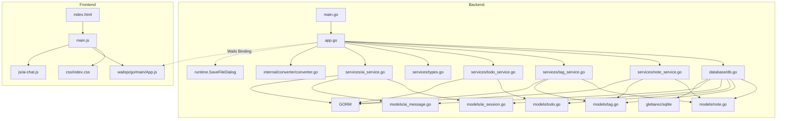

# Jot 项目分析报告

> 项目类型: 桌面端卡片式笔记应用（类小米笔记）
> 技术栈: Wails v2 + Go + GORM + SQLite + 原生 HTML/CSS/JS + CodeMirror 6（编辑器）+ einocli 薄适配层（eino 库驱动，OpenAI 兼容）

---

## 一、目录结构梳理

```
jot/                                    # 项目根目录
├── main.go                             # 【入口文件】Wails 应用启动入口，配置窗口/资源/绑定
├── app.go                              # 【核心文件】Wails 绑定层，暴露 95+ 个 Go API 给前端
├── go.mod                              # Go 模块定义，声明依赖版本
├── go.sum                              # Go 依赖锁文件
├── wails.json                          # Wails 项目配置（名称/构建脚本/作者）
├── AGENTS.md                           # 本报告文件
│
├── internal/                           # 【内部包】Go 子包统一目录
│   ├── converter/
│   │   └── converter.go               # markitdown 封装：办公文件转 Markdown（7 种格式 + 60s 超时）
│   ├── markitdown/                     # 从 Go module cache 克隆的 markitdown 库本地副本（含 PDFium Stdout/Stderr Discard 修复）
│   ├── database/
│   │   ├── db.go                       # SQLite 初始化（glebarez/sqlite 纯 Go 驱动）+ WAL 模式 + 优化 PRAGMA + DefaultDBPath() 路径函数 + blank import 注册 sqlite-vec 扩展
│   │   ├── builtin_profiles.go         # 内置 API 预设服务商定义（DeepSeek/智谱 GLM/Ollama/Agnes 等 12 个），InitDB 时按 Name 去重增量插入
│   │   └── builtin_mcp_servers.go      # 内置 MCP 服务器定义（Tavily/AnySearch/知乎/Context7 等），InitDB 时按 Name 去重增量插入
│   ├── fontutil/
│   │   └── fonts_windows.go           # EnumFontFamiliesW API 封装
│   ├── models/
│   │   ├── note.go                     # Note 实体（笔记）
│   │   ├── tag.go                      # Tag 实体（标签）
│   │   ├── setting.go                  # Setting 实体（KV 配置）
│   │   ├── ai_session.go              # AI 会话实体（标题/置顶/时间戳）
│   │   │   ├── ai_session_config.go      # AI 会话操作栏配置实体（模型/深度思考/搜索源/卡片召回（含指定笔记本）/笔记引用/技能，与 AISession 一对一关联）
│   │   ├── ai_message.go              # AI 消息实体（角色/内容/思维链，外键关联 SessionID）
│   │   ├── api_profile.go             # API 配置预设实体（名称/服务商/URL/Key）
│   │   │   ├── ai_prompt.go               # AI 提示词实体（技能提示词数据库存储）
│   │   │   ├── todo.go                    # Todo 实体（待办/文本/完成状态/时间戳）
│   │   │   └── note_vector.go             # NoteVector 实体（笔记切块向量索引：块文本/向量BLOB/维度/模型，按 note_id+chunk_index 索引）
│   └── services/
│       ├── note_service.go             # 笔记 CRUD + 搜索 + 置顶 + 回收站 + 统计 + 导入导出 + VACUUM 瘦身 + GetAllIDs
│       ├── tag_service.go              # 标签管理 + 笔记标签关联 + 标签计数
│       ├── setting_service.go          # 配置读写
│       ├── ai_service.go               # AI 业务层（einocli 客户端，OpenAI 兼容 + 流式输出 + 深度思考 + 会话持久化 CRUD + 会话配置持久化 + 消息管理 + Token 后端计算 + 会话 Token 持久化 + 技能提示词查询）
│       ├── todo_service.go             # 待办 CRUD（创建/列表/切换完成/删除/编辑）
│       ├── profile_service.go          # API 配置预设 CRUD + 切换/激活
│       ├── crypto.go                   # 敏感密钥 Base64 编码/解码工具（(zk) 前缀标识）
│   │   │   ├── recall_service.go           # 召回结果类型与合并/截断工具（RecallCard/CardRecallResult/MergeRecallCards/Truncate*Preview；关键词召回已移除）
│       ├── notebook_service.go         # 笔记本 CRUD
│       ├── vector_service.go           # 笔记向量索引（IndexNotes 切块量化/GetIndexStatus/Count*/DeleteAllVectors）+ sqlite-vec 函数式向量召回 VectorRecall（SQL 内余弦距离 + 笔记本过滤 + 相邻块补充）
│       ├── chunk.go                    # 文档切块（600 rune 上限 + 元数据前缀注入（标题/标签/创建时间）+ 段落聚合 + 多级标题栈 1-6 级 + 标题块合并 + 空节丢弃 + 围栏代码块保护 + 块首父级链补全）
│   │   │   ├── types.go                    # 通用类型（PaginatedResult, DataStats, ImportResult, SettingsConfig, RecallNotebookIDs 等）
│
├── frontend/                           # 【前端目录】Wails 前端（Vanilla + Vite）
│   ├── index.html                      # 入口 HTML，9 个视图 + 关于浮层
│   ├── package.json                    # 前端依赖（Vite 3.x + CM6 ~16 包 + marked + highlight.js + @codemirror/lang-* 6 包 + @codemirror/legacy-modes）
│   ├── src/
│   │   ├── main.js                     # 【核心文件】前端逻辑（CM6 集成 + 搜索弹窗 + MD 语法页面 + AI 对话 + TOC + 回到顶部 + 批量管理 + 设置统一重构 + 骨架屏 + 锁屏密码 + 标签管理；数据管理页/回收站页/常量工具函数/通知类/模拟数据已拆分为独立模块）
│   │   ├── js/                         # 【JS 模块目录】
│   │   │   ├── cm6-syntax-highlight.js # CM6 通用语法高亮模块（13 套配色 + 46+ 语言解析器映射 + 围栏代码块嵌套解析 mdCodeLanguages + 行内代码标记插件 markdownInlineCodePlugin）
│   │   │   ├── editor-actions/        # 编辑器操作菜单分组模块目录
│   │   │   │   ├── format.js          # 格式化操作项（JSON/XML/HTML/CSS/JS/SQL/CSV/YAML/TOML 各含格式化+压缩 + SQL 辅助函数 compactSQL/convertSQLCase）
│   │   │   │   ├── text-transform.js  # 文本转换操作项（7 项）
│   │   │   │   ├── text-clean.js      # 文本清理操作项（5 项）
│   │   │   │   ├── encode-decode.js   # 编码解码操作项（6 项）
│   │   │   │   └── md-syntax.js       # MD 语法插入操作项（22 项，type: 'insert' 模式）
│   │   │   ├── editor-actions.js      # 编辑器操作菜单模块（聚合导入各分组模块 + 菜单渲染/交互/执行引擎，main.js import 引入）
│   │   │   ├── data-management.js      # 数据管理页面模块（10 个函数 + reloadSettings，从 main.js 提取）
│   │   │   ├── trash-page.js           # 回收站页面模块（6 个函数，从 main.js 提取）
│   │   │   ├── ai-chat.js              # AI 对话模块（自实现聊天引擎 + 流式输出 + Markdown 渲染 + 多会话管理 + 侧栏折叠 + 多来源搜索 + 卡片召回（含笔记本选择菜单）+ 引用笔记 + 上传文件 + 拖拽上传 + 更多技能 + 双语言翻译方向组件 + 语言选择浮层 + 技能激活时禁用更多技能按钮 + 用户消息编辑/删除/重新发送 + 会话统一菜单（置顶/重命名/导出/删除）+ 分块渲染 + Token 显示 + 提示词迁移 + 会话切换一次性渲染+同步滚动消除跳跃 + 会话配置持久化同步 + 替换消息操作统一后端原子方法 + 分页懒加载消息）
│   │   │   ├── constants.js            # 图标常量 SVGS + 工具函数（formatTime/highlightText/getSummary/debounce，从 main.js 提取）
│   │   │   ├── notification.js         # NotificationManager 通知类 + window.showNotification 全局函数 + 模拟数据（getMockNotes/getMockTags，从 main.js 提取）
│   │   │   ├── calendar.js             # 笔记日历模块（日历网格渲染 / 墨水圆点统计 / 本月摘要统计 / 按日笔记列表 / 回到今天 / 点击笔记跳转 / 切月自动重置今天）
│   │   │   └── preview-worker.js       # Web Worker 离线程 Markdown 渲染（从 src/ 移入）
│   │   └── css/                        # 【CSS 模块化目录】原 style.css + app.css 拆分
│   │       ├── index.css               # 入口文件，@import 引入所有子文件（设计系统 → 组件）
│   │       ├── variables.css           # 11 主题 CSS 变量：`--bg`/`--accent`/`--text-primary` 等
│   │       ├── reset.css               # 全局 reset（box-sizing/body 边距/overscroll-behavior）
│   │       ├── scrollbar.css           # 统一滚动条 6px 细条 + 自动隐藏 + 透明轨道 + 主题变量联动（含主内容区/搜索/AI 对话消息列表）
│   │       ├── animations.css          # 28 个 keyframes + 通用工具类 `.anim-*` + stagger 延迟
│   │       └── components/
│   │           ├── topbar.css          # 顶栏（品牌/搜索框/窗口控制按钮/更多菜单含图标）
│   │           ├── main-content.css    # 主内容区布局（卡片网格/视图容器/滚动）
│   │           ├── sidebar.css         # 笔记本侧边栏三段式设计 + 折叠按钮
│   │   │   │   ├── editor.css          # 编辑器面板/CM6 主题/全屏/预览/代码块复制按钮（含 AI 消息代码块）
│   │           ├── dropdowns.css       # 右键菜单/更多菜单/下拉选择器
│   │           ├── modals.css          # 通用模态框/确认弹窗/覆盖层/快捷键页面样式（shortcut-row flex 水平布局）
│   │           ├── settings-panel.css  # 设置页分段控件/滑块/开关/按钮
│   │           ├── search-modal.css    # 搜索弹窗/结果列表/高亮
│   │           ├── data-view.css       # 数据管理页分类导航（左侧导航 + 右侧面板切换动画）+ 信笺统计 + 操作卡片
│   │           ├── md-reference.css    # MD 语法手册卡片源码/预览双栏对照
│   │   │   │   ├── ai-chat.css         # AI 对话页面（气泡/输入区/Markdown 渲染/打字指示器/会话侧栏/折叠按钮/滚动条自动隐藏/消息居中响应式宽度 clamp(800px,92vw,1600px)/32px 间距/更多技能菜单选中态+离场动画+翻译chip双语言布局/联网搜索 toggle 开关+召回笔记本菜单）
│   │           ├── todo.css            # 待办清单页面（输入+筛选一体化工具栏/8 个 @keyframes 动画 + 两段式新增 + 编辑保存动画 + 悬浮预览 tooltip）
│   │           └── calendar.css        # 笔记日历视图样式（日历网格/墨水圆点/统计卡片/笔记列表/入场动画）
│   ├── wailsjs/                        # Wails 自动生成的 JS 绑定
│   │   └── go/main/
│   │       ├── App.js                  # 后端 API 的 JS 封装
│   │       ├── App.d.ts               # TypeScript 类型定义
│   │       └── models.ts              # Go 模型的 TS 类型
│   └── dist/                           # Vite 构建产物（前端编译输出）
│
└── .trae/specs/                        # 项目 Spec 文档目录
```

### 目录规范评价

| 维度 | 评价 |
|------|------|
| **分层清晰度** | 优秀。严格按 `models → services → database → app` 分层，前端后端隔离清晰 |
| **命名规范** | 良好。目录名使用复数形式（models/services），符合 Go 社区惯例 |
| **冗余目录** | 无。每个目录职责单一，无多余层级 |
| **待改进** | 无（frontend/dist 已在 .gitignore 中） |

---

## 二、核心功能模块识别

### 2.1 基础支撑模块

| 模块名称 | 核心功能 | 对应文件 | 核心依赖 |
|----------|----------|----------|----------|
| **数据库初始化模块** | SQLite 连接建立、连接池配置、AutoMigrate、blank import 注册 sqlite-vec 扩展 | `database/db.go` | glebarez/sqlite, GORM, modernc.org/sqlite/vec |
| **数据模型层** | Note/Tag/Setting/AISession/AIMessage/APIProfile/AIPrompt/AISessionConfig/Todo/NoteVector 实体定义、GORM tag 映射 | `models/note.go`, `models/tag.go`, `models/setting.go`, `models/ai_session.go`, `models/ai_message.go`, `models/api_profile.go`, `models/ai_prompt.go`, `models/ai_session_config.go`, `models/todo.go`, `models/note_vector.go` | GORM |
| **通用类型** | 分页返回格式、统计数据、导入导出结构 | `services/types.go` | 无外部依赖 |
| **Wails 绑定层** | Go API → JS Bridge，95+ 个绑定方法，含 runtime.SaveFileDialog | `app.go` | Wails v2 binding + runtime |
| **前端构建** | Vite 打包、Wails dev 热重载 | `frontend/package.json`, `wails.json` | Vite 3.x（保留，未移除）|
| **前端构建流程** | `wails build` 自动执行 `npm run build`（Vite）→ `frontend/dist/`，再嵌入 Go 二进制 | `go:embed all:frontend/dist` | 前端构建和后端编译都由 `wails build` 一条命令完成 |
| **字体枚举** | Windows GDI EnumFontFamiliesW 系统字体枚举 | `fontutil/fonts_windows.go` | gdi32.dll / user32.dll (syscall) |
| **配置存储** | KV 结构配置读写（字体偏好等） | `services/setting_service.go` | GORM |
| **内置 MCP 服务器** | 内置 MCP 服务器模板（Tavily/AnySearch/知乎三服务/Context7），InitDB 时按 Name 去重增量插入 | `database/builtin_mcp_servers.go` | GORM |
| **路径工具** | `~/.jot` 根目录统一解析（data/backup/images/logs/mcp 五个子目录），数据库默认路径 `~/.jot/data/jot.db` | `internal/config/config.go:JotHomeDir()/SubDir()`，`database/db.go:DefaultDBPath()` | `os.UserHomeDir()` |
| **办公文件转换器** | 封装 markitdown 库，将 .docx/.pdf/.xlsx 等 7 种办公文件转为 Markdown 文本，带 60s 超时保护 | `internal/converter/converter.go` | github.com/conductor-oss/markitdown

### 2.2 业务核心模块

| 模块名称 | 核心功能 | 对应代码 | 核心输入 | 核心输出 |
|----------|----------|----------|----------|----------|
| **锁屏密码** | SHA-256 哈希验证 + 设置/修改密码 | `app.go:VerifyScreenLockPassword/SetScreenLockPassword` | 密码明文 | bool/错误 |
| **笔记 CRUD** | 创建/更新/查询/删除笔记 | `services/note_service.go` | 标题/内容/颜色/ID | Note 对象/错误 |
| **笔记搜索** | 标题+内容 LIKE 模糊搜索，支持 3 种排序（updated_at/created_at/title，均 pinned DESC 优先）| `note_service.go:Search()` | 关键词/分页/sortBy 参数 | 笔记列表+总数 |
| **笔记置顶** | 切换置顶状态 | `note_service.go:TogglePin()` | 笔记 ID | 更新后的笔记 |
| **回收站** | 软删除/查看/恢复/永久删除 | `note_service.go:Delete/GetTrash/Restore/PermanentDelete` | 笔记 ID | 操作结果 |
| **批量回收站操作** | 全部恢复/全部清空 | `note_service.go:RestoreAll/EmptyTrash` | — | 操作结果 |
| **标签管理** | 标签 CRUD | `services/tag_service.go` | 名称/颜色/ID | Tag 对象 |
| **笔记标签关联** | 为笔记添加/移除标签 | `tag_service.go:AddTagToNote/RemoveTagFromNote` | 笔记ID+标签ID | 操作结果 |
| **按标签筛选** | 通过标签 ID 查询笔记 | `note_service.go:GetByTag()` | 标签ID/分页参数 | 笔记列表+总数 |
| **数据统计** | 统计笔记总数/回收站数/标签数 | `note_service.go:GetStats()` + `tag_service.go:Count()` | — | DataStats 对象 |
| **数据导出为 .db** | 导出为 SQLite 数据库文件（VACUUM INTO + fs.CopyEx）| `app.go:ExportDataWithDialog()` | — | "导出成功" 提示 |
| **数据导入** | 从 JSON 文件导入笔记（跳过同名） | `note_service.go:ImportFromJSON()` | JSON 字节数组 | ImportResult 对象 |
| **前端卡片渲染** | 卡片网格展示 | `frontend/src/main.js` | 笔记数据数组 | DOM 渲染 |
| **前端编辑器** | 笔记编辑模态框（CM6 编辑器，支持行号/撤销重做/查找替换/Tab缩进/自动补全/自动闭合括号/Markdown 语法高亮） | `frontend/src/main.js` | 笔记数据/用户输入 | 保存/取消 |
| **前端查找替换** | CM6 search panel，Ctrl+F 查找 / Ctrl+H 查找替换，选中内容自动填充搜索框，预览模式自动切回编辑模式搜索 | `frontend/src/main.js:handleKeyboardNavigation()` | 搜索关键词 | 搜索面板匹配导航 |
| **前端搜索交互** | 搜索弹窗 200ms 防抖自动搜索，支持标题/内容/标签（多标签 AND 语义过滤）、笔记本/日期/排序筛选器（排序 3 选项：更新时间/创建时间/名称，均 pinned 优先） | `frontend/src/main.js` | 关键词 + 过滤条件 + sortBy | 搜索弹窗结果列表 |
| **笔记日历视图** | 日历导航（上/下月切换） + 创建时间墨水圆点统计（1/2-5/6+ 三档） + 按日笔记列表 + 点击笔记原地打开编辑器查看模式 | `frontend/src/js/calendar.js` + `frontend/src/css/components/calendar.css` + `services/note_service.go:GetByDate/GetMonthCounts` + `app.go:GetNotesByDate/GetMonthNoteCounts` | 年月参数/日期字符串 | 按月统计 map / 按日笔记列表 |
| **前端导航切换** | 网格/搜索/设置/数据管理/回收站/AI 助手视图切换 | `frontend/src/main.js:switchView()` | 视图名称 | 视图 DOM 切换 |
| **前端右键菜单** | 右键弹出菜单（查看/编辑/置顶/删除） | `frontend/src/main.js` | 鼠标事件+笔记ID | 菜单显示/操作 |
| **前端只读查看** | 左击笔记打开只读查看器 | `frontend/src/main.js:openEditor()` | 笔记 ID | 只读查看模态框 |
| **编辑器操作菜单** | 顶栏「操作」按钮下拉菜单，配置驱动操作注册表（EDITOR_ACTIONS 数组按分组拆分到 `frontend/src/js/editor-actions/` 模块，主文件聚合导入），当前含 5 个分组：格式化（JSON/XML/HTML/CSS/JS/SQL/CSV/YAML/TOML 各含格式化+压缩，SQL 另有关键字大小写共 18 项）、文本转换（大写/小写/首字母大写/驼峰式/蛇形式/行反转/字符反转 7 项）、文本清理（去除多余空格/去除空行/行尾空格清理/Tab↔空格 5 项）、编码解码（Base64/URL/HTML 各含编码+解码 6 项）、MD 语法（22 项，`type: 'insert'` 插入模式：有选中包裹选中文本、无选中在光标处插入样板）。支持选中文本或全文处理 + Ctrl+Z 撤销 + 查看模式隐藏 + 预览模式隐藏。无 subGroup 的项直接铺平在分组下，有 subGroup 的渲染为嵌套子菜单。 | `frontend/src/js/editor-actions.js` + `frontend/src/js/editor-actions/*.js` + `frontend/src/main.js`（import + els 注册 + window.cmEditor 暴露） | 选中文本或全文 | 格式化/转换/清理/编码解码/MD 样板结果 |
| **标签搜索** | 点击标签 chip 打开搜索弹窗并预选该标签筛选器 | `frontend/src/main.js:searchByTag()` | 标签 ID | 搜索弹窗结果列表 |
| **键盘快捷键** | Ctrl+F 编辑器搜索 / Ctrl+H 编辑器查找替换 / Ctrl+N 新建 / Ctrl+L 编辑器切换模式 / Ctrl+P 启动器菜单 / PgUp/PgDn 滚动 / Ctrl+Home/End / Ctrl+0 锁屏 | `frontend/src/main.js:handleKeyboardNavigation()` | 键盘事件 | 对应操作 |
| **版本号信息** | 返回 verman.V.GitVersion 纯版本号 | `app.go:GetVersion()` | — | 版本字符串 |
| **打开外链** | 调用 runtime.BrowserOpenURL 在默认浏览器打开链接 | `app.go:OpenProjectURL()` | URL 字符串 | — |
| **打开数据目录** | 在文件管理器中打开 `~/.jot/data/` | `app.go:OpenDataDir()` | — | explorer 文件管理器 |
| **一键备份** | 备份当前库到 `~/.jot/backup/jot-backup.db`（覆盖）| `app.go:BackupToDir()` | — | 备份成功提示 |
| **一键还原** | 从 `jot-backup.db` 还原并刷新笔记/标签/统计 | `app.go:RestoreFromDir()` | — | Toast 提示结果 |
| **外观设置** | 字体族下拉选择（搜索+键盘导航）+ 字体大小滑条（10-32px 实时预览）+ 主题选择（11 种）+ 主题预览迷你 UI 卡片 | `frontend/src/main.js:loadFontSettings/applyFontFamily/applyFontSize` + `loadThemeSetting` | 字体名称/大小/主题名称 | 更新 CSS 变量 |
| **AI 对话** | einocli 薄适配层（eino 库）驱动 OpenAI 兼容流式对话（自实现聊天引擎 + Markdown/代码高亮渲染 + 多会话管理/置顶/重命名/导出/统一菜单 + 引用笔记 + 上传文件 + 更多技能 + 双语翻译 + 用户消息编辑/删除/重新发送 + 用户消息 Meta Chip（引用/文件/技能可视化）+ 大消息截断折叠 + Agent 工具（内置工具 + MCP 工具 + 工具级开关）+ ask_user 反问机制 + 联网搜索（MCP 驱动，含内置服务器 Tavily/AnySearch/知乎/Context7）+ 卡片召回（sqlite-vec 向量召回）+ 对话摘要持久化 + Token 显示 + 后端统一上下文注入 + 分页懒加载消息 + 会话自动恢复 + MCP 连接池与预热 + 输入区自适应 + 三栏合并（引用/技能/文件）） | `services/ai_service.go`+ `einocli/` + `internal/agent/` + `internal/mcpserver/` + `frontend/src/js/ai-chat.js`+ `frontend/src/css/components/ai-chat.css` | 用户消息 | AI 流式回复 |
| **向量召回** | 笔记切块向量化（`chunk.go` 标题链拼接 + `IndexNotes` 先删后插幂等量化）后由 sqlite-vec 函数式检索——`vec_distance_cosine` SQL 内余弦距离 + `vec_f32` 解析 query 向量 JSON，`dist < 1.0` 过滤 + 距离升序 TopN；支持指定笔记本（JOIN notes 过滤）或全部笔记；命中块补充前后各 1 相邻块并按笔记合并卡片（召回块完整注入，已去掉单卡截断，由 ai_card_recall_limit 控制总量）；embedClient/模型未配置或当前模型无向量数据时静默跳过 | `services/vector_service.go:VectorRecall` + `services/chunk.go` + `models/note_vector.go` | 用户问题 query + 可选笔记本 ID 列表 | CardRecallResult（FormattedText 注入 system message + Cards 前端展示） |
| **AI 配置管理** | Base URL/API Key/Model 的读写 + 连通性测试 + 模型列表获取 | `app.go:GetAIConfig/SaveAIConfig/TestBaseURL/FetchAIModels` | 配置项 | 配置/测试结果 |
| **统一通知系统** | NotificationManager 单例类，右上角浮动通知，4 种类型 + undo 撤销 | `frontend/src/js/notification.js` | 消息/类型/回调 | 通知 DOM 创建与自动销毁 |

### 2.3 模块分层图

```
┌─────────────────────────────────────────────────────┐
│                    Frontend                          │
│  (main.js / css/index.css / index.html)               │
│   ├─ 视图渲染 (卡片/搜索/设置/数据管理/回收站/AI/MD 语法/日历/待办)     │
│   ├─ 交互逻辑 (事件绑定/状态管理)                      │
│   └─ Wails Bridge (window.go.main.App.*)              │
└────────────────────────┬────────────────────────────┘
                         │ Wails Binding (JSON 序列化)
┌────────────────────────▼────────────────────────────┐
│              App 层 (app.go)                         │
│  95+ 个绑定方法（CRUD/搜索/置顶/回收站/统计/导入导出/路径/│
│    AI 配置/会话管理/消息管理/笔记本回收站/配置文件预设)    │
│  (含 runtime.SaveFileDialog 原生对话框调用)            │
└────────────────────────┬────────────────────────────┘
                         │
              ┌──────────┼──────────┐
              ▼          ▼          ▼
    ┌─────────────┐ ┌──────────┐ ┌────────────┐ ┌──────────────┐
    │ NoteService │ │TagService│ │TodoService │ │  AI Service  │
    │ (CRUD/搜索/ │ │(CRUD/关联)│ │ (CRUD/切换 │ │ (AI 流式对话 │
    │  置顶/回收站 │ │          │ │  完成/删除 │ │  会话管理    │
    │  统计/导入   │ │          │ │  编辑)     │ │  消息持久化) │
    │  导出)      │ │          │ │            │ │              │
    └──────┬──────┘ └─────┬────┘ └──────┬─────┘ └──────┬───────┘
           │              │             │              │
           └──────┬───────┴──────┬──────┴──────┬───────┘
                  │              │              │
                  ▼              ▼              ▼
        ┌─────────────────┐ ┌──────────┐ ┌─────────────────┐
        │    GORM ORM     │ │GORM ORM │ │   GORM ORM     │
        │ (数据访问层)      │ │(待办层)  │ │ (AI 模型层)     │
        └────────┬────────┘ └────┬─────┘ └────────┬────────┘
                 │               │                 │
                 └───────────────┴─────────────────┘
                                    ▼
                          ┌─────────────────┐
                          │     SQLite      │
                          │ (glebarez/sqlite│
                          │  纯 Go 驱动)     │
                          └─────────────────┘
```

---

## 三、模块间依赖关系分析

### 3.1 依赖关系详表

| 依赖方 | 被依赖方 | 依赖类型 | 依赖详情 |
|--------|----------|----------|----------|
| `app.go` | `database` | 编译依赖 | 调用 `database.InitDB()` 获取 `*gorm.DB` 实例 |
| `app.go` | `services` | 编译依赖 | 创建 `NoteService` / `TagService` / `TodoService` / `SettingService` 实例 |
| `app.go` | `models` | 编译依赖 | 返回 `*models.Note` / `*models.Tag` / `*models.Todo` / `*models.Setting` 类型 |
| `app.go` | `runtime` | 编译依赖 | `runtime.SaveFileDialog` 原生保存对话框 |
| `app.go` | `fontutil` | 编译依赖 | `fontutil.GetFonts()` 枚举系统字体 |
| `services` | `models` | 编译依赖 | 操作 Note/Tag/Todo/Setting/AISession/AIMessage 结构体 |
| `services` | GORM | 编译依赖 | `*gorm.DB` 数据库操作 |
| `database` | `models` | 编译依赖 | `AutoMigrate(&models.Note{}, &models.Tag{}, &models.Todo{}, &models.Setting{}, &models.AISession{}, &models.AIMessage{})` |
| `database` | glebarez/sqlite | 编译依赖 | 纯 Go SQLite 驱动 |
| `fontutil` | gdi32/user32 | 运行时依赖 | syscall 调用 Windows GDI API |
| `frontend/main.js` | `wailsjs/go/main/App.js` | 运行时调用 | `window.go.main.App.*` 调用后端 API |
| `frontend/wailsjs` | `app.go` | 构建时生成 | `wails generate module` 自动生成 |

### 3.2 依赖关系图（Mermaid）


```mermaid
graph TD
    subgraph Backend
        A[main.go] --> B[app.go]
        B --> C[database/db.go]
        B --> D[services/note_service.go]
        B --> E[services/tag_service.go]
        B --> TD[services/todo_service.go]
        B --> F[services/types.go]
        B --> AI[services/ai_service.go]
        B --> CV[internal/converter/converter.go]
        C --> G[models/note.go]
        C --> H[models/tag.go]
        C --> TD2[models/todo.go]
        C --> I[models/ai_session.go]
        C --> J[models/ai_message.go]
        D --> G
        D --> H
        E --> G
        E --> H
        TD --> TD2
        AI --> I
        AI --> J
        C --> K[glebarez/sqlite]
        D --> L[GORM]
        E --> L
        TD --> L
        AI --> L
        B -.-> M[runtime.SaveFileDialog]
    end

    subgraph Frontend
        N[index.html] --> O[main.js]
        O --> P[css/index.css]
        O --> Q[wailsjs/go/main/App.js]
        O --> R[js/ai-chat.js]
    end

    B -.->|Wails Binding| Q
```

### 3.3 依赖问题分析

| 问题类型 | 描述 | 严重程度 |
|----------|------|----------|
| **循环依赖** | 无。所有依赖为单向 `main → app → services → models`，无循环 | ✅ 无问题 |
| **过度依赖** | 无。每个 Service 仅依赖 `*gorm.DB` 和自身模型 | ✅ 无问题 |
| **依赖缺失** | 无。`go.sum` 中所有传递依赖完整 | ✅ 无问题 |
| **隐式依赖** | 前端 `window.go` 对象依赖 Wails 运行时注入，本地开发/独立预览时不可用 | ⚠️ 有降级处理（Mock 数据） |
| **编译期依赖 vs 运行时依赖** | `wailsjs/` 目录需在修改 `app.go` 后重新生成 | ⚠️ 需手动执行 `wails generate module` |

---

## 四、设计模式与实现逻辑

### 4.1 设计模式识别

| 模式名称 | 应用位置 | 说明 | 代码示例 |
|----------|----------|------|----------|
| **Service Layer 模式** | `services/` 包 | 将业务逻辑从 controller（app.go）中抽离，封装为独立 Service 结构体 | `NoteService` / `TagService` |
| **依赖注入 (DI)** | `app.go` | Service 依赖的 `*gorm.DB` 通过构造函数注入 | `NewNoteService(db)` / `NewTagService(db)` |
| **Repository 模式** | `services/` 包内嵌 GORM | Service 内部直接使用 GORM 作为数据访问层 | `s.db.Create()` / `s.db.Where()` |
| **单例模式 (应用级)** | App 结构体 | Wails 运行时保证 App 实例唯一 | `NewApp()` 在 `main()` 中仅调用一次 |
| **MVC 变体** | 整体架构 | Model(models) - View(frontend) - Controller(app.go + services) 分层 | 见分层图 |
| **降级策略 (Fallback)** | `frontend/main.js` | 后端未绑定时自动使用 Mock 数据 | `if (!window.go.main.App.GetNotes) { state.notes = getMockNotes(); }` |
| **Wails Runtime 集成** | `app.go` | 通过 runtime 包调用原生桌面功能 | `runtime.SaveFileDialog()` 弹出系统保存对话框 |

### 4.2 核心业务逻辑流程

#### 4.2.1 笔记创建流程

```
用户点击 "+" 按钮 / Ctrl+N
  → openEditor(null)          // 打开空编辑器模态框
    → 用户填写标题/内容/选择颜色/选择标签
    → 点击"保存"按钮
      → createNote()
        → 前端校验（标题不为空）
        → window.go.main.App.CreateNote(title, content, color)
          → app.go:CreateNote()
            → noteService.Create()          // GORM db.Create(&note)
            → 返回 *models.Note（含 id）
          → 遍历 selectedTags
            → window.go.main.App.AddTagToNote(note.id, tagId)
              → tagService.AddTagToNote()   // GORM Association("Tags").Append
        → closeEditor()                     // 关闭模态框
        → loadNotes()                       // 重新加载笔记列表
          → GetNotes(1, 100)                // 分页查询
          → renderCardGrid()                // 渲染右侧卡片网格
```

#### 4.2.2 笔记搜索流程

```
Ctrl+F / Ctrl+K → 打开搜索弹窗
  → els.searchModalInput 自动聚焦
  → 用户输入文字 → 200ms 防抖
    → searchModalLoadPage(1, false)
```

...（中间流程不变）

---

## 五、技术栈评估

### 5.1 技术栈清单

| 层级 | 技术 | 版本 | 用途 |
|------|------|------|------|
| **桌面框架** | Wails v2 | v2.9.2 | 桌面窗口 + Go ↔ JS Bridge |
| **后端语言** | Go | go1.22+ | 后端业务逻辑 |
| **数据库** | SQLite | — | 本地数据存储 |
| **数据库驱动** | glebarez/sqlite | v1.11 | 纯 Go SQLite 驱动（无 CGO） |
| **向量检索** | sqlite-vec（modernc.org/sqlite/vec） | v0.1.9 | SQL 内余弦距离 vec_distance_cosine / vec_f32，函数式用法（非 vec0 虚拟表），blank import 自动注册 |
| **ORM** | GORM | v1.25 | 对象关系映射 |
| **前端构建** | Vite | v3.2.11 | 前端打包工具 |
| **前端技术** | 原生 HTML/CSS/JS | — | UI 渲染 |
| **编辑器** | CodeMirror 6 | @codemirror/view v6.26 | 笔记编辑器 |
| **Markdown 解析** | marked | v12.0 | Markdown → HTML 渲染 |
| **代码高亮** | highlight.js | v11.10 | 代码块语法高亮 |
| **Mermaid 图表** | mermaid | v11.4 | Markdown 代码块图表渲染（mermaid/render 子路径） |
| **AI 对话** | einocli 薄适配层（eino 库） | github.com/cloudwego/eino v0.9.13 + eino-ext（components/model/openai v0.1.13 + libs/acl/openai v0.1.17，底层 github.com/meguminnnnnnnnn/go-openai v0.1.2） | 流式对话/深度思考/多会话/联网搜索/卡片召回 |
| **本地存储** | localStorage | — | UI 状态持久化（主题/侧栏状态等） |

### 5.2 技术栈选型评价

| 评价维度 | 说明 |
|----------|------|
| **合理性** | Wails v2 适合桌面端 Go 应用，原生 HTML/CSS/JS 避免前端框架学习成本 |
| **性能** | SQLite + GORM 组合满足本地笔记应用性能需求，流式输出不阻塞 UI |
| **维护性** | 前后端分层清晰，CSS 模块化拆分降低维护成本 |
| **可扩展性** | 新增功能只需添加 binding 方法和前端模块，架构本身无限制 |
| **风险** | Wails v2 社区较小，Wails v3 路线图不明确，长期维护可能受限 |

### 5.3 版本兼容性问题

| 问题 | 说明 |
|------|------|
| **Wails 版本锁定** | `go.mod` 中 `wails.io v2.9.2` 已固定，`wails/v2` 包需与 Wails CLI 版本匹配。升级需同步更新 CLI, go.mod, wails.json 三方 |
| **GORM AutoMigrate** | 新增模型（如 AISession/AIMessage）后需在 `database/db.go` 的 `AutoMigrate` 中注册，否则表不会自动创建 |

---

## 六、补充分析

### 6.1 扩展性评估

| 扩展方向 | 可行性 | 建议 |
|----------|--------|------|
| **多用户/云端同步** | 低 | 如需云端同步，建议引入 WebDAV/第三方同步库 |
| **AI 功能扩展** | 高 | 当前 AI 会话架构（Session + Message 模型）天然支持多会话切换和上下文管理，易于扩展。新增方法直接注册 binding 到 app.go 即可 |
| **国际化 (i18n)** | 中 | 所有 UI 文本硬编码在 HTML/JS 中，需统一抽离 |
| **插件系统** | 低 | 原生 HTML 架构不适合动态加载插件 |

### 6.2 性能关键点

| 关键点 | 现状 | 评估 |
|--------|------|------|
| **数据库查询** | GORM + SQLite，分页查询 | ✅ 满足笔记本规模 |
| **前端渲染** | 卡片网格渲染 | ✅ 性能良好 |
| **AI 流式输出** | 基于 Wails Events 逐块推送，不阻塞 UI | ✅ 体验优秀 |
| **CM6 编辑器** | 仅初始化当前编辑的笔记 | ✅ 性能良好 |
| **多会话切换** | 切换时从后端加载对应会话的消息，采用一次性同步渲染（无 yield）+ 同步滚动（`scroll-behavior: auto` 临时禁用），浏览器只绘制一次最终状态，彻底消除视觉跳跃。后端 `LoadAISessionMessagesPaginated` 在返回前端前已截断 `RecallCards`/`SearchSources` 的 Content 为 200 字，减小 Wails 桥传输量和 DOM 渲染开销 | ✅ 切换瞬间完成，无任何中间状态闪烁 |
| **操作按钮折叠测量** | `collapseActionsIfNeeded()` 支持 `sync` 同步模式，在 `switchSession()` 中使用同步测量避免布局抖动 | ✅ 消除消息"跳跃"问题 |

### 6.3 异常处理分析

| 异常场景 | 处理方式 |
|----------|----------|
| **后端 API 不可用** | 前端 Mock 数据降级 |
| **AI API 调用失败** | HTTP 状态码封装为 11 种分类中文提示（auth_error/rate_limit/server_error 等），通过 `ai:stream-error` 事件以 JSON 格式（`{category, user_msg, raw}`）传递到前端，解析后通过 `showNotification()` 右上角通知展示，不再插入对话流中 |
| **联网搜索失败** | 每个搜索来源独立发射错误事件 `ai:search-error`，不影响其他来源继续搜索；前端通过 `showNotification()` 提示用户 |
| **数据库损坏** | 备份还原机制 |
| **办公文件转换失败** | 60s 超时保护 + `Warnw` 日志记录大文件/损坏文件，`Errorw` 记录转换异常；前端通过 `showImportResults()` 逐个显示文件错误详情 |
| **流式连接中断** | 前端监听 `ai:stream-error` 事件，显示错误提示 |
| **会话/消息查询失败** | 返回空列表 + 控制台错误日志，不阻断 UI |

### 6.4 安全分析

| 风险点 | 评估 |
|--------|------|
| **本地数据库** | SQLite 文件本地存储，无远程访问风险 |
| **API Key 存储** | Base64 编码存储在 DB 中，带 `(zk)` 前缀标识，前端读写均为解码后明文。仅防肉眼查看，非真实加密 |
| **XSS 风险** | AI 回复经 `marked.parse()` 渲染，`marked` 默认 Sanitize |

### 6.5 数据库优化

| 优化项 | 配置 | 说明 |
|--------|------|------|
| **WAL 模式** | `PRAGMA journal_mode=WAL` | 允许并发读取，写入不阻塞读取，显著提升多线程场景性能 |
| **busy_timeout** | `PRAGMA busy_timeout=5000` | 忙等待超时 5 秒，避免 "database is locked" 错误 |
| **synchronous** | `PRAGMA synchronous=NORMAL` | WAL 模式下 NORMAL 级别安全且性能比 FULL 快得多 |
| **cache_size** | `PRAGMA cache_size=-8000` | 8MB 页面缓存（负值表示 KB 单位） |
- 初始化位置：`internal/database/db.go` 的 `InitDB()` 函数中，`SetMaxOpenConns(1)` 之后
- PRAGMA 执行失败不影响初始化流程（忽略错误），由调用方统一处理错误日志
- 导入/还原场景需清理 WAL 残留文件（`-wal`/`-shm`），防止旧文件干扰新数据库，清理逻辑在 `app.go` 的 `replaceDatabase()` 函数中

---

## 七、项目核心特点

### 核心设计理念

1. **Wails v2 跨平台桌面应用**：Go + 原生前端（HTML/CSS/JS）架构，兼顾后端性能和前端灵活性

2. **CodeMirror 6 编辑器集成**：主流 Markdown 编辑器引擎，支持行号/撤销重做/查找替换/Tab缩进/自动补全/语法高亮（13 套配色 + 46+ 语言）

3. **CSS 变量主题系统（11 主题）**：全局 CSS 变量联动（`--bg`/`--accent`/`--border` 等），一键切换 11 套系统主题 + 13 套代码高亮主题，所有组件自动适配。2026-07 完成配色全面重构——每套主题重新设计 `--bg`/`--card-bg`/`--bg-secondary` 等核心颜色值，E 护眼/深色/浅色等主题彻底重做，共修改 ~140 个变量

4. **三步交互范式**：笔记本（容器）→ 笔记卡片（列表）→ 编辑器（操作），符合直觉的文件夹-文件-编辑结构

5. **AI 对话引擎（einocli 薄适配层 + eino 库）**：基于 eino（components/model/openai）实现 OpenAI 兼容统一接口，通过 einocli 薄适配层对外暴露，支持 DeepSeek、通义千问等兼容端点（已移除 Ollama 原生协议）。流式输出 + Markdown 渲染 + 代码高亮 + 思维链折叠 + 多会话管理 + 侧栏折叠 + 多来源联网搜索（Tavily/知乎/全网搜索，含全选/全取消开关）+ 卡片召回（含笔记本选择菜单）+ 引用笔记 + 更多技能 + 用户消息编辑/删除/重新发送 + Token 统计 + **后端统一上下文注入**。API 连接通过设置页预设管理配置与持久化。

6. **统一的通知系统**：NotificationManager 单例，右上角浮动通知，支持 success/error/warning/info 四种类型 + undo 撤销

7. **过度动画与交互反馈**：28 个 keyframes、stagger 延迟、hover 分层反馈、spring 弹性缓动、骨架屏 shimmer、分段滑块弹簧曲线（`cubic-bezier(0.34, 1.2, 0.64, 1)`）、字体滑条实时预览

8. **无 UI 框架依赖**：无 Vue/React/Svelte，纯手写 DOM 操作，极致轻量

9. **Mermaid 图表渲染集成**：为 Markdown 代码块中的 `language-mermaid` 块提供按需渲染，默认显示源码，点击渲染按钮后直接主线程渲染 SVG。切换按钮与复制按钮风格统一，CSS `:has()` 处理双按钮防碰撞。

### 设计系统

- **尺寸**：`--radius-md`(8px) / `--radius-sm`(6px)，全局统一
- **间距**：4px 基线网格，组件内部 8-16px，布局 16-24px
- **阴影**：4 层 Token — `elevated`(卡片) / `dropdown`(下拉菜单) / `modal`(模态框) / `toast`(通知)
- **语义色**：`--success`(绿) / `--warning`(黄) / `--error`(红) / `--info`(蓝)
- **字体**：全局统一 `var(--font-family)`，编辑器和代码块跟随系统设置
- **滚动条**：6px 细条，`--scrollbar-thumb` / `--scrollbar-thumb-hover` 联动 11 主题
- **圆角一致性**：所有交互元素（按钮/卡片/输入框/下拉菜单/模态框）均使用 `var(--radius-sm)` 或 `var(--radius-md)`，无硬编码

---

## 九、关键记忆点

1. **Wails v2 事件驱动流式输出**：AI 回复流式数据传输使用 `runtime.EventsEmit`（Go 端）+ `EventsOn`（前端），Go 端 `bufio.Reader` 逐行解析 SSE `data: {...}` 流，通过回调（`onChunk`/`onThinking`/`onDone`/`onError`）逐块推送。前端在 `onSend()` 中动态注册一次性事件回调（`Array.from` 包裹闭包捕获局部变量），每个请求各自独立的 `streamingContent`/`streamingEl`/`lastReasoningEl` 局部变量隔离，防止多消息冲突

2. **思维链折叠**：深度思考模型返回 `delta.reasoning_content`，Go 端在 `streamChoice.Delta` 中解析此字段，通过 `onThinking` 回调和 `ai:stream-thinking` 事件推送。前端创建 `<details class="ai-thinking">` 可折叠区域（summary + 内容），首次 thinking chunk 懒创建，后续流式追加，`addMessage()` 也接受 `reasoningContent` 参数用于显式渲染

3. **AI 消息持久化 + 后端原子替换 + 消息懒加载（会话消息全链路）**：`AISession`+`AIMessage` GORM 模型（`ai_session.go`/`ai_message.go`），`SaveAIMessages()` 保存一轮对话并自动生成标题（取首条用户消息前 30 字），`LoadAISessionMessages()` 按 `CreatedAt` 升序返回历史，`ClearAISessionMessages()` 清空会话。**后端原子替换**：编辑/删除/重发/重新生成四操作的 DB 写入合并为后端 `ReplaceAISessionMessages(sessionID, messages)` 单次调用（GORM Transaction 保证清空+写入原子性，前端 `chatHistory` 为空时 fallback 到 ClearAISessionMessages）。**懒加载 + 上下文自取**：`CallAIAgentStream` 仅接收 userText 和元数据，后端自行从 DB 加载全部历史构建上下文；`LoadAISessionMessagesPaginated` 分页加载（游标 `beforeID` 默认 6 条 ASC）；编辑/重发/再生用基于 `msgID` 的 `TruncateAISessionAfterMessage` 截断、删除用 `DeleteAIMessage`（仅删单条）；Token 显示改后端 `SumSessionTokens`+`GetSessionContextTokens`；`stream-done` 事件 9 参数（含 userMsgID/assistantMsgID）。详见 [ai_service.go](internal/services/ai_service.go)、[app.go](app.go)、[ai-chat.js](frontend/src/js/ai-chat.js)

4. **AI 对话侧栏 + 折叠机制**：左右分栏布局（`.ai-chat-layout`），左侧 `.ai-session-sidebar`（220px），右侧 `.ai-chat-content` flex:1。折叠按钮（`.ai-sidebar-toggle`）为 14×44px 纤细条状，置于侧栏外作为兄弟元素，通过兄弟选择器 `~` 控制 `left` 定位（展开时 220px、折叠时 0）。展开时按钮左侧加 `border-left: 1px solid var(--border)` 延续分割感。折叠状态 `localStorage` 持久化，CSS `transition: width 0.25s ease` 动画。SVG Chevron 图标（Lucide 风格）替代 Unicode 字符

5. **`onAIChatViewActivated` 惰性加载**：仅在 `activeSessionId === null`（无活跃会话）时自动加载第一个会话，视图切换不重置当前会话状态，避免切换回来后消息错乱。`switchSession()` 按 `msg.role` 遍历渲染，`Message` 结构体含 `ReasoningContent` 字段

6. **消息渲染与气泡**：`addMessage()` 创建消息气泡 DOM，AI 侧使用 `marked.parse()` 渲染 Markdown（含 `hljs.highlightElement()` 代码高亮），用户侧以 `<pre class="ai-user-msg">` 转义纯文本。打字指示器内嵌到 `msg-content` 内部（不独立建气泡）

7. **联网搜索（MCP 迁移后）**：内置 Tavily/知乎多源搜索已整体移除（含 `web_search`/`refine_search_query` 工具与 `search_service.go`/`zhihu_search_service.go`/`query_refiner.go`）。Agent 的联网能力由 MCP 服务器工具提供（`mcp_{服务器名}_{工具名}`，装配见 agent.go 的 MCPServerDB 分支）；搜索结果以工具返回文本进入正文。**搜索来源面板展示已移除**（历史消息不再解析 `search_sources`，`LoadAISessionMessagesPaginated` 置空该字段，DB 数据保留）；**召回卡片展示保留**（`recall_notes` 本地检索经 `ai:agent-result`/`renderRecallCards` 展示，历史回放同样显示）。

8. **前端 Agent 工具状态展示**：`ai:tool-status` 事件实时展示工具调用状态条（含 MCP 工具，`ActionText` 文案"调用 {服务器} 的 {工具}"）；`ai:ask-user` 反问面板；`ai:agent-result` 回传搜索来源/召回卡片/工具调用链供 `stream-done` 落库与渲染。

9. **切换会话性能优化（分块渲染）**：`switchSession()` 中对大量历史消息采用分块渲染策略（CHUNK_SIZE=5），每块渲染后 `setTimeout` 0ms yield 给浏览器，避免一次性渲染大量 DOM 导致卡顿。移除 `collapseActionsIfNeeded` 同步调用（该函数已删除，不再需要布局抖动补偿）。详见 [ai-chat.js](frontend/src/js/ai-chat.js) `switchSession()`

10. **延迟语法高亮（deferHighlight）**：`renderMarkdown()` 新增 `deferHighlight` 参数，历史消息加载时使用 `deferHighlightBlocks()` 通过 `requestIdleCallback` 渐进式执行 `hljs.highlightElement()`，优先级低于首次渲染，优先保证页面交互。详见 [ai-chat.js](frontend/src/js/ai-chat.js)

11. **重置出厂设置修复集**：①`resetDatabase()` 清空 `#aiChatMessages.innerHTML` 和 `#aiSessionList.innerHTML` 避免旧数据残留；②`onAIChatViewActivated()` 中清除标题/contextSize/chatHistory/sessions/activeSessionId 等模块级变量；③重置后自动调用 `onAIChatViewActivated?.()` 让 AI 助手模块立即进入就绪状态，消除闪烁。详见 [data-management.js](frontend/src/js/data-management.js)、[ai-chat.js](frontend/src/js/ai-chat.js)

12. **全局链接系统浏览器打开**：在 `main.js` 的 `initEventListeners()` 中添加 `document` 级 click 事件委托，拦截所有 `<a>` 标签点击，通过 `e.preventDefault()` + `window.runtime.BrowserOpenURL(href)` 在系统默认浏览器中打开。排除 `#` 锚点链接和 `javascript:` 伪协议。同时移除了 `ai-chat.js` 中 `messagesEl` 级别的区域委托和搜索来源面板中的冗余 `link.addEventListener` 代码。详见 [main.js](frontend/src/main.js#L5131-L5138)

13. **SQLite WAL 模式 + 优化 PRAGMA**：`InitDB()` 中配置 `journal_mode=WAL`、`busy_timeout=5000`、`synchronous=NORMAL`、`cache_size=-8000`。PRAGMA 执行失败不中断初始化，由调用方统一记录日志。`replaceDatabase()` 中清理 `-wal`/`-shm` 残留文件防止导入/还原数据损坏。详见 [db.go](internal/database/db.go)、[app.go](app.go)

14. **基础 System Prompt 三层重构 + 技能注入修复**：将单句硬编码基础 prompt 拆分为包级常量 `baseIdentity`（身份层）、`baseNormsBoundaries`（规范层+边界层）、`baseSystemPrompt`（完整三层，均在 [app.go](app.go)）。修复 `CallAIAgentStream` 中技能激活时跳过全部基础 prompt 的 Bug，改为始终注入规范层+边界层，仅身份层在技能激活时跳过。详见 [app.go](app.go)

15. **启动器网格（Launcher Grid）全屏浮层实现**：新增 `Ctrl+P` 触发的全屏启动器网格，与"更多"菜单并存互不干扰。核心设计要点：① ES module 中函数不会自动挂到 `window` 上，launcher 调用的操作函数（`toggleSidebar`/`openShortcuts`/`showAbout` 等）需手动 `window.xxx = xxx` 暴露；② `executeAction` 先调 `closeLauncher(callback)` 等离场动画 `transitionend` 完成后再执行操作，不能用 `setTimeout` 硬等——离场动画涉及 mask 和 panel 共 4 条过渡属性，`transitionend` 会冒泡 4 次，需 `_closed` 守卫防止重复触发；③ 方向键首次导航 `_selectedIndex === -1` 时直接跳第一项；④ 动画使用 `requestAnimationFrame` 双阶段（`display: flex` → `visible` class 触发入场），离场用 `closing` class 触发反方向过渡 + `transitionend` 监听 + 300ms `setTimeout` 保底。详见 [launcher.js](frontend/src/js/launcher.js)、[launcher.css](frontend/src/css/components/launcher.css)

16. **markitdown 库本地克隆 + Wails 构建 PDF 转换修复**：将 `github.com/conductor-oss/markitdown` 从 Go module cache 克隆到 `internal/markitdown` 进行本地维护，通过 `go.mod` replace 指令引用。修复 `wails build` 后 PDF 转换失败问题——根因是 Wails GUI 构建缺少有效控制台句柄，wazero 初始化 PDFium WebAssembly 时调用 `GetFileType /dev/stdout` 返回无效句柄错误。修复方案：在 `initPdfiumPool()` 的 `webassembly.Config` 中添加 `Stdout: io.Discard` 和 `Stderr: io.Discard`，避免 wazero 对无效句柄调用 `GetFileType`。详见 [internal/markitdown/converter_pdf_pdfium.go](internal/markitdown/converter_pdf_pdfium.go)、[go.mod](go.mod)

17. **全屏模式顶栏分割线隐藏**：编辑器进入全屏模式（`.editor-panel.fullscreen`）时，通过纯 CSS `:has()` 选择器（`.main-content-area:has(.editor-panel.fullscreen) #topbar`）将顶栏底部 `border-bottom-color` 设为 `transparent`，使顶栏与编辑器面板在视觉上融为一体，无分割线更加宽阔沉浸。利用 topbar 已有的 `transition: border-color 0.3s ease-out` 实现平滑淡出/恢复。零 JS 改动，纯 CSS 实现。详见 [editor.css](frontend/src/css/components/editor.css)

18. **sqlite-vec 函数式向量召回**：卡片召回已从 gse 关键词召回彻底切换为 sqlite-vec 函数式向量召回。`modernc.org/sqlite` 升级 v1.51.0（含 vec 子包 v0.1.9），[db.go](internal/database/db.go) blank import `_ "modernc.org/sqlite/vec"` 注册扩展（sqlite3_auto_extension 自动生效，测试包需自行 import）。[vector_service.go](internal/services/vector_service.go) `VectorRecall`：query 向量 `json.Marshal` 为 JSON 数组字符串，`vec_f32(?)` SQL 内解析；`vec_distance_cosine(embedding, vec_f32(?)) < 1.0` 过滤（dist<1.0 等价 score>0）+ 距离升序 LIMIT TopN；**无条件 JOIN notes 过滤软删除笔记**（回收站笔记不参与召回，全库/指定笔记本行为统一；指定笔记本时 ON 追加 `notebook_id IN ?`；列必须加 `note_vectors.` 前缀防 id 歧义，**JOIN 必须紧跟 FROM、位于 WHERE 之前**，否则运行时报 `near "JOIN": syntax error`）；命中后二次查询该笔记全部块补相邻块（前后各 1）并按笔记合并卡片（单卡 1200 rune 截断）。`recall_service.go` 仅剩类型与合并/截断工具，`cosineSimilarity`（Go 全表扫描）已删，`Float32ToBlob`/`BlobToFloat32` 保留。embedClient/Model 为空或当前模型无向量数据时静默跳过（Debugw 日志）。**向量生命周期**：笔记永久删除（PermanentDelete / EmptyTrash / CleanExpiredTrash）时在 note_service 内联动清理 NoteVector（软删除不动向量，恢复后可直接用）。测试教训：SQL 拼接测试必须完整复刻真实代码顺序，否则测试过但运行时炸。

19. **Agent 内置工具治理（开关黑名单 + 防御加固 + 写操作强制确认 + ask_user 强制调用）**：`ai_agent_tools_disabled` 黑名单（默认全注册）控制全部内置工具注册（注册级过滤，被禁工具模型不可见，注册清单以 [registry.go](internal/agent/registry.go) 为准）；设置页「Agent 工具」下拉多选（英文名+中文说明，关闭浮层汇总 toast）；Rnx.toml `fclint` 任务（lint + validate:html）挂 frontend 的 run_after。**防御加固**：`tools.WrapWithError` 的 `InvokableRun` defer recover（panic 转 fail 回填模型不中断 ReAct 循环）+ web_search 单源 goroutine recover；各工具补 `ctx.Err()` 取消检查；统一文本长度上限（[context.go](internal/agent/tools/context.go) `validateTextLen`：短文本 500 / find 2000 / 正文 20000，按 rune 计）；read_note_section offset/length 整数校验（math.Trunc 防浮点截断）；manage_tag action TrimSpace；read_url `isPrivateHost` SSRF 防护（拒绝 loopback/私网/链路本地含 169.254.169.254/.local/.internal 主机名，不做 DNS 解析）；manage_note `normalizeNoteFileExt` 扩展名校验（纯字母数字 1-10 位，create 空→.md、update 空→保持原值）。**写操作强制确认**：manage_note 的 update/edit/pin/move/add_tag/remove_tag 六动作未携带 `confirm=true` 一律拒绝执行并返回引导文本（正常结果非 error），提示调用 ask_user 向用户确认；app.go【工具使用规范】升级为强制三步（正文说明→ask_user 提问→用户同意后带 confirm=true 执行）。**ask_user 强制调用**：信息模糊/参数不明确/需求不具体、多选项或方案选择、需确认或补充关键信息三类场景必须调用不得省略绕过（app.go 系统提示词 + ask_user 工具 Desc 双通道约束）。详见 [registry.go](internal/agent/registry.go)、[context.go](internal/agent/tools/context.go)、[manage_note.go](internal/agent/tools/manage_note.go)、[ask_user.go](internal/agent/tools/ask_user.go)、[read_url.go](internal/agent/tools/read_url.go)、[read_note_section.go](internal/agent/tools/read_note_section.go)、[manage_tag.go](internal/agent/tools/manage_tag.go)、[app.go](app.go)、[Rnx.toml](Rnx.toml)

20. **manage_note 双模式扩展 + 新工具 read_url / read_note_section + meta.go 描述修正**：manage_note 新增 update（标题/扩展名，非空才更新对应字段）、edit 双模式互斥（find+replace 片段替换可作删除（find 优先精确匹配、空白差异自动归一化兜底，count 指定第几次、replace_all=true 全替换且与 count>1 互斥）/ line_start+line_end 行级替换含末尾追加（行号来自 view/read_note_section 的 line_numbers=true 输出，replace 空串即删行区间，line_start 大于总行数时为末尾追加语义））、file_ext 缺省 .md；read_url 基于 eino-ext URL Loader 抓取网页提取正文按 `ai_web_search_max_chars` 截断（仅放行 http/https、15s 超时、浏览器 UA）；read_note_section 分段续读大笔记（id/offset/length，view 超大截断时给出续读指引，line_numbers=true 输出全局行号）；view/read_note_section 的 line_numbers 行号前缀仅作行级编辑寻址坐标、不属于正文（复制片段用于 find 时不得包含行号）；meta.go Label 修正——工具描述与实际实现必须一致（曾声称有"删除"能力实际没有，已删除虚假描述，教训）。详见 [manage_note.go](internal/agent/tools/manage_note.go)、[read_url.go](internal/agent/tools/read_url.go)、[read_note_section.go](internal/agent/tools/read_note_section.go)、[meta.go](internal/agent/tools/meta.go)

21. **ask_user 同轮续答全链路（会话注册表 + 竞态防御 + 前端交互）**：`AgentService` 会话级实例注册表 `sessions map[uint]*agentSession`（按 AI 会话 ID 保持 Agent 实例，LRU 上限 32），`agentSession` 持 askCh（容量 1 反问答案通道）/askPending/runMu（同会话 run 串行化）/runCancel（会话释放独立取消）/ChatModel 缓存（指纹不变复用）。**同轮机制**：`tools.AskWaiter`（`ClaimAsk` 原子抢占 + `WaitForAnswer` 阻塞）——ask_user 工具 ClaimAsk 成功 → 发射 `ai:ask-user` → 阻塞等待，答案经 `AnswerAskUser(sessionID, answer)` 投递 → 工具返回 → **同一轮 ReAct 循环继续**（AI 消息不结束、答案不落库为新用户消息）；`streamedContent` 累计本轮全部流式正文，反问轮**整轮落库**（问句+续答）与前端气泡一致。**竞态防御**：ClaimAsk 原子抢占防并行 ask_user 多重阻塞挂起；`drainAsk` 排空提交答案同时取消残留的陈旧答案（Run defer + ReleaseSession 均排空）；`ReleaseSession`/`ReleaseAll`（清空/删除会话、rebuildServices 工厂重置）取消等待中 run 并清注册表防僵尸泄漏；Agent 事件统一携带 streamGen（ai:stream-chunk/thinking/tool-status/ask-user）前端按代过滤防串流。**前端**：`agentAskWaiting` 状态、气泡保持流式正文空显示"等待你的回答…"、主输入框禁用并提示"等待你的选择…"（`setAskInputWaiting` placeholder 保存/恢复 + `.ai-ask-waiting` 遮罩）、面板提交走 AnswerAskUser（submitting 防重入、成功才隐藏）、**× 关闭=取消本轮**（复用停止逻辑防悬挂）、停止/错误/完成/清空/重置各路径统一清理、`stream-done` 用 `assistantMsgID`（取消路径=0）区分取消与正常完成**取消不写 chatHistory**（避免幽灵条目/误弹历史记录）。详见 [agent.go](internal/agent/agent.go)、[context.go](internal/agent/tools/context.go)、[ask_user.go](internal/agent/tools/ask_user.go)、[app.go](app.go)、[ai-chat.js](frontend/src/js/ai-chat.js)、[ai-chat.css](frontend/src/css/components/ai-chat.css)

22. **Agent 工具扩展（json 三件套）+ 上下文窗口 20→40**：新增 json_validate/json_format/json_extract（`utils.InferTool` 结构体反射风格，**gjson v1.18.0 提取**——升级为直接依赖，原为传递依赖 v1.14.2；`normalizeGJSONPath` 归一化模型 JSONPath 写法：`$` 前缀、`[n]`→`.n`、`#` 通配符透传；对象/数组返回 `res.Raw` 保留源键序）；注册 registry.go + meta.go 文案（前端开关自动生效零改动）。上下文窗口默认 20→40：`GetContextWindowSize` 兜底 + [db.go](internal/database/db.go) 种子 + **旧库值 20→40 幂等迁移**（InitDefaultSettings 迁移区，该键无 UI 暴露，旧值即种子默认直接升级）。详见 [json_tools.go](internal/agent/tools/json_tools.go)、[registry.go](internal/agent/registry.go)、[meta.go](internal/agent/tools/meta.go)、[ai_service.go](internal/services/ai_service.go)、[db.go](internal/database/db.go)。注：summarize_text 已移除（Agent 自身可直接摘要上下文中的文本，无需额外工具调用）

23. **API 预设调整：移除自动生成默认配置 → 字段改名 is_builtin → 最终移除 is_builtin + 孤儿列清理**：① **移除"无预设时自动创建『默认配置』预设"逻辑**（app.go 启动迁移块 / SaveAllSettings / SaveAIConfig 三处 `CreateProfile("默认配置", ...)` 全删；内置服务商预设 [builtin_profiles.go](internal/database/builtin_profiles.go) 保留照常插入；`profile_service.go` 的 `SetActive` 死代码一并删除）。② **`IsDefault` 字段曾改名为 `IsBuiltin`**（gorm 列 `is_default`→`is_builtin`、JSON tag 同步），`DeleteProfile` 一度加"内置不可删除"拒删、前端按 `p.is_builtin` 隐藏删除按钮、存量库按 Name 补标。③ **最终决定移除 `is_builtin` 字段及全部内置/用户区分逻辑**（用户权衡：判断内置/用户记录无意义，反正重启会重新插入内置服务商）：[api_profile.go](internal/models/api_profile.go) 删 `IsBuiltin` 字段、[profile_service.go](internal/services/profile_service.go) `CreateProfile` 恢复固定三参 + `DeleteProfile` 移除拒删、[builtin_profiles.go](internal/database/builtin_profiles.go) 删补标循环（12 条内置服务商启动插入保留）、[main.js](frontend/src/main.js) 所有预设统一显示删除按钮、[models.ts](frontend/wailsjs/go/models.ts) 删 `is_builtin`。④ **孤儿列清理**（[db.go](internal/database/db.go) `dropAPIProfileOrphanColumns`，AutoMigrate 后、InitBuiltinProfiles 前调用）：`HasColumn` 检查 `is_default`（改名前的旧列）与 `is_builtin`（字段移除后 AutoMigrate 新增列），存在则 `DropColumn`；**幂等无需迁移标记**、失败中止启动。存量 `api_profiles` 8 列 → 6 列（id/name/base_url/api_key/is_active/created_at）。技能提示词（AIPrompt）的 `IsBuiltin` 是另一表功能不受影响。详见 [api_profile.go](internal/models/api_profile.go)、[profile_service.go](internal/services/profile_service.go)、[builtin_profiles.go](internal/database/builtin_profiles.go)、[db.go](internal/database/db.go)、[app.go](app.go)

24. **笔记首页加载优化（移除骨架屏 + notes 表索引 + 加载逻辑调优）**：大库下启动"骨架屏→闪烁→笔记重来"根因三重：① notes 表默认排序 `pinned DESC, updated_at DESC` **无索引** → SQLite 全表 temp 排序（排序记录携带大 content 列）→ GetNotes 变慢、骨架屏被拉长；② `loadNotes` 每次"先清空 cardGrid + 全量 cardEnter 从 opacity:0 重放" → 视觉闪烁；③ 启动链 `loadSettings→loadNotebooks→loadNotes→loadTags` 全串行 → 首屏空白窗口长。修复：[note.go](internal/models/note.go) 加 3 个命名索引（`idx_notes_sort(pinned,updated_at)` 覆盖默认排序 / `idx_notes_notebook_deleted(deleted_at,notebook_id)` 覆盖分页过滤与 `GetNotebookNoteCounts` 全表统计 / `idx_notes_created` 覆盖日历，GORM `priority` 小者在前、AutoMigrate 重启自动补建）；[note_service.go](internal/services/note_service.go) `GetMonthCounts` 由 `strftime` 函数过滤改 `[月初,下月初)` 范围查询走索引（**时区边界**：原按存储字符串匹配月份，新按本地时区，跨时区/改系统时区后统计可能偏移一天）；[main.js](frontend/src/main.js) 移除骨架屏、`loadNotes` 改为**不清空重载** + `renderCardGrid(hadCards ? 'none' : undefined)`（`hadCards = state.notes.length > 0`：首次保留全量入场动画 / 刷新原地替换防闪烁）、`init()` 启动链 `Promise.all` 并行化（loadSettings/loadNotebooks、loadNotes/loadTags，loadNotes 仍严格在 activeNotebookId 兜底之后）；[index.html](frontend/index.html)/[main-content.css](frontend/src/css/components/main-content.css) 删首页骨架屏（编辑器 `editor-skeleton`、AI 引用浮层骨架屏类名独立保留）。

25. **编辑器切换闪烁修复（openEditor/closeEditor 异步竞态 + 标题/预览残留 + 预览 Worker 串扰）**："打开笔记 A 后关闭，再打开笔记 B 先显示 A 内容再变 B"（md 无闪烁、非 md 有闪烁；"标题和内容都是 A"）。根因：openEditor 阶段二 `Promise.all([GetNoteContent, GetAllTags])` 异步续体竞态（**瓶颈常在 GetAllTags IPC，每次打开都触发，与笔记大小无关**）+ closeEditor 200ms 延迟清理无取消（误关新面板/误毁新 CM6）+ 标题/mdRendered 残留（B 不在缓存时不清空标题、清理被跳过时预览残留）+ 预览 Worker 结果无请求标识。修复（[main.js](frontend/src/main.js) + [preview-worker.js](frontend/src/js/preview-worker.js)）：模块级 `editorOpSeq` 代际（openEditor/closeEditor 每次递增，异步续体与 200ms 清理回调校验代际不匹配则放弃/跳过）；阶段一无条件清空 mdRendered/标题/`_lastPreviewContent`；GetNote 分支 DOM 修改加代际检查；updateNote/createNote 保存后仅当仍是本笔记才 closeEditor；预览 `previewRenderSeq` 随 Worker 消息传递、过期结果丢弃。Edge CDP 真实 wails dev + 隔离空库验证 20 轮 txt→txt 切换零残留；localStorage 不含编辑器内容。

26. **AI 消息 Meta Chip 显示（用户引用/上传/技能可视化）**：AIMessage 新增 `Meta` TEXT 字段（JSON 数组，与既有 `SearchSources/RecallCards/ToolCalls` 同模式），存储 `[{type:'ref'|'file'|'skill', id, title/name/label, notebook?, truncated?}]`；用户消息气泡末尾渲染 inline chip（图标+标签+截断角标），assistant/系统侧 LLM 仍只看到纯 `Content`（meta 走独立字段 → 零污染）。**关键 bug 教训**：`addMessage` 是纯 DOM 渲染，调用方需手动 push 到 `chatHistory` buffer——`sendUserText`/`handleResend` 漏掉会导致取消编辑时 `chatHistory.find(m=>m.id===msgId)` 返 undefined、chip 消失且需切会话才恢复。8 项代码审查修复：flex `1→0` 修 chip 换行、`.ai-msg-chip-tag` 新增、`createChipElement` 空 label 跳过、`applyEdit` 重复渲染改 `exitEditModeWithoutRerender`、cancelEdit warn 日志、`userMsgId<=0` 编辑守卫、`parseInt→+msgId||0`、`bindMsgContextMenu._ctxMenuBound` 去重。详见 [ai_message.go](internal/models/ai_message.go)、[ai_service.go](internal/services/ai_service.go)、[app.go](app.go)（`SaveAIMessage` 加 meta 参数 + `UpdateAIMessageMeta` 新绑定）、[ai-chat.js](frontend/src/js/ai-chat.js)、[ai-chat.css](frontend/src/css/components/ai-chat.css)

27. **笔记搜索打分排序 + GORM `Order(gorm.Expr)` 静默丢弃大坑 + LIKE 通配符转义 + 搜索弹窗修复**：Ctrl+F 搜索弹窗按相关性打分排序（[note_service.go](internal/services/note_service.go) `buildSearchSortOrder`：完全相等 50 > 前缀 40 > 标题+内容 30 > 仅标题 25 > 仅内容 10，空关键词回退常规排序；标签/笔记本/时间筛选仅过滤不参与排序）。**关键 bug 教训（GORM v1.31.1）**：`Order()` 的 switch 只处理 `clause.OrderBy`/`clause.OrderByColumn`/`string` 三种类型，传 `gorm.Expr` 会被**静默丢弃**导致查询完全没有 ORDER BY（用户实测"搜『日志』标题命中不排前"的根因）——必须返回 `clause.OrderBy{Expression: clause.Expr{...}}`。**测试假阳性教训**：断言顺序必须打乱插入顺序，否则"按插入顺序返回"也能通过。**通配符转义**：`escapeLike` 转义 `\ % _` + `LIKE ? ESCAPE '\'`，4 处搜索查询统一。另修复搜索弹窗筛选下拉被 `.search-modal-content` `overflow:hidden` 裁剪（改 visible）、placeholder 误导文案（只搜标题/内容改"搜索笔记(标题/内容)..."）。详见 [note_service.go](internal/services/note_service.go)、[note_service_test.go](internal/services/note_service_test.go)、[search-modal.css](frontend/src/css/components/search-modal.css)

28. **MCP 客户端迁移到官方 modelcontextprotocol/go-sdk v1.7.0（替换 mark3labs/mcp-go + eino-ext mcp 组件）**：知乎 MCP SSE 服务器持续发服务端 ping 请求，mcp-go（v0.43/v0.58/v1.0.0-beta.1）的 SSE 客户端均无服务端请求处理分支（不回 pong）导致连接超时，官方 go-sdk 经 jsonrpc2 + ClientSession.handle 内置 ping/cancel 处理器天然解决。[client.go](internal/mcpserver/client.go) 重写：三传输（stdio=CommandTransport / sse=SSEClientTransport / http=StreamableClientTransport）+ `Client.Connect` 自动协议版本协商（含降级到 2024-11-05，`ClientSessionOptions.protocolVersion` 为私有字段无法外部强制）+ **鉴权方案**——go-sdk transport 无 Headers 字段，自定义 http.Client 包装 `headerRoundTripper` 注入请求头（SSE GET/POST 均生效）；**会话生命周期**——`WithCancel` + 手动超时计时器实现握手超时（10s），cancel 移交调用方 Close 时调用（**关键教训**：`defer cancel()` 会终止 SSE 长连接导致 EOF，连接生命周期绑定传入 ctx）。[tools.go](internal/mcpserver/tools.go) 重写：`ListTools`/`CallTool` 替代 `mcpp.GetTools`，`InputSchema`（JSON Schema）→ eino `ParamsOneOf`（无法解析降级无参数），返回格式保持 CallToolResult JSON 序列化兼容。详见 [client.go](internal/mcpserver/client.go)、[tools.go](internal/mcpserver/tools.go)、[go.mod](go.mod)、[ping_test.go](internal/mcpserver/ping_test.go)（手写 SSE 服务器模拟知乎 ping）

29. **全局 MCP 连接池与预热机制（http/sse/stdio 常驻复用，替代每轮重新建连）**：新增 [pool.go](internal/mcpserver/pool.go) `mcpserver.Pool`——按服务器 Name 持有预热会话（全部传输入池，stdio 子进程也常驻）：`Warmup`（enabled 服务器并发 3 槽位预热，**per-name in-flight 信号串行化同名建连**防并发重复拉进程）/`Reconcile`（关闭不在列表的条目 + 预热剩余，设置页任何操作后调用）/`WarmupOne`（发消息兜底：池中无该服务器时现场连接并入池）/`getOrCreate`（配置指纹 `serverFingerprint` 变化自动关旧重连）/`Close`/`CloseAll`；**断线自动重连**——`Session.callTool` 检测连接类错误（ErrConnectionClosed/EOF/session not found）自动 `Connect` 重建一次并重试，Close 后拒绝重连；`Session` 加锁保护 cli 替换（重连与关闭并发安全）。装配接入：agent.go `Deps.MCPPool`，Run 时 http/sse/stdio 统一 `Pool.Session` 命中秒回 + `WarmupOne` 兜底，**移除每轮 OpenSession + defer Close**。app.go 新增绑定 `WarmupMCPServers()`（内部 Reconcile，返回 `WarmupResult` 汇总），`shutdown`/`rebuildServices` 关闭旧池；前端首次进入 AI 助手预热（`mcpWarmupDone` 标志防重复）+ 设置页 toggle/增删改后同步预热，汇总一条通知（成功/复用/失败+原因+工具数）。新增测试：pool_internal_test.go（复用/指纹重连/并发/CloseAll/失败不缓存）、pool_inflight_test.go（预热中发消息等待复用不重复建连）、reconnect_test.go（断线重连/Close 后不重连/Close 幂等）。详见 [pool.go](internal/mcpserver/pool.go)、[tools.go](internal/mcpserver/tools.go)、[agent.go](internal/agent/agent.go)、[app.go](app.go)、[main.js](frontend/src/main.js)（warmupMCPServers 汇总通知）、[ai-chat.js](frontend/src/js/ai-chat.js)（onAIChatViewActivated 首次预热）

30. **搜索弹窗筛选下拉超长截断 + 标签去井号**：Ctrl+F 搜索弹窗四个筛选下拉（笔记本/标签/时间/排序）选择超长内容换行问题（用户实测选长标签名时排序按钮挤到第二行）。根因：`.search-modal-filters` 内四个 `.search-modal-filter` 默认 `min-width: auto`（flex 子项不可收缩到内容以下）+ `flex-wrap: wrap` → 总宽超弹窗 560px 时换行。修复（[search-modal.css](frontend/src/css/components/search-modal.css)）：filters 改 `flex-wrap: nowrap` 强制单行；`.search-modal-filter`/`.search-modal-filter-btn` 加 `min-width: 0` + `flex: 0 1 auto` 允许收缩（**flex 子项省略号生效关键**），按钮 `max-width: 200→160px`；label `flex-shrink: 0` 不收缩；按钮/选项内部 span `overflow: hidden; text-overflow: ellipsis; white-space: nowrap`（`min-width: 0` 是必须的，否则 ellipsis 不生效）；下拉容器固定 `width: 220px`。另标签下拉选项与选中按钮 label 去掉 `#` 前缀（[main.js](frontend/src/main.js) `renderTagFilterDropdown`/`updateTagFilterLabel`，搜索结果项标签 chip 与 AI 引用面板标签保留 `#`）。**验证教训**：前端 CSS/JS 改动必须 `npm run build` 或 wails dev 才生效，直接看旧 dist 产物改什么都没用（用户两次反馈"没用"均为未构建）。

31. **AI 会话持久化对话摘要（窗口 20 条 + 增量更新 + 同步阻塞生成）**：将纯滑动窗口截断（简单丢弃 40 条外消息）升级为**持久化对话摘要**方案。AISession 新增 `SummaryContent`（text）/ `SummaryMsgCount`（int），数据库持久化（[ai_session.go](internal/models/ai_session.go)）。**触发规则**：`diff = 当前总消息数 - SummaryMsgCount`，`diff ≥ 20` 时触发。首次生成（消息 21）取前 1 条，增量更新（消息 41/61...）取上次摘要终点到当前尾部 20 条之前的 20 条消息，合并旧摘要生成新摘要，`SummaryMsgCount` 更新为当前总消息数。**同步阻塞**：摘要在 `truncateAIMessages` 中同步生成（非 goroutine），确保当前轮对话就能用到新摘要，发 `ai:summary-status:generating/done` 事件给前端状态条。**提示词优化**：每条消息截断到 500 字，提示词要求"每条消息 1~2 句话概括，不要大段复制原文"。详见 [ai_service.go](internal/services/ai_service.go)（GenerateSessionSummary + UpdateSessionSummary + buildSummaryPrompt）、[app.go](app.go)（truncateAIMessages 重构）、[ai-chat.js](frontend/src/js/ai-chat.js)（summaryGenerating 状态 + 事件监听）

---

## 记忆点 1：笔记首页加载优化（移除骨架屏 + notes 表索引 + loadNotes 不清空重载 + 启动链并行化）

| 记忆点 | 内容 |
|--------|------|
| **变更概览** | 修复大库下启动"骨架屏→闪烁→笔记重来"的三重根因：① **排序无索引**——默认排序 `ORDER BY pinned DESC, updated_at DESC`（[note_service.go](internal/services/note_service.go) `buildSortOrder`）在 notes 表无索引 → SQLite 全表读取 + temp B-tree 排序且排序记录携带大 content 列 → GetNotes 变慢、骨架屏显示被拉长；② **每次加载"先清空再重建"**——`loadNotes` 固定 `cardGrid.innerHTML=''` + 全量 `cardEnter` 从 opacity:0 重放 → 视觉闪烁；③ **启动链全串行**——`init()` 中 `loadSettings→loadNotebooks→loadNotes→loadTags` 依次 await，首屏空白窗口长。修复三管齐下（详见下行）。 |
| **数据库索引（重要）** | [note.go](internal/models/note.go) 新增 3 个命名索引（GORM `priority` 小者在前，AutoMigrate 重启自动补建，旧单列索引保留不清理）：`idx_notes_sort(pinned,updated_at)` 覆盖默认排序；`idx_notes_notebook_deleted(deleted_at,notebook_id)` 同时覆盖首页分页过滤（`WHERE deleted_at IS NULL AND notebook_id=?`）与 `GetNotebookNoteCounts` 的 `WHERE deleted_at IS NULL GROUP BY notebook_id` 全表统计（启动时被 `loadNotebooks` + `renderNotebookList` IIFE 各调一次，索引后均为毫秒级）；`idx_notes_created` 覆盖日历 `GetMonthCounts`/`GetByDate`。[note_service.go](internal/services/note_service.go) `GetMonthCounts` 由 `strftime('%Y'/'%m')` 函数过滤改为 `[月初, 下月初)` 范围查询（传 `time.Time` 走索引）——**时区边界**：原按存储字符串匹配月份，新按本地时区，跨时区/修改系统时区后历史记录统计可能偏移一天（单机场景风险极低，属已知取舍）。 |
| **loadNotes 不清空重载 + 首次/刷新动画区分（重要）** | [main.js](frontend/src/main.js) `loadNotes` 不再 `cardGrid.style.display='none'` + `innerHTML=''`（已有卡片保持可见，数据到达后 `renderCardGrid` 整体替换）；渲染改 `renderCardGrid(hadCards ? 'none' : undefined)`，其中 `hadCards = state.notes.length > 0`——**首次加载（无卡片）走全量分支保留 cardEnter 交错淡入**（首屏入场动画不变），**刷新/切笔记本/返回首页走 'none' 原地替换**（无"从 opacity:0 重放"闪感，这是修闪烁的核心）。骨架屏整体移除：[index.html](frontend/index.html) 删 `#skeletonGrid` 块、[main-content.css](frontend/src/css/components/main-content.css) 删 `.skeleton-*`/`shimmer` 样式（编辑器 `editor-skeleton`、AI 笔记引用浮层骨架屏类名独立、保留不动）。 |
| **启动链并行化** | `init()` 改 `await Promise.all([loadSettings().catch(() => {}), loadNotebooks().catch(() => {})])`（两者互不依赖、各自内部已有 try/catch，外层 `.catch` 兜底防止任一 reject 中断 init）+ `await Promise.all([loadNotes(), loadTags()])`（loadTags 不依赖 notes）；`loadNotes` 仍严格在 `activeNotebookId` 兜底（`if (!state.activeNotebookId && state.notebooks.length > 0)`）之后执行。`loadMoreNotes` 的 `'append'` 追加动画、`togglePin` 的 `'none'`、空状态「暂无笔记」逻辑均未改动。 |
| **涉及文件** | [internal/models/note.go](internal/models/note.go)（3 个命名索引）、[internal/services/note_service.go](internal/services/note_service.go)（GetMonthCounts 范围查询 + `time` 导入）、[frontend/index.html](frontend/index.html)（删 #skeletonGrid）、[frontend/src/css/components/main-content.css](frontend/src/css/components/main-content.css)（删骨架屏样式块）、[frontend/src/main.js](frontend/src/main.js)（els.skeletonGrid 移除、loadNotes hadCards 逻辑、renderCardGrid 删骨架屏隐藏、init 并行化） |

---

## 记忆点 2：编辑器切换闪烁修复（openEditor/closeEditor 异步竞态 + 标题/预览残留 + 预览 Worker 串扰）

| 记忆点 | 内容 |
|--------|------|
| **变更概览** | 修复"打开笔记 A 后关闭，再打开笔记 B 时先显示 A 内容再变成 B"的闪烁（用户报告 **md 笔记无闪烁、非 md 有闪烁**；表现为"标题和内容都是 A，然后整体变成 B"）。根因四类：① **openEditor 阶段二异步续体竞态**——阶段二 `Promise.all([GetNoteContent, GetAllTags])` 异步加载期间（**瓶颈常在 `loadTagsForEditor` 的 GetAllTags IPC，每次打开编辑器都触发，与笔记大小无关**），旧 openEditor(A) 的续体在 B 打开后完成 `initCodeMirror(A)` 覆盖 B；② **closeEditor 延迟清理无取消**——清理在 `setTimeout(200)` 中，与新 openEditor 竞态（误关新面板/误毁新 CM6/editingNoteId 重置为 null）；③ **标题/预览残留**——B 不在 state.notes 缓存时阶段一不清空标题（残留 A 标题），closeEditor 清理被跳过时 mdRendered 残留 A 预览（md 查看走预览区、非 md 走 CM6，故用户观察"md 无闪烁、非 md 有闪烁"）；④ **预览 Worker 渲染结果无请求标识**——旧笔记渲染结果晚到覆盖新笔记预览。 |
| **代际计数器（核心）** | [main.js](frontend/src/main.js) 新增模块级 `editorOpSeq`（每次 openEditor/closeEditor 递增）：openEditor 阶段二 `await Promise.all` 后检查 `if (mySeq !== editorOpSeq) return`（**放弃过期续体，不初始化 CM6**，防旧笔记内容覆盖新笔记）；closeEditor 的 200ms 清理回调同样检查 `if (mySeq !== editorOpSeq) return`（**期间有新 open/close 则跳过清理**，防误关新面板/误毁新 CM6）；GetNote 分支（noteId 不在缓存）的标题/标签 DOM 修改也加 `mySeq === editorOpSeq` 检查（该分支在 contentPromise 内部、绕过续体保护，是标题污染的独立通道）。 |
| **残留清理（重要）** | openEditor 阶段一无条件清空 `mdRendered.innerHTML` 与 `_lastPreviewContent`（防 closeEditor 清理被跳过时旧预览短暂显示）；noteId 存在但不在缓存时清空标题/标签（原残留上一笔记标题，GetNote 异步完成后才填充）；标题 input 监听器**先 removeEventListener 再按需 addEventListener**（防跳过清理时重复绑定导致 onEditorInput 双调）；`enteredFromViewMode` 每次 openEditor 重置。 |
| **保存误关修复** | `updateNote`/`createNote` 保存完成后仅当 `state.editingNoteId` 仍是本次笔记（保存前捕获 `editingIdAtStart`/新建模式为 null）才 `closeEditor()`——防保存期间用户切换到新笔记时被误关（旧实现无条件 closeEditor，会使新 openEditor 的续体被代际递增误杀，新笔记打不开）。 |
| **预览 Worker 请求标识** | [preview-worker.js](frontend/src/js/preview-worker.js) 消息协议改 `{content, seq}` 并原样回传；[main.js](frontend/src/main.js) `previewRenderSeq` 每次 updatePreview 递增，onmessage 校验 `seq !== previewRenderSeq` 则**丢弃过期结果**（仅释放 `_previewWorkerLoading` 防后续永远走同步路径）；worker 忙时主线程同步渲染路径同样递增 seq 防在途结果覆盖；closeEditor 清理末尾递增使在途结果失效。 |
| **验证与排查教训（重要）** | Edge CDP 自动化验证：vite dev + 注入 IPC 延迟 stub（**mock 降级同步路径无法复现——GetNoteContent 抛错同步 fallback，必须注入延迟模拟 Wails IPC**）；真实 `wails dev -browser` + 隔离空库（**测试前必须备份替换 ~/.jot/data/jot.db，沙箱限制下备份到 workspace，测完恢复**）+ 真实后端 IPC 验证 txt→md / md→txt / 20 轮 txt→txt 快速切换零残留。排查线索：**"标题也是 A"是区分内容竞态与界面残留的关键**（openEditor 阶段一同步设置标题，标题残留说明是界面状态未清理而非数据竞态）；localStorage 仅存主题/侧栏折叠，**不含编辑器内容**（用户怀疑的持久化可排除）。 |
| **涉及文件** | [frontend/src/main.js](frontend/src/main.js)（editorOpSeq/previewRenderSeq 代际 + openEditor/closeEditor 竞态保护 + 残留清理 + updateNote/createNote 保存校验 + updatePreview/onmessage seq）、[frontend/src/js/preview-worker.js](frontend/src/js/preview-worker.js)（消息协议携带 seq） |

---

## 记忆点 3：回收站全部清空/恢复 动画死锁 + 恢复笔记 3 阶段处理 + UI 细节

| 记忆点 | 内容 |
|--------|------|
| **变更概览** | 四组相关改动：① **回收站「全部清空/恢复」Promise.all 死锁**——[trash-page.js](frontend/src/js/trash-page.js) `emptyTrash`/`restoreAllNotes` 用 `Promise.all(items.map(...))` 等待每个 `.trash-item` 的 `animationend` 才调用后端，**`animationend` 永远不触发**（shorthand `style.animation = ...` 后再 `style.animationDelay = ...` 顺序问题 + `prefers-reduced-motion: reduce` 把 `animation-duration: 0.001ms !important` 与 delay 叠加）→ 后端 `EmptyTrash` / `RestoreAllNotes` 永远不被调用，"点完按钮毫无反应"。修复：`items.forEach` 同步设 longhand 动画属性（fire-and-forget），**不等动画立刻调用后端** + `loadTrashNotes()` 刷新（DOM 替换天然截断动画）。② **恢复笔记 3 阶段处理**——[note_service.go](internal/services/note_service.go) `RestoreAll` 原逻辑统一 UPDATE `deleted_at = NULL` 不分场景，导致父笔记本在回收站时笔记被错误保留到原 notebook_id（指向软删除笔记本）。改为 3 阶段：Stage 1 先恢复这些笔记引用的、且本身在回收站的非默认笔记本；Stage 2 父笔记本已永久删除/不存在 → 迁 `notebook_id = 1`（默认）；Stage 3 再 `UPDATE notes SET deleted_at = NULL`。③ **同 bug 模式扩展**——`BatchRestore`（[note_service.go](internal/services/note_service.go) 批量 ID 恢复）和 `Restore`（[note_service.go](internal/services/note_service.go) 单条恢复）有相同的 `NOT EXISTS` / `deleted_at IS NULL` 过滤漏判，一并改为 3 阶段处理（BatchRestore 用子查询限定到用户选中的 ID，Restore 改 `Unscoped().First` 探测 + `notebook.DeletedAt.Valid` 分支）。④ **配套 UI 调整**——新建笔记本对话框取消/创建按钮 `justify-content: flex-end` → `center`（[sidebar.css](frontend/src/css/components/sidebar.css) `.new-notebook-actions`）；导入笔记多文件失败**聚合成单条 toast**（[main.js](frontend/src/main.js) `showImportResults` 改为单条 `nm.show`+"详情见应用日志"末尾提示，不再每文件发 toast，**`console.warn` 在生产构建不可见故删除**——后端 `processImportFile` ([app.go](app.go)) 每个失败分支已带 `path` 打日志，是唯一权威源）；通知容器 `max-width: 380px` → `460px`（[modals.css](frontend/src/css/components/modals.css) `.notification-container`）给多行内容更多横向空间。 |
| **`animationend` 死锁的根因（重要教训）** | ① **CSS shorthand 后设 longhand 顺序**——`style.animation = 'deleteOut 0.45s ease-out forwards'`（shorthand 会重置 `animation-delay` 为 0），紧接 `style.animationDelay = '...ms'`——某些 Chromium 渲染对长后赋值不重启动画，listener 永远等不到 `animationend`；`prefers-reduced-motion: reduce` 媒体查询（[animations.css](frontend/src/css/animations.css)）把 `animation-duration: 0.001ms !important` 叠加到延迟上，**0.001ms 动画 + 几十 ms delay 组合下浏览器不触发 `animationend`**（已知行为）。② **正确解法不是修动画，而是别等动画**——破坏性操作（清空/恢复/删除）"快比优雅重要"，animation 作为 fire-and-forget 视觉反馈，列表刷新（DOM 替换）天然截断动画。**`await Promise.all(items.map(waitForAnimation))` 是反模式**——尤其在 CSS 媒体查询可能压缩 duration 的项目中；要么改 `Promise.race([animation, timeout])` 兜底，要么直接不等。 |
| **恢复 3 阶段设计的边界（重要）** | 父笔记本状态决定笔记去向：① **父笔记本在回收站（软删除）**——必须先恢复父笔记本（否则笔记指向软删除笔记本会变孤儿），然后笔记保持原 `notebook_id`；② **父笔记本存活**——笔记直接 `UPDATE deleted_at = NULL` 即可；③ **父笔记本已永久删除/不存在**——笔记本被 `PermanentDelete` 后行已不存在，必须先迁 `notebook_id = 1`（默认笔记本，`EnsureDefaultNotebook` 保证存在且永不软删除）再恢复。**`notebook_id IN (0, 1)` 特殊场景跳过**——`notebook_id = 0` 是历史脏数据，删除级联不影响；`notebook_id = 1` 是默认笔记本，永不在回收站。**Stage 1 子查询必须限定 `id IN ?` 范围**（批量恢复时只处理用户选中的笔记引用的笔记本，不全表扫描）。**Stage 2 必须加 `notebook_id != 1`** 防误把已在默认的笔记改写（虽然语义上同值但白做工）。 |
| **同 bug 模式的排查方法** | 凡是涉及父子关联（笔记-笔记本、笔记-标签、用户-权限）的恢复/合并/迁移逻辑，先问三个问题：① 父/关联表是软删除还是硬删除？② 父/关联表是否在批量操作的 ID 集合范围内？③ 父/关联表若不存在，子表应该去哪？三阶段（先恢复父 → 迁孤儿 → 改子状态）模式可复用。`note_service.go` 的 RestoreAll / BatchRestore / Restore 现在都按此模式实现，新增类似操作时直接复用。 |
| **暖笺主题 `.btn-restore` 单独配色** | ysgrifennwr 主题下 `--accent` 与 `--danger` 色相相近（都是红系），导致"恢复"（accent）与"清空"（danger）按钮视觉无法区分。修复仅在 `[data-theme="ysgrifennwr"]` 选择器下覆盖 `.btn-restore`：背景用 `color-mix(in srgb, var(--success) 15%, transparent)`、文字 `var(--success-text)`、边框 `color-mix(in srgb, var(--success) 35%, transparent)`，**13 个其他主题完全不受影响**（--success 借用积极动作语义）。不通过新增 `--success-border` 变量是因为 13 个其他主题都靠 `--accent` 工作正常；新增主题变量会污染所有主题。 |
| **涉及文件** | [frontend/src/js/trash-page.js](frontend/src/js/trash-page.js)（`emptyTrash`/`restoreAllNotes` 改为 forEach + 立即调后端）、[internal/services/note_service.go](internal/services/note_service.go)（RestoreAll/BatchRestore/Restore 三函数 3 阶段处理）、[frontend/src/css/components/sidebar.css](frontend/src/css/components/sidebar.css)（`.new-notebook-actions` 居中）、[frontend/src/main.js](frontend/src/main.js)（`showImportResults` 聚合 toast）、[frontend/src/css/components/modals.css](frontend/src/css/components/modals.css)（`.notification-container` 宽度 380→460）、[frontend/src/css/components/sidebar.css](frontend/src/css/components/sidebar.css)（`.btn-restore` 主题变量与 ysgrifennwr 单独覆盖） |

---

## 记忆点 4：AI 消息 Meta Chip 显示（用户引用/上传/技能可视化）+ chatHistory buffer 同步 bug + 8 项代码审查修复

| 记忆点 | 内容 |
|--------|------|
| **变更概览** | 用户消息气泡末尾追加 inline chip，可视化展示"引用了哪些笔记/上传了哪些文件/激活了哪些技能"，类似 Trae 的"添加到输入框"效果。**核心决策**：**AIMessage 新增 `Meta` TEXT 字段（JSON 数组）** 存 `[{type:'ref'/'file'/'skill', id, title/name/label, notebook?, truncated?}]`，与既有 `SearchSources/RecallCards/ToolCalls` 单字段 JSON 模式保持一致；**`Content` 永远纯文本 → LLM 零污染**（meta 走独立字段不混入，重新生成/继续对话/历史多轮 LLM 上下文全部干净）。前端 `addMessage` 用户分支从 `textContent` 改为 `renderUserMessageWithChips`：文本段用 `createTextNode`（XSS 安全），chip 段从 `CHIP_ICON_SVG` 常量表按 `type` 查图标 + label/title 字段截断（>20 字 + `…`）+ `user-select: text`；`buildUserMessageMeta` 派生时聚合 `referencedNotes/uploadedFiles/activeSkills/roleplayNotes` 4 个工具栏状态。 |
| **后端 5 处贯通（重要）** | ① [ai_message.go](internal/models/ai_message.go) `AIMessage` 加 `Meta string \`gorm:"type:text" json:"meta"\``，GORM AutoMigrate 自动加列（NULL 默认，零迁移）；② [ai_service.go](internal/services/ai_service.go) `Message` 透传字段 + `SaveAIMessage`/3 处历史加载（`LoadAISessionMessages`/`LoadAISessionMessagesPaginated`/`ReplaceAISessionMessages`）补全 `Meta` 字段防丢；③ [app.go](app.go) `App.SaveAIMessage` Wails 绑定**新增第 4 参数 `meta string`**（前端必须同步传）；④ 新增 `App.UpdateAIMessageMeta(msgID, meta string)` 单独绑定（编辑保存/重新生成/重发时局部更新 meta，不动 content），`Where("id = ? AND role = ?", msgID, "user")` 防止误改非用户消息、`RowsAffected=0` 写 Warn 日志；⑤ AIMessage/AISession 已有 `services.Message` 转换点全部需要补 Meta 字段（**典型遗漏点**：3 处历史加载函数）。 |
| **chatHistory buffer 同步 bug（重要教训）** | **`addMessage` 是纯 DOM 渲染，不维护 `chatHistory` 缓冲区**。调用方需手动 push：`sendUserText`（[ai-chat.js](frontend/src/js/ai-chat.js) L2376 后）和 `handleResend`（L5041 后）漏掉会导致 `cancelEdit`/`applyEdit` 的 `chatHistory.find(m => m.id === msgId)` 返 undefined → **取消编辑后 chip 消失，且需切换会话才能恢复**（切会话触发 `chatHistory = msgs.map(...)` 从 DB 重建）。该 bug 是用户实测后报告的——现象"取消编辑后引用内容就不显示了，还得切换会话后才显示"。**普遍教训**：DOM 渲染与 buffer 同步是**两件事**，抽象成函数时不要把 buffer 维护塞到 render 函数里（容易破坏纯函数假设）。同样模式要检查：`loadAISessionMessages` → `chatHistory = msgs.map(...)` 走全量路径已带 meta；**增量路径**（sendUserText/handleResend 新消息）必须手动补。 |
| **编辑/重新生成/重发的 meta 同步（重要）** | 三类操作共用同一规则：**从工具栏状态派生新 meta，写回 DB，同步 `chatHistory[idx].meta`，重渲染 DOM**。① **编辑保存**（`applyEdit`）：`buildUserMessageMeta()` 派生新 meta → `UpdateAIMessageMeta` 写库 → `chatHistory[idx].meta = newMeta` → `rerenderUserMessageChips` 重渲染气泡。② **重新生成**（`handleRegenerate`）：同前流程（user 消息 meta 跟随工具栏更新，AI 回复自然重新生成）。③ **重发**（`handleResend`）：同前（重发新 user 消息继承当前工具栏）。**编辑/重发后旧的 assistant + 后续消息都被截断删除**（`TruncateAISessionAfterMessage`），所以更新 meta 不会污染后续历史。**取消编辑**走相反语义：从 `chatHistory[idx].meta` 取原值重渲染，**忽略工具栏当前状态**（用户在编辑期间对工具栏的修改不应用到这条消息）。 |
| **8 项代码审查修复（小但关键）** | ① **M4** `.ai-msg-text` `flex: 1 1 auto` → `0 1 auto`（1 行 CSS，**修 chip 错位**——text 抢满第一行导致 chip 永远换行）；② **S2** 新增 `.ai-msg-chip-tag` CSS（11 行，截断角标半透明黄底，`file.truncated=true` 时显示）；③ **S1** `createChipElement` 开头加 `if (!text) return null;` + 调用方 `if (!chip) continue;`（空 label 跳过，避免"只有图标的空 chip"）；④ **M1** `applyEdit` 不再调 `cancelEdit`（避免 rerenderUserMessageChips + cancelEdit 两次渲染），新增 `exitEditModeWithoutRerender(msgEl)` 仅清理编辑态 DOM（textarea 移除、actions 恢复）；⑤ **M3** `cancelEdit` 找不到时 `console.warn('[AI Chat] cancelEdit: chatHistory 未找到 msgId', msgId)`；⑥ **R4** 编辑入口守卫 `if (_editMsgId <= 0) { showNotification('该消息尚未完整保存，无法编辑', 'warn'); return; }`（`userMsgId=0` 即 `SaveAIMessage` 失败时编辑按钮形同虚设，给用户明确反馈）；⑦ **R1** 6 处 `parseInt(msgEl.dataset.msgId)` 统一改为 `+msgEl.dataset.msgId \|\| 0`（更稳，NaN 兜 0，调用方 `if (!msgId)` 一致拦截）；⑧ **R3** `bindMsgContextMenu` 去重守卫 `if (!msgEl \|\| msgEl._ctxMenuBound) return; msgEl._ctxMenuBound = true;`（元素级属性标记防重复绑定）。 |
| **XSS / 主题 / 旧消息兼容** | ① **XSS 防护**——文本 `createTextNode`（自动转义）、label `textContent`（无 HTML 解析）、icon `innerHTML = CHIP_ICON_SVG[item.type]`（图标来自常量表，非用户输入，type 缺失/异常回退 default 圆圈）；② **主题适配**——chip 半透明白色背景 `rgba(255,255,255,0.16~0.22)` 在 11 主题的 accent 底上保持高对比（无需主题切换），`ref` 加深、`file` 虚线边框、`skill` 加粗边框 + 较深背景三档微调；③ **旧消息兼容**——存量 `Meta=NULL/""` 经 `JSON.parse('')` 抛错 → catch 后 warn + 早返回只渲染文本段，**不报错不破坏**（用户实测试过升级前消息正常显示）；④ **空 meta 数组** `"[]"` → `Array.isArray(items) && items.length === 0` 早返回零 chip，**行为完全等同未加 feature 前的状态**（无视觉差异）。 |
| **涉及文件** | [internal/models/ai_message.go](internal/models/ai_message.go)（新增 Meta 字段）、[internal/services/ai_service.go](internal/services/ai_service.go)（Message 透传 + 3 处历史加载补 Meta）、[app.go](app.go)（`SaveAIMessage` 签名加 meta 参数 + 新增 `UpdateAIMessageMeta` 绑定）、[frontend/src/js/ai-chat.js](frontend/src/js/ai-chat.js)（CHIP_ICON_SVG / getSkillLabel / buildUserMessageMeta / createChipElement / renderUserMessageWithChips / rerenderUserMessageChips / sendUserText+handleResend 加 chatHistory push / 8 项审查修复）、[frontend/src/css/components/ai-chat.css](frontend/src/css/components/ai-chat.css)（`.ai-msg-user` 容器 flex + `.ai-msg-chip*` 类型微调 + `.ai-msg-chip-tag` 新增）、[frontend/wailsjs/go/main/App.js](frontend/wailsjs/go/main/App.js) + [App.d.ts](frontend/wailsjs/go/main/App.d.ts)（`SaveAIMessage` 4 参 + `UpdateAIMessageMeta` 绑定） |

---

## 记忆点 5：笔记搜索打分排序 + GORM `Order(gorm.Expr)` 静默丢弃大坑 + LIKE 通配符转义 + 搜索弹窗修复

| 记忆点 | 内容 |
|--------|------|
| **变更概览** | 三组改动：① **搜索打分排序**——[note_service.go](internal/services/note_service.go) 新增 `buildSearchSortOrder`：有关键词时返回 `clause.OrderBy{Expression: clause.Expr{SQL: CASE WHEN ... END DESC, pinned DESC, updated_at DESC}}` 打分排序（完全相等 50 > 前缀 40 > 标题+内容 30 > 仅标题 25 > 仅内容 10，空关键词回退常规排序）；标签/笔记本/时间筛选**仅过滤不参与排序**。② **LIKE 通配符转义**——新增 `escapeLike` 函数（转义 `\ % _`），4 处搜索查询（Search/SearchByNotebook/SearchNoteIDs/SearchNoteIDsByNotebook）统一 `LIKE ? ESCAPE '\'`。③ **搜索弹窗 CSS/文案修复**——[search-modal.css](frontend/src/css/components/search-modal.css) `.search-modal-content` `overflow: hidden` → `visible`（修复筛选下拉菜单被裁剪）；[index.html](frontend/index.html) placeholder 改"搜索笔记(标题/内容)..."、空状态描述改"输入关键字搜索标题或内容"；[main.js](frontend/src/main.js) `searchModalEmptyDesc` 文案同步。 |
| **GORM v1.31.1 `Order()` 静默丢弃（关键 bug）** | `gorm.DB.Order()` 内部 switch 只处理 `clause.OrderBy` / `clause.OrderByColumn` / `string` 三种类型，传入 `gorm.Expr` **不在 switch 分支内会被静默丢弃**，导致查询完全没有 ORDER BY 子句。用户实测"搜『日志』标题命中不排前"的根因即此——`buildSearchSortOrder` 返回 `gorm.Expr` 后被 `Order()` 丢弃，所有结果按主键/插入顺序返回。修复：返回值改为 `clause.OrderBy{Expression: clause.Expr{SQL: ..., Vars: ...}}`。**教训**：GORM 的 `Order()` 并非万能接收任意 `Clause` 表达式，使用自定义 SQL 表达式排序时必须用 `clause.OrderBy` 包裹。已加注释标记此坑。 |
| **测试假阳性教训** | `TestSearchRelevanceOrdering` 原实现中笔记插入顺序恰好与期望排序一致（完全50→前缀40→都中30→仅标题25→仅内容10），即使 ORDER BY 完全丢失，按插入顺序返回也能通过断言。修复：**打乱插入顺序**（内容10→完全50→仅标题25→前缀40→都中30），确保排序逻辑真正生效。`TestSearchByNotebookRelevanceOrdering` 和 `TestSearchRelevanceOrderingWithTagFilter` 同理打乱。**普遍教训**：排序测试的插入顺序必须与期望顺序不同，否则测试是假阳性。 |
| **通配符转义** | `escapeLike(s)` 用 `strings.NewReplacer` 转义 `\` → `\\`、`%` → `\%`、`_` → `\_`，配合 `LIKE ? ESCAPE '\'` 使用。4 处搜索查询统一应用（原实现未转义，用户输入 `100%` 会匹配所有含 `100` 后任意字符的笔记）。`TestEscapeLike` + `TestSearchWildcardEscaping` 覆盖。 |
| **涉及文件** | [internal/services/note_service.go](internal/services/note_service.go)（`buildSearchSortOrder` 返回 `clause.OrderBy` + `escapeLike` + 4 处搜索查询 `ESCAPE '\'`）、[internal/services/note_service_test.go](internal/services/note_service_test.go)（`TestBuildSearchSortOrder` 类型断言改为 `clause.OrderBy` + `TestSearchRelevanceOrdering`/`TestSearchRelevanceOrderingWithTagFilter`/`TestSearchByNotebookRelevanceOrdering` 打乱插入顺序 + `TestEscapeLike` + `TestSearchWildcardEscaping`）、[frontend/src/css/components/search-modal.css](frontend/src/css/components/search-modal.css)（`overflow: visible`）、[frontend/index.html](frontend/index.html)（placeholder + 空状态文案）、[frontend/src/main.js](frontend/src/main.js)（`searchModalEmptyDesc`） |

---

## 记忆点 6：MCP 客户端迁移到官方 go-sdk + 全局连接池与预热机制（含断线重连与前端联动）

| 记忆点 | 内容 |
|--------|------|
| **变更概览** | MCP 基础设施两层重构：① **客户端迁移**——[client.go](internal/mcpserver/client.go) 从 `mark3labs/mcp-go` + `eino-ext/components/tool/mcp` 迁移到官方 `github.com/modelcontextprotocol/go-sdk v1.7.0`（[go.mod](go.mod)）。根因：知乎 MCP SSE 服务器持续主动发服务端 ping 请求，mcp-go（v0.43/v0.58/v1.0.0-beta.1）SSE 客户端均无服务端请求处理分支（不回 pong）导致连接超时；go-sdk 经 jsonrpc2 + ClientSession.handle 内置 ping/cancel 处理器天然解决（[ping_test.go](internal/mcpserver/ping_test.go) 手写 SSE 服务器模拟知乎验证）。② **全局连接池**——新增 [pool.go](internal/mcpserver/pool.go) `mcpserver.Pool`：按服务器 Name 持有预热会话，http/sse/stdio **全传输入池常驻复用**（stdio 子进程不再每轮拉起），替代原 agent.go 每轮 `OpenSession` + defer Close 的建连模型。 |
| **go-sdk 客户端要点（重要）** | `Client.Connect(ctx, transport, nil)` 自动完成传输连接 + 协议版本协商（含降级到 2024-11-05；`ClientSessionOptions.protocolVersion` 为私有字段**无法外部强制**，go-sdk `supportedProtocolVersions` 含 2024-11-05 故自动接受）；三传输：stdio=`CommandTransport{Command}`（Env 追加 `os.Environ()`）、sse=`SSEClientTransport{Endpoint,HTTPClient}`、http=`StreamableClientTransport{Endpoint,HTTPClient}`；**鉴权**——transport 无 Headers 字段，自定义 http.Client 包装 `headerRoundTripper` 注入请求头（SSE GET/POST 均生效）；**会话生命周期（关键教训）**——go-sdk 连接生命周期绑定传入 ctx（jsonrpc2 `NewConnection(ctx,...)` + SSE GET 用 ctx 发起），`defer cancel()` 在 Connect 返回后立即取消会**终止 SSE 长连接导致 EOF**；修复：`WithCancel` + 手动超时计时器（10s 握手超时，`sync/atomic` 标记超时），**cancel 移交调用方 Session.Close 时调用**。工具层 [tools.go](internal/mcpserver/tools.go)：`ListTools`/`CallTool` 替代 `mcpp.GetTools`；`InputSchema`（map JSON Schema）经 `eino-contrib/jsonschema` 转 eino `ParamsOneOf`（失败降级无参数）；返回格式保持 CallToolResult JSON 序列化（`{"content":[{"type":"text","text":...}]}`）与旧组件兼容。 |
| **Pool 预热语义（重要）** | `Warmup(ctx, servers)`：仅 enabled 服务器，并发 3 槽位，**per-name in-flight 信号串行化同名建连**（防并发 Warmup/发消息兜底重复拉进程）；`Reconcile(ctx, servers)`：先关闭池中不在列表的条目（停用/删除）+ 预热剩余（新增/变更/复用），**设置页任何 MCP 操作后调用**；`WarmupOne(ctx, s)`：发消息装配兜底——池中无该服务器时现场连接并入池（**预热失败修复后无需重启自动恢复**）；`getOrCreate`：配置指纹 `serverFingerprint`（json.Marshal(Server) 稳定序列化）变化自动关旧重连；`Session(name)` 零网络取会话；`Close`/`CloseAll`（停用/删除/shutdown/rebuildServices）。返回 `WarmupResult{Total,Warmed,Reused,Closed,Failed,FailedMsgs,ToolTotal}` 供前端一条通知。 |
| **断线自动重连（重要）** | `Session.callTool` 检测连接类错误（`errors.Is(err, mcp.ErrConnectionClosed/ErrSessionMissing)` 或错误串含 EOF/connection closed/session not found）→ 自动 `Connect(ctx, s.srv)` 重建一次并重试（用 OpenSession 时的服务器配置快照）；`ctx.Err()!=nil`（停止/会话释放）或 Session 已 Close **不重连**；`Session` 加 `mu sync.Mutex` 保护 cli/cancel/closed（重连与关闭并发安全），Close 幂等置 closed 拒绝重连。 |
| **Agent 装配 + 前端联动** | agent.go `Deps.MCPPool`：Run 装配 MCP 工具时全部传输统一 `Pool.Session(name)` 命中秒回（零网络），未命中 `WarmupOne` 兜底；**移除每轮 OpenSession + defer Close**（连接由池持有跨会话跨消息常驻）。app.go 新增绑定 `WarmupMCPServers()`（内部 Reconcile）；`shutdown`/`rebuildServices` 关闭旧池并重建新池注入新 AgentSvc。前端 [main.js](frontend/src/main.js) `warmupMCPServers()`：**汇总一条通知**（全成功 success「已就绪：N 台连接（复用 M 台）共 K 个工具」/ 有失败 warning/error「N 台可用，M 台失败（原因）」），无 enabled 服务器静默；[ai-chat.js](frontend/src/js/ai-chat.js) `onAIChatViewActivated` 首次进入预热（`mcpWarmupDone` 标志防重复）；设置页 toggle/新增/编辑/删除后同步调用。 |
| **测试与验证教训** | 新增 [pool_internal_test.go](internal/mcpserver/pool_internal_test.go)（复用幂等/指纹重连/并发/CloseAll/失败不缓存/nil 安全）、[pool_inflight_test.go](internal/mcpserver/pool_inflight_test.go)（**预热进行中 WarmupOne 等待而非重复建连**——用户关心"刚进 AI 助手预热中发消息是否冲突"，in-flight 信号保证 open 仅 1 次）、[reconnect_test.go](internal/mcpserver/reconnect_test.go)（服务端主动断开后 callTool 自动重连同 URL 重试/Close 后不重连/Close 幂等）。**httptest 挂起教训**：SSE GET 长连接使 `ts.Close()` 阻塞，须先 `CloseClientConnections()`；GET handler 需同时监听 `r.Context().Done()` 与断开信号；`sync.Mutex` 不可重入（测试内锁套锁死锁）。 |
| **涉及文件** | [internal/mcpserver/client.go](internal/mcpserver/client.go)（go-sdk 三传输 + headerRoundTripper + 会话生命周期 cancel）、[internal/mcpserver/tools.go](internal/mcpserver/tools.go)（ListTools/CallTool + callTool 重连 + InputSchema 转换）、[internal/mcpserver/pool.go](internal/mcpserver/pool.go)（新增 Pool/Warmup/Reconcile/WarmupOne/getOrCreate/in-flight）、[internal/agent/agent.go](internal/agent/agent.go)（Deps.MCPPool + 装配改走池）、[app.go](app.go)（WarmupMCPServers 绑定 + shutdown/rebuildServices 池生命周期）、[frontend/src/main.js](frontend/src/main.js)（warmupMCPServers 汇总通知 + 设置页联动）、[frontend/src/js/ai-chat.js](frontend/src/js/ai-chat.js)（首次进入预热）、[frontend/wailsjs/](frontend/wailsjs/)（WarmupMCPServers + WarmupResult 手动同步）、[go.mod](go.mod)（go-sdk v1.7.0，移除 mark3labs/eino-ext mcp）、[ping_test.go](internal/mcpserver/ping_test.go)/[pool_internal_test.go](internal/mcpserver/pool_internal_test.go)/[pool_inflight_test.go](internal/mcpserver/pool_inflight_test.go)/[reconnect_test.go](internal/mcpserver/reconnect_test.go)（新增测试） |

---

## 记忆点 7：MCP 服务器工具精细化控制（工具级开关 + 设置页展示 + 池快照读取）

| 记忆点 | 内容 |
|--------|------|
| **变更概览** | 为 MCP 服务器提供工具级别的启用/禁用开关，取代"服务器一启用，所有工具全量注册"的粗粒度控制。**禁用名单复用** `ai_agent_tools_disabled` 设置键（JSON 数组），与内置工具共用同一套机制，不改 schema。**数据流**：设置页打开时 `GetAgentTools()` 从 MCP 池（`Pool`）读取已预热会话的快照，追加 MCP 工具到内置工具列表后返回；MCP 工具名格式为 `mcp_{serverName}_{toolName}`，前端直接混入内置工具列表渲染（`ToolMeta` 通用渲染零改动）；预热前池为空时不显示 MCP 工具（自然降级），预热完成后 `refreshAgentToolsMeta()` 自动刷新。**禁用状态持久化**：用户开关 MCP 工具后写入 `ai_agent_tools_disabled`，重启后从数据库加载，预热后自动恢复显示禁用状态，不会自动恢复成启用。 |
| **后端改动（重要）** | ① **[pool.go](internal/mcpserver/pool.go)**——新增 `SessionToolMeta{ServerName, FullName}` 结构体和 `ListToolMetas()` 方法：遍历池中已预热会话的 `Tools`，调用 `t.Info(context.Background())` 取改名后工具名，未预热服务器不返回（零阻塞）。② **[app.go](app.go) `GetAgentTools()`**——在原有内置工具列表后追加 MCP 工具：`mcpPool.ListToolMetas()` → `strings.TrimPrefix` 取 `originalName` → Label 格式 `"{serverName} 的 {originalName}"` → `Enabled = !disabledSet[FullName]`。③ **[agent.go](internal/agent/agent.go)**——MCP 工具装配循环（第 427-442 行）在 `toolNames = append` 前增加 `if disabledTools[mcpToolName] { continue }`，被禁工具跳过注册，模型不可见也不可调用。 |
| **前端联动** | **[main.js](frontend/src/main.js)**——新增 `refreshAgentToolsMeta()` 函数：重新调用 `GetAgentTools()` 刷新 `agentToolsMeta` 后更新按钮文字，若工具管理面板已展开则重新渲染；`warmupMCPServers()` 末尾自动调用。`renderAgentToolsMgrList()` 和 `createAgentToolRow()` 通用渲染零改动，MCP 工具直接混入内置工具列表显示。 |
| **行为边界** | ① 预热前：MCP 工具不显示，按钮文字只计内置工具（如"已启用 14/14"）。② 预热后：MCP 工具出现，按钮文字含 MCP 工具（如"已启用 17/18"）。③ 禁用状态持久化：重启后预热前不显示，预热后自动恢复禁用状态，不会自动启用。④ 服务器开关/新增/删除后：预热自动刷新工具列表。⑤ 支持 `ai_agent_tools_disabled` 中混存内置工具名和 MCP 工具名，互不冲突。 |
| **涉及文件** | [internal/mcpserver/pool.go](internal/mcpserver/pool.go)（SessionToolMeta + ListToolMetas）、[app.go](app.go)（GetAgentTools 扩展 MCP 工具追加）、[internal/agent/agent.go](internal/agent/agent.go)（MCP 装配 disabledTools 过滤）、[frontend/src/main.js](frontend/src/main.js)（refreshAgentToolsMeta + warmupMCPServers 联动）、[.trae/documents/mcp-tool-fine-grained-control.md](.trae/documents/mcp-tool-fine-grained-control.md)（完整计划文档） |

---

## 记忆点 8：AI 会话持久化对话摘要（窗口 20 条 + 增量更新 + 同步阻塞生成）

| 记忆点 | 内容 |
|--------|------|
| **变更概览** | 将纯滑动窗口截断（简单丢弃 40 条外消息）升级为**持久化对话摘要**方案：超出窗口大小（20 条）的消息不再直接丢弃，而是由 AI 定期压缩为结构化要点摘要持久化到数据库，每次对话时注入到模型上下文中，让模型拥有"记忆"。 |
| **核心逻辑** | ① **AISession 新增字段**——[internal/models/ai_session.go](internal/models/ai_session.go) 新增 `SummaryContent`（text，摘要文本）和 `SummaryMsgCount`（int，上次摘要时的总消息数，默认 0），不新建表。② **触发时机**——`diff = 当前总消息数 - SummaryMsgCount`，`diff ≥ 20` 时触发更新（`windowSize` 可配置，默认 20）。③ **首次生成（消息 21）**——`keepTail = 20`，取前 1 条消息生成摘要（`SummaryMsgCount = 21`），模型看到 `[摘要_1] + 消息 1~20`。④ **增量更新（消息 41/61/...）**——`keepTail = 20`，取 `[SummaryMsgCount - keepTail]` 到 `[summarizeUpTo]` 的 20 条消息，增量合并旧摘要生成新摘要（`SummaryMsgCount` 更新为当前总消息数）。⑤ **上下文组装**——`TruncateMessagesForLLM` 保留最后 20 条完整消息，摘要作为 system 消息注入在前。 |
| **同步阻塞设计** | 摘要生成在 `truncateAIMessages` 中**同步阻塞执行**（非 goroutine 异步），确保当前轮对话就能用到新摘要：先发 `ai:summary-status:generating` 事件 → 同步调用 `GenerateSessionSummary`（超时 30s，使用 AI 流上下文）→ 存库 → 发 `done` 事件 → 截断注入新摘要 → 发给模型。用户取消 AI 流时摘要生成也随之取消，状态条即时消失。 |
| **摘要提示词优化** | 每条消息截断到 500 字（`[]rune` 按字符截断，非字节），防止 AI 长回复主导摘要内容。提示词明确要求"每条消息用 1~2 句话概括，不要大段复制原文"，双重约束保证摘要简洁。 |
| **前端状态条** | 新增 `ai:summary-status` 事件监听（`EventsOn`），`generating` 状态时在输入框上方显示"正在生成对话摘要…"（带 spinner 旋转动画），`done` 后自动消失。`summaryGenerating` 状态变量控制显示，取消流时重置。CSS 样式在 [ai-chat.css](frontend/src/css/components/ai-chat.css) 中 `.ai-summary-status` 类。 |
| **涉及文件** | [internal/models/ai_session.go](internal/models/ai_session.go)（SummaryContent + SummaryMsgCount 字段）、[internal/services/ai_service.go](internal/services/ai_service.go)（GenerateSessionSummary + UpdateSessionSummary + buildSummaryPrompt）、[app.go](app.go)（truncateAIMessages 重构 + 同步摘要生成）、[frontend/src/js/ai-chat.js](frontend/src/js/ai-chat.js)（summaryGenerating 状态 + 事件监听 + 状态条显示）、[frontend/src/css/components/ai-chat.css](frontend/src/css/components/ai-chat.css)（.ai-summary-status 样式） |

---

## 记忆点 9：AI 助手消息区/输入区重构（大消息截断折叠 + 编辑框自适应 + 引用三栏合并 + 批量移除按钮区分）

| 记忆点 | 内容 |
|--------|------|
| **变更概览** | AI 助手消息区与输入区四项前端重构（全在 [ai-chat.js](frontend/src/js/ai-chat.js) + [ai-chat.css](frontend/src/css/components/ai-chat.css) + [index.html](frontend/index.html)）：① **用户大消息截断折叠**——超长消息默认显示摘要 + 折叠效果，点击「展开全文」显示全部，切换会话自动重置折叠；② **编辑框自适应**——textarea 初始高度/宽度同步消息内容 + 多消息编辑冲突锁；③ **引用/技能/文件三栏合并为一栏** + 输入区绝对定位，消息列表可滚动到引用栏/输入区下方；④ **批量移除按钮语义区分**（移除笔记 / 移除上传文件）。 |
| **大消息截断折叠（重要）** | `MAX_COLLAPSE_CHARS = 100`：用户消息 `content.length > 100` 时默认折叠。渲染逻辑在 `renderUserMessageWithChips`：用 `.ai-msg-collapse-wrap` 包裹 `.ai-msg-text`（`.collapsed` 类：`-webkit-line-clamp: 3` + `mask-image` 底部渐变淡出）+ 「展开全文」按钮，点击切换 `collapsed` 类显示全部。**切换会话天然重置**——折叠由渲染时按字符数判断，无需持久化状态。**布局要点**：① `.ai-msg-collapse-wrap` 保证按钮位置稳定不随文本换行漂移；② 按钮配色用 `rgba(255,255,255,...)` 半透明白适配 11 主题——**首次用 `var(--accent)` 在 accent 背景上不可见是坑**；③ 展开按钮与文本同处 flex 容器，`.ai-msg-text` `flex: 0 1 auto` 防按钮被挤换行。 |
| **编辑框自适应 + 冲突锁（重要）** | **初始尺寸自适应**：先 `appendChild` 挂载 DOM 再 `autoResize()`（**scrollHeight 依赖布局，挂载前计算为 0**——这是"初始高度太小"的根因）；宽度同样先读消息宽度再设 textarea/`savedWidth`，编辑态锁定 `msgEl.style.width`（**flex shrink-to-fit 容器清空内容后宽度会丢失**）；`resize: none` 不做自由拖拽、`max-height: none` 不二次截断。**冲突锁**：全局 `_editingMsgEl`——消息 A 编辑中点击消息 B 的编辑 → 抖动动画 + `showNotification('请先完成当前编辑操作', 'warning')`；**注意通知类型必须是 `'warning'`**（`'warn'` 无颜色无图标）；`cancelEdit`/`exitEditModeWithoutRerender` 各路径统一清理 `_editingMsgEl = null` + 宽度复位。 |
| **输入区绝对定位 + 三栏合并（核心）** | **布局**：输入区 `position: absolute; bottom: 0; z-index: 5`（**原 `z-index: 1` 时 `.ai-msg-actions`（token/耗时行）`z-index: 2` 会穿透显示到输入区**），背景 `var(--bg)` 实色；引用栏 `position: absolute` 浮于输入区上方（`bottom = inputArea.offsetHeight`），`z-index: 3`，`pointer-events: none` 透明穿透、子元素 `pointer-events: auto` 恢复交互；**z-index 层级：actions(2) < bars(3) < input-area(5)**。**ResizeObserver** 监听 barsArea + inputAreaEl + messagesInnerEl，动态更新 `messagesInnerEl.style.paddingBottom = barsArea.offsetHeight + inputAreaEl.offsetHeight + 60`（+60 补偿 `.ai-msg-actions` `top: 100%` 的高度），消息列表可滚动到输入区/引用栏下方。**三栏合并**：HTML 删除 `#aiChatRefBar/SkillBar/FileBar` 三个包装层，chips 容器直接作为 `#aiChatBarsArea` 子元素（`flex-direction: row` + `flex-wrap: wrap` 超行换行）；新增 `updateBarsAreaVisibility()` 按三个 chips 容器 `children.length` 统一控制显隐（任一有内容显示、全空隐藏），`hideEmptyState/showWelcome` 也接上该判断。 |
| **三栏合并的坑（关键教训）** | ① **空分支必须清空容器 innerHTML**——三个渲染函数（`updateRefChips`/`renderSkillChips`/`renderFileChips`）空分支曾提前 return 不清空，导致旧 chips DOM 残留、`children.length > 0` 恒为真、barsArea 永不隐藏，"批量移除点击没反应"的根因；② **switchSession/createSession 必须清空 `uploadedFiles` 并调 `renderFileChips()`**——曾只清空引用/技能，上一会话的上传文件 chips 残留到下一会话；③ **chip 不透明背景**——容器透明、每个 chip 用 `background: color-mix(in srgb, var(--accent) 8%, var(--bg))`（hover 14%），既透明不遮罩消息又保持可识别。 |
| **批量移除按钮区分** | ≥3 项时显示批量移除标签，两个按钮语义类名分离：`ai-chat-remove-all-ref`（垃圾桶图标 + 「移除全部 N 篇引用」）/ `ai-chat-remove-all-file`（文档叉图标 + 「移除全部 N 个文件」），**事件绑定选择器与渲染类名必须一致**（曾共用 `.ai-chat-ref-chip-remove-all` 导致无法区分）；背景 `color-mix(in srgb, var(--error, #e74c3c) 8%, var(--bg))` 不透明（与 chips 同方案、error 色系贴合删除语义）+ **实线边框**（用户明确不要虚线）+ hover error 实色填充。 |
| **涉及文件** | [frontend/index.html](frontend/index.html)（#aiChatBarsArea 三 chips 容器平铺、删三个 bar 包装层）、[frontend/src/css/components/ai-chat.css](frontend/src/css/components/ai-chat.css)（输入区/引用栏绝对定位 + z-index 层级 + `.ai-msg-text.collapsed` 截断渐变 + `.ai-msg-collapse-wrap` + chip 背景 + `.ai-chat-ref-chip-remove-all` 批量按钮）、[frontend/src/js/ai-chat.js](frontend/src/js/ai-chat.js)（MAX_COLLAPSE_CHARS/折叠渲染与展开交互/编辑框自适应 savedWidth/_editingMsgEl/ResizeObserver/updateBarsAreaVisibility/三渲染函数空分支清空/switchSession+createSession 清空 uploadedFiles/批量按钮语义类） |

---

## 记忆点 10：MCP 服务器分享与导入（三格式容错 + 两阶段校验 + 后端解析日志 + 按钮 UI 统一）

| 记忆点 | 内容 |
|--------|------|
| **变更概览** | MCP 服务器配置的分享与批量导入功能：① **分享**——单条分享（列表行"分享"按钮）复制当前服务器为标准 JSON 到剪贴板；批量分享（头部"分享"按钮）复制全部服务器；格式为项目自定义的 `[{name, transport, command, args, env, url, headers, enabled}]` 裸数组。② **导入**——头部"导入"按钮打开导入对话框，输入区为 **CM6 JSON 编辑器**（实时语法高亮，跟随当前代码高亮主题），用户粘贴 JSON 后点"解析导入"，经后端两阶段处理（校验→入库）。③ **按钮 UI 统一**——头部三个按钮（分享/导入/添加）统一 2 字文案 + 同一套 `mcp-server-accent-btn` 样式 + `min-width: 64px` 固定宽度 + `inline-flex` 防文字换行。 |
| **后端两阶段设计（重要）** | [mcp_import.go](internal/services/mcp_import.go)（**新增文件**）提供两个 Wails 绑定：① `ParseMCPServersImport(jsonStr)` ——仅校验不入库（`parseMCPImportInput` + `buildMCPServerFromRaw`），返回 `{OK, Items[]}` 供前端决定是否继续；② `ImportMCPServers(jsonStr)` ——完整流程（解析+校验+逐条入库），返回 `[]ImportMCPServerItem`。前端两阶段调用：先 `ParseMCPServersImport`（校验失败→抖动+通知+保留对话框+编辑器内容），通过后关对话框再 `ImportMCPServers`（入库失败→通知仅列服务器名，详情写 `logs/app.log`）。 |
| **三格式容错 + 字段校验（重要）** | `parseMCPImportInput` 支持三种输入格式：裸数组 `[...]`、`{servers:[...]}` 包装、单个对象 `{name, command, ...}`。空数组 `[]` 返回"未找到任何服务器配置"而非"无法识别"。`buildMCPServerFromRaw` 校验含：name 非空+不含空白/tab/换行（与 `MCPServerService.Save` 一致）、`command`/`url` 不能同时有（transport 推导）、`env`/`headers` KEY 不能含空格/tab/换行/等号（与 Save 一致）、transport 合法性（stdio/sse/http）。所有错误通过 `Errorw` 写入 `logs/app.log`（结构化字段 index/name/reason）。 |
| **warmupMCPServers silent 参数** | `warmupMCPServers` 新增 `options.silent` 参数（[main.js](frontend/src/main.js)）：`silent=true` 时跳过"X 台已就绪"通知（`refreshAgentToolsMeta()` 仍执行）。导入成功路径静默调用，避免"已导入 N 条"和"X 台已就绪"双通知。切换启用/停用、删除、表单保存、AI 助手首次进入路径仍保留通知（用户主动操作需要反馈）。 |
| **前端按钮与样式** | 头部按钮组（[index.html](frontend/index.html) `.mcp-server-head-actions`）：三个 `btn btn-sm mcp-server-accent-btn`（分享/导入/添加），CSS 统一 `min-width: 64px` + `inline-flex` + `white-space: nowrap`。列表行每行新增"分享"按钮（`mcp-server-accent-btn`，闭包捕获行级 `srv`）。头部和行级共用同一套 accent-btn 样式，与"测试/编辑"按钮视觉一致。 |
| **CM6 导入编辑器（新增）** | 输入区从 `<textarea>` 换成 CodeMirror 6 JSON 编辑器（[main.js](frontend/src/main.js) `createMCPImportEditor`）：`json()` 语言 + `getHighlightExtension('.json', codeHighlightTheme)` 跟随代码主题 + `EditorView.lineWrapping` 自动换行 + `placeholder`。**每次打开对话框重建编辑器**（销毁旧实例→新建，读最新主题，避免主题切换后不同步）；关闭对话框时销毁并置空（内容随之清空，等价原 B11 语义）。内容读取改用 `_mcpImportEditor.state.doc.toString().trim()`；校验失败抖动目标改为容器 div（`shakeMCPFormInput(container)`）。 |
| **导入编辑器样式/滚动条** | 容器 `.mcp-server-import-editor`（[settings-panel.css](frontend/src/css/components/settings-panel.css)）固定 `height: 220px` + 边框圆角；内部 `.cm-editor` `height: 100%` + flex 纵向、`.cm-scroller` `overflow: auto` 实现**编辑器内部滚动**（不撑开页面）。**覆盖 editor.css 全局透明滚动条**：`.mcp-server-import-editor .cm-scroller::-webkit-scrollbar-thumb`（WebKit）+ `scrollbar-color: var(--scrollbar-thumb) transparent`（Firefox），避免默认隐藏滑块。 |
| **代码审查修复要点** | B2：名称空白/KEY 特殊字符在校验阶段拦截（与 Save 一致）；B3：`ParseMCPServersImport` 校验通过时 `res.OK = true`；B4：空数组返回友好提示；B5：阶段 2 失败不关对话框+编辑器内容保留；B6：分享全部按钮在缓存为空时现取 `GetMCPServers()`；B7：`shareAllBtn` 用 `_shareAllBound` 标志位防重复绑定；B10：抽 `tryParseInput` 公共函数；B11：导入输入区换 CM6 编辑器，每次打开重建（内容自然为空）、关闭销毁，失败路径保留内容便于改后再导；B12：一致性检查通过（Wails exception 路径走 `mcpErrMsg(e)`，业务中文直传）。 |
| **涉及文件** | [internal/services/mcp_import.go](internal/services/mcp_import.go)（**新增**：parseMCPImportInput/buildMCPServerFromRaw/tryParseInput/rawMCPServer/ParseMCPServersImport/ImportMCPServers）、[internal/models/mcp_server.go](internal/models/mcp_server.go)（新增 ImportMCPServerItem）、[app.go](app.go)（+ImportMCPServers/+ParseMCPServersImport 绑定）、[frontend/src/main.js](frontend/src/main.js)（createMCPImportEditor/openMCPImportDialog/closeMCPImportDialog/handleMCPImport/copyMCPServersShare/buildMCPServersShareJSON + warmupMCPServers silent 参数 + initMCPServerSettings 事件绑定）、[frontend/index.html](frontend/index.html)（头部三按钮组 + 分享行按钮 + 导入对话框 DOM：textarea 换为 CM6 容器 div `#mcpServerImportInput`）、[frontend/src/css/components/settings-panel.css](frontend/src/css/components/settings-panel.css)（头部按钮组 min-width + 导入 CM6 编辑器容器样式与滚动条覆盖） |

---

## 十二、AGENTS.md 维护规范

1. **第 1-12 章反映项目当前状态**，代码发生结构性变化时更新（新增模块/架构重构图/重要功能/文件行数统计等）
2. **记忆点顺序**：编号 1（最旧）→ 10（最新），从上到下按时间升序排列。新增记忆点时严格执行以下三步：
   - **第一步**：删除最旧的条目（即 `记忆点 1`）
   - **第二步**：将剩余条目顺移重新编号（原 2→1、原 3→2、……、原 10→9）
   - **第三步**：在末尾追加新条目作为 `记忆点 10`
3. **上限 10 条**，不得超出。禁止在顶部或中间插入新条目，新条目只追加在末尾
4. **详细的变更记录请写在 `.trae/specs/` 或 `.trae/documents/` 中**，AGENTS.md 仅作为快速参考
5. **更新关键文件统计**时，用 `Measure-Object -Line`（Windows）或 `wc -l`（Linux/macOS）获取实际行数
6. **第 八 章"待优化点"** 中的"已实现"列表仅在重大功能完成时归档，小修改不必追加条目
7. **所有文件引用必须使用相对路径**（从项目根目录开始，如 `frontend/src/js/ai-chat.js`），禁止使用绝对路径（如 `file:///d:/.../frontend/...`），确保项目克隆到任意机器后链接仍然有效，且不泄露本地目录结构
8. **ESC 快捷键统一在全局 `handleKeyboardNavigation` 函数（[main.js](frontend/src/main.js)）中处理**，不要在模块或组件中单独注册 ESC 监听器（如密码弹窗、确认对话框、自定义浮层等），确保快捷键入口集中、行为可控、避免冲突
9. **系统主题维护规范**：新增或修改系统主题需同时修改以下两处文件——
   - **[variables.css](frontend/src/css/variables.css)**：新增一个完整的 `[data-theme="..."]` 变量块，包含所有主题色变量（配色、阴影、主题系统变量、语义色、分层阴影），参照已有主题块的结构和值类型
   - **[theme-config.js](frontend/src/js/theme-config.js)**：在 `themeLabels` 中添加主题 key → 中文显示名的映射；在 `codeHighlightThemePairing` 中添加主题 key → 推荐代码高亮主题的配对映射
   - 无需修改 `index.html` 或 `main.js`（主题下拉菜单已由 `buildThemeDropdown()` 和 `buildCodeHighlightThemeDropdown()` 自动生成）
10. **设置页新增设置项流程**：如需在设置页新增一个设置项（如 toggle/输入框/下拉菜单），需依次修改以下 4 个文件共 7-8 处——
    - **[internal/database/db.go](internal/database/db.go)**：在 `InitDefaultSettings` 的 defaults 列表末尾添加该设置的 key 和默认值（增量插入，仅对新用户生效）
    - **[internal/services/types.go](internal/services/types.go)**：三处——① `SettingsConfig` 结构体新增对应类型字段（bool/int/string）；② `GetAllSettings()` 中初始化读取映射（`parseBoolSetting`/`parseIntSetting`/`s.Get()`）；③ `SaveAllSettings()` 的 `sets` map 中新增写入映射（`strconv.FormatBool`/`strconv.Itoa`/直接赋值）
    - **[frontend/index.html](frontend/index.html)**：在对应设置分区卡片内新增 HTML 控件（参考现有 toggle/输入框/下拉菜单的结构和 class）
    - **[frontend/src/main.js](frontend/src/main.js)**：三至四处——④ `els` 对象中注册元素引用（`$('elementId')`）；⑤ `loadSettings()` 中读取 `cfg.xxx` 同步到 DOM；⑥ `saveSettings()` 的 `cfg` 对象中收集 DOM 值；⑦ 若需要自动保存，在事件绑定区域添加 `addEventListener('change', ...)` 调用 `saveSettings()` + 通知
    - 注意：CM6 编辑器相关设置（如 `initCodeMirror` 参数）需在所有调用点透传（`openEditor`/`applyFileExt`/`toggleFileExt`/`applyCodeHighlightTheme` 共 4 处）
11. **禁止维护实际文件行数**：`AGENTS.md` 中不得出现 `（~XXX 行）` 类标记，文件名后也无需标注行数，避免频繁维护。
12. **数据模型维护规范**：**新增或修改数据模型（models 包中的 struct）时，必须同步维护 [internal/database/models.go](internal/database/models.go) 的 `AllModels` 注册表**（按"子表在前"顺序追加/调整），[db.go](internal/database/db.go) 的 `InitDB` 建表与 [app.go](app.go) 的 `ResetDatabase` 重置出厂均引用该唯一注册点，无需也不得在其他地方单独维护模型列表。若新增无 model struct 的表（如多对多关联表），需在 `ResetDatabase` 中补显式 `DROP TABLE IF EXISTS` 语句。
