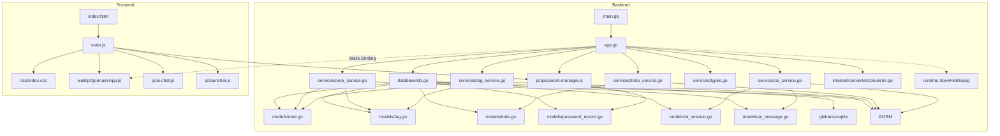

# Jot 项目分析报告

> 项目类型: 桌面端卡片式笔记应用（类小米笔记）
> 技术栈: Wails v2 + Go + GORM + SQLite + 原生 HTML/CSS/JS + CodeMirror 6（编辑器）+ einocli 薄适配层（eino 库驱动，OpenAI 兼容）

---

## 一、目录结构梳理

```
jot/                                    # 项目根目录
├── main.go                             # 【入口文件】Wails 应用启动入口，配置窗口/资源/绑定
├── app.go                              # 【核心文件】Wails 绑定层，暴露 95+ 个 Go API 给前端
├── go.mod                              # Go 模块定义，声明依赖版本
├── go.sum                              # Go 依赖锁文件
├── wails.json                          # Wails 项目配置（名称/构建脚本/作者）
├── AGENTS.md                           # 本报告文件
│
├── internal/                           # 【内部包】Go 子包统一目录
│   ├── converter/
│   │   └── converter.go               # markitdown 封装：办公文件转 Markdown（7 种格式 + 60s 超时）
│   ├── markitdown/                     # 从 Go module cache 克隆的 markitdown 库本地副本（含 PDFium Stdout/Stderr Discard 修复）
│   ├── database/
│   │   ├── db.go                       # SQLite 初始化（glebarez/sqlite 纯 Go 驱动）+ WAL 模式 + 优化 PRAGMA + DefaultDBPath() 路径函数 + blank import 注册 sqlite-vec 扩展
│   │   ├── builtin_profiles.go         # 内置 API 预设服务商定义（DeepSeek/智谱 GLM/Ollama/Agnes 等 12 个），InitDB 时按 Name 去重增量插入
│   │   └── builtin_mcp_servers.go      # 内置 MCP 服务器定义（Tavily/AnySearch/知乎/Context7 等），InitDB 时按 Name 去重增量插入
│   ├── fontutil/
│   │   └── fonts_windows.go           # EnumFontFamiliesW API 封装
│   ├── models/
│   │   ├── note.go                     # Note 实体（笔记）
│   │   ├── tag.go                      # Tag 实体（标签）
│   │   ├── setting.go                  # Setting 实体（KV 配置）
│   │   ├── password_record.go          # PasswordRecord 实体（密码管理：name/username/password/url/note + GORM 软删除）
│   │   ├── ai_session.go              # AI 会话实体（标题/置顶/时间戳）
│   │   │   ├── ai_session_config.go      # AI 会话操作栏配置实体（模型/深度思考/搜索源/卡片召回（含指定笔记本）/笔记引用/技能，与 AISession 一对一关联）
│   │   ├── ai_message.go              # AI 消息实体（角色/内容/思维链，外键关联 SessionID）
│   │   ├── api_profile.go             # API 配置预设实体（名称/服务商/URL/Key）
│   │   │   ├── ai_prompt.go               # AI 提示词实体（技能提示词数据库存储）
│   │   │   ├── todo.go                    # Todo 实体（待办/文本/完成状态/时间戳）
│   │   │   └── note_vector.go             # NoteVector 实体（笔记切块向量索引：块文本/向量BLOB/维度/模型，按 note_id+chunk_index 索引）
│   └── services/
│       ├── note_service.go             # 笔记 CRUD + 搜索 + 置顶 + 回收站 + 统计 + 导入导出 + VACUUM 瘦身 + GetAllIDs
│       ├── tag_service.go              # 标签管理 + 笔记标签关联 + 标签计数
│       ├── setting_service.go          # 配置读写
│       ├── ai_service.go               # AI 业务层（einocli 客户端，OpenAI 兼容 + 流式输出 + 深度思考 + 会话持久化 CRUD + 会话配置持久化 + 消息管理 + Token 后端计算 + 会话 Token 持久化 + 技能提示词查询）
│       ├── todo_service.go             # 待办 CRUD（创建/列表/切换完成/删除/编辑/按状态批量删除 DeleteUnfinished/DeleteCompleted/DeleteAll）
│       ├── profile_service.go          # API 配置预设 CRUD + 切换/激活
│       ├── crypto.go                   # 敏感密钥 Base64 编码/解码工具（(zk) 前缀标识）
│       ├── password_service.go         # 密码管理 CRUD + 搜索（escapeLike + 四列 LIKE ESCAPE 转义）+ 批量删除
│   │   │   ├── recall_service.go           # 召回结果类型与合并/截断工具（RecallCard/CardRecallResult/MergeRecallCards/Truncate*Preview；关键词召回已移除）
│       ├── notebook_service.go         # 笔记本 CRUD
│       ├── vector_service.go           # 笔记向量索引（IndexNotes 切块量化/GetIndexStatus/Count*/DeleteAllVectors）+ sqlite-vec 函数式向量召回 VectorRecall（SQL 内余弦距离 + 笔记本过滤 + 相邻块补充）
│       ├── chunk.go                    # 文档切块（600 rune 上限 + 元数据前缀注入（标题/标签/创建时间）+ 段落聚合 + 多级标题栈 1-6 级 + 标题块合并 + 空节丢弃 + 围栏代码块保护 + 块首父级链补全）
│   │   │   ├── types.go                    # 通用类型（PaginatedResult, DataStats, ImportResult, SettingsConfig, RecallNotebookIDs 等）
│
├── frontend/                           # 【前端目录】Wails 前端（Vanilla + Vite）
│   ├── index.html                      # 入口 HTML，10 个视图 + 关于浮层
│   ├── package.json                    # 前端依赖（Vite 3.x + CM6 ~16 包 + marked + highlight.js + @codemirror/lang-* 6 包 + @codemirror/legacy-modes）
│   ├── src/
│   │   ├── main.js                     # 【核心文件】前端逻辑（CM6 集成 + 搜索弹窗 + MD 语法页面 + AI 对话 + TOC + 回到顶部 + 批量管理 + 设置统一重构 + 锁屏密码 + 标签管理 + 导航切换；数据管理页/回收站页/常量工具函数/通知类/密码管理/启动器/待办清单已拆分为独立模块）
│   │   ├── js/                         # 【JS 模块目录】
│   │   │   ├── cm6-syntax-highlight.js # CM6 通用语法高亮模块（13 套配色 + 46+ 语言解析器映射 + 围栏代码块嵌套解析 mdCodeLanguages + 行内代码标记插件 markdownInlineCodePlugin）
│   │   │   ├── editor-actions/        # 编辑器操作菜单分组模块目录
│   │   │   │   ├── format.js          # 格式化操作项（JSON/XML/HTML/CSS/JS/SQL/CSV/YAML/TOML 各含格式化+压缩 + SQL 辅助函数 compactSQL/convertSQLCase）
│   │   │   │   ├── text-transform.js  # 文本转换操作项（7 项）
│   │   │   │   ├── text-clean.js      # 文本清理操作项（5 项）
│   │   │   │   ├── encode-decode.js   # 编码解码操作项（6 项）
│   │   │   │   └── md-syntax.js       # MD 语法插入操作项（22 项，type: 'insert' 模式）
│   │   │   ├── editor-actions.js      # 编辑器操作菜单模块（聚合导入各分组模块 + 菜单渲染/交互/执行引擎，main.js import 引入）
│   │   │   ├── data-management.js      # 数据管理页面模块（10 个函数 + reloadSettings，从 main.js 提取）
│   │   │   ├── trash-page.js           # 回收站页面模块（6 个函数，从 main.js 提取）
│   │   │   ├── ai-chat.js              # AI 对话模块（自实现聊天引擎 + 流式输出 + Markdown 渲染 + 多会话管理 + 侧栏折叠 + 多来源搜索 + 卡片召回（含笔记本选择菜单）+ 引用笔记 + 上传文件 + 拖拽上传 + 更多技能 + 双语言翻译方向组件 + 语言选择浮层 + 技能激活时禁用更多技能按钮 + 用户消息编辑/删除/重新发送 + 会话统一菜单（置顶/重命名/导出/删除）+ 分块渲染 + Token 显示 + 提示词迁移 + 会话切换一次性渲染+同步滚动消除跳跃 + 会话配置持久化同步 + 替换消息操作统一后端原子方法 + 分页懒加载消息）
│   │   │   ├── constants.js            # 图标常量 SVGS + 工具函数（formatTime/highlightText/getSummary/debounce，从 main.js 提取）
│   │   │   ├── notification.js         # NotificationManager 通知类 + window.showNotification 全局函数 + 模拟数据（getMockNotes/getMockTags，从 main.js 提取）
│   │   │   ├── launcher.js             # 启动器模块（Ctrl+P 全局浮层 / 13 项功能导航 / pinyin-pro 三路拼音匹配 / 3 列网格 / 键盘四方向导航 / 弹性动画）
│   │   │   ├── password-manager.js     # 密码管理模块（完整 CRUD / 搜索 / 批量操作 / 右键菜单 / 复制/打开链接 / Base64 编码 / 搜索高亮 / 静默渲染 + pmLoadSeq 防乱序 + 密码生成器 + 强度算法）
│   │   │   ├── calendar.js             # 笔记日历模块（日历网格渲染 / 墨水圆点统计 / 本月摘要统计 / 按日笔记列表 / 回到今天 / 点击笔记跳转 / 切月自动重置今天）
│   │   │   └── preview-worker.js       # Web Worker 离线程 Markdown 渲染（从 src/ 移入）
│   │   └── css/                        # 【CSS 模块化目录】原 style.css + app.css 拆分
│   │       ├── index.css               # 入口文件，@import 引入所有子文件（设计系统 → 组件）
│   │       ├── variables.css           # 11 主题 CSS 变量：`--bg`/`--accent`/`--text-primary` 等
│   │       ├── reset.css               # 全局 reset（box-sizing/body 边距/overscroll-behavior）
│   │       ├── scrollbar.css           # 统一滚动条 6px 细条 + 自动隐藏 + 透明轨道 + 主题变量联动（含主内容区/搜索/AI 对话消息列表）
│   │       ├── animations.css          # 28 个 keyframes + 通用工具类 `.anim-*` + stagger 延迟
│   │       └── components/
│   │           ├── topbar.css          # 顶栏（品牌/搜索框/窗口控制按钮/更多菜单含图标）
│   │           ├── main-content.css    # 主内容区布局（卡片网格/视图容器/滚动）
│   │           ├── sidebar.css         # 笔记本侧边栏三段式设计 + 折叠按钮
│   │   │   │   ├── editor.css          # 编辑器面板/CM6 主题/全屏/预览/代码块复制按钮（含 AI 消息代码块）
│   │           ├── dropdowns.css       # 右键菜单/更多菜单/下拉选择器
│   │           ├── modals.css          # 通用模态框/确认弹窗/覆盖层/快捷键页面样式（shortcut-row flex 水平布局）
│   │           ├── settings-panel.css  # 设置页分段控件/滑块/开关/按钮
│   │           ├── search-modal.css    # 搜索弹窗/结果列表/高亮
│   │           ├── data-view.css       # 数据管理页分类导航（左侧导航 + 右侧面板切换动画）+ 信笺统计 + 操作卡片
│   │           ├── md-reference.css    # MD 语法手册卡片源码/预览双栏对照
│   │   │   │   ├── ai-chat.css         # AI 对话页面（气泡/输入区/Markdown 渲染/打字指示器/会话侧栏/折叠按钮/滚动条自动隐藏/消息居中响应式宽度 clamp(800px,92vw,1600px)/32px 间距/更多技能菜单选中态+离场动画+翻译chip双语言布局/联网搜索 toggle 开关+召回笔记本菜单）
│   │           ├── todo.css            # 待办清单页面（FAB 浮动输入 + 两段式新增动画 + 行内编辑 + 保存涟漪 + 悬浮预览 Tooltip + 分类感知清空 + 8 个 @keyframes）
│   │           ├── launcher.css        # 启动器样式（全屏遮罩 + 3 列网格 + 卡片 + 弹性动画 + prefers-reduced-motion 降级）
│   │           ├── password-manager.css # 密码管理页样式（三栏布局 + hover accent 竖条 + 搜索高亮 + 批量操作栏 + 空状态 + 密码生成器对话框）
│   │           └── calendar.css        # 笔记日历视图样式（日历网格/墨水圆点/统计卡片/笔记列表/入场动画）
│   ├── wailsjs/                        # Wails 自动生成的 JS 绑定
│   │   └── go/main/
│   │       ├── App.js                  # 后端 API 的 JS 封装
│   │       ├── App.d.ts               # TypeScript 类型定义
│   │       └── models.ts              # Go 模型的 TS 类型
│   └── dist/                           # Vite 构建产物（前端编译输出）
│
└── .trae/specs/                        # 项目 Spec 文档目录
```

### 目录规范评价

| 维度 | 评价 |
|------|------|
| **分层清晰度** | 优秀。严格按 `models → services → database → app` 分层，前端后端隔离清晰 |
| **命名规范** | 良好。目录名使用复数形式（models/services），符合 Go 社区惯例 |
| **冗余目录** | 无。每个目录职责单一，无多余层级 |
| **待改进** | 无（frontend/dist 已在 .gitignore 中） |

---

## 二、核心功能模块识别

### 2.1 基础支撑模块

| 模块名称 | 核心功能 | 对应文件 | 核心依赖 |
|----------|----------|----------|----------|
| **数据库初始化模块** | SQLite 连接建立、连接池配置、AutoMigrate、blank import 注册 sqlite-vec 扩展 | `database/db.go` | glebarez/sqlite, GORM, modernc.org/sqlite/vec |
| **数据模型层** | Note/Tag/Setting/PasswordRecord/AISession/AIMessage/APIProfile/AIPrompt/AISessionConfig/Todo/NoteVector 实体定义、GORM tag 映射 | `models/note.go`, `models/tag.go`, `models/setting.go`, `models/password_record.go`, `models/ai_session.go`, `models/ai_message.go`, `models/api_profile.go`, `models/ai_prompt.go`, `models/ai_session_config.go`, `models/todo.go`, `models/note_vector.go` | GORM |
| **通用类型** | 分页返回格式、统计数据、导入导出结构 | `services/types.go` | 无外部依赖 |
| **Wails 绑定层** | Go API → JS Bridge，95+ 个绑定方法，含 runtime.SaveFileDialog | `app.go` | Wails v2 binding + runtime |
| **前端构建** | Vite 打包、Wails dev 热重载 | `frontend/package.json`, `wails.json` | Vite 3.x（保留，未移除）|
| **前端构建流程** | `wails build` 自动执行 `npm run build`（Vite）→ `frontend/dist/`，再嵌入 Go 二进制 | `go:embed all:frontend/dist` | 前端构建和后端编译都由 `wails build` 一条命令完成 |
| **字体枚举** | Windows GDI EnumFontFamiliesW 系统字体枚举 | `fontutil/fonts_windows.go` | gdi32.dll / user32.dll (syscall) |
| **配置存储** | KV 结构配置读写（字体偏好等） | `services/setting_service.go` | GORM |
| **内置 MCP 服务器** | 内置 MCP 服务器模板（Tavily/AnySearch/知乎三服务/Context7），InitDB 时按 Name 去重增量插入 | `database/builtin_mcp_servers.go` | GORM |
| **路径工具** | `~/.jot` 根目录统一解析（data/backup/images/logs/mcp 五个子目录），数据库默认路径 `~/.jot/data/jot.db` | `internal/config/config.go:JotHomeDir()/SubDir()`，`database/db.go:DefaultDBPath()` | `os.UserHomeDir()` |
| **办公文件转换器** | 封装 markitdown 库，将 .docx/.pdf/.xlsx 等 7 种办公文件转为 Markdown 文本，带 60s 超时保护 | `internal/converter/converter.go` | github.com/conductor-oss/markitdown

### 2.2 业务核心模块

| 模块名称 | 核心功能 | 对应代码 | 核心输入 | 核心输出 |
|----------|----------|----------|----------|----------|
| **锁屏密码** | SHA-256 哈希验证 + 设置/修改密码 | `app.go:VerifyScreenLockPassword/SetScreenLockPassword` | 密码明文 | bool/错误 |
| **密码管理** | 完整 CRUD + 搜索 + 批量删除 + 右键菜单 + 复制/打开链接 + 搜索高亮 + Base64 编码（`(zk)` 前缀）+ 列表/详情分离传输（列表不含密码字段）+ 密码生成器（前端随机生成 + 强度评级 + 批量复制）| `services/password_service.go` + `app.go`（7 个绑定）+ `frontend/src/js/password-manager.js` | 名称/用户名/密码/URL/备注 | 密码记录 CRUD 结果 |
| **笔记 CRUD** | 创建/更新/查询/删除笔记 | `services/note_service.go` | 标题/内容/颜色/ID | Note 对象/错误 |
| **笔记搜索** | 标题+内容 LIKE 模糊搜索，支持 3 种排序（updated_at/created_at/title，均 pinned DESC 优先）| `note_service.go:Search()` | 关键词/分页/sortBy 参数 | 笔记列表+总数 |
| **笔记置顶** | 切换置顶状态 | `note_service.go:TogglePin()` | 笔记 ID | 更新后的笔记 |
| **回收站** | 软删除/查看/恢复/永久删除 | `note_service.go:Delete/GetTrash/Restore/PermanentDelete` | 笔记 ID | 操作结果 |
| **批量回收站操作** | 全部恢复/全部清空 | `note_service.go:RestoreAll/EmptyTrash` | — | 操作结果 |
| **标签管理** | 标签 CRUD | `services/tag_service.go` | 名称/颜色/ID | Tag 对象 |
| **笔记标签关联** | 为笔记添加/移除标签 | `tag_service.go:AddTagToNote/RemoveTagFromNote` | 笔记ID+标签ID | 操作结果 |
| **按标签筛选** | 通过标签 ID 查询笔记 | `note_service.go:GetByTag()` | 标签ID/分页参数 | 笔记列表+总数 |
| **数据统计** | 统计笔记总数/回收站数/标签数 | `note_service.go:GetStats()` + `tag_service.go:Count()` | — | DataStats 对象 |
| **数据导出为 .db** | 导出为 SQLite 数据库文件（VACUUM INTO + fs.CopyEx）| `app.go:ExportDataWithDialog()` | — | "导出成功" 提示 |
| **数据导入** | 从 JSON 文件导入笔记（跳过同名） | `note_service.go:ImportFromJSON()` | JSON 字节数组 | ImportResult 对象 |
| **前端卡片渲染** | 卡片网格展示 | `frontend/src/main.js` | 笔记数据数组 | DOM 渲染 |
| **前端编辑器** | 笔记编辑模态框（CM6 编辑器，支持行号/撤销重做/查找替换/Tab缩进/自动补全/自动闭合括号/Markdown 语法高亮） | `frontend/src/main.js` | 笔记数据/用户输入 | 保存/取消 |
| **前端查找替换** | CM6 search panel，Ctrl+F 查找 / Ctrl+H 查找替换，选中内容自动填充搜索框，预览模式自动切回编辑模式搜索 | `frontend/src/main.js:handleKeyboardNavigation()` | 搜索关键词 | 搜索面板匹配导航 |
| **前端搜索交互** | 搜索弹窗 200ms 防抖自动搜索，支持标题/内容/标签（多标签 AND 语义过滤）、笔记本/日期/排序筛选器（排序 3 选项：更新时间/创建时间/名称，均 pinned 优先） | `frontend/src/main.js` | 关键词 + 过滤条件 + sortBy | 搜索弹窗结果列表 |
| **笔记日历视图** | 日历导航（上/下月切换） + 创建时间墨水圆点统计（1/2-5/6+ 三档） + 按日笔记列表 + 点击笔记原地打开编辑器查看模式 | `frontend/src/js/calendar.js` + `frontend/src/css/components/calendar.css` + `services/note_service.go:GetByDate/GetMonthCounts` + `app.go:GetNotesByDate/GetMonthNoteCounts` | 年月参数/日期字符串 | 按月统计 map / 按日笔记列表 |
| **前端导航切换** | 网格/搜索/设置/数据管理/回收站/AI 助手视图切换 | `frontend/src/main.js:switchView()` | 视图名称 | 视图 DOM 切换 |
| **前端右键菜单** | 右键弹出菜单（查看/编辑/置顶/删除） | `frontend/src/main.js` | 鼠标事件+笔记ID | 菜单显示/操作 |
| **前端只读查看** | 左击笔记打开只读查看器 | `frontend/src/main.js:openEditor()` | 笔记 ID | 只读查看模态框 |
| **编辑器操作菜单** | 顶栏「操作」按钮下拉菜单，配置驱动操作注册表（EDITOR_ACTIONS 数组按分组拆分到 `frontend/src/js/editor-actions/` 模块，主文件聚合导入），当前含 5 个分组：格式化（JSON/XML/HTML/CSS/JS/SQL/CSV/YAML/TOML 各含格式化+压缩，SQL 另有关键字大小写共 18 项）、文本转换（大写/小写/首字母大写/驼峰式/蛇形式/行反转/字符反转 7 项）、文本清理（去除多余空格/去除空行/行尾空格清理/Tab↔空格 5 项）、编码解码（Base64/URL/HTML 各含编码+解码 6 项）、MD 语法（22 项，`type: 'insert'` 插入模式：有选中包裹选中文本、无选中在光标处插入样板）。支持选中文本或全文处理 + Ctrl+Z 撤销 + 查看模式隐藏 + 预览模式隐藏。无 subGroup 的项直接铺平在分组下，有 subGroup 的渲染为嵌套子菜单。 | `frontend/src/js/editor-actions.js` + `frontend/src/js/editor-actions/*.js` + `frontend/src/main.js`（import + els 注册 + window.cmEditor 暴露） | 选中文本或全文 | 格式化/转换/清理/编码解码/MD 样板结果 |
| **标签搜索** | 点击标签 chip 打开搜索弹窗并预选该标签筛选器 | `frontend/src/main.js:searchByTag()` | 标签 ID | 搜索弹窗结果列表 |
| **键盘快捷键** | Ctrl+F 编辑器搜索 / Ctrl+H 编辑器查找替换 / Ctrl+N 新建 / Ctrl+L 编辑器切换模式 / Ctrl+P 启动器菜单 / PgUp/PgDn 滚动 / Ctrl+Home/End / Ctrl+0 锁屏 | `frontend/src/main.js:handleKeyboardNavigation()` | 键盘事件 | 对应操作 |
| **版本号信息** | 返回 verman.V.GitVersion 纯版本号 | `app.go:GetVersion()` | — | 版本字符串 |
| **打开外链** | 调用 runtime.BrowserOpenURL 在默认浏览器打开链接 | `app.go:OpenProjectURL()` | URL 字符串 | — |
| **打开数据目录** | 在文件管理器中打开 `~/.jot/data/` | `app.go:OpenDataDir()` | — | explorer 文件管理器 |
| **一键备份** | 备份当前库到 `~/.jot/backup/jot-backup.db`（覆盖）| `app.go:BackupToDir()` | — | 备份成功提示 |
| **一键还原** | 从 `jot-backup.db` 还原并刷新笔记/标签/统计 | `app.go:RestoreFromDir()` | — | Toast 提示结果 |
| **外观设置** | 字体族下拉选择（搜索+键盘导航）+ 字体大小滑条（10-32px 实时预览）+ 主题选择（11 种）+ 主题预览迷你 UI 卡片 | `frontend/src/main.js:loadFontSettings/applyFontFamily/applyFontSize` + `loadThemeSetting` | 字体名称/大小/主题名称 | 更新 CSS 变量 |
| **AI 对话** | einocli 薄适配层（eino 库）驱动 OpenAI 兼容流式对话（自实现聊天引擎 + Markdown/代码高亮渲染 + 多会话管理/置顶/重命名/导出/统一菜单 + 引用笔记 + 上传文件 + 更多技能 + 双语翻译 + 用户消息编辑/删除/重新发送 + 用户消息 Meta Chip（引用/文件/技能可视化）+ 大消息截断折叠 + Agent 工具（内置工具 + MCP 工具 + 工具级开关）+ ask_user 反问机制 + 联网搜索（MCP 驱动，含内置服务器 Tavily/AnySearch/知乎/Context7）+ 卡片召回（sqlite-vec 向量召回）+ 对话摘要持久化 + Token 显示 + 后端统一上下文注入 + 分页懒加载消息 + 会话自动恢复 + MCP 连接池与预热 + 输入区自适应 + 三栏合并（引用/技能/文件）） | `services/ai_service.go`+ `einocli/` + `internal/agent/` + `internal/mcpserver/` + `frontend/src/js/ai-chat.js`+ `frontend/src/css/components/ai-chat.css` | 用户消息 | AI 流式回复 |
| **向量召回** | 笔记切块向量化（`chunk.go` 标题链拼接 + `IndexNotes` 先删后插幂等量化）后由 sqlite-vec 函数式检索——`vec_distance_cosine` SQL 内余弦距离 + `vec_f32` 解析 query 向量 JSON，`dist < 1.0` 过滤 + 距离升序 TopN；支持指定笔记本（JOIN notes 过滤）或全部笔记；命中块补充前后各 1 相邻块并按笔记合并卡片（召回块完整注入，已去掉单卡截断，由 ai_card_recall_limit 控制总量）；embedClient/模型未配置或当前模型无向量数据时静默跳过 | `services/vector_service.go:VectorRecall` + `services/chunk.go` + `models/note_vector.go` | 用户问题 query + 可选笔记本 ID 列表 | CardRecallResult（FormattedText 注入 system message + Cards 前端展示） |
| **AI 配置管理** | Base URL/API Key/Model 的读写 + 连通性测试 + 模型列表获取 | `app.go:GetAIConfig/SaveAIConfig/TestBaseURL/FetchAIModels` | 配置项 | 配置/测试结果 |
| **统一通知系统** | NotificationManager 单例类，右上角浮动通知，4 种类型 + undo 撤销 | `frontend/src/js/notification.js` | 消息/类型/回调 | 通知 DOM 创建与自动销毁 |

### 2.3 模块分层图

```
┌─────────────────────────────────────────────────────┐
│                    Frontend                          │
│  (main.js / css/index.css / index.html)               │
│   ├─ 视图渲染 (卡片/搜索/设置/数据管理/回收站/AI/MD 语法/日历/待办/密码管理)     │
│   ├─ 交互逻辑 (事件绑定/状态管理)                      │
│   └─ Wails Bridge (window.go.main.App.*)              │
└────────────────────────┬────────────────────────────┘
                         │ Wails Binding (JSON 序列化)
┌────────────────────────▼────────────────────────────┐
│              App 层 (app.go)                         │
│  95+ 个绑定方法（CRUD/搜索/置顶/回收站/统计/导入导出/路径/│
│    AI 配置/会话管理/消息管理/笔记本回收站/配置文件预设)    │
│  (含 runtime.SaveFileDialog 原生对话框调用)            │
└────────────────────────┬────────────────────────────┘
                         │
              ┌──────────┼──────────┐
              ▼          ▼          ▼
    ┌─────────────┐ ┌──────────┐ ┌──────────────┐ ┌──────────────┐ ┌──────────────┐
    │ NoteService │ │TagService│ │  TodoService │ │PwService     │ │  AI Service  │
    │ (CRUD/搜索/ │ │(CRUD/关联)│ │ (CRUD/切换   │ │(CRUD/搜索/   │ │ (AI 流式对话 │
    │  置顶/回收站 │ │          │ │  完成/删除   │ │  批量删除    │ │  会话管理    │
    │  统计/导入   │ │          │ │  按状态清空) │ │  编码/搜索   │ │  消息持久化) │
    │  导出)      │ │          │ │              │ │  高亮)       │ │              │
    └──────┬──────┘ └─────┬────┘ └──────┬───────┘ └──────┬───────┘ └──────┬───────┘
           │              │             │                │                │
           └──────┬───────┴──────┬──────┴──────┬─────────┴──────┬─────────┘
                  │              │             │                │
                  ▼              ▼             ▼                ▼
        ┌─────────────────┐ ┌──────────┐ ┌─────────────────┐ ┌─────────────────┐
        │    GORM ORM     │ │GORM ORM │ │   GORM ORM     │ │   GORM ORM     │
        │ (数据访问层)      │ │(待办层)  │ │ (密码管理层)    │ │ (AI 模型层)     │
        └────────┬────────┘ └────┬─────┘ └────────┬────────┘ └────────┬────────┘
                 │               │                 │
                 └───────────────┴─────────────────┘
                                    ▼
                          ┌─────────────────┐
                          │     SQLite      │
                          │ (glebarez/sqlite│
                          │  纯 Go 驱动)     │
                          └─────────────────┘
```

---

## 三、模块间依赖关系分析

### 3.1 依赖关系详表

| 依赖方 | 被依赖方 | 依赖类型 | 依赖详情 |
|--------|----------|----------|----------|
| `app.go` | `database` | 编译依赖 | 调用 `database.InitDB()` 获取 `*gorm.DB` 实例 |
| `app.go` | `services` | 编译依赖 | 创建 `NoteService` / `TagService` / `TodoService` / `PasswordService` / `SettingService` 实例 |
| `app.go` | `models` | 编译依赖 | 返回 `*models.Note` / `*models.Tag` / `*models.Todo` / `*models.PasswordRecord` / `*models.Setting` 类型 |
| `app.go` | `runtime` | 编译依赖 | `runtime.SaveFileDialog` 原生保存对话框 |
| `app.go` | `fontutil` | 编译依赖 | `fontutil.GetFonts()` 枚举系统字体 |
| `services` | `models` | 编译依赖 | 操作 Note/Tag/Todo/Setting/AISession/AIMessage 结构体 |
| `services` | GORM | 编译依赖 | `*gorm.DB` 数据库操作 |
| `database` | `models` | 编译依赖 | `AutoMigrate(&models.Note{}, &models.Tag{}, &models.Todo{}, &models.PasswordRecord{}, &models.Setting{}, &models.AISession{}, &models.AIMessage{})` |
| `database` | glebarez/sqlite | 编译依赖 | 纯 Go SQLite 驱动 |
| `fontutil` | gdi32/user32 | 运行时依赖 | syscall 调用 Windows GDI API |
| `frontend/main.js` | `wailsjs/go/main/App.js` | 运行时调用 | `window.go.main.App.*` 调用后端 API |
| `frontend/wailsjs` | `app.go` | 构建时生成 | `wails generate module` 自动生成 |

### 3.2 依赖关系图（Mermaid）


```mermaid
graph TD
    subgraph Backend
        A[main.go] --> B[app.go]
        B --> C[database/db.go]
        B --> D[services/note_service.go]
        B --> E[services/tag_service.go]
        B --> TD[services/todo_service.go]
        B --> PW[services/password_service.go]
        B --> F[services/types.go]
        B --> AI[services/ai_service.go]
        B --> CV[internal/converter/converter.go]
        C --> G[models/note.go]
        C --> H[models/tag.go]
        C --> TD2[models/todo.go]
        C --> PR[models/password_record.go]
        C --> I[models/ai_session.go]
        C --> J[models/ai_message.go]
        D --> G
        D --> H
        E --> G
        E --> H
        TD --> TD2
        PW --> PR
        AI --> I
        AI --> J
        C --> K[glebarez/sqlite]
        D --> L[GORM]
        E --> L
        TD --> L
        AI --> L
        B -.-> M[runtime.SaveFileDialog]
    end

    subgraph Frontend
        N[index.html] --> O[main.js]
        O --> P[css/index.css]
        O --> Q[wailsjs/go/main/App.js]
        O --> R[js/ai-chat.js]
        O --> LA[js/launcher.js]
        O --> PW[js/password-manager.js]
    end

    B -.->|Wails Binding| Q
```

### 3.3 依赖问题分析

| 问题类型 | 描述 | 严重程度 |
|----------|------|----------|
| **循环依赖** | 无。所有依赖为单向 `main → app → services → models`，无循环 | ✅ 无问题 |
| **过度依赖** | 无。每个 Service 仅依赖 `*gorm.DB` 和自身模型 | ✅ 无问题 |
| **依赖缺失** | 无。`go.sum` 中所有传递依赖完整 | ✅ 无问题 |
| **隐式依赖** | 前端 `window.go` 对象依赖 Wails 运行时注入，本地开发/独立预览时不可用 | ⚠️ 有降级处理（Mock 数据） |
| **编译期依赖 vs 运行时依赖** | `wailsjs/` 目录需在修改 `app.go` 后重新生成 | ⚠️ 需手动执行 `wails generate module` |

---

## 四、设计模式与实现逻辑

### 4.1 设计模式识别

| 模式名称 | 应用位置 | 说明 | 代码示例 |
|----------|----------|------|----------|
| **Service Layer 模式** | `services/` 包 | 将业务逻辑从 controller（app.go）中抽离，封装为独立 Service 结构体 | `NoteService` / `TagService` |
| **依赖注入 (DI)** | `app.go` | Service 依赖的 `*gorm.DB` 通过构造函数注入 | `NewNoteService(db)` / `NewTagService(db)` |
| **Repository 模式** | `services/` 包内嵌 GORM | Service 内部直接使用 GORM 作为数据访问层 | `s.db.Create()` / `s.db.Where()` |
| **单例模式 (应用级)** | App 结构体 | Wails 运行时保证 App 实例唯一 | `NewApp()` 在 `main()` 中仅调用一次 |
| **MVC 变体** | 整体架构 | Model(models) - View(frontend) - Controller(app.go + services) 分层 | 见分层图 |
| **降级策略 (Fallback)** | `frontend/main.js` | 后端未绑定时自动使用 Mock 数据 | `if (!window.go.main.App.GetNotes) { state.notes = getMockNotes(); }` |
| **Wails Runtime 集成** | `app.go` | 通过 runtime 包调用原生桌面功能 | `runtime.SaveFileDialog()` 弹出系统保存对话框 |

### 4.2 核心业务逻辑流程

#### 4.2.1 笔记创建流程

```
用户点击 "+" 按钮 / Ctrl+N
  → openEditor(null)          // 打开空编辑器模态框
    → 用户填写标题/内容/选择颜色/选择标签
    → 点击"保存"按钮
      → createNote()
        → 前端校验（标题不为空）
        → window.go.main.App.CreateNote(title, content, color)
          → app.go:CreateNote()
            → noteService.Create()          // GORM db.Create(&note)
            → 返回 *models.Note（含 id）
          → 遍历 selectedTags
            → window.go.main.App.AddTagToNote(note.id, tagId)
              → tagService.AddTagToNote()   // GORM Association("Tags").Append
        → closeEditor()                     // 关闭模态框
        → loadNotes()                       // 重新加载笔记列表
          → GetNotes(1, 100)                // 分页查询
          → renderCardGrid()                // 渲染右侧卡片网格
```

#### 4.2.2 笔记搜索流程

```
Ctrl+F / Ctrl+K → 打开搜索弹窗
  → els.searchModalInput 自动聚焦
  → 用户输入文字 → 200ms 防抖
    → searchModalLoadPage(1, false)
```

...（中间流程不变）

---

## 五、技术栈评估

### 5.1 技术栈清单

| 层级 | 技术 | 版本 | 用途 |
|------|------|------|------|
| **桌面框架** | Wails v2 | v2.9.2 | 桌面窗口 + Go ↔ JS Bridge |
| **后端语言** | Go | go1.22+ | 后端业务逻辑 |
| **数据库** | SQLite | — | 本地数据存储 |
| **数据库驱动** | glebarez/sqlite | v1.11 | 纯 Go SQLite 驱动（无 CGO） |
| **向量检索** | sqlite-vec（modernc.org/sqlite/vec） | v0.1.9 | SQL 内余弦距离 vec_distance_cosine / vec_f32，函数式用法（非 vec0 虚拟表），blank import 自动注册 |
| **ORM** | GORM | v1.25 | 对象关系映射 |
| **前端构建** | Vite | v3.2.11 | 前端打包工具 |
| **前端技术** | 原生 HTML/CSS/JS | — | UI 渲染 |
| **编辑器** | CodeMirror 6 | @codemirror/view v6.26 | 笔记编辑器 |
| **Markdown 解析** | marked | v12.0 | Markdown → HTML 渲染 |
| **代码高亮** | highlight.js | v11.10 | 代码块语法高亮 |
| **Mermaid 图表** | mermaid | v11.4 | Markdown 代码块图表渲染（mermaid/render 子路径） |
| **拼音搜索** | pinyin-pro | v3.29.3 | 启动器三路拼音匹配（全拼/首字母/中文原文） |
| **AI 对话** | einocli 薄适配层（eino 库） | github.com/cloudwego/eino v0.9.13 + eino-ext（components/model/openai v0.1.13 + libs/acl/openai v0.1.17，底层 github.com/meguminnnnnnnnn/go-openai v0.1.2） | 流式对话/深度思考/多会话/联网搜索/卡片召回 |
| **本地存储** | localStorage | — | UI 状态持久化（主题/侧栏状态等） |

### 5.2 技术栈选型评价

| 评价维度 | 说明 |
|----------|------|
| **合理性** | Wails v2 适合桌面端 Go 应用，原生 HTML/CSS/JS 避免前端框架学习成本 |
| **性能** | SQLite + GORM 组合满足本地笔记应用性能需求，流式输出不阻塞 UI |
| **维护性** | 前后端分层清晰，CSS 模块化拆分降低维护成本 |
| **可扩展性** | 新增功能只需添加 binding 方法和前端模块，架构本身无限制 |
| **风险** | Wails v2 社区较小，Wails v3 路线图不明确，长期维护可能受限 |

### 5.3 版本兼容性问题

| 问题 | 说明 |
|------|------|
| **Wails 版本锁定** | `go.mod` 中 `wails.io v2.9.2` 已固定，`wails/v2` 包需与 Wails CLI 版本匹配。升级需同步更新 CLI, go.mod, wails.json 三方 |
| **GORM AutoMigrate** | 新增模型（如 AISession/AIMessage）后需在 `database/db.go` 的 `AutoMigrate` 中注册，否则表不会自动创建 |

---

## 六、补充分析

### 6.1 扩展性评估

| 扩展方向 | 可行性 | 建议 |
|----------|--------|------|
| **多用户/云端同步** | 低 | 如需云端同步，建议引入 WebDAV/第三方同步库 |
| **AI 功能扩展** | 高 | 当前 AI 会话架构（Session + Message 模型）天然支持多会话切换和上下文管理，易于扩展。新增方法直接注册 binding 到 app.go 即可 |
| **国际化 (i18n)** | 中 | 所有 UI 文本硬编码在 HTML/JS 中，需统一抽离 |
| **插件系统** | 低 | 原生 HTML 架构不适合动态加载插件 |

### 6.2 性能关键点

| 关键点 | 现状 | 评估 |
|--------|------|------|
| **数据库查询** | GORM + SQLite，分页查询 | ✅ 满足笔记本规模 |
| **前端渲染** | 卡片网格渲染 | ✅ 性能良好 |
| **AI 流式输出** | 基于 Wails Events 逐块推送，不阻塞 UI | ✅ 体验优秀 |
| **CM6 编辑器** | 仅初始化当前编辑的笔记 | ✅ 性能良好 |
| **多会话切换** | 切换时从后端加载对应会话的消息，采用一次性同步渲染（无 yield）+ 同步滚动（`scroll-behavior: auto` 临时禁用），浏览器只绘制一次最终状态，彻底消除视觉跳跃。后端 `LoadAISessionMessagesPaginated` 在返回前端前已截断 `RecallCards`/`SearchSources` 的 Content 为 200 字，减小 Wails 桥传输量和 DOM 渲染开销 | ✅ 切换瞬间完成，无任何中间状态闪烁 |
| **操作按钮折叠测量** | `collapseActionsIfNeeded()` 支持 `sync` 同步模式，在 `switchSession()` 中使用同步测量避免布局抖动 | ✅ 消除消息"跳跃"问题 |

### 6.3 异常处理分析

| 异常场景 | 处理方式 |
|----------|----------|
| **后端 API 不可用** | 前端 Mock 数据降级 |
| **AI API 调用失败** | HTTP 状态码封装为 11 种分类中文提示（auth_error/rate_limit/server_error 等），通过 `ai:stream-error` 事件以 JSON 格式（`{category, user_msg, raw}`）传递到前端，解析后通过 `showNotification()` 右上角通知展示，不再插入对话流中 |
| **联网搜索失败** | 每个搜索来源独立发射错误事件 `ai:search-error`，不影响其他来源继续搜索；前端通过 `showNotification()` 提示用户 |
| **数据库损坏** | 备份还原机制 |
| **办公文件转换失败** | 60s 超时保护 + `Warnw` 日志记录大文件/损坏文件，`Errorw` 记录转换异常；前端通过 `showImportResults()` 逐个显示文件错误详情 |
| **流式连接中断** | 前端监听 `ai:stream-error` 事件，显示错误提示 |
| **会话/消息查询失败** | 返回空列表 + 控制台错误日志，不阻断 UI |

### 6.4 安全分析

| 风险点 | 评估 |
|--------|------|
| **本地数据库** | SQLite 文件本地存储，无远程访问风险 |
| **API Key 存储** | Base64 编码存储在 DB 中，带 `(zk)` 前缀标识，前端读写均为解码后明文。仅防肉眼查看，非真实加密 |
| **XSS 风险** | AI 回复经 `marked.parse()` 渲染，`marked` 默认 Sanitize |

### 6.5 数据库优化

| 优化项 | 配置 | 说明 |
|--------|------|------|
| **WAL 模式** | `PRAGMA journal_mode=WAL` | 允许并发读取，写入不阻塞读取，显著提升多线程场景性能 |
| **busy_timeout** | `PRAGMA busy_timeout=5000` | 忙等待超时 5 秒，避免 "database is locked" 错误 |
| **synchronous** | `PRAGMA synchronous=NORMAL` | WAL 模式下 NORMAL 级别安全且性能比 FULL 快得多 |
| **cache_size** | `PRAGMA cache_size=-8000` | 8MB 页面缓存（负值表示 KB 单位） |
- 初始化位置：`internal/database/db.go` 的 `InitDB()` 函数中，`SetMaxOpenConns(1)` 之后
- PRAGMA 执行失败不影响初始化流程（忽略错误），由调用方统一处理错误日志
- 导入/还原场景需清理 WAL 残留文件（`-wal`/`-shm`），防止旧文件干扰新数据库，清理逻辑在 `app.go` 的 `replaceDatabase()` 函数中

---

## 七、项目核心特点

### 核心设计理念

1. **Wails v2 跨平台桌面应用**：Go + 原生前端（HTML/CSS/JS）架构，兼顾后端性能和前端灵活性

2. **CodeMirror 6 编辑器集成**：主流 Markdown 编辑器引擎，支持行号/撤销重做/查找替换/Tab缩进/自动补全/语法高亮（13 套配色 + 46+ 语言）

3. **CSS 变量主题系统（11 主题）**：全局 CSS 变量联动（`--bg`/`--accent`/`--border` 等），一键切换 11 套系统主题 + 13 套代码高亮主题，所有组件自动适配。2026-07 完成配色全面重构——每套主题重新设计 `--bg`/`--card-bg`/`--bg-secondary` 等核心颜色值，E 护眼/深色/浅色等主题彻底重做，共修改 ~140 个变量

4. **三步交互范式**：笔记本（容器）→ 笔记卡片（列表）→ 编辑器（操作），符合直觉的文件夹-文件-编辑结构

5. **AI 对话引擎（einocli 薄适配层 + eino 库）**：基于 eino（components/model/openai）实现 OpenAI 兼容统一接口，通过 einocli 薄适配层对外暴露，支持 DeepSeek、通义千问等兼容端点（已移除 Ollama 原生协议）。流式输出 + Markdown 渲染 + 代码高亮 + 思维链折叠 + 多会话管理 + 侧栏折叠 + 多来源联网搜索（Tavily/知乎/全网搜索，含全选/全取消开关）+ 卡片召回（含笔记本选择菜单）+ 引用笔记 + 更多技能 + 用户消息编辑/删除/重新发送 + Token 统计 + **后端统一上下文注入**。API 连接通过设置页预设管理配置与持久化。

6. **统一的通知系统**：NotificationManager 单例，右上角浮动通知，支持 success/error/warning/info 四种类型 + undo 撤销

7. **过度动画与交互反馈**：28 个 keyframes、stagger 延迟、hover 分层反馈、spring 弹性缓动、骨架屏 shimmer、分段滑块弹簧曲线（`cubic-bezier(0.34, 1.2, 0.64, 1)`）、字体滑条实时预览

8. **无 UI 框架依赖**：无 Vue/React/Svelte，纯手写 DOM 操作，极致轻量

9. **Mermaid 图表渲染集成**：为 Markdown 代码块中的 `language-mermaid` 块提供按需渲染，默认显示源码，点击渲染按钮后直接主线程渲染 SVG。切换按钮与复制按钮风格统一，CSS `:has()` 处理双按钮防碰撞

10. **密码管理功能页**：独立视图，Base64 编码（`(zk)` 前缀）+ 列表/详情分离传输（列表不含密码字段，仅详情返回明文）+ 7 个 Wails 绑定 + escapeLike LIKE 转义防注入 + 静默重渲染（`.pm-no-enter` 跳过入场动画）+ pmLoadSeq 代际计数器防乱序 + 搜索高亮 + 右键菜单 + 批量操作 + 复制/打开链接 + **密码生成器**（前端 `crypto.getRandomValues` 安全随机 + 评级上限+长度阶梯强度算法 + 对话框配置长度/数量/字符类型 + 逐条/批量复制）

11. **启动器（Launcher）Ctrl+P 拼音搜索**：全屏浮层 3 列网格导航，pinyin-pro 懒计算 + Map 缓存拼音索引，三路降级匹配（中文原文 → 全拼 → 首字母），空格压缩支持分词输入，13 个功能项覆盖全部视图入口，四方向键盘导航 + 弹性动画 + prefers-reduced-motion 降级。

### 设计系统

- **尺寸**：`--radius-md`(8px) / `--radius-sm`(6px)，全局统一
- **间距**：4px 基线网格，组件内部 8-16px，布局 16-24px
- **阴影**：4 层 Token — `elevated`(卡片) / `dropdown`(下拉菜单) / `modal`(模态框) / `toast`(通知)
- **语义色**：`--success`(绿) / `--warning`(黄) / `--error`(红) / `--info`(蓝)
- **字体**：全局统一 `var(--font-family)`，编辑器和代码块跟随系统设置
- **滚动条**：6px 细条，`--scrollbar-thumb` / `--scrollbar-thumb-hover` 联动 11 主题
- **圆角一致性**：所有交互元素（按钮/卡片/输入框/下拉菜单/模态框）均使用 `var(--radius-sm)` 或 `var(--radius-md)`，无硬编码

---

## 九、关键记忆点

1. **Wails v2 事件驱动流式输出**：AI 回复流式数据传输使用 `runtime.EventsEmit`（Go 端）+ `EventsOn`（前端），Go 端 `bufio.Reader` 逐行解析 SSE `data: {...}` 流，通过回调（`onChunk`/`onThinking`/`onDone`/`onError`）逐块推送。前端在 `onSend()` 中动态注册一次性事件回调（`Array.from` 包裹闭包捕获局部变量），每个请求各自独立的 `streamingContent`/`streamingEl`/`lastReasoningEl` 局部变量隔离，防止多消息冲突

2. **思维链折叠**：深度思考模型返回 `delta.reasoning_content`，Go 端在 `streamChoice.Delta` 中解析此字段，通过 `onThinking` 回调和 `ai:stream-thinking` 事件推送。前端创建 `<details class="ai-thinking">` 可折叠区域（summary + 内容），首次 thinking chunk 懒创建，后续流式追加，`addMessage()` 也接受 `reasoningContent` 参数用于显式渲染

3. **AI 消息持久化 + 后端原子替换 + 消息懒加载（会话消息全链路）**：`AISession`+`AIMessage` GORM 模型（`ai_session.go`/`ai_message.go`），`SaveAIMessages()` 保存一轮对话并自动生成标题（取首条用户消息前 30 字），`LoadAISessionMessages()` 按 `CreatedAt` 升序返回历史，`ClearAISessionMessages()` 清空会话。**后端原子替换**：编辑/删除/重发/重新生成四操作的 DB 写入合并为后端 `ReplaceAISessionMessages(sessionID, messages)` 单次调用（GORM Transaction 保证清空+写入原子性，前端 `chatHistory` 为空时 fallback 到 ClearAISessionMessages）。**懒加载 + 上下文自取**：`CallAIAgentStream` 仅接收 userText 和元数据，后端自行从 DB 加载全部历史构建上下文；`LoadAISessionMessagesPaginated` 分页加载（游标 `beforeID` 默认 6 条 ASC）；编辑/重发/再生用基于 `msgID` 的 `TruncateAISessionAfterMessage` 截断、删除用 `DeleteAIMessage`（仅删单条）；Token 显示改后端 `SumSessionTokens`+`GetSessionContextTokens`；`stream-done` 事件 9 参数（含 userMsgID/assistantMsgID）。详见 [ai_service.go](internal/services/ai_service.go)、[app.go](app.go)、[ai-chat.js](frontend/src/js/ai-chat.js)

4. **AI 对话侧栏 + 折叠机制**：左右分栏布局（`.ai-chat-layout`），左侧 `.ai-session-sidebar`（220px），右侧 `.ai-chat-content` flex:1。折叠按钮（`.ai-sidebar-toggle`）为 14×44px 纤细条状，置于侧栏外作为兄弟元素，通过兄弟选择器 `~` 控制 `left` 定位（展开时 220px、折叠时 0）。展开时按钮左侧加 `border-left: 1px solid var(--border)` 延续分割感。折叠状态 `localStorage` 持久化，CSS `transition: width 0.25s ease` 动画。SVG Chevron 图标（Lucide 风格）替代 Unicode 字符

5. **`onAIChatViewActivated` 惰性加载**：仅在 `activeSessionId === null`（无活跃会话）时自动加载第一个会话，视图切换不重置当前会话状态，避免切换回来后消息错乱。`switchSession()` 按 `msg.role` 遍历渲染，`Message` 结构体含 `ReasoningContent` 字段

6. **消息渲染与气泡**：`addMessage()` 创建消息气泡 DOM，AI 侧使用 `marked.parse()` 渲染 Markdown（含 `hljs.highlightElement()` 代码高亮），用户侧以 `<pre class="ai-user-msg">` 转义纯文本。打字指示器内嵌到 `msg-content` 内部（不独立建气泡）

7. **联网搜索（MCP 迁移后）**：内置 Tavily/知乎多源搜索已整体移除（含 `web_search`/`refine_search_query` 工具与 `search_service.go`/`zhihu_search_service.go`/`query_refiner.go`）。Agent 的联网能力由 MCP 服务器工具提供（`mcp_{服务器名}_{工具名}`，装配见 agent.go 的 MCPServerDB 分支）；搜索结果以工具返回文本进入正文。**搜索来源面板展示已移除**（历史消息不再解析 `search_sources`，`LoadAISessionMessagesPaginated` 置空该字段，DB 数据保留）；**召回卡片展示保留**（`recall_notes` 本地检索经 `ai:agent-result`/`renderRecallCards` 展示，历史回放同样显示）。

8. **前端 Agent 工具状态展示**：`ai:tool-status` 事件实时展示工具调用状态条（含 MCP 工具，`ActionText` 文案"调用 {服务器} 的 {工具}"）；`ai:ask-user` 反问面板；`ai:agent-result` 回传搜索来源/召回卡片/工具调用链供 `stream-done` 落库与渲染。

9. **切换会话性能优化（分块渲染）**：`switchSession()` 中对大量历史消息采用分块渲染策略（CHUNK_SIZE=5），每块渲染后 `setTimeout` 0ms yield 给浏览器，避免一次性渲染大量 DOM 导致卡顿。移除 `collapseActionsIfNeeded` 同步调用（该函数已删除，不再需要布局抖动补偿）。详见 [ai-chat.js](frontend/src/js/ai-chat.js) `switchSession()`

10. **延迟语法高亮（deferHighlight）**：`renderMarkdown()` 新增 `deferHighlight` 参数，历史消息加载时使用 `deferHighlightBlocks()` 通过 `requestIdleCallback` 渐进式执行 `hljs.highlightElement()`，优先级低于首次渲染，优先保证页面交互。详见 [ai-chat.js](frontend/src/js/ai-chat.js)

11. **重置出厂设置修复集**：①`resetDatabase()` 清空 `#aiChatMessages.innerHTML` 和 `#aiSessionList.innerHTML` 避免旧数据残留；②`onAIChatViewActivated()` 中清除标题/contextSize/chatHistory/sessions/activeSessionId 等模块级变量；③重置后自动调用 `onAIChatViewActivated?.()` 让 AI 助手模块立即进入就绪状态，消除闪烁。详见 [data-management.js](frontend/src/js/data-management.js)、[ai-chat.js](frontend/src/js/ai-chat.js)

12. **全局链接系统浏览器打开**：在 `main.js` 的 `initEventListeners()` 中添加 `document` 级 click 事件委托，拦截所有 `<a>` 标签点击，通过 `e.preventDefault()` + `window.runtime.BrowserOpenURL(href)` 在系统默认浏览器中打开。排除 `#` 锚点链接和 `javascript:` 伪协议。同时移除了 `ai-chat.js` 中 `messagesEl` 级别的区域委托和搜索来源面板中的冗余 `link.addEventListener` 代码。详见 [main.js](frontend/src/main.js#L5131-L5138)

13. **SQLite WAL 模式 + 优化 PRAGMA**：`InitDB()` 中配置 `journal_mode=WAL`、`busy_timeout=5000`、`synchronous=NORMAL`、`cache_size=-8000`。PRAGMA 执行失败不中断初始化，由调用方统一记录日志。`replaceDatabase()` 中清理 `-wal`/`-shm` 残留文件防止导入/还原数据损坏。详见 [db.go](internal/database/db.go)、[app.go](app.go)

14. **基础 System Prompt 三层重构 + 技能注入修复**：将单句硬编码基础 prompt 拆分为包级常量 `baseIdentity`（身份层）、`baseNormsBoundaries`（规范层+边界层）、`baseSystemPrompt`（完整三层，均在 [app.go](app.go)）。修复 `CallAIAgentStream` 中技能激活时跳过全部基础 prompt 的 Bug，改为始终注入规范层+边界层，仅身份层在技能激活时跳过。详见 [app.go](app.go)

15. **启动器网格（Launcher Grid）+ 拼音搜索**：新增 `Ctrl+P` 触发的全屏浮层启动器，13 个功能项 3 列网格布局。**pinyin-pro 拼音搜索**：`import { pinyin } from 'pinyin-pro'`（v3.29.3），懒计算 + Map 缓存拼音索引（`{ full: 全拼连续串, initials: 首字母串 }`），三路降级匹配（中文原文 `includes` → 全拼 `includes` → 首字母 `includes`），输入 `compact = trimmed.replace(/\s+/g, '')` 支持空格分词（如 "s z t" 或 "she zhi" 均命中"设置"）。**ES module 函数暴露**：launcher 调用的操作函数（`toggleSidebar`/`openShortcuts`/`showAbout` 等）需手动 `window.xxx = xxx` 暴露。**离场动画**：`executeAction` 先调 `closeLauncher(callback)` 等 `transitionend` 完成后再执行操作——离场涉及 mask 和 panel 共 4 条过渡属性，`transitionend` 会冒泡 4 次，需 `_closed` 守卫防止重复触发。**键盘导航**：四方向（ArrowUp/Down 按列跳转+首尾循环/ArrowLeft/Right 逐项+Tab 拦截），首次导航 `_selectedIndex === -1` 时直接跳第一项。动画用 `requestAnimationFrame` 双阶段，离场加 300ms `setTimeout` 保底。详见 [launcher.js](frontend/src/js/launcher.js)、[launcher.css](frontend/src/css/components/launcher.css)

16. **markitdown 库本地克隆 + Wails 构建 PDF 转换修复**：将 `github.com/conductor-oss/markitdown` 从 Go module cache 克隆到 `internal/markitdown` 进行本地维护，通过 `go.mod` replace 指令引用。修复 `wails build` 后 PDF 转换失败问题——根因是 Wails GUI 构建缺少有效控制台句柄，wazero 初始化 PDFium WebAssembly 时调用 `GetFileType /dev/stdout` 返回无效句柄错误。修复方案：在 `initPdfiumPool()` 的 `webassembly.Config` 中添加 `Stdout: io.Discard` 和 `Stderr: io.Discard`，避免 wazero 对无效句柄调用 `GetFileType`。详见 [internal/markitdown/converter_pdf_pdfium.go](internal/markitdown/converter_pdf_pdfium.go)、[go.mod](go.mod)

17. **全屏模式顶栏分割线隐藏**：编辑器进入全屏模式（`.editor-panel.fullscreen`）时，通过纯 CSS `:has()` 选择器（`.main-content-area:has(.editor-panel.fullscreen) #topbar`）将顶栏底部 `border-bottom-color` 设为 `transparent`，使顶栏与编辑器面板在视觉上融为一体，无分割线更加宽阔沉浸。利用 topbar 已有的 `transition: border-color 0.3s ease-out` 实现平滑淡出/恢复。零 JS 改动，纯 CSS 实现。详见 [editor.css](frontend/src/css/components/editor.css)

18. **sqlite-vec 函数式向量召回**：卡片召回已从 gse 关键词召回彻底切换为 sqlite-vec 函数式向量召回。`modernc.org/sqlite` 升级 v1.51.0（含 vec 子包 v0.1.9），[db.go](internal/database/db.go) blank import `_ "modernc.org/sqlite/vec"` 注册扩展（sqlite3_auto_extension 自动生效，测试包需自行 import）。[vector_service.go](internal/services/vector_service.go) `VectorRecall`：query 向量 `json.Marshal` 为 JSON 数组字符串，`vec_f32(?)` SQL 内解析；`vec_distance_cosine(embedding, vec_f32(?)) < 1.0` 过滤（dist<1.0 等价 score>0）+ 距离升序 LIMIT TopN；**无条件 JOIN notes 过滤软删除笔记**（回收站笔记不参与召回，全库/指定笔记本行为统一；指定笔记本时 ON 追加 `notebook_id IN ?`；列必须加 `note_vectors.` 前缀防 id 歧义，**JOIN 必须紧跟 FROM、位于 WHERE 之前**，否则运行时报 `near "JOIN": syntax error`）；命中后二次查询该笔记全部块补相邻块（前后各 1）并按笔记合并卡片（单卡 1200 rune 截断）。`recall_service.go` 仅剩类型与合并/截断工具，`cosineSimilarity`（Go 全表扫描）已删，`Float32ToBlob`/`BlobToFloat32` 保留。embedClient/Model 为空或当前模型无向量数据时静默跳过（Debugw 日志）。**向量生命周期**：笔记永久删除（PermanentDelete / EmptyTrash / CleanExpiredTrash）时在 note_service 内联动清理 NoteVector（软删除不动向量，恢复后可直接用）。测试教训：SQL 拼接测试必须完整复刻真实代码顺序，否则测试过但运行时炸。

19. **Agent 内置工具治理（开关黑名单 + 防御加固 + 写操作强制确认 + ask_user 强制调用）**：`ai_agent_tools_disabled` 黑名单（默认全注册）控制全部内置工具注册（注册级过滤，被禁工具模型不可见，注册清单以 [registry.go](internal/agent/registry.go) 为准）；设置页「Agent 工具」下拉多选（英文名+中文说明，关闭浮层汇总 toast）；Rnx.toml `fclint` 任务（lint + validate:html）挂 frontend 的 run_after。**防御加固**：`tools.WrapWithError` 的 `InvokableRun` defer recover（panic 转 fail 回填模型不中断 ReAct 循环）+ web_search 单源 goroutine recover；各工具补 `ctx.Err()` 取消检查；统一文本长度上限（[context.go](internal/agent/tools/context.go) `validateTextLen`：短文本 500 / find 2000 / 正文 20000，按 rune 计）；read_note_section offset/length 整数校验（math.Trunc 防浮点截断）；manage_tag action TrimSpace；read_url `isPrivateHost` SSRF 防护（拒绝 loopback/私网/链路本地含 169.254.169.254/.local/.internal 主机名，不做 DNS 解析）；manage_note `normalizeNoteFileExt` 扩展名校验（纯字母数字 1-10 位，create 空→.md、update 空→保持原值）。**写操作强制确认**：manage_note 的 update/edit/pin/move/add_tag/remove_tag 六动作未携带 `confirm=true` 一律拒绝执行并返回引导文本（正常结果非 error），提示调用 ask_user 向用户确认；app.go【工具使用规范】升级为强制三步（正文说明→ask_user 提问→用户同意后带 confirm=true 执行）。**ask_user 强制调用**：信息模糊/参数不明确/需求不具体、多选项或方案选择、需确认或补充关键信息三类场景必须调用不得省略绕过（app.go 系统提示词 + ask_user 工具 Desc 双通道约束）。详见 [registry.go](internal/agent/registry.go)、[context.go](internal/agent/tools/context.go)、[manage_note.go](internal/agent/tools/manage_note.go)、[ask_user.go](internal/agent/tools/ask_user.go)、[read_url.go](internal/agent/tools/read_url.go)、[read_note_section.go](internal/agent/tools/read_note_section.go)、[manage_tag.go](internal/agent/tools/manage_tag.go)、[app.go](app.go)、[Rnx.toml](Rnx.toml)

20. **manage_note 双模式扩展 + 新工具 read_url / read_note_section + meta.go 描述修正**：manage_note 新增 update（标题/扩展名，非空才更新对应字段）、edit 双模式互斥（find+replace 片段替换可作删除（find 优先精确匹配、空白差异自动归一化兜底，count 指定第几次、replace_all=true 全替换且与 count>1 互斥）/ line_start+line_end 行级替换含末尾追加（行号来自 view/read_note_section 的 line_numbers=true 输出，replace 空串即删行区间，line_start 大于总行数时为末尾追加语义））、file_ext 缺省 .md；read_url 基于 eino-ext URL Loader 抓取网页提取正文按 `ai_web_search_max_chars` 截断（仅放行 http/https、15s 超时、浏览器 UA）；read_note_section 分段续读大笔记（id/offset/length，view 超大截断时给出续读指引，line_numbers=true 输出全局行号）；view/read_note_section 的 line_numbers 行号前缀仅作行级编辑寻址坐标、不属于正文（复制片段用于 find 时不得包含行号）；meta.go Label 修正——工具描述与实际实现必须一致（曾声称有"删除"能力实际没有，已删除虚假描述，教训）。详见 [manage_note.go](internal/agent/tools/manage_note.go)、[read_url.go](internal/agent/tools/read_url.go)、[read_note_section.go](internal/agent/tools/read_note_section.go)、[meta.go](internal/agent/tools/meta.go)

21. **ask_user 同轮续答全链路（会话注册表 + 竞态防御 + 前端交互）**：`AgentService` 会话级实例注册表 `sessions map[uint]*agentSession`（按 AI 会话 ID 保持 Agent 实例，LRU 上限 32），`agentSession` 持 askCh（容量 1 反问答案通道）/askPending/runMu（同会话 run 串行化）/runCancel（会话释放独立取消）/ChatModel 缓存（指纹不变复用）。**同轮机制**：`tools.AskWaiter`（`ClaimAsk` 原子抢占 + `WaitForAnswer` 阻塞）——ask_user 工具 ClaimAsk 成功 → 发射 `ai:ask-user` → 阻塞等待，答案经 `AnswerAskUser(sessionID, answer)` 投递 → 工具返回 → **同一轮 ReAct 循环继续**（AI 消息不结束、答案不落库为新用户消息）；`streamedContent` 累计本轮全部流式正文，反问轮**整轮落库**（问句+续答）与前端气泡一致。**竞态防御**：ClaimAsk 原子抢占防并行 ask_user 多重阻塞挂起；`drainAsk` 排空提交答案同时取消残留的陈旧答案（Run defer + ReleaseSession 均排空）；`ReleaseSession`/`ReleaseAll`（清空/删除会话、rebuildServices 工厂重置）取消等待中 run 并清注册表防僵尸泄漏；Agent 事件统一携带 streamGen（ai:stream-chunk/thinking/tool-status/ask-user）前端按代过滤防串流。**前端**：`agentAskWaiting` 状态、气泡保持流式正文空显示"等待你的回答…"、主输入框禁用并提示"等待你的选择…"（`setAskInputWaiting` placeholder 保存/恢复 + `.ai-ask-waiting` 遮罩）、面板提交走 AnswerAskUser（submitting 防重入、成功才隐藏）、**× 关闭=取消本轮**（复用停止逻辑防悬挂）、停止/错误/完成/清空/重置各路径统一清理、`stream-done` 用 `assistantMsgID`（取消路径=0）区分取消与正常完成**取消不写 chatHistory**（避免幽灵条目/误弹历史记录）。详见 [agent.go](internal/agent/agent.go)、[context.go](internal/agent/tools/context.go)、[ask_user.go](internal/agent/tools/ask_user.go)、[app.go](app.go)、[ai-chat.js](frontend/src/js/ai-chat.js)、[ai-chat.css](frontend/src/css/components/ai-chat.css)

22. **Agent 工具扩展（json 三件套）+ 上下文窗口 20→40**：新增 json_validate/json_format/json_extract（`utils.InferTool` 结构体反射风格，**gjson v1.18.0 提取**——升级为直接依赖，原为传递依赖 v1.14.2；`normalizeGJSONPath` 归一化模型 JSONPath 写法：`$` 前缀、`[n]`→`.n`、`#` 通配符透传；对象/数组返回 `res.Raw` 保留源键序）；注册 registry.go + meta.go 文案（前端开关自动生效零改动）。上下文窗口默认 20→40：`GetContextWindowSize` 兜底 + [db.go](internal/database/db.go) 种子 + **旧库值 20→40 幂等迁移**（InitDefaultSettings 迁移区，该键无 UI 暴露，旧值即种子默认直接升级）。详见 [json_tools.go](internal/agent/tools/json_tools.go)、[registry.go](internal/agent/registry.go)、[meta.go](internal/agent/tools/meta.go)、[ai_service.go](internal/services/ai_service.go)、[db.go](internal/database/db.go)。注：summarize_text 已移除（Agent 自身可直接摘要上下文中的文本，无需额外工具调用）

23. **API 预设调整：移除自动生成默认配置 → 字段改名 is_builtin → 最终移除 is_builtin + 孤儿列清理**：① **移除"无预设时自动创建『默认配置』预设"逻辑**（app.go 启动迁移块 / SaveAllSettings / SaveAIConfig 三处 `CreateProfile("默认配置", ...)` 全删；内置服务商预设 [builtin_profiles.go](internal/database/builtin_profiles.go) 保留照常插入；`profile_service.go` 的 `SetActive` 死代码一并删除）。② **`IsDefault` 字段曾改名为 `IsBuiltin`**（gorm 列 `is_default`→`is_builtin`、JSON tag 同步），`DeleteProfile` 一度加"内置不可删除"拒删、前端按 `p.is_builtin` 隐藏删除按钮、存量库按 Name 补标。③ **最终决定移除 `is_builtin` 字段及全部内置/用户区分逻辑**（用户权衡：判断内置/用户记录无意义，反正重启会重新插入内置服务商）：[api_profile.go](internal/models/api_profile.go) 删 `IsBuiltin` 字段、[profile_service.go](internal/services/profile_service.go) `CreateProfile` 恢复固定三参 + `DeleteProfile` 移除拒删、[builtin_profiles.go](internal/database/builtin_profiles.go) 删补标循环（12 条内置服务商启动插入保留）、[main.js](frontend/src/main.js) 所有预设统一显示删除按钮、[models.ts](frontend/wailsjs/go/models.ts) 删 `is_builtin`。④ **孤儿列清理**（[db.go](internal/database/db.go) `dropAPIProfileOrphanColumns`，AutoMigrate 后、InitBuiltinProfiles 前调用）：`HasColumn` 检查 `is_default`（改名前的旧列）与 `is_builtin`（字段移除后 AutoMigrate 新增列），存在则 `DropColumn`；**幂等无需迁移标记**、失败中止启动。存量 `api_profiles` 8 列 → 6 列（id/name/base_url/api_key/is_active/created_at）。技能提示词（AIPrompt）的 `IsBuiltin` 是另一表功能不受影响。详见 [api_profile.go](internal/models/api_profile.go)、[profile_service.go](internal/services/profile_service.go)、[builtin_profiles.go](internal/database/builtin_profiles.go)、[db.go](internal/database/db.go)、[app.go](app.go)

24. **笔记首页加载优化（移除骨架屏 + notes 表索引 + 加载逻辑调优）**：大库下启动"骨架屏→闪烁→笔记重来"根因三重：① notes 表默认排序 `pinned DESC, updated_at DESC` **无索引** → SQLite 全表 temp 排序（排序记录携带大 content 列）→ GetNotes 变慢、骨架屏被拉长；② `loadNotes` 每次"先清空 cardGrid + 全量 cardEnter 从 opacity:0 重放" → 视觉闪烁；③ 启动链 `loadSettings→loadNotebooks→loadNotes→loadTags` 全串行 → 首屏空白窗口长。修复：[note.go](internal/models/note.go) 加 3 个命名索引（`idx_notes_sort(pinned,updated_at)` 覆盖默认排序 / `idx_notes_notebook_deleted(deleted_at,notebook_id)` 覆盖分页过滤与 `GetNotebookNoteCounts` 全表统计 / `idx_notes_created` 覆盖日历，GORM `priority` 小者在前、AutoMigrate 重启自动补建）；[note_service.go](internal/services/note_service.go) `GetMonthCounts` 由 `strftime` 函数过滤改 `[月初,下月初)` 范围查询走索引（**时区边界**：原按存储字符串匹配月份，新按本地时区，跨时区/改系统时区后统计可能偏移一天）；[main.js](frontend/src/main.js) 移除骨架屏、`loadNotes` 改为**不清空重载** + `renderCardGrid(hadCards ? 'none' : undefined)`（`hadCards = state.notes.length > 0`：首次保留全量入场动画 / 刷新原地替换防闪烁）、`init()` 启动链 `Promise.all` 并行化（loadSettings/loadNotebooks、loadNotes/loadTags，loadNotes 仍严格在 activeNotebookId 兜底之后）；[index.html](frontend/index.html)/[main-content.css](frontend/src/css/components/main-content.css) 删首页骨架屏（编辑器 `editor-skeleton`、AI 引用浮层骨架屏类名独立保留）。

25. **编辑器切换闪烁修复（openEditor/closeEditor 异步竞态 + 标题/预览残留 + 预览 Worker 串扰）**："打开笔记 A 后关闭，再打开笔记 B 先显示 A 内容再变 B"（md 无闪烁、非 md 有闪烁；"标题和内容都是 A"）。根因：openEditor 阶段二 `Promise.all([GetNoteContent, GetAllTags])` 异步续体竞态（**瓶颈常在 GetAllTags IPC，每次打开都触发，与笔记大小无关**）+ closeEditor 200ms 延迟清理无取消（误关新面板/误毁新 CM6）+ 标题/mdRendered 残留（B 不在缓存时不清空标题、清理被跳过时预览残留）+ 预览 Worker 结果无请求标识。修复（[main.js](frontend/src/main.js) + [preview-worker.js](frontend/src/js/preview-worker.js)）：模块级 `editorOpSeq` 代际（openEditor/closeEditor 每次递增，异步续体与 200ms 清理回调校验代际不匹配则放弃/跳过）；阶段一无条件清空 mdRendered/标题/`_lastPreviewContent`；GetNote 分支 DOM 修改加代际检查；updateNote/createNote 保存后仅当仍是本笔记才 closeEditor；预览 `previewRenderSeq` 随 Worker 消息传递、过期结果丢弃。Edge CDP 真实 wails dev + 隔离空库验证 20 轮 txt→txt 切换零残留；localStorage 不含编辑器内容。

26. **AI 消息 Meta Chip 显示（用户引用/上传/技能可视化）**：AIMessage 新增 `Meta` TEXT 字段（JSON 数组，与既有 `SearchSources/RecallCards/ToolCalls` 同模式），存储 `[{type:'ref'|'file'|'skill', id, title/name/label, notebook?, truncated?}]`；用户消息气泡末尾渲染 inline chip（图标+标签+截断角标），assistant/系统侧 LLM 仍只看到纯 `Content`（meta 走独立字段 → 零污染）。**关键 bug 教训**：`addMessage` 是纯 DOM 渲染，调用方需手动 push 到 `chatHistory` buffer——`sendUserText`/`handleResend` 漏掉会导致取消编辑时 `chatHistory.find(m=>m.id===msgId)` 返 undefined、chip 消失且需切会话才恢复。8 项代码审查修复：flex `1→0` 修 chip 换行、`.ai-msg-chip-tag` 新增、`createChipElement` 空 label 跳过、`applyEdit` 重复渲染改 `exitEditModeWithoutRerender`、cancelEdit warn 日志、`userMsgId<=0` 编辑守卫、`parseInt→+msgId||0`、`bindMsgContextMenu._ctxMenuBound` 去重。详见 [ai_message.go](internal/models/ai_message.go)、[ai_service.go](internal/services/ai_service.go)、[app.go](app.go)（`SaveAIMessage` 加 meta 参数 + `UpdateAIMessageMeta` 新绑定）、[ai-chat.js](frontend/src/js/ai-chat.js)、[ai-chat.css](frontend/src/css/components/ai-chat.css)

27. **笔记搜索打分排序 + GORM `Order(gorm.Expr)` 静默丢弃大坑 + LIKE 通配符转义 + 搜索弹窗修复**：Ctrl+F 搜索弹窗按相关性打分排序（[note_service.go](internal/services/note_service.go) `buildSearchSortOrder`：完全相等 50 > 前缀 40 > 标题+内容 30 > 仅标题 25 > 仅内容 10，空关键词回退常规排序；标签/笔记本/时间筛选仅过滤不参与排序）。**关键 bug 教训（GORM v1.31.1）**：`Order()` 的 switch 只处理 `clause.OrderBy`/`clause.OrderByColumn`/`string` 三种类型，传 `gorm.Expr` 会被**静默丢弃**导致查询完全没有 ORDER BY（用户实测"搜『日志』标题命中不排前"的根因）——必须返回 `clause.OrderBy{Expression: clause.Expr{...}}`。**测试假阳性教训**：断言顺序必须打乱插入顺序，否则"按插入顺序返回"也能通过。**通配符转义**：`escapeLike` 转义 `\ % _` + `LIKE ? ESCAPE '\'`，4 处搜索查询统一。另修复搜索弹窗筛选下拉被 `.search-modal-content` `overflow:hidden` 裁剪（改 visible）、placeholder 误导文案（只搜标题/内容改"搜索笔记(标题/内容)..."）。详见 [note_service.go](internal/services/note_service.go)、[note_service_test.go](internal/services/note_service_test.go)、[search-modal.css](frontend/src/css/components/search-modal.css)

28. **MCP 客户端迁移到官方 modelcontextprotocol/go-sdk v1.7.0（替换 mark3labs/mcp-go + eino-ext mcp 组件）**：知乎 MCP SSE 服务器持续发服务端 ping 请求，mcp-go（v0.43/v0.58/v1.0.0-beta.1）的 SSE 客户端均无服务端请求处理分支（不回 pong）导致连接超时，官方 go-sdk 经 jsonrpc2 + ClientSession.handle 内置 ping/cancel 处理器天然解决。[client.go](internal/mcpserver/client.go) 重写：三传输（stdio=CommandTransport / sse=SSEClientTransport / http=StreamableClientTransport）+ `Client.Connect` 自动协议版本协商（含降级到 2024-11-05，`ClientSessionOptions.protocolVersion` 为私有字段无法外部强制）+ **鉴权方案**——go-sdk transport 无 Headers 字段，自定义 http.Client 包装 `headerRoundTripper` 注入请求头（SSE GET/POST 均生效）；**会话生命周期**——`WithCancel` + 手动超时计时器实现握手超时（10s），cancel 移交调用方 Close 时调用（**关键教训**：`defer cancel()` 会终止 SSE 长连接导致 EOF，连接生命周期绑定传入 ctx）。[tools.go](internal/mcpserver/tools.go) 重写：`ListTools`/`CallTool` 替代 `mcpp.GetTools`，`InputSchema`（JSON Schema）→ eino `ParamsOneOf`（无法解析降级无参数），返回格式保持 CallToolResult JSON 序列化兼容。详见 [client.go](internal/mcpserver/client.go)、[tools.go](internal/mcpserver/tools.go)、[go.mod](go.mod)、[ping_test.go](internal/mcpserver/ping_test.go)（手写 SSE 服务器模拟知乎 ping）

29. **全局 MCP 连接池与预热机制（http/sse/stdio 常驻复用，替代每轮重新建连）**：新增 [pool.go](internal/mcpserver/pool.go) `mcpserver.Pool`——按服务器 Name 持有预热会话（全部传输入池，stdio 子进程也常驻）：`Warmup`（enabled 服务器并发 3 槽位预热，**per-name in-flight 信号串行化同名建连**防并发重复拉进程）/`Reconcile`（关闭不在列表的条目 + 预热剩余，设置页任何操作后调用）/`WarmupOne`（发消息兜底：池中无该服务器时现场连接并入池）/`getOrCreate`（配置指纹 `serverFingerprint` 变化自动关旧重连）/`Close`/`CloseAll`；**断线自动重连**——`Session.callTool` 检测连接类错误（ErrConnectionClosed/EOF/session not found）自动 `Connect` 重建一次并重试，Close 后拒绝重连；`Session` 加锁保护 cli 替换（重连与关闭并发安全）。装配接入：agent.go `Deps.MCPPool`，Run 时 http/sse/stdio 统一 `Pool.Session` 命中秒回 + `WarmupOne` 兜底，**移除每轮 OpenSession + defer Close**。app.go 新增绑定 `WarmupMCPServers()`（内部 Reconcile，返回 `WarmupResult` 汇总），`shutdown`/`rebuildServices` 关闭旧池；前端首次进入 AI 助手预热（`mcpWarmupDone` 标志防重复）+ 设置页 toggle/增删改后同步预热，汇总一条通知（成功/复用/失败+原因+工具数）。新增测试：pool_internal_test.go（复用/指纹重连/并发/CloseAll/失败不缓存）、pool_inflight_test.go（预热中发消息等待复用不重复建连）、reconnect_test.go（断线重连/Close 后不重连/Close 幂等）。详见 [pool.go](internal/mcpserver/pool.go)、[tools.go](internal/mcpserver/tools.go)、[agent.go](internal/agent/agent.go)、[app.go](app.go)、[main.js](frontend/src/main.js)（warmupMCPServers 汇总通知）、[ai-chat.js](frontend/src/js/ai-chat.js)（onAIChatViewActivated 首次预热）

30. **搜索弹窗筛选下拉超长截断 + 标签去井号**：Ctrl+F 搜索弹窗四个筛选下拉（笔记本/标签/时间/排序）选择超长内容换行问题（用户实测选长标签名时排序按钮挤到第二行）。根因：`.search-modal-filters` 内四个 `.search-modal-filter` 默认 `min-width: auto`（flex 子项不可收缩到内容以下）+ `flex-wrap: wrap` → 总宽超弹窗 560px 时换行。修复（[search-modal.css](frontend/src/css/components/search-modal.css)）：filters 改 `flex-wrap: nowrap` 强制单行；`.search-modal-filter`/`.search-modal-filter-btn` 加 `min-width: 0` + `flex: 0 1 auto` 允许收缩（**flex 子项省略号生效关键**），按钮 `max-width: 200→160px`；label `flex-shrink: 0` 不收缩；按钮/选项内部 span `overflow: hidden; text-overflow: ellipsis; white-space: nowrap`（`min-width: 0` 是必须的，否则 ellipsis 不生效）；下拉容器固定 `width: 220px`。另标签下拉选项与选中按钮 label 去掉 `#` 前缀（[main.js](frontend/src/main.js) `renderTagFilterDropdown`/`updateTagFilterLabel`，搜索结果项标签 chip 与 AI 引用面板标签保留 `#`）。**验证教训**：前端 CSS/JS 改动必须 `npm run build` 或 wails dev 才生效，直接看旧 dist 产物改什么都没用（用户两次反馈"没用"均为未构建）。

31. **AI 会话持久化对话摘要（窗口 20 条 + 增量更新 + 同步阻塞生成）**：将纯滑动窗口截断（简单丢弃 40 条外消息）升级为**持久化对话摘要**方案。AISession 新增 `SummaryContent`（text）/ `SummaryMsgCount`（int），数据库持久化（[ai_session.go](internal/models/ai_session.go)）。**触发规则**：`diff = 当前总消息数 - SummaryMsgCount`，`diff ≥ 20` 时触发。首次生成（消息 21）取前 1 条，增量更新（消息 41/61...）取上次摘要终点到当前尾部 20 条之前的 20 条消息，合并旧摘要生成新摘要，`SummaryMsgCount` 更新为当前总消息数。**同步阻塞**：摘要在 `truncateAIMessages` 中同步生成（非 goroutine），确保当前轮对话就能用到新摘要，发 `ai:summary-status:generating/done` 事件给前端状态条。**提示词优化**：每条消息截断到 500 字，提示词要求"每条消息 1~2 句话概括，不要大段复制原文"。详见 [ai_service.go](internal/services/ai_service.go)（GenerateSessionSummary + UpdateSessionSummary + buildSummaryPrompt）、[app.go](app.go)（truncateAIMessages 重构）、[ai-chat.js](frontend/src/js/ai-chat.js)（summaryGenerating 状态 + 事件监听）

32. **密码管理功能页（新增完整功能页 + Base64 编码 + 列表/详情分离传输 + 4 问题修复 + 样式打磨 + 头像徽章迭代教训）**：新增独立密码管理视图。后端：`PasswordRecord` 模型（name/username/password/url/note + GORM 软删除）、`PasswordService`（CRUD + Search + BatchDelete）、7 个 Wails 绑定。**列表传输安全分离**：列表接口返回 `PasswordListItem` DTO（仅 ID/名称/用户名/URL），密码不出现在列表中；详情通过 `GetPasswordRecord(id)` 获取解码后明文。**编码方案**：Base64 + `(zk)` 前缀（不是加密，是可逆编码），存量兼容无前缀值原样返回，启动时自动迁移编码。**前端**：三栏等宽布局 + 实时防抖搜索（250ms）+ 搜索高亮 `<mark>` + 添加/编辑对话框（5 字段+必填校验）+ 详情对话框（密码掩码+显隐切换）+ 一键复制（navigator.clipboard+execCommand 降级）+ 打开链接（runtime.BrowserOpenURL）+ 右键菜单（6 项）+ 批量操作模式（全选/浮动操作栏/批量删除）+ 输入长度实时截断 + URL Tooltip 自动避让 + ESC 层级关闭。**4 问题修复**：① Enter 连按守卫；② `pmLoadSeq` 代际计数器防乱序（与 editorOpSeq/previewRenderSeq 同模式）；③ `escapeLike` LIKE 通配符转义（四列统一 `ESCAPE '\'`）；④ 模板残留清理改 createElement。**样式打磨**：静默重渲染（`.pm-no-enter` 跳过入场动画）、hover 左缘 accent 竖条（`scaleY` spring 缓动）、person/link 双 SVG 小图标、URL 剥离协议前缀。**头像徽章迭代教训**：四轮迭代（首字符彩色→钥匙→锁→无图标）最终移除。**并行编辑事故**：同文件并行 SearchReplace 导致常量丢失 `ReferenceError: PM_ICON_KEY`，教训：同一文件多处编辑必须顺序执行。详见 [password_service.go](internal/services/password_service.go)、[password_record.go](internal/models/password_record.go)、[crypto.go](internal/services/crypto.go)、[password-manager.js](frontend/src/js/password-manager.js)、[password-manager.css](frontend/src/css/components/password-manager.css)

33. **待办清单大幅优化（零重渲染 + FAB 输入 + 两段式动画 + 分类感知清空 + 行内编辑 + Tooltip 预览）**：**零重渲染架构**——toggle/delete/add 三个高频操作全部绕过 `loadTodos()` → `innerHTML` 全量重渲染，改为直接操作 DOM（prepend/remove），统计数字用独立 `refreshTodoStats()` 异步更新。**addTodo 两段式动画**：已有条目先 `translateY` 平滑下移 → rAF 中插入新条目并清除 transform，350ms 时序精控防跳动。**toggleTodo 原地切换**："全部"筛选下直接切换类+DOM 移动位置（完成移底部/取消完成移顶部），筛选模式播放 exit 动画后 `item.remove()`。**deleteTodo** 播放动画后 `item.remove()`。**FAB 浮动输入**：右下角 44px 圆形 FAB → 展开 300px 内联面板（textarea+Enter 提交），FAB 旋转 45° 变 "X"，点击外部/Escape 自动收起。**行内编辑**：双击文本进入 textarea 编辑态，Enter 保存/Escape 取消/失焦自动保存，保存后播放 1.2s 涟漪确认动画。**分类感知清空**：单按钮根据当前筛选（active/done/all）动态切换清空范围，后端 `ClearTodosByFilter(filter)` switch 到 `DeleteUnfinished`/`DeleteCompleted`/`DeleteAll`，确认弹窗文案随分类变化。**悬浮 Tooltip**：600ms 防抖后弹出全文预览，基于鼠标位置智能定位。**启动提醒**：`checkUnfinishedTodosReminder()` 异步检测未完成数，支持锁屏延迟弹出。详见 [main.js](frontend/src/main.js)（todo 模块）、[todo.css](frontend/src/css/components/todo.css)（8 个 @keyframes）、[todo_service.go](internal/services/todo_service.go)（DeleteUnfinished/DeleteCompleted/DeleteAll）

34. **Agent 显式规划（create_plan/update_plan + 前端悬浮计划面板）**：后端新增两个规划工具（[plan.go](internal/agent/tools/plan.go)）+ `Context.PlanState` 跨轮次保存 + `GenModelInput` 钩子每轮注入计划状态/进度/ask_user 提醒 + 结果兜底（模型跳过 create_plan 自动补建单步计划、漏调 update_plan 自动补标未完成步骤为 done 并发事件）；前端 `#aiPlanPanel` 输入框上方悬浮可折叠面板（`ai:plan-created`/`ai:plan-updated` 事件），ask_user 反问时互斥收起（方案 B）、回答后恢复，stream-done 移除面板并清空 `streamPlanData` 缓存，历史回放 `renderPlanCard` 气泡内渲染。详见 [agent.go](internal/agent/agent.go)、[plan.go](internal/agent/tools/plan.go)、[context.go](internal/agent/tools/context.go)、[registry.go](internal/agent/registry.go)、[types.go](internal/agent/types.go)、[app.go](app.go)、[ai-chat.js](frontend/src/js/ai-chat.js)、[ai-chat.css](frontend/src/css/components/ai-chat.css)、[index.html](frontend/index.html)

35. **Agent/Plan 模式切换（Session 级 plan_mode + 工具按模式过滤 + 前端切换控件 + 设置页 PlanOnly 禁用展示）**：为 AI 会话新增 Agent/Plan 双模式切换。后端：`AISessionConfig` 新增 `PlanMode bool` 列（默认 false = Agent 模式），`SessionConfig` 读写透传；`ToolMeta` 新增 `PlanOnly bool` 标记仅 Plan 模式可用的工具（`create_plan`/`update_plan`）；`buildTools` 按 `planMode` 过滤计划工具注册；`genPlanHint` 按 `req.PlanMode` 条件注入计划提示；结果兜底逻辑包裹 `PlanMode` 判断。前端：工具栏模型选择器左侧新增边框包裹的 Agent/Plan pill 切换按钮（分割线分隔），切换即时保存 + 通知；设置页 PlanOnly 工具显示禁用样式（灰色 + checkbox disabled + "仅 Plan 模式可用"说明）+ 点击 shake 抖动 + Toast 通知；全选/全不选/统计文案均排除 PlanOnly 工具。详见 [ai_session_config.go](internal/models/ai_session_config.go)、[ai_service.go](internal/services/ai_service.go)、[meta.go](internal/agent/tools/meta.go)、[types.go](internal/agent/types.go)、[registry.go](internal/agent/registry.go)、[agent.go](internal/agent/agent.go)、[app.go](app.go)、[ai-chat.js](frontend/src/js/ai-chat.js)、[main.js](frontend/src/main.js)、[ai-chat.css](frontend/src/css/components/ai-chat.css)、[settings-panel.css](frontend/src/css/components/settings-panel.css)、[TOOLS.md](internal/agent/TOOLS.md)

---

## 记忆点 1：MCP 服务器分享与导入（三格式容错 + 两阶段校验 + 后端解析日志 + 按钮 UI 统一）

| 记忆点 | 内容 |
|--------|------|
| **变更概览** | MCP 服务器配置的分享与批量导入功能：① **分享**——单条分享（列表行"分享"按钮）复制当前服务器为标准 JSON 到剪贴板；批量分享（头部"分享"按钮）复制全部服务器；格式为项目自定义的 `[{name, transport, command, args, env, url, headers, enabled}]` 裸数组。② **导入**——头部"导入"按钮打开导入对话框，输入区为 **CM6 JSON 编辑器**（实时语法高亮，跟随当前代码高亮主题），用户粘贴 JSON 后点"解析导入"，经后端两阶段处理（校验→入库）。③ **按钮 UI 统一**——头部三个按钮（分享/导入/添加）统一 2 字文案 + 同一套 `mcp-server-accent-btn` 样式 + `min-width: 64px` 固定宽度 + `inline-flex` 防文字换行。 |
| **后端两阶段设计（重要）** | [mcp_import.go](internal/services/mcp_import.go)（**新增文件**）提供两个 Wails 绑定：① `ParseMCPServersImport(jsonStr)` ——仅校验不入库（`parseMCPImportInput` + `buildMCPServerFromRaw`），返回 `{OK, Items[]}` 供前端决定是否继续；② `ImportMCPServers(jsonStr)` ——完整流程（解析+校验+逐条入库），返回 `[]ImportMCPServerItem`。前端两阶段调用：先 `ParseMCPServersImport`（校验失败→抖动+通知+保留对话框+编辑器内容），通过后关对话框再 `ImportMCPServers`（入库失败→通知仅列服务器名，详情写 `logs/app.log`）。 |
| **三格式容错 + 字段校验（重要）** | `parseMCPImportInput` 支持三种输入格式：裸数组 `[...]`、`{servers:[...]}` 包装、单个对象 `{name, command, ...}`。空数组 `[]` 返回"未找到任何服务器配置"而非"无法识别"。`buildMCPServerFromRaw` 校验含：name 非空+不含空白/tab/换行（与 `MCPServerService.Save` 一致）、`command`/`url` 不能同时有（transport 推导）、`env`/`headers` KEY 不能含空格/tab/换行/等号（与 Save 一致）、transport 合法性（stdio/sse/http）。所有错误通过 `Errorw` 写入 `logs/app.log`（结构化字段 index/name/reason）。 |
| **warmupMCPServers silent 参数** | `warmupMCPServers` 新增 `options.silent` 参数（[main.js](frontend/src/main.js)）：`silent=true` 时跳过"X 台已就绪"通知（`refreshAgentToolsMeta()` 仍执行）。导入成功路径静默调用，避免"已导入 N 条"和"X 台已就绪"双通知。切换启用/停用、删除、表单保存、AI 助手首次进入路径仍保留通知（用户主动操作需要反馈）。 |
| **前端按钮与样式** | 头部按钮组（[index.html](frontend/index.html) `.mcp-server-head-actions`）：三个 `btn btn-sm mcp-server-accent-btn`（分享/导入/添加），CSS 统一 `min-width: 64px` + `inline-flex` + `white-space: nowrap`。列表行每行新增"分享"按钮（`mcp-server-accent-btn`，闭包捕获行级 `srv`）。头部和行级共用同一套 accent-btn 样式，与"测试/编辑"按钮视觉一致。 |
| **CM6 导入编辑器（新增）** | 输入区从 `<textarea>` 换成 CodeMirror 6 JSON 编辑器（[main.js](frontend/src/main.js) `createMCPImportEditor`）：`json()` 语言 + `getHighlightExtension('.json', codeHighlightTheme)` 跟随代码主题 + `EditorView.lineWrapping` 自动换行 + `placeholder`。**每次打开对话框重建编辑器**（销毁旧实例→新建，读最新主题，避免主题切换后不同步）；关闭对话框时销毁并置空（内容随之清空，等价原 B11 语义）。内容读取改用 `_mcpImportEditor.state.doc.toString().trim()`；校验失败抖动目标改为容器 div（`shakeMCPFormInput(container)`）。 |
| **导入编辑器样式/滚动条** | 容器 `.mcp-server-import-editor`（[settings-panel.css](frontend/src/css/components/settings-panel.css)）固定 `height: 220px` + 边框圆角；内部 `.cm-editor` `height: 100%` + flex 纵向、`.cm-scroller` `overflow: auto` 实现**编辑器内部滚动**（不撑开页面）。**覆盖 editor.css 全局透明滚动条**：`.mcp-server-import-editor .cm-scroller::-webkit-scrollbar-thumb`（WebKit）+ `scrollbar-color: var(--scrollbar-thumb) transparent`（Firefox），避免默认隐藏滑块。 |
| **代码审查修复要点** | B2：名称空白/KEY 特殊字符在校验阶段拦截（与 Save 一致）；B3：`ParseMCPServersImport` 校验通过时 `res.OK = true`；B4：空数组返回友好提示；B5：阶段 2 失败不关对话框+编辑器内容保留；B6：分享全部按钮在缓存为空时现取 `GetMCPServers()`；B7：`shareAllBtn` 用 `_shareAllBound` 标志位防重复绑定；B10：抽 `tryParseInput` 公共函数；B11：导入输入区换 CM6 编辑器，每次打开重建（内容自然为空）、关闭销毁，失败路径保留内容便于改后再导；B12：一致性检查通过（Wails exception 路径走 `mcpErrMsg(e)`，业务中文直传）。 |
| **涉及文件** | [internal/services/mcp_import.go](internal/services/mcp_import.go)（**新增**：parseMCPImportInput/buildMCPServerFromRaw/tryParseInput/rawMCPServer/ParseMCPServersImport/ImportMCPServers）、[internal/models/mcp_server.go](internal/models/mcp_server.go)（新增 ImportMCPServerItem）、[app.go](app.go)（+ImportMCPServers/+ParseMCPServersImport 绑定）、[frontend/src/main.js](frontend/src/main.js)（createMCPImportEditor/openMCPImportDialog/closeMCPImportDialog/handleMCPImport/copyMCPServersShare/buildMCPServersShareJSON + warmupMCPServers silent 参数 + initMCPServerSettings 事件绑定）、[frontend/index.html](frontend/index.html)（头部三按钮组 + 分享行按钮 + 导入对话框 DOM：textarea 换为 CM6 容器 div `#mcpServerImportInput`）、[frontend/src/css/components/settings-panel.css](frontend/src/css/components/settings-panel.css)（头部按钮组 min-width + 导入 CM6 编辑器容器样式与滚动条覆盖） |

---

## 记忆点 2：密码管理功能页（新增完整功能页 + Base64 编码 + 列表/详情分离传输 + 样式打磨 + 4 问题修复 + 头像徽章迭代教训）

| 记忆点 | 内容 |
|--------|------|
| **变更概览** | 新增密码管理功能页（独立视图），完整 CRUD + 搜索 + 批量操作 + 右键菜单 + 复制/打开链接 + 搜索高亮 + 条目样式打磨 + 4 个 bug 修复 + 头像徽章迭代教训。 |
| **后端功能（重要）** | [internal/models/password_record.go](internal/models/password_record.go) 数据模型（name/username/password/url/note + GORM 软删除），[internal/services/password_service.go](internal/services/password_service.go) 业务层（Create/GetPasswordRecord/List/Search/Update/Delete/BatchDelete），[app.go](app.go) 7 个 Wails 绑定。**列表传输安全分离**：列表接口返回 `PasswordListItem` DTO（仅 ID/名称/用户名/URL），**密码字段不出现在列表传输中**，只有通过 `GetPasswordRecord(id)` 获取单条详情时才返回解码后的明文密码。搜索支持 name/username/url/note 四列模糊匹配，使用 `escapeLike` 转义 `\ % _` + `LIKE ? ESCAPE '\\'`。 |
| **编码方案（重要）** | [internal/services/crypto.go](internal/services/crypto.go)：Base64 编码 + `(zk)` 前缀（**不是加密，是可逆编码**，不提供密码学安全性）。存储流程：明文 → `EncodeB64()` → `"(zk)" + Base64(std)` → 写入 SQLite。`DecodeB64()` 读取时 TrimPrefix `(zk)` + Base64 解码。存量兼容：无 `(zk)` 前缀的值原样返回（兼容迁移前明文）。启动时自动扫描 settings/api_profiles 表未编码值执行迁移编码。锁屏密码则用 SHA-256 + 固定盐值单向哈希。 |
| **前端功能清单** | [frontend/src/js/password-manager.js](frontend/src/js/password-manager.js)（~912 行）+ [password-manager.css](frontend/src/css/components/password-manager.css)（~883 行）：三栏等宽布局（名称/用户名/URL）+ 实时防抖搜索（250ms）+ 添加/编辑对话框（5 字段 + 必填校验 + 抖动）+ 详情对话框（密码掩码 + 显隐切换）+ 一键复制（navigator.clipboard + execCommand 降级）+ 打开链接（runtime.BrowserOpenURL）+ 右键菜单（6 项操作）+ 批量操作模式（全选/浮动操作栏/批量删除带确认）+ 输入长度实时截断 + 空状态展示 + URL Tooltip 自动避让 + ESC 层级关闭 + 搜索关键词 `<mark>` 高亮 + 操作后高亮反馈（`.pm-flash` 呼吸动画 0.8s×3=2.4s）。 |
| **静默重渲染 + 4 问题修复（重要）** | ① **静默重渲染**——`renderPmList({ playEnter })` 增加 `.pm-no-enter` 分支跳过逐条入场动画（搜索/编辑保存/状态切换原地刷新不闪烁，仅首次进入视图 `playEnter: true` 播放交错淡入）。② **Enter 连按守卫**——保存动作加进行中标志，防连续回车创建多条。③ **pmLoadSeq 代际计数器**（与 editorOpSeq/previewRenderSeq 同一模式）——响应到达时 `seq !== pmLoadSeq` 丢弃过期结果防乱序覆盖。④ **模板残留清理**——渲染统一 createElement 构建 DOM，不再拼 HTML 模板字符串。 |
| **密码条目样式打磨（保留项）** | **B 信息层级**——`.pm-name` 字号 15px 加重标题；用户名/链接双段 `.pm-meta`（flex + gap 5px）承载 13px 内联 SVG 小图标（PM_ICON_USER person / PM_ICON_LINK link，`.pm-field-icon` 灰调不抢焦点）；URL 展示剥离 `https?://` 协议前缀（hover title 提示完整 URL）。**C hover 竖条**——`.pm-item::before` 左缘 accent 竖条胶囊（left:-1px、宽 3px、圆角 999px），hover 时 `opacity 0→1` + `scaleY(0.3)→1` spring 缓动展开。**11 主题 --shadow-* 分层阴影补齐**——[variables.css](frontend/src/css/variables.css) 各 `[data-theme]` 变量块补齐阴影变量组，教训：新增主题必须带全变量组。 |
| **名称头像徽章迭代教训（方案已废弃，重要）** | 名称区徽章历经四轮迭代最终整体移除：首字符彩色徽章（PM_AVATAR_HUES + pmAvatarHue 哈希）→ 钥匙 PM_ICON_KEY → 锁 lock → 16px 锁视觉突兀 → 13px 仍不满意 → 最终定论"名称不带任何图标"。**SVG 视觉重量陷阱**：16×16 viewBox 图标几乎撑满画布，而 15px 文本数字/字母字面仅约 11px 高，图标必然"比字高一头"。**结论**：行内小图标只适合次级 meta（用户名/链接），主标题保持纯文本最稳。 |
| **并行编辑同文件覆盖事故（关键教训）** | 对同一文件**并行发起两个 SearchReplace** 时，第二次基于最新快照执行覆盖第一次结果——用法代码留存而常量声明丢失 → `ReferenceError: PM_ICON_KEY is not defined`。**教训：同一文件多处编辑必须逐个顺序执行，禁止并行**；完成后再 Read/Grep 校验关键符号完整性。 |
| **涉及文件** | [internal/models/password_record.go](internal/models/password_record.go)、[internal/services/password_service.go](internal/services/password_service.go)（CRUD + escapeLike）、[internal/services/crypto.go](internal/services/crypto.go)（Base64 编解码）、[app.go](app.go)（7 个绑定）、[frontend/src/js/password-manager.js](frontend/src/js/password-manager.js)（renderPmList 静默分支/pm-flash/pmLoadSeq/PM_ICON_USER+PM_ICON_LINK/URL 协议剥离）、[frontend/src/css/components/password-manager.css](frontend/src/css/components/password-manager.css)（.pm-item::before hover 竖条 + .pm-meta/.pm-field-icon/.pm-name）、[frontend/src/css/variables.css](frontend/src/css/variables.css)（11 主题 --shadow-*）、[frontend/index.html](frontend/index.html)（视图 + 对话框 HTML） |

---

## 记忆点 3：启动器重构 + 拼音搜索 + 待办清单大幅优化（零重渲染 + FAB 输入 + 两段式动画 + 分类感知清空）

| 记忆点 | 内容 |
|--------|------|
| **变更概览** | 两大改动：① **启动器（Launcher）全新重构**——从简单菜单升级为 Ctrl+P 全局浮层快捷导航（类 Spotlight/Raycast），4 列网格 + pinyin-pro 三路拼音匹配 + 键盘导航 + 弹性动画；② **待办清单（Todo）大幅优化**——零重渲染架构 + FAB 浮动输入 + 两段式新增动画 + 行内编辑 + 保存涟漪 + 悬浮 Tooltip + 分类感知清空按钮 + 启动未完成提醒。 |
| **启动器拼音搜索（重要）** | [frontend/src/js/launcher.js](frontend/src/js/launcher.js)：`import { pinyin } from 'pinyin-pro'`（v3.29.3），懒计算 + Map 缓存拼音索引（首次查询才生成，`{ full: 全拼连续串, initials: 首字母串 }`）。**三路匹配**：中文原文 `includes` → 全拼 `includes` → 首字母 `includes`，输入 `compact = trimmed.replace(/\s+/g, '')` 支持空格分词（如 "s z t" 或 "she zhi" 均命中"设置"）。搜索仅限 13 个预定义功能项（笔记首页/侧栏控制/批量管理/数据管理/回收站/设置/日历/待办/AI助手/密码管理/快捷键/MD语法/关于），不搜索笔记内容。 |
| **启动器 UI 布局** | 全屏遮罩 + 居中面板 `min(520px, calc(100vw - 48px))` + 顶部 `padding-top: 14vh`，面板内三部分：搜索头部（图标+输入+ESC 提示）、**4 列 CSS Grid**（`grid-template-columns: repeat(4, 1fr)`，JS 键盘导航 `cols = 4` 同步）、空结果提示。卡片纵向 flex：32×32 圆角图标容器（accent 背景）+ 文字标签。四方向键盘导航（ArrowUp/Down 按列跳转+首尾循环/ArrowLeft/Right 逐项+Tab 拦截）。入场：遮罩 fade 0.2s + 面板 scale(0.92)→1 弹性 0.28s + 卡片 stagger 每项 20ms；离场 0.15s + `transitionend` 或 300ms 超时保险。`prefers-reduced-motion: reduce` 降级无动画。每次打开动态更新 sidebar-toggle 项标签/图标。 |
| **待办清单零重渲染架构（重要）** | toggle/delete/add 三个高频操作全部绕过 `loadTodos()` → `innerHTML` 全量重渲染：**addTodo** 直接 `prepend` 新条目 DOM + 两段式动画（已有条目先 `translateY` 下移 → rAF 中插入新条目并清除 transform），不触发 `loadTodos()`；**toggleTodo** 在"全部"筛选下直接原地切换类 + DOM 移动位置（完成移底部/取消完成移顶部），筛选模式下播放 exit 动画后 `item.remove()`；**deleteTodo** 播放 `todo-deleting` 动画后 `item.remove()`。统计数字用独立 `refreshTodoStats()` 异步更新，不重渲染列表。 |
| **FAB 浮动输入 + 行内编辑（重要）** | 右下角 44px 圆形 FAB "+" 按钮 → 点击展开 300px 宽内联面板（textarea 自动扩展 + Enter 提交/Ctrl+Enter 换行），FAB 旋转 45° 变 "X"；点击面板外部/Escape/切换视图自动收起。**双击行内编辑**：双击文本进入 textarea 编辑态，Enter 保存/Escape 取消/失焦自动保存。**保存涟漪**：编辑保存后播放 1.2s `todoSaveSuccess` 动画（缩放→光晕→恢复），确认感极强。 |
| **分类感知清空按钮（重要）** | 单个清空按钮根据当前筛选状态动态切换清空范围：active 筛选 → 清空所有**未完成**；done 筛选 → 清空所有**已完成**；all 筛选 → 清空**全部**。前端 `clearTodosByFilter()` 传递 filter 参数 → 后端 `ClearTodosByFilter(filter)` switch 分发到 `DeleteUnfinished`/`DeleteCompleted`/`DeleteAll` 三个 `DELETE WHERE` 查询。确认弹窗文案随分类动态变化，明确告知清空范围。 |
| **悬浮 Tooltip + 启动提醒** | 鼠标悬停 600ms 防抖后弹出全文预览卡片（基于鼠标位置智能定位，`scale(0.95)→1` 弹入，`pointer-events: none` 防干扰）。启动时 `checkUnfinishedTodosReminder()` 异步检测未完成待办数量，有则弹窗询问"是否去查看"，支持锁屏场景延迟弹出（等 `app-unlocked` 事件）。三态筛选（active/done/all）按钮实时显示数量徽标，选中态卡片背景 + 阴影提升。 |
| **涉及文件** | [frontend/src/js/launcher.js](frontend/src/js/launcher.js)（13 项定义/拼音搜索/键盘导航（`cols = 4`）/开关控制）、[frontend/src/css/components/launcher.css](frontend/src/css/components/launcher.css)（全屏遮罩/面板/4 列网格/卡片/动画）、[frontend/src/main.js](frontend/src/main.js)（initLauncher/Ctrl+P 快捷键/ESC 关闭/todo 模块全部前端逻辑）、[frontend/src/css/components/todo.css](frontend/src/css/components/todo.css)（8 个 @keyframes/条目/FAB/筛选栏/Tooltip 样式）、[frontend/index.html](frontend/index.html)（#viewTodo + .launcher HTML 结构）、[package.json](frontend/package.json)（pinyin-pro 依赖）、[internal/services/todo_service.go](internal/services/todo_service.go)（DeleteUnfinished/DeleteCompleted/DeleteAll） |

---

## 记忆点 4：密码生成器（后端随机密码生成 + zxcvbn 强度检测 + 对话框 UI + ESC 拦截）

| 记忆点 | 内容 |
|--------|------|
| **变更概览** | 在密码管理页面新增「生成密码」按钮，打开独立对话框支持配置密码长度/数量/字符类型/排除易混淆字符，批量生成随机密码并逐条/批量复制。密码生成与强度检测已全部迁移到后端（Wails 绑定），前端仅负责收集选项与渲染结果。后续修复了两个 UI 问题：结果区展开导致对话框整体跳动、详情页强度文字与标签未对齐。 |
| **密码生成实现（后端）** | [internal/services/password_generator.go](internal/services/password_generator.go) `GeneratePasswords(opts)`：基于 `crypto/rand` 密码学安全随机，字符池按四类（upper/lower/digits/symbols）选项拼接，`ExcludeAmbiguous` 时过滤易混淆字符 `lI1O0`，批量生成并逐条调用 `CheckPasswordStrength` 返回强度。Wails 绑定为 `App.GeneratePasswords`（[app.go](app.go)）；前端 [frontend/src/js/password-manager.js](frontend/src/js/password-manager.js) `pmDoGenerate()` 直接调用绑定并渲染结果列表（原前端 `pmGeneratePassword` 已删除）。 |
| **强度算法（zxcvbn + 类型上限）** | 后端 `CheckPasswordStrength` 基于 `zxcvbn`（`github.com/trustelem/zxcvbn`）的猜测次数评分（0-4），叠加字符类型上限修正：纯字符类型（仅数字/仅字母等）最高 2（fair），2 种类型最高 3（good），3/4 种类型不限。**历史**：早期前端曾用熵值法（V1/V2）与"评级上限+长度阶梯+模式惩罚"（V3）方案，后整体替换为 zxcvbn 并迁至后端；详情/编辑对话框的实时强度检测同样走后端 `App.CheckPasswordStrength`。 |
| **对话框 UI 结构** | [frontend/index.html](frontend/index.html) `#pmGenOverlay`：全屏遮罩 + 居中 `.pm-gen-dialog`（覆盖父级 `pmDialogIn` 动画避免缩放抖动）。内部卡片分组：密码长度（步进器±1 + 进度条）、生成数量（步进器±1，范围 1-20）、字符类型（2×2 切换按钮网格 + 排除易混淆复选框）、结果区域（复制全部按钮 + 逐条密码列表含强度圆点+复制按钮）。 |
| **结果区展开动画（最终方案：opacity+transform，禁用 max-height 过渡）** | `#pmGenResultsWrap` 默认收起（`opacity: 0; transform: translateY(6px)`），加 `.open` 类后 `opacity: 1; transform: translateY(0)`，0.22s 淡入上移展开；**禁用 max-height 过渡**——max-height 做展开动画时对话框高度突变会整体跳动/闪烁（第一版 `max-height: 0→330px` 展开已废弃）。**嵌套滚动容器截断教训**：`.pm-dialog`（`overflow: hidden`）+ `.pm-gen-body`（`flex:1` + `overflow-y:auto`，flex 子项高度被剩余空间钳制）+ `.pm-gen-results`（`max-height`）三层叠加时，内层列表最后一条会被裁掉一半（内层不滚动、外层无法滚动）。最终 `.pm-gen-results` 固定 `max-height: 260px` + `overflow-y: auto`（超过 ~6 条内部滚动、每条完整显示），**该 max-height 不可移除**，否则结果列表无限变高撑爆对话框。HTML 移除内联 `display:none` 由 CSS 统一控制。`pmDoGenerate()` 将清空旧列表移到 `await` 之后（与渲染同帧），重新生成时旧结果保留到新结果就绪，消除列表塌陷造成的二次跳动。 |
| **详情页强度行对齐（近期修复）** | 查看详情页强度文字是嵌套在 `.pm-detail-value`（继承 13.44px/line-height 1.6）里的 `.pm-pwd-strength-text`（12px/1.7），父容器行高支柱高于标签（12px/1.7），导致同样 12px 的文字被压低约 1px。修复：`#pmDetailPwdStrength { font-size: 12px; line-height: 1.7; }` 使值容器行盒与标签一致，文字基线自然对齐。 |
| **按钮交互规范** | 所有操作按钮统一 `:active` 回弹效果（`scale(0.95)` + `transition-duration: 0.08s`），包括生成密码按钮、复制全部、单条复制、步进器±按钮。生成密码按钮图标与文字同行（`display: inline-flex; align-items: center; gap: 6px`），非全宽。 |
| **滚动条问题修复** | 对话框 `.pm-gen-body` 和 `.pm-gen-results` 的滚动条需要显式声明完整样式（`scrollbar-width` + `scrollbar-color` + `::-webkit-scrollbar` 四件套），否则在对话框层级内不显示。不能仅依赖全局 `scrollbar.css`，因为对话框的 `overflow` 上下文会隔离滚动条样式。 |
| **ESC 关闭拦截** | 生成器对话框的 ESC 关闭逻辑注册在全局 `pmHandleEscape` 中（遵循 AGENTS.md 规范：ESC 统一在全局处理），优先级在详情对话框之后：先判断 `pmDetailOverlay` → 再判断 `pmGenOverlay`。 |
| **涉及文件** | [frontend/index.html](frontend/index.html)（生成密码按钮 + 对话框 HTML）、[frontend/src/js/password-manager.js](frontend/src/js/password-manager.js)（`pmDoGenerate`/`openPmGenDialog`/`closePmGenDialog`/`pmHandleEscape` 扩展/`pmGenStepper` 事件/强度渲染 `pmRenderStrengthBar`/`pmRenderStrengthText`）、[frontend/src/css/components/password-manager.css](frontend/src/css/components/password-manager.css)（对话框样式/步进器/切换按钮/结果列表/强度圆点/滚动条/`#pmGenResultsWrap` 过渡/`#pmDetailPwdStrength` 对齐）、[internal/services/password_generator.go](internal/services/password_generator.go)（生成与强度算法）、[app.go](app.go)（`GeneratePasswords`/`CheckPasswordStrength` Wails 绑定） |

---

## 记忆点 5：密码列表分页（滚动懒加载 + 复用笔记 page_size + 4 个分页 Bug 修复 + 进入页面滚动到顶部）

| 记忆点 | 内容 |
|--------|------|
| **变更概览** | 密码列表由全量加载改为滚动懒加载分页，分页大小复用笔记首页 `page_size` 设置。后端 `List`/`Search` 加分页参数返回 `PaginatedResult`；前端滚动距底 200px 自动加载下一页，搜索切换关键词自动重置到第 1 页。 |
| **后端分页** | [password_service.go](internal/services/password_service.go) `List(page, pageSize)` / `Search(keyword, page, pageSize)` 改为先 `Count()` 再 `Offset().Limit()` 查询，返回 `*services.PaginatedResult`（复用 [types.go](internal/services/types.go) 既有类型）；[app.go](app.go) `ListPasswordRecords(page, pageSize)` / `SearchPasswordRecords(keyword, page, pageSize)` Wails 绑定签名同步更新。列表与搜索共用同一分页路径，仅多 LIKE 过滤。 |
| **前端分页状态机** | [password-manager.js](frontend/src/js/password-manager.js)：分页状态 `pmCurrentPage/pmTotal/pmHasMore/pmLoadingMore`；`loadMorePmRecords()` 在 `.pm-list-wrap` 滚动距底部 200px 时触发，入口 `if (pmLoadingMore \|\| !pmHasMore) return` 防重入；`renderPmList({append:true})` 追加模式渲染（跳过入场动画、不重置滚动位置）；搜索重置 `pmCurrentPage = 1` 从头加载；`pmPageSize` 读取笔记首页 `page_size` 设置。加载指示器 `#pmLoadingIndicator`（[index.html](frontend/index.html)）+ spinner 样式（[password-manager.css](frontend/src/css/components/password-manager.css)）。 |
| **4 个分页 Bug 修复** | ① `pmLoadingEl.style.display = pmHasMore ? 'none' : 'none'` 死代码（两分支相同）→ 统一 `'none'`；②③ `loadMorePmRecords` 缺少 `pmLoadSeq` 代际防护 → 请求前快照 `seq`，完成后 `if (seq !== pmLoadSeq) return` 丢弃过期响应，同时顺带解决"快速搜索时进行中的 loadMore 结果 concat 进新列表"竞态；④ `validIds` 只过滤当前页 → 全量重载时直接 `pmSelectedIds.clear()`（旧选中项可能不在新列表当前页，防批量选中残留）。 |
| **进入页面滚动到顶部** | 每次进入密码管理页面时 `.pm-list-wrap` 置 `scrollTop = 0` 再加载数据，避免上次浏览位置残留。 |
| **涉及文件** | [internal/services/password_service.go](internal/services/password_service.go)、[app.go](app.go)、[frontend/src/js/password-manager.js](frontend/src/js/password-manager.js)、[frontend/index.html](frontend/index.html)、[frontend/src/css/components/password-manager.css](frontend/src/css/components/password-manager.css) |

---

## 记忆点 6：AI 助手深度研究技能（新增技能 + 迭代次数临时提升 + 移除技能入场动画）

| 记忆点 | 内容 |
|--------|------|
| **变更概览** | 新增「深度研究」AI 技能，突破常规 Agent 运行上限进行深度研究。该技能与其他技能互斥，激活时临时将最大迭代次数提升至 200（若当前设置小于 200）。同时移除了技能菜单项的 stagger 入场/离场动画，简化后续维护。 |
| **后端技能提示词（重要）** | [internal/database/db.go](internal/database/db.go) `InitBuiltinPrompts` 新增 `skill_deep_research`：定义深度研究分析师角色，包含研究流程规范（问题分解→多轮搜索→信息整合→深度分析→报告生成）、工具使用策略（优先本地笔记 recall_notes，不足再联网搜索）、输出格式（研究报告五部分）。 |
| **Agent 迭代次数临时提升（重要）** | [internal/agent/agent.go](internal/agent/agent.go) `Run` 方法读取 `maxIterations` 后，遍历 `req.SkillIDs` 检测 `skill_deep_research`，若当前设置小于 200 则临时提升至 200。**设计决策**：仅在技能激活时提升，不修改全局设置；若用户设置已大于 200 则保持用户设置（不降级）。 |
| **前端技能菜单（重要）** | [frontend/index.html](frontend/index.html) 新增 `data-skill="deep_research"` 菜单项（搜索图标 SVG）；[frontend/src/js/ai-chat.js](frontend/src/js/ai-chat.js) `getSkillLabel` 新增 `case 'deep_research': return '深度研究'`；`renderSkillChips` 新增 `else if (skillId === 'deep_research')` 分支渲染 chip HTML（与内置工具 chip 结构一致）。 |
| **技能 ID 转换流程** | 前端 `activeSkills = { deep_research: true }` → 提交时 `'skill_' + id` → 后端 `skillIds = ["skill_deep_research"]` → `app.go` `GetSkillPrompts(["skill_deep_research"], ...)` 从数据库查询提示词 → 注入 Instruction → Agent 执行时检测技能 ID 临时提升迭代次数。 |
| **移除技能入场动画（简化维护）** | [frontend/src/css/components/ai-chat.css](frontend/src/css/components/ai-chat.css) 移除 `.ai-chat-skills-dropdown .ai-chat-skills-item` 的 `opacity:0/transform:translateX(-8px)/transition` 初始状态、`.open .ai-chat-skills-item` 的状态变化、`.closing .ai-chat-skills-item` 的离场动画、`@keyframes skillsItemOut` 定义、以及所有 `nth-child(1-14)` 的 stagger delay。**动机**：每次新增技能都需要维护 CSS 动画，移除后无需额外处理。 |
| **涉及文件** | [internal/database/db.go](internal/database/db.go)（`InitBuiltinPrompts` 新增 `skill_deep_research`）、[internal/agent/agent.go](internal/agent/agent.go)（`Run` 迭代次数临时提升）、[frontend/index.html](frontend/index.html)（技能菜单项）、[frontend/src/js/ai-chat.js](frontend/src/js/ai-chat.js)（`getSkillLabel` + `renderSkillChips`）、[frontend/src/css/components/ai-chat.css](frontend/src/css/components/ai-chat.css)（移除 stagger 动画） |

---

## 记忆点 7：Agent 显式规划（create_plan/update_plan + 前端悬浮计划面板 + ask_user 互斥）

| 记忆点 | 内容 |
|--------|------|
| **变更概览** | 为 Agent 增加**显式 Planning** 能力：新增 `create_plan` / `update_plan` 两个规划工具，模型先制定结构化执行计划再逐步执行（区别于纯 ReAct 隐式规划）；前端输入框上方新增悬浮计划面板（`#aiPlanPanel`）实时展示计划目标与步骤进度，支持点击标题折叠/展开；与 ask_user 反问面板互斥（方案 B），回答后恢复；完成对话后面板移除并清空缓存。 |
| **后端工具与数据结构** | [context.go](internal/agent/tools/context.go) 新增 `Plan`（Goal/Steps/Current）与 `PlanStep`（ID/Description/ToolName/Status/Result）结构，`Context.PlanState` 跨 ReAct 轮次保存计划状态（与 AskWaiter 同模式）；[plan.go](internal/agent/tools/plan.go)（**新增**）实现 `create_plan`（校验 goal 非空、steps 1-10 条）与 `update_plan`（按 step_id 更新状态/结果，支持 new_step 追加步骤），两工具直接 `ctx.Emit` 发射 `ai:plan-created` / `ai:plan-updated` 事件（沿用 ask_user 的专用事件通道例外，见 TOOLS.md §7.2）；[registry.go](internal/agent/registry.go) + [meta.go](internal/agent/tools/meta.go) 注册，[types.go](internal/agent/types.go) `Result` 新增 `Plan` 字段落库，[app.go](app.go) `ai:agent-result` 事件追加 plan 参数。 |
| **GenModelInput 钩子（每轮注入）** | [agent.go](internal/agent/agent.go) `Run` 装配 `GenModelInput` 回调（eino ADK 钩子，每轮 LLM 调用前触发），`genPlanHint` 按状态注入：① `PlanState == nil`——提示"需要多步操作的请求必须先调用 create_plan，简单闲聊可跳过" + **ask_user 强制提醒**（信息模糊/需求不具体/需用户选择时必须调用 ask_user，严禁把问题直接写在正文当作最终回答）；② 有计划——注入当前进度 `第 N/M 步`、已完成步骤摘要、未完成步骤强制提醒"每执行完一个工具必须调用 update_plan 标记 done，不要在仍有未完成步骤时直接输出最终回答"。 |
| **结果兜底（重要）** | 结果汇总处（最终回答后）自动补全：① 模型创建了计划但漏调 update_plan → 所有 pending/in_progress 步骤自动补标 `done` 并发射 `ai:plan-updated` 让前端同步为全部完成态；② 模型跳过 create_plan 但执行了工具 → 自动补建单步计划（goal 取用户问题前 50 字）。 |
| **前端悬浮面板** | [index.html](frontend/index.html) 新增 `#aiPlanPanel`（与 `#aiAskPanel` 同级，absolute 定位输入框上方 `bottom: calc(100% + 8px)`）；[ai-chat.js](frontend/src/js/ai-chat.js) `ai:plan-created` → `showPlanPanel()` / `ai:plan-updated` → `updatePlanPanel()`（`Object.assign({}, streamPlanData, payload)` **合并而非覆盖**——`ai:plan-updated` 负载不含 goal，直接覆盖会丢标题）；header 点击切换 `is-collapsed` 折叠（CSS `max-height`/`opacity` 过渡动画，无箭头）；`stream-done`/`startStreaming` 移除面板并 `streamPlanData = null` 清缓存；历史回放 `renderPlanCard()` 气泡内渲染。 |
| **ask_user 互斥（方案 B）** | `showAskPanel()` 先 `hidePlanPanel()` 收起计划面板，`hideAskPanel()` 后若仍在流式中且 `streamPlanData` 非空则 `showPlanPanel()` 恢复——两个悬浮面板互斥不重叠，ask_user 阻塞期间计划不推进，收起不影响信息量。 |
| **关键 bug 教训** | ① `streamPlanData`/`streamPlanCardEl` 曾为 `startStreaming` 局部变量 → `hideAskPanel` 访问报 `ReferenceError: streamPlanData is not defined` → **提升为模块级变量**；② 强化计划提示词（"不要在仍有未完成步骤时直接输出最终回答"）与 app.go 的 ask_user 规范（"先在正文写出问题"）叠加冲突 → 模型把问句当最终回答直接输出、不调 ask_user → 提示词追加澄清"必须调用 ask_user 工具发起提问，严禁把问题写在正文里当作最终回答输出"；③ `plan == nil` 分支最初无 ask_user 提醒 → 无计划场景模型不主动反问 → 两个分支都注入 ask_user 提醒；④ stream-done 只移除面板未清 `streamPlanData` → 新对话 ask_user 快结束时 `hideAskPanel` 恢复逻辑误显示旧计划 → 流结束/新流开始两处清空缓存。 |
| **涉及文件** | [internal/agent/tools/plan.go](internal/agent/tools/plan.go)（**新增**：create_plan/update_plan）、[internal/agent/tools/context.go](internal/agent/tools/context.go)（Plan/PlanStep/PlanState）、[internal/agent/registry.go](internal/agent/registry.go) + [internal/agent/tools/meta.go](internal/agent/tools/meta.go)（注册/元信息）、[internal/agent/types.go](internal/agent/types.go)（Result.Plan）、[internal/agent/agent.go](internal/agent/agent.go)（GenModelInput 钩子 + genPlanHint + 结果兜底）、[internal/agent/TOOLS.md](internal/agent/TOOLS.md)（§7.2 规划工具事件 + §9 设计说明）、[app.go](app.go)（ai:agent-result 追加 plan）、[frontend/index.html](frontend/index.html)（#aiPlanPanel）、[frontend/src/js/ai-chat.js](frontend/src/js/ai-chat.js)（showPlanPanel/updatePlanPanel/hidePlanPanel/renderPlanCard + 互斥 + 缓存清理）、[frontend/src/css/components/ai-chat.css](frontend/src/css/components/ai-chat.css)（.ai-plan-panel/.ai-plan-card 系列样式） |

---

## 记忆点 8：Agent/Plan 模式切换（Session 级 plan_mode + 工具过滤 + 前端切换控件 + 设置页禁用展示）

| 记忆点 | 内容 |
|--------|------|
| **变更概览** | 为 AI 会话新增 **Agent / Plan 双模式切换**：Session 配置持久化 `plan_mode` 字段（默认 false = Agent 模式），工具栏模型选择器左侧新增边框包裹的 pill 切换按钮组（Agent / Plan + 分割线），Agent 模式下不注册 `create_plan` / `update_plan` 工具（模型不可见、不会调用），Plan 模式下保持现有规划流程不变。设置页工具列表中 Plan 模式专属工具显示为禁用样式 + 点击抖动通知。 |
| **后端改动** | ① **[ai_session_config.go](internal/models/ai_session_config.go)** `AISessionConfig` 新增 `PlanMode bool` 列（gorm default false）。② **[ai_service.go](internal/services/ai_service.go)** `SessionConfig` 结构体 + `SaveSessionConfig` / `LoadSessionConfig` / `CreateDefaultSessionConfig` 透传 `PlanMode`。③ **[meta.go](internal/agent/tools/meta.go)** `ToolMeta` 新增 `PlanOnly bool` 字段，`create_plan` / `update_plan` 标记 `PlanOnly: true`。④ **[types.go](internal/agent/types.go)** `Request` 新增 `PlanMode bool`，`ToolMeta` 新增 `PlanOnly bool`。⑤ **[registry.go](internal/agent/registry.go)** `buildTools` 新增 `planMode bool` 参数，Agent 模式（`planMode=false`）下跳过 `planOnlyTools` 集合中的工具注册。⑥ **[agent.go](internal/agent/agent.go)** `genPlanHint` 按 `req.PlanMode` 条件注入（Agent 模式跳过）；结果兜底逻辑（计划补建/补标）包裹在 `req.PlanMode` 判断内。⑦ **[app.go](app.go)** `GetAgentTools` 透传 `PlanOnly` 字段；`CallAIAgentStream` 读取 `SessionConfig.PlanMode` 传入 `agent.Request.PlanMode`。 |
| **前端改动** | ① **[index.html](frontend/index.html)** 工具栏模型选择器左侧新增 `#aiModeToggle` 容器（`.ai-mode-toggle` 边框包裹 + 两个 `.ai-mode-btn` 按钮 + `.ai-mode-divider` 分割线）。② **[ai-chat.js](frontend/src/js/ai-chat.js)** 新增 `currentPlanMode` 全局变量 + `syncModeToggle()` + `saveCurrentPlanMode()`（Load→修改→Save）+ 按钮点击事件绑定 + 切换会话/新建会话时同步按钮状态 + `showNotification` 通知。③ **[ai-chat.css](frontend/src/css/components/ai-chat.css)** `.ai-mode-toggle`（`border: 1px solid var(--border); border-radius: 6px; overflow: hidden`）+ `.ai-mode-btn`（无圆角）+ `.ai-mode-btn.active`（accent 背景高亮）+ `.ai-mode-divider`（竖线分割线）。④ **[main.js](frontend/src/main.js)** `createAgentToolRow` 中 PlanOnly 工具：checkbox disabled + `is-plan-only` 类 + 说明文字"仅 Plan 模式可用" + shake 抖动点击事件 + `showNotification`；`toggleSelectAllTools` / `updateSelectAllCheckboxState` / `updateAgentToolsButtonText` 均排除 PlanOnly 工具。⑤ **[settings-panel.css](frontend/src/css/components/settings-panel.css)** `.is-plan-only` 禁用样式 + `.plan-only-hint` + `@keyframes plan-only-shake` 抖动动画。 |
| **TOOLS.md 更新** | [TOOLS.md](internal/agent/TOOLS.md) 新增第 5 步「标记工具的模式约束」：说明 `PlanOnly` 字段的用法（后端跳过注册 + 前端禁用展示），新增/修改 PlanOnly 工具的开发者必读。 |
| **关键设计决策** | ① Agent 模式为默认（`PlanMode=false` 零值），新会话无需显式设置。② `planOnlyTools` 为 registry 包级变量（map），过滤在 disabled 之后、工具列表返回之前，不影响其他工具。③ 前端工具栏按钮复用现有 `.ai-chat-toolbar-btn` 按压回弹动画。④ 设置页全选/全不选/统计文案均排除 PlanOnly 工具，避免 UI 状态不一致。 |
| **涉及文件** | [internal/models/ai_session_config.go](internal/models/ai_session_config.go)、[internal/services/ai_service.go](internal/services/ai_service.go)、[internal/agent/tools/meta.go](internal/agent/tools/meta.go)、[internal/agent/types.go](internal/agent/types.go)、[internal/agent/registry.go](internal/agent/registry.go)、[internal/agent/agent.go](internal/agent/agent.go)、[app.go](app.go)、[frontend/index.html](frontend/index.html)、[frontend/src/js/ai-chat.js](frontend/src/js/ai-chat.js)、[frontend/src/main.js](frontend/src/main.js)、[frontend/src/css/components/ai-chat.css](frontend/src/css/components/ai-chat.css)、[frontend/src/css/components/settings-panel.css](frontend/src/css/components/settings-panel.css)、[internal/agent/TOOLS.md](internal/agent/TOOLS.md) |

---

## 记忆点 9：Plan-and-Exec 解耦（预规划 + 执行分离 + 多 Bug 修复 + UnknownToolsHandler）

| 记忆点 | 内容 |
|--------|------|
| **变更概览** | 将 Plan 模式从"计划与执行在同一 ReAct 循环"重构为 **Plan-and-Exec 分离模式**：先单独调用 LLM 生成结构化计划，再进入 ReAct 循环执行。同时修复了多个长期存在的 Bug，增强了 Agent 健壮性。 |
| **预规划阶段（generatePlan）** | [agent.go](internal/agent/agent.go) 新增 `generatePlan()` 方法——Plan 模式下在 `Run()` 开头先单独调用 LLM：复用 `chatModel.WithTools()` 创建仅绑定 `create_plan` 的新模型实例，非流式 `Generate()` 获取结构化计划，通过 `ParseCreatePlanArgs` 解析 → 设置 `PlanState` + emit `ai:plan-created`。失败时返回 error 终止整个任务（用户看到"计划生成失败"提示）。[plan.go](internal/agent/tools/plan.go) 抽取 `ParseCreatePlanArgs()` 导出函数供 `generatePlan()` 复用。 |
| **执行阶段工具过滤** | [registry.go](internal/agent/registry.go) 新增 `planExecExcluded` 集合（`{"create_plan": true}`）——Plan 模式执行阶段不再注册 `create_plan` 工具，防止模型重复生成计划。`planOnlyTools` 仅保留 `update_plan`。Agent 模式完全不受影响。 |
| **ai:plan-generating 事件** | 后端在调用 `generatePlan()` 前 emit `ai:plan-generating` 事件通知前端"正在制定执行计划..."。前端 [ai-chat.js](frontend/src/js/ai-chat.js) 监听后将打字动画替换为旋转 spinner + 固定文字（`.ai-msg-plan-generating`）。`ai:plan-created` 到达时清空 contentDiv 移除状态文案。[ai-chat.css](frontend/src/css/components/ai-chat.css) 新增 `.plan-gen-spinner` 旋转动画。 |
| **Bug 修复合集** | ① **streamedContent 跨迭代累积**——外层 ReAct 循环开头 `streamedContent = ""` 重置，防止被拒内容通过兜底逻辑泄漏为最终回答；② **非流式路径缺少计划完成检测**——非流式 assistant 消息同样检查 `countPendingSteps`；③ **SkippedPlanUpdate 同轮多工具误触发**——改为按轮次跟踪 `currentIterCalledPlanUpdate` + `currentIterCalledNonPlanTool`，在下一个 assistant 消息到来时结算，消除工具执行时序不确定性；④ **genPlanHint nil 分支**——移除防御性引导文本（"必须先调用 create_plan"），改为返回空串，`GenModelInput` 中新增 `PlanState == nil` 检查直接报错终止。 |
| **UnknownToolsHandler** | [agent.go](internal/agent/agent.go) `ToolsConfig` 新增 `UnknownToolsHandler`——模型幻觉调用不存在工具时，框架返回友好错误提示而非崩溃，模型可自行调整策略继续执行。 |
| **关键设计决策** | ① 预规划失败直接终止任务（不降级到旧模式），因为失败意味着 API 配置或模型能力问题；② `create_plan` 保留用于预规划阶段（`generatePlan` 复用），执行阶段排除；③ 前端事件协议不变（`ai:plan-created`/`ai:plan-updated`），UI 零改动。 |
| **涉及文件** | [agent.go](internal/agent/agent.go)（`generatePlan`/`genPlanHint` 重构/`UnknownToolsHandler`/Bug 修复）、[plan.go](internal/agent/tools/plan.go)（`ParseCreatePlanArgs` 导出）、[registry.go](internal/agent/registry.go)（`planExecExcluded` 过滤）、[ai-chat.js](frontend/src/js/ai-chat.js)（`ai:plan-generating` 监听 + `ai:plan-created` 清理）、[ai-chat.css](frontend/src/css/components/ai-chat.css)（`.plan-gen-spinner` 样式）、[EVENTS.md](internal/agent/EVENTS.md)（新增 §5.0 事件文档） |

---

## 十二、AGENTS.md 维护规范

1. **第 1-12 章反映项目当前状态**，代码发生结构性变化时更新（新增模块/架构重构图/重要功能/文件行数统计等）
2. **记忆点顺序**：编号 1（最旧）→ 10（最新），从上到下按时间升序排列。新增记忆点时严格执行以下三步：
   - **第一步**：删除最旧的条目（即 `记忆点 1`）
   - **第二步**：将剩余条目顺移重新编号（原 2→1、原 3→2、……、原 10→9）
   - **第三步**：在末尾追加新条目作为 `记忆点 10`
3. **上限 10 条**，不得超出。禁止在顶部或中间插入新条目，新条目只追加在末尾
4. **详细的变更记录请写在 `.trae/specs/` 或 `.trae/documents/` 中**，AGENTS.md 仅作为快速参考
5. **更新关键文件统计**时，用 `Measure-Object -Line`（Windows）或 `wc -l`（Linux/macOS）获取实际行数
6. **第 八 章"待优化点"** 中的"已实现"列表仅在重大功能完成时归档，小修改不必追加条目
7. **所有文件引用必须使用相对路径**（从项目根目录开始，如 `frontend/src/js/ai-chat.js`），禁止使用绝对路径（如 `file:///d:/.../frontend/...`），确保项目克隆到任意机器后链接仍然有效，且不泄露本地目录结构
8. **ESC 快捷键统一在全局 `handleKeyboardNavigation` 函数（[main.js](frontend/src/main.js)）中处理**，不要在模块或组件中单独注册 ESC 监听器（如密码弹窗、确认对话框、自定义浮层等），确保快捷键入口集中、行为可控、避免冲突
9. **系统主题维护规范**：新增或修改系统主题需同时修改以下两处文件——
   - **[variables.css](frontend/src/css/variables.css)**：新增一个完整的 `[data-theme="..."]` 变量块，包含所有主题色变量（配色、阴影、主题系统变量、语义色、分层阴影），参照已有主题块的结构和值类型
   - **[theme-config.js](frontend/src/js/theme-config.js)**：在 `themeLabels` 中添加主题 key → 中文显示名的映射；在 `codeHighlightThemePairing` 中添加主题 key → 推荐代码高亮主题的配对映射
   - 无需修改 `index.html` 或 `main.js`（主题下拉菜单已由 `buildThemeDropdown()` 和 `buildCodeHighlightThemeDropdown()` 自动生成）
10. **设置页新增设置项流程**：如需在设置页新增一个设置项（如 toggle/输入框/下拉菜单），需依次修改以下 4 个文件共 7-8 处——
    - **[internal/database/db.go](internal/database/db.go)**：在 `InitDefaultSettings` 的 defaults 列表末尾添加该设置的 key 和默认值（增量插入，仅对新用户生效）
    - **[internal/services/types.go](internal/services/types.go)**：三处——① `SettingsConfig` 结构体新增对应类型字段（bool/int/string）；② `GetAllSettings()` 中初始化读取映射（`parseBoolSetting`/`parseIntSetting`/`s.Get()`）；③ `SaveAllSettings()` 的 `sets` map 中新增写入映射（`strconv.FormatBool`/`strconv.Itoa`/直接赋值）
    - **[frontend/index.html](frontend/index.html)**：在对应设置分区卡片内新增 HTML 控件（参考现有 toggle/输入框/下拉菜单的结构和 class）
    - **[frontend/src/main.js](frontend/src/main.js)**：三至四处——④ `els` 对象中注册元素引用（`$('elementId')`）；⑤ `loadSettings()` 中读取 `cfg.xxx` 同步到 DOM；⑥ `saveSettings()` 的 `cfg` 对象中收集 DOM 值；⑦ 若需要自动保存，在事件绑定区域添加 `addEventListener('change', ...)` 调用 `saveSettings()` + 通知
    - 注意：CM6 编辑器相关设置（如 `initCodeMirror` 参数）需在所有调用点透传（`openEditor`/`applyFileExt`/`toggleFileExt`/`applyCodeHighlightTheme` 共 4 处）
11. **禁止维护实际文件行数**：`AGENTS.md` 中不得出现 `（~XXX 行）` 类标记，文件名后也无需标注行数，避免频繁维护。
12. **数据模型维护规范**：**新增或修改数据模型（models 包中的 struct）时，必须同步维护 [internal/database/models.go](internal/database/models.go) 的 `AllModels` 注册表**（按"子表在前"顺序追加/调整），[db.go](internal/database/db.go) 的 `InitDB` 建表与 [app.go](app.go) 的 `ResetDatabase` 重置出厂均引用该唯一注册点，无需也不得在其他地方单独维护模型列表。若新增无 model struct 的表（如多对多关联表），需在 `ResetDatabase` 中补显式 `DROP TABLE IF EXISTS` 语句。
