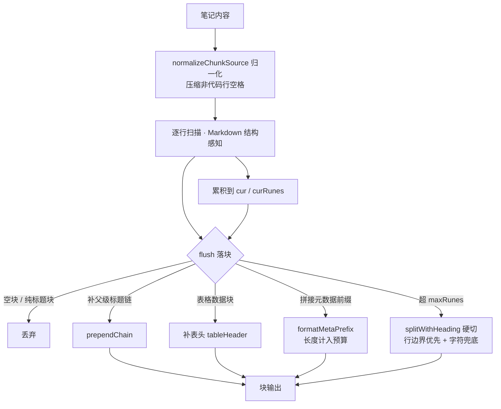
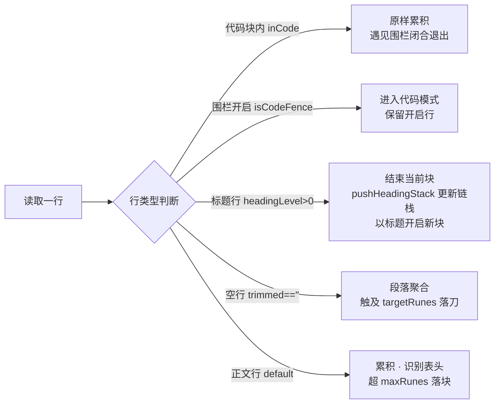

# 向量嵌入切片（分块）逻辑文档

> 权威实现：[chunk.go](chunk.go)（本文件目录内）
> 说明：本文档记录向量嵌入的切片（Chunking）逻辑，供维护与二次开发参考。切片与嵌入解耦：**先切块，再分批 embedding，最后落库**。

---

## 一、入口与调用方

单一切片函数 `ChunkContent(content string, targetRunes, maxRunes int, meta ChunkMeta) []string`（[chunk.go](chunk.go)）。

两个调用方共用同一切片口径（**口径一致性是硬约束**，见 §六）：

| 调用方 | 位置 | 用途 |
| --- | --- | --- |
| 写路径 `VectorService.IndexNotes` | [vector_service.go](vector_service.go) | 切块 → 嵌入 → 写入 `note_vectors` 表 |
| 状态比对 `VectorService.classifyVectorNotes` | [vector_service.go](vector_service.go) | 用同一口径重新切块，与存储块比对判断「需重新嵌入」 |

---

## 二、分块主流程



### 1. 归一化 `normalizeChunkSource`

- 非代码围栏行：连续 2+ 个空格/制表符折叠为 1 个、去除行尾空白——针对 PPT/PDF 转 Markdown 的表格填充空格，提升嵌入质量并省 token 预算
- 代码围栏（``` / ~~~）内的行**原样保留**，不压缩缩进，保护代码

### 2. 主循环 `switch` 分派

| 行类型 | 判定 | 行为 |
| --- | --- | --- |
| 代码块内 | `inCode` 为真 | 空行/伪标题不切块，原样累积；遇见闭合围栏退出代码模式 |
| 围栏开启 | `isCodeFence` | 进入代码模式，开启行保留 |
| 标题行 | `headingLevel > 0`（1-6 级 `#`，`#` 后须跟空格） | `flush()` 结束当前块 → 更新标题链栈 `stack`（`pushHeadingStack`）→ 以标题开启新块 |
| 空行 | `trimmed == ""` | 段落分隔保留在块内、不切块；当前块累积到触及 `targetRunes` 时在段落边界落刀 |
| 正文行 | 默认 | 若本行是表格行且下一行是分隔线 → 记录为 `tableHeader`（新表头覆盖旧）；累积超 `maxRunes` 即落块，防无限膨胀 |



### 3. flush 落块

- **空节丢弃**：块内仅一行且是标题（无正文）→ 不落块，标题留在栈中作后续父级指引
- **补父级标题链**（`prependChain`）：块首非标题补完整链；块首已是标题仅补更高级父级，避免重复
- **补表格表头**：块含表格数据行但缺表头时块首补一行表头，让"列名语义"进入嵌入
- **拼元数据前缀**（`formatMetaPrefix`：笔记标题 / 分类标签 / 创建时间 / 笔记核心内容），长度计入 maxRunes 预算
- **超限硬切**：`runeLen(prefix)+1+runeLen(text) > maxRunes` → `splitWithHeading`

```go
// splitWithHeading: 预留前缀+换行预算后，对标题链+正文部分硬切，每段再拼接 prefix + prependChain(段, stack)
budget := maxRunes - runeLen(prefix) - 1  // <1 时置 1
segs := hardSplit(text, budget)
```

---

## 三、target / max 双参数语义

| 参数 | 设置 key | 默认 | 作用 |
| --- | --- | --- | --- |
| `targetRunes` | `ai_chunk_target_rumes` | 600 | **理想块大小**，段落边界优先落刀点 |
| `maxRunes` | `ai_chunk_max_rumes` | 1500 | **单块硬上限**，仅单个不可分语义单元超限才硬切 |

- 空行分支：`curRunes >= targetRunes` → 在段落边界落刀（段落不被切断）
- 正文/代码分支：`curRunes > maxRunes` → 立即落块兜底
- flush 内硬切预算：`maxRunes`
- 防御钳制：`target>max → 降级为 max`；`max<1 → 1`；`target<1 → 1`

**定位**：target 管「平时切得多合适」，max 管「不可分单元能多大 + 最后硬切的预算」。大节整段可超 target 直到 max 保留；纯文本按段落聚合到 target。

---

## 四、硬切策略（v2：行边界优先）

`hardSplit(s, maxRunes)`（[chunk.go](chunk.go)）逐行扫描累积，**优先在完整行边界落刀**，仅单行本身超 max 才退化为字符级：

- 保留代码行 / 列表项 / 表格行 / 段内换行的完整语义，不在任意 rune 处劈开结构
- 单行超限分支走 `hardSplitRunes`（字符级兜底，不切断多字节字符）——单行是"不可再分"的物理边界，只能如此
- flush 内 `TrimSpace` + 空块过滤保留

> v1 为纯字符级硬切；v2 引入行边界优先，属"超长单块"场景的兜底质量改善（默认 max 下日常笔记几乎不触发）。

---

## 五、边界与保护

- **代码块完整性**：`inCode` 累积不落刀，超限留到 flush 整块处理（硬切在行边界/字符级兜底）
- **空节 / 纯标题块**：不产生噪音块
- **标题链栈**（`pushHeadingStack`，对齐 LlamaIndex header_stack）：`[##A,###B]` 遇 `##C` → `[##C]`，同级/更深级被取代，只留更高级父级
- **Unicode 安全**：`runeLen` = `utf8.RuneCountInString`（零分配）；字符级硬切不切断多字节字符

---

## 六、配置与口径一致性（关键约束）

- 两个 size 为**全局一值**设置项，配置链路：`db.go InitDefaultSettings` 种子 → `types.go SettingsConfig` 读写 + `clampChunkSizes` → 前端「AI 设置 → 向量嵌入连接」分组 → 运行 `VectorService.chunkSizes()` 读取
- **口径一致**：写路径 `IndexNotes` 与状态比对 `classifyVectorNotes` 共用 `chunkSizes()`（查库、错误回退默认），与设置页 `SaveAllSettings`/`GetAllSettings` 共用 `clampChunkSizes`——三处口径必须一致，否则内容未变会被误判「需重新嵌入」
- 标签排序（`sort.Strings`）保证切块确定性，避免标签顺序变化导致误判

---

## 七、检索侧衔接

- 召回命中块后补相邻块（`adjacentBlocks=1`）补偿跨块断裂，因此落库侧不设块间 overlap
- 涉及文件：`recall_service.go`、`vector_service.go`

---

## 八、测试

- [chunk_test.go](chunk_test.go)：结构感知、target/max 双参数、防御钳制、行边界硬切、性能（大输入无 panic）
- [vector_service_test.go](vector_service_test.go)：写路径与状态比对口径
- [types_test.go](types_test.go)：设置项 clamp 落库读回

---

## 九、维护注意

1. 修改切块输出会触发存量向量判「需重新嵌入」一次（自愈路径，数据管理页重新索引即稳定）
2. 强化新结构的硬切边界时，保持 `hardSplit`「行边界优先 + 字符兜底」的分层，勿回退纯字符级
3. 测试断言勿依赖「字符级切形巧合」，应验证行为本质
4. 更换嵌入模型（尤其小上下文模型）时需复核 `max` 是否超新模型上下文上限